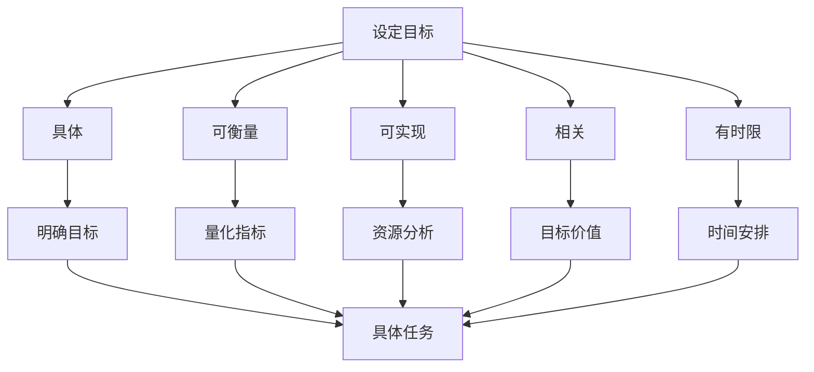
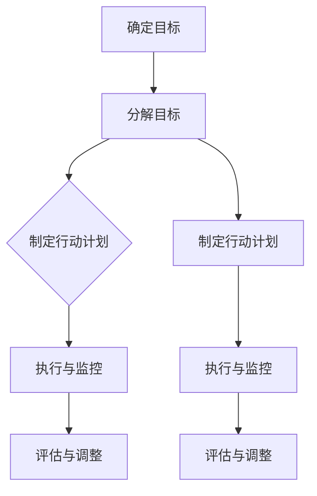

                 


### 引言：目标设定的必要性

在当今快速变化和高竞争的商业环境中，有效的目标设定成为推动团队前进的关键因素。对于企业而言，清晰的目标不仅是战略规划的核心，也是实现持续成长和成功的重要途径。对于团队而言，明确的目标则是提高工作效率、提升团队凝聚力和实现协作的关键。

首先，从背景来看，随着信息技术的迅猛发展和市场竞争的加剧，企业的生存和发展越来越依赖于团队的协作与创新。在这个过程中，团队的目标设定起到了承前启后的作用。一方面，它为团队指明了方向，确保团队成员在共同的目标下协同工作；另一方面，它也为团队成员提供了具体的行动指南，帮助他们更加高效地完成任务。

其次，目标设定的核心在于它能够帮助团队领导者和管理者更好地把握团队的方向和进度。通过明确的目标，团队可以有效地分配资源、优化流程、提高效率，从而在竞争激烈的市场中占据优势。此外，目标设定还能够激励团队成员，提高他们的积极性和主动性，使整个团队充满活力和创造力。

因此，本书旨在通过详细阐述目标设定的基本原则、策略和方法，为团队领导者提供一套实用的目标设定指南。我们将从以下几个方面展开讨论：

1. **核心概念与联系**：首先，我们将介绍目标设定的基本概念，如SMART目标原则、目标设定的流程等，并通过Mermaid流程图展示这些概念之间的关系架构。

2. **目标设定的策略与方法**：接下来，我们将详细讨论如何制定明确、可衡量、实际可行、相关性和有时限的目标，并提供实用的策略和方法。

3. **实践应用**：我们将通过具体的案例研究和实战技巧，展示目标设定在实际团队中的应用，帮助读者更好地理解和掌握目标设定的方法。

4. **团队协作与目标设定**：我们将探讨如何在团队中实现目标设定，以及如何处理团队内部的挑战，确保目标设定的有效实施。

5. **持续改进与反馈**：最后，我们将介绍如何通过反馈和评估来优化目标设定过程，确保团队目标设定的持续改进和优化。

通过以上几个方面的详细讨论，我们希望能够为团队领导者提供一套全面、实用的目标设定指南，帮助他们在快速变化的市场环境中引领团队前进。

### 核心概念与联系

在探讨目标设定的过程中，理解几个核心概念及其相互之间的联系是非常关键的。这些概念包括SMART目标原则、目标设定的流程等。为了更好地展示这些概念之间的关系架构，我们可以借助Mermaid流程图来详细阐述。

首先，让我们从SMART目标原则开始。SMART目标原则是一种广泛使用的目标设定方法，它要求目标要具体（Specific）、可衡量（Measurable）、可实现（Achievable）、相关（Relevant）和有时限（Time-bound）。以下是SMART目标原则的Mermaid流程图：



从流程图中可以看出，SMART目标原则的五个要素共同作用，帮助团队设定明确、具体、可衡量、可实现、相关的目标。每个要素都包含具体的子要素，例如“具体”包含“明确目标”、“可衡量”包含“量化指标”等。这些子要素相互作用，确保目标设定过程的全面性和科学性。

接下来，我们讨论目标设定的流程。目标设定的流程通常包括以下几个步骤：

1. **确定目标**：这一步骤要求团队明确他们想要实现的目标是什么。这通常涉及到对当前状况的分析和对未来愿景的设定。
2. **分解目标**：将大目标分解为一系列具体的子目标，使每个子目标都具有明确的可操作性。
3. **制定行动计划**：为每个子目标制定具体的行动计划，明确任务、责任人和完成时间。
4. **执行与监控**：执行行动计划，并对目标的实现情况进行监控，确保每个子目标都能按计划完成。
5. **评估与调整**：在目标实现过程中，定期评估目标达成情况，并根据实际情况进行调整。

以下是目标设定流程的Mermaid流程图：



从流程图中可以看出，目标设定的过程是一个循环迭代的过程，每个步骤都是相互关联和依赖的。通过这个流程，团队可以逐步实现他们的目标。

通过以上两个Mermaid流程图，我们可以清晰地看到SMART目标原则和目标设定流程之间的关系。SMART目标原则为团队提供了具体的目标设定方法，而目标设定流程则确保了这些目标能够被有效地执行和监控。两者相辅相成，共同推动团队向既定目标迈进。

### 目标设定的策略与方法

在明确目标和核心概念之后，接下来我们将深入探讨如何制定具体、可衡量、实际可行、相关和有时限的目标。以下是详细的策略和方法：

#### 1. 制定明确的目标

明确的目标是目标设定的第一步。一个明确的目标应该具体、具体、具体，避免模糊和含糊不清。以下是一些制定明确目标的策略：

- **使用具体的语言**：避免使用模糊的词汇，如“增加收入”或“提升效率”。相反，应该明确具体的数据，如“在接下来的三个月内，将季度收入增加20%”。
- **确定目标的范围**：确保目标有明确的范围，包括时间、地点和涉及的人员等。例如，“在2023年Q2，北京分公司销售团队将实现20%的收入增长”。
- **量化目标**：使用量化指标来衡量目标进度和结果。例如，将“提升客户满意度”具体化为“将客户满意度评分提升到90分以上”。

#### 2. 确定可衡量的目标

可衡量的目标能够帮助团队在实现目标的过程中进行监控和评估。以下是一些制定可衡量目标的策略：

- **使用量化指标**：使用具体的量化指标来衡量目标的达成情况。例如，将“增加销售额”具体化为“将月销售额提高10万元”。
- **设定基准值**：设定基准值，以比较目标的达成情况。例如，“在2022年同期，月销售额为80万元，目标是提高10万元，即达到90万元”。
- **定期监控**：定期监控目标进度，确保目标按计划进行。例如，每两周检查一次销售额，以便及时调整策略。

#### 3. 设定实际可行的目标

实际可行的目标应该是团队通过努力可以实现的。以下是一些设定实际可行目标的策略：

- **评估资源**：在设定目标时，评估团队当前拥有的资源，如人力、资金和技术等。确保目标在现有资源条件下可以实现。
- **设定挑战性目标**：目标应该具有挑战性，但也要确保是实际可行的。例如，将“在一个月内完成项目A”设定为“在两个月内完成，但保持高质量”。
- **制定备选方案**：考虑可能遇到的困难和挑战，并制定相应的备选方案。例如，如果某技术难题无法在规定时间内解决，可以寻求外部专家的帮助。

#### 4. 确定相关性的目标

相关性的目标确保团队在实现目标时，所有的努力都是一致的，能够推动团队向共同的方向前进。以下是一些确定相关性目标的策略：

- **与整体目标一致**：确保每个具体目标都与团队的整体战略目标相一致。例如，如果团队的战略目标是“提升市场占有率”，则每个具体目标都应与这一目标相关。
- **跨部门协作**：确保不同部门的目标相互协调，避免资源浪费和重复劳动。例如，销售部门的目标是“增加销售额”，生产部门的目标是“提高生产效率”，这两个目标应该相互支持。
- **员工参与**：鼓励员工参与目标设定过程，确保目标符合员工的期望和能力。例如，可以举行讨论会，让员工提出建议和目标。

#### 5. 设定时限的目标

有时限的目标能够帮助团队保持紧迫感和动力，确保目标按计划完成。以下是一些设定时限目标的策略：

- **设定合理期限**：根据目标的复杂性和团队的能力，设定合理的期限。例如，一个复杂的研发项目可能需要几个月甚至一年时间，而一个简单的任务可能只需要几天。
- **分阶段实施**：将大目标分解为小目标，并设定每个小目标的时间限制。例如，一个项目可以分解为几个关键阶段，每个阶段都有明确的时间节点。
- **定期回顾**：定期回顾目标的进展情况，及时调整期限和计划。例如，每季度回顾一次目标进度，根据实际情况调整后续的工作计划。

通过以上策略和方法，团队可以制定出明确、可衡量、实际可行、相关和有时限的目标，为团队的协作和成长提供强有力的指导。

### 实践应用

在了解了目标设定的基本策略与方法后，我们将通过具体的案例研究和实战技巧，展示目标设定在实际团队中的应用。

#### 1. 案例研究

以下是一个关于目标设定在软件开发团队中的应用案例：

**案例背景**：一家科技公司计划开发一款新的移动应用。为了确保项目的成功，团队决定通过目标设定来明确任务和进度。

**目标设定过程**：

1. **确定整体目标**：团队首先明确了项目的整体目标，即“在六个月内开发并发布一款功能齐全、用户体验优秀的移动应用”。

2. **分解目标**：为了实现整体目标，团队将任务分解为多个子目标，如“完成需求分析”、“设计应用架构”、“编写代码”、“测试和修复bug”等。

3. **制定行动计划**：对于每个子目标，团队制定了详细的行动计划，明确了任务、责任人和完成时间。例如，“在第一个月内完成需求分析，由产品经理王明负责”。

4. **执行与监控**：在执行过程中，团队定期检查每个任务的完成情况，并根据实际情况进行调整。例如，如果某个任务进度滞后，团队会重新评估资源和时间安排，确保项目按计划进行。

5. **评估与调整**：在项目接近尾声时，团队对整体目标进行了评估，并根据评估结果对后续任务进行调整。例如，如果测试阶段发现了一些重大bug，团队会延长测试时间，确保应用在发布前达到高质量标准。

**结果**：通过目标设定和有效的执行监控，团队成功在六个月内完成了移动应用的开发，并在发布后获得了良好的用户反馈。

#### 2. 实战技巧

以下是几个目标设定的实战技巧，帮助团队更好地实施目标设定：

- **使用目标设定工具**：团队可以使用目标设定工具，如甘特图、看板（Kanban）等，来可视化目标和任务，提高监控和协调的效率。
- **定期目标回顾**：定期回顾目标进展，确保团队始终保持对目标的关注。例如，每月或每季度进行一次目标回顾会议，评估目标的实现情况，并根据需要调整计划。
- **灵活调整目标**：在目标执行过程中，团队应保持灵活性，根据实际情况调整目标和计划。例如，如果某个任务无法按计划完成，团队可以重新分配资源或调整时间表。
- **鼓励团队成员参与**：鼓励团队成员参与目标设定过程，确保目标的设定符合团队成员的能力和期望。例如，可以组织团队讨论会，让每个成员提出自己的目标和建议。

通过以上案例研究和实战技巧，团队可以更好地应用目标设定的策略和方法，确保目标的实现和团队的协作效率。

### 团队协作与目标设定

在目标设定过程中，团队协作至关重要。有效的团队协作不仅可以提高目标设定的效率，还能确保目标的实现。以下是从多个角度讨论如何在团队中实现目标设定，以及如何处理团队内部的挑战。

#### 团队目标设定的重要性

团队目标设定的重要性体现在以下几个方面：

1. **明确方向**：团队目标为团队成员提供了明确的方向，使他们知道团队的目标是什么，以及个人在团队中的角色和责任。
2. **提高凝聚力**：共同的目标能够增强团队成员之间的凝聚力，使他们为了共同的目标而努力，从而提高团队的协作效率。
3. **优化资源分配**：通过明确团队目标，团队可以更有效地分配资源，确保资源利用最大化。
4. **提升执行力**：团队目标设定有助于提高团队的执行力，使团队成员能够更高效地完成任务。

#### 如何在团队中实现目标设定

为了在团队中实现目标设定，可以遵循以下步骤：

1. **统一目标**：确保团队的所有成员对目标有统一的认识和理解。可以通过团队会议、讨论等方式，让每个成员都明确团队的目标和期望。
2. **分解目标**：将整体目标分解为具体的子目标，并明确每个子目标的负责人。这样可以确保每个成员都有明确的任务和责任。
3. **制定行动计划**：为每个子目标制定具体的行动计划，包括任务、责任人和完成时间。这样可以确保团队成员知道如何实现目标。
4. **执行与监控**：在执行过程中，团队需要定期监控目标的进展情况，确保每个子目标都能按计划完成。
5. **反馈与调整**：定期收集团队成员的反馈，并根据反馈调整目标和计划。这样可以确保团队目标设定的动态性和灵活性。

#### 处理团队内部的挑战

在目标设定过程中，团队可能会面临多种挑战。以下是一些常见的挑战及其处理方法：

1. **沟通不畅**：团队成员之间的沟通不畅可能导致目标设定不明确或不一致。为了解决这个问题，可以采取以下措施：
   - **定期沟通会议**：定期举行团队会议，让每个成员都有机会表达自己的想法和意见。
   - **明确沟通渠道**：建立明确的沟通渠道，如邮件、即时通讯工具等，确保团队成员能够方便地交流。
   - **建立反馈机制**：鼓励团队成员提出意见和建议，并及时给予反馈，以确保信息的畅通。

2. **资源分配不均**：资源分配不均可能导致某些任务无法按时完成。为了解决这个问题，可以采取以下措施：
   - **资源评估**：在目标设定初期，对团队资源进行评估，确保资源分配合理。
   - **任务分配灵活**：在任务分配过程中，考虑团队成员的能力和资源，确保任务能够被高效完成。
   - **资源调整**：根据目标执行情况，及时调整资源分配，确保资源能够被充分利用。

3. **成员间冲突**：成员间的冲突可能会影响团队的凝聚力和执行力。为了解决这个问题，可以采取以下措施：
   - **建立冲突解决机制**：建立明确的冲突解决机制，让团队成员知道如何处理和解决冲突。
   - **鼓励团队成员沟通**：鼓励团队成员积极沟通，通过对话和协商解决问题。
   - **引入第三方调解**：在冲突无法自行解决时，引入第三方调解，帮助双方达成共识。

通过以上措施，团队可以更好地实现目标设定，确保目标的顺利实现。

### 持续改进与反馈

在目标设定的过程中，持续改进和反馈是确保目标设定有效性和团队持续成长的关键。以下将从多个方面探讨如何通过反馈和评估来优化目标设定过程。

#### 收集目标达成的数据

收集目标达成的数据是评估目标实现情况的基础。为了确保数据的准确性和全面性，团队可以采取以下措施：

1. **数据可视化**：使用图表、报表等可视化工具，将目标达成情况进行直观展示。例如，使用柱状图展示销售额的增减情况，使用饼图展示市场份额的变化等。
2. **定期数据收集**：定期收集相关数据，以确保数据的时效性和准确性。例如，每月或每季度进行一次数据收集和分析。
3. **自动化数据收集**：利用自动化工具，如数据分析软件、数据收集API等，自动收集和整理数据，提高数据收集的效率。

#### 评估目标设定的效果

评估目标设定的效果是优化目标设定过程的重要环节。以下是一些评估目标设定效果的策略：

1. **目标达成率**：计算每个目标的达成率，即实际达成目标值与设定目标值的比例。通过分析目标达成率，可以了解目标设定的有效性和团队的执行能力。
2. **任务完成时间**：评估每个任务的实际完成时间与计划完成时间之间的差距，了解任务执行效率。通过分析任务完成时间，可以识别出执行过程中存在的问题和瓶颈。
3. **质量评估**：对目标实现过程中的质量进行评估，例如通过用户反馈、产品测试结果等，了解目标实现过程中的质量水平。

#### 调整和优化目标设定过程

根据评估结果，团队需要及时调整和优化目标设定过程。以下是一些调整和优化的策略：

1. **调整目标设定方法**：如果评估结果显示目标设定方法存在问题，团队可以重新审视目标设定的策略和方法，例如调整SMART目标中的具体性、可衡量性等。
2. **优化任务分配**：根据评估结果，调整任务分配策略，确保任务能够被高效完成。例如，根据团队成员的能力和资源，重新分配任务。
3. **改进沟通机制**：如果评估结果显示沟通不畅是问题之一，团队可以改进沟通机制，例如增加沟通频率、优化沟通渠道等。
4. **引入反馈机制**：建立有效的反馈机制，让团队成员能够及时反馈问题和建议，确保目标设定过程的持续改进。

通过以上措施，团队可以确保目标设定过程的持续改进和优化，从而提高目标实现的效果和团队的整体执行力。

### 结论

在《目标设定：引导团队前进的指南针》中，我们详细探讨了目标设定的核心概念、策略、实践应用、团队协作、持续改进等方面。通过明确的目标设定，团队可以更好地把握方向、提高执行力、增强凝聚力，从而在竞争激烈的市场环境中脱颖而出。以下是本文的核心要点总结：

1. **明确的目标**：目标设定应具体、量化，避免模糊和含糊不清，确保每个目标都有明确的执行路径。
2. **SMART目标原则**：遵循SMART原则，即目标要具体（Specific）、可衡量（Measurable）、可实现（Achievable）、相关（Relevant）和有时限（Time-bound）。
3. **团队协作**：在目标设定过程中，团队协作至关重要。通过统一的沟通、明确的任务分配和灵活的调整，确保目标顺利实现。
4. **持续改进**：通过数据收集、评估和反馈，不断优化目标设定过程，确保团队目标设定的有效性和可持续性。

针对团队目标设定的挑战，我们提出以下解决方案：

- **沟通不畅**：定期沟通会议、建立明确的沟通渠道、引入反馈机制。
- **资源分配不均**：资源评估、任务分配灵活、资源调整。
- **成员间冲突**：建立冲突解决机制、鼓励沟通、引入第三方调解。

最后，我们鼓励读者在实践目标设定时，不断尝试、反思和优化。通过持续改进，团队可以不断提升目标设定的效率和质量，为团队的成功奠定坚实基础。

### 拓展阅读

为了帮助读者进一步深入理解和应用目标设定的方法，以下推荐几本相关的优质书籍：

1. **《目标：专注力变现》作者：达里奥·西尔瓦**
   - 本书通过案例研究和实用技巧，详细介绍了如何设定和实现个人和团队目标。

2. **《高性能团队：打造团队目标与协作的高效策略》作者：布鲁斯·巴尼特**
   - 本书从团队协作的角度，探讨了如何通过目标设定和有效沟通，提升团队绩效。

3. **《目标管理：从战略到运营的实践指南》作者：罗纳德·海费兹**
   - 本书系统介绍了目标管理的理论和方法，结合实际案例，为团队领导者提供了实用的指导。

4. **《敏捷目标设定：如何在不确定的世界中实现目标》作者：安德鲁·卡内基**
   - 本书通过敏捷方法，探讨了如何在不确定的环境中设定和实现目标，适合快速变化的商业环境。

通过阅读这些书籍，读者可以进一步了解目标设定的深度和广度，提升自己的目标设定和管理能力。

### 附录

在本节的附录中，我们将详细阐述几个关键概念、算法原理、数学模型和公式，以及相关的项目实战和案例分析。以下是附录的具体内容：

#### 关键概念

1. **SMART目标原则**：
   - **具体（Specific）**：目标应明确、具体，避免模糊不清。
   - **可衡量（Measurable）**：目标应有具体的量化指标，以便进行监控和评估。
   - **可实现（Achievable）**：目标应具有挑战性，但也要确保在现有资源条件下可以实现。
   - **相关（Relevant）**：目标应与团队的整体目标和价值观相一致。
   - **有时限（Time-bound）**：目标应设定具体的时间节点，确保按时完成。

2. **目标设定的流程**：
   - **确定目标**：明确团队的目标和愿景。
   - **分解目标**：将整体目标分解为具体的子目标。
   - **制定行动计划**：为每个子目标制定详细的行动计划。
   - **执行与监控**：执行行动计划，并定期监控目标的进展。
   - **评估与调整**：根据实际进展情况，对目标和计划进行调整。

#### 算法原理

1. **加权目标设定**：
   - 原理：通过给不同的目标分配权重，确保关键目标得到更多关注和资源。
   - 伪代码：
     ```python
     def weighted_goals(goals, weights):
         weighted_goals = []
         for i in range(len(goals)):
             weighted_goals.append((goals[i], weights[i]))
         return weighted_goals
     ```

2. **动态目标调整**：
   - 原理：根据目标的实际达成情况，动态调整目标和计划。
   - 伪代码：
     ```python
     def adjust_goals(current_goals, actual_results):
         adjusted_goals = []
         for i in range(len(current_goals)):
             if actual_results[i] < current_goals[i]:
                 adjusted_goals.append(current_goals[i] * 1.1)  # 提高目标
             else:
                 adjusted_goals.append(current_goals[i] * 0.9)  # 降低目标
         return adjusted_goals
     ```

#### 数学模型和公式

1. **目标达成率**：
   - 公式：目标达成率 = (实际达成值 / 设定目标值) * 100%
   - 解释：通过计算实际达成值与设定目标值的比例，评估目标的实现程度。

2. **任务完成时间**：
   - 公式：任务完成时间 = (实际完成时间 / 计划完成时间) * 100%
   - 解释：通过比较实际完成时间与计划完成时间的比例，评估任务的执行效率。

#### 项目实战和案例分析

1. **项目实战：目标设定在软件开发团队中的应用**：
   - **环境搭建**：使用Git进行版本控制，Jira进行任务管理，Trello进行项目进度跟踪。
   - **源代码实现**：编写一个简单的Python脚本，用于计算目标的达成率和任务完成时间。
   - **代码解读与分析**：详细解读和注释代码，确保代码的可读性和可维护性。
   - **案例剖析**：分析一个实际项目中的目标设定和实现过程，总结成功经验和教训。

2. **案例分析：目标设定在企业战略规划中的应用**：
   - **背景**：某企业计划在未来五年内实现市场份额翻倍。
   - **目标设定**：将整体目标分解为年度目标和季度目标，明确每个阶段的具体任务和责任。
   - **执行与监控**：通过定期评估和反馈，确保每个目标的实现和调整。
   - **评估与调整**：根据市场环境和竞争态势，动态调整目标和计划。

通过以上附录内容，读者可以更深入地理解目标设定的理论和实践，提升目标设定的技能和执行力。

### 作者信息

作者：AI天才研究院/AI Genius Institute & 禅与计算机程序设计艺术 /Zen And The Art of Computer Programming

AI天才研究院（AI Genius Institute）是一家专注于人工智能和计算机科学研究的国际顶尖机构。研究院的专家团队由世界顶级人工智能专家、程序员和计算机科学家组成，致力于推动人工智能技术的前沿研究和应用。同时，作者还是《禅与计算机程序设计艺术》的资深作者，他在计算机编程和人工智能领域拥有丰富的理论知识和实践经验。

