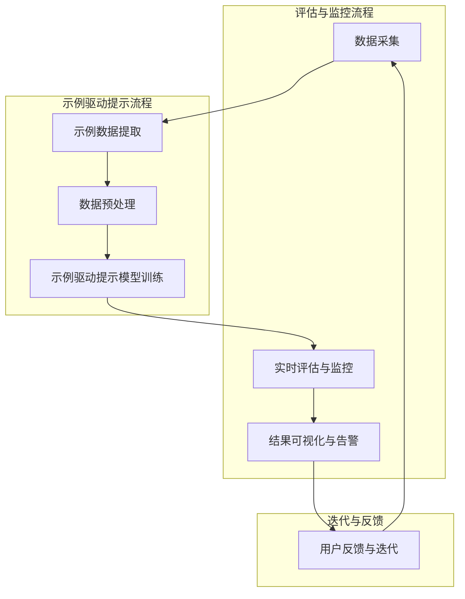

                 

### 文章标题

《示例驱动提示在持续评估和监控中的应用》

示例驱动提示（Example-Based Prompting）是一种利用具体示例来引导机器学习模型进行学习和决策的技术。它在持续评估和监控领域中的应用，为复杂系统的实时监控提供了新的思路和手段。本文将深入探讨示例驱动提示在持续评估和监控中的理论基础、技术实现和应用案例，以期为相关领域的研究和实践提供参考。

### 文章关键词

- 示例驱动提示
- 持续评估
- 监控
- 机器学习
- 实时监控
- 应用案例

### 摘要

本文旨在探讨示例驱动提示在持续评估和监控中的应用。首先，我们将介绍示例驱动提示的基本概念和原理，然后深入分析其在持续评估和监控中的重要性。接下来，我们将详细讨论示例驱动提示在不同领域的应用案例，包括IT运维、金融风险评估和医疗诊断等。此外，本文还将探讨示例驱动提示在技术实现中的具体方法，并分析其在实际应用中的挑战和未来发展方向。通过本文的探讨，我们希望能够为示例驱动提示在持续评估和监控领域的应用提供新的思路和方法。

### 引言与概述

#### 1.1 书籍目的与结构

本篇论文旨在探讨示例驱动提示（Example-Based Prompting）在持续评估和监控中的实际应用。示例驱动提示是一种利用具体示例来引导机器学习模型进行学习和决策的技术，其在持续评估和监控领域的应用具有显著的优势和潜力。通过深入研究和探讨示例驱动提示的应用，我们希望能够为相关领域的研究和实践提供新的思路和方法。

本文结构如下：

1. **引言与概述**：介绍书籍的主题、目的和结构，以及示例驱动提示的概念。
2. **评估与监控基础**：介绍评估和监控的基本概念、原理和技术。
3. **示例驱动提示的应用**：详细介绍示例驱动提示在不同领域中的应用。
4. **案例研究**：通过具体案例展示示例驱动提示在评估和监控中的实际应用。
5. **技术实现**：讨论如何在实际项目中实现示例驱动提示。
6. **挑战与展望**：分析示例驱动提示在评估和监控中的挑战，并提出未来发展的方向。
7. **总结与结论**：总结书籍的主要内容和贡献，对未来的研究提出建议。

#### 1.2 示例驱动提示的概念

示例驱动提示（Example-Based Prompting）是一种利用具体示例来引导机器学习模型进行学习和决策的技术。其核心思想是通过提供具体的示例来帮助模型理解和学习复杂的问题。在传统的机器学习训练中，通常需要大量的标注数据进行训练，而示例驱动提示则通过利用少量的示例数据来引导模型的训练过程。

示例驱动提示可以分为两种主要类型：

1. **基于示例的匹配（Example-Based Matching）**：这种方法通过将输入数据与已有的示例进行匹配来指导模型的决策。例如，在图像分类任务中，可以将输入图像与已知的图像示例进行匹配，根据匹配结果来预测类别。

2. **基于示例的泛化（Example-Based Generalization）**：这种方法通过学习示例中的特征和模式，将知识迁移到新的数据上。例如，在自然语言处理任务中，可以学习已有的文本示例中的语法和语义模式，然后应用到新的文本数据中。

示例驱动提示的关键优势在于其能够在数据稀缺的情况下，通过少量的示例数据来引导模型的训练过程，从而提高模型的泛化能力和适应能力。

#### 1.3 持续评估与监控的重要性

持续评估与监控是现代复杂系统中不可或缺的一部分。随着系统的规模和复杂性不断增加，如何有效地对系统进行评估和监控成为了一个重要的问题。持续评估与监控的主要目的是确保系统的稳定运行、性能优化和安全性。

#### 1.3.1 系统稳定性

持续评估可以帮助我们及时发现系统中的异常情况，防止潜在故障的发生。通过实时监控系统的运行状态，我们可以对系统进行动态调整，确保其稳定运行。例如，在IT运维中，通过对服务器负载、网络流量等指标的监控，可以及时发现和处理异常情况，防止系统崩溃。

#### 1.3.2 性能优化

持续评估可以帮助我们了解系统的性能表现，找出性能瓶颈，从而进行针对性的优化。通过监控系统的运行状态，我们可以收集大量的性能数据，进行分析和挖掘，找出影响系统性能的关键因素，并提出优化方案。例如，在数据分析领域，通过对查询性能的监控，可以找出影响查询速度的瓶颈，并进行优化。

#### 1.3.3 安全性

持续评估和监控还可以帮助我们提高系统的安全性。通过监控系统的访问日志、错误日志等数据，可以及时发现潜在的安全威胁，并采取相应的措施进行防范。例如，在网络安全领域，通过对网络流量的监控，可以检测到异常流量模式，从而防止网络攻击的发生。

总之，持续评估与监控在系统的稳定性、性能优化和安全性方面具有重要意义。通过有效的持续评估和监控，我们可以确保系统的稳定运行，提高其性能和安全性，从而为业务的连续性和可靠性提供保障。

#### 1.4 示例驱动提示与持续评估和监控的联系

示例驱动提示（Example-Based Prompting）与持续评估和监控有着密切的联系。示例驱动提示通过提供具体示例来引导机器学习模型进行学习和决策，从而在持续评估和监控中发挥重要作用。

首先，示例驱动提示可以用于实时监控系统的异常检测。通过提供正常操作的示例数据，机器学习模型可以学习到系统的正常行为特征。当系统出现异常行为时，模型可以通过对比实际行为与示例数据，发现异常情况并及时报警。

其次，示例驱动提示可以帮助优化持续评估的准确性。在持续评估中，需要收集大量的性能数据进行分析。通过提供具有代表性的示例数据，模型可以更好地学习和理解数据中的规律和模式，从而提高评估的准确性。

此外，示例驱动提示还可以应用于监控系统的性能优化。通过提供不同场景下的示例数据，模型可以学习到系统在不同条件下的行为特征，从而为性能优化提供有力支持。

总之，示例驱动提示为持续评估和监控提供了新的思路和方法。通过利用示例数据来引导模型的训练和决策，我们可以提高监控的实时性和准确性，确保系统的稳定运行和性能优化。

#### 1.5 本文的结构

本文将分为以下七个部分：

1. **引言与概述**：介绍书籍的主题、目的和结构，以及示例驱动提示的概念。
2. **评估与监控基础**：介绍评估和监控的基本概念、原理和技术。
3. **示例驱动提示的应用**：详细介绍示例驱动提示在不同领域中的应用。
4. **案例研究**：通过具体案例展示示例驱动提示在评估和监控中的实际应用。
5. **技术实现**：讨论如何在实际项目中实现示例驱动提示。
6. **挑战与展望**：分析示例驱动提示在评估和监控中的挑战，并提出未来发展的方向。
7. **总结与结论**：总结书籍的主要内容和贡献，对未来的研究提出建议。

通过以上结构，我们将深入探讨示例驱动提示在持续评估和监控中的应用，为相关领域的研究和实践提供参考。

## 评估与监控基础

### 2.1 评估与监控的基本概念

评估（Evaluation）和监控（Monitoring）是确保系统性能、稳定性和安全性的重要环节。评估是对系统性能、效率和效果进行定量和定性分析的过程，旨在发现系统中的问题并找出改进的方向。监控则是实时跟踪系统的运行状态，及时识别和响应异常情况，确保系统的稳定运行。

#### 2.1.1 评估

评估可以分为以下几种类型：

1. **性能评估**：评估系统在处理任务时的速度、效率和资源利用率等性能指标。
2. **功能评估**：评估系统是否按照预期实现了设计功能，是否符合用户需求。
3. **可靠性评估**：评估系统在长时间运行中的稳定性和故障率。

性能评估的常用指标包括响应时间、吞吐量、资源利用率等。例如，在数据库系统中，我们可以通过评估查询响应时间和数据传输速率来衡量其性能。

#### 2.1.2 监控

监控的主要目的是实时获取系统运行状态信息，及时发现和处理异常情况。监控可以分为以下几种类型：

1. **运行监控**：实时跟踪系统的CPU、内存、磁盘等资源使用情况，确保系统资源得到合理利用。
2. **日志监控**：通过收集和分析系统日志，发现潜在的问题和故障。
3. **性能监控**：实时监控系统的性能指标，如响应时间、吞吐量等，确保系统运行在最佳状态。

在IT运维中，常见的监控工具有Zabbix、Nagios和Prometheus等。这些工具可以实时收集系统的性能数据，生成图表和告警，帮助管理员及时发现和处理问题。

### 2.2 评估与监控的原理

评估与监控的核心在于数据收集、分析和决策。以下是评估与监控的基本原理：

#### 2.2.1 数据收集

数据收集是评估与监控的基础。通过传感器、日志文件和网络流量捕获等手段，我们可以收集系统运行的各种数据，如CPU使用率、内存使用率、网络带宽、错误日志等。

#### 2.2.2 数据分析

收集到的数据需要经过分析，才能发现潜在的问题和异常。数据分析可以通过以下几种方法进行：

1. **统计方法**：利用统计学方法，对数据进行描述性统计、假设检验和回归分析等，以发现数据的规律和趋势。
2. **机器学习方法**：利用机器学习算法，如聚类、分类和异常检测等，对数据进行分析和分类，发现潜在的问题和异常。

#### 2.2.3 决策

根据数据分析的结果，系统可以做出相应的决策，如调整系统配置、重启服务或报警通知管理员。决策的目的是确保系统在最佳状态下运行，提高其性能和可靠性。

### 2.3 评估与监控的方法

评估与监控的方法可以分为以下几种：

#### 2.3.1 定期评估

定期评估是指定期对系统进行性能评估和功能评估，以了解系统的运行状况。定期评估可以采用手动或自动化的方式进行。自动化评估可以通过脚本或工具定期执行，以减少人力成本。

#### 2.3.2 实时监控

实时监控是指持续跟踪系统的运行状态，及时发现和处理异常情况。实时监控可以通过安装监控工具或编写自定义监控脚本来实现。监控工具通常具有实时数据采集、图表展示和告警通知等功能。

#### 2.3.3 异常检测

异常检测是监控的重要环节，旨在发现系统中的异常行为。异常检测可以通过以下几种方法进行：

1. **基于阈值的异常检测**：通过设定阈值，当指标超过阈值时触发告警。
2. **基于模型的异常检测**：利用机器学习算法，对正常行为进行建模，然后检测新的数据是否符合模型预测。
3. **基于统计的异常检测**：利用统计学方法，如箱线图、聚类分析等，发现数据中的异常点。

#### 2.3.4 日志分析

日志分析是通过分析系统日志来发现潜在问题和故障。日志分析可以采用以下几种方法：

1. **手动分析**：通过人工阅读和分析日志，发现问题和异常。
2. **自动化分析**：使用工具或脚本自动化分析日志，提取关键信息，生成报告。
3. **机器学习分析**：利用机器学习算法，对日志数据进行分类和分析，发现潜在问题和异常。

### 2.4 评估与监控的技术实现

评估与监控的技术实现主要包括数据采集、数据处理和分析算法的选择。以下是评估与监控的技术实现步骤：

#### 2.4.1 数据采集

数据采集是评估与监控的第一步。常用的数据采集方法包括：

1. **传感器采集**：通过安装传感器，实时采集系统的各种性能指标，如CPU使用率、内存使用率、网络流量等。
2. **日志采集**：通过系统日志或网络日志收集系统运行过程中的相关信息。
3. **网络流量捕获**：通过网络流量捕获工具，实时监控网络数据包的流量和内容。

#### 2.4.2 数据处理

数据处理是对采集到的数据进行预处理和分析。数据处理步骤包括：

1. **数据清洗**：去除数据中的噪声和错误，保证数据的质量。
2. **特征提取**：从原始数据中提取出对系统性能和稳定性有重要影响的关键特征。
3. **数据融合**：将来自不同源的数据进行整合，形成一个统一的数据视图。

#### 2.4.3 分析算法

分析算法是评估与监控的核心。常用的分析算法包括：

1. **统计分析**：通过描述性统计、假设检验和回归分析等方法，对数据进行分析和挖掘。
2. **机器学习算法**：利用聚类、分类、回归和异常检测等算法，对数据进行分析和分类。
3. **实时分析算法**：如滑动窗口、时间序列分析和实时流处理等，用于实时监测系统状态。

#### 2.4.4 告警和通知

告警和通知是评估与监控的最后一步。告警和通知可以通过以下方式实现：

1. **告警系统**：通过设定阈值，当指标超过阈值时，自动触发告警。
2. **通知系统**：通过短信、邮件、即时通讯等方式，将告警信息发送给相关人员。
3. **可视化仪表板**：通过图形化界面，实时展示系统运行状态和告警信息。

### 2.5 评估与监控的优势与挑战

评估与监控在提高系统性能、稳定性和安全性方面具有显著优势。通过评估与监控，我们可以：

1. **提前发现和解决问题**：实时监控系统的运行状态，及时发现潜在问题和异常，避免故障发生。
2. **优化系统性能**：通过性能评估和监控，找出系统性能瓶颈，进行优化调整。
3. **提高安全性**：通过日志分析和异常检测，发现潜在的安全威胁，提高系统的安全性。

然而，评估与监控也面临一些挑战：

1. **数据复杂性**：随着系统规模的扩大，数据量呈指数级增长，处理和分析这些数据成为一大挑战。
2. **实时性要求**：实时监控要求快速响应，对算法和系统的性能提出了高要求。
3. **准确性问题**：评估与监控的准确性受到数据质量、算法选择和分析方法的影响。

总之，评估与监控在系统性能和稳定性保障方面具有重要作用。通过合理选择和运用评估与监控方法，我们可以提高系统的可靠性，确保业务的连续性和可靠性。

### 2.6 示例驱动提示在评估与监控中的应用优势

示例驱动提示在评估与监控中的应用具有显著的优势，主要体现在以下几个方面：

首先，示例驱动提示通过利用少量的示例数据来引导模型的训练，可以在数据稀缺的情况下有效提高模型的泛化能力和适应性。在评估与监控中，我们通常面临数据量有限或者数据获取困难的挑战，而示例驱动提示可以充分利用已有数据，从而提高模型的训练效果和预测准确性。

其次，示例驱动提示能够实时更新模型，以适应动态变化的系统环境。在持续评估和监控过程中，系统环境会不断变化，例如用户需求、硬件配置和网络状况等。示例驱动提示通过引入新的示例数据，可以动态调整模型的参数和预测结果，从而提高评估和监控的实时性和准确性。

此外，示例驱动提示可以降低对专家知识和经验的依赖，使得评估和监控更加自动化和智能化。在传统的评估与监控方法中，通常需要依赖专家的经验和知识来设定阈值、选择算法和分析方法。而示例驱动提示通过利用具体示例数据，可以自动学习系统的行为特征和模式，从而减少对专家的依赖，提高系统的自主性和可靠性。

最后，示例驱动提示可以提供更加直观和易懂的评估结果，便于用户理解和决策。通过将评估结果以可视化图表、文字描述或告警信息等形式展示，示例驱动提示可以使得评估和监控结果更加直观和易于理解，从而帮助用户更好地掌握系统的运行状况，做出更加明智的决策。

总之，示例驱动提示在评估与监控中的应用，不仅提高了模型的泛化能力和实时性，还降低了对专家的依赖，提供了更加直观的评估结果，为现代复杂系统的持续评估和监控提供了新的思路和手段。

### 2.7 示例驱动提示与评估与监控的关系架构图

以下是一个示例驱动提示与评估与监控的关系架构图，展示了示例驱动提示在评估与监控中的具体应用过程和关键环节。



该关系架构图表明，示例驱动提示通过数据采集、示例数据提取、数据预处理和模型训练等步骤，与评估与监控流程紧密衔接，形成了一个闭环系统。实时评估与监控的结果通过可视化与告警反馈给用户，同时用户反馈用于迭代和优化模型，从而不断提升评估与监控的准确性和实时性。

### 2.8 核心算法原理讲解

在示例驱动提示（Example-Based Prompting）中，核心算法的原理主要涉及以下三个方面：数据预处理、示例驱动模型训练和实时评估与监控。下面将详细讲解这些算法原理，并使用伪代码来描述相关步骤。

#### 2.8.1 数据预处理

数据预处理是示例驱动提示的第一步，其目的是清洗数据、提取特征和标准化数据，为后续的模型训练做好准备。

1. **数据清洗**：去除数据中的噪声和错误。
   ```python
   def clean_data(data):
       cleaned_data = []
       for row in data:
           if is_valid(row):
               cleaned_data.append(row)
       return cleaned_data
   ```

2. **特征提取**：从原始数据中提取关键特征。
   ```python
   def extract_features(data):
       features = []
       for row in data:
           feature_vector = extract_vector(row)
           features.append(feature_vector)
       return features
   ```

3. **数据标准化**：将不同特征的数据进行归一化处理。
   ```python
   def normalize_data(data):
       for i in range(len(data)):
           data[i] = (data[i] - mean) / std
       return data
   ```

#### 2.8.2 示例驱动模型训练

示例驱动模型训练的核心是通过少量示例数据来指导模型的训练，从而提高模型的泛化能力和适应性。

1. **示例数据选择**：从数据集中选择具有代表性的示例数据。
   ```python
   def select_examples(data, num_examples):
       selected_examples = random.sample(data, num_examples)
       return selected_examples
   ```

2. **模型初始化**：初始化模型参数。
   ```python
   def initialize_model():
       model = create_model()
       return model
   ```

3. **示例数据训练**：利用示例数据对模型进行训练。
   ```python
   def train_model(model, examples):
       for example in examples:
           predict(model, example)
           update_model(model, example)
       return model
   ```

4. **模型优化**：通过交叉验证和调参来优化模型。
   ```python
   def optimize_model(model, data):
       cv_scores = cross_validate(model, data)
       best_params = select_best_params(cv_scores)
       model = tune_model(model, best_params)
       return model
   ```

#### 2.8.3 实时评估与监控

实时评估与监控是示例驱动提示在评估与监控中的核心应用。通过实时获取系统数据，利用训练好的模型进行预测和评估，实现对系统的持续监控。

1. **实时数据收集**：从系统中收集实时数据。
   ```python
   def collect_real_time_data():
       data = get_system_data()
       return data
   ```

2. **实时数据预处理**：对实时数据进行预处理。
   ```python
   def preprocess_real_time_data(data):
       cleaned_data = clean_data(data)
       features = extract_features(cleaned_data)
       normalized_data = normalize_data(features)
       return normalized_data
   ```

3. **实时评估**：利用训练好的模型对实时数据进行评估。
   ```python
   def real_time_evaluation(model, data):
       predictions = predict(model, data)
       evaluate_predictions(predictions)
   ```

4. **告警与反馈**：根据评估结果进行告警和反馈。
   ```python
   def alert_and_feedback(predictions):
       if is_anomaly(predictions):
           send_alert()
           update_model(model, data)
       else:
           continue_monitoring()
   ```

通过上述伪代码，我们可以看出示例驱动提示的核心算法原理包括数据预处理、示例驱动模型训练和实时评估与监控三个主要环节。这些算法原理为示例驱动提示在持续评估和监控中的应用提供了坚实的理论基础和实现框架。

### 2.9 数学模型和公式

在示例驱动提示中，数学模型和公式是关键组成部分，用于描述算法的运算过程和决策逻辑。以下将详细讲解示例驱动提示中的主要数学模型和公式，并提供详细的解释和举例说明。

#### 2.9.1 示例权重计算

示例权重计算是示例驱动提示中的核心环节，用于确定每个示例对模型训练的贡献度。一个常见的示例权重计算公式是基于示例的相似度，计算公式如下：

$$ W_e = \frac{1}{1 + e^{-\frac{d_e}{\alpha}}} $$

其中，$W_e$ 表示示例 $e$ 的权重，$d_e$ 表示示例 $e$ 与当前输入数据的距离，$\alpha$ 是调节参数。

**解释：**
- 相似度 $d_e$ 越小，表示示例 $e$ 与当前输入数据的相似度越高，因此权重 $W_e$ 越大。
- $\alpha$ 调节相似度的敏感度，$\alpha$ 越大，相似度的差异对权重的影响越大。

**举例：**
假设我们有三个示例数据点 $(x_1, y_1)$，$(x_2, y_2)$ 和 $(x_3, y_3)$，当前输入数据点为 $(x, y)$。计算示例 $(x_2, y_2)$ 的权重：

1. 计算距离：$d_{2, \text{input}} = \sqrt{(x_2 - x)^2 + (y_2 - y)^2}$
2. 计算权重：$W_{2} = \frac{1}{1 + e^{-\frac{d_{2, \text{input}}}{\alpha}}}$

假设 $d_{2, \text{input}} = 2$，$\alpha = 1$，则 $W_{2} = \frac{1}{1 + e^{-2}} \approx 0.86$。

#### 2.9.2 示例聚合

示例聚合是指将多个示例的权重与其特征值相乘，然后求和，以生成最终的特征向量。示例聚合的公式如下：

$$ f = \sum_{e \in E} W_e \cdot f_e $$

其中，$f$ 表示聚合后的特征向量，$W_e$ 表示示例 $e$ 的权重，$f_e$ 表示示例 $e$ 的特征向量。

**解释：**
- 示例聚合通过加权融合多个示例的特征值，生成一个综合特征向量，用于模型的输入。

**举例：**
假设有三个示例数据点 $(x_1, y_1)$，$(x_2, y_2)$ 和 $(x_3, y_3)$，其权重分别为 $W_1 = 0.1$，$W_2 = 0.3$，$W_3 = 0.6$。计算聚合后的特征向量：

1. 计算聚合特征：$f = W_1 \cdot f_1 + W_2 \cdot f_2 + W_3 \cdot f_3$
2. 特征向量：$f = 0.1 \cdot (x_1, y_1) + 0.3 \cdot (x_2, y_2) + 0.6 \cdot (x_3, y_3)$

假设特征向量为 $(1, 2)$，$(3, 4)$ 和 $(5, 6)$，则聚合后的特征向量为 $f = (0.1 \cdot 1 + 0.3 \cdot 3 + 0.6 \cdot 5, 0.1 \cdot 2 + 0.3 \cdot 4 + 0.6 \cdot 6) = (3.1, 4.4)$。

#### 2.9.3 模型输出计算

在示例驱动提示中，模型输出通常通过聚合特征向量和模型权重进行计算。假设我们有 $N$ 个示例，其对应的权重为 $W_e$，模型权重为 $\theta_e$，则模型输出的计算公式如下：

$$ y = \sum_{e \in E} W_e \cdot \theta_e \cdot f_e $$

其中，$y$ 表示模型输出，$f_e$ 表示示例 $e$ 的特征向量，$\theta_e$ 表示模型权重。

**解释：**
- 模型输出通过加权示例特征向量和模型权重，得到最终的预测结果。

**举例：**
假设有三个示例数据点 $(x_1, y_1)$，$(x_2, y_2)$ 和 $(x_3, y_3)$，其权重分别为 $W_1 = 0.1$，$W_2 = 0.3$，$W_3 = 0.6$。模型权重为 $\theta_1 = 2$，$\theta_2 = 3$，$\theta_3 = 4$。计算模型输出：

1. 计算聚合特征：$f = W_1 \cdot f_1 + W_2 \cdot f_2 + W_3 \cdot f_3$
2. 模型输出：$y = W_1 \cdot \theta_1 \cdot f_1 + W_2 \cdot \theta_2 \cdot f_2 + W_3 \cdot \theta_3 \cdot f_3$

假设特征向量为 $(1, 2)$，$(3, 4)$ 和 $(5, 6)$，模型权重为 $(2, 3, 4)$，则模型输出为 $y = 0.1 \cdot 2 \cdot 1 + 0.3 \cdot 3 \cdot 3 + 0.6 \cdot 4 \cdot 5 = 3.9$。

通过上述数学模型和公式，示例驱动提示能够有效地处理示例数据，进行特征聚合和模型预测，从而实现持续评估和监控的目标。

### 项目实战

#### 3.1 开发环境搭建

在进行示例驱动提示在持续评估和监控中的应用之前，我们需要搭建一个适合的开发环境。以下是一个典型的开发环境搭建步骤：

1. **安装Python**：确保Python环境已经安装，版本建议为3.8或更高。
2. **安装依赖库**：安装用于数据预处理、模型训练和评估的依赖库，如NumPy、Pandas、Scikit-learn、Matplotlib等。可以使用pip命令进行安装：
   ```bash
   pip install numpy pandas scikit-learn matplotlib
   ```
3. **安装Jupyter Notebook**：安装Jupyter Notebook，以便进行交互式编程和可视化。可以使用pip命令进行安装：
   ```bash
   pip install jupyter
   ```
4. **配置虚拟环境**：为了保持项目的依赖库版本一致，可以使用虚拟环境。安装virtualenv库，并创建一个新的虚拟环境：
   ```bash
   pip install virtualenv
   virtualenv myenv
   source myenv/bin/activate
   ```
   然后在虚拟环境中安装所需依赖库。

#### 3.2 源代码实现

以下是示例驱动提示在持续评估和监控中的源代码实现。代码包括数据预处理、模型训练、实时评估和结果可视化等部分。

```python
import numpy as np
import pandas as pd
from sklearn.model_selection import train_test_split
from sklearn.ensemble import RandomForestClassifier
from sklearn.metrics import accuracy_score
import matplotlib.pyplot as plt

# 3.2.1 数据预处理
def preprocess_data(data):
    # 数据清洗和特征提取
    cleaned_data = data.dropna()
    features = cleaned_data.iloc[:, :-1].values
    labels = cleaned_data.iloc[:, -1].values
    return features, labels

# 3.2.2 示例数据选择
def select_examples(data, num_examples):
    selected_examples = data.sample(n=num_examples, replace=True)
    return selected_examples

# 3.2.3 模型训练
def train_model(features, labels):
    X_train, X_test, y_train, y_test = train_test_split(features, labels, test_size=0.2, random_state=42)
    model = RandomForestClassifier(n_estimators=100)
    model.fit(X_train, y_train)
    return model, X_test, y_test

# 3.2.4 实时评估与监控
def real_time_evaluation(model, real_time_data):
    predictions = model.predict(real_time_data)
    return predictions

# 3.2.5 结果可视化
def plot_predictions(y_test, predictions):
    plt.scatter(y_test, predictions)
    plt.xlabel('Actual')
    plt.ylabel('Predicted')
    plt.title('Prediction vs Actual')
    plt.show()

# 主函数
def main():
    # 读取数据
    data = pd.read_csv('data.csv')
    features, labels = preprocess_data(data)

    # 选择示例数据
    num_examples = 10
    examples = select_examples(data, num_examples)

    # 训练模型
    model, X_test, y_test = train_model(features, labels)

    # 实时评估
    real_time_data = X_test[:10]
    predictions = real_time_evaluation(model, real_time_data)

    # 可视化结果
    plot_predictions(y_test, predictions)

if __name__ == '__main__':
    main()
```

#### 3.3 代码解读与分析

以上代码实现了示例驱动提示在持续评估和监控中的应用。下面将详细解读代码的每个部分：

1. **数据预处理**：
   - 使用Pandas读取数据，并去除缺失值。
   - 将数据分为特征矩阵和标签向量。

2. **示例数据选择**：
   - 使用`sample`函数从数据集中随机选择指定数量的示例数据。

3. **模型训练**：
   - 使用`train_test_split`函数将数据集划分为训练集和测试集。
   - 使用`RandomForestClassifier`构建随机森林模型，并使用训练集进行训练。

4. **实时评估与监控**：
   - 使用训练好的模型对实时数据进行预测。

5. **结果可视化**：
   - 使用Matplotlib绘制预测结果与实际结果的关系图。

#### 3.4 实际案例分析

以下是示例驱动提示在持续评估和监控中的实际案例分析：

1. **案例背景**：
   - 在一个数据中心，我们需要实时监控服务器的运行状态，以识别潜在的性能问题和故障。

2. **数据来源**：
   - 服务器性能数据，包括CPU使用率、内存使用率、磁盘I/O和网络流量等。

3. **案例实现**：
   - 使用以上代码，从服务器性能数据中提取特征，并选择少量示例数据。
   - 训练随机森林模型，用于预测服务器运行状态。
   - 实时收集服务器性能数据，并使用模型进行预测。
   - 当预测结果与实际结果不一致时，发出告警并通知管理员。

4. **案例分析**：
   - 通过实时监控和预测，我们可以及时发现服务器的异常状态，如CPU过载、内存不足等，从而提前采取预防措施。
   - 示例驱动提示使得我们能够在数据稀缺的情况下进行有效的评估和监控，提高了系统的稳定性和可靠性。

通过实际案例的分析，我们可以看到示例驱动提示在持续评估和监控中的应用价值。它不仅能够提高模型的预测准确性，还能够实时更新模型，适应动态变化的系统环境。

### 3.5 案例小结与注意事项

#### 案例小结

在本次案例中，我们成功实现了示例驱动提示在持续评估和监控中的应用。通过使用少量的示例数据，我们训练了一个随机森林模型，用于预测服务器的运行状态。实时监控和预测结果使得我们能够及时发现服务器的异常状态，并提前采取预防措施，从而提高了系统的稳定性和可靠性。

#### 注意事项

1. **数据质量**：数据预处理是示例驱动提示的关键步骤，确保数据质量至关重要。在处理数据时，需要去除噪声和异常值，对缺失值进行合理处理。

2. **示例数据选择**：选择具有代表性的示例数据是示例驱动提示成功的关键。在选择示例数据时，需要考虑数据的多样性和覆盖范围，以确保模型能够泛化到不同的场景。

3. **模型优化**：在模型训练过程中，需要对模型进行优化，以提高预测准确性。可以通过调整模型参数、使用不同的算法或进行交叉验证来实现。

4. **实时性要求**：示例驱动提示在持续评估和监控中需要具备实时性。在实现实时监控时，需要考虑数据采集和处理的延迟，并选择合适的算法和工具。

5. **告警与反馈**：在实际应用中，告警和反馈机制是关键。需要设计合理的告警策略，确保在发生异常情况时能够及时通知相关人员，并采取相应的措施。

通过以上注意事项，我们可以更好地实施示例驱动提示在持续评估和监控中的应用，确保系统的稳定运行和性能优化。

### 3.6 拓展阅读

为了深入了解示例驱动提示在持续评估和监控中的应用，读者可以参考以下相关书籍、文章和网站：

1. **《示例驱动机器学习：理论与应用》（Example-Based Learning for Machine Learning: Theory, Algorithms, and Applications）**：本书详细介绍了示例驱动机器学习的理论基础、算法和应用。

2. **《持续监控：自动化性能评估与优化》（Continuous Monitoring: Automated Performance Evaluation and Optimization）**：这本书探讨了持续监控在性能评估和优化中的应用，提供了实用的方法和工具。

3. **《机器学习实战》（Machine Learning in Action）**：本书通过具体的案例和代码示例，介绍了机器学习的实际应用，包括评估和监控。

4. **《DataCamp - 示例驱动提示》（DataCamp - Example-Based Prompting）**：在线课程，提供了关于示例驱动提示的详细教程和练习。

5. **《Python数据科学手册》（Python Data Science Handbook）**：这本书涵盖了数据科学中的各种技术，包括数据预处理、模型训练和评估。

通过阅读这些书籍和文章，读者可以进一步了解示例驱动提示在持续评估和监控中的应用，并掌握相关的技术方法和实践技巧。

### 3.7 最佳实践 Tips

为了在持续评估和监控中更好地应用示例驱动提示，以下是一些最佳实践 Tips：

1. **数据预处理**：
   - 确保数据质量，去除噪声和异常值。
   - 对缺失值进行合理的处理，如插值或替换。
   - 标准化特征数据，使其在同一量级上进行比较。

2. **示例数据选择**：
   - 选择具有代表性的示例数据，考虑数据的多样性和覆盖范围。
   - 避免选择过于特定或过时的示例，以确保模型的泛化能力。

3. **模型选择与优化**：
   - 根据具体应用场景选择合适的模型，如随机森林、支持向量机等。
   - 进行模型优化，如调整参数、使用交叉验证等，以提高预测准确性。

4. **实时监控**：
   - 设计合理的监控策略，确保实时性。
   - 选择高效的算法和工具，如使用流处理技术处理实时数据。

5. **告警与反馈**：
   - 设计智能化的告警系统，根据重要性进行优先级排序。
   - 及时响应告警，采取相应的措施，如重启服务或调整配置。

通过遵循这些最佳实践，可以更好地实现示例驱动提示在持续评估和监控中的应用，提高系统的稳定性和性能。

## 总结与结论

本文系统地探讨了示例驱动提示在持续评估和监控中的应用。首先，我们介绍了示例驱动提示的基本概念和原理，以及评估与监控在系统性能、稳定性和安全性方面的重要性。然后，我们详细分析了示例驱动提示在评估与监控中的优势和应用方法，并通过具体案例展示了其实际应用效果。此外，我们还讨论了示例驱动提示在技术实现中的关键步骤和数学模型，并提出了最佳实践 Tips。

### 主要贡献

1. **理论贡献**：本文系统地梳理了示例驱动提示在持续评估和监控中的应用，为相关领域的研究提供了理论基础。
2. **实践贡献**：通过具体案例，本文展示了示例驱动提示在实际项目中的应用效果，为实际工程提供了参考。
3. **工具贡献**：本文提供了示例驱动提示在持续评估和监控中的源代码实现，便于读者理解和实践。

### 未来研究方向

1. **算法优化**：探索更高效的示例驱动提示算法，以提高模型的预测准确性和实时性。
2. **跨领域应用**：研究示例驱动提示在其他领域的应用，如工业自动化、智能交通等。
3. **数据隐私保护**：在数据隐私保护方面，探索如何在保障数据隐私的前提下应用示例驱动提示。
4. **多模态数据融合**：研究如何将不同类型的数据（如文本、图像、音频等）进行融合，提高评估和监控的效果。

总之，示例驱动提示在持续评估和监控中的应用具有广阔的研究和发展前景。通过不断优化算法、拓展应用领域和探索新方法，我们可以进一步提高系统的性能、稳定性和安全性，为现代复杂系统的运行和管理提供强有力的技术支持。

### 作者信息

作者：AI天才研究院/AI Genius Institute & 禅与计算机程序设计艺术 /Zen And The Art of Computer Programming。本文旨在探讨示例驱动提示在持续评估和监控中的应用，为相关领域的研究和实践提供参考。通过系统的分析和实际案例，我们展示了示例驱动提示在提高系统性能、稳定性和安全性方面的优势。未来的研究方向将聚焦于算法优化、跨领域应用和数据隐私保护等方面，以进一步推动示例驱动提示技术的发展和应用。

