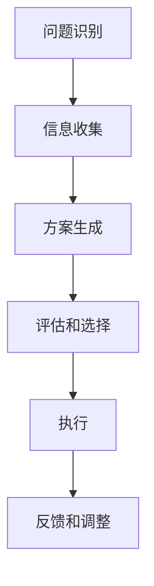
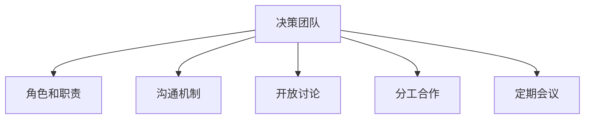
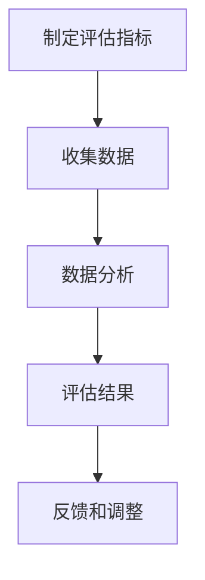

                 

### 文章标题

《科学决策：提高领导决策质量的系统方法》

### 关键词

决策理论，决策框架，决策过程，领导力，科学决策

### 摘要

本文旨在探讨科学决策的理论基础和实践方法，为领导者提供一套系统的决策框架。通过深入分析决策理论、心理学与决策的关系，以及常见的决策工具和模型，本文将帮助读者理解决策过程中的关键要素，提高决策质量和效果。同时，本文还将通过实际案例和项目实战，展示科学决策在现实中的应用，并提供实用的决策能力提升策略和最佳实践建议。

## 引言

在当今复杂多变的环境中，决策的质量直接影响到企业的生存和发展。作为领导者，如何做出科学、合理的决策，成为了一个至关重要的问题。然而，传统的直觉式和经验式的决策方法往往难以应对复杂和不确定性，导致决策失误。因此，有必要引入科学决策的方法，以提高决策的准确性和有效性。

科学决策强调在决策过程中运用系统的理论和方法，通过数据分析和逻辑推理，减少主观偏见和情绪影响，提高决策的客观性和科学性。科学决策不仅关注决策的结果，更注重决策的过程，强调在决策前进行充分的准备和评估，以及决策后的效果反馈和调整。

本文将从以下几个方面展开讨论：首先，介绍决策理论的基本概念和数学模型；其次，探讨心理学与决策的关系，分析常见的决策偏差；然后，介绍常见的决策框架和工具，如决策树、SWOT分析和风险评估矩阵；接着，讨论决策过程的管理，包括决策过程模型和团队协作；随后，通过实际案例展示科学决策的应用；最后，提出提升决策能力的策略和最佳实践建议。

通过本文的讨论，希望能够为读者提供一套系统的决策方法和思路，帮助领导者更好地应对复杂决策环境，提高决策质量和效果。

## 决策理论基础

决策理论是研究决策过程、决策方法和决策效果的学科，它为科学决策提供了理论依据和方法指导。了解决策理论的基本概念和数学模型，有助于我们更好地理解决策的本质，提高决策的科学性和有效性。

### 决策理论的基本概念

决策理论中的基本概念包括决策者、目标、方案、结果和效用。

- **决策者**：决策者是指做出决策的人或组织。在决策过程中，决策者需要明确自己的目标和约束条件，并选择最佳的方案。

- **目标**：目标是决策者希望达到的期望状态。不同的决策者有不同的目标，如利润最大化、风险最小化等。

- **方案**：方案是决策者可供选择的行动方案。一个有效的决策过程需要评估多个可能的方案。

- **结果**：结果是执行方案后产生的实际效果。结果通常用数值或指标来表示。

- **效用**：效用是决策者对结果的偏好程度。不同的决策者有不同的效用函数，反映了他们对不同结果的偏好。

### 决策理论的数学模型

决策理论中的数学模型包括概率模型、期望效用模型和决策树模型。

- **概率模型**：概率模型用于分析决策者在不确定环境下的决策。常见的概率模型有贝叶斯定理和决策树。贝叶斯定理用于更新决策者对结果的概率估计，从而提高决策的准确性。

  ```pseudo
  P(H|E) = P(E|H) * P(H) / P(E)
  ```
  
  其中，P(H|E)表示在观察到结果E时，假设H成立的概率；P(E|H)表示在假设H成立时，观察到结果E的概率；P(H)表示假设H的概率；P(E)表示观察到结果E的概率。

- **期望效用模型**：期望效用模型用于分析决策者在风险环境下的决策。期望效用是决策者对每个方案预期结果的效用乘以其发生的概率之和。

  ```pseudo
  EU(S) = ∑ (u(R) * p(R))
  ```
  
  其中，EU(S)表示方案S的期望效用；u(R)表示结果R的效用；p(R)表示结果R发生的概率。

- **决策树模型**：决策树模型是一种图形化的决策模型，用于展示决策者在不同情况下选择的方案和结果。决策树模型包括节点、分支和结果。

  ```mermaid
  graph TD
  A[开始] --> B[选择A]
  A --> C[选择B]
  B --> D{结果1}
  B --> E{结果2}
  C --> F{结果1}
  C --> G{结果2}
  ```
  
  在决策树中，每个节点表示一个决策或结果，分支表示不同方案或概率，结果表示方案执行后的效果。

### 决策理论的联系与架构

决策理论中的核心概念和数学模型之间存在着密切的联系，构成了一个完整的决策理论架构。

- **概率模型与期望效用模型**：概率模型用于分析不确定性环境下的决策，期望效用模型则用于分析风险环境下的决策。两者共同构成了决策理论在不确定性和风险环境下的决策方法。

- **决策树模型与概率模型、期望效用模型**：决策树模型是一种图形化的决策模型，它结合了概率模型和期望效用模型，用于展示决策者在不同情况下的选择和结果。

  ```mermaid
  graph TD
  A[开始]
  A --> B[概率模型]
  A --> C[期望效用模型]
  B --> D[决策树模型]
  C --> D
  ```

通过上述架构，我们可以看到决策理论的核心概念和数学模型是如何相互关联和补充的，从而构成了一个完整的决策理论体系。

### 决策理论的数学模型和公式

在决策理论中，数学模型和公式起着至关重要的作用，它们帮助我们量化决策过程，评估不同方案的效果，并选择最优解。以下将详细讲解几个关键数学模型和公式，并提供具体的例子。

#### 期望值（Expected Value）

期望值是一个随机变量的加权平均，权重为每个可能结果发生的概率。期望值用于评估一个方案的平均收益或损失。

**公式**：

\[ EV = \sum_{i} p_i \cdot R_i \]

其中，\( EV \) 表示期望值，\( p_i \) 表示结果 \( R_i \) 发生的概率，\( R_i \) 表示第 \( i \) 个结果的收益或损失。

**例子**：假设一个投资者有两个投资方案，方案A的收益为20万元，概率为0.4；方案B的收益为30万元，概率为0.6。计算两个方案的期望值。

```latex
$$
EV_A = 0.4 \cdot 20 + 0.6 \cdot 30 = 8 + 18 = 26 \text{ 万元}
$$

$$
EV_B = 0.4 \cdot 0 + 0.6 \cdot 30 = 0 + 18 = 18 \text{ 万元}
$$
```

从期望值来看，方案A的期望收益高于方案B。

#### 贝叶斯定理（Bayes' Theorem）

贝叶斯定理是一个用于更新概率估计的数学公式，它在不确定性决策中非常重要。贝叶斯定理可以帮助我们根据新的证据来调整先验概率，得到后验概率。

**公式**：

\[ P(H|E) = \frac{P(E|H) \cdot P(H)}{P(E)} \]

其中，\( P(H|E) \) 表示在观察到结果 \( E \) 时，假设 \( H \) 成立的概率；\( P(E|H) \) 表示在假设 \( H \) 成立时，观察到结果 \( E \) 的概率；\( P(H) \) 表示假设 \( H \) 的概率；\( P(E) \) 表示观察到结果 \( E \) 的概率。

**例子**：假设一个测试可以准确检测出患有某种疾病的人，同时也可以检测出未患病的人。已知患有这种疾病的人中，有90%的人测试结果为阳性，未患病的人中有10%的人测试结果为阳性。如果一个人测试结果为阳性，计算他实际上患有这种疾病的概率。

```latex
$$
P(\text{患病}|\text{阳性}) = \frac{P(\text{阳性}|\text{患病}) \cdot P(\text{患病})}{P(\text{阳性})}
$$

$$
P(\text{阳性}|\text{患病}) = 0.9, \quad P(\text{患病}) = 0.01, \quad P(\text{阳性}) = 0.01 \cdot 0.9 + 0.99 \cdot 0.1 = 0.019 + 0.099 = 0.118
$$

$$
P(\text{患病}|\text{阳性}) = \frac{0.9 \cdot 0.01}{0.118} \approx 0.0764
$$
```

这个结果表明，测试结果为阳性的人实际上患有这种疾病的概率约为7.64%。

#### 决策树（Decision Tree）

决策树是一种图形化模型，用于展示不同决策路径及其可能的结果。每个节点表示一个决策点，分支表示不同选择，叶子节点表示结果。

**例子**：假设一个企业面临两个投资方案，方案A需要投资100万元，成功概率为60%，收益为200万元；方案B需要投资50万元，成功概率为80%，收益为150万元。使用决策树模型分析两个方案的预期收益。

```mermaid
graph TD
A[开始] --> B[选择A]
A --> C[选择B]
B --> D[成功](200万元)
B --> E[失败](0万元)
C --> F[成功](150万元)
C --> G[失败](0万元)

classDef red color:#f66; font-size: 18px;
classDef green color:#6f6; font-size: 18px;

B --> D(.6);
B --> E(.4);
C --> F(.8);
C --> G(.2);

D ..(收益)Violation→ (200万元);
E ..(收益)Violation→ (0万元);
F ..(收益)Violation→ (150万元);
G ..(收益)Violation→ (0万元);
```

通过计算每个方案的预期收益：

```latex
$$
EV_A = 0.6 \cdot 200 + 0.4 \cdot 0 = 120 \text{ 万元}
$$

$$
EV_B = 0.8 \cdot 150 + 0.2 \cdot 0 = 120 \text{ 万元}
$$
```

两个方案的预期收益相同，但是方案B的投资较少，因此从预期收益来看，方案B可能更具吸引力。

#### 风险价值（Value at Risk, VaR）

风险价值是用于衡量投资组合在一定概率下的最大潜在损失。VaR通常使用百分比表示，用于设定风险容忍度。

**公式**：

\[ \text{VaR}_{\alpha} = - \max_{X \in \text{投资组合}} (X - \mu_X) \]

其中，\( \text{VaR}_{\alpha} \) 表示在给定置信水平 \( \alpha \) 下的最大损失；\( X \) 表示投资组合的收益；\( \mu_X \) 表示投资组合的期望收益。

**例子**：假设一个投资组合的期望收益为5%，标准差为10%，计算在95%置信水平下的VaR。

```latex
$$
\text{VaR}_{0.95} = - \max_{X} (X - 0.05) = - \max_{X} (X - 0.05) \approx -1.645 \cdot 10\% = -16.45\%
$$
```

这个结果表明，在95%的置信水平下，投资组合的最大潜在损失为16.45%。

通过上述数学模型和公式，我们可以更准确地评估决策方案，减少决策过程中的不确定性，提高决策的科学性和有效性。

## 心理学与决策

心理学与决策之间的关系是研究决策过程中人类行为的重要领域。人类在决策时往往会受到各种心理因素的影响，这些因素可能会导致决策偏差，影响决策质量和效果。了解这些心理因素，有助于我们更好地理解人类决策的本质，并采取有效策略来减少决策偏差。

### 人类决策的心理过程

人类在决策过程中会经历几个心理阶段，包括信息收集、评估和选择。每个阶段都可能受到心理因素的影响。

1. **信息收集**：决策者会收集与决策相关的信息。在这一阶段，人们往往会根据已有知识、经验和直觉进行信息筛选，可能忽略一些重要的信息。

2. **评估**：在评估阶段，决策者会对收集到的信息进行权衡和评估。此时，人们可能会受到各种心理因素的影响，如情感、个人偏好和认知偏差。

3. **选择**：在最后的选择阶段，决策者会根据评估结果做出决策。选择过程中，人们可能会受到前一个阶段的偏差影响，导致做出非最优选择。

### 心理学中的常见决策偏差

心理学研究揭示了人类决策中常见的偏差，以下是一些主要的心理偏差：

1. **确认偏差（Confirmation Bias）**：人们倾向于寻找和重视那些支持自己已有观点的信息，忽视或贬低反对自己观点的信息。

2. **锚定效应（Anchoring Effect）**：人们在评估信息时，可能会过度依赖最初获得的信息（锚点），而忽视了其他相关因素。

3. **过度自信（Overconfidence）**：人们往往对自己的判断和能力过于自信，低估不确定性，可能导致过于冒险或保守的决策。

4. **损失厌恶（Loss Aversion）**：人们对损失的厌恶程度高于对等量收益的喜欢程度，这种偏差可能导致规避风险和过度保守的决策。

5. **代表性偏差（Representativeness Bias）**：人们倾向于根据事物的相似性进行判断，而不是根据概率和统计规律进行判断。

6. **可用性偏差（Availability Bias）**：人们倾向于根据最近或最容易回忆起的信息进行判断，而忽视那些实际上更重要的信息。

### 减少决策偏差的策略

为了减少决策偏差，提高决策质量，可以采取以下策略：

1. **多元化信息来源**：确保信息来源的多样性，避免只依赖单一信息源。

2. **使用统计工具**：利用统计工具，如平均值、标准差等，进行定量分析，减少主观判断的影响。

3. **设立决策规则**：建立明确的决策规则和流程，避免在决策过程中受到个人情感和偏好的影响。

4. **增加反馈机制**：通过定期评估决策结果，及时反馈并调整决策，以提高决策的准确性和有效性。

5. **培训和教育**：通过培训和教育活动，提高决策者的心理意识和决策技能，帮助他们识别和克服决策偏差。

6. **使用模拟和实验**：在做出重要决策前，进行模拟和实验，以评估不同方案的可能结果和风险。

通过理解和应用这些心理学原则，决策者可以更好地识别和减少决策偏差，提高决策的科学性和有效性。

## 决策框架与工具

在科学决策的过程中，选择合适的决策框架和工具是至关重要的。这些框架和工具可以帮助决策者系统地分析和评估各种决策选项，减少决策偏差，提高决策的准确性和可靠性。以下将介绍几种常见的决策框架和工具，包括决策树、SWOT分析和风险评估矩阵。

### 决策树

决策树是一种直观的图形化模型，用于展示不同决策路径及其可能的结果。每个节点表示一个决策或结果，分支表示不同的选择或概率。决策树可以帮助决策者清晰地理解和分析决策过程。

#### 伪代码

```pseudo
function DecisionTree(options, probabilities):
    root = Node(options, probabilities)
    return root

class Node:
    def __init__(self, options, probabilities):
        self.options = options
        self.probabilities = probabilities
        self.children = []

    def add_child(self, child):
        self.children.append(child)

    def evaluate(self):
        if self.children is empty:
            return self.options * self.probabilities
        else:
            total_value = 0
            for child in self.children:
                total_value += child.evaluate()
            return total_value
```

#### 示例

假设有一个公司需要决定是否扩大生产线。有两个选项：扩大生产线（A）和维持现状（B）。扩大生产线的成功概率为0.6，收益为300万元；失败概率为0.4，损失为100万元。维持现状的收益为100万元，概率为1。

```mermaid
graph TD
A[开始] --> B[扩大生产线](0.6)
A --> C[维持现状](1)

B --> D{成功}(300万元)
B --> E{失败}(-100万元)

classDef red color:#f66; font-size: 18px;
classDef green color:#6f6; font-size: 18px;

D ..(收益)Violation→ (300万元);
E ..(收益)Violation→ (-100万元);
```

通过计算决策树，我们可以得出：
```latex
$$
EV(A) = 0.6 \cdot 300 + 0.4 \cdot (-100) = 180 - 40 = 140 \text{ 万元}
$$
$$
EV(B) = 1 \cdot 100 = 100 \text{ 万元}
$$
```
因此，从期望值来看，扩大生产线（A）是一个更优的选择。

### SWOT分析

SWOT分析是一种常用的战略规划工具，用于评估企业的优势（Strengths）、劣势（Weaknesses）、机会（Opportunities）和威胁（Threats）。通过SWOT分析，企业可以全面了解自身状况，制定合适的战略。

#### 伪代码

```pseudo
function SWOTAnalysis(strengths, weaknesses, opportunities, threats):
    return {
        "Strengths": strengths,
        "Weaknesses": weaknesses,
        "Opportunities": opportunities,
        "Threats": threats
    }
```

#### 示例

以下是一个企业的SWOT分析：

```mermaid
graph TD
A[SWOT分析] --> B[优势](有经验的管理团队)
A --> C[劣势](市场份额较小)
A --> D[机会](新市场的开拓)
A --> E[威胁](竞争对手的竞争)

classDef yellow color:#fff; font-size: 18px;
classDef blue color:#000; font-size: 18px;
classDef red color:#f66; font-size: 18px;
classDef green color:#6f6; font-size: 18px;

B ..(优势)Violation→ (有经验的管理团队);
C ..(劣势)Violation→ (市场份额较小);
D ..(机会)Violation→ (新市场的开拓);
E ..(威胁)Violation→ (竞争对手的竞争);
```

通过SWOT分析，企业可以识别自身的优势和劣势，抓住市场机会，应对潜在威胁，制定更加科学的战略规划。

### 风险评估矩阵

风险评估矩阵是一种用于评估和管理项目或投资风险的工具。它通过将风险的可能性和影响进行量化，帮助决策者识别和优先处理高风险。

#### 伪代码

```pseudo
function RiskAssessmentMatrix(risks, probabilities, impacts):
    risk_matrix = []
    for risk in risks:
        risk_row = []
        risk_row.append(risk)
        risk_row.append(probabilities[risk])
        risk_row.append(impacts[risk])
        risk_row.append(probabilities[risk] * impacts[risk])
        risk_matrix.append(risk_row)
    return sorted(risk_matrix, key=itemgetter(4), reverse=True)

class Risk:
    def __init__(self, name, probability, impact):
        self.name = name
        self.probability = probability
        self.impact = impact
```

#### 示例

以下是一个项目的风险评估矩阵：

```mermaid
graph TD
A[风险评估矩阵]
A --> B[风险1](0.2, 0.5)
A --> C[风险2](0.3, 0.7)
A --> D[风险3](0.1, 0.3)
A --> E[风险4](0.4, 0.8)

classDef red color:#f66; font-size: 18px;
classDef orange color:#ff9; font-size: 18px;
classDef yellow color:#fff; font-size: 18px;
classDef green color:#6f6; font-size: 18px;

B ..(风险)Violation→ (风险1: 0.2, 0.5);
C ..(风险)Violation→ (风险2: 0.3, 0.7);
D ..(风险)Violation→ (风险3: 0.1, 0.3);
E ..(风险)Violation→ (风险4: 0.4, 0.8);

class B orange;
class C red;
class D yellow;
class E green;
```

通过风险评估矩阵，项目管理者可以识别出高风险，并采取相应的风险缓解措施。

### 综述

决策树、SWOT分析和风险评估矩阵是科学决策中常用的框架和工具。它们帮助决策者系统地分析决策过程，评估不同选项，识别和优先处理风险。通过合理运用这些工具，决策者可以提高决策的准确性和有效性，更好地应对复杂多变的环境。

## 决策过程管理

在决策过程中，管理决策的各个环节是确保决策质量和效果的关键。有效的决策过程管理包括明确决策过程模型、优化团队协作以及建立决策质量评估机制。以下将详细讨论这些方面。

### 决策过程模型

决策过程模型是描述决策过程中各个阶段及其相互关系的理论框架。一个典型的决策过程包括以下阶段：

1. **问题识别**：识别出需要解决的具体问题或面临的机会。
2. **信息收集**：收集与决策相关的各种信息，包括数据、文献、专家意见等。
3. **方案生成**：根据收集到的信息，生成多个可供选择的方案。
4. **评估和选择**：对各个方案进行评估，选择最优或最合适的方案。
5. **执行**：实施选定的方案，并监控执行过程。
6. **反馈和调整**：对决策效果进行反馈，根据反馈结果进行调整。

以下是一个简化的决策过程模型：



### 团队协作

在决策过程中，团队协作至关重要。有效的团队协作可以充分利用团队成员的知识和经验，提高决策的质量和效率。以下是一些优化团队协作的建议：

1. **明确角色和职责**：确保每个团队成员都明确自己的角色和职责，避免职责重叠和责任不清晰。
2. **建立沟通机制**：建立有效的沟通机制，确保团队成员之间的信息畅通，及时共享决策进展和问题。
3. **鼓励开放和诚实的讨论**：创造一个开放和诚实的讨论环境，鼓励团队成员提出不同的观点和建议，从而全面评估决策选项。
4. **分工合作**：根据团队成员的专长和兴趣，进行合理的分工合作，确保每个阶段都有合适的成员参与。
5. **定期会议**：定期举行会议，回顾决策进展，讨论问题，制定解决方案。

以下是一个团队协作的模型：



### 决策质量评估

决策质量评估是确保决策有效性的关键环节。通过评估决策质量，可以及时发现和纠正决策中的问题，提高后续决策的质量。以下是一些评估决策质量的指标和方法：

1. **目标达成度**：评估决策结果是否达成既定目标。
2. **执行效率**：评估决策执行的速度和效率。
3. **资源利用**：评估决策过程中资源的有效利用程度。
4. **风险控制**：评估决策过程中对风险的识别和控制程度。
5. **团队满意度**：评估团队成员对决策过程的满意度和参与度。

以下是一个决策质量评估的流程：



### 实例

以下是一个企业在新产品开发中的决策过程管理实例：

1. **问题识别**：市场调研发现竞争对手的新产品受到用户欢迎，企业决定开发一款同类产品。
2. **信息收集**：收集市场趋势、用户需求、竞争对手信息等，并邀请行业专家进行评估。
3. **方案生成**：根据收集的信息，生成三种开发方案：A. 技术创新，B. 功能改进，C. 价格策略。
4. **评估和选择**：通过团队讨论和评估，选择方案A，因其具有技术创新优势，市场潜力大。
5. **执行**：组织研发团队，制定详细开发计划，并按计划执行。
6. **反馈和调整**：产品上线后，收集用户反馈，根据反馈进行产品调整。

通过这个实例，我们可以看到企业如何通过决策过程管理，确保新产品的成功开发和市场推广。

### 总结

有效的决策过程管理是科学决策的重要组成部分。通过建立决策过程模型、优化团队协作和实施决策质量评估，决策者可以更好地管理决策过程，提高决策质量和效果。这对于企业的发展和创新至关重要。

## 成功决策案例分析

在本节中，我们将通过几个实际案例来探讨科学决策的应用。这些案例展示了在不同环境和背景下，决策者如何运用科学决策的方法，最终实现成功的目标。

### 案例一：企业战略决策

一家中型企业在面临市场竞争加剧的情况下，决定进行战略调整。通过SWOT分析，企业识别出自身的优势在于技术创新和产品质量，劣势在于市场推广和品牌知名度不足，机会在于新市场的开拓，威胁则来自竞争对手的强大攻势。

1. **决策框架与工具**：企业使用了SWOT分析来评估自身状况，并采用了决策树模型来比较不同战略方案的优劣。

2. **决策过程**：
   - **问题识别**：企业确定了需要调整战略的问题。
   - **信息收集**：通过市场调研、用户反馈和竞争对手分析，企业收集了大量的信息。
   - **方案生成**：提出了三种方案：A. 强化市场推广，B. 开拓新市场，C. 投资新技术。
   - **评估与选择**：使用决策树模型，企业计算了每个方案的预期收益和风险，选择了方案B。

3. **结果**：企业成功开拓了新市场，提高了市场份额，并在技术创新方面取得了显著成果，实现了战略目标。

### 案例二：市场进入决策

一家互联网公司计划进入一个新的区域市场。通过数据分析，公司识别出该市场的主要机会在于年轻用户群体的快速增长和移动互联网的普及，而威胁在于竞争对手的强势地位和用户忠诚度。

1. **决策框架与工具**：公司使用了风险评估矩阵和期望效用模型来评估市场进入策略。

2. **决策过程**：
   - **问题识别**：公司确定了进入新市场的机会和威胁。
   - **信息收集**：通过用户调查、市场分析和竞争对手研究，公司收集了详细的数据。
   - **方案生成**：提出了三种方案：A. 直接进入，B. 联合当地企业，C. 先进行试点。
   - **评估与选择**：使用风险评估矩阵和期望效用模型，公司选择了方案C。

3. **结果**：公司通过试点项目积累了宝贵经验，减少了进入市场的风险，并最终成功进入新市场，实现了预期收益。

### 案例三：项目管理决策

一家IT公司在进行一个复杂的项目时，面临多个关键技术难题和资源分配问题。为了确保项目按时完成并达到预期效果，项目团队决定采用科学决策的方法。

1. **决策框架与工具**：项目团队使用了决策树模型和优化算法来分析不同技术路线和资源分配方案。

2. **决策过程**：
   - **问题识别**：项目团队明确了项目中的关键技术难题和资源分配问题。
   - **信息收集**：通过技术评估、资源调查和风险评估，团队收集了必要的信息。
   - **方案生成**：提出了四种方案：A. 采用现有技术，B. 投资新研发，C. 调整项目计划，D. 增加人力和资源。
   - **评估与选择**：使用决策树模型和优化算法，团队选择了方案D。

3. **结果**：项目团队通过增加人力和资源，优化了项目计划，最终按时完成了项目，并达到了预期效果。

### 总结

这些成功决策的案例展示了科学决策方法在实际应用中的有效性。通过系统的方法和工具，决策者能够更清晰地分析问题，评估方案，并做出最优选择。这些案例也表明，科学决策不仅能够提高决策的质量，还能降低风险，实现预期目标。在复杂多变的环境中，科学决策是领导者不可或缺的工具。

## 决策能力提升

在科学决策中，提升决策能力是确保决策质量和效果的关键。一个具备高水平决策能力的领导者能够在复杂多变的环境中迅速做出合理有效的决策。以下将探讨提升决策能力的策略、训练方法和实际应用。

### 提升决策能力的策略

1. **持续学习和知识积累**：决策能力是建立在广泛知识和深厚经验基础上的。领导者应不断学习新的知识，特别是与决策相关的理论和实践，如经济学、心理学、统计学等。此外，积累行业内的成功经验和失败教训也是提升决策能力的重要途径。

2. **多角度分析和思考**：在做出决策前，领导者应从多个角度对问题进行分析，考虑各种可能性和后果。这包括分析内部因素和外部环境，识别潜在的风险和机会。通过多角度的分析，领导者可以更全面地了解问题的本质，做出更为合理的决策。

3. **建立决策模型和框架**：领导者应建立一套适合自己的决策模型和框架，以便在决策过程中有章可循。这些模型和框架可以是决策树、SWOT分析、风险评估矩阵等，它们可以帮助领导者系统性地分析问题和评估方案。

4. **培养团队合作精神**：有效的决策往往需要团队的合作。领导者应培养团队成员的合作精神，鼓励开放和诚实的讨论，充分利用团队的知识和经验。通过团队合作，可以减少决策偏差，提高决策的准确性和可靠性。

5. **定期进行决策回顾**：领导者应定期回顾过去的决策，分析成功和失败的原因，总结经验教训。这种回顾可以帮助领导者识别自身的决策盲点和不足，持续改进决策能力。

### 决策能力的训练方法

1. **情景模拟训练**：通过模拟各种复杂和不确定的决策情景，领导者可以在实践中学习如何应对不同的问题和挑战。这种方法可以锻炼领导者的应变能力和决策速度。

2. **案例分析训练**：通过分析实际案例，领导者可以深入了解不同决策情境下的决策过程和结果。这种方法可以帮助领导者理解决策理论在实际中的应用，以及如何应对各种复杂情况。

3. **角色扮演训练**：通过角色扮演，领导者可以模拟实际决策过程，体验不同角色的思考方式和决策过程。这种方法有助于提升领导者的同理心和跨部门协作能力。

4. **在线课程和专业培训**：参加在线课程和专业培训是提升决策能力的有效途径。这些课程和培训通常提供系统的理论知识和实际案例，帮助领导者深入理解决策理论和实践。

### 实际应用

以下是一个实际应用的例子：

**案例**：一家初创企业在开发新产品时，面临技术选型、市场需求和资源分配等多个决策问题。

**决策过程**：
1. **问题识别**：企业需要确定最优的技术方案、目标市场和资源配置策略。
2. **信息收集**：通过市场调研、技术评估和资源调查，企业收集了大量的数据和信息。
3. **方案生成**：提出了三种方案：A. 采用现有技术，B. 投资新研发，C. 调整项目计划。
4. **评估与选择**：
   - **技术评估**：使用决策树模型，企业评估了每个技术方案的可行性和风险。
   - **市场评估**：使用期望效用模型，企业评估了每个市场需求预测的概率和收益。
   - **资源评估**：使用风险评估矩阵，企业评估了每个资源配置方案的可能性和影响。

5. **决策执行**：企业选择了方案A，并制定了详细的执行计划。

**结果**：通过科学的决策过程，企业成功开发出了新产品，并在市场上取得了良好的反响，实现了预期的商业目标。

### 总结

提升决策能力是一个持续的过程，需要领导者不断学习和实践。通过科学的策略、有效的训练方法和实际应用，领导者可以不断提高决策能力，做出更加合理和有效的决策。这对于企业在竞争激烈的市场中取得成功至关重要。

## 领导力与决策

领导力在决策过程中起着至关重要的作用。一个优秀的领导者不仅在技术上能够做出合理的决策，还能够在团队中发挥关键的作用，引导和推动决策的实施。以下将探讨领导风格对决策的影响，以及领导者在决策中的角色。

### 领导风格对决策的影响

1. **权威型领导**：权威型领导通过集中权力和决策权，快速做出决策。这种风格在紧急情况下能够迅速采取行动，但可能导致团队成员参与度低，缺乏创新。

2. **民主型领导**：民主型领导鼓励团队成员参与决策过程，通过集体讨论和投票来做出决策。这种风格可以提高团队成员的满意度和参与度，但可能决策速度较慢，容易产生意见分歧。

3. **变革型领导**：变革型领导通过激励和鼓舞团队成员，推动变革和创新。这种风格在应对复杂和不确定的决策环境时非常有效，但需要领导者具备较强的愿景和执行能力。

4. **协作型领导**：协作型领导通过建立团队协作机制，促进团队成员之间的沟通和合作。这种风格在需要团队共同努力的决策中非常有效，但可能需要更多时间和资源。

### 领导者在决策中的角色

1. **决策制定者**：领导者需要明确决策目标，制定决策框架，并选择最佳方案。在决策过程中，领导者应运用科学决策的方法，如SWOT分析、决策树模型等，以确保决策的合理性和有效性。

2. **团队协调者**：领导者需要协调团队成员之间的工作，确保团队目标的实现。在决策过程中，领导者应建立有效的沟通机制，鼓励团队成员提出不同的观点和建议，从而全面评估决策选项。

3. **激励者**：领导者需要激励团队成员，提高他们的工作积极性和创造力。在决策实施过程中，领导者应关注团队成员的需求和反馈，及时调整策略，确保决策目标的实现。

4. **问题解决者**：领导者需要识别和解决决策过程中的问题。在决策实施过程中，领导者应具备较强的应变能力，能够快速应对各种挑战和风险，确保决策目标的实现。

### 实例

以下是一个领导者在决策中的实例：

**背景**：一家公司计划开发一款新产品，面临技术选型和市场定位的决策。

**决策过程**：
1. **领导风格**：公司领导者采用了民主型和变革型领导风格，鼓励团队成员参与决策过程，并推动创新。

2. **决策制定**：
   - **目标明确**：领导者明确了新产品的开发目标，并制定了详细的决策框架。
   - **方案评估**：领导者组织了团队讨论，评估了多种技术方案和市场定位方案。

3. **团队协调**：
   - **沟通机制**：领导者建立了有效的沟通机制，确保团队成员之间的信息畅通。
   - **创新激励**：领导者激励团队成员提出创新方案，鼓励他们尝试新的技术路线。

4. **问题解决**：
   - **风险识别**：领导者识别了技术选型和市场定位中的风险，并制定了相应的应对策略。
   - **决策执行**：领导者关注决策执行过程中的问题，及时调整策略，确保新产品的成功开发。

**结果**：通过领导者的有效决策和团队协作，公司成功开发出了新产品，并在市场上取得了良好的反响。

### 总结

领导力在决策过程中起着至关重要的作用。一个优秀的领导者能够通过科学的决策方法和团队协作，提高决策质量和效果。领导风格对决策的影响显著，领导者应在不同情境下灵活运用不同的领导风格，发挥最大的决策效能。

## 最佳实践 tips

在实际工作中，运用科学决策方法可以显著提高决策质量和效果。以下是一些最佳实践建议，帮助您在决策过程中更好地运用这些方法：

1. **明确决策目标**：在决策前，首先要明确决策的目标和期望结果。这有助于您在分析方案时，聚焦于关键因素，避免偏离目标。

2. **广泛收集信息**：确保收集的信息全面、准确，来源多样化。这有助于您对问题有更深入的了解，减少信息偏差。

3. **运用决策工具**：合理运用决策工具，如决策树、SWOT分析和风险评估矩阵，可以系统性地分析问题和评估方案。

4. **团队协作**：鼓励团队成员参与决策过程，充分利用团队的知识和经验。开放和诚实的讨论可以提高决策的准确性和可靠性。

5. **定期反馈和调整**：在决策执行过程中，定期收集反馈，并根据反馈结果进行调整。这有助于及时纠正决策中的问题，提高决策的效果。

6. **持续学习和培训**：不断学习和更新决策相关的知识，参加专业培训，提高自己的决策能力和水平。

7. **风险管理**：在决策过程中，重视风险识别和控制。使用风险评估工具，如风险矩阵，可以帮助您全面了解风险，并制定相应的应对策略。

通过遵循这些最佳实践，您可以更有效地运用科学决策方法，提高决策质量和效果，实现企业的长远发展。

## 小结

本文从决策理论基础、心理学与决策、决策框架与工具、决策过程管理、成功决策案例分析、决策能力提升、领导力与决策等方面，系统地探讨了科学决策的方法和实践。通过了解决策理论的基本概念和数学模型，我们可以更好地理解决策过程；通过心理学的研究，我们可以识别和减少决策偏差；通过决策框架和工具的应用，我们可以系统地分析问题和评估方案；通过有效的决策过程管理，我们可以确保决策的质量和效果；通过成功决策案例分析，我们可以看到科学决策在实际中的应用；通过提升决策能力和领导力，我们可以做出更加合理和有效的决策。

在复杂多变的环境中，科学决策是领导者不可或缺的工具。通过运用本文提供的方法和策略，领导者可以更好地应对各种挑战和机遇，实现企业的发展目标。希望本文能够为您的决策实践提供有益的启示和指导。

## 注意事项

在应用科学决策方法时，需要注意以下几点：

1. **数据准确性**：确保收集的信息和数据准确可靠，避免基于不准确的信息做出错误决策。

2. **决策时机**：选择适当的时机进行决策，避免在信息不充分或情况不明朗时做出仓促决策。

3. **团队协作**：重视团队协作，充分利用团队成员的知识和经验，避免单打独斗。

4. **持续评估**：在决策执行过程中，定期评估决策效果，根据反馈及时调整策略。

5. **风险控制**：重视风险评估，制定相应的风险应对策略，避免决策过程中出现重大失误。

通过注意这些事项，可以更好地运用科学决策方法，提高决策质量和效果。

## 拓展阅读

1. **《决策分析》**：R. T. Hodgson 著，详细介绍了决策分析的理论和实践方法，对理解决策过程非常有帮助。
2. **《行为决策理论》**：Daniel Kahneman 和 Amos Tversky 著，探讨了人类决策中的心理偏差和认知偏差，提供了丰富的实证研究和案例分析。
3. **《企业决策分析》**：G. B. Dana 和 R. T. Hodgson 著，结合企业实际案例，介绍了如何将决策分析应用于企业管理。
4. **《领导力与决策》**：John P. Kotter 著，探讨了领导力在决策过程中的作用，提供了实用的领导力提升策略。

这些书籍提供了丰富的决策理论和实践知识，有助于进一步深入学习和应用科学决策方法。读者可以根据自身需求和兴趣选择阅读。

