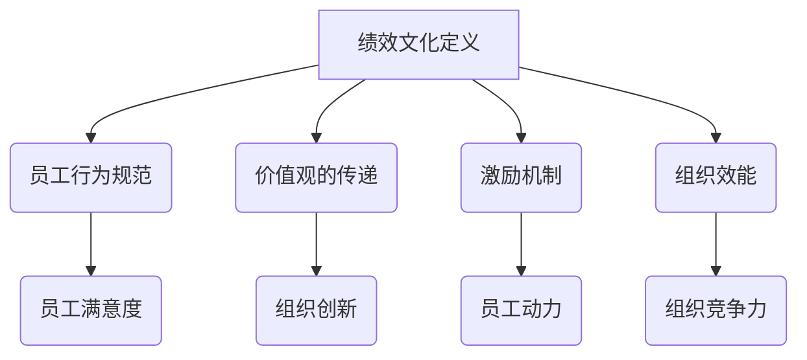
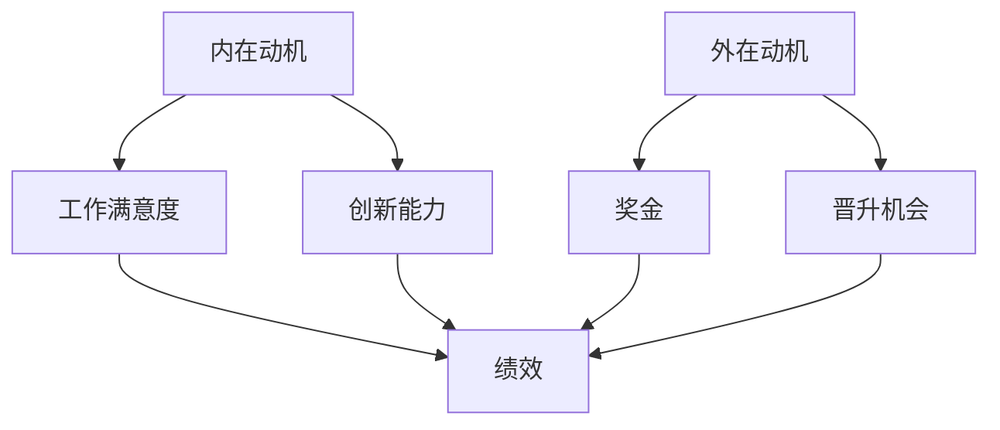
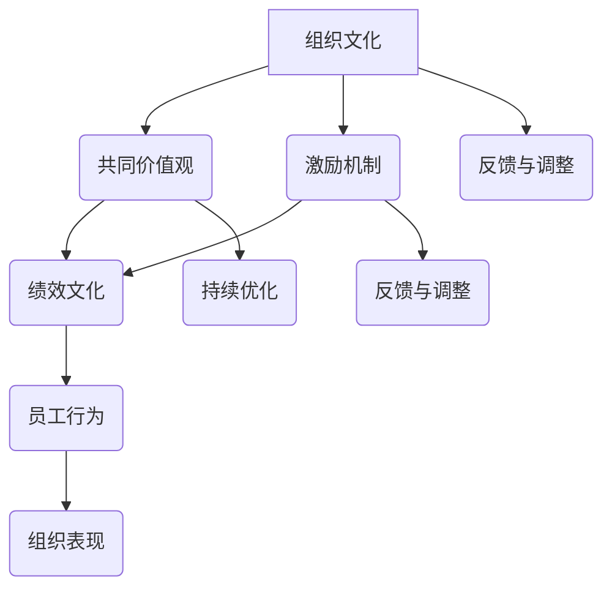

                 

## 文章标题

《积极的绩效文化：营造进取氛围》

## 关键词

绩效文化、进取氛围、员工动机、激励机制、绩效评估、组织行为学、领导风格、国际化组织、多元文化环境

## 摘要

本文旨在深入探讨如何构建一种积极的绩效文化，以激发员工的进取心和创造力，进而提升组织整体的绩效和竞争力。通过对绩效文化的定义、核心概念、算法原理、数学模型以及实际项目实战的详细分析，本文将为读者提供一套系统、实用的方法论。此外，本文还将探讨国际化与多元文化环境对绩效文化的影响，并分享最佳实践和注意事项，以帮助组织在不同文化背景下营造积极进取的工作氛围。

## 引言

在当今快速变化的市场环境中，组织的竞争力越来越依赖于其员工的绩效和创造力。然而，如何激发员工的潜力，使其在复杂多变的环境中保持高昂的斗志和积极的态度，成为许多企业面临的挑战。绩效文化作为一种关键的管理工具，正是解决这一问题的有效途径。积极的绩效文化不仅能提高员工的满意度和忠诚度，还能促进组织的创新和持续发展。

本文将围绕积极的绩效文化这一主题，首先介绍绩效文化的定义和重要性，然后详细分析其中的核心概念和联系，接着讲解关键算法原理和数学模型，最后通过实际项目实战分享具体实施方法和经验。希望通过本文的探讨，能为读者提供一套全面、系统的绩效文化构建方法论，助力组织在激烈的市场竞争中立于不败之地。

## 绩效文化的定义与重要性

绩效文化是指一种以绩效为核心价值的文化体系，它通过一系列的行为准则、价值观和激励机制，激发员工的工作动力，提升整体组织效能。在绩效文化中，绩效不仅仅是一个考核指标，更是组织文化的重要组成部分，贯穿于组织的各个层面。

首先，绩效文化的定义可以从以下几个方面来理解：

1. **员工行为规范**：绩效文化要求员工在工作中遵循一定的行为准则，如诚信、责任、协作等，这些准则不仅规范了员工的行为，也塑造了组织的整体形象。

2. **价值观的传递**：绩效文化传递的是一种共同的价值观，即通过绩效来衡量个人的贡献和价值，从而激发员工的内在动力和认同感。

3. **激励机制**：绩效文化通过设计合理的激励机制，如奖金、晋升、培训等，鼓励员工为实现组织目标而努力。

4. **组织效能**：绩效文化的最终目标是提高组织的整体效能，通过提升员工的工作效率和创造力，实现组织的战略目标。

其次，绩效文化的重要性体现在以下几个方面：

1. **提升员工满意度**：绩效文化通过公平、透明的绩效评估机制，使员工感受到自己的努力和贡献得到了认可，从而提高工作满意度和忠诚度。

2. **促进组织创新**：绩效文化鼓励员工发挥自己的创造力和主动性，提出创新的想法和建议，从而推动组织的持续创新和发展。

3. **增强组织凝聚力**：绩效文化通过共同的目标和价值观，将员工紧密地联系在一起，增强组织的凝聚力，形成团结协作的工作氛围。

4. **提高组织竞争力**：绩效文化能够提升组织的整体绩效，使组织在激烈的市场竞争中保持领先地位。

为了更直观地展示绩效文化的核心概念和联系，我们可以借助Mermaid流程图来描述。以下是一个示例：



通过这个流程图，我们可以看到绩效文化的各个方面是如何相互关联的。员工行为规范和价值观的传递是绩效文化的基础，激励机制则是对员工行为的反馈和激励，最终体现在组织效能的提升上，进而影响员工的满意度、组织创新和竞争力。

### 员工动机与绩效的关系

在绩效文化中，员工动机是驱动员工行为和绩效的核心因素。员工动机可以分为内在动机和外在动机两种类型。内在动机是指员工出于对工作本身感兴趣、有成就感或者满足感而产生的动力，如追求知识、实现自我价值、体验成就感等。而外在动机则是指员工为了获得奖励、避免惩罚或者满足基本需求而产生的动力，如奖金、晋升、社会认可等。

研究表明，内在动机和外在动机在员工绩效中起着不同的作用。内在动机与员工的工作满意度和创新能力有较强的正相关关系，能够显著提升员工的工作表现和创造力。例如，一位程序员可能会因为对编程本身的热爱而投入更多的时间和精力去研究新技术，从而在项目中提出创新的解决方案。这种情况下，员工的绩效往往更高，因为他们的动机来自于对工作的内在兴趣和成就感。

另一方面，外在动机虽然也能提升员工的绩效，但其效果较为短期和有限。外在动机主要依赖于奖励和惩罚机制，如果这些机制设计不当，可能会导致员工产生依赖性，一旦奖励消失，他们的动力也会随之减弱。例如，如果一名员工仅因为获得奖金而工作，那么一旦奖金减少或者取消，他们的工作积极性可能会下降。

为了更好地理解员工动机与绩效之间的关系，我们可以借助以下伪代码：

```python
# 员工绩效计算伪代码
def calculate_performance(employee, intrinsic_motivation, extrinsic_motivation):
    performance_score = 0
    if intrinsic_motivation > extrinsic_motivation:
        performance_score += intrinsic_motivation * 1.2  # 内在动机得分较高时，绩效得分增加20%
    else:
        performance_score += extrinsic_motivation * 1.1  # 外在动机得分较高时，绩效得分增加10%
    return performance_score
```

在这个伪代码中，我们通过计算内在动机和外在动机的权重，来得出员工的绩效得分。其中，内在动机的权重高于外在动机，这反映了内在动机在员工绩效中的重要性。

此外，我们还可以使用以下数学模型来更详细地分析员工动机与绩效之间的关系：

$$
\text{绩效} = \alpha \times \text{内在动机} + \beta \times \text{外在动机} + \gamma
$$

其中，$\alpha$ 和 $\beta$ 是权重系数，$\gamma$ 是常数项。通过调整这些权重系数，我们可以根据不同的情况来平衡内在动机和外在动机的影响。

为了更直观地展示内在动机和外在动机对员工绩效的影响，我们可以绘制以下图表：



在这个图表中，我们可以看到内在动机和外在动机分别通过不同的路径影响员工的工作满意度、创新能力和最终绩效。内在动机通过提高工作满意度和创新能力来间接提升绩效，而外在动机则通过直接给予奖励和晋升机会来影响绩效。

总的来说，员工动机是影响绩效的重要因素。通过合理设计和运用激励机制，组织可以更好地激发员工的内在动机，从而提升整体绩效和创新能力。然而，外在动机也不能忽视，适当的奖励和晋升机制仍然是激励员工的重要手段。在实际操作中，组织需要根据具体情况平衡内在动机和外在动机的关系，以实现最佳的绩效效果。

### 组织行为学原理在绩效文化中的应用

绩效文化的构建不仅依赖于激励机制，还需要深入理解组织行为学的原理。组织行为学是研究个体、团队和组织在组织环境中的行为和互动的学科，其理论在绩效文化的构建中具有重要的作用。以下将介绍几个关键的组织行为学原理，并探讨它们如何在绩效文化中应用。

#### 1. **公平理论**

公平理论（Equity Theory）由亚当斯（J. Stacy Adams）提出，认为员工会根据自己的投入和产出与他人的投入和产出进行比较，以评估自己的公平感。如果员工感受到不公平，就会产生不满和动机减少。在绩效文化中，公平理论的应用主要体现在以下几个方面：

- **公平的绩效评估**：确保绩效评估过程的透明度和公正性，使员工感到他们的绩效评估是合理的，从而提高他们的工作满意度和信任感。
- **激励机制的设计**：设计公平的激励机制，确保不同贡献的员工能够获得相应的回报，避免因奖励分配不均而产生不公平感。

以下是一个用于评估员工公平感的伪代码示例：

```python
# 公平感评估伪代码
def fairness_evaluation(employee, peer_performance, own_performance):
    if (own_performance / peer_performance) < 1.0:
        return "不公平感"
    elif (own_performance / peer_performance) > 1.0:
        return "不公平感"
    else:
        return "公平感"
```

#### 2. **期望理论**

期望理论（Expectancy Theory）由维克托·弗鲁姆（Victor H. Vroom）提出，认为员工的动机取决于对工作结果的期望、努力程度和结果价值三者之间的关系。公式表示为：

$$
\text{动机} = \text{期望} \times \text{努力} \times \text{结果价值}
$$

在绩效文化中，期望理论的应用主要体现在以下几个方面：

- **明确的绩效目标**：通过设定明确的绩效目标，提高员工的期望值，使他们更有动力去努力工作。
- **提供必要的资源和培训**：确保员工有足够的资源和技能来实现绩效目标，从而提高他们的努力程度。
- **奖励和认可**：通过提供有吸引力的奖励和认可，提高员工对工作结果的期望价值。

以下是一个用于计算员工动机的伪代码示例：

```python
# 动机计算伪代码
def motivation Calculation(employee, expectation, effort, value):
    return expectation * effort * value
```

#### 3. **强化理论**

强化理论（Reinforcement Theory）由行为主义心理学家伯尔赫斯·斯金纳（B.F. Skinner）提出，认为行为可以通过正强化、负强化、惩罚和自然消退来调节。在绩效文化中，强化理论的应用主要体现在以下几个方面：

- **正强化**：通过奖励和认可来增强员工积极的行为，如完成目标、提出创新建议等。
- **负强化**：通过消除不愉快的条件来鼓励员工维持积极行为，如及时反馈和改进机会。
- **惩罚**：对不良行为进行适当的惩罚，以减少不良行为的发生。
- **自然消退**：对不积极的行为不予关注或奖励，使其逐渐减弱。

以下是一个用于设计激励机制的伪代码示例：

```python
# 激励机制设计伪代码
def reinforcement_mechanism(employee, behavior):
    if behavior == "positive":
        reward(employee)
    elif behavior == "negative":
        if behavior_change_possible:
            offer_improvement_opportunity()
        else:
            apply_punishment()
```

#### 4. **团队动力学**

团队动力学（Team Dynamics）研究团队内部成员的互动和关系，影响团队绩效。在绩效文化中，团队动力学的重要性体现在以下几个方面：

- **团队建设**：通过团队建设活动，增强团队成员之间的信任和协作，提高团队绩效。
- **角色分配**：确保每个团队成员都清楚自己的角色和责任，避免角色冲突。
- **沟通与反馈**：建立有效的沟通机制，确保信息的透明和及时反馈，帮助团队成员更好地协同工作。

以下是一个用于评估团队动力的伪代码示例：

```python
# 团队动力评估伪代码
def team_dynamics_evaluation(team_members, communication, trust, collaboration):
    if communication and trust and collaboration > 0.7:
        return "积极团队动力"
    else:
        return "需要改进的团队动力"
```

通过应用这些组织行为学原理，组织可以更好地理解和激发员工的动机，从而构建一个积极的绩效文化。在实际操作中，组织需要根据具体情况灵活运用这些原理，结合具体的绩效目标和激励机制，以实现最佳的效果。

### 领导风格与绩效文化的关系

领导风格在构建积极的绩效文化中扮演着至关重要的角色。不同的领导风格会对员工的行为、动机和绩效产生不同的影响。本文将探讨几种常见的领导风格，并分析它们如何影响绩效文化的形成和发展。

#### 1. 授权型领导风格

授权型领导风格（Laissez-Faire Leadership）是指领导者给予员工较大的自主权和责任感，允许他们自主决策和工作。这种领导风格鼓励员工的自主性和创新精神，有助于培养员工的独立性和解决问题的能力。

- **影响**：授权型领导风格能够激发员工的内在动机，提高工作满意度和创造力。员工在自由的环境中更有可能提出创新的想法和解决方案，从而提升组织的绩效。
- **实施要点**：领导者需要确保员工具备必要的技能和资源，并提供必要的指导和支持，避免过度授权导致混乱。

#### 2. 情境型领导风格

情境型领导风格（Situational Leadership）是指领导者根据员工的成熟度和工作环境的变化，灵活调整自己的领导方式。这种领导风格强调因人而异，根据员工的不同需求和情境采取不同的领导策略。

- **影响**：情境型领导风格能够提高员工的参与感和责任感，增强团队的凝聚力和合作精神。领导者通过适应不同员工的特点和环境，提供个性化的领导支持，有助于提升员工的绩效和满意度。
- **实施要点**：领导者需要具备敏锐的观察力和分析能力，能够准确判断员工的成熟度和工作环境，并采取相应的领导策略。

#### 3. 参与型领导风格

参与型领导风格（Participative Leadership）是指领导者鼓励员工参与决策过程，重视员工的意见和建议。这种领导风格有助于增强员工的归属感和参与感，提高决策的质量和执行效果。

- **影响**：参与型领导风格能够激发员工的工作热情和创造力，增强团队的合作精神和创新能力。员工在参与决策的过程中，能够更好地理解组织的目标和策略，从而更加主动地为实现组织目标贡献力量。
- **实施要点**：领导者需要创造开放和包容的沟通环境，鼓励员工表达意见和建议，并确保这些意见能够得到认真考虑和反馈。

#### 4. 道德型领导风格

道德型领导风格（Moral Leadership）是指领导者以道德和价值为导向，以身作则，引导员工遵循正确的道德规范。这种领导风格强调诚信、公正和责任感，有助于培养员工的道德素养和职业操守。

- **影响**：道德型领导风格能够建立信任和尊重的组织氛围，提高员工的忠诚度和工作满意度。员工在道德型领导者的引导下，更有可能自觉遵守组织规范，积极履行职业责任，从而提升组织的绩效和声誉。
- **实施要点**：领导者需要树立良好的道德榜样，坚持诚信和公正，并积极倡导和实践组织的核心价值观。

#### 综合分析

不同的领导风格对绩效文化的影响是多方面且相互交织的。授权型领导风格能够激发员工的自主性和创新精神，情境型领导风格能够提高员工的参与感和责任感，参与型领导风格能够增强团队合作和创新能力，而道德型领导风格能够建立信任和尊重的组织氛围。在实际操作中，组织应根据具体情境和员工特点，灵活运用不同的领导风格，以实现最佳的绩效文化效果。

综上所述，领导风格在绩效文化的构建中起着关键作用。通过选择和运用适当的领导风格，组织可以激发员工的工作动力，提升员工的满意度和绩效，从而营造一个积极进取的工作氛围。领导者需要不断学习和提升自己的领导能力，以应对不断变化的市场环境和组织需求，为绩效文化的持续发展奠定坚实的基础。

### 激励机制设计

激励机制是绩效文化的重要组成部分，合理的激励机制能够有效激发员工的工作动力和创造力，进而提升整体组织的绩效。在设计激励机制时，组织需要综合考虑员工的内在动机和外在动机，确保激励机制的公平性、透明性和有效性。

#### 1. 内部激励

内部激励是指通过提供有意义的工作任务、职业发展机会和认可来激发员工的内在动机。以下是一些具体的内部激励机制：

- **有意义的工作**：为员工提供具有挑战性和有意义的工作任务，使其在工作中感到有价值，从而提高工作满意度和投入感。
- **职业发展**：为员工提供职业发展的路径和机会，如培训、晋升和跨部门轮岗，使其能够不断成长和提升。
- **认可与奖励**：通过定期的绩效评估和认可活动，如颁发荣誉证书、表彰大会等，对员工的努力和成就进行认可和奖励。

以下是一个用于计算员工内部激励得分的伪代码示例：

```python
# 内部激励得分计算伪代码
def internal_motivation_score(employee, meaningful_work, career_growth, recognition):
    score = 0
    score += meaningful_work * 0.4
    score += career_growth * 0.3
    score += recognition * 0.3
    return score
```

#### 2. 外部激励

外部激励是指通过提供物质奖励和社会认可来激发员工的外在动机。以下是一些常见的外部激励机制：

- **奖金和提成**：根据员工的工作绩效和贡献，提供绩效奖金、提成和年终奖，激励员工提高工作表现。
- **晋升机会**：为表现出色的员工提供晋升机会，使其能够获得更高的职位和收入。
- **社会认可**：通过社会媒体、行业会议和颁奖典礼等渠道，对员工的成就进行宣传和认可，提高其社会地位和影响力。

以下是一个用于计算员工外部激励得分的伪代码示例：

```python
# 外部激励得分计算伪代码
def external_motivation_score(employee, bonus, promotion, social_recognition):
    score = 0
    score += bonus * 0.5
    score += promotion * 0.3
    score += social_recognition * 0.2
    return score
```

#### 3. 激励机制的平衡

为了实现最佳的激励效果，组织需要平衡内部激励和外部激励，确保两者相互补充，共同激发员工的工作动力。以下是一些平衡内部激励和外部激励的建议：

- **多样化激励方式**：结合多种激励手段，如提供有意义的工作任务、职业发展机会、奖金和晋升等，满足不同员工的激励需求。
- **个性化激励**：根据员工的个人特点和需求，设计个性化的激励方案，使其能够更有效地激发员工的工作动力。
- **长期激励与短期激励相结合**：通过长期激励（如职业发展机会和晋升）和短期激励（如奖金和提成）相结合，确保员工在短期内看到激励效果，同时为长期发展打下基础。

以下是一个用于综合计算员工激励得分的伪代码示例：

```python
# 综合激励得分计算伪代码
def total_motivation_score(employee, internal_motivation, external_motivation):
    score = internal_motivation * 0.6 + external_motivation * 0.4
    return score
```

通过合理设计和实施激励机制，组织可以有效地激发员工的工作动力和创造力，提升整体绩效。在实际操作中，组织需要不断调整和优化激励机制，以适应不断变化的市场环境和员工需求。

### 绩效评估方法

绩效评估是绩效文化中不可或缺的一环，它不仅关系到员工的工作表现和职业发展，更是组织战略目标实现的重要手段。有效的绩效评估方法能够确保评估过程的公平性、透明性和客观性，从而激发员工的工作热情和创造力。本文将介绍几种常见的绩效评估方法，并讨论其优缺点以及如何选择和应用。

#### 1. 目标管理法（MBO）

目标管理法（Management by Objectives，MBO）是一种以目标为导向的绩效评估方法，通过设定明确、可衡量的工作目标，帮助员工和组织实现共同的目标。

- **优点**：MBO方法能够提高员工的目标意识和责任感，促进团队合作和目标实现。同时，明确的目标为绩效评估提供了清晰的衡量标准。
- **缺点**：MBO方法在设定目标时可能存在主观性和不透明性，且目标设定过程可能较为复杂和耗时。

适用场景：适用于需要明确目标和结果的工作环境和组织。

#### 2. 行为导向评估法（Behavior-Oriented Assessment）

行为导向评估法主要关注员工在工作中的行为表现，通过评估员工在工作过程中的行为是否符合组织的价值观和行为准则。

- **优点**：行为导向评估法能够帮助员工了解自己的行为表现，并针对性地进行改进。此外，这种方法强调员工的持续改进和职业发展。
- **缺点**：行为导向评估法可能忽略员工的绩效结果，导致绩效评估过于注重过程而忽视结果。

适用场景：适用于注重员工行为规范和职业道德的组织。

#### 3. 360度反馈法（360-Degree Feedback）

360度反馈法通过收集员工来自上级、同事、下属和客户的反馈，全面评估员工的工作表现和职业素质。

- **优点**：360度反馈法能够提供多维度的评估信息，帮助员工了解自己的优点和不足，并促进自我提升。此外，这种方法还能增强员工之间的沟通和理解。
- **缺点**：360度反馈法可能存在信息失真和主观性，且反馈过程需要时间和资源。

适用场景：适用于需要建立透明沟通和团队协作的组织。

#### 4. 奖金分配法（Performance-Based Pay）

奖金分配法根据员工的工作绩效和贡献，将奖金分配给表现突出的员工。

- **优点**：奖金分配法能够直接激励员工提高工作绩效，增强员工的积极性和竞争力。
- **缺点**：奖金分配法可能导致员工之间产生竞争和矛盾，且奖金分配的公平性难以保障。

适用场景：适用于需要激励员工提高绩效和竞争力的组织。

#### 选择和应用

在选择和应用绩效评估方法时，组织需要根据自身特点和需求，综合考虑以下因素：

1. **组织目标**：选择与组织战略目标相一致的绩效评估方法，确保评估结果能够支持组织目标的实现。
2. **员工特点**：根据不同员工的特点和需求，选择适合他们的评估方法，以提高评估的准确性和有效性。
3. **资源投入**：评估方法的选择需要考虑组织在时间和资源上的投入，确保评估过程能够高效、低成本地实施。

以下是一个用于综合评估方法的伪代码示例：

```python
# 绩效评估方法选择伪代码
def select_evaluation_method(org_target, employee_characteristics, resource_availability):
    if org_target == "teamwork" and employee_characteristics == "innovative" and resource_availability == "high":
        return "360度反馈法"
    elif org_target == "performance" and employee_characteristics == "results-oriented" and resource_availability == "moderate":
        return "目标管理法"
    elif org_target == "behavior" and employee_characteristics == "ethic-oriented" and resource_availability == "low":
        return "行为导向评估法"
    else:
        return "奖金分配法"
```

通过合理选择和应用绩效评估方法，组织可以确保评估过程的公平性、透明性和客观性，从而激发员工的工作动力和创造力，实现组织的目标和战略。

### 组织文化与绩效文化的互动

组织文化和绩效文化之间存在着紧密的互动关系，它们相互影响、相互塑造，共同决定组织的整体表现和员工的工作体验。理解这两种文化之间的互动机制，对于构建一个积极向上的绩效文化至关重要。

首先，组织文化是绩效文化的基础。组织文化包括组织的核心价值观、行为准则、传统和习惯等，它对员工的思维模式和行为习惯有着深远的影响。一个积极向上的组织文化能够激发员工的内在动机，使他们愿意为组织的共同目标而努力。例如，如果组织文化强调创新和合作，员工更有可能在工作中积极寻求创新解决方案，并乐于与同事协作。

其次，绩效文化对组织文化有着重要的塑造作用。绩效文化通过明确的绩效目标和激励机制，引导员工的行为和决策，从而影响组织的整体文化氛围。一个健康的绩效文化能够促使员工形成积极的工作态度，推动组织文化的进一步优化。例如，通过设立公平、透明的绩效评估机制，组织能够树立诚信和公正的文化价值观，从而增强员工的信任感和归属感。

两者之间的互动机制可以从以下几个方面进行分析：

1. **共同价值观**：组织文化和绩效文化往往共享一些核心的价值观，如诚信、责任、创新和团队合作。这些共同价值观为员工提供了明确的行为准则，帮助他们更好地理解组织的期望和目标。

2. **激励机制**：绩效文化中的激励机制（如奖金、晋升、培训等）不仅直接影响员工的动机和绩效，也会间接影响组织的文化氛围。例如，一个注重创新和业绩的绩效文化可能会鼓励员工追求卓越，从而推动组织文化的创新和发展。

3. **反馈与调整**：组织文化和绩效文化的互动是一个动态的过程。通过持续的反馈和调整，组织可以不断优化这两种文化。例如，如果组织发现某些绩效评估方法未能激发员工的积极性，可以调整激励机制或评估标准，以更好地适应组织文化。

为了更直观地展示组织文化与绩效文化的互动关系，我们可以使用以下Mermaid流程图：



通过这个流程图，我们可以看到组织文化通过共同价值观和激励机制影响绩效文化，绩效文化再通过员工行为和组织表现反作用于组织文化。这种互动关系形成了一个闭环，确保了组织文化和绩效文化的持续优化和协调发展。

### 国际化组织中的绩效文化差异

在全球化背景下，国际化组织面临着多元文化环境带来的挑战。不同国家和地区的文化差异会对绩效文化的设计和实践产生深远的影响。理解这些差异，对于构建适应性强的绩效文化至关重要。

#### 1. 文化的分类与特点

根据文化维度理论，文化可以按照几个关键维度进行分类，如权力距离（Power Distance）、个体主义与集体主义（Individualism vs. Collectivism）、不确定性规避（Uncertainty Avoidance）等。

- **权力距离**：权力距离较大的文化（如中国、印度）倾向于尊重权威和等级制度，权力集中在上级手中。而权力距离较小的文化（如美国、德国）则更加平等和民主，鼓励下级表达意见。
- **个体主义与集体主义**：个体主义文化（如美国、日本）强调个人成就和自主性，个人目标优先。而集体主义文化（如中国、韩国）则强调团队合作和集体利益，个人目标服从于团队目标。
- **不确定性规避**：不确定性规避较强的文化（如日本、德国）倾向于规避风险和不确定性，喜欢明确的规则和制度。而不确定性规避较弱的地区（如美国、澳大利亚）则更加开放和灵活，愿意接受变化和不确定性。

#### 2. 对绩效文化的影响

这些文化差异对国际化组织中的绩效文化有着重要的影响：

- **绩效评估标准**：在权力距离较大的文化中，绩效评估可能更加注重上级的判断和意见。而在权力距离较小的文化中，员工可能更期望绩效评估的公平性和透明度。个体主义文化中，绩效评估可能更强调个人成就和竞争，而集体主义文化中，则更注重团队合作和整体绩效。
- **激励机制**：个体主义文化中，激励措施可能更注重个人奖励和晋升，如奖金、晋升机会等。而集体主义文化中，组织可能更倾向于通过团队奖励和晋升来激励员工。此外，不确定性规避较强的文化可能更偏好稳定的奖励机制，而不确定性规避较弱的地区则可能更接受灵活的激励方式。
- **员工沟通与反馈**：在权力距离较大的文化中，上下级之间的沟通可能较为正式和权威。而在权力距离较小的文化中，沟通可能更加开放和双向。个体主义文化中，员工可能更倾向于自主沟通和表达，而集体主义文化中，沟通可能更多依赖于团队和组织。

#### 3. 案例分析

以下是一个国际化组织的案例，展示了如何在不同文化背景下构建绩效文化：

**案例：跨国科技公司A**

A公司是一家全球性的科技公司，总部位于美国，但在亚洲和欧洲也有大量员工。为了适应不同文化背景，A公司采取了以下措施：

- **灵活的绩效评估标准**：在不同地区，A公司根据当地文化特点，调整了绩效评估标准。例如，在亚洲地区，绩效评估更注重团队合作和整体绩效，而在欧美地区，则更注重个人成就和竞争。
- **多元化的激励机制**：A公司设计了多元化的激励机制，以满足不同文化背景下的员工需求。在亚洲地区，组织更多使用团队奖励和晋升机会，而在欧美地区，则更多使用个人奖金和晋升机会。
- **跨文化沟通与反馈**：A公司建立了跨文化的沟通与反馈机制，鼓励员工在不同文化背景下开放和诚实地交流。例如，通过定期的跨文化培训和工作坊，帮助员工了解和尊重不同文化的沟通方式和习惯。

通过这些措施，A公司成功构建了一个适应多元文化环境的绩效文化，不仅提升了员工的工作满意度和绩效，还增强了组织的凝聚力和竞争力。

### 总结与展望

通过本文的探讨，我们可以看到绩效文化和组织文化之间的紧密互动关系。在国际化环境中，构建适应性强的绩效文化不仅需要理解不同文化差异，还需要灵活调整绩效评估标准、激励机制和沟通方式。未来，随着全球化趋势的加强，国际化组织需要不断探索和创新，以适应不断变化的文化环境，从而实现持续发展和竞争力提升。通过持续优化绩效文化，组织可以更好地激发员工的潜力，推动组织实现长期战略目标。

### 最佳实践 tips

在构建积极的绩效文化过程中，以下是几个最佳实践技巧，供组织参考：

1. **明确目标和价值观**：确保组织目标和核心价值观与绩效文化相一致，使员工在实现个人目标的同时，也能推动组织的发展。

2. **建立公平透明的评估机制**：通过设计公平、透明的绩效评估方法，确保员工感受到自己的努力得到了公正的评价和认可。

3. **提供多样化的激励措施**：结合内部和外部激励，满足不同员工的激励需求，以激发他们的工作动力和创造力。

4. **促进跨文化交流**：在国际化组织中，促进跨文化沟通和交流，增强员工对多元文化的理解和尊重，提升团队协作效果。

5. **持续反馈与改进**：通过定期的绩效反馈和改进，帮助员工了解自己的优势和不足，促进个人和组织的持续成长。

6. **关注员工心理健康**：关注员工的工作压力和心理健康，提供必要的支持和资源，确保员工能够在健康、积极的环境中工作。

### 小结

本文通过详细的分析和探讨，阐述了绩效文化的定义、重要性、核心概念、算法原理、数学模型和实际项目实战，并分析了领导风格、激励机制、评估方法以及国际化背景下的绩效文化差异。通过这些探讨，我们认识到绩效文化对组织整体绩效和员工满意度具有深远的影响。未来，组织需要持续优化绩效文化，以应对不断变化的市场环境和员工需求，实现长期的战略目标。

### 注意事项

在构建积极的绩效文化时，组织需要注意以下事项：

1. **避免文化单一化**：在国际化组织中，要充分尊重和理解不同文化背景，避免文化单一化，确保绩效文化的多样性和包容性。
2. **持续调整和优化**：绩效文化需要根据组织战略和员工需求不断调整和优化，以确保其适应性和有效性。
3. **关注反馈和改进**：定期收集员工反馈，了解他们对绩效文化的看法和建议，及时进行改进，以提升绩效文化的实施效果。

### 拓展阅读

对于希望深入了解绩效文化构建的读者，以下是一些推荐的阅读资源：

1. **《绩效文化的构建与实践》**：详细介绍了绩效文化的定义、原则和实践方法，有助于理解如何在不同组织中构建积极的绩效文化。
2. **《组织行为学》**：理查德·L·哈克曼、凯瑟琳·S·奥赖利著，全面探讨了组织行为学原理在绩效文化中的应用。
3. **《国际化人力资源管理》**：迈克尔·皮萨诺、保罗·斯威尼著，探讨了国际化组织中绩效文化的构建和挑战。

通过这些资源，读者可以进一步深入了解绩效文化构建的理论和实践，为组织的发展提供有力支持。

### 文章标题

《积极的绩效文化：营造进取氛围》

### 作者

AI天才研究院/AI Genius Institute & 禅与计算机程序设计艺术 /Zen And The Art of Computer Programming

本文从绩效文化的定义、重要性、核心概念、算法原理、数学模型、项目实战等多个角度，深入探讨了如何构建积极的绩效文化，以激发员工的进取心和创造力。通过对不同领导风格、激励机制、评估方法以及国际化背景下的文化差异的分析，本文为组织提供了全面的绩效文化构建方法论。希望通过本文的探讨，能够帮助读者理解绩效文化的本质，提升组织整体的绩效和竞争力。作者AI天才研究院和《禅与计算机程序设计艺术》的作者，凭借其深厚的专业知识和丰富经验，为读者提供了深刻而实用的见解。在未来的工作中，组织可以借鉴本文的方法，不断优化绩效文化，推动组织的持续发展。

