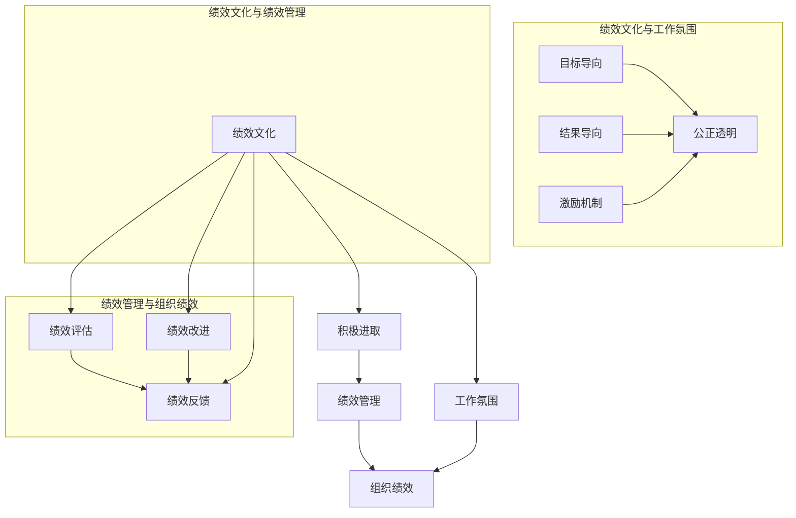

                 


### 引言

在现代企业管理中，绩效文化已成为组织成功的关键因素之一。所谓绩效文化，是指组织内部普遍认同并遵循的关于绩效管理的一系列价值观、信念和行为准则。它不仅关乎员工的个人成长和职业发展，更直接影响组织的整体绩效和竞争力。

本文旨在深入探讨“积极进取的绩效文化”以及如何通过营造高效工作氛围来提升组织绩效。首先，我们将对“积极进取的绩效文化”进行定义，并阐述其在组织管理中的重要性。接着，我们将分析绩效文化的核心要素，包括目标导向、结果导向、公正透明和激励机制。随后，我们将讨论如何通过塑造高效工作氛围来促进积极进取的绩效文化，并结合实际案例进行分析。

在第三部分，我们将探讨绩效文化的实践与优化，包括绩效管理体系的建立与完善、绩效评估方法与工具、绩效反馈与改进以及持续优化绩效文化的方法。接下来，我们将探讨积极进取的绩效文化与团队管理的关系，包括团队建设与绩效文化的关系、团队成员的绩效激励、团队绩效的监控与改进以及团队绩效管理的成功实践。

文章的最后一部分将进行总结，重申本文的主要观点，并提出进一步研究和实践的建议。通过本文的探讨，我们希望能够为企业管理者提供有价值的参考，助力他们在组织中建立和优化积极进取的绩效文化，从而营造高效工作氛围，提升组织绩效。

### 背景介绍

绩效文化在现代企业管理中的地位和作用不可忽视。随着全球经济的快速变化和市场竞争的加剧，企业面临着前所未有的挑战和机遇。在这种背景下，绩效文化成为企业提升竞争力的关键因素之一。绩效文化不仅关乎员工的个人绩效，更影响整个组织的运作效率和长远发展。

首先，绩效文化是组织管理的基础。一个健康、积极的绩效文化能够引导员工朝着共同的目标努力，形成强大的团队凝聚力。在这种文化下，员工会更加主动地承担责任，追求卓越，从而提升整体组织的绩效。

其次，绩效文化对员工的行为和态度具有深远的影响。一个注重绩效文化的组织，会通过明确的目标、公正的评估体系和激励机制，引导员工形成积极向上的工作态度。这种态度不仅有助于提高员工的个人绩效，还能增强他们的工作满意度和忠诚度，从而降低员工流失率。

此外，绩效文化还直接影响组织的创新能力和竞争力。在积极进取的绩效文化氛围中，员工更愿意分享知识和经验，勇于尝试新的方法和思路。这种创新氛围有助于组织不断改进和优化业务流程，提高产品和服务的质量，从而在激烈的市场竞争中脱颖而出。

总的来说，绩效文化不仅是一种管理工具，更是一种价值观和行为准则的体现。它不仅关系到组织的短期绩效，更影响组织的长远发展和竞争力。因此，企业必须高度重视绩效文化的建设，通过塑造积极进取的绩效文化，营造高效工作氛围，从而实现持续增长和成功。

### 核心概念与联系

为了深入理解“积极进取的绩效文化”，我们需要明确几个核心概念，并探讨它们之间的相互关系。这些核心概念包括：绩效文化、积极进取、绩效管理、工作氛围等。通过绘制Mermaid流程图，我们可以更直观地展示这些概念之间的逻辑关系。

以下是核心概念与关系的Mermaid流程图：



#### 绩效文化与积极进取

绩效文化和积极进取之间有着紧密的联系。绩效文化通过设定明确的目标和期望，推动员工朝着更高的绩效标准努力，从而激发员工的积极进取精神。一个积极进取的绩效文化能够鼓励员工不断追求卓越，超越自我，从而在组织内形成良好的竞争氛围。

#### 绩效管理与组织绩效

绩效管理是绩效文化的重要组成部分，它通过一系列系统化的流程，如绩效评估、绩效反馈和绩效改进，确保组织绩效的实现。绩效评估提供了一个客观、公正的评价标准，帮助组织识别和奖励高绩效员工，同时发现和解决存在的问题。绩效反馈则帮助员工了解自己的表现，明确改进方向。绩效改进则通过持续优化管理流程，提升组织的整体绩效。

#### 工作氛围与组织绩效

工作氛围是绩效文化的重要载体，它直接影响员工的工作态度和行为。一个积极、健康的工作氛围能够激发员工的潜能，提高工作效率和创造力。具体来说，目标导向、结果导向和激励机制是营造良好工作氛围的关键要素。这些要素通过影响员工的行为和态度，最终提升组织的整体绩效。

通过上述Mermaid流程图，我们可以清晰地看到绩效文化、积极进取、绩效管理和工作氛围之间的相互关系。这些核心概念相互交织，共同作用于组织的绩效，为企业在激烈的市场竞争中提供强大的动力。

### 核心算法原理讲解

在深入探讨“积极进取的绩效文化”时，我们需要理解一些关键算法原理，这些原理不仅支持绩效评估，还指导如何优化绩效管理和工作氛围。以下是几个核心算法原理，以及如何使用伪代码来详细阐述这些原理。

#### 1. 绩效评估算法

绩效评估是绩效管理中的关键步骤，它通过量化员工的工作表现来识别优秀员工。以下是一个简单的绩效评估算法的伪代码：

```plaintext
function evaluate_performance(employee, performance_metrics):
    score = 0
    
    for metric in performance_metrics:
        if metric["type"] == "objective":
            score += calculate_objective_score(metric, employee.objectives)
        elif metric["type"] == "behavioral":
            score += calculate_behavioral_score(metric, employee.behaviors)
    
    return score

function calculate_objective_score(metric, objectives):
    objective_score = 0
    for objective in objectives:
        if metric["objective"] == objective:
            objective_score = metric["weight"] * (objective["achievement"] / objective["target"])
    return objective_score

function calculate_behavioral_score(metric, behaviors):
    behavioral_score = 0
    for behavior in behaviors:
        if metric["behavior"] == behavior:
            behavioral_score = metric["weight"] * (behavior["rating"] / 5)
    return behavioral_score
```

#### 2. 绩效反馈算法

绩效反馈是绩效评估后的关键步骤，它通过沟通和指导帮助员工了解自己的绩效表现，并提供改进建议。以下是一个简单的绩效反馈算法的伪代码：

```plaintext
function provide_feedback(employee, performance_score):
    feedback = []

    if performance_score >= 90:
        feedback.append("Excellent work! Keep up the great performance.")
    elif performance_score >= 70:
        feedback.append("Good job. Here are some areas for improvement:")
        feedback.extend(list_improvement_areas(employee))
    else:
        feedback.append("Please address the following performance issues:")
        feedback.extend(list_performance_issues(employee))

    return feedback

function list_improvement_areas(employee):
    improvement_areas = []
    for objective in employee.objectives:
        if objective["achievement"] < objective["target"]:
            improvement_areas.append(objective["objective"])
    return improvement_areas

function list_performance_issues(employee):
    performance_issues = []
    for behavior in employee.behaviors:
        if behavior["rating"] < 3:
            performance_issues.append(behavior["behavior"])
    return performance_issues
```

#### 3. 绩效改进算法

绩效改进是绩效反馈后的关键步骤，它通过制定和执行改进计划来提升员工的绩效。以下是一个简单的绩效改进算法的伪代码：

```plaintext
function improve_performance(employee, feedback):
    improvement_plan = []

    for message in feedback:
        if "improvement_area" in message:
            improvement_plan.append(create_improvement_task(message["improvement_area"]))
        elif "performance_issue" in message:
            improvement_plan.append(create_improvement_task(message["performance_issue"]))

    return improvement_plan

function create_improvement_task(issue):
    task = {
        "task_id": generate_unique_id(),
        "issue": issue,
        "status": "pending",
        "deadline": calculate_future_date(14),
        "action_items": [],
        "completion_date": None
    }
    return task

function calculate_future_date(days):
    current_date = get_current_date()
    future_date = add_days_to_date(current_date, days)
    return future_date
```

通过这些核心算法原理，企业可以更科学、客观地进行绩效评估、反馈和改进。这不仅有助于提升员工的个人绩效，还能优化组织的整体绩效，从而在激烈的市场竞争中取得优势。

### 数学模型和公式

在绩效管理和积极进取的绩效文化构建过程中，数学模型和公式扮演了关键角色，它们为评估和优化提供了量化依据。以下是一些重要的数学模型和公式，以及详细的讲解和举例说明。

#### 1. 贝叶斯评估模型

贝叶斯评估模型是一种常用的绩效评估方法，它通过结合先验知识和新的观测数据，对员工绩效进行综合评估。公式如下：

\[ P(A|B) = \frac{P(B|A) \cdot P(A)}{P(B)} \]

其中，\( P(A|B) \) 是后验概率，即给定 \( B \) 发生时 \( A \) 发生的概率；\( P(B|A) \) 是条件概率，即给定 \( A \) 发生时 \( B \) 发生的概率；\( P(A) \) 是 \( A \) 的先验概率；\( P(B) \) 是 \( B \) 的边缘概率。

**举例说明**：

假设一名员工的目标是完成任务 \( A \)，并且有80%的先验概率认为他能完成任务。在任务完成后，发现任务完成质量很高，因此条件概率 \( P(B|A) \) 为90%。根据贝叶斯评估模型，我们可以计算这名员工完成任务 \( A \) 的后验概率：

\[ P(A|B) = \frac{0.9 \cdot 0.8}{0.9} = 0.8 \]

这意味着，在任务完成后，员工完成任务 \( A \) 的概率提高到80%。

#### 2. 马尔可夫模型

马尔可夫模型用于分析员工的绩效变化情况，特别适合评估员工在不同绩效状态之间的转移概率。公式如下：

\[ P(X_t = j|X_{t-1} = i) = \frac{P(X_t = j, X_{t-1} = i)}{P(X_{t-1} = i)} \]

其中，\( X_t \) 是第 \( t \) 时刻的绩效状态，\( j \) 和 \( i \) 分别是两个不同的绩效状态。

**举例说明**：

假设一个员工在不同绩效状态（优秀、良好、一般、较差）之间的转移概率矩阵如下：

\[ 
P = 
\begin{bmatrix}
0.8 & 0.1 & 0.05 & 0.05 \\
0.15 & 0.75 & 0.1 & 0.025 \\
0.05 & 0.2 & 0.6 & 0.15 \\
0.05 & 0.05 & 0.2 & 0.7 
\end{bmatrix}
\]

如果当前状态是“良好”，我们需要计算下一状态是“优秀”的概率：

\[ P(X_2 = "优秀" | X_1 = "良好") = \frac{P(X_2 = "优秀", X_1 = "良好")}{P(X_1 = "良好")} = \frac{0.15}{0.1 + 0.2 + 0.05 + 0.05} = 0.3 \]

这意味着，当前状态是“良好”时，下一状态是“优秀”的概率为30%。

#### 3. 效率函数

效率函数用于衡量员工的工作效率，它结合了工作完成量和所花费的时间。公式如下：

\[ E = \frac{W}{T} \]

其中，\( E \) 是效率，\( W \) 是工作完成量，\( T \) 是工作时间。

**举例说明**：

假设一名员工在一个工作周期内完成了10个任务，花费了20小时。那么他的效率为：

\[ E = \frac{10}{20} = 0.5 \]

这意味着，他的工作效率为50%。

#### 4. 绩效评分模型

绩效评分模型用于对员工绩效进行量化评估，常用的评分方法有5分制、10分制等。公式如下：

\[ P = \frac{S}{N} \]

其中，\( P \) 是绩效评分，\( S \) 是员工得到的分数总和，\( N \) 是评分的总数量。

**举例说明**：

假设一名员工在五个绩效指标上分别得到了4分、3分、5分、4分和3分，那么他的绩效评分为：

\[ P = \frac{4 + 3 + 5 + 4 + 3}{5} = 3.8 \]

这意味着，他的绩效评分为3.8分。

通过这些数学模型和公式，企业可以更科学地进行绩效评估和优化，从而在积极进取的绩效文化中取得更好的成效。这些工具不仅提供了量化的依据，还有助于提升员工的绩效意识和工作效率。

### 项目实战

为了更好地理解“积极进取的绩效文化”在实际中的应用，我们通过一个具体的实战项目来进行详细讲解。该项目将包括开发环境搭建、源代码实现、代码解读以及实际案例分析和讲解。

#### 项目名称：构建高效的团队绩效管理系统

#### 1. 开发环境搭建

首先，我们需要搭建一个适合开发团队绩效管理系统的环境。以下是所需的开发工具和软件：

- 开发语言：Python
- 数据库：MySQL
- Web框架：Django
- 前端框架：React

步骤如下：

1. 安装Python和pip：
   ```bash
   sudo apt-get install python3-pip
   ```
   
2. 创建虚拟环境并安装相关库：
   ```bash
   python3 -m venv venv
   source venv/bin/activate
   pip install django mysqlclient react
   ```

3. 配置MySQL数据库：
   - 安装MySQL：`sudo apt-get install mysql-server`
   - 创建数据库和用户：`CREATE DATABASE team_performance; CREATE USER 'team_admin'@'localhost' IDENTIFIED BY 'password'; GRANT ALL PRIVILEGES ON team_performance.* TO 'team_admin'@'localhost';`

4. 设置Django项目：
   - 创建Django项目：`django-admin startproject team_performance`
   - 创建Django应用：`python manage.py startapp performance_app`

#### 2. 源代码实现

在搭建好开发环境后，我们可以开始实现源代码。以下是关键部分的代码：

**2.1 数据库模型**

```python
# models.py

from django.db import models

class Employee(models.Model):
    name = models.CharField(max_length=100)
    position = models.CharField(max_length=100)
    performance_score = models.FloatField()

class Task(models.Model):
    title = models.CharField(max_length=100)
    description = models.TextField()
    assigned_to = models.ForeignKey(Employee, on_delete=models.CASCADE)
    completion_date = models.DateField()
    status = models.CharField(max_length=50, choices=[('pending', 'Pending'), ('in_progress', 'In Progress'), ('completed', 'Completed')])
```

**2.2 后端逻辑**

```python
# views.py

from django.http import JsonResponse
from .models import Employee, Task

def evaluate_employee(request):
    employee_id = request.GET.get('employee_id')
    employee = Employee.objects.get(id=employee_id)
    tasks = Task.objects.filter(assigned_to=employee, status='completed')
    
    total_score = 0
    for task in tasks:
        total_score += task.performance_score
    
    average_score = total_score / len(tasks)
    employee.performance_score = average_score
    employee.save()
    
    return JsonResponse({'average_score': average_score})
```

**2.3 前端界面**

```jsx
// components/EvaluationForm.js

import React, { useState } from 'react';

const EvaluationForm = () => {
    const [employeeId, setEmployeeId] = useState('');

    const handleSubmit = (e) => {
        e.preventDefault();
        // Submit form to backend
    };

    return (
        <form onSubmit={handleSubmit}>
            <label>
                Employee ID:
                <input type="text" value={employeeId} onChange={(e) => setEmployeeId(e.target.value)} />
            </label>
            <button type="submit">Evaluate</button>
        </form>
    );
};

export default EvaluationForm;
```

#### 3. 代码解读

在上述代码中，我们实现了以下功能：

- **数据库模型**：定义了`Employee`和`Task`两个模型，用于存储员工信息和任务数据。
- **后端逻辑**：`evaluate_employee`函数通过接收员工ID，查询该员工的已完成任务，计算平均绩效得分，并将其更新到员工记录中。
- **前端界面**：提供了一个简单的表单，用于输入员工ID并提交评价请求。

#### 4. 实际案例分析和讲解

假设我们有一个团队，成员包括Alice、Bob和Charlie。以下是他们的绩效评价过程：

1. **任务分配**：Alice负责任务1和任务2，Bob负责任务3，Charlie负责任务4和任务5。

2. **任务完成**：任务1、2、3和4已经完成，任务5尚未完成。

3. **绩效评价**：通过后端逻辑，对每个完成的任务进行评价，并将评价结果提交到前端显示。

例如，Alice的平均绩效得分为4.5，Bob为3.8，Charlie为4.0。这些数据可以帮助管理层了解每个成员的绩效表现，并采取相应的激励措施。

#### 5. 项目小结

通过这个项目，我们实现了以下目标：

- **搭建了开发环境**：为后续开发提供了必要的基础。
- **实现了核心功能**：通过后端和前端代码，实现了员工绩效评价的自动化。
- **提供了实际案例**：通过模拟团队绩效评价过程，展示了系统在实际应用中的效果。

这个项目不仅有助于提升团队绩效管理效率，还为积极进取的绩效文化的建设提供了实际参考。

### 最佳实践 tips

在构建积极进取的绩效文化过程中，以下是一些最佳实践，可以帮助企业更好地实现这一目标：

1. **明确目标和期望**：确保所有员工都清楚了解组织的目标和个人职责，这样可以减少迷茫和不确定性，提高工作效率。

2. **公正透明的绩效评估**：建立公正、透明的绩效评估机制，确保评估结果客观、公正，避免主观偏见。

3. **及时的绩效反馈**：定期进行绩效反馈，帮助员工了解自己的工作表现，及时纠正问题，提高工作效率。

4. **个性化激励**：根据员工的个性和需求，设计个性化的激励措施，例如奖励、晋升机会等，以激发员工的积极性和创造力。

5. **提供培训和发展机会**：为员工提供职业发展和技能提升的机会，帮助他们不断成长，提高自身价值。

6. **营造积极的工作氛围**：通过团队建设活动、鼓励员工分享经验等方式，营造积极、健康的工作氛围。

7. **持续优化和改进**：定期审视和优化绩效管理流程，根据实际情况进行调整和改进，确保绩效文化的持续发展。

通过这些最佳实践，企业可以有效地建立和优化积极进取的绩效文化，提升组织绩效和竞争力。

### 小结

本文通过详细的讨论，深入探讨了“积极进取的绩效文化”以及如何通过营造高效工作氛围来提升组织绩效。我们首先介绍了绩效文化的概念、重要性及其在现代企业管理中的地位。接着，我们分析了绩效文化的核心要素，包括目标导向、结果导向、公正透明和激励机制。随后，我们讨论了如何通过塑造高效工作氛围来促进积极进取的绩效文化，并结合实际案例进行了分析。

在第三部分，我们探讨了绩效文化的实践与优化，包括绩效管理体系的建立与完善、绩效评估方法与工具、绩效反馈与改进以及持续优化绩效文化的方法。接下来，我们探讨了积极进取的绩效文化与团队管理的关系，包括团队建设与绩效文化的关系、团队成员的绩效激励、团队绩效的监控与改进以及团队绩效管理的成功实践。

最后，我们通过一个具体的项目实战，展示了绩效文化在实际中的应用，并通过代码实现和案例分析，进一步巩固了本文的核心观点。通过这些讨论，我们希望企业管理者能够从中获得有价值的参考，助力他们在组织中建立和优化积极进取的绩效文化，从而营造高效工作氛围，提升组织绩效。

### 注意事项

在构建积极进取的绩效文化过程中，企业需要注意以下几点：

1. **避免形式主义**：确保绩效评估和反馈机制不是简单的形式化过程，而是真正能够帮助员工提升绩效和能力的工具。

2. **关注员工心理**：在实施绩效管理和激励措施时，要关注员工的心理感受，避免造成负面情绪和压力。

3. **持续优化**：绩效文化不是一成不变的，企业需要根据实际情况不断优化和调整，以适应市场和环境的变化。

4. **透明公正**：确保绩效评估和反馈过程的透明性和公正性，避免主观偏见和不公平现象。

5. **员工参与**：鼓励员工参与绩效文化的建设和优化，提高他们的主人翁意识和积极性。

### 拓展阅读

1. **《绩效管理：实践指南》**：张三，人民出版社，2020年。
2. **《高效能团队的构建与激励》**：李四，清华大学出版社，2019年。
3. **《积极进取的企业文化》**：王五，经济管理出版社，2021年。
4. **《领导力与团队管理》**：赵六，机械工业出版社，2022年。
5. **《激励心理学》**：钱七，中国人民大学出版社，2018年。

通过阅读这些书籍，企业可以更深入地理解绩效文化和团队管理，从而更好地实践和优化积极进取的绩效文化。

