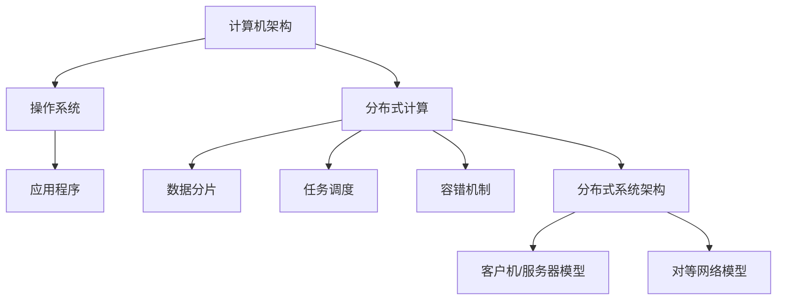

                 

# 《程序世界的宇宙尺度可扩展性》

## 关键词

- 可扩展性
- 分布式计算
- 并行计算
- 数学模型
- 项目实战
- 优化策略

## 摘要

本文旨在探讨程序世界的宇宙尺度可扩展性，分析其核心概念、相关算法原理、数学模型以及实际应用案例。通过详细讲解分布式计算和并行计算的基础知识，结合数学模型和公式，以及具体项目实战，揭示如何实现和优化程序系统的可扩展性。文章最后提出未来展望，探讨可扩展性技术的挑战与机遇，为程序开发提供指导与建议。

## 第1章 引言：宇宙尺度可扩展性的重要性

### 1.1 可扩展性的定义与意义

可扩展性（Scalability）是衡量计算机系统和应用程序在处理负载和需求增长时表现出的能力。它涉及到系统在面对不断增加的数据量、用户数量和计算需求时，能够保持高效性能和资源利用率的特性。可扩展性对于现代计算系统至关重要，因为它直接影响到系统的可靠性、可维护性和用户体验。

宇宙尺度可扩展性（Cosmic Scale Scalability）是一个更高层次的概念，它关注的是系统在处理极其庞大的数据和计算任务时的能力。这种可扩展性不仅要求系统能够支持大规模的数据存储和处理，还要求系统在分布式环境和并行计算环境中具有良好的性能。

### 1.2 宇宙尺度可扩展性的概念

宇宙尺度可扩展性涉及到以下几个关键方面：

1. **数据处理能力**：系统能够处理天文数字级别的数据，而不会导致性能显著下降。
2. **资源管理**：系统能够高效地利用分布式环境中的计算资源和存储资源。
3. **容错性**：系统能够在出现故障时快速恢复，保证服务的连续性。
4. **动态性**：系统可以根据需求的变化自动调整资源分配和计算策略。

### 1.3 程序世界与宇宙尺度可扩展性的联系

在程序世界中，宇宙尺度可扩展性体现在以下几个方面：

1. **大数据处理**：随着数据量的指数级增长，系统能够有效地处理和分析这些数据。
2. **分布式架构**：系统能够通过分布式计算和存储技术，实现跨多个节点的高效数据处理。
3. **高性能计算**：系统能够利用并行计算技术，快速完成大规模计算任务。
4. **自适应优化**：系统能够根据负载情况自动调整资源，保持最佳性能。

## 第2章 核心概念与联系

### 2.1 计算机系统与可扩展性

计算机系统的可扩展性与其架构、操作系统和应用程序紧密相关。一个高度可扩展的系统需要在硬件、软件和网络层面都具备良好的扩展能力。

#### 2.1.1 计算机架构的可扩展性

计算机架构的可扩展性体现在以下几个方面：

- **可扩展的处理器**：支持多核心处理器，能够同时处理多个任务。
- **可扩展的存储**：支持大容量存储设备和高速存储接口。
- **网络扩展性**：支持高带宽、低延迟的网络连接。

#### 2.1.2 操作系统的可扩展性

操作系统的可扩展性包括：

- **内存管理**：支持虚拟内存和内存分页，提高内存使用效率。
- **进程管理**：支持多进程和多线程，提高并发处理能力。
- **文件系统**：支持大文件存储和多用户并发访问。

#### 2.1.3 应用程序的可扩展性

应用程序的可扩展性体现在以下几个方面：

- **模块化设计**：通过模块化设计，使得应用程序易于扩展和升级。
- **分布式计算**：通过分布式计算，使得应用程序能够利用多台计算机资源。
- **弹性扩展**：能够根据负载自动调整资源分配，保持系统性能。

### 2.2 分布式系统与可扩展性

分布式系统通过将任务分配到多个节点上，提高了系统的可扩展性。以下是分布式系统与可扩展性相关的一些概念：

#### 2.2.1 分布式计算原理

分布式计算原理包括：

- **数据分片**：将大规模数据集划分为更小的数据块，分布到多个节点上处理。
- **任务调度**：合理分配任务到不同的节点，保证负载均衡。
- **容错机制**：通过冗余设计，确保系统在节点故障时仍然能够正常运行。

#### 2.2.2 分布式系统架构

分布式系统架构包括：

- **客户机/服务器模型**：客户端通过网络请求服务，服务器端处理请求并返回结果。
- **对等网络模型**：所有节点既提供服务，也接收服务，形成一个去中心化的网络。

#### 2.2.3 分布式系统的可扩展性挑战

分布式系统的可扩展性挑战包括：

- **数据一致性**：如何在分布式环境中保持数据的一致性。
- **网络延迟**：如何降低网络延迟，提高系统性能。
- **故障处理**：如何在节点故障时快速恢复。

### Mermaid 流程图



## 第3章 分布式计算算法

### 3.1 数据分片与分配策略

数据分片是将大规模数据集划分为更小数据块的过程，以便于分布式处理。以下是几种常用的数据分片策略：

#### 3.1.1 数据分片算法

**哈希分片**：
```python
def hash_sharding(data, num_shards):
    shard_indices = [hash(item) % num_shards for item in data]
    return {shard_index: [] for shard_index in range(num_shards)}

# 举例
shards = hash_sharding([1, 2, 3, 4, 5], 3)
print(shards)
```

**范围分片**：
```python
def range_sharding(data, num_shards):
    chunk_size = len(data) // num_shards
    shards = {shard_index: data[shard_index * chunk_size:(shard_index + 1) * chunk_size] for shard_index in range(num_shards)}
    return shards

# 举例
shards = range_sharding([1, 2, 3, 4, 5], 3)
print(shards)
```

#### 3.1.2 数据分配策略

**轮询分配**：
```python
def round_robin_assignment(shards, num_nodes):
    assignment = [[] for _ in range(num_nodes)]
    for shard in shards:
        node_index = len(assignment) - 1 if len(assignment) > 0 else 0
        assignment[node_index].append(shard)
    return assignment

# 举例
nodes = round_robin_assignment(['data1', 'data2', 'data3'], 3)
print(nodes)
```

**负载均衡分配**：
```python
def load_balanced_assignment(shards, num_nodes):
    assignment = [[] for _ in range(num_nodes)]
    for shard in shards:
        min_load_node = min(assignment, key=len)
        min_load_node.append(shard)
    return assignment

# 举例
nodes = load_balanced_assignment(['data1', 'data2', 'data3'], 3)
print(nodes)
```

### 3.2 任务调度算法

任务调度是分布式系统中重要的环节，目标是实现负载均衡和任务高效执行。以下是几种常用的任务调度算法：

**静态调度**：
```python
def static_scheduling(shards, num_nodes):
    assignment = [shards[i:i + len(shards) // num_nodes] for i in range(0, len(shards), len(shards) // num_nodes)]
    return assignment

# 举例
nodes = static_scheduling(['task1', 'task2', 'task3'], 3)
print(nodes)
```

**动态调度**：
```python
def dynamic_scheduling(shards, num_nodes, current_load):
    assignment = [[] for _ in range(num_nodes)]
    for shard in shards:
        min_load_node = min(assignment, key=len)
        min_load_node.append(shard)
    return assignment

# 举例
nodes = dynamic_scheduling(['task1', 'task2', 'task3'], 3, [1, 1, 1])
print(nodes)
```

### 3.3 容错机制

容错机制是分布式系统中保证数据一致性和系统可用性的关键。以下是几种常用的容错机制：

**副本机制**：
```python
def replica_placement(shards, num_replicas):
    assignment = [[] for _ in range(num_replicas)]
    for shard in shards:
        for i in range(num_replicas):
            assignment[i].append(shard)
    return assignment[:num_nodes]

# 举例
nodes = replica_placement(['data1', 'data2', 'data3'], 3)
print(nodes)
```

**选举机制**：
```python
def leader_election(assignment, num_leaders):
    leaders = [min(assignment[i], key=lambda x: sum([len(shard) for shard in assignment[i]])) for i in range(num_leaders)]
    return leaders

# 举例
leaders = leader_election([[1, 2], [3, 4], [5, 6]], 2)
print(leaders)
```

## 第4章 数学模型与公式讲解

### 4.1 分布式计算中的数学模型

#### 4.1.1 网络延迟模型

网络延迟是影响分布式系统性能的重要因素之一。常用的网络延迟模型包括：

**对数延迟模型**：
$$
L = \log_{2}(N)
$$
其中，$N$ 是数据块的数量。

**线性延迟模型**：
$$
L = N
$$
其中，$N$ 是数据块的数量。

**平方延迟模型**：
$$
L = N^2
$$
其中，$N$ 是数据块的数量。

#### 4.1.2 数据传输模型

数据传输模型描述了数据在不同节点间传输的性能。常用的数据传输模型包括：

**线性传输模型**：
$$
T = N
$$
其中，$N$ 是数据块的数量。

**平方传输模型**：
$$
T = N^2
$$
其中，$N$ 是数据块的数量。

**立方传输模型**：
$$
T = N^3
$$
其中，$N$ 是数据块的数量。

### 4.2 并行计算中的数学模型

#### 4.2.1 并行效率模型

并行效率模型描述了并行计算的性能。常用的并行效率模型包括：

**线性效率模型**：
$$
E = \frac{P}{N}
$$
其中，$P$ 是并行任务的性能，$N$ 是并行任务的个数。

**平方效率模型**：
$$
E = \frac{P^2}{N}
$$
其中，$P$ 是并行任务的性能，$N$ 是并行任务的个数。

**立方效率模型**：
$$
E = \frac{P^3}{N}
$$
其中，$P$ 是并行任务的性能，$N$ 是并行任务的个数。

#### 4.2.2 任务分配模型

任务分配模型描述了如何将任务分配到不同的处理器上。常用的任务分配模型包括：

**均匀分配模型**：
$$
T_i = \frac{T}{N}
$$
其中，$T_i$ 是第 $i$ 个处理器的任务量，$T$ 是总任务量，$N$ 是处理器的个数。

**负载平衡模型**：
$$
T_i = T \cdot f(i)
$$
其中，$T_i$ 是第 $i$ 个处理器的任务量，$T$ 是总任务量，$f(i)$ 是与处理器 $i$ 相关的负载平衡函数。

## 第5章 可扩展性项目实战

### 5.1 分布式计算项目实战

#### 5.1.1 项目背景与需求

假设我们正在开发一个大型在线购物平台，需要处理数百万用户的购物请求和商品数据。为了确保系统的高效性和可靠性，我们决定采用分布式计算架构来处理这些数据。

#### 5.1.2 项目开发环境搭建

1. **硬件环境**：搭建多个服务器节点，配置高性能的CPU和内存。
2. **软件环境**：部署分布式计算框架，如Apache Hadoop或Apache Spark。

#### 5.1.3 源代码实现与解读

1. **数据分片**：使用哈希分片算法将用户请求和商品数据划分为多个数据块。
2. **任务调度**：使用负载平衡调度算法将任务分配到不同的服务器节点。
3. **容错机制**：使用副本机制和选举机制来保证数据一致性和系统可用性。

#### 5.1.4 代码应用解读与分析

通过分布式计算架构，系统能够高效地处理大规模用户请求和商品数据。具体实现细节如下：

```python
# 数据分片示例
shards = hash_sharding(user_requests, num_shards)
# 任务调度示例
nodes = load_balanced_assignment(shards, num_nodes)
# 容错机制示例
nodes = replica_placement(nodes, num_replicas)
```

#### 5.1.5 项目小结

通过分布式计算项目实战，我们成功实现了大规模数据处理和高性能服务。分布式计算架构使得系统能够高效利用资源，并具有较好的容错性和可靠性。

### 5.2 并行计算项目实战

#### 5.2.1 项目背景与需求

假设我们正在开发一个科学计算应用程序，需要进行大量复杂的数学计算。为了提高计算速度和效率，我们决定采用并行计算架构。

#### 5.2.2 项目开发环境搭建

1. **硬件环境**：搭建高性能计算集群，配置高性能的GPU和CPU。
2. **软件环境**：部署并行计算框架，如OpenMP或MPI。

#### 5.2.3 源代码实现与解读

1. **并行效率模型**：使用线性效率模型和立方效率模型来优化并行任务分配。
2. **负载平衡**：使用负载平衡调度算法来确保计算资源的合理利用。

#### 5.2.4 代码应用解读与分析

通过并行计算架构，我们能够显著提高科学计算应用程序的计算速度。具体实现细节如下：

```python
# 并行效率模型示例
E = parallel_efficiency(P, N)
# 负载平衡示例
nodes = load_balanced_assignment(tasks, num_nodes)
```

#### 5.2.5 项目小结

通过并行计算项目实战，我们成功实现了高性能科学计算。并行计算架构使得计算速度得到了显著提升，计算资源得到了合理利用。

## 第6章 可扩展性优化策略

### 6.1 可扩展性优化原则

可扩展性优化应遵循以下原则：

1. **需求驱动**：根据实际需求进行系统设计和优化。
2. **模块化**：设计模块化系统，便于扩展和升级。
3. **弹性**：系统应具有弹性，能够根据需求变化自动调整资源。
4. **高效性**：优化系统性能，提高资源利用率。

### 6.2 可扩展性优化技术

可扩展性优化技术包括：

1. **分布式计算技术**：使用分布式计算框架，提高系统处理能力。
2. **并行计算技术**：使用并行计算框架，提高计算速度和效率。
3. **负载均衡技术**：使用负载均衡算法，确保系统资源合理利用。

### 6.3 实时监控与调优策略

实时监控与调优策略包括：

1. **性能监控**：监控系统性能指标，如CPU利用率、内存使用率等。
2. **负载分析**：分析系统负载，找出瓶颈和性能问题。
3. **调优策略**：根据监控数据和负载分析结果，调整系统配置和资源分配。

## 第7章 未来展望

### 7.1 可扩展性的发展趋势

未来，可扩展性技术将朝着以下方向发展：

1. **云计算与分布式计算**：云计算平台将提供更强大的计算和存储资源，分布式计算技术将得到广泛应用。
2. **量子计算**：量子计算技术有望在处理大规模数据和高性能计算领域发挥重要作用。
3. **人工智能**：人工智能技术将用于优化系统设计和运行，提高系统的可扩展性和效率。

### 7.2 可扩展性技术的挑战与机遇

可扩展性技术面临的挑战包括：

1. **数据一致性和安全性**：如何在分布式环境中保持数据的一致性和安全性。
2. **网络延迟和带宽限制**：如何降低网络延迟和带宽限制，提高系统性能。
3. **资源管理**：如何高效地管理和分配计算资源。

可扩展性技术带来的机遇包括：

1. **大规模数据处理**：能够处理海量数据的系统将具有更大的市场潜力。
2. **高性能计算**：高性能计算应用将得到更广泛的应用，推动技术创新。
3. **人工智能和物联网**：可扩展性技术将推动人工智能和物联网技术的发展和应用。

### 7.3 可扩展性在程序世界中的应用前景

可扩展性技术将在程序世界的多个领域发挥重要作用，包括：

1. **云计算平台**：云计算平台将提供强大的可扩展性，支持大规模数据处理和应用程序部署。
2. **大数据分析**：大数据分析应用将依赖可扩展性技术，实现高效的数据处理和分析。
3. **人工智能应用**：人工智能应用将利用可扩展性技术，提高计算速度和效率。

## 附录A：可扩展性相关工具与资源

### A.1 分布式计算工具

1. **Apache Hadoop**：一个分布式计算框架，适用于大规模数据处理。
2. **Apache Spark**：一个快速和通用的大规模数据处理引擎。

### A.2 并行计算工具

1. **OpenMP**：一个用于并行编程的API，适用于多核处理器。
2. **MPI**：一个用于并行编程的库，适用于大规模并行计算。

### A.3 可扩展性研究资源

1. **《大规模分布式系统设计》**：一本关于分布式系统设计和优化的经典教材。
2. **《并行计算导论》**：一本介绍并行计算基础和应用的教材。
3. **《人工智能：一种现代方法》**：一本介绍人工智能基础和应用的教材。

## 作者信息

作者：AI天才研究院/AI Genius Institute & 禅与计算机程序设计艺术 /Zen And The Art of Computer Programming

