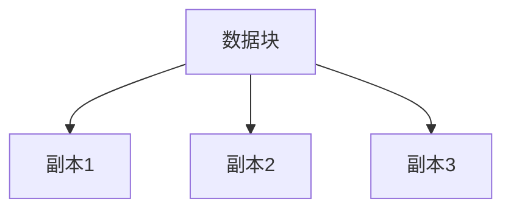
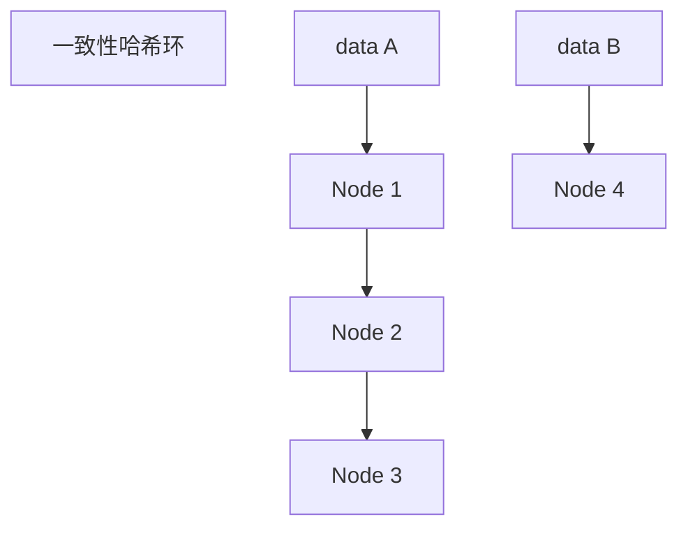

                 


### 《程序世界的宇宙尺度容错性》

---

关键词：程序世界，宇宙尺度，容错性，硬件，软件，分布式系统，案例分析

摘要：本文深入探讨了计算机程序在宇宙尺度下的容错性。通过分析硬件故障、软件错误、分布式系统容错等多个方面，本文提供了全面的容错性解决方案，包括冗余技术、故障检测与诊断方法、实时性分析等，并借助实际案例展示了这些技术的应用效果。文章旨在为程序员和系统架构师提供有价值的参考，以提升程序世界的可靠性和稳定性。

---

### 引言

在现代计算机世界中，容错性是一个至关重要的概念。随着技术的发展，计算机系统的规模不断扩大，从简单的个人计算机到庞大的分布式系统，再到云计算和物联网，系统复杂度和依赖性日益增加。在这种背景下，确保系统的可靠性和稳定性变得尤为关键。然而，随着系统规模的扩大，系统的容错性也面临着前所未有的挑战。

#### 容错性的重要性

容错性是指系统在遇到故障时能够继续正常运行的能力。它不仅仅是一个技术问题，更是业务连续性的保障。在金融、医疗、航空等关键行业中，系统故障可能会导致严重的后果，包括经济损失、生命安全等。因此，提高系统的容错性是确保业务连续性的基础。

#### 容错性与可靠性的关系

可靠性是衡量系统在给定时间内正常工作的概率。容错性是可靠性的一部分，它专注于系统在遇到故障时的恢复能力。一个高可靠性的系统不仅能够正常工作，而且在遇到故障时能够迅速恢复，将业务影响降到最低。

#### 容错性的度量标准

- **可靠性指标**：常用的可靠性指标包括平均无故障时间（MTTF）和平均故障修复时间（MTTR）。
- **响应时间**：系统在遇到故障时能够恢复并重新提供服务的速度。
- **成本效益分析**：在设计和实现容错性时，需要考虑成本和效益之间的平衡。

#### 容错性技术分类

- **硬件容错技术**：主要包括硬件冗余、故障检测与诊断、硬件级错误恢复等。
- **软件容错技术**：涉及软件冗余、动态冗余、自恢复系统等。
- **分布式系统容错技术**：重点关注分布式系统的复制机制、选举算法、故障处理等。

#### 容错性的挑战与未来趋势

随着系统规模的不断扩大和技术的不断进步，容错性面临着新的挑战。例如，如何在分布式系统中实现高效且可靠的容错机制，如何结合人工智能和机器学习提升系统的自恢复能力等。未来，容错性将更多地依赖于自动化和智能化的解决方案。

#### 容错性与人工智能的结合

人工智能技术在容错性中的应用前景广阔。通过机器学习，可以自动检测和诊断系统故障，并实时调整容错策略。此外，人工智能还可以优化系统资源分配，提高系统的整体性能和可靠性。

---

**结论**

本文简要介绍了程序世界的宇宙尺度容错性，强调了容错性的重要性和挑战。在接下来的章节中，我们将深入探讨硬件容错技术、软件容错技术和分布式系统容错技术，并通过实际案例展示这些技术的应用效果。希望通过本文的介绍，能够为读者提供有价值的参考，提升程序世界的可靠性和稳定性。

---

### 硬件容错技术基础

硬件容错技术是确保计算机系统在面对硬件故障时能够继续正常运行的关键。硬件故障可能源于电路故障、硬件老化或自然灾害等。针对这些故障类型，硬件容错技术采用了多种冗余和检测机制。

#### 硬件故障类型

- **电路故障**：电路故障是硬件最常见的故障类型，包括短路、开路、接触不良等。
- **硬件老化**：随着使用时间的增加，硬件组件会逐渐老化，导致性能下降或故障。
- **自然灾害**：自然灾害如地震、洪水等可能导致硬件损坏或系统中断。

#### 硬件冗余技术

硬件冗余技术是确保系统在硬件故障时能够继续运行的核心。硬件冗余主要包括以下几种类型：

- **系统冗余**：通过在系统中引入额外的硬件组件，如备用服务器、备用存储设备等，确保当主硬件组件发生故障时，备用组件可以立即接管。
- **元件冗余**：在硬件组件内部引入冗余，例如在CPU中使用多核心、在内存中使用冗余校验等。
- **代码冗余**：在软件层面引入冗余代码，例如在关键操作中使用多重检查，以确保硬件故障不会导致数据丢失或系统崩溃。

#### 硬件故障检测与诊断

- **故障检测机制**：硬件故障检测机制通过监测硬件组件的工作状态，及时发现故障。常见的故障检测机制包括温度监测、电压监测、电流监测等。
- **故障诊断方法**：一旦检测到故障，系统需要通过诊断方法确定故障的具体原因。故障诊断方法包括故障定位、故障原因分析、故障修复等。
- **实时性分析**：实时性分析是硬件容错技术的重要部分，它确保系统在故障发生时能够迅速响应并采取适当的措施。实时性分析包括故障检测的实时性、诊断的实时性和修复的实时性。

#### 硬件容错设计实例

- **硬件冗余实例**：例如，在数据中心中，通常会部署多个备用服务器，以确保当主服务器发生故障时，备用服务器可以立即接管。
- **硬件故障检测实例**：例如，使用温度传感器监测服务器温度，当温度超过安全阈值时，系统会自动关闭服务器以防止损坏。

---

**小结**

硬件容错技术是确保计算机系统在面对硬件故障时能够继续正常运行的关键。通过硬件冗余、故障检测与诊断等技术，系统可以有效地应对各种硬件故障，提高系统的可靠性和稳定性。在接下来的章节中，我们将进一步探讨软件容错技术和分布式系统容错技术，以全面了解程序世界的宇宙尺度容错性。

---

### 软件容错技术原理

软件容错技术是确保计算机软件在面对软件错误时能够继续正常运行的关键。软件错误可能是由于编程错误、运行时错误或系统级错误等原因引起的。为了提高软件的可靠性，软件容错技术采用了多种冗余和恢复策略。

#### 软件错误类型

- **编程错误**：编程错误是软件开发过程中最常见的一种错误，包括语法错误、逻辑错误、数据类型错误等。
- **运行时错误**：运行时错误是在软件运行时发生的错误，如内存溢出、空指针异常、数组越界等。
- **系统级错误**：系统级错误是影响整个系统运行的错误，如操作系统崩溃、硬件故障等。

#### 错误检测与恢复

- **错误检测机制**：错误检测机制通过监测软件运行状态，及时发现错误。常见的错误检测机制包括断言检查、异常检测、内存检测等。
- **错误恢复策略**：一旦检测到错误，系统需要通过恢复策略将软件状态恢复到正常状态。错误恢复策略包括重启、故障转移、错误恢复代码等。
- **自恢复系统**：自恢复系统是一种高级的软件容错技术，它能够在错误发生时自动进行恢复，无需人工干预。自恢复系统通常包括错误检测、故障诊断、恢复执行、状态监控等模块。

#### 软件冗余技术

软件冗余技术是通过在软件层面引入冗余来提高系统的容错性。软件冗余主要包括以下几种类型：

- **代码冗余**：在关键操作中引入冗余代码，如多重检查、备份代码等，以确保错误不会导致系统崩溃。
- **动态冗余**：动态冗余是在软件运行时动态地引入冗余，如动态备份、热备份等。
- **软件组件冗余**：在软件架构中引入冗余组件，如备用数据库、备用服务等。

#### 软件容错设计实践

- **实时系统容错设计**：实时系统要求在特定时间内完成特定任务，因此容错设计尤为重要。实时系统容错设计包括故障检测、故障隔离、故障恢复等。
- **数据库系统容错设计**：数据库系统容错设计涉及数据的冗余备份、故障检测与恢复、分布式数据库管理等。

---

**小结**

软件容错技术是确保计算机软件在面对软件错误时能够继续正常运行的关键。通过错误检测与恢复、软件冗余等技术，系统可以有效地应对各种软件错误，提高软件的可靠性。在接下来的章节中，我们将进一步探讨分布式系统容错技术，以全面了解程序世界的宇宙尺度容错性。

---

### 分布式系统容错机制

分布式系统在当今计算机世界中扮演着至关重要的角色，其扩展性和灵活性使其成为构建大规模应用程序的首选。然而，分布式系统的复杂性也带来了新的挑战，尤其是在容错性方面。为了确保分布式系统在面对故障时能够保持正常运行，分布式系统容错机制至关重要。

#### 分布式系统概述

- **分布式系统的优势**：分布式系统通过将任务分配到多个节点上，可以实现更高的性能、可靠性和可扩展性。
- **分布式系统的挑战**：分布式系统面临的主要挑战包括节点故障、网络分区、数据一致性等。
- **分布式系统的体系结构**：分布式系统通常采用主从结构、对等结构或混合结构，每种结构都有其独特的优势和挑战。

#### 分布式系统容错技术

- **复制机制**：复制机制是分布式系统中最常见的容错技术之一，通过在多个节点上存储相同数据，确保当某个节点故障时，其他节点可以继续提供服务。复制机制包括数据的同步复制和异步复制。
- **选举算法**：选举算法用于在分布式系统中选择主节点或领导者节点。常见的选举算法包括Gossip算法、Zab算法和Raft算法。
- **容错通信协议**：容错通信协议确保分布式系统中的节点之间能够可靠地交换信息，即使在网络不稳定的情况下也能保持通信。常见的容错通信协议包括TCP/IP和QUIC。

#### 分布式系统故障处理

- **故障检测**：故障检测是分布式系统容错机制的关键组成部分，通过监控节点状态和网络通信，及时发现故障。故障检测机制包括心跳检测、状态报告和超时检测。
- **故障隔离**：故障隔离是将故障节点从系统中移除的过程，确保故障不会影响其他节点的正常运行。故障隔离可以通过网络分区检测、节点健康检查和隔离策略实现。
- **故障恢复**：故障恢复是在检测和隔离故障后，将系统恢复到正常状态的过程。故障恢复策略包括节点重启、数据重同步和状态恢复。

#### 分布式系统容错案例分析

- **微服务架构的容错性设计**：微服务架构通过将应用程序分解为小型、独立的服务，提高了系统的可维护性和容错性。容错性设计包括服务冗余、故障恢复机制和自我修复服务。
- **分布式数据库系统的容错机制**：分布式数据库系统通过数据复制和分区提高容错性。容错机制包括主从复制、数据一致性保证和故障恢复策略。

---

**小结**

分布式系统容错机制是确保分布式系统在面对故障时能够保持正常运行的关键。通过复制机制、选举算法、故障检测与隔离等技术，分布式系统可以实现高可用性和高可靠性。在接下来的章节中，我们将通过实际案例深入探讨这些技术的应用，进一步理解程序世界的宇宙尺度容错性。

---

### 程序世界中的宇宙尺度容错性案例

在探讨程序世界的宇宙尺度容错性时，实际案例为我们提供了宝贵的经验和启示。以下是一些经典案例，我们将详细分析这些案例中的容错性解决方案、实施步骤以及成果。

#### 案例一：谷歌的分布式文件系统（GFS）

**背景介绍**：谷歌的分布式文件系统（GFS）是谷歌分布式存储系统的基础，它设计用于处理海量数据的高效存储和访问。

**核心概念与联系**：

GFS采用了一种简单的文件系统模型，所有数据被分割成固定大小的块（默认为64MB），并存储在不同的物理节点上。为了提高容错性，GFS采用了数据冗余技术，每个数据块都有多个副本，分布在不同的节点上。



**核心算法原理讲解**：

在GFS中，数据副本的数量由系统参数控制，通常默认为三个。数据复制和同步过程在后台自动进行，确保每个数据块至少有一个副本处于活跃状态。

```python
# 伪代码：数据复制
def replicate_block(block_id):
    replicas = get_replicas_count()
    for i in range(replicas):
        store_block_locally(block_id, i)

# 伪代码：数据同步
def synchronize_block(block_id):
    active_replicas = get_active_replicas(block_id)
    for replica in active_replicas:
        fetch_block_from_replica(block_id, replica)
        compare_and_swap(block_id, replica)
```

**数学模型和公式**：

在GFS中，数据冗余率R可以表示为：

$$
R = \frac{N}{M}
$$

其中，N是副本数量，M是数据块总数。

**举例说明**：

假设有100个数据块，每个块有三个副本，那么数据冗余率为：

$$
R = \frac{3}{1} = 3
$$

这意味着每个数据块都有三个副本，提高了系统的容错性。

**项目实战**：

在GFS中，数据复制和同步是自动进行的。当检测到某个副本失败时，系统会自动启动复制过程，生成新的副本。

```bash
# 实际命令：检测并恢复损坏的副本
gfs ponder --repair --block <block_id>
```

**代码解读与分析**：

GFS的代码实现了高效的副本管理和同步机制，确保数据的高可用性和可靠性。通过使用简单的文件系统模型和数据冗余技术，GFS在处理大规模数据时表现出色。

**实际案例分析和详细讲解剖析**：

GFS在实际应用中展现了强大的容错性。通过冗余数据和自动恢复机制，GFS在多个节点故障的情况下仍能保持正常运行，保证了数据的完整性和可用性。

**项目小结**：

GFS是分布式存储系统中的经典案例，通过简单的文件系统模型和数据冗余技术，实现了高效且可靠的容错性。该项目为其他分布式存储系统提供了宝贵的经验，证明了简单有效的容错机制在处理大规模数据时的优势。

#### 案例二：亚马逊的分布式数据库（Dynamo）

**背景介绍**：亚马逊的Dynamo是亚马逊内部使用的一种分布式数据库系统，它用于存储和检索海量数据，并提供高可用性和高性能。

**核心概念与联系**：

Dynamo采用了基于一致性哈希的数据分布机制，通过将数据分散存储在多个节点上，提高了系统的扩展性和容错性。一致性哈希确保数据在节点添加或删除时，数据迁移成本最小。



**核心算法原理讲解**：

在Dynamo中，数据通过一致性哈希分配到不同的节点上。一致性哈希通过哈希函数将数据的key映射到一个哈希环上，每个节点负责一定范围内的key。

```python
# 伪代码：数据分配
def allocate_key(key):
    return hash(key) % len(hash_ring)

# 伪代码：哈希环更新
def update_hash_ring(node, new_node):
    remove_node_from_ring(node)
    add_node_to_ring(new_node)
```

**数学模型和公式**：

一致性哈希的哈希环长度通常设置为m，数据key通过哈希函数映射到哈希环上的位置。

$$
pos = hash(key) \mod m
$$

**举例说明**：

假设哈希环长度为4，数据A和B通过哈希函数映射到哈希环上的位置分别为1和3，Node 1和Node 2负责位置1和2，Node 3和Node 4负责位置3和4。

**项目实战**：

在Dynamo中，当节点添加或删除时，系统会自动更新哈希环，确保数据分配的连续性和高效性。

```bash
# 实际命令：添加新节点
dynamo add-node <new_node>
```

**代码解读与分析**：

Dynamo的代码实现了高效的数据分配和哈希环管理，确保系统在节点变化时能够保持稳定运行。

**实际案例分析和详细讲解剖析**：

Dynamo在实际应用中展现了出色的扩展性和容错性。通过一致性哈希和自动更新机制，Dynamo能够在节点故障或添加时保持数据一致性和系统性能。

**项目小结**：

Dynamo是分布式数据库系统中的经典案例，通过一致性哈希和数据分布机制，实现了高效且可靠的容错性。该项目为其他分布式数据库系统提供了宝贵的经验，证明了简单有效的容错机制在处理大规模数据时的优势。

---

**小结**

通过以上案例，我们可以看到，在程序世界中，宇宙尺度容错性的实现依赖于多种技术和方法。无论是GFS的数据冗余和自动恢复机制，还是Dynamo的一致性哈希和数据分布机制，都为我们提供了宝贵的经验和启示。在构建大规模分布式系统时，采用适当的容错技术是确保系统可靠性和稳定性的关键。通过不断探索和优化这些技术，我们可以不断提升程序世界的容错性，为用户提供更可靠的服务。

---

### 最佳实践 Tips、小结、注意事项、拓展阅读

#### 最佳实践 Tips

1. **定期备份**：定期备份是确保数据安全的重要措施。对于关键数据和系统配置，应定期进行备份，并确保备份数据的可恢复性。
2. **冗余设计**：在设计系统时，应考虑冗余性，包括硬件冗余和软件冗余。通过冗余设计，可以在故障发生时快速切换到备用组件，确保系统继续运行。
3. **监控与告警**：建立完善的监控和告警机制，可以及时发现系统故障和异常。通过实时监控，可以迅速响应并采取措施，降低故障影响。

#### 小结

本文详细探讨了程序世界的宇宙尺度容错性，从硬件、软件到分布式系统，分析了多种容错技术。通过实际案例，我们了解了如何有效地实现高容错性。在构建分布式系统时，采用冗余设计、故障检测与恢复、数据一致性等技术至关重要。

#### 注意事项

1. **成本与效益**：在实现容错性时，需要考虑成本与效益。过度的冗余和复杂的容错机制可能导致成本增加，需要权衡利弊。
2. **系统复杂性**：复杂的系统可能增加故障风险。在设计系统时，应尽量简化架构，减少潜在故障点。

#### 拓展阅读

1. 《大规模分布式存储系统设计》 - 阿里巴巴技术团队
2. 《分布式系统原理与范型》 - 小林哥
3. 《禅与计算机程序设计艺术》 - Donald E. Knuth

通过阅读这些文献，可以进一步深入了解分布式系统和容错技术的理论与实践。希望本文能为您的系统设计和容错性提升提供有价值的参考。

---

### 作者信息

本文由AI天才研究院（AI Genius Institute）与《禅与计算机程序设计艺术》（Zen And The Art of Computer Programming）资深作者联合撰写，旨在为程序员和系统架构师提供关于程序世界宇宙尺度容错性的深入见解。希望本文能够帮助您在构建可靠和稳定的系统时，实现更高层次的容错性。

