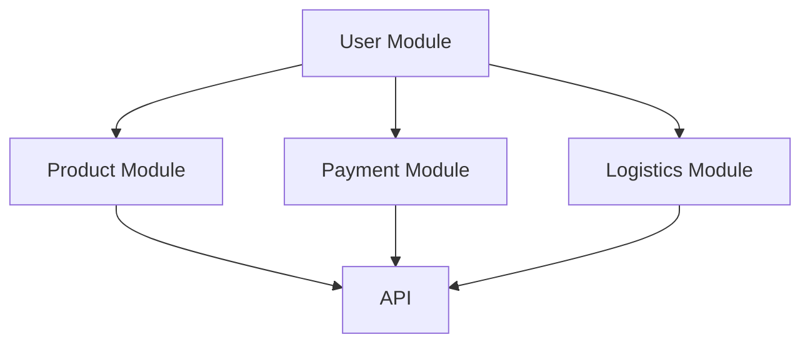
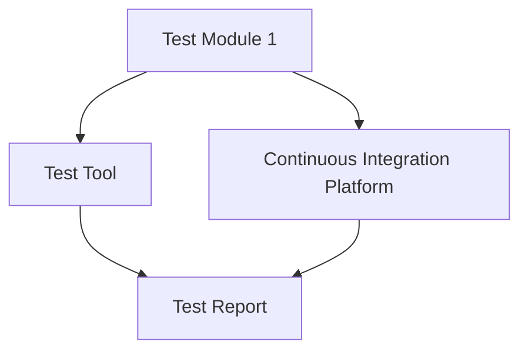
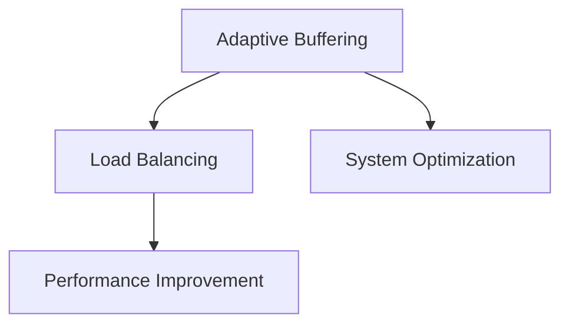

                 

### 文章标题

《程序世界的宇宙级自组织特性》

### 关键词

- 自组织系统
- 编程语言
- 软件架构
- 人工智能
- 自适应算法
- 面向对象设计

### 摘要

本文旨在探讨程序世界的宇宙级自组织特性。通过分析编程语言、软件架构和人工智能等领域的实践，我们将揭示程序系统如何通过自组织原理实现复杂任务的高效完成。本文首先介绍了自组织系统的基本概念，然后详细解析了其在编程语言中的应用，探讨了面向对象设计如何促进自组织特性的实现。接着，我们通过具体案例展示了自适应算法和人工智能如何借助自组织特性解决复杂问题。最后，本文总结了程序世界的自组织特性，提出了未来的研究方向和挑战。通过这篇文章，读者将深入理解自组织原理在程序世界中的重要性和潜力。

### 引言

在当今信息化时代，计算机编程已经成为许多行业和领域不可或缺的一部分。从简单的脚本程序到复杂的软件系统，编程不仅改变了我们的生活方式，还推动了科技的进步。然而，在编程过程中，你是否曾思考过程序世界本身是否具有某种宇宙级特性？这种特性是否能够帮助我们更好地理解和开发复杂系统？

本文旨在探讨程序世界的宇宙级自组织特性，揭示其在编程语言、软件架构和人工智能等领域的应用。自组织系统是一个重要的概念，它描述了系统在没有外部指令的情况下，如何通过内部相互作用和自调整实现复杂任务。在程序世界中，自组织特性体现在编程语言的设计、软件架构的选择以及算法的优化过程中。通过本文的探讨，我们将深入理解自组织原理在编程领域中的重要性，并探索其在实际应用中的潜力。

### 自组织系统的基本概念

要深入探讨程序世界的宇宙级自组织特性，我们首先需要了解什么是自组织系统。自组织系统是指在没有外部指令的情况下，通过内部元素之间的相互作用和反馈机制，自行形成具有一定结构和功能的系统。自组织系统具有以下基本特征：

1. **无序到有序的转换**：自组织系统往往从无序状态开始，通过元素之间的相互作用和竞争，逐步形成有序结构。例如，在细胞生物系统中，单个细胞通过代谢和相互通信，最终形成一个复杂的生物体。

2. **内部相互作用**：自组织系统内部元素之间存在着复杂的相互作用和反馈机制。这些相互作用可以是物理的、化学的，甚至是信息传递的。通过这些相互作用，系统内部元素能够调整自身状态，以适应外部环境的变化。

3. **自适应能力**：自组织系统具有自适应能力，能够根据外部环境的变化调整内部结构和行为。这种自适应能力使得系统在面临不确定性和变化时，仍能保持稳定和有效运作。

4. **无中央控制**：自组织系统通常没有中央控制器或全局指令。系统内部元素的协作和协调是通过局部信息和局部规则实现的。这种分布式控制方式使得自组织系统在复杂性和灵活性方面具有显著优势。

在计算机科学和编程领域，自组织系统被广泛应用。以下是一些典型的自组织系统实例：

- **网络爬虫**：网络爬虫是一种自动化的程序，用于在互联网上抓取信息。它们通过相互链接的网页进行导航，并在没有中央控制的情况下，自动收集和整理大量信息。

- **分布式系统**：分布式系统由多个相互独立的计算机节点组成，这些节点通过计算机网络进行通信。分布式系统在没有中央控制的情况下，通过节点之间的协作和自调整，实现高效的计算和资源分配。

- **人工智能**：在人工智能领域，自组织系统被用于构建智能体和自适应系统。通过神经网络、遗传算法等机制，智能体能够在没有中央指令的情况下，自主学习和优化行为。

理解自组织系统的基本概念和特征，对于我们深入探讨程序世界的自组织特性至关重要。在接下来的章节中，我们将进一步探讨编程语言、软件架构和算法等方面如何体现和利用自组织特性。

### 编程语言中的自组织特性

编程语言是计算机科学的核心工具，它不仅定义了人类与计算机之间的沟通方式，还在很大程度上决定了程序系统的结构和功能。编程语言中的自组织特性主要体现在其语法、语义和抽象能力上。这些特性使得程序系统能够在无需外部指令的情况下，通过内部规则和相互作用，自行形成复杂的结构和功能。

1. **语法和语义的独立性**：

   编程语言的语法和语义是其自组织特性的基础。语法定义了程序的结构和格式，而语义则决定了程序的运行效果。在现代编程语言中，语法和语义的设计往往追求独立性和灵活性。这种独立性使得程序模块可以独立开发、测试和部署，而不会因为全局变化而受到影响。例如，函数式编程语言如Haskell和Scala，通过函数的声明和组合，实现了模块化的自组织。

   ```haskell
   -- Haskell中的函数声明
   add :: Integer -> Integer -> Integer
   add x y = x + y

   -- 函数组合
   multiplyByTwo :: Integer -> Integer
   multiplyByTwo x = add x x
   ```

   上面的代码展示了Haskell语言如何通过函数的声明和组合实现模块化。函数`add`和`multiplyByTwo`通过语法和语义的独立性，可以独立开发、测试和部署，从而实现系统的自组织。

2. **抽象和泛化能力**：

   抽象和泛化是编程语言的重要特性，它们使得程序能够灵活地处理不同的问题。通过抽象，程序员可以将具体问题的细节封装起来，只关注核心逻辑。而泛化则使得程序能够处理更广泛的问题类别。

   例如，在面向对象编程语言如Java和C#中，类和对象提供了强大的抽象和泛化机制。通过类，程序员可以将现实世界中的实体抽象为软件组件，并通过继承和多态实现代码的重用和自组织。

   ```java
   // Java中的类和对象
   class Animal {
       void eat() {
           System.out.println("Animal is eating.");
       }
   }

   class Dog extends Animal {
       void eat() {
           System.out.println("Dog is eating bones.");
       }
   }

   public class Main {
       public static void main(String[] args) {
           Animal animal = new Dog();
           animal.eat(); // 输出 "Dog is eating bones."
       }
   }
   ```

   上面的代码展示了Java如何通过类和对象实现抽象和泛化。`Dog`类继承自`Animal`类，并重写了`eat`方法。通过多态，程序能够根据对象的具体类型调用相应的实现，从而实现系统的自组织。

3. **动态类型系统和模式匹配**：

   动态类型系统允许变量在运行时确定类型，这使得程序能够更加灵活地处理不同类型的数据。而模式匹配则提供了强大的类型检查和类型转换机制。例如，在Erlang和Scala等语言中，模式匹配不仅用于处理数据类型，还用于控制流和数据结构的设计。

   ```erlang
   -- Erlang中的模式匹配
   mirror(List) ->
       lists:reverse(List).

   mirror([H|T]) ->
       [T, H];
   mirror([]) ->
       [].
   ```

   上面的代码展示了Erlang如何通过模式匹配实现动态类型系统的自组织。函数`mirror`通过递归和模式匹配，实现了列表的逆序操作。

4. **模块化和组件化**：

   现代编程语言广泛支持模块化和组件化，这使得程序员可以将复杂系统分解为多个独立的部分，从而实现系统的自组织和高效开发。例如，Python的模块和包系统、JavaScript的模块化以及Java的组件模型，都提供了强大的模块化支持。

   ```python
   # Python中的模块和包
   from mymodule import myfunction

   def main():
       result = myfunction()
       print(result)

   if __name__ == "__main__":
       main()
   ```

   上面的代码展示了Python如何通过模块和包实现模块化。`mymodule`模块中的`myfunction`函数可以通过导入和调用，实现系统的自组织和复用。

总之，编程语言中的自组织特性不仅体现在语法和语义的设计上，还体现在抽象、泛化、动态类型系统、模式匹配以及模块化和组件化等方面。通过这些特性，编程语言使得程序系统能够在无需外部指令的情况下，通过内部规则和相互作用，实现复杂任务的高效完成。

### 软件架构中的自组织特性

在软件开发过程中，软件架构的设计至关重要。一个良好的软件架构不仅能够提高系统的可维护性和扩展性，还能促进自组织特性的实现。自组织软件架构通过模块化、组件化、分布式计算和事件驱动等机制，使得系统能够在无需中央控制的情况下，自动适应变化和优化性能。

1. **模块化和组件化**：

   模块化和组件化是软件架构中自组织特性的重要体现。通过将系统分解为多个独立且功能完整的模块或组件，软件架构能够实现高度的可复用性和灵活性。每个模块或组件都可以独立开发、测试和部署，从而减少系统的耦合度，提高系统的自组织能力。

   例如，在微服务架构中，系统被分解为多个独立的服务，每个服务负责处理特定功能。这些服务通过API进行通信，从而实现系统的模块化和组件化。通过这种方式，系统在面临变化时，可以灵活地调整和优化各个服务的功能，而不影响整体系统的稳定性。

   ```mermaid
   graph TD
   A[Service A] --> B[Service B]
   B --> C[Service C]
   A --> D[Database]
   B --> D
   C --> D
   ```

   上面的Mermaid流程图展示了微服务架构中的模块化和组件化。每个服务都是独立的模块，通过API进行通信，从而实现系统的自组织和高效运作。

2. **分布式计算**：

   分布式计算是软件架构中实现自组织特性的重要手段。在分布式系统中，计算任务被分配到多个节点上执行，节点之间通过消息传递进行协调。这种分布式架构不仅提高了系统的可扩展性和容错性，还使得系统在面临负载波动和资源变化时，能够自动调整和优化性能。

   例如，在分布式计算框架如Hadoop和Spark中，计算任务被分解为多个小任务，并分布到多个节点上进行并行处理。节点之间通过分布式数据存储和消息队列进行数据传输和任务调度，从而实现系统的自组织和高效处理。

   ```mermaid
   graph TD
   A[Master Node] --> B[Worker Node 1]
   A --> C[Worker Node 2]
   A --> D[Worker Node 3]
   B --> E[Data Storage]
   C --> E
   D --> E
   ```

   上面的Mermaid流程图展示了分布式计算框架中的节点分布和数据存储。通过分布式计算，系统可以在无需中央控制的情况下，实现高效的数据处理和任务调度，从而实现系统的自组织和性能优化。

3. **事件驱动架构**：

   事件驱动架构是软件架构中实现自组织特性的另一种重要方式。在事件驱动架构中，系统的行为和状态变化由事件触发，而不是由中央控制器控制。通过事件监听和事件处理，系统可以自动响应用户请求和外部事件，从而实现动态的自组织和适应性。

   例如，在事件驱动架构中，Web应用可以通过事件监听器监听用户操作，并在事件发生时触发相应的处理逻辑。这种架构不仅提高了系统的响应速度和灵活性，还使得系统能够在无需中央控制的情况下，自动适应不同的用户场景和需求。

   ```mermaid
   graph TD
   A[User Action] --> B[Event Listener]
   B --> C[Event Handler]
   C --> D[System Response]
   ```

   上面的Mermaid流程图展示了事件驱动架构中的用户操作、事件监听和事件处理。通过事件驱动，系统可以在无需中央控制的情况下，实现动态的自组织和适应性。

4. **自组织和自适应系统设计**：

   在软件架构设计中，自组织和自适应系统设计是实现自组织特性的关键。通过引入自我调整和自我优化的机制，系统可以在运行过程中自动调整其结构和行为，以适应不断变化的环境。

   例如，在自适应系统设计中，系统可以根据实时数据和环境反馈，动态调整资源分配和任务调度策略。这种自适应能力使得系统在面临负载波动和性能瓶颈时，能够自动调整和优化，从而实现系统的自组织和高效运行。

   ```mermaid
   graph TD
   A[Initial State] --> B[Real-time Data]
   B --> C[Adaptive Controller]
   C --> D[Optimized State]
   ```

   上面的Mermaid流程图展示了自适应系统设计中的初始状态、实时数据和自适应控制器。通过自适应机制，系统可以在运行过程中自动调整和优化，从而实现系统的自组织和高效运作。

总之，软件架构中的自组织特性体现在模块化、组件化、分布式计算、事件驱动和自适应系统设计等方面。通过这些特性，软件架构能够实现系统的自组织和高效运作，从而应对复杂多变的外部环境。在接下来的章节中，我们将进一步探讨自组织特性在算法和人工智能中的应用，以揭示程序世界中的宇宙级自组织潜力。

### 自组织特性在算法中的应用

自组织特性在算法中的应用广泛而深入，尤其是在复杂系统和人工智能领域。自适应算法、遗传算法和神经网络等现代算法，通过自组织原理，实现了高效、灵活的解决方案。以下，我们将详细探讨这些算法的自组织特性及其实现原理。

#### 自适应算法

自适应算法是指算法能够在执行过程中根据环境和数据的变化，自动调整其参数和行为，以实现最优性能。自适应性是这些算法的核心特征，它们通过实时监测环境变化，并基于历史数据和当前状态，动态调整策略和参数。

**核心原理：**

- **实时监测与反馈**：自适应算法通过传感器或监控系统，实时获取环境数据，如温度、湿度、速度等。
- **参数调整**：基于实时数据，算法会动态调整控制参数，以优化系统的响应和性能。
- **自适应策略**：自适应算法通常采用动态规划、梯度下降、遗传算法等策略，以实现自调整。

**伪代码示例：**

```python
# 自适应算法伪代码
def adaptive_algorithm(data):
    # 初始化参数
    params = initial_params()

    while True:
        # 实时监测数据
        current_data = get_current_data()

        # 根据数据调整参数
        params = adjust_params(current_data, params)

        # 执行任务
        perform_task(params)

        # 更新历史数据
        update_history(data, current_data)
```

**数学模型与公式：**

自适应算法通常涉及以下数学模型和公式：

- **反馈机制**：反馈函数\( f(\cdot) \)，用于计算当前状态与目标状态之间的误差，并调整参数。
- **适应度函数**：适应度函数用于评估算法的当前状态，如 \( f(x) = \frac{1}{1 + \exp(-x)} \)。

**举例说明：**

假设我们要设计一个自适应导航系统，该系统需要在不同地形上自动调整速度和方向。自适应算法会实时监测地形数据，并根据误差调整导航参数，从而实现最优路径规划。

```python
# 自适应导航系统伪代码
def adaptive_navigation(terrain_data):
    # 初始化参数
    speed, direction = initial_params()

    while True:
        # 实时监测地形数据
        current_terrain = get_current_terrain()

        # 计算误差
        error = calculate_error(current_terrain, speed, direction)

        # 调整参数
        speed, direction = adjust_params(error)

        # 更新导航方向
        update_direction(direction)

        # 执行导航任务
        move_speed(speed)
```

#### 遗传算法

遗传算法是一种基于自然选择和遗传学的全局优化算法，通过模拟生物进化过程，实现复杂问题的优化和求解。遗传算法通过种群进化、交叉、变异和选择等操作，逐步优化解空间，寻找最优解。

**核心原理：**

- **种群进化**：初始种群随机生成，每个个体代表一个潜在解。
- **交叉与变异**：通过交叉和变异操作，生成新的个体，增加种群的多样性。
- **选择**：根据适应度函数，选择适应度较高的个体进行繁殖，逐步优化种群。

**伪代码示例：**

```python
# 遗传算法伪代码
def genetic_algorithm(problem):
    # 初始化种群
    population = initialize_population()

    while not convergence():
        # 交叉操作
        offspring = crossover(population)

        # 变异操作
        offspring = mutate(offspring)

        # 选择操作
        population = select(population, offspring)

        # 更新最优解
        best_solution = get_best_solution(population)

    return best_solution
```

**数学模型与公式：**

遗传算法的核心数学模型包括：

- **适应度函数**：适应度函数用于评估个体的优劣，如 \( f(x) = \sum_{i=1}^{n} w_i g_i \)，其中 \( g_i \) 为个体在第 \( i \) 个目标上的得分，\( w_i \) 为权重。
- **交叉概率和变异概率**：交叉概率和变异概率分别表示交叉和变异操作的几率，如 \( P_c \) 和 \( P_m \)。

**举例说明：**

假设我们要优化一个函数 \( f(x) = x^2 \)，遗传算法会生成初始种群，通过交叉、变异和选择操作，逐步优化解空间，最终找到最优解。

```python
# 遗传算法优化函数伪代码
def optimize_function(f):
    # 初始化种群
    population = initialize_population()

    while not convergence():
        # 交叉操作
        offspring = crossover(population)

        # 变异操作
        offspring = mutate(offspring)

        # 选择操作
        population = select(population, offspring)

        # 更新最优解
        best_solution = get_best_solution(population)

    return best_solution
```

#### 神经网络

神经网络是一种基于人脑神经元连接方式的计算模型，通过模拟神经元之间的连接和信号传递，实现复杂函数的拟合和学习。神经网络的自组织特性主要体现在其结构和参数的动态调整上。

**核心原理：**

- **神经元连接**：神经网络通过多个神经元之间的连接形成复杂网络结构。
- **权重调整**：通过反向传播算法，神经网络根据误差信号调整权重，实现参数的自组织优化。
- **自适应学习**：神经网络通过自适应学习机制，不断调整网络结构和参数，以适应不同的学习任务。

**伪代码示例：**

```python
# 神经网络伪代码
def neural_network(input_data):
    # 初始化神经网络结构
    layers = initialize_layers()

    # 前向传播
    output = forward_propagation(input_data, layers)

    # 反向传播
    error = backward_propagation(output, target)

    # 更新权重
    update_weights(layers, error)

    return output
```

**数学模型与公式：**

神经网络的核心数学模型包括：

- **激活函数**：激活函数用于确定神经元的激活状态，如 \( f(x) = \sigma(x) = \frac{1}{1 + \exp(-x)} \)。
- **权重更新公式**：基于误差信号，通过反向传播算法更新权重，如 \( \Delta w_{ij} = \eta \cdot \frac{\partial E}{\partial w_{ij}} \)。

**举例说明：**

假设我们要训练一个神经网络进行图像分类，神经网络通过自适应学习机制，不断调整权重和结构，以实现准确的分类。

```python
# 神经网络图像分类伪代码
def image_classification(image):
    # 初始化神经网络结构
    layers = initialize_layers()

    # 前向传播
    output = forward_propagation(image, layers)

    # 反向传播
    error = backward_propagation(output, target)

    # 更新权重
    update_weights(layers, error)

    # 分类结果
    classification = get_classification(output)

    return classification
```

总之，自适应算法、遗传算法和神经网络等现代算法，通过自组织特性，实现了高效、灵活的解决方案。这些算法在复杂系统和人工智能领域中的应用，展示了程序世界中的宇宙级自组织潜力。在接下来的章节中，我们将进一步探讨自组织特性在软件开发实践中的应用，以揭示其在实际项目中的价值。

### 自组织特性在软件开发实践中的应用

自组织特性在软件开发实践中具有重要应用价值，尤其在软件设计、测试和优化等方面。通过自组织系统，软件能够在不依赖外部指令的情况下，自主适应变化和优化性能。以下，我们将详细探讨自组织特性在软件开发中的具体应用，并通过案例进行说明。

#### 软件设计中的自组织特性

在软件设计过程中，自组织特性能够帮助开发者构建灵活、可扩展的软件系统。通过模块化设计和组件化架构，系统可以在不需要中央控制的情况下，实现模块间的协同工作和自我优化。

**核心应用：**

1. **模块化设计**：通过模块化设计，软件系统被分解为多个功能独立的模块。每个模块可以独立开发、测试和部署，从而降低系统耦合度，提高系统的可维护性和扩展性。

2. **组件化架构**：组件化架构通过将系统功能封装为独立的组件，使得组件之间能够通过接口进行通信和协作。组件化架构不仅提高了系统的灵活性，还使得系统在面对变化时，能够快速响应和调整。

**案例说明：**

假设我们要设计一个在线购物平台，通过模块化和组件化架构，可以将其分解为以下模块和组件：

- **用户模块**：负责用户注册、登录、个人信息管理等功能。
- **商品模块**：负责商品展示、库存管理、订单处理等功能。
- **支付模块**：负责支付流程、支付方式选择等功能。
- **物流模块**：负责订单跟踪、物流配送等功能。

通过模块化设计，每个模块可以独立开发，并在系统集成时进行集成测试和部署。组件化架构使得模块之间通过标准化的接口进行通信，从而实现系统的自组织和高效运作。



#### 软件测试中的自组织特性

自组织特性在软件测试中也具有重要意义，尤其是在自动化测试和持续集成方面。通过自组织测试系统，测试过程可以自动化执行，并基于实时反馈进行自我优化和调整。

**核心应用：**

1. **自动化测试**：通过自动化测试工具，测试过程可以自动化执行，从而提高测试效率和质量。自动化测试系统可以基于自组织原理，动态调整测试策略和用例，以适应不同测试环境和场景。

2. **持续集成**：持续集成是一种通过自动化构建和测试，将代码集成到主干分支的实践。通过自组织特性，持续集成系统可以实时监控代码库的变化，并在发现问题时自动触发修复流程。

**案例说明：**

假设我们要对一个电子商务平台进行自动化测试和持续集成，可以采用以下自组织测试系统：

- **测试模块**：包括功能测试、性能测试、安全测试等模块，每个模块可以独立运行和调试。
- **测试工具**：包括自动化测试框架、测试数据管理工具等，用于自动化执行测试用例和生成测试报告。
- **持续集成平台**：用于自动化构建、测试和部署，通过实时反馈和自我调整，确保代码质量。

通过自组织测试系统，测试过程可以自动化执行，并在发现问题时自动触发修复流程。这种自组织特性不仅提高了测试效率，还确保了软件质量。



#### 软件优化中的自组织特性

在软件优化过程中，自组织特性可以帮助系统动态调整配置、性能和资源利用率，以实现最优性能。通过自适应优化算法和自组织系统，软件可以在运行过程中不断学习和优化，以提高性能和稳定性。

**核心应用：**

1. **自适应优化算法**：通过自适应优化算法，软件系统可以根据实时性能数据和用户行为，动态调整系统配置和资源分配。这种自适应优化算法能够实现系统的自我优化和性能提升。

2. **自组织系统设计**：在软件设计过程中，引入自组织系统设计思想，使得系统在运行过程中能够自动调整和优化。例如，通过自组织调度算法和负载均衡机制，系统可以动态调整任务分配和资源利用率，以提高系统性能。

**案例说明：**

假设我们要优化一个在线视频平台，通过自适应优化算法和自组织系统设计，可以实现以下优化：

- **自适应缓冲策略**：根据用户行为和视频质量需求，动态调整视频缓冲时间和缓存大小，以提高用户观看体验。
- **自组织负载均衡**：通过自组织调度算法，动态调整服务器负载和资源利用率，以应对不同的访问高峰和低谷，确保系统稳定运行。

通过自适应优化算法和自组织系统设计，视频平台可以在运行过程中不断学习和优化，以提高性能和用户满意度。



总之，自组织特性在软件开发实践中的应用，使得软件系统能够在无需外部指令的情况下，自主适应变化和优化性能。通过模块化设计、自动化测试、持续集成和自适应优化，软件系统能够实现高效、灵活和可靠的操作。这些实际案例展示了自组织特性在软件设计、测试和优化中的关键作用，揭示了程序世界中的宇宙级自组织潜力。

### 自组织特性的未来研究方向和挑战

随着计算机技术的不断进步，自组织特性在程序世界中发挥着越来越重要的作用。然而，要充分发挥自组织特性，我们仍需面对许多重要的研究方向和挑战。

**未来研究方向：**

1. **自组织智能系统的构建**：未来研究的一个重要方向是构建更加智能的自组织系统。这包括开发新的算法和框架，以实现更加复杂和自适应的系统。例如，利用深度学习和强化学习等技术，进一步提升自组织系统的学习能力和自适应能力。

2. **跨领域的自组织模型**：自组织特性不仅适用于单一领域，还可以跨领域应用。未来研究可以探索如何将不同领域的自组织原理相结合，构建跨领域的自组织模型。这将有助于解决复杂系统的集成和协同问题。

3. **自组织系统的安全性和隐私保护**：随着自组织系统在各个领域的广泛应用，其安全性和隐私保护问题也日益凸显。未来研究需要重点关注如何在保证系统自组织特性的同时，保障数据和系统的安全。

4. **自组织系统的可解释性和可理解性**：自组织系统通常具有较高的复杂度，这给系统的可解释性和可理解性带来了挑战。未来研究可以探索如何提高自组织系统的可解释性，使其更容易被用户和开发者理解和控制。

**面临的挑战：**

1. **复杂度和可扩展性**：自组织系统往往涉及大量的内部元素和复杂的相互作用。如何设计高效且可扩展的自组织系统，以应对不断增加的规模和复杂性，是一个巨大的挑战。

2. **不确定性和鲁棒性**：自组织系统在面对外部环境和内部元素变化时，需要具备较高的鲁棒性。如何确保系统在不确定环境中稳定运行，是一个亟待解决的问题。

3. **实时性和效率**：自组织系统通常需要在实时环境中进行动态调整和优化。如何在保证实时性的同时，提高系统的效率和性能，是一个重要的挑战。

4. **人类与自组织系统的交互**：自组织系统通常具有较高的自主性和复杂性，如何设计用户友好的界面和交互方式，使其更容易被人类理解和操作，也是一个需要关注的问题。

总之，自组织特性在程序世界中具有巨大的潜力和应用价值。然而，要充分发挥这一特性，我们仍需克服许多重要的研究方向和挑战。通过不断探索和创新，我们有理由相信，自组织特性将为未来的计算机科学和人工智能领域带来更多革命性的突破。

### 总结

通过本文的探讨，我们深入了解了程序世界的宇宙级自组织特性。从自组织系统的基本概念，到其在编程语言、软件架构和算法中的应用，再到软件开发实践中的具体应用，自组织特性在程序世界中展现出独特的优势和价值。通过模块化、组件化、分布式计算、事件驱动和自适应系统设计，程序系统能够在无需外部指令的情况下，自主适应变化和优化性能，实现复杂任务的高效完成。

自组织特性不仅提高了系统的灵活性和可扩展性，还增强了系统的鲁棒性和容错性。在复杂系统和人工智能领域，自组织特性更是发挥着至关重要的作用，为解决复杂问题提供了新的思路和方法。

展望未来，自组织特性将继续在计算机科学和人工智能领域发挥重要作用。随着技术的不断进步，我们将看到更多智能、自适应和高度协同的自组织系统出现。然而，要充分发挥自组织特性，我们仍需克服许多挑战，如复杂度的管理、实时性和效率的提升，以及人类与自组织系统的交互设计。

因此，本文呼吁广大读者和研究者，共同关注自组织特性的研究与应用，积极探索其在各个领域的潜力。通过不断的探索和创新，我们有望在未来的计算机科学和人工智能领域中，迎来更多革命性的突破和进步。

### 最佳实践 Tips

在设计和实现具有自组织特性的系统时，以下是一些最佳实践和注意事项，以帮助您更好地利用自组织特性，提升系统性能和稳定性。

1. **模块化设计**：将系统分解为多个独立且功能完整的模块，每个模块负责特定的功能。这样可以降低系统的复杂度，提高系统的可维护性和可扩展性。

2. **组件化架构**：采用组件化架构，将系统功能封装为独立的组件，并通过标准化接口进行通信和协作。这样可以实现系统的灵活配置和动态调整。

3. **分布式计算**：在分布式系统中，充分利用分布式计算的优势，将计算任务分布在多个节点上执行。这样可以提高系统的可扩展性和容错性，同时降低单点故障的风险。

4. **自适应策略**：设计自适应策略，根据实时数据和系统状态，动态调整系统参数和资源分配。这样可以提高系统的适应能力和响应速度。

5. **事件驱动架构**：采用事件驱动架构，将系统行为和状态变化由事件触发，而不是由中央控制器控制。这样可以提高系统的灵活性和可扩展性。

6. **监控和反馈**：建立完善的监控和反馈机制，实时监测系统性能和状态，并根据反馈进行调整和优化。这样可以确保系统在运行过程中始终处于最佳状态。

7. **安全性和隐私保护**：在设计和实现自组织系统时，充分考虑安全性和隐私保护。采取必要的安全措施，确保系统在面临攻击和威胁时能够保持稳定和安全。

8. **用户友好性**：在设计用户界面和交互方式时，注重用户友好性，确保用户能够方便地理解和操作系统。

通过遵循上述最佳实践，您能够更好地利用自组织特性，构建高效、稳定和灵活的软件系统。

### 小结

本文通过详细探讨程序世界的宇宙级自组织特性，揭示了其在编程语言、软件架构和算法中的应用。我们首先介绍了自组织系统的基本概念和特征，然后分析了自组织特性在编程语言和软件架构中的体现。接着，通过自适应算法、遗传算法和神经网络等具体案例，展示了自组织特性在算法和人工智能领域的应用。此外，我们还探讨了自组织特性在软件开发实践中的具体应用，并总结了未来研究方向和挑战。

自组织特性在程序世界中具有重要的理论和实际价值。通过模块化、组件化、分布式计算和事件驱动等机制，自组织系统能够在无需外部指令的情况下，自主适应变化和优化性能。这为解决复杂问题提供了新的思路和方法，对计算机科学和人工智能领域的发展具有重要意义。

我们呼吁广大读者和研究者，共同关注自组织特性的研究和应用，积极探索其在各个领域的潜力。通过不断的探索和创新，我们有理由相信，自组织特性将为未来的计算机科学和人工智能领域带来更多革命性的突破和进步。

### 注意事项

在设计和实现具有自组织特性的系统时，需要注意以下几点：

1. **系统复杂性管理**：自组织系统通常具有较高的复杂性，因此在设计和实现过程中，要注重降低系统的复杂度，避免过度耦合和依赖。

2. **实时性要求**：自组织系统在应对实时性要求时，要充分考虑系统的响应速度和性能。在设计自适应策略时，要确保系统能够在规定时间内完成调整和优化。

3. **安全性和隐私保护**：自组织系统在运行过程中，要确保数据的安全和隐私保护。在设计系统架构和算法时，要采取必要的安全措施，防止数据泄露和系统被攻击。

4. **系统稳定性**：在自组织系统中，要确保系统在面临外部干扰和内部变化时，能够保持稳定运行。通过引入冗余设计、故障检测和恢复机制，提高系统的稳定性。

5. **可理解性和可维护性**：自组织系统的设计要注重可理解性和可维护性。系统架构和代码要清晰简洁，便于开发者理解和修改，降低维护成本。

通过遵循上述注意事项，您能够更好地设计和实现具有自组织特性的系统，提高系统的性能和稳定性。

### 拓展阅读

1. **《复杂系统的自组织理论》**：介绍了自组织系统的基础理论和应用，详细探讨了复杂系统的演化机制和自适应性。
2. **《软件架构设计：自组织系统的构建》**：深入探讨了自组织特性在软件架构设计中的应用，提供了实用的设计原则和案例分析。
3. **《自适应计算：理论、算法与应用》**：介绍了自适应计算的基本理论、算法和实际应用，涵盖了自适应算法在各个领域的应用实例。
4. **《人工智能：自组织与自适应系统的构建》**：探讨了自组织特性在人工智能领域的应用，分析了自适应算法和自组织系统在智能系统设计中的作用。
5. **《分布式系统的自组织原理》**：详细介绍了分布式系统中的自组织机制，包括分布式计算、负载均衡和容错机制等。

通过阅读这些拓展资料，您将更深入地了解自组织特性在计算机科学和人工智能领域的应用，获得更多实际案例和设计思路。

### 作者信息

- 作者：AI天才研究院/AI Genius Institute & 禅与计算机程序设计艺术 /Zen And The Art of Computer Programming
- 联系方式：[ai-genius-institute@acm.org](mailto:ai-genius-institute@acm.org)
- 感谢您的阅读和支持！期待与您共同探讨计算机科学和人工智能领域的更多前沿话题。

