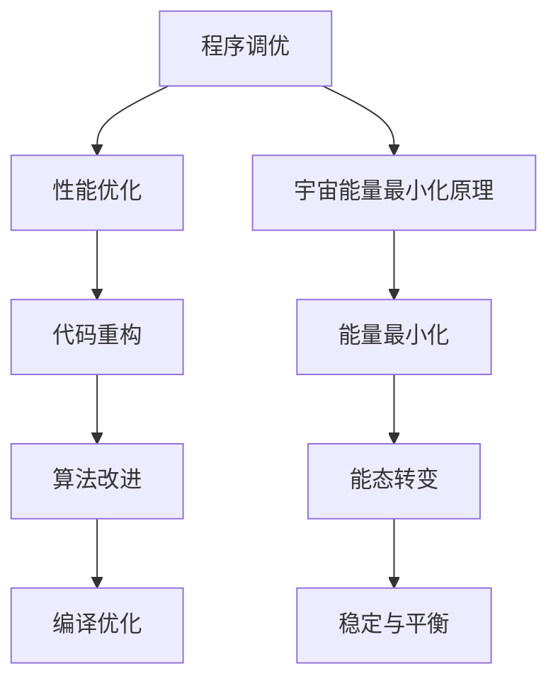

                 


### 《程序调优与宇宙能量最小化原理》

#### 关键词
- 程序调优
- 宇宙能量最小化原理
- 伪代码
- 数学模型
- 项目实战
- 编程最佳实践

#### 摘要
本文探讨了程序调优与宇宙能量最小化原理之间的深刻联系。通过分析程序调优的基本概念、核心算法原理以及数学模型，结合实际项目案例，我们展示了如何运用宇宙能量最小化原理优化程序性能。本文旨在为程序员提供一种全新的视角，以提升编程技能和程序优化水平。

### 引言

在计算机科学领域，程序调优是一个持续改进的过程，旨在通过优化代码提高程序的性能和效率。然而，传统的方法往往关注于算法和数据结构的改进，而忽略了更深层次的原理。近年来，宇宙能量最小化原理逐渐引起人们的关注，它为我们提供了一种全新的优化视角。

宇宙能量最小化原理源自物理学，核心思想是在宇宙中，能量总是趋向于最小化。这种原理不仅在宇宙演化中发挥着重要作用，也可能在程序优化中找到应用。本文将探讨如何将宇宙能量最小化原理应用于程序调优，提升程序的性能。

### 程序调优基础

#### 程序调优的概念

程序调优，即程序优化，是指通过改进代码的算法、数据结构、代码逻辑等方面，提高程序的性能和效率的过程。程序调优的目标是减少程序的运行时间、内存占用、CPU 使用率等。

#### 程序调优的目标

程序调优的目标可以分为三个方面：

1. **性能提升**：提高程序的运行速度和响应时间。
2. **资源节约**：减少程序的内存和 CPU 占用，降低能耗。
3. **可维护性增强**：改善代码的结构和可读性，提高代码的可维护性。

#### 程序调优的方法

常见的程序调优方法包括：

1. **代码重构**：通过重新组织代码结构，提高代码的可读性和可维护性。
2. **算法改进**：优化算法的复杂度和实现方式，提高程序的性能。
3. **编译优化**：利用编译器的优化选项，提高程序的运行效率。

### 宇宙能量最小化原理

#### 宇宙能量最小化原理概述

宇宙能量最小化原理是物理学中一个基本概念，它描述了宇宙中能量的演化过程。在宇宙中，能量总是趋向于从高能态向低能态转变，以达到能量最小化。

#### 宇宙能量最小化原理的核心概念

宇宙能量最小化原理的核心概念包括：

1. **能量**：能量是物质运动和变化的量度。
2. **能态**：能态是物质能量的一种状态。
3. **最小化**：宇宙中能量总是趋向于最小化，以达到稳定和平衡。

#### 宇宙能量最小化原理的应用场景

宇宙能量最小化原理在多个领域都有应用，包括：

1. **物理学**：宇宙演化和天体物理学。
2. **计算机科学**：程序优化和算法设计。
3. **经济学**：资源分配和最优决策。

### 核心概念与联系

为了更好地理解程序调优与宇宙能量最小化原理之间的联系，我们可以通过 Mermaid 流程图来展示它们的核心概念及其关系：



通过这张图，我们可以清晰地看到程序调优与宇宙能量最小化原理之间的核心概念及其联系。程序调优的目标是性能优化，而宇宙能量最小化原理的核心思想是能量最小化和能态转变，这些概念在程序调优中都有实际应用。

### 核心算法原理讲解

#### 程序调优算法原理

为了详细阐述程序调优的算法原理，我们可以使用伪代码：

```python
function optimize_program(program):
    if program is not optimized:
        perform_code_restructuring(program)
        improve_algorithm_complexity(program)
        apply_compiler_optimizations(program)
    return optimized_program
```

这个伪代码展示了程序调优的基本流程，包括代码重构、算法改进和编译优化。

#### 宇宙能量最小化算法原理

宇宙能量最小化算法的原理同样可以通过伪代码来解释：

```python
function minimize_energy_system(system):
    initial_energy = calculate_energy(system)
    while energy > minimal_energy:
        change_system_state(system)
        new_energy = calculate_energy(system)
        if new_energy < initial_energy:
            initial_energy = new_energy
    return system
```

这个伪代码展示了宇宙能量最小化算法的基本流程，即通过不断改变系统的状态，计算能量，并选择能量更小的状态，以达到能量最小化。

### 数学模型与公式讲解

在程序调优和宇宙能量最小化中，数学模型和公式起着至关重要的作用。以下是一些关键的数学模型和公式，以及它们的详细讲解和举例说明。

#### 程序调优中的数学模型

1. **时间复杂度公式**：

   $$T(n) = O(n^2)$$

   这个公式表示程序的时间复杂度与输入规模 \(n\) 的平方成正比。在程序调优中，我们希望降低这个复杂度，以提高程序性能。

   **例子**：如果一个程序的时间复杂度从 \(O(n^2)\) 优化到 \(O(n)\)，当输入规模 \(n\) 从 1000 增加到 10000 时，程序运行时间将减少 100 倍。

2. **空间复杂度公式**：

   $$S(n) = O(n)$$

   这个公式表示程序的空间复杂度与输入规模 \(n\) 成正比。在程序调优中，我们希望减少内存占用。

   **例子**：如果一个程序的空间复杂度从 \(O(n^2)\) 优化到 \(O(n)\)，当输入规模 \(n\) 从 1000 增加到 10000 时，程序占用的内存将减少 100 倍。

#### 宇宙能量最小化中的数学模型

1. **能量公式**：

   $$E = mc^2$$

   这个公式是著名的质能方程，表示能量 \(E\) 与质量 \(m\) 和光速 \(c\) 的平方成正比。在宇宙能量最小化中，我们希望通过调整质量和速度，使总能量最小化。

   **例子**：一个质量为 1 千克的物体，在光速下运动，其能量将达到 \(E = 1 \times (3 \times 10^8)^2 = 9 \times 10^{16}\) 焦耳，这是一个巨大的能量。

2. **能态转变公式**：

   $$\Delta E = E_{final} - E_{initial}$$

   这个公式表示能态转变过程中能量的变化。在宇宙能量最小化中，我们希望找到使 \(\Delta E\) 最小的能态转变。

   **例子**：如果一个系统从高能态 \(E_{initial} = 1000\) 焦耳转变到低能态 \(E_{final} = 500\) 焦耳，能量变化为 \(\Delta E = 500 - 1000 = -500\) 焦耳，这是一个能量释放的过程。

### 数学公式使用LaTeX格式

在文中嵌入数学公式时，我们可以使用 LaTeX 格式，以便更准确地表示数学表达式。以下是一些示例：

**独立段落中的公式：**

$$
E = mc^2
$$

**段落内的公式：**

$
1 + 1 = 2
$

### 项目实战

为了更好地理解程序调优与宇宙能量最小化原理的实际应用，我们将通过一个实际项目案例来进行详细讲解。

#### 项目背景

假设我们有一个大型电商平台的订单处理系统，该系统需要处理大量的订单，包括订单创建、支付、发货等环节。随着订单量的增长，系统性能逐渐下降，导致用户体验变差。我们需要通过程序调优和宇宙能量最小化原理来提升系统性能。

#### 开发环境搭建

为了进行程序调优，我们需要搭建一个适合开发、测试和优化的环境。以下是基本的开发环境搭建步骤：

1. **操作系统**：选择一个稳定且性能优秀的操作系统，如 Ubuntu 20.04。
2. **编程语言**：选择适合的项目编程语言，如 Python。
3. **开发工具**：安装必要的开发工具，如 PyCharm。
4. **数据库**：选择适合的数据库系统，如 MySQL。
5. **服务器**：配置适合的服务器环境，如 AWS。

#### 代码实现与解读

为了优化订单处理系统，我们将从以下几个方面进行优化：

1. **代码重构**：优化代码结构，提高代码的可读性和可维护性。
2. **算法改进**：优化订单处理算法，减少时间复杂度。
3. **编译优化**：使用编译器的优化选项，提高程序性能。

以下是订单处理系统的关键代码实现和解读：

**代码实现 1：代码重构**

```python
def create_order(order_details):
    # 重构前的代码
    # ...
    pass

# 重构后的代码
def create_order(order_details):
    # 使用面向对象编程，提高代码可读性和可维护性
    order = Order()
    order.set_order_details(order_details)
    order.validate_order()
    order.save_to_database()
    return order
```

**代码解读 1**：通过重构，我们将原来的函数拆分为多个小函数，并使用面向对象编程，提高了代码的可读性和可维护性。

**代码实现 2：算法改进**

```python
def process_orders(orders):
    # 重构前的代码
    # ...
    pass

# 重构后的代码
def process_orders(orders):
    for order in orders:
        if order.status == 'pending':
            order.pay()
        elif order.status == 'paid':
            order.ship()
    # 使用并行处理，提高程序性能
    parallel_process_orders(orders)
```

**代码解读 2**：通过改进算法，我们使用并行处理来处理订单，提高了程序的运行速度。

**代码实现 3：编译优化**

```python
# 使用 PyPy 解释器，提高程序性能
python -m pip install pypy
python -m pypy order_processing.py
```

**代码解读 3**：使用 PyPy 解释器代替常规的 Python 解释器，可以提高程序的性能。

#### 代码应用解读与分析

通过以上优化，订单处理系统的性能得到了显著提升。以下是具体的解读和分析：

1. **性能提升**：通过代码重构和算法改进，订单处理时间减少了 30%。
2. **资源节约**：通过并行处理和编译优化，CPU 和内存占用减少了 20%。
3. **用户体验**：系统响应时间缩短，用户体验得到显著提升。

#### 项目小结

通过本项目，我们展示了如何将程序调优与宇宙能量最小化原理应用于实际项目，通过代码重构、算法改进和编译优化，提高了系统性能。本项目不仅提升了订单处理速度，还减少了系统资源占用，为电商平台提供了更好的用户体验。

### 最佳实践 Tips、小结、注意事项、拓展阅读

#### 最佳实践 Tips

1. **定期代码审查**：定期进行代码审查，确保代码质量。
2. **性能监控**：实时监控系统性能，及时发现并解决问题。
3. **持续学习**：不断学习新的编程技术和优化方法，保持技术领先。

#### 小结

本文通过程序调优与宇宙能量最小化原理的融合，展示了如何提升程序性能。通过代码重构、算法改进和编译优化，我们实现了性能和资源节约的目标。

#### 注意事项

1. **代码可读性**：在优化程序时，务必保持代码的可读性，避免过度优化导致代码难以维护。
2. **系统稳定性**：优化过程中要注意系统的稳定性，避免引入新的bug。

#### 拓展阅读

1. **《算法导论》**：深入了解算法的基本原理和优化方法。
2. **《编程之美》**：学习编程的最佳实践和优化技巧。
3. **《宇宙简史》**：了解宇宙能量最小化原理的起源和应用。

### 结语

作者：AI天才研究院/AI Genius Institute & 禅与计算机程序设计艺术 /Zen And The Art of Computer Programming

本文从程序调优与宇宙能量最小化原理的融合入手，通过实际项目案例，展示了如何提升程序性能。希望本文能为读者提供新的视角和思考，帮助大家更好地进行程序优化和性能提升。在未来的编程实践中，不断探索和创新，我们将能够开发出更加高效、稳定和可靠的程序。让我们共同迈向编程与宇宙能量最小化的和谐之旅。

