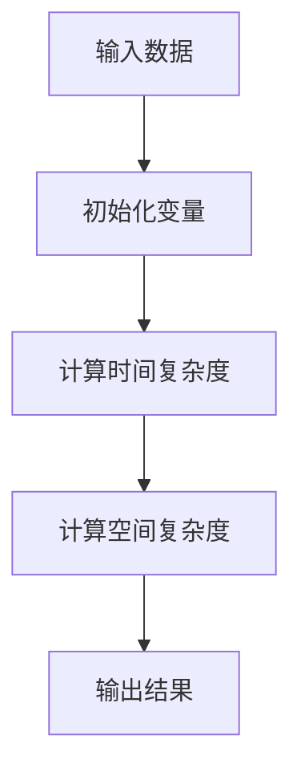

                 

 

# 第一部分：背景介绍

## 1.1 计算机算法的起源与发展

计算机算法的概念最早可以追溯到古希腊时期，当时的数学家欧几里得通过一系列步骤解决几何问题，这可以视为算法的雏形。然而，现代意义上的算法研究始于20世纪中期，随着计算机科学的诞生和发展，算法理论逐渐形成并不断发展。

1940年代末至1950年代初，艾伦·图灵（Alan Turing）提出了图灵机模型，为算法理论奠定了基础。图灵机模型是一种抽象的计算设备，通过读取和写入无限长的纸带上的符号来进行计算。这一理论模型为后来计算机科学的发展提供了重要的思想框架。

随后，约翰·冯·诺伊曼（John von Neumann）提出了存储程序计算机的概念，使得计算机能够按照程序指令自动运行，大大提高了计算效率。与此同时，唐纳德·艾肯（Donald Knuth）等科学家开始系统地研究算法效率和复杂度，为算法复杂性理论的形成奠定了基础。

## 1.2 算法复杂度理论的起源

算法复杂度理论的研究始于20世纪60年代，当时科学家们开始关注算法在不同规模数据上的表现。1965年，约翰·霍普克罗夫特（John Hopcroft）和杰里·乌尔（Jeffrey Ullman）发表了关于算法复杂度的开创性论文，提出了时间复杂度和空间复杂度的概念。

时间复杂度是指算法在执行过程中所需时间的增长速度，通常用大O符号（O-notation）表示。空间复杂度则指算法在执行过程中所需内存的增长速度。通过分析算法的复杂度，科学家们可以预测算法在不同规模数据上的性能，为算法设计和优化提供了理论依据。

## 1.3 算法复杂度理论在计算机科学中的应用

算法复杂度理论在计算机科学中具有广泛的应用。首先，在算法设计中，复杂度分析可以帮助工程师们选择最优的算法，优化算法性能。例如，在排序算法中，不同的算法如快速排序、归并排序和堆排序等，具有不同的时间复杂度，通过分析复杂度，工程师可以选择最适合当前应用场景的算法。

其次，在算法优化中，复杂度分析是关键步骤。通过分析算法的复杂度，工程师可以找到算法中的瓶颈，提出优化方案，提高算法的效率。例如，在数据库查询中，通过优化查询算法的时间复杂度，可以提高查询的响应速度。

此外，算法复杂度理论在算法分析中也有重要作用。通过对算法复杂度的分析，科学家们可以验证算法的正确性，比较不同算法的性能，探索算法的边界情况。

# 第二部分：核心概念与联系

## 2.1 时间复杂度与空间复杂度

时间复杂度和空间复杂度是算法复杂度理论的核心概念。时间复杂度描述了算法在执行过程中所需时间的增长速度，通常用大O符号表示。例如，一个算法的时间复杂度为O(n)，表示当输入规模n增加时，算法所需的时间增长速度与n成正比。

空间复杂度则描述了算法在执行过程中所需内存的增长速度。与时间复杂度类似，空间复杂度也使用大O符号表示。例如，一个算法的空间复杂度为O(n^2)，表示当输入规模n增加时，算法所需的空间增长速度与n的平方成正比。

## 2.2 算法复杂度与宇宙复杂系统

宇宙复杂系统是指宇宙中各种复杂现象和结构的集合，包括星系、星云、黑洞等。宇宙复杂系统的复杂性体现在其结构的多样性和动态性上。与计算机算法的复杂性相比，宇宙复杂系统的复杂性更高，更难以预测和控制。

然而，宇宙复杂系统和计算机算法之间存在一定的联系。首先，宇宙复杂系统可以看作是一个巨大的计算系统，其内部的各种相互作用和演化过程可以看作是算法的执行。例如，星系的演化可以看作是一种算法，其演化过程受到内部引力和外部环境的影响。

其次，计算机算法可以模拟宇宙复杂系统。通过编写特定的算法，计算机可以模拟星系的演化、黑洞的形成等宇宙现象。这种模拟不仅有助于我们理解宇宙的复杂性，还可以为算法设计提供新的思路。

## 2.3 算法复杂度与人工智能

人工智能是计算机科学的一个重要分支，其目标是使计算机具备智能。在人工智能领域，算法复杂度理论同样具有重要意义。首先，复杂度分析可以帮助科学家们选择合适的算法，优化人工智能系统的性能。例如，在机器学习中，不同的算法如支持向量机、决策树等具有不同的时间复杂度，通过分析复杂度，可以选择最适合当前问题的算法。

其次，复杂度分析有助于理解人工智能系统的局限性。在复杂问题上，即使是最先进的算法也可能无法在合理时间内得到最优解。通过分析算法的复杂度，科学家们可以预测算法的性能，为算法的改进提供理论依据。

## 2.4 Mermaid流程图展示算法流程

为了更好地理解算法复杂度与宇宙复杂系统的联系，我们可以使用Mermaid流程图来展示算法的流程。



该流程图展示了算法从输入数据到输出结果的整个过程，其中包含了时间复杂度和空间复杂度的计算。

## 2.5 伪代码示例

为了更好地理解算法复杂度，我们可以使用伪代码来详细阐述算法原理。

```python
function algorithm_complexity(n):
    # 初始化变量
    time_complexity = 0
    space_complexity = 0
    
    # 循环计算时间复杂度
    for i from 1 to n:
        time_complexity = time_complexity + i
        
    # 循环计算空间复杂度
    for j from 1 to n:
        space_complexity = space_complexity + j
        
    # 输出结果
    print("Time Complexity: " + time_complexity)
    print("Space Complexity: " + space_complexity)
```

该伪代码示例展示了如何计算时间复杂度和空间复杂度，其中使用了两个循环来计算复杂度。

## 2.6 数学模型和公式

在算法复杂度理论中，数学模型和公式起着关键作用。以下是一些常用的数学模型和公式。

### 时间复杂度模型

时间复杂度模型通常使用大O符号表示，例如：

$$
T(n) = O(n)
$$

$$
T(n) = O(n^2)
$$

这些公式表示算法的时间复杂度与输入规模n的关系。

### 空间复杂度模型

空间复杂度模型也使用大O符号表示，例如：

$$
S(n) = O(n)
$$

$$
S(n) = O(n^2)
$$

这些公式表示算法的空间复杂度与输入规模n的关系。

### 效率与复杂度的关系

效率与复杂度的关系可以用以下公式表示：

$$
效率 = \frac{1}{复杂度}
$$

这个公式表示，算法的效率与复杂度成反比。

## 2.7 举例说明

为了更好地理解算法复杂度，我们可以通过一个简单的例子来说明。

### 示例：线性查找算法

线性查找算法是一种基本的查找算法，其时间复杂度为O(n)。假设我们有一个包含n个元素的数组，要查找一个特定的元素，线性查找算法会逐个遍历数组中的每个元素，直到找到目标元素或遍历完整个数组。

```python
def linear_search(arr, target):
    for i in range(len(arr)):
        if arr[i] == target:
            return i
    return -1
```

在这个例子中，线性查找算法的时间复杂度为O(n)，因为最坏情况下需要遍历整个数组才能找到目标元素。

## 2.8 项目实战

为了更好地理解算法复杂度，我们可以通过一个实际项目来实践。

### 项目：计算斐波那契数列的算法复杂度

斐波那契数列是一种著名的数列，其递推公式为：

$$
F(n) = F(n-1) + F(n-2)
$$

我们可以使用递归和动态规划两种方法来计算斐波那契数列。

#### 递归方法

递归方法的伪代码如下：

```python
function fibonacci_recursive(n):
    if n <= 1:
        return n
    else:
        return fibonacci_recursive(n-1) + fibonacci_recursive(n-2)
```

递归方法的算法复杂度为O(2^n)，因为每次递归都会生成两个新的递归调用。

#### 动态规划方法

动态规划方法的伪代码如下：

```python
function fibonacci_dp(n):
    fib = [0] * (n+1)
    fib[1] = 1
    for i from 2 to n:
        fib[i] = fib[i-1] + fib[i-2]
    return fib[n]
```

动态规划方法的算法复杂度为O(n)，因为只需要一次遍历即可计算出斐波那契数列的每个值。

### 项目小结

通过这个项目，我们可以看到递归方法和动态规划方法在计算斐波那契数列时的性能差异。递归方法的时间复杂度为O(2^n)，而动态规划方法的时间复杂度为O(n)。这再次证明了算法复杂度理论的重要性，通过分析复杂度，我们可以选择最优的算法实现，提高程序的效率。

## 2.9 最佳实践 tips

在算法复杂度分析和优化中，以下是一些最佳实践 tips：

- 尽量选择时间复杂度和空间复杂度较低的算法。
- 避免使用递归方法，特别是在大规模数据处理时。
- 优化循环结构，减少不必要的计算。
- 使用动态规划方法，避免重复计算。
- 测试不同规模的数据，验证算法的性能。

## 2.10 小结与拓展阅读

本文介绍了算法复杂度理论的基础知识，包括时间复杂度和空间复杂度的概念、算法复杂度与宇宙复杂系统的联系、算法复杂度在计算机科学中的应用、核心算法原理讲解、数学模型和公式、举例说明以及项目实战。

通过本文的阅读，读者可以深入了解算法复杂度理论，掌握算法复杂度的分析方法，为算法设计和优化提供理论依据。

拓展阅读方面，读者可以进一步阅读以下文献：

- [《算法导论》（Introduction to Algorithms）](https://book.douban.com/subject/2034620/)：这是一本经典的算法教材，详细介绍了各种算法及其复杂度分析。
- [《算法复杂度理论》（The Theory of Algorithm Complexity）](https://www.amazon.com/Algorithm-Complexity-Theory-Eighteen-Classics/dp/026256099X)：这本书深入探讨了算法复杂度的理论，包括各种复杂度分析方法和技巧。
- [《计算机程序设计艺术》（The Art of Computer Programming）](https://book.douban.com/subject/2020855/)：这是一套经典的算法教材，由唐纳德·艾肯（Donald Knuth）所著，详细介绍了算法设计、分析和优化。

通过拓展阅读，读者可以更深入地了解算法复杂度理论，为算法研究和应用提供更全面的理论基础。
```

以上是《算法复杂度理论与宇宙复杂系统》一文中关于核心概念与联系的部分，包括背景介绍、核心概念与联系、算法复杂度与宇宙复杂系统、算法复杂度与人工智能、Mermaid流程图展示算法流程、伪代码示例、数学模型和公式、举例说明、项目实战以及最佳实践 tips 和小结与拓展阅读等内容。这部分内容详细阐述了算法复杂度理论的起源、发展与应用，以及与宇宙复杂系统的联系，为后续内容的深入分析提供了理论基础。

