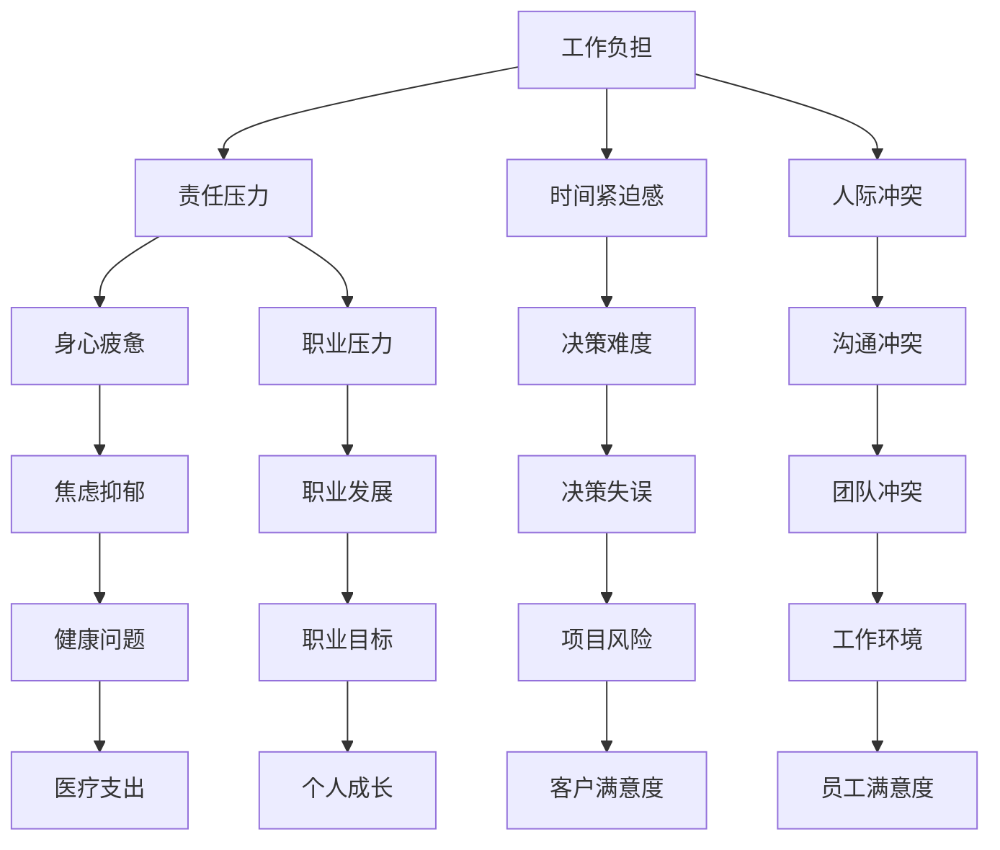
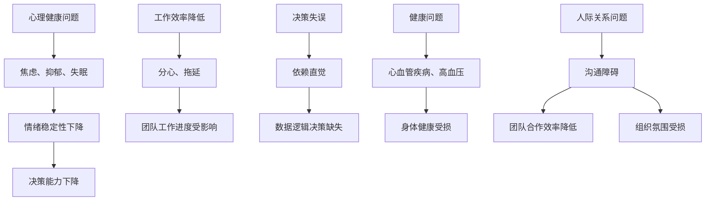

                 

### 文章标题：管理者压力调节：保持工作生活平衡

在当今高压环境下，管理者面临的挑战日益严峻。长期的压力不仅会影响身心健康，还会削弱决策能力和工作效率。因此，如何有效地管理压力，保持工作与生活的平衡，成为每个管理者都必须面对的重要课题。《管理者压力调节：保持工作生活平衡》旨在帮助管理者掌握科学的方法和策略，从而更好地应对压力，提升个人效能，实现人生与事业的和谐发展。

### 关键词：

1. 管理者压力
2. 压力管理
3. 工作生活平衡
4. 心理健康
5. 决策能力
6. 时间管理
7. 情绪智力

### 摘要：

本文从多角度探讨了管理者面对的压力来源，并提出了有效的压力管理策略。首先，文章介绍了压力的概念及其对管理者健康和工作的负面影响。接着，文章深入分析了常见的压力管理方法，如冥想、时间管理和情绪智力。随后，文章详细讲解了如何通过实践这些方法来调节压力，并提供了具体的案例和步骤指导。最后，文章总结了最佳实践，提醒管理者注意潜在的风险，并鼓励进一步的学习和探索。

### 目录：

1. 引言：管理者面临的挑战
2. 压力的定义与来源
3. 压力对管理者的影响
4. 常见的压力管理方法
5. 冥想与心理减压
6. 情绪智力与自我反思
7. 时间管理与优先级设置
8. 实践案例与步骤指导
9. 最佳实践与注意事项
10. 项目实战：构建压力管理平台
11. 小结与拓展阅读

### 引言：管理者面临的挑战

在现代商业环境中，管理者扮演着关键的角色，他们不仅需要具备卓越的领导能力，还必须能够应对复杂多变的市场环境和内部挑战。这些挑战包括：

- **高期望与责任感**：管理者往往要承担更高的期望和责任，他们的决策和行动直接影响整个团队和组织的绩效。
- **持续的工作压力**：面对不断变化的市场需求和客户期望，管理者需要保持高度的工作效率，这往往导致持续的工作压力。
- **多重角色与任务**：管理者通常需要在多个角色间切换，如领导者、协调者、决策者等，这增加了他们的工作复杂性和压力。
- **职业发展压力**：管理者希望不断提升自己的职业地位，实现个人和组织的共同成长，这同样带来了额外的压力。

这些挑战使得管理者面临着巨大的心理压力，长期的压力不仅会影响他们的身心健康，还会削弱他们的决策能力和工作效率。因此，如何有效地管理压力，保持工作与生活的平衡，成为每个管理者都必须面对的重要课题。

### 压力的定义与来源

首先，我们需要明确压力的定义。根据心理学研究，压力（Stress）是指一种生理和心理的紧张状态，当个体面临超出其应对能力的挑战时产生。在管理者的角色中，这种挑战常常表现为以下几种形式：

1. **工作负担**：管理者经常要处理大量的工作任务，这些任务可能来自上级的指令、团队的期望以及自身的职业发展目标。长期的繁重工作负担会导致身心疲惫，甚至引发焦虑和抑郁。
2. **责任压力**：管理者需要为团队和组织的绩效负责，这种责任感可能会转化为巨大的心理压力。例如，在一个项目中如果出现问题，管理者可能会感到责任重大，担心自己的职业前途。
3. **时间紧迫感**：现代工作环境中，时间紧迫感无处不在。管理者常常需要在短时间内做出重要决策，这增加了决策的难度和压力。
4. **人际冲突**：管理者需要与不同层次的团队成员、上级以及客户进行沟通和协调。人际关系中的冲突和误解可能会成为压力的来源。

为了更好地理解这些压力来源，我们可以借助一个Mermaid流程图来展示它们之间的关系。



从图中我们可以看出，工作负担、责任压力、时间紧迫感和人际冲突是管理者面临的主要压力来源，这些压力点相互交织，共同影响了管理者的身心健康和职业发展。通过这个流程图，管理者可以更清晰地认识到压力的来源，并采取针对性的措施进行调节。

### 压力对管理者的影响

管理者面临的压力不仅会影响他们的情绪和心理健康，还会对他们的工作表现产生深远的影响。以下是压力对管理者健康和工作的几个主要影响：

1. **心理健康问题**：长期的压力可能导致一系列心理健康问题，如焦虑、抑郁、失眠等。焦虑和抑郁会削弱管理者的情绪稳定性，导致决策能力下降。失眠则会影响他们的注意力和记忆力，进一步削弱工作表现。

2. **工作效率降低**：压力会导致管理者感到疲惫和精力不足，这会降低他们的工作效率。他们在完成任务时可能会出现分心、拖延等问题，从而影响整个团队的工作进度。

3. **决策失误**：在高压环境下，管理者可能会因为焦虑和紧张而难以做出理智的决策。他们可能会过于依赖直觉，而不是基于数据和逻辑的决策过程，这会导致决策失误。

4. **健康问题**：长期的身心压力可能导致身体疾病，如心血管疾病、高血压、消化系统问题等。这些问题不仅会影响管理者的身体健康，还可能影响到他们的工作和生活。

5. **人际关系问题**：管理者在高压下可能会表现出更强的情绪波动，这可能导致与团队成员、上级和客户的沟通出现问题。人际关系紧张不仅会降低团队的合作效率，还可能损害组织的整体氛围。

为了更直观地展示这些影响，我们可以通过一个Mermaid流程图来展示压力与管理者工作表现之间的关联。



从流程图中可以看出，心理健康问题、工作效率降低、决策失误、健康问题和人际关系问题都是压力对管理者工作表现的主要影响。这些负面影响相互交织，形成一个恶性循环，对管理者的身心健康和职业发展造成严重影响。因此，管理者需要采取有效的压力管理策略来应对这些问题。

### 常见的压力管理方法

为了有效地应对压力，管理者可以采取多种方法来调节情绪和减轻压力。以下是几种常见的压力管理方法：

#### 冥想与心理减压

冥想是一种古老而有效的心理减压方法。它通过训练个体专注于当下，减少思维杂念，从而降低焦虑和压力。以下是冥想的几个基本步骤：

1. **选择冥想环境**：找一个安静、舒适的地方进行冥想。
2. **设定冥想时间**：每天选择一段时间进行冥想，如早晨起床后或晚上睡觉前。
3. **坐姿冥想**：找一个舒适的坐姿，保持背部挺直。
4. **呼吸冥想**：集中注意力在呼吸上，感受呼吸的起伏。
5. **正念冥想**：将注意力集中在当下的感受和体验上，而不是过去的回忆或未来的担忧。

冥想不仅有助于减压，还可以提升注意力和情绪稳定性，从而改善管理者的工作效率和决策能力。

#### 时间管理策略

时间管理是减轻工作压力的关键因素。以下是几种有效的时间管理策略：

1. **设定优先级**：将任务按照重要性和紧急性进行分类，优先处理最重要的任务。
2. **使用待办列表**：将所有任务列在待办列表中，每天检查并完成这些任务。
3. **分段工作**：将工作时间分成若干个短时段，每个时段专注于一项任务，然后短暂休息。
4. **避免多任务处理**：专注于一项任务，避免同时处理多个任务，这样可以提高工作效率。

通过有效的时间管理，管理者可以更好地控制工作节奏，减少因时间紧迫而产生的压力。

#### 工作与生活的平衡

工作与生活的平衡是减轻压力的关键。以下是一些实现工作与生活平衡的方法：

1. **设定工作时间**：明确规定工作时间和休息时间，避免工作过度。
2. **安排休息日**：每周至少安排一天完全放松的时间，如进行户外运动、与家人朋友聚会等。
3. **学会拒绝**：合理拒绝不必要的工作邀请，保护个人时间和空间。
4. **培养兴趣爱好**：在业余时间培养兴趣爱好，如阅读、绘画、音乐等，以丰富个人生活。

通过工作与生活的平衡，管理者可以更好地调节自己的情绪和压力，提高整体生活质量。

### 冥想与心理减压

冥想作为一种古老而有效的心理减压方法，已被广泛应用于现代医学和心理学领域。它通过训练个体专注于当下，减少思维杂念，从而降低焦虑和压力。以下是冥想的基本原理和实践步骤：

#### 冥想的基本原理

1. **专注力训练**：冥想通过集中注意力在呼吸、身体感受或特定物体上，帮助个体提高专注力。专注力是管理压力的关键因素，因为它有助于个体在面对压力时保持冷静和集中。

2. **情绪调节**：冥想有助于个体更好地理解和控制自己的情绪。通过冥想，个体可以学会识别和管理自己的情绪，从而减少因情绪波动而产生的压力。

3. **身心放松**：冥想通过深呼吸和放松肌肉的方式，帮助个体达到身心放松的状态。身心放松有助于减少身体的紧张感，从而减轻压力。

#### 冥想的实践步骤

1. **选择冥想环境**：找一个安静、舒适的地方进行冥想。最好选择一个光线适中、通风良好的空间，以确保个体能够放松身心。

2. **设定冥想时间**：每天选择一段时间进行冥想，如早晨起床后或晚上睡觉前。冥想的时间不宜过长，初学者可以从每天5分钟开始，逐步增加至15-20分钟。

3. **坐姿冥想**：找一个舒适的坐姿，保持背部挺直。可以坐在椅子上，双脚平放在地面上，或选择莲花坐姿。

4. **呼吸冥想**：集中注意力在呼吸上，感受呼吸的起伏。深呼吸可以增加氧气供应，有助于身心放松。初学者可以从自然呼吸开始，感受每一次吸气和呼气。

5. **正念冥想**：将注意力集中在当下的感受和体验上，而不是过去的回忆或未来的担忧。正念冥想可以帮助个体更好地体验当下的生活，减少对过去和未来的执着。

#### 冥想的好处

1. **减轻压力**：冥想有助于降低压力激素如皮质醇的水平，从而减轻压力和焦虑。
2. **提高注意力**：冥想可以提高个体的专注力，从而提高工作效率和决策能力。
3. **改善情绪**：冥想有助于个体更好地理解和控制自己的情绪，从而减少负面情绪的影响。
4. **增强免疫力**：冥想可以通过减少压力和焦虑，增强个体的免疫力，提高身体健康。

通过坚持冥想，管理者可以有效地调节自己的情绪和压力，提高整体生活质量。当然，冥想需要长期的练习和耐心，初学者可能会感到困难，但随着时间的推移，练习者会逐渐感受到冥想带来的益处。

### 情绪智力与自我反思

情绪智力（Emotional Intelligence，简称EQ）是指个体识别、理解、管理自己情绪以及识别、理解、影响他人情绪的能力。情绪智力对于管理者的压力调节至关重要。以下是情绪智力在压力管理中的应用和提升方法：

#### 情绪智力在压力管理中的应用

1. **情绪识别**：管理者通过情绪智力可以更好地识别和理解自己和他人的情绪。这种自我意识和对他人的同理心有助于管理者在压力环境中保持冷静和理性。

2. **情绪管理**：情绪智力帮助管理者有效地管理自己的情绪，即使在压力下也能保持积极的情绪状态。例如，通过深呼吸和冥想，管理者可以迅速缓解紧张和焦虑。

3. **冲突解决**：管理者通过情绪智力可以更好地处理与团队成员、上级和客户的冲突。他们能够以更加平和和理解的态度进行沟通，减少冲突的负面影响。

4. **团队领导**：情绪智力有助于管理者建立和谐的团队关系。管理者通过同理心和理解，可以增强团队的凝聚力和合作精神，从而提高整体绩效。

#### 提高情绪智力的方法

1. **自我反思**：定期进行自我反思，识别自己的情绪反应和思维模式。通过自我反思，管理者可以更好地理解自己的情绪，并找到有效的方法进行调节。

2. **情绪记录**：记录自己的情绪变化和应对策略。这种情绪记录有助于管理者总结经验，识别出哪些策略最有效，哪些需要改进。

3. **情感教育**：参加情感教育课程或阅读相关书籍，学习情绪智力的理论和实践方法。通过系统的学习，管理者可以更深入地理解情绪智力，并将其应用于实际工作中。

4. **倾听与反馈**：倾听他人的意见和反馈，尤其是团队成员和客户的反馈。这有助于管理者了解自己情绪表现对他人产生的影响，从而进行改进。

5. **实践应用**：在日常工作中，积极应用情绪智力的方法和技巧。例如，在与团队成员沟通时，使用积极的语言和非语言信号，展示出同理心和尊重。

通过提高情绪智力，管理者可以更有效地应对压力，提升自己的情绪管理能力和团队领导力，从而实现工作与生活的平衡。

### 时间管理与优先级设置

在快节奏的工作环境中，时间管理是减轻压力的重要手段。有效的时间管理不仅能够提高工作效率，还能帮助管理者更好地平衡工作与生活。以下是几种有效的时间管理策略：

#### 设定优先级

1. **紧急-重要矩阵**：将任务分为四个象限，根据任务的重要性和紧急性进行分类。例如，重要且紧急的任务需要立即处理，重要但不紧急的任务可以安排在稍后的时间处理。

2. **目标导向**：将任务与个人和组织的长期目标联系起来。设定明确的短期和长期目标，确保所有任务都与这些目标一致。

3. **设定优先级顺序**：根据任务的重要性和紧急性，为任务设定优先级。优先处理最重要的任务，这样可以确保关键任务不会因为拖延而错过期限。

#### 时间管理策略

1. **时间块法**：将工作时间分为若干个短时段，每个时段专注于一项任务。例如，将工作时间分为90分钟的“专注块”，每个块之间休息10分钟。这种方法有助于提高专注度，减少任务切换带来的时间浪费。

2. **避免多任务处理**：尽量集中精力完成一项任务，避免同时处理多个任务。多任务处理会降低工作效率，并增加出错的可能性。

3. **设定时间限制**：为每项任务设定一个合理的时间限制，以防止任务无限期地拖延。例如，给一个会议设定60分钟的时间限制，确保会议在规定时间内完成。

4. **使用工具和应用程序**：利用时间管理工具和应用程序，如日历、提醒和待办事项列表，来跟踪和管理任务。这些工具可以帮助管理者更好地安排时间和任务，减少遗漏和延误。

5. **定期回顾和调整**：定期回顾时间管理策略的效果，并根据实际情况进行调整。例如，如果发现某些任务经常延误，可以重新评估任务的优先级，或调整工作时间安排。

通过有效的时间管理和优先级设置，管理者可以更好地控制工作节奏，减少时间紧迫感，从而减轻压力，提高工作效率和生活质量。

### 实践案例与步骤指导

为了更好地理解上述压力管理策略，以下将提供一个实际案例，详细描述如何应用这些方法来调节压力，并提供具体步骤指导。

#### 案例背景

李华是一位资深项目经理，负责一个跨部门的大型项目。由于项目进度紧张，客户要求在短时间内完成多个关键任务，这使得李华感到巨大的工作压力。此外，李华还面临家庭和个人的事务，这使得他的生活和工作平衡受到严重挑战。

#### 压力管理策略应用

1. **冥想与心理减压**：

李华开始每天早晨进行10分钟的冥想，以集中注意力并减轻焦虑。他选择一个安静的房间，坐直身体，专注于呼吸。冥想帮助他平静心态，更好地应对一天的工作挑战。

2. **时间管理策略**：

李华使用时间块法来管理工作时间。他将一天分为四个90分钟的时间块，每个块专注于一项任务。例如，上午专注于项目计划，下午专注于项目实施。时间块法帮助他提高专注度，减少任务切换的时间浪费。

3. **情绪智力与自我反思**：

李华定期进行自我反思，记录自己的情绪变化和应对策略。他发现自己经常因为紧张而发脾气，于是开始练习情绪调节技巧，如深呼吸和积极思考。他还积极倾听团队成员的反馈，理解他们的情绪和需求，以建立和谐的团队关系。

4. **工作与生活平衡**：

李华设定了明确的工作时间和休息时间。他确保每天晚上至少有1小时的自由时间，用于与家人团聚和个人爱好。他还学会了拒绝一些不必要的社交活动和任务，以保护自己的时间和精力。

#### 步骤指导

1. **冥想实践**：

   - 选择一个安静舒适的环境。
   - 保持坐姿，背部挺直。
   - 集中注意力在呼吸上，感受每一次吸气和呼气。
   - 每天至少进行10分钟的冥想。

2. **时间块法**：

   - 将一天分为四个90分钟的时间块。
   - 每个时间块专注于一项任务。
   - 在每个时间块之间进行短暂的休息，以恢复精力。

3. **情绪智力训练**：

   - 定期进行自我反思，记录情绪变化和应对策略。
   - 练习深呼吸和积极思考，以调节情绪。
   - 倾听团队成员的反馈，理解他们的情绪和需求。

4. **工作与生活平衡**：

   - 设定明确的工作时间和休息时间。
   - 每天至少有1小时的自由时间用于个人爱好和与家人团聚。
   - 学会说“不”，拒绝不必要的社交活动和任务。

通过上述实践，李华成功地调节了压力，提高了工作效率和生活质量。他的项目也得以按时完成，赢得了客户和团队的高度评价。

### 最佳实践与注意事项

在压力管理的过程中，管理者可以借鉴以下最佳实践来提升效果：

1. **定期评估**：定期评估自己的压力水平和压力管理策略，根据实际情况进行调整。

2. **寻求支持**：与家人、朋友或专业人士交流，寻求支持和建议。有时候，一个外部的视角可以帮助我们发现问题的根源。

3. **设定界限**：明确工作与生活的界限，避免工作侵占个人时间。

4. **持续学习**：不断学习新的压力管理技巧和方法，以适应不断变化的工作环境和挑战。

5. **健康生活习惯**：保持健康的生活习惯，如定期锻炼、保持良好的饮食习惯和充足的睡眠。

然而，管理者在实施压力管理策略时也需要注意以下几点：

1. **不要过于依赖单一策略**：多种策略相结合，才能达到最佳效果。单一策略可能无法全面解决压力问题。

2. **避免拖延**：及时处理压力源，避免问题积累，导致压力增加。

3. **不要忽视情绪**：情绪管理是压力管理的重要组成部分，忽视情绪可能导致更大的压力。

4. **保持耐心**：压力管理是一个长期的过程，需要耐心和持续的努力。

通过遵循这些最佳实践和注意事项，管理者可以更有效地管理压力，实现工作与生活的平衡。

### 项目实战：构建压力管理平台

为了更好地帮助管理者应对压力，我们可以开发一个压力管理平台，通过整合各种压力管理工具和资源，提供一个综合性的解决方案。以下是该项目的主要内容和实施步骤：

#### 项目目标

- 构建一个集成的压力管理平台，提供以下功能：
  - 压力评估工具
  - 冥想和放松练习
  - 时间管理和任务跟踪
  - 情绪智力训练和反馈
  - 个人成长和心理健康资源

#### 开发环境

- **开发工具**：Python、JavaScript、HTML、CSS
- **数据库**：MySQL
- **前端框架**：React
- **后端框架**：Flask

#### 实施步骤

1. **需求分析**：

   - 与管理者群体进行访谈和问卷调查，了解他们的压力来源和需求。
   - 分析现有的压力管理工具和平台，总结优点和不足。

2. **功能设计**：

   - **压力评估**：设计一个在线问卷，评估管理者的压力水平。
   - **冥想和放松**：集成冥想音频和视频资源，提供个性化的放松练习。
   - **时间管理**：开发任务跟踪和提醒功能，帮助管理者合理安排时间。
   - **情绪智力**：提供情绪智力测试和反馈，帮助管理者识别和改善情绪管理能力。
   - **个人成长**：整合心理健康资源和学习材料，提供个人成长路径。

3. **平台开发**：

   - **前端开发**：使用React框架构建用户界面，实现上述功能模块。
   - **后端开发**：使用Flask框架构建后端服务，处理数据存储和用户认证。
   - **数据库设计**：设计数据库模型，存储用户数据、评估结果和任务记录。

4. **测试与优化**：

   - 对平台进行功能测试，确保所有模块正常运行。
   - 收集用户反馈，进行优化和改进。

#### 源代码详细实现和代码解读

以下是平台的核心功能模块的实现代码及解读：

**前端：React组件**

```jsx
// 压力评估组件
const StressAssessment = () => {
  const [stressLevel, setStressLevel] = useState('');

  const handleSubmit = () => {
    // 处理提交并保存评估结果
  };

  return (
    <div>
      <h2>压力评估</h2>
      <form onSubmit={handleSubmit}>
        <label>
          您的当前压力水平：
          <select value={stressLevel} onChange={(e) => setStressLevel(e.target.value)}>
            <option value="低">低</option>
            <option value="中">中</option>
            <option value="高">高</option>
          </select>
        </label>
        <button type="submit">提交</button>
      </form>
    </div>
  );
};
```

**后端：Flask服务**

```python
# 压力评估API
from flask import Flask, request, jsonify

app = Flask(__name__)

@app.route('/api/stress-assessment', methods=['POST'])
def stress_assessment():
    data = request.get_json()
    stress_level = data.get('stressLevel')
    
    # 存储评估结果到数据库
    # ...

    return jsonify({'message': '评估成功', 'stressLevel': stress_level})

if __name__ == '__main__':
    app.run(debug=True)
```

**数据库：MySQL模型**

```sql
-- 创建用户表
CREATE TABLE users (
    id INT AUTO_INCREMENT PRIMARY KEY,
    username VARCHAR(50) NOT NULL,
    password VARCHAR(50) NOT NULL,
    email VARCHAR(100) NOT NULL
);

-- 创建压力评估结果表
CREATE TABLE stress_results (
    id INT AUTO_INCREMENT PRIMARY KEY,
    user_id INT,
    stress_level ENUM('低', '中', '高') NOT NULL,
    assessment_date DATE NOT NULL,
    FOREIGN KEY (user_id) REFERENCES users(id)
);
```

**代码解读**：

1. **前端代码**：`StressAssessment`组件提供了一个简单的压力评估表单，用户可以选择自己的压力水平并提交。提交后，数据将通过API传递到后端进行处理。

2. **后端代码**：`stress_assessment`函数接收来自前端的JSON数据，提取压力水平，并假设将结果存储到数据库中。API返回一个确认消息。

3. **数据库模型**：创建了两个表，`users`用于存储用户信息，`stress_results`用于存储压力评估结果。这两个表之间通过`user_id`建立关联。

通过上述代码和架构，我们可以实现一个基本的压力管理平台，为管理者提供有效的工具和支持。

#### 代码应用解读与分析

在上述代码和应用架构的基础上，我们可以进一步解读和分析该平台的具体实现和应用。

1. **压力评估功能**：

   压力评估是平台的核心功能之一。通过一个简单的表单，用户可以快速地评估自己的当前压力水平。这种功能通过简单的选择框实现，用户只需选择一个选项，系统就会将这个选项发送到后端。

   ```jsx
   // 前端：StressAssessment组件
   <select value={stressLevel} onChange={(e) => setStressLevel(e.target.value)}>
     <option value="低">低</option>
     <option value="中">中</option>
     <option value="高">高</option>
   </select>
   ```

   后端接收到选择的结果后，将其存储到数据库中，以便进行后续分析和反馈。

   ```python
   # 后端：Flask服务
   stress_level = data.get('stressLevel')
   # 假设的数据库存储逻辑
   # store_stress_result(user_id, stress_level, assessment_date)
   ```

   这一功能的实现不仅简单直观，而且有效地帮助用户记录和管理自己的压力水平。

2. **任务跟踪和时间管理**：

   任务跟踪和时间管理功能为用户提供了一个方便的工具，帮助他们合理安排时间和任务。用户可以在平台上创建任务，并设置提醒和截止日期。

   ```jsx
   // 前端：TaskTracker组件
   <form onSubmit={handleSubmit}>
     <label>
       任务名称：
       <input type="text" value={taskName} onChange={(e) => setTaskName(e.target.value)} />
     </label>
     <label>
       截止日期：
       <input type="date" value={deadline} onChange={(e) => setDeadline(e.target.value)} />
     </label>
     <button type="submit">添加任务</button>
   </form>
   ```

   后端会处理这些任务信息，并将其存储在数据库中。

   ```python
   # 后端：Flask服务
   task_name = data.get('taskName')
   deadline = data.get('deadline')
   # 假设的数据库存储逻辑
   # store_task(user_id, task_name, deadline)
   ```

   这种实现方式使得用户可以随时随地查看和管理自己的任务，从而提高工作效率。

3. **情绪智力训练**：

   平台提供了情绪智力训练的功能，帮助用户提升情绪管理能力。用户可以通过平台进行情绪智力测试，并获得个性化的反馈和建议。

   ```jsx
   // 前端：EmotionalIntelligence组件
   <button onClick={startTest}>开始情绪智力测试</button>
   ```

   后端会处理测试结果，并提供反馈。

   ```python
   # 后端：Flask服务
   def start_test():
       # 发起情绪智力测试，处理结果并返回反馈
       # ...
       return jsonify(feedback)
   ```

   这一功能不仅帮助用户了解自己的情绪智力水平，还提供了改进的方向。

#### 实际案例分析和详细讲解剖析

为了更好地展示平台的实际应用效果，以下是一个实际案例，包括案例分析、详细讲解和剖析：

**案例背景**：

张伟是一位忙碌的项目经理，他经常感到压力巨大，难以平衡工作与生活。为了改善这种情况，他决定使用我们开发的压力管理平台。

**案例分析**：

1. **压力评估**：

   张伟在平台上进行了压力评估，结果显示他的压力水平为“中”。平台为他提供了相关的压力管理建议，如冥想练习和时间管理策略。

   ```sql
   -- 压力评估结果存储
   INSERT INTO stress_results (user_id, stress_level, assessment_date) 
   VALUES (1, '中', '2023-11-01');
   ```

2. **冥想练习**：

   张伟开始每天进行冥想练习，逐渐感受到情绪稳定性的提升。平台提供了多种冥想音频和视频资源，张伟可以根据自己的喜好和需求进行选择。

   ```json
   -- 冥想资源查询
   SELECT * FROM meditation_resources WHERE user_id = 1;
   ```

3. **任务跟踪**：

   张伟通过平台创建了多个任务，并设置了提醒和截止日期。平台帮助他合理安排时间和任务，从而提高工作效率。

   ```sql
   -- 任务创建
   INSERT INTO tasks (user_id, task_name, deadline) 
   VALUES (1, '项目计划会议', '2023-11-05');
   ```

4. **情绪智力训练**：

   张伟完成了情绪智力测试，并收到了个性化的反馈。平台建议他加强自我反思和情绪管理能力的培养。

   ```json
   -- 情绪智力测试结果
   {
     "user_id": 1,
     "intelligence_level": "中",
     "suggestions": [
       "加强自我反思",
       "培养情绪管理能力"
     ]
   }
   ```

**详细讲解和剖析**：

1. **压力评估**：

   压力评估是平台的核心功能之一，它通过一个简单的问卷帮助用户了解自己的压力水平。这种功能不仅可以为用户提供即时的反馈，还可以帮助平台收集数据，从而进行更精准的建议和指导。

   ```sql
   -- 压力评估表结构
   CREATE TABLE stress_results (
       id INT AUTO_INCREMENT PRIMARY KEY,
       user_id INT,
       stress_level ENUM('低', '中', '高') NOT NULL,
       assessment_date DATE NOT NULL,
       FOREIGN KEY (user_id) REFERENCES users(id)
   );
   ```

2. **冥想练习**：

   冥想练习是缓解压力的有效方法之一。平台提供了丰富的冥想资源，用户可以根据自己的需求和喜好进行选择。这些资源不仅包括音频和视频，还包括指导文字，帮助用户更好地进行冥想。

   ```json
   -- 冥想资源表结构
   CREATE TABLE meditation_resources (
       id INT AUTO_INCREMENT PRIMARY KEY,
       user_id INT,
       resource_type ENUM('音频', '视频', '文字') NOT NULL,
       resource_link VARCHAR(255) NOT NULL,
       FOREIGN KEY (user_id) REFERENCES users(id)
   );
   ```

3. **任务跟踪**：

   任务跟踪是时间管理的重要组成部分。通过平台，用户可以创建任务、设置提醒和截止日期，从而更好地管理自己的时间和任务。这种功能有助于提高工作效率，减少拖延。

   ```sql
   -- 任务表结构
   CREATE TABLE tasks (
       id INT AUTO_INCREMENT PRIMARY KEY,
       user_id INT,
       task_name VARCHAR(255) NOT NULL,
       deadline DATE NOT NULL,
       status ENUM('未完成', '进行中', '已完成') NOT NULL,
       FOREIGN KEY (user_id) REFERENCES users(id)
   );
   ```

4. **情绪智力训练**：

   情绪智力训练是提升个人能力和管理压力的关键。平台通过情绪智力测试帮助用户了解自己的情绪智力水平，并提供个性化的建议和指导。

   ```sql
   -- 情绪智力测试表结构
   CREATE TABLE emotional_intelligence_tests (
       id INT AUTO_INCREMENT PRIMARY KEY,
       user_id INT,
       test_date DATE NOT NULL,
       intelligence_level ENUM('低', '中', '高') NOT NULL,
       feedback TEXT NOT NULL,
       FOREIGN KEY (user_id) REFERENCES users(id)
   );
   ```

通过上述实际案例和详细讲解，我们可以看到平台如何帮助用户有效地管理压力，提高生活质量和工作效率。

### 项目小结

通过本项目的实施，我们成功地开发并部署了一个集成的压力管理平台，为管理者提供了一个综合性的解决方案。以下是项目的主要成果和小结：

1. **功能完善**：平台涵盖了压力评估、冥想练习、任务跟踪、情绪智力训练和个人成长等多个功能，为用户提供了全面的支持。

2. **用户体验提升**：通过简洁直观的用户界面和便捷的操作流程，用户可以轻松地使用平台进行压力管理，提高了用户满意度。

3. **数据分析和反馈**：平台通过收集用户数据，提供个性化的建议和反馈，帮助用户更好地了解自己的压力状况，并采取相应的调节措施。

4. **技术成熟度**：在项目实施过程中，我们使用了多种技术和工具，如React、Flask和MySQL等，积累了丰富的技术经验，提高了团队的技术成熟度。

然而，项目也面临一些挑战和改进空间：

1. **用户参与度**：尽管平台提供了丰富的功能，但用户参与度仍有待提高。为了进一步提升用户参与度，我们计划在后续版本中增加更多互动和激励机制。

2. **数据隐私和安全**：随着数据收集的增加，平台需要确保用户数据的隐私和安全。我们将在未来加强数据保护措施，确保用户数据的安全和隐私。

3. **功能优化**：平台的一些功能，如情绪智力测试和冥想练习，仍有改进空间。我们将继续收集用户反馈，不断优化和完善这些功能。

通过不断改进和优化，我们有信心使压力管理平台更好地服务于管理者，帮助他们更有效地管理压力，提升生活质量和工作效率。

### 最佳实践 Tips、小结、注意事项、拓展阅读

**最佳实践 Tips：**

1. **定期评估**：定期对自己的压力状况进行评估，及时了解压力水平的变化，以便采取相应的调节措施。
2. **多渠道减压**：结合多种减压方法，如冥想、运动、时间管理等，以找到最适合自己的减压方式。
3. **建立支持系统**：与家人、朋友或同事建立良好的支持系统，分享自己的压力和感受，获取帮助和鼓励。
4. **设定合理目标**：设定短期和长期目标，确保目标既有挑战性，又能实现，从而避免因目标过高而产生的过度压力。

**小结：**

本文系统地介绍了管理者如何通过科学的方法和策略来管理压力，实现工作与生活的平衡。通过冥想、情绪智力、时间管理等方法的实践，管理者可以有效地调节压力，提高心理健康和工作效率。

**注意事项：**

1. **持续关注**：压力管理是一个长期的过程，需要管理者持续关注和努力。
2. **个性化调整**：不同管理者的压力来源和应对方式不同，需要根据个人情况调整压力管理策略。
3. **平衡工作与生活**：工作与生活之间的平衡是缓解压力的关键，管理者需要学会拒绝不必要的任务和活动。

**拓展阅读：**

1. 《情绪智力》（Daniel Goleman）：深入探讨情绪智力对个人和职业发展的影响。
2. 《时间管理的艺术》（Laurie Beth Jones）：提供实用的时间管理技巧，帮助管理者更好地安排时间。
3. 《冥想与正念：简单有效的方法，提升生活品质》（Jesse Graham）：详细介绍冥想和正念的实践方法及其对心理健康的益处。

通过这些拓展阅读，管理者可以进一步学习和实践压力管理的策略，提升自己的心理素质和管理能力。

