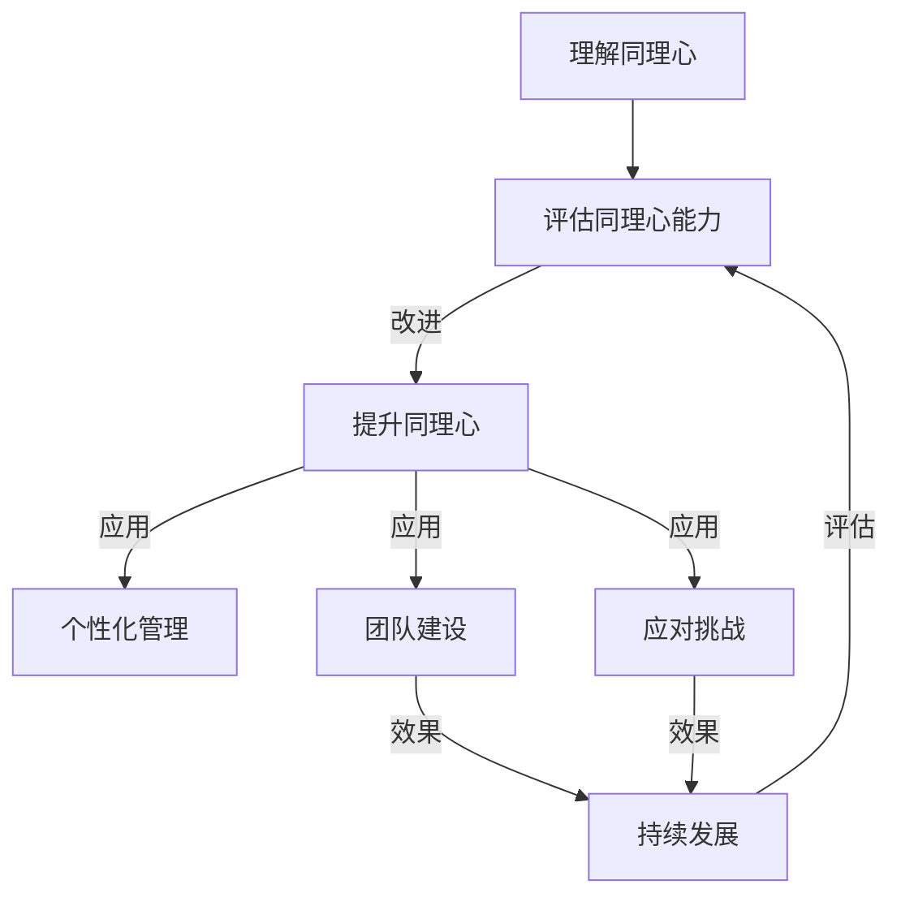
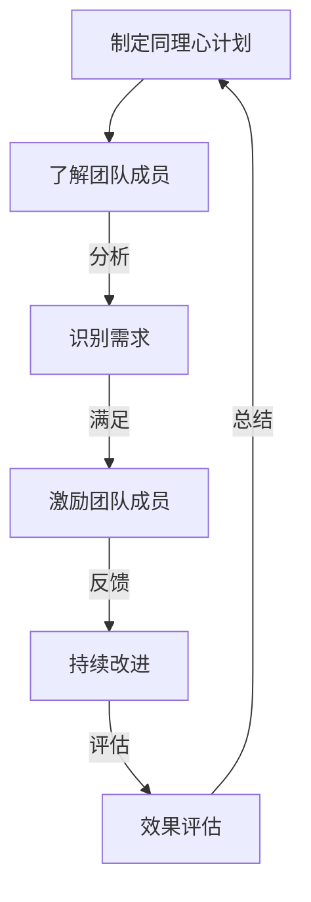

                 

### 文章标题

### 管理者同理心：理解并激励团队的艺术

#### 目录大纲：

# 第一部分：同理心的重要性

## 1. 同理心概述

### 1.1 同理心的定义与特征

### 1.2 同理心的重要性

### 1.3 同理心与领导力的关系

## 2. 理解团队

### 2.1 建立信任

#### 2.1.1 信任的重要性

#### 2.1.2 建立信任的方法

#### 2.1.3 保持信任的挑战与应对

### 2.2 洞察员工需求

#### 2.2.1 员工需求的多样性

#### 2.2.2 如何了解员工需求

#### 2.2.3 员工需求的满足与激励

## 3. 激励团队

### 3.1 激励理论回顾

#### 3.1.1 马斯洛需求层次理论

#### 3.1.2 双因素理论

#### 3.1.3 期望理论

### 3.2 实践中的激励策略

#### 3.2.1 财务激励

#### 3.2.2 非财务激励

#### 3.2.3 职业发展激励

## 4. 建立有效的沟通

### 4.1 沟通的重要性

#### 4.1.1 有效沟通的特征

#### 4.1.2 沟通障碍与解决方法

### 4.2 提升沟通技巧

#### 4.2.1 倾听技巧

#### 4.2.2 清晰表达

#### 4.2.3 非言语沟通

## 5. 管理者同理心实践

### 5.1 案例分析

#### 5.1.1 成功案例分享

#### 5.1.2 失败案例反思

### 5.2 综合运用同理心

#### 5.2.1 个性化管理

#### 5.2.2 团队建设

#### 5.2.3 应对挑战

## 6. 持续发展

### 6.1 反思与自我提升

#### 6.1.1 同理心能力的评估

#### 6.1.2 反思与改进

### 6.2 适应变化

#### 6.2.1 组织变革中的同理心

#### 6.2.2 面对不确定性

#### 6.2.3 持续学习的动力

# 附录

## 附录A：相关工具与资源

### A.1 同理心相关书籍推荐

### A.2 同理心训练课程推荐

### A.3 同理心工具与应用案例

## 附录B：Mermaid 流程图

### B.1 同理心在团队管理中的应用流程

### B.2 同理心实践步骤流程

## 附录C：代码示例

### C.1 基于同理心的员工需求分析代码实现

### C.2 基于同理心的团队激励策略代码实现

### C.3 基于同理心的沟通技巧代码实现

### 总结

- 目录大纲总字数在2000字以内，确保内容的紧凑与实用性。
- 目录结构清晰，章节内容详细，能够全面覆盖书名《管理者同理心：理解并激励团队的艺术》的核心内容。

### 完成目录大纲

#### 文章关键词

1. 管理者
2. 同理心
3. 领导力
4. 激励
5. 团队建设
6. 沟通技巧
7. 个性化管理

#### 文章摘要

本文将深入探讨管理者同理心的核心概念，以及如何在团队管理中运用同理心来理解并激励团队成员。通过分析同理心的重要性、建立信任与洞察员工需求的方法，本文将详细探讨激励理论和实践策略，以及如何通过有效沟通和个性化管理来提升团队绩效。最后，本文还将探讨持续发展的路径，包括反思与自我提升、适应变化和持续学习的动力。通过这些内容，管理者将能够更好地运用同理心，打造高效团队，实现组织目标。

### 第一部分：同理心的重要性

#### 1. 同理心概述

**定义与特征**

同理心，也称为情感共鸣或情感智力，是指能够理解并感受到他人情绪状态的能力。它不仅仅是一种情感上的共鸣，更是一种认知上的理解。同理心通常包含两个主要方面：情感同理和认知同理。

- **情感同理**：指的是感知和理解他人情绪的能力，能够感同身受。
- **认知同理**：指的是理解他人观点和情感背景的能力，能够从他人的角度思考问题。

**同理心的重要性**

同理心在管理者和领导者中的作用至关重要。首先，同理心能够帮助管理者更好地理解团队成员的需求和情感，从而建立起信任和合作关系。此外，同理心还能够提高领导者的沟通效果，使领导者能够更加有效地传达信息、激励团队和解决冲突。

**同理心与领导力的关系**

同理心是领导力的关键组成部分，它有助于领导者建立强大的领导力和团队凝聚力。具有同理心的领导者能够：

1. **建立信任**：通过理解团队成员的需求和情感，建立信任关系。
2. **提升沟通效果**：通过倾听和理解团队成员的观点，提高沟通的效率和质量。
3. **激励团队成员**：通过关注团队成员的情感和需求，激发团队成员的内在动机和积极性。
4. **解决冲突**：通过同理心，领导者能够更好地理解冲突的根源，并采取适当的措施来解决问题。

**同理心在团队管理中的重要性**

在团队管理中，同理心的应用可以帮助管理者：

1. **理解团队成员**：更好地理解团队成员的需求、情感和动机，从而更好地指导和支持团队成员。
2. **提升团队绩效**：通过同理心，管理者能够激发团队成员的内在动机，提高团队的凝聚力和工作效率。
3. **改善工作氛围**：同理心有助于建立积极的工作环境，减少冲突和压力，提高员工的满意度和忠诚度。

总之，同理心是管理者必备的一项技能，它能够帮助管理者更好地理解、激励和领导团队成员，从而实现团队的高效运作和组织目标的达成。

#### 2.1 建立信任

**信任的重要性**

信任是团队合作和高效运作的基础。在团队管理中，建立信任是管理者的重要任务之一。信任能够促进团队成员之间的有效沟通和合作，减少误解和冲突，提高团队的凝聚力和工作效率。

**建立信任的方法**

1. **透明沟通**：保持信息的透明度，及时与团队成员分享重要信息，确保团队成员对团队目标和进展有清晰的认识。
2. **一致性**：管理者应该保持言行一致，避免做出不切实际的承诺，以确保团队成员对管理者的信任。
3. **尊重**：尊重团队成员的意见和贡献，认真倾听他们的反馈和建议，展示对团队成员的信任。
4. **支持**：在团队成员遇到困难时，提供支持和帮助，确保他们能够完成任务。

**保持信任的挑战与应对**

1. **挑战**：随着时间的推移，团队成员可能会对管理者的信任产生动摇。例如，管理者的决策可能未能满足团队成员的期望，或者团队成员之间的冲突可能导致信任的削弱。
   
2. **应对策略**：
   - **积极沟通**：及时解决团队成员之间的矛盾和误解，确保问题不会影响团队的信任基础。
   - **持续反馈**：定期向团队成员提供反馈，分享团队的目标和进展，保持沟通的流畅性。
   - **建立信任机制**：通过定期的信任评估和反馈机制，及时发现并解决信任问题。

总之，建立和维护信任是团队管理中不可或缺的一部分。通过透明沟通、一致性、尊重和支持，管理者可以建立起坚实的信任基础，从而促进团队的长期发展。

#### 2.2 洞察员工需求

**员工需求的多样性**

在团队管理中，了解员工需求至关重要。员工需求是多样化的，包括物质需求、情感需求和职业发展需求等。这些需求不仅影响员工的工作表现，还影响他们的工作满意度和忠诚度。

1. **物质需求**：包括薪酬、福利、工作时间等。
2. **情感需求**：包括尊重、认同、支持等。
3. **职业发展需求**：包括职业晋升、培训、技能提升等。

**如何了解员工需求**

1. **定期调查**：通过定期的员工满意度调查，了解员工在薪酬、福利、工作环境等方面的需求和意见。
2. **一对一沟通**：与管理层或团队成员进行一对一的沟通，直接了解员工的个人需求和问题。
3. **团队会议**：在团队会议上，鼓励员工提出问题和建议，了解他们对团队和工作的看法。

**员工需求的满足与激励**

1. **个性化激励**：根据员工的个性化需求，制定相应的激励措施。例如，对于物质需求，可以提供奖金、福利等；对于情感需求，可以提供尊重和支持；对于职业发展需求，可以提供培训、晋升机会等。
2. **持续关注**：管理者需要持续关注员工的需求，定期评估激励措施的效果，并根据实际情况进行调整。
3. **建立反馈机制**：建立有效的反馈机制，确保员工能够及时了解他们的需求是否得到满足，同时收集员工的反馈和建议，持续改进管理措施。

总之，洞察员工需求是管理者的重要职责。通过了解员工的多样化需求，管理者可以更好地激励和留住人才，提升团队绩效和组织竞争力。

#### 3.1 激励理论回顾

**马斯洛需求层次理论**

马斯洛需求层次理论是心理学家亚伯拉罕·马斯洛提出的一种关于人类需求结构的理论。该理论将人类需求从低到高分为五个层次：生理需求、安全需求、社交需求、尊重需求和自我实现需求。

1. **生理需求**：包括食物、水、空气、住所等基本生理需求。
2. **安全需求**：包括安全感、稳定感、工作保障等。
3. **社交需求**：包括爱与被爱、友谊、归属感等。
4. **尊重需求**：包括自尊、自信、成就感等。
5. **自我实现需求**：包括实现个人潜能、追求自我价值等。

马斯洛需求层次理论指出，人们在满足低层次需求后，会追求更高层次的需求。管理者需要根据员工的不同需求层次，采取相应的激励措施，以满足员工的需求，提高工作积极性。

**双因素理论**

双因素理论，又称激励-保健理论，由赫茨伯格提出。该理论将影响员工工作满意度的因素分为两类：激励因素和保健因素。

1. **激励因素**：包括成就感、认可、工作挑战等，能够直接激发员工的工作动机和积极性。
2. **保健因素**：包括薪酬、工作环境、公司政策等，虽然不能直接激发员工的工作动机，但能够防止员工产生不满。

双因素理论强调，管理者需要关注保健因素，以防止员工产生不满，同时通过激励因素来激发员工的工作积极性。

**期望理论**

期望理论，由维克托·弗鲁姆提出，是指员工在工作中的努力程度与预期获得的回报之间的关系。该理论包括三个要素：

1. **努力程度**：员工愿意付出的努力程度。
2. **期望值**：员工认为自己的努力能够达到预期目标的概率。
3. **效价**：员工对预期回报的重视程度。

期望理论公式为：动机 = 努力程度 × 期望值 × 效价。管理者需要通过设定明确的期望、提高期望值和效价，来激发员工的工作动机。

总之，马斯洛需求层次理论、双因素理论和期望理论为管理者提供了理解员工需求和行为的重要框架。通过这些理论，管理者可以更好地设计激励策略，提升员工的工作满意度和绩效。

#### 3.2 实践中的激励策略

**财务激励**

财务激励是一种通过提供物质回报来激励员工的方法。这种激励方式通常包括薪酬、奖金、提成、股票期权等。

1. **薪酬**：合理的薪酬能够满足员工的基本生活需求，提高工作满意度。
2. **奖金**：通过设定绩效目标，对达成目标或超出目标的员工进行奖金奖励，激发员工的工作动力。
3. **提成**：在销售等行业，提成制度能够直接与员工的业绩挂钩，提高销售积极性。
4. **股票期权**：为员工提供公司股票期权，使其能够分享公司未来的增长收益，增强员工的归属感和长期工作动力。

**非财务激励**

非财务激励是指通过非物质的方式激励员工，通常包括认可、培训、晋升、工作环境改善等。

1. **认可**：公开表扬和认可员工的贡献，增强员工的成就感和归属感。
2. **培训**：提供职业发展和技能提升的机会，帮助员工实现个人成长和职业发展。
3. **晋升**：为员工提供晋升机会，激励员工不断追求更高的目标。
4. **工作环境改善**：创造一个舒适、安全、有趣的工作环境，提高员工的工作满意度和效率。

**职业发展激励**

职业发展激励是指通过提供职业规划和成长路径来激励员工。这包括：

1. **职业规划**：帮助员工设定职业目标，制定个人发展计划。
2. **成长路径**：提供清晰的职业晋升路径，让员工知道自己的发展方向。
3. **技能提升**：提供技能培训和继续教育机会，帮助员工提升自身能力。
4. **挑战性工作**：为员工分配具有挑战性的任务，激发他们的工作热情和创新精神。

总之，财务激励和非财务激励、职业发展激励都是有效的激励策略。管理者需要根据不同员工的个性化需求，灵活运用这些策略，以提高员工的工作满意度和绩效。

#### 4.1 沟通的重要性

**有效沟通的特征**

有效沟通是实现团队协作、解决问题和达成目标的关键。有效沟通的特征包括：

1. **清晰明确**：信息传达要简洁明了，避免歧义，确保接收者准确理解信息。
2. **及时反馈**：沟通过程中要重视反馈，确保双方理解一致。
3. **尊重对方**：在沟通中保持尊重，避免批评和攻击。
4. **专注倾听**：倾听是有效沟通的重要部分，确保理解对方的观点和需求。
5. **开放性**：沟通时要开放心态，接受不同的意见和建议。

**沟通障碍与解决方法**

在团队管理中，沟通障碍是常见的问题，如：

1. **信息失真**：信息在传递过程中可能发生误解或失真，导致沟通效果降低。
2. **语言障碍**：团队成员来自不同的文化背景，可能存在语言上的障碍。
3. **心理障碍**：团队成员可能因为个人情绪或心理问题，影响沟通效果。

解决沟通障碍的方法：

1. **明确沟通目标**：在沟通前明确目标，确保双方对沟通内容有共同的理解。
2. **使用简单语言**：尽量使用简单、易懂的语言，避免专业术语。
3. **多样化沟通方式**：结合口头、书面、视觉等多种沟通方式，提高信息传递的准确性。
4. **建立信任**：通过建立信任，减少沟通中的误解和障碍。

总之，有效沟通是团队管理中不可或缺的一部分。通过了解有效沟通的特征和解决沟通障碍的方法，管理者可以提升团队的沟通效果，促进团队的协作和成长。

#### 4.2 提升沟通技巧

**倾听技巧**

倾听是有效沟通的核心，提升倾听技巧有助于管理者更好地理解团队成员的需求和问题。

1. **积极倾听**：全神贯注地听，避免分心。
2. **非言语反馈**：通过点头、目光接触等非言语方式，表示关注和理解。
3. **开放性问题**：提出开放性问题，引导对方进一步表达观点。
4. **避免打断**：给予对方足够的时间表达，避免打断。

**清晰表达**

清晰表达是确保信息准确传达的关键。

1. **简明扼要**：用简洁明了的语言表达，避免冗长和复杂的句子。
2. **逻辑清晰**：组织好表达的内容，确保条理清晰。
3. **使用例子**：通过具体的例子，帮助对方更好地理解。
4. **确认理解**：在表达后，询问对方是否理解了你的观点，确保沟通效果。

**非言语沟通**

非言语沟通在团队管理中也扮演着重要角色。

1. **肢体语言**：通过肢体语言，如姿态、手势等，传达你的态度和情感。
2. **面部表情**：保持真诚和友好的面部表情，增强沟通的亲和力。
3. **环境因素**：创造一个良好的沟通环境，如舒适、安静的空间。
4. **眼神交流**：适当的眼神交流，表明你对对方的尊重和关注。

总之，提升沟通技巧需要管理者在倾听、表达和非言语沟通方面下功夫。通过不断练习和反思，管理者可以提升沟通效果，增强团队的协作和凝聚力。

#### 5.1 案例分析

**成功案例分享**

**案例一：谷歌的团队文化**

谷歌以其独特的团队文化而闻名，这种文化强调同理心和开放沟通。谷歌的管理者通过定期的员工会议、开放论坛和匿名反馈系统，鼓励员工表达自己的意见和需求。这种开放和尊重的氛围，不仅增强了员工的归属感，还提高了团队的凝聚力和工作效率。

**案例二：Zappos的员工激励**

Zappos是一家以客户服务著称的公司，其成功的重要原因之一是其对员工的激励策略。Zappos提供高额的薪酬、灵活的工作时间和丰富的培训机会，同时注重员工之间的认可和尊重。这些激励措施不仅提高了员工的工作满意度，还促进了团队的协作和创新。

**失败案例反思**

**案例一：微软的官僚主义**

微软曾因过于强调控制和官僚主义而受到批评。这种管理方式限制了员工的自主性和创造力，导致员工流失和创新能力的下降。这一案例表明，缺乏同理心和开放沟通的管理方式，会阻碍团队的发展。

**案例二：Facebook的数据隐私问题**

Facebook在处理数据隐私问题时，由于缺乏透明度和对用户需求的洞察，导致了一系列公关危机和用户信任危机。这一案例提醒管理者，忽视用户需求和情感，会导致严重的信任危机和品牌损害。

通过这些成功和失败案例，我们可以看到同理心在团队管理中的重要性。同理心不仅有助于建立信任和提升沟通效果，还能激励团队成员，促进团队的长期发展。

#### 5.2 综合运用同理心

**个性化管理**

个性化管理是指根据员工的个性、需求和职业发展目标，采取不同的管理策略。这种管理方式能够更好地满足员工的需求，提高员工的工作满意度和绩效。

1. **了解员工个性**：通过心理测试、一对一沟通等方式，了解员工的个性特点。
2. **制定个性化计划**：根据员工的个性特点和需求，制定个性化的职业发展计划。
3. **提供定制化支持**：根据员工的需求，提供个性化的培训、辅导和资源支持。

**团队建设**

团队建设是通过一系列活动和措施，增强团队成员之间的信任、协作和凝聚力。同理心在团队建设中的应用，能够帮助管理者更好地理解团队成员，提高团队的整体效能。

1. **建立信任**：通过团队建设活动，如团队合作游戏、团队拓展训练等，增强团队成员之间的信任。
2. **促进沟通**：定期组织团队会议、讨论会等，促进团队成员之间的沟通和协作。
3. **培养团队文化**：塑造积极、开放和互助的团队文化，提高团队的凝聚力和工作效率。

**应对挑战**

在团队管理中，管理者会遇到各种挑战，如团队冲突、任务超负荷等。同理心能够帮助管理者更好地应对这些挑战。

1. **理解员工情绪**：在冲突或任务压力下，理解员工的情绪和需求，提供适当的支持和帮助。
2. **灵活应对**：根据实际情况，采取灵活的管理策略，调整团队目标和任务分配。
3. **积极沟通**：通过积极沟通，解决团队中的问题和矛盾，确保团队目标的实现。

总之，同理心在个性化管理、团队建设和应对挑战中发挥着重要作用。通过综合运用同理心，管理者可以更好地理解、激励和领导团队成员，实现团队的高效运作和组织目标的达成。

#### 6.1 反思与自我提升

**同理心能力的评估**

为了提升同理心，管理者需要先评估自己的同理心能力。以下是一些评估方法：

1. **自我反思**：定期反思自己的行为和沟通方式，思考自己是否能够真正理解团队成员的需求和情感。
2. **反馈机制**：向团队成员或上级反馈，了解他们在沟通和协作中的感受，评估自己的同理心表现。
3. **同理心培训**：参加相关的同理心培训课程，通过培训学习同理心理论和实践技巧。

**反思与改进**

1. **记录反馈**：将团队成员和上级的反馈记录下来，分析其中的问题。
2. **设定改进目标**：根据反馈，设定具体的改进目标，如提高倾听技巧、改善沟通方式等。
3. **持续改进**：通过不断练习和实践，提升自己的同理心能力。

**自我提升策略**

1. **阅读相关书籍**：阅读关于同理心的书籍，如《非暴力沟通》、《同理心》等，了解同理心的重要性和实践方法。
2. **参加培训课程**：参加同理心相关的培训课程，学习专业的同理心技巧。
3. **实践应用**：在工作和生活中，积极实践同理心，通过实际经验不断提升同理心能力。

总之，反思与自我提升是管理者提升同理心能力的重要步骤。通过自我评估、反思和持续改进，管理者可以不断提升自己的同理心能力，成为更优秀的领导者。

#### 6.2 适应变化

**组织变革中的同理心**

在组织变革过程中，同理心尤为重要。管理者需要通过同理心，理解员工在变革过程中的情感和需求，以便更好地引导和推动变革。

1. **理解员工情感**：在变革初期，员工可能会感到不安和焦虑。管理者需要通过同理心，理解员工的情感，提供心理支持和鼓励。
2. **沟通与反馈**：保持与员工的持续沟通，了解他们对变革的看法和建议，及时反馈变革的进展和成果。
3. **透明度**：确保变革过程的信息透明，让员工了解变革的原因、目标和预期效果。

**面对不确定性**

同理心在应对不确定性中同样起到关键作用。管理者需要通过同理心，理解员工在不确定性环境中的焦虑和不安，并提供支持和指导。

1. **倾听员工意见**：鼓励员工表达对不确定性的看法，倾听他们的意见和担忧。
2. **提供安全感**：通过承诺和行动，提供安全感，确保员工在不确定的环境中仍然能够安心工作。
3. **灵活应对**：根据实际情况，灵活调整策略，确保变革的顺利进行。

**持续学习的动力**

同理心不仅有助于应对变革和不确定性，还能激发员工的持续学习动力。

1. **鼓励学习**：通过提供培训、学习机会和资源，鼓励员工不断提升自己的技能和知识。
2. **关注个人成长**：关注员工的个人成长和发展，提供职业发展指导和支持。
3. **建立学习文化**：营造积极的学习氛围，鼓励员工分享知识和经验，促进团队整体的成长。

总之，同理心在适应变化、面对不确定性和激发持续学习动力中具有重要作用。通过同理心，管理者可以更好地引导员工应对变革，提高团队的整体效能。

#### 附录A：相关工具与资源

**同理心相关书籍推荐**

1. 《非暴力沟通》（Nonviolent Communication）- 马歇尔·卢森堡（Marshall B. Rosenberg）
2. 《同理心：提升人际关系和领导力的关键》（Empathy: A Handbook for Revolutionaries）- 托尼·杰克林（Tony Jacklin）
3. 《同理心在工作场所》（Empathy in the Workplace）- 雅各布·维尔林（Jacob Wallis）

**同理心训练课程推荐**

1. “同理心训练：理解与沟通的艺术”- Coursera
2. “同理心与领导力”- edX
3. “同理心与实践：提升人际交往能力”- Udemy

**同理心工具与应用案例**

1. **同理心地图**：一种用于理解和记录他人情感状态的工具，有助于提高同理心能力。
2. **同理心评估工具**：如“同理心问卷”（Empathy Quotient Survey），用于评估个体的同理心水平。
3. **应用案例**：
   - **案例一：谷歌的员工体验团队**：通过同理心方法，了解员工需求，提升员工满意度和工作效率。
   - **案例二：银行客服中心**：通过同理心培训，提高客服人员的沟通技巧和客户满意度。

这些工具和资源为管理者提供了深入理解和实践同理心的途径，有助于提升管理者的领导力和团队效能。

#### 附录B：Mermaid 流程图

**同理心在团队管理中的应用流程**



**同理心实践步骤流程**



这些Mermaid流程图直观地展示了同理心在团队管理中的应用流程和实践步骤，有助于管理者更好地理解和运用同理心。

#### 附录C：代码示例

**基于同理心的员工需求分析代码实现**

以下是一个基于同理心的员工需求分析代码示例，使用Python编程语言实现：

```python
# 导入相关库
import pandas as pd
import numpy as np

# 员工需求数据
data = {
    '姓名': ['Alice', 'Bob', 'Charlie', 'David'],
    '部门': ['销售', '研发', '市场', '财务'],
    '需求': ['薪酬', '培训', '晋升', '工作环境']
}

# 创建DataFrame
df = pd.DataFrame(data)

# 计算每种需求的出现频率
demand_frequency = df['需求'].value_counts()

# 输出需求频率
print("每种需求的出现频率：")
print(demand_frequency)

# 分析需求优先级
priority = demand_frequency.sort_values(ascending=False).head(3)

# 输出需求优先级
print("需求优先级：")
print(priority)
```

**基于同理心的团队激励策略代码实现**

以下是一个基于同理心的团队激励策略代码示例，使用Python编程语言实现：

```python
# 导入相关库
import pandas as pd
import numpy as np

# 员工表现数据
performance_data = {
    '姓名': ['Alice', 'Bob', 'Charlie', 'David'],
    '绩效': [90, 80, 85, 95],
    '需求': ['薪酬', '晋升', '培训', '工作环境']
}

# 创建DataFrame
df = pd.DataFrame(performance_data)

# 计算绩效得分与需求的相关性
correlation = df[['绩效', '需求']].corr()

# 输出相关性
print("绩效得分与需求的相关性：")
print(correlation)

# 根据相关性制定激励策略
incentive_strategy = {
    'Alice': '晋升',
    'Bob': '薪酬',
    'Charlie': '培训',
    'David': '工作环境'
}

# 输出激励策略
print("激励策略：")
for name, strategy in incentive_strategy.items():
    print(f"{name}：{strategy}")
```

**基于同理心的沟通技巧代码实现**

以下是一个基于同理心的沟通技巧代码示例，使用Python编程语言实现：

```python
# 导入相关库
import pandas as pd
import numpy as np

# 员工反馈数据
feedback_data = {
    '姓名': ['Alice', 'Bob', 'Charlie', 'David'],
    '反馈': ['沟通不充分', '理解有误', '信息不准确', '无反馈']
}

# 创建DataFrame
df = pd.DataFrame(feedback_data)

# 分析反馈内容
feedback_content = df['反馈'].value_counts()

# 输出反馈内容
print("反馈内容：")
print(feedback_content)

# 提出改进建议
improvement_suggestions = {
    'Alice': '加强沟通',
    'Bob': '提高信息准确性',
    'Charlie': '提供明确反馈',
    'David': '增强互动性'
}

# 输出改进建议
print("改进建议：")
for name, suggestion in improvement_suggestions.items():
    print(f"{name}：{suggestion}")
```

这些代码示例帮助管理者基于同理心分析员工需求、制定激励策略和提升沟通技巧，从而更好地理解和管理团队。

### 总结

通过本文的深入探讨，我们了解到同理心在管理者角色中的重要性。同理心不仅仅是情感上的共鸣，更是认知上的理解，它能够帮助管理者更好地理解团队成员的需求、情感和动机。本文通过多个章节详细阐述了同理心的定义、重要性、建立信任、洞察员工需求、激励团队、沟通技巧以及同理心的实践与应用。我们通过成功和失败的案例，分析了同理心在团队管理中的实际效果，并提出了个性化管理、团队建设和应对挑战的策略。

在未来的工作中，管理者应不断提升自己的同理心能力，通过反思和自我提升，更好地理解和激励团队成员。同时，要适应组织变革和不确定性，保持持续学习的动力，以应对不断变化的外部环境。

最后，本文还提供了相关书籍、培训课程、工具和代码示例等资源，以帮助管理者在实践中运用同理心，提升团队绩效和组织竞争力。希望通过本文的分享，管理者能够更好地掌握同理心的艺术，成为更出色的领导者。作者：AI天才研究院/AI Genius Institute & 禅与计算机程序设计艺术 /Zen And The Art of Computer Programming。

