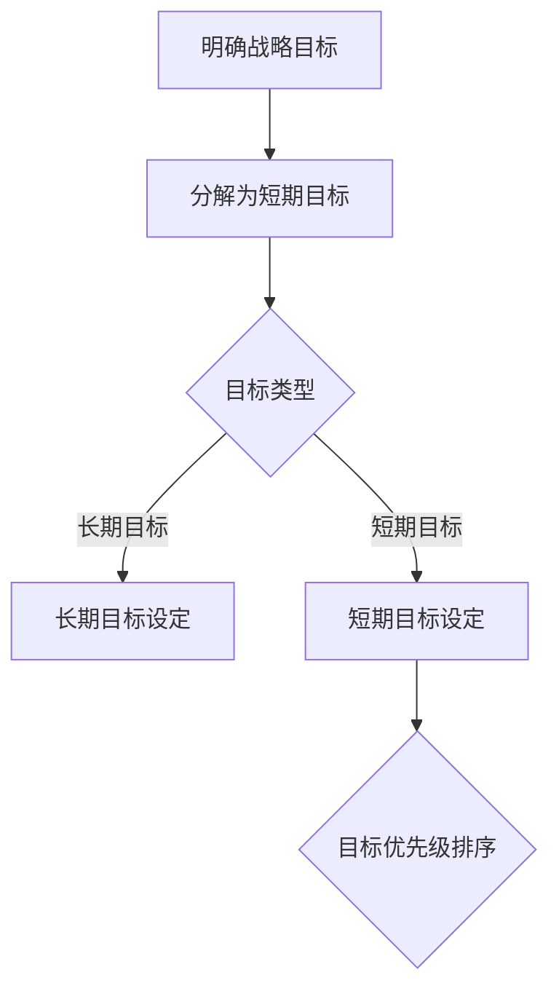
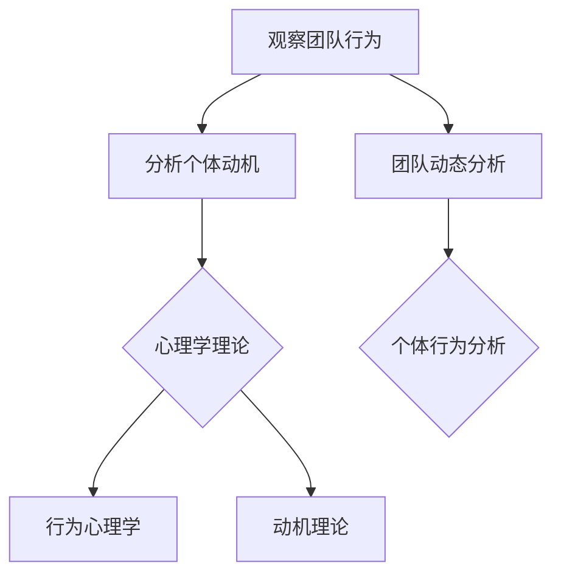
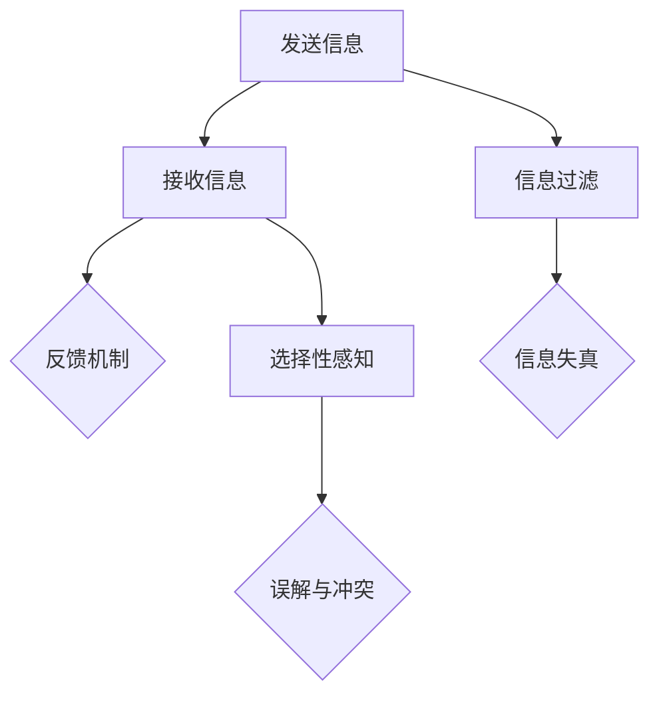
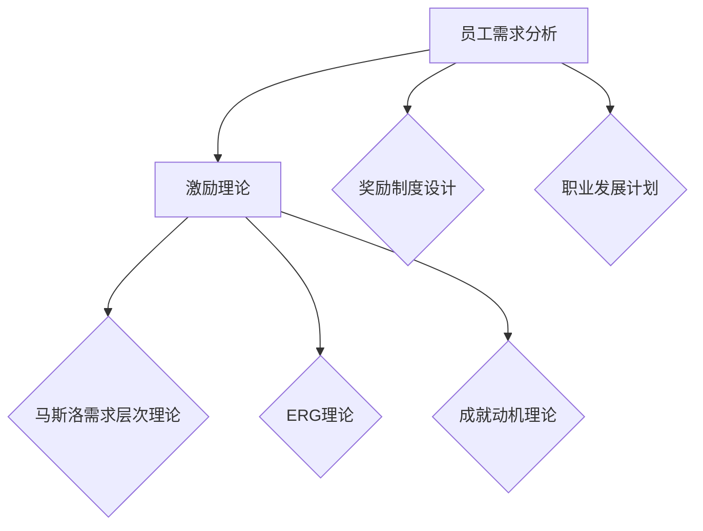
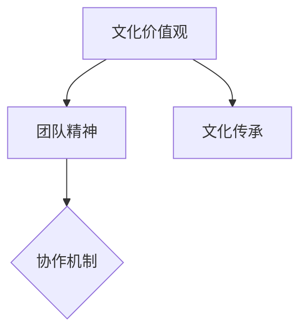

                 

### 引言：管理者管理的概念与重要性

在任何一个组织中，管理者都扮演着至关重要的角色。他们不仅是决策的制定者，更是团队的核心驱动力。管理者的管理能力直接决定了团队的效能和组织的成败。因此，如何有效地进行人员管理成为了每一个管理者都必须深入思考的问题。

**什么是管理者管理？** 管理者管理，简而言之，就是通过计划、组织、领导和控制等管理职能，对组织中的人、财、物等资源进行有效配置和利用，以实现组织目标的过程。在这个过程中，管理者不仅需要具备战略思维和决策能力，更需要深入理解人性、沟通技巧和领导力。

**管理者管理的重要性体现在以下几个方面：**

1. **提高团队效率**：有效的管理者能够合理安排工作任务，激发团队成员的积极性，从而提高团队的整体效率。
2. **促进员工发展**：通过有效的管理，管理者可以帮助员工明确职业目标，提供培训和发展机会，从而提升员工的个人能力和职业素养。
3. **构建和谐团队**：良好的管理能够促进团队成员之间的沟通与协作，建立积极向上的团队文化，减少冲突，增强团队的凝聚力。
4. **实现组织目标**：管理者通过有效的管理，确保组织的各项资源和活动都能朝着既定的目标前进，从而实现组织的战略目标。

然而，在现实工作中，管理者常常面临各种挑战，如沟通障碍、团队冲突、员工激励等问题。这些问题不仅会影响管理的有效性，还可能对组织的整体绩效产生负面影响。因此，如何应对这些挑战，实现有效的管理者管理，成为了每一个管理者都需要认真思考和解决的问题。

本文将从多个角度探讨管理者如何有效管理人员的策略与技巧，帮助管理者提高管理水平，打造高效团队。我们将会逐一分析人员管理策略与技巧、员工激励与绩效管理、领导力与团队发展、问题解决与决策制定等内容，并提供实用的指南和案例，以期为管理者提供有价值的参考。

### 管理者管理的核心要素

有效的管理者管理需要围绕一系列核心要素展开，这些要素不仅决定了管理者的成功与否，也直接影响了团队和组织的绩效。以下是管理者在管理过程中需要重点关注的核心要素：

#### **1. 明确的目标设定**

目标是管理的起点和方向。管理者需要明确组织的战略目标，并将其分解为具体的、可衡量的个人和团队目标。通过明确的目标设定，管理者可以确保团队成员明确自己的职责和任务，从而提高工作效率和团队凝聚力。例如，一个企业的年度销售目标可以分解为每个月、每周的具体销售任务，使每个团队成员都清楚地知道自己的目标和任务。

**核心概念与联系：**

目标设定的过程涉及到多个关键概念，包括目标类型（长期目标、短期目标）、目标设定理论（SMART原则）、目标分解与优先级排序。这些概念相互关联，构成了目标设定的完整框架。

**Mermaid 流程图：**

#### **2. 敏锐的洞察力**

洞察力是管理者对团队和个体行为的敏锐理解和分析能力。管理者需要通过观察、沟通和反馈，深入理解团队成员的潜力、动机和需求，从而制定出更加符合实际情况的管理策略。例如，通过观察团队成员的工作表现和沟通风格，管理者可以更好地了解团队成员的优劣势，并针对性地提供培训和指导。

**核心概念与联系：**

洞察力的核心概念包括心理学理论（如行为心理学、动机理论）、团队动态分析和个体行为分析。这些概念共同构成了管理者洞察力的理论框架。

**Mermaid 流程图：**

#### **3. 高效的沟通能力**

沟通是管理者必备的能力之一。有效的沟通能够确保信息传递的准确性和及时性，减少误解和冲突，增强团队成员之间的信任和协作。管理者需要掌握不同的沟通技巧，如清晰表达、倾听、反馈和冲突解决。例如，在团队会议中，管理者需要清晰表达任务目标和期望，同时倾听团队成员的意见和建议，及时给予反馈，并在出现冲突时采取有效的解决策略。

**核心概念与联系：**

沟通能力涉及的核心概念包括沟通模型（如发送-接收模型）、沟通障碍（如信息过滤、选择性感知）、沟通技巧（如非语言沟通、同理心）。这些概念相互关联，构成了管理者高效沟通的理论基础。

**Mermaid 流程图：**

#### **4. 有效的激励策略**

激励是激发员工工作动力和潜能的重要手段。管理者需要根据不同的员工需求和动机，设计出有效的激励策略，如奖励制度、晋升机会、职业发展计划等。有效的激励不仅能够提高员工的工作满意度和忠诚度，还能激发员工的创新精神和团队协作精神。例如，通过设立绩效奖金、提供晋升机会和职业培训，管理者可以激发员工的工作热情和积极性。

**核心概念与联系：**

激励策略的核心概念包括激励理论（如马斯洛需求层次理论、ERG理论、成就动机理论）、奖励制度设计（如绩效奖金、晋升机制）、职业发展计划（如内部培训、外部进修）。这些概念共同构成了管理者激励策略的理论框架。

**Mermaid 流程图：**

#### **5. 健康的团队文化**

团队文化是团队内在的价值观和行为准则，对团队成员的工作态度和行为有着深远的影响。管理者需要积极营造健康的团队文化，如诚信、协作、创新和包容等。健康的团队文化能够增强团队成员之间的信任和凝聚力，促进团队合作和创新，提高组织的整体绩效。例如，通过定期举办团队建设活动、鼓励分享和协作，管理者可以营造一个积极向上的团队文化。

**核心概念与联系：**

团队文化的核心概念包括文化价值观、团队精神、协作机制和文化传承。这些概念相互关联，构成了管理者营造健康团队文化的理论基础。

**Mermaid 流程图：**

综上所述，管理者管理的核心要素包括明确的目标设定、敏锐的洞察力、高效的沟通能力、有效的激励策略和健康的团队文化。这些要素相互关联，构成了一个完整的管理框架，帮助管理者实现有效的管理者管理。

### 管理者面临的挑战

尽管管理者在组织中扮演着重要角色，但在实际工作中，他们常常面临一系列挑战，这些挑战不仅影响了管理的有效性，还可能导致团队和组织的整体绩效下降。以下是管理者在管理过程中常见的一些挑战：

#### **1. 沟通障碍**

沟通是管理的基础，但许多管理者在沟通方面面临巨大挑战。沟通障碍可能源于多种原因，包括信息传递不畅、语言障碍、文化差异、沟通渠道不畅等。这些问题会导致团队成员之间的误解、信息失真，甚至产生不必要的冲突。例如，一个跨国公司中的本地团队和海外团队之间可能因为时差和文化差异而出现沟通问题，影响项目的进展。

**解决方案：**
- **建立明确的沟通渠道**：确保团队成员了解各种沟通渠道，如邮件、即时通讯、电话会议等，并鼓励使用这些渠道进行有效沟通。
- **定期召开会议**：通过定期召开团队会议，确保团队成员能够及时了解项目进展和公司动态，减少信息滞后。
- **跨文化沟通培训**：为团队成员提供跨文化沟通培训，提高跨文化沟通能力。

#### **2. 员工激励不足**

激励是提高员工工作积极性和创造力的重要手段，但许多管理者在激励员工方面面临困难。员工激励不足可能源于激励手段单一、奖励制度不合理、缺乏明确的职业发展路径等。这些问题会导致员工工作积极性下降，甚至出现员工流失的情况。

**解决方案：**
- **多样化激励手段**：结合物质激励和非物质激励，如奖金、晋升、培训、荣誉等，以满足员工的多样化需求。
- **明确职业发展路径**：为员工提供明确的职业发展路径，包括晋升机会、培训计划和职业规划。
- **定期反馈与表扬**：通过定期反馈和表扬，让员工了解自己的工作表现，提高工作动力。

#### **3. 团队冲突**

团队冲突是管理者面临的另一个常见挑战。团队冲突可能源于个人差异、工作目标不一致、资源分配不公等问题。冲突如果处理不当，会破坏团队的和谐，影响团队协作和项目进展。

**解决方案：**
- **建立冲突管理机制**：制定明确的冲突管理政策，鼓励团队成员积极表达意见和解决问题。
- **采取中立立场**：在处理团队冲突时，管理者应保持中立，公正地评估各方意见，避免偏袒任何一方。
- **促进团队建设**：通过团队建设活动，增强团队成员之间的信任和理解，减少冲突。

#### **4. 员工能力不足**

管理者需要确保团队成员具备完成工作任务的能力，但许多情况下，员工的能力可能不足以满足工作需求。员工能力不足可能导致工作效率低下、项目延误，甚至影响团队的整体绩效。

**解决方案：**
- **提供培训与支持**：为员工提供必要的培训和发展机会，提高其专业技能和工作能力。
- **明确角色与职责**：确保每个团队成员都明确自己的角色和职责，避免职责重叠和资源浪费。
- **建立知识分享机制**：鼓励团队成员分享知识和经验，提高整个团队的能力水平。

#### **5. 时间管理问题**

时间管理是管理者面临的一个重要挑战。管理者需要在有限的时间内完成多项任务，同时确保团队的工作效率和质量。时间管理不当可能导致任务延误、资源浪费，甚至影响员工的身心健康。

**解决方案：**
- **制定合理的工作计划**：为每个任务制定详细的工作计划，明确任务目标、时间节点和责任人。
- **优先级排序**：根据任务的重要性和紧急性，合理安排工作任务，确保关键任务得到优先处理。
- **定期检查与调整**：定期检查工作进展，及时调整工作计划，避免因计划不合理导致的效率低下。

通过识别和应对这些挑战，管理者可以更好地应对工作中的困难，提高管理水平，实现有效的管理者管理。

### 人员管理策略与技巧

在管理者管理过程中，人员管理策略与技巧是确保团队高效运作和实现组织目标的关键。以下我们将详细介绍了解团队成员的能力与个性、满足团队成员需求与激励以及团队文化建设这三个方面，并提供具体的方法和实例。

#### **1. 了解团队成员的能力与个性**

有效的团队管理首先需要深入了解每个成员的能力和个性。这不仅能帮助管理者合理分配任务，还能促进团队成员之间的协作和沟通。

**1.1. 成员能力分析**

管理者可以通过以下几种方法来分析团队成员的能力：

- **技能评估**：定期进行技能评估，了解每个成员的技能水平和潜力。通过评估，可以确定哪些成员适合参与特定项目或任务。
- **绩效评估**：通过绩效评估，了解成员在工作中的表现和成长。这有助于管理者发现团队成员的优势和改进空间。

**实例**：在一个软件开发团队中，管理者可以通过定期的技能评估和项目反馈，发现某位成员在数据库管理方面有较高技能，从而安排其负责关键的数据库项目，发挥其专长。

**1.2. 个性分析**

了解团队成员的个性有助于管理者更好地激励和引导他们。常用的个性分析工具包括：

- **MBTI（迈尔斯-布里格斯性格类型指标）**：通过MBTI测试，可以了解团队成员的性格类型，如外向/内向、感觉/直觉、思考/情感、判断/感知等。这有助于管理者根据团队成员的性格特点进行任务分配和沟通。
- **DISC测试**：DISC测试通过分析个体的行为特征，将其分为四个维度：支配性、影响性、稳定性、谨慎性。管理者可以根据测试结果，制定个性化的管理策略。

**实例**：在一个市场营销团队中，管理者发现某位成员是高度影响性和外向型的，因此在项目汇报时，让这位成员负责关键演讲部分，发挥其影响力和沟通能力。

#### **2. 满足团队成员需求与激励**

了解团队成员的需求和动机是激发工作热情和提升团队绩效的重要手段。以下是一些常用的激励方法：

**2.1. 需求满足**

- **物质激励**：通过薪酬、奖金、福利等物质激励，满足员工的基本生活需求。
- **精神激励**：通过认可和赞扬、提供发展机会等精神激励，满足员工的自我实现需求。

**实例**：在一个技术团队中，管理者为表现出色的员工颁发“最佳技术贡献奖”，并公开表彰，这不仅满足了员工的荣誉感，还激发了其他成员的积极性。

**2.2. 激励策略**

- **目标设定**：设定明确、可实现的短期和长期目标，激励员工不断努力和进步。
- **反馈与表扬**：定期给予员工工作反馈和表扬，让他们了解自己的进步和成就。

**实例**：在一个销售团队中，管理者为每位成员设定月度销售目标，并在每月的销售会议上，对达成目标的成员进行公开表扬和奖励，这极大地激发了团队成员的斗志。

#### **3. 团队文化建设**

团队文化是团队凝聚力和工作氛围的重要体现。健康的团队文化有助于增强团队协作和创新精神，提高整体绩效。

**3.1. 文化价值观**

团队文化首先需要明确核心价值观，如诚信、协作、创新等。管理者可以通过以下方法传播和强化这些价值观：

- **制定文化手册**：将团队的核心价值观和规章制度整理成文化手册，供团队成员参考。
- **文化活动**：通过举办团队建设活动，如团队拓展、文化沙龙等，增强团队成员对团队文化的认同感。

**实例**：在一个创业团队中，管理者定期举办“团队之夜”活动，团队成员可以分享自己的工作成果和生活感悟，这不仅加强了团队成员之间的联系，还进一步巩固了团队的文化价值观。

**3.2. 沟通与协作**

健康的团队文化离不开良好的沟通和协作。管理者可以通过以下方式促进团队沟通和协作：

- **开放沟通**：鼓励团队成员开放地表达自己的观点和建议，建立信任和开放的沟通氛围。
- **协作平台**：利用协作工具，如项目管理软件、团队沟通工具等，提高团队协作效率。

**实例**：在一个研发团队中，管理者引入了项目管理软件，使团队成员可以实时查看项目进度、任务分配和讨论区，这极大地提高了团队协作效率。

通过了解团队成员的能力与个性、满足团队成员的需求与激励，以及建设健康的团队文化，管理者可以打造一个高效、和谐的团队，实现组织目标。

### 沟通与协作

在管理者管理过程中，沟通与协作是确保团队高效运作和项目成功的关键因素。有效的沟通能够确保信息的准确传递，减少误解和冲突，增强团队的凝聚力；而良好的协作则能够促进团队成员之间的合作，提高工作效率。以下是关于内部沟通的有效方法、协作工具与平台的应用，以及管理者与团队成员的沟通技巧的详细探讨。

#### **内部沟通的有效方法**

内部沟通的有效性直接关系到团队的工作效率和项目进展。以下是一些有效的内部沟通方法：

**1. 定期会议**

定期会议是团队内部沟通的重要形式。通过会议，团队成员可以交流项目进展、讨论问题、分享经验。管理者需要确保会议的效率和内容，避免会议冗长和不必要的讨论。

**实例**：在一个项目团队中，管理者每周召开一次项目进度会议，确保每个团队成员都能及时了解项目的最新动态，讨论遇到的问题，并制定下一步行动计划。

**2. 及时反馈**

及时反馈能够帮助团队成员了解自己的工作表现，及时纠正错误，提升工作效率。管理者需要建立反馈机制，鼓励团队成员之间进行积极的反馈。

**实例**：在一个开发团队中，项目经理每天进行一次简短的站会，每位团队成员汇报自己的工作进展和遇到的问题，项目成员之间互相提供支持和建议。

**3. 沟通渠道**

为提高沟通效率，管理者需要建立多样化的沟通渠道，如邮件、即时通讯、电话会议等。根据不同的沟通需求选择合适的渠道，确保信息能够迅速传递。

**实例**：在一个跨部门的团队项目中，管理者通过邮件发送项目文件和进度报告，使用即时通讯工具进行实时沟通，并通过电话会议讨论关键问题。

**4. 文档记录**

重要的沟通内容需要通过文档记录下来，以便团队成员随时查阅和参考。这有助于确保信息的完整性和一致性。

**实例**：在一个市场团队中，项目经理将每周会议的内容整理成会议纪要，并分享给所有团队成员，确保每个人都能了解会议决定和任务分配。

#### **协作工具与平台的应用**

在现代企业中，协作工具与平台的应用极大地提高了团队的协作效率。以下是一些常用的协作工具和平台：

**1. 项目管理工具**

项目管理工具如Trello、Asana等，可以帮助团队进行任务管理、进度追踪和协作。这些工具通常具有任务分配、优先级排序、提醒功能等，使团队成员能够清晰了解自己的任务和项目进展。

**实例**：在一个产品开发团队中，项目经理使用Trello进行任务分配和进度追踪，确保每个成员都能及时完成任务。

**2. 沟通协作工具**

沟通协作工具如Slack、Microsoft Teams等，提供了实时消息、视频会议、文件共享等功能，使团队成员能够方便地进行沟通和协作。

**实例**：在一个远程办公的团队中，管理者使用Slack进行日常沟通，通过视频会议讨论重要议题，确保团队成员之间的协作畅通无阻。

**3. 文档共享平台**

文档共享平台如Google Docs、Dropbox等，提供了便捷的文件共享和协作功能，使团队成员可以随时访问和编辑文件，提高工作效率。

**实例**：在一个市场团队中，团队成员使用Google Docs共同编辑营销计划，实时更新和同步文件内容。

#### **管理者与团队成员的沟通技巧**

管理者在与团队成员沟通时，需要掌握一些关键的沟通技巧，以确保信息的有效传递和理解。

**1. 清晰表达**

管理者需要用简洁明了的语言表达自己的意思，避免使用专业术语或含糊不清的表述，确保团队成员能够准确理解。

**实例**：在一个研发团队中，项目经理在发布任务时，会详细描述任务的背景、目标、要求和时间节点，确保团队成员清楚任务要求。

**2. 倾听与理解**

管理者需要倾听团队成员的意见和反馈，理解他们的想法和需求。这有助于建立信任，促进有效的沟通。

**实例**：在一个销售团队中，管理者定期与团队成员进行一对一沟通，了解他们的销售策略和市场情况，并提供相应的支持。

**3. 积极反馈**

管理者需要给予团队成员积极的反馈，认可他们的工作成绩，同时指出改进的方向。这有助于增强团队成员的自信心和动力。

**实例**：在一个客服团队中，管理者每周召开一次反馈会议，表扬表现出色的员工，并讨论如何改进工作中的不足。

**4. 冲突解决**

在沟通中，管理者需要妥善解决冲突，避免影响团队协作。管理者应保持中立，公正地评估各方意见，找到解决问题的方法。

**实例**：在一个项目团队中，当团队成员之间出现意见分歧时，管理者会组织双方进行沟通，引导他们找到共同点，达成一致。

通过有效的内部沟通和协作，管理者能够确保团队成员之间的信息传递畅通，提高团队协作效率，实现项目目标。

### 职业发展与培训

职业发展是员工在组织中不断提升自身能力和实现职业目标的途径，而有效的培训是支持员工职业发展的关键。对于管理者来说，如何设定明确的发展目标、提供有针对性的培训，并评估与发展计划，是实现员工职业发展和提升团队整体效能的重要任务。以下将详细探讨这些方面。

#### **1. 设定明确的发展目标**

设定明确的发展目标是员工职业发展的第一步。管理者需要与员工共同制定具体、可衡量的职业发展目标，这有助于激励员工努力提升自己，同时也为后续的培训和发展计划提供了方向。

**1.1. 发展目标的设定原则**

- **具体性**：目标应当明确具体，避免模糊不清。例如，将“提高技能”具体化为“学习新的编程语言”或“完成某一专业认证”。
- **可衡量性**：目标应当有明确的衡量标准，便于评估进度和成果。例如，将“提升沟通能力”具体化为“每月进行一次公开演讲”或“成功解决X个客户问题”。
- **挑战性**：目标应当具有一定的挑战性，激励员工不断超越自我，但不应过于难以实现。

**实例**：在一个技术团队中，管理者与一名新入职的软件工程师共同设定了以下职业发展目标：
- 在六个月内学习并掌握Python编程语言。
- 在一年内通过PMP（项目管理专业人士）认证。
- 在两年内担任一个重要的项目主管。

这些目标既具体又具有挑战性，有助于该工程师在职业发展的道路上不断进步。

#### **2. 提供有针对性的培训**

为员工提供有针对性的培训，是支持他们职业发展的重要手段。管理者需要根据员工的岗位需求和个人兴趣，选择合适的培训内容和形式，确保培训能够真正提升员工的能力。

**2.1. 培训的内容选择**

- **技能培训**：根据员工岗位要求，提供必要的技能培训，如编程技能、项目管理技能等。
- **知识更新**：随着技术的快速更新，提供最新的行业知识和技能培训，帮助员工保持竞争力。
- **软技能培训**：提升员工的软技能，如沟通技巧、领导力、团队合作等，这些技能对于职业发展至关重要。

**实例**：在一个销售团队中，管理者组织了以下培训内容：
- 销售技巧培训，包括如何进行有效谈判和客户关系管理。
- 最新市场趋势分析，帮助销售人员了解行业动态和客户需求。
- 演讲和表达技巧培训，提升销售团队的沟通能力和表达能力。

#### **3. 评估与发展计划**

评估与发展计划是确保员工职业发展目标实现的重要环节。管理者需要定期评估员工的发展进度，并提供反馈和支持，帮助他们克服困难和挑战。

**3.1. 评估的方法**

- **定期考核**：通过定期的绩效评估，了解员工的工作表现和发展进度，及时发现问题。
- **360度反馈**：收集来自员工、同事和上级的反馈，全面了解员工的绩效和发展情况。
- **发展评估**：针对员工设定的职业发展目标，评估目标的实现情况，并分析达成目标所需的资源和支持。

**实例**：在一个研发团队中，管理者通过以下方法评估员工的发展计划：
- 每季度进行一次绩效评估，了解员工的工作表现和技能提升情况。
- 通过360度反馈，收集团队成员对员工工作表现的反馈，了解员工在团队中的表现和合作情况。
- 定期与员工讨论职业发展目标，评估目标的实现进度，并根据评估结果调整发展计划。

#### **4. 发展计划的持续调整**

职业发展是一个持续的过程，管理者需要根据评估结果和员工反馈，不断调整发展计划，确保其与员工的职业目标和组织需求保持一致。

**4.1. 调整的方法**

- **动态调整**：根据员工的发展进度和组织的实际需求，动态调整发展计划，确保计划具有灵活性和适应性。
- **反馈与沟通**：与员工保持持续沟通，了解他们的需求和意见，共同调整发展计划。

**实例**：在一个市场营销团队中，管理者根据市场变化和团队发展需求，不断调整员工的发展计划：
- 当市场环境发生变化时，管理者及时调整培训内容，增加最新的市场分析和策略培训。
- 定期与团队成员沟通，了解他们在职业发展中的困难和需求，根据反馈调整培训计划和工作任务。

通过设定明确的发展目标、提供有针对性的培训、定期评估与发展计划，以及持续调整发展计划，管理者能够有效地支持员工的职业发展，提升团队的整体效能。

### 激励理论

在管理者管理过程中，激励理论是理解和激发员工工作动力的重要工具。不同的激励理论从不同的角度分析了人类行为的动机，为管理者提供了多样的策略和方法。以下是几种主要的激励理论，包括马斯洛需求层次理论、ERG理论、成就动机理论，以及这些理论在管理中的应用。

#### **1. 马斯洛需求层次理论**

马斯洛需求层次理论由心理学家亚伯拉罕·马斯洛提出，该理论将人类需求分为五个层次：生理需求、安全需求、社交需求、尊重需求和自我实现需求。根据这一理论，人的需求是分层次的，只有当低层次需求得到满足后，才会追求更高层次的需求。

**1.1. 理论核心**

- **生理需求**：包括食物、水、空气、住所等基本生存需求。
- **安全需求**：包括安全感、工作保障、医疗保险等。
- **社交需求**：包括友情、爱情、归属感等。
- **尊重需求**：包括自尊、尊重他人、地位和认可等。
- **自我实现需求**：包括实现个人潜能、追求自我价值等。

**1.2. 管理应用**

- **满足员工的基本需求**：管理者应确保员工的基本需求得到满足，如提供合理的薪酬、安全的工作环境和良好的福利待遇。
- **提供职业发展机会**：通过提供晋升机会、职业培训和职业规划，满足员工的尊重和自我实现需求。

**实例**：在一个销售团队中，管理者通过以下方式应用马斯洛需求层次理论：
- 确保销售人员的基本薪酬和福利待遇达到行业标准。
- 为销售人员提供职业发展机会，如定期晋升和内部培训。
- 鼓励销售人员参加行业研讨会，提升他们的专业技能。

#### **2. ERG理论**

ERG理论由克拉克·雷恩提出，是对马斯洛需求层次理论的补充和发展。ERG理论认为，人类需求是同时存在和动态变化的，一个需求得到部分满足后，个体会转向更高层次的需求。

**2.1. 理论核心**

- **存在需求（Existence needs）**：包括生理需求和安全需求。
- **关系需求（Relatedness needs）**：包括社交需求。
- **成长需求（Growth needs）**：包括尊重和自我实现需求。

**2.2. 管理应用**

- **多样化激励手段**：结合物质激励和精神激励，满足员工的多层次需求。
- **关注个体差异**：了解员工的特定需求，提供个性化的激励措施。

**实例**：在一个项目管理团队中，管理者通过以下方式应用ERG理论：
- 提供具有竞争力的薪酬和福利，满足员工的存在需求。
- 通过团队活动和团队建设，满足员工的关系需求。
- 提供职业发展和培训机会，满足员工的成长需求。

#### **3. 成就动机理论**

成就动机理论由大卫·麦克莱兰提出，认为人类行为受到内在动机的驱使，特别是对成就、权力和亲和的需求。

**3.1. 理论核心**

- **成就需求**：追求成功和成就感，乐于面对挑战。
- **权力需求**：希望控制他人和资源，影响决策过程。
- **亲和需求**：寻求与他人建立良好关系，享受团队合作。

**3.2. 管理应用**

- **设立挑战性目标**：通过设定具有挑战性的目标，激发员工的成就需求。
- **提供反馈与认可**：通过及时反馈和认可，满足员工的成就和权力需求。
- **营造积极团队文化**：通过营造积极向上的团队文化，满足员工的亲和需求。

**实例**：在一个研发团队中，管理者通过以下方式应用成就动机理论：
- 设定具有挑战性的项目目标，鼓励团队成员追求成就。
- 提供项目进展反馈和阶段性成果认可，满足员工的成就需求。
- 通过团队建设活动和团队讨论，增强团队成员之间的信任和合作，满足亲和需求。

综上所述，马斯洛需求层次理论、ERG理论和成就动机理论为管理者提供了丰富的激励策略和方法。通过深入理解和应用这些理论，管理者可以更有效地激发员工的工作动力，提升团队绩效。

### 绩效评估

绩效评估是管理者在管理过程中的一项重要任务，它不仅能够帮助管理者了解员工的工作表现，还能为员工的职业发展提供指导。有效的绩效评估体系应包括明确的评估标准、科学的评估方法以及及时的反馈机制，以确保评估结果的准确性和公平性。

#### **1. 绩效评估的标准**

绩效评估的标准是衡量员工工作表现的重要依据，这些标准应当具体、明确且可量化。以下是一些常用的绩效评估标准：

**1.1. 工作成果**

工作成果是评估员工绩效的核心标准，包括完成任务的数量、质量和效率。例如，一个销售人员的绩效可以通过销售额、客户满意度、销售成功率等指标来衡量。

**1.2. 工作能力**

工作能力是指员工完成工作任务所需的专业技能和知识水平。评估工作能力可以通过考核员工的专业证书、培训记录、项目经验等来衡量。

**1.3. 工作态度**

工作态度包括员工的责任心、积极性、团队合作精神和职业道德。评估工作态度可以通过员工的出勤率、工作态度反馈、同事评价等来衡量。

**1.4. 创新能力**

创新能力是指员工在工作中提出新想法、改进方法和解决问题的能力。评估创新能力可以通过评估员工在项目中提出的创新点、解决方案的效率等来衡量。

**2. 绩效评估的方法**

绩效评估的方法多种多样，管理者应根据组织的具体情况选择合适的方法。以下是一些常用的绩效评估方法：

**2.1. 定量评估**

定量评估是通过量化的指标来评估员工的绩效。这种方法通常适用于工作成果和工作能力的评估，如销售额、完成任务的进度、客户满意度等。

**实例**：在一个销售团队中，管理者可以通过销售额、客户满意度等具体指标来评估每位销售人员的绩效。

**2.2. 定性评估**

定性评估是通过描述性的语言来评估员工的绩效。这种方法通常适用于评估工作态度和创新能力的评估，如员工的工作表现、团队合作精神、提出的创新点等。

**实例**：在一个研发团队中，管理者可以通过评估报告、同事反馈等来评估员工的工作态度和创新表现。

**2.3. 综合评估**

综合评估是将定量评估和定性评估相结合，以获得更全面、准确的绩效评估结果。这种方法通常适用于对员工全面绩效的评估。

**实例**：在一个项目管理团队中，管理者可以通过评估项目进度、团队成员的反馈、工作态度等多个方面来评估项目成员的绩效。

**3. 绩效反馈与改进**

绩效反馈是绩效评估的重要环节，它不仅能够帮助员工了解自己的工作表现，还能为员工提供改进的机会。以下是一些绩效反馈与改进的方法：

**3.1. 定期反馈**

定期反馈是指管理者在特定的时间节点，如季度、年度等，对员工的绩效进行评估和反馈。这种方法有助于确保反馈的及时性和持续性。

**实例**：在一个生产团队中，管理者可以在每季度末对员工的工作表现进行评估和反馈，帮助员工识别问题并制定改进计划。

**3.2. 即时反馈**

即时反馈是指管理者在日常工作中，对员工的表现进行即时评估和反馈。这种方法有助于及时纠正员工的错误，提高工作效率。

**实例**：在一个客服团队中，管理者可以通过实时监控和评估客服代表的工作表现，及时给予反馈和指导，确保服务质量。

**3.3. 反馈与改进计划**

在绩效反馈过程中，管理者应当与员工共同制定改进计划，明确改进的目标和方法。这种方法有助于员工明确改进的方向，并采取实际行动。

**实例**：在一个研发团队中，管理者在与员工进行绩效反馈时，可以共同制定一个详细的改进计划，包括具体的改进措施和时间节点，帮助员工逐步提升能力。

通过设定明确的绩效评估标准、选择合适的评估方法以及实施有效的绩效反馈与改进，管理者能够确保员工的工作表现得到准确评估，并为员工的发展提供有力支持。

### 绩效激励与奖励

在管理者管理过程中，绩效激励与奖励是激发员工工作热情和提升团队整体效能的重要手段。有效的绩效激励不仅能提高员工的工作满意度，还能促进员工的工作绩效和组织目标的实现。以下将探讨绩效激励与奖励的类型、实施方法以及注意事项。

#### **1. 绩效激励与奖励的类型**

**1.1. 薪酬激励**

薪酬激励是最常见的绩效激励方式，包括基本工资、奖金、提成等。通过设定明确的绩效目标和考核标准，根据员工的绩效表现发放相应的奖金和提成，可以有效激励员工提高工作绩效。

**实例**：在一个销售团队中，根据销售额的完成情况，为销售人员发放高额提成，激励他们积极拓展客户，提高销售业绩。

**1.2. 培训激励**

培训激励是指通过提供职业培训和发展机会，激励员工提升自身能力和职业素养。这有助于员工在职业发展的道路上不断进步，增强他们的工作动力。

**实例**：在一个技术团队中，管理者为表现出色的员工提供参加行业研讨会、技术培训的机会，帮助他们提升专业技能，激发工作热情。

**1.3. 荣誉激励**

荣誉激励是通过给予员工荣誉称号、表彰和奖励，提高员工的荣誉感和自尊心。这种方式能够增强员工的归属感和工作自豪感，激发他们的工作积极性。

**实例**：在一个研发团队中，管理者定期评选“优秀员工”，为获奖者颁发荣誉证书和奖金，以示表彰，激励其他成员积极进取。

**1.4. 工作环境激励**

改善工作环境、提供舒适的工作条件和良好的办公设施，能够提高员工的工作满意度和幸福感。这种激励方式不仅能够提升员工的工作效率，还能增强团队凝聚力。

**实例**：在一个设计团队中，管理者为团队提供宽敞明亮的办公空间、先进的计算机设备和专业的绘图工具，提升工作效率和工作体验。

**1.5. 职业发展激励**

职业发展激励是指为员工提供明确的职业发展路径和晋升机会，激励他们为组织的长期发展贡献力量。这种方式能够满足员工的职业发展需求，增强他们的工作动力。

**实例**：在一个营销团队中，管理者为员工制定详细的职业发展规划，包括晋升通道、培训计划和发展目标，帮助员工明确职业发展方向，提升工作热情。

#### **2. 实施绩效激励与奖励的方法**

**2.1. 设定明确的绩效目标**

实施绩效激励与奖励的第一步是设定明确的绩效目标，这有助于确保激励措施的针对性和有效性。管理者需要根据组织的战略目标和岗位职责，制定具体的、可衡量的绩效指标。

**实例**：在一个生产团队中，管理者根据生产效率、产品质量和客户满意度等指标，设定每位员工的绩效目标，确保激励措施与工作绩效直接挂钩。

**2.2. 公开透明**

绩效激励与奖励的实施过程应公开透明，确保员工对激励政策有清晰的了解。这有助于增强员工的信任感和公平感，提高激励效果。

**实例**：在一个客服团队中，管理者公开绩效评估的标准和奖励政策，确保每位员工都能了解自己的绩效表现和激励收益。

**2.3. 定期评估与反馈**

定期对员工的绩效进行评估和反馈，是确保激励措施持续有效的重要手段。管理者需要根据评估结果及时调整激励措施，确保激励与绩效紧密挂钩。

**实例**：在一个研发团队中，管理者每季度进行一次绩效评估，根据评估结果调整员工的奖金和晋升机会，激励团队成员不断进步。

**2.4. 注重个体差异**

在实施绩效激励与奖励时，管理者应注重个体差异，根据员工的兴趣、能力和需求，提供个性化的激励措施。这有助于提高员工的满意度和工作积极性。

**实例**：在一个设计团队中，管理者根据每位设计师的专业领域和特长，提供不同的培训和发展机会，满足他们的职业发展需求。

#### **3. 注意事项**

**3.1. 避免过度激励**

过度激励可能导致员工的短期行为偏离长期目标，甚至产生依赖心理。管理者需要合理控制激励力度，确保激励措施与组织的长远发展目标相一致。

**3.2. 公平公正**

绩效激励与奖励应公平公正，确保每位员工都能感受到公平对待。这有助于增强员工的归属感和团队凝聚力。

**3.3. 持续关注**

绩效激励与奖励不是一次性的事件，而是一个持续的过程。管理者需要持续关注员工的工作表现和激励效果，及时调整激励策略。

**3.4. 注重平衡**

在实施绩效激励与奖励时，管理者应注重平衡不同类型的激励措施，确保员工在物质激励和非物质激励之间得到平衡发展。

通过设定明确的绩效目标、公开透明、定期评估与反馈，以及注重个体差异，管理者可以有效地实施绩效激励与奖励，提升员工的工作积极性和团队的整体绩效。

### 领导力的核心要素

领导力是管理者实现有效管理、推动团队进步的关键能力。一个优秀的领导者不仅能够带领团队达成目标，还能激发团队成员的潜能，建立积极向上的团队文化。以下是领导力的核心要素，包括领导风格、领导者的自我发展以及领导力与团队文化之间的关系。

#### **1. 领导风格**

领导风格是指领导者管理团队、处理问题和激励员工的方式。不同的领导风格适用于不同的团队和情境，常见的领导风格包括：

**1.1. 胡萝卜加大棒**

这种领导风格结合了奖励和惩罚，通过奖励积极行为和惩罚不良行为来管理团队。例如，通过提供奖金、晋升机会等激励员工，或通过批评、处罚等手段纠正错误。

**实例**：在一个销售团队中，领导者可以通过奖励高绩效销售人员，同时处罚未达标的销售人员，来激励团队提高整体业绩。

**1.2. 参与型领导**

参与型领导鼓励团队成员参与决策过程，尊重员工的意见和反馈。领导者通过倾听和讨论，与团队成员共同制定决策，增强团队的凝聚力和责任感。

**实例**：在一个研发团队中，领导者可以在项目关键节点召开讨论会，邀请团队成员提出建议和意见，共同决策项目方向。

**1.3. 情境领导**

情境领导理论认为，领导风格应根据团队成员的能力和情境的变化进行调整。领导者需要根据员工的成熟度（能力水平和自我驱动程度）选择合适的领导方式。

**实例**：在一个新成立的创业团队中，领导者可能会采取更积极的指导方式，帮助团队成员快速适应和成长；而在一个成熟的团队中，领导者可能会采用更多的支持型领导，鼓励团队成员自主发挥。

#### **2. 领导者的自我发展**

领导者的自我发展是提升领导力的关键。领导者需要不断学习和成长，以应对不断变化的环境和挑战。以下是一些自我发展的方法：

**2.1. 持续学习**

领导者应保持持续学习的态度，不断更新知识和技能。这可以通过阅读专业书籍、参加培训课程、参加行业研讨会等方式实现。

**实例**：在一个技术团队中，领导者可以通过参加行业领先的培训课程，了解最新的技术趋势和管理方法，提升自己的专业素养。

**2.2. 反思与反馈**

领导者需要定期反思自己的行为和决策，接受团队成员和上级的反馈，不断改进自己的管理方法。

**实例**：在一个项目经理的定期反思会议上，团队成员和上级可以提出对项目管理的意见和建议，帮助领导者发现并解决问题。

**2.3. 模仿与学习**

领导者可以学习其他成功领导者的经验和方法，借鉴他们的领导风格和策略。例如，通过阅读领导力书籍、观看领导力讲座等，汲取他人的成功经验。

**实例**：在一个销售团队中，领导者可以学习行业顶级销售专家的技巧和策略，提升自己的销售能力。

#### **3. 领导力与团队文化**

领导力与团队文化密切相关，优秀的领导力能够塑造积极向上的团队文化，增强团队的凝聚力和执行力。以下是领导力与团队文化之间的联系：

**3.1. 文化价值观的塑造**

领导者通过明确和传播团队的文化价值观，塑造团队的文化氛围。这些价值观应体现组织的使命、愿景和核心价值观。

**实例**：在一个创新团队中，领导者可以强调“创新、协作、学习”的文化价值观，鼓励团队成员勇于尝试新方法，积极合作，不断学习。

**3.2. 文化传承**

领导者需要通过日常管理和行为，将团队的文化价值观传承下去。这包括通过榜样作用、培训和文化活动等方式，将文化融入团队日常工作中。

**实例**：在一个客服团队中，领导者可以通过组织团队建设活动和分享会，传递“客户至上、服务第一”的文化理念，确保每位成员都能深刻理解和践行。

**3.3. 文化氛围的营造**

领导者应营造一个开放、包容、支持的文化氛围，鼓励团队成员自由表达意见和参与决策。这种氛围有助于增强团队成员的归属感和责任感。

**实例**：在一个研发团队中，领导者可以设立开放的讨论区，鼓励团队成员提出问题和建议，共同解决难题，营造一个积极、合作的文化氛围。

通过塑造领导风格、自我发展和营造积极团队文化，领导者可以有效地提升团队的执行力，实现组织目标。

### 团队建设

团队建设是管理者提升团队效能和协作能力的重要手段。一个高效的团队不仅能够提高工作效率，还能增强团队凝聚力和创新能力。以下是团队建设的策略与方法，以及管理者如何促进团队发展的具体措施。

#### **1. 团队建设的策略**

**1.1. 目标一致**

确保团队成员对团队目标有共同的理解和认同，是团队建设的第一步。管理者需要明确团队的目标，并将其分解为具体的任务和目标，使每个成员都明确自己的职责和任务。

**实例**：在一个项目团队中，管理者可以通过项目启动会议，明确项目的目标、任务分配和时间节点，确保每位成员都了解自己的职责和团队的目标。

**1.2. 沟通协作**

良好的沟通和协作是团队建设的关键。管理者需要建立畅通的沟通渠道，鼓励团队成员之间的开放交流和协作。

**实例**：在一个研发团队中，管理者可以定期组织团队会议，讨论项目进展和遇到的问题，鼓励团队成员提出建议和解决方案，提高团队协作效率。

**1.3. 培训与发展**

为团队成员提供培训和发展机会，是提升团队整体能力的重要手段。管理者可以通过内部培训、外部进修等方式，帮助团队成员提升专业技能和综合素质。

**实例**：在一个销售团队中，管理者可以定期组织销售技巧培训和市场趋势分析，帮助销售人员提升销售能力和市场洞察力。

**1.4. 文化建设**

团队文化是团队凝聚力和工作氛围的重要体现。管理者需要积极营造健康的团队文化，如诚信、协作、创新等，增强团队的凝聚力。

**实例**：在一个技术团队中，管理者可以通过组织团队建设活动、设立荣誉制度等方式，培育团队的文化价值观，增强团队的凝聚力。

#### **2. 团队建设的具体方法**

**2.1. 团队建设活动**

团队建设活动是增强团队成员之间信任和理解的有效方法。管理者可以组织各种形式的团队建设活动，如户外拓展、团队聚餐、运动会等。

**实例**：在一个市场营销团队中，管理者可以组织一次户外拓展活动，通过团队合作完成任务，增强团队成员之间的信任和合作精神。

**2.2. 360度反馈**

360度反馈是一种全面的绩效评估方法，通过收集团队成员、同事和上级的反馈，全面了解成员的工作表现和团队关系。

**实例**：在一个项目团队中，管理者可以每季度进行一次360度反馈，收集团队成员对彼此工作表现的反馈，帮助成员识别优势和改进空间。

**2.3. 团队协作工具**

利用现代团队协作工具，如项目管理软件、即时通讯工具、文档共享平台等，可以提高团队协作效率。

**实例**：在一个研发团队中，管理者可以引入项目管理软件，帮助团队成员实时查看项目进度、任务分配和沟通讨论，提高团队协作效率。

**2.4. 定期复盘**

定期复盘是总结团队经验和教训的重要方法。通过定期复盘，管理者可以总结项目中的成功经验和不足之处，为后续工作提供参考。

**实例**：在一个销售团队中，管理者可以每月进行一次项目复盘会议，总结销售经验、分析市场趋势，帮助团队成员不断提升销售能力。

#### **3. 管理者如何促进团队发展**

**3.1. 明确角色与责任**

管理者需要明确团队成员的角色和责任，确保每个成员都清楚自己的职责和工作任务，避免职责重叠和资源浪费。

**实例**：在一个研发团队中，管理者可以制定详细的工作分配表，明确每个成员的职责和任务，确保项目顺利进行。

**3.2. 鼓励团队合作**

管理者应鼓励团队成员之间的团队合作，通过任务协作、项目合作等方式，提高团队的协作效率。

**实例**：在一个市场推广团队中，管理者可以组织跨部门合作项目，鼓励不同部门的团队成员共同完成任务，提高团队协作能力。

**3.3. 提供反馈与支持**

管理者需要提供及时的反馈和必要的支持，帮助团队成员解决问题和提升能力。

**实例**：在一个技术团队中，管理者可以定期与团队成员进行一对一沟通，了解他们的工作进展和遇到的困难，提供针对性的支持和建议。

**3.4. 激励与奖励**

管理者应通过激励和奖励措施，激发团队成员的工作热情和积极性，提高团队的整体绩效。

**实例**：在一个客服团队中，管理者可以设立“最佳客服奖”，对表现优异的客服人员进行奖励，激励团队成员提高服务质量。

通过实施有效的团队建设策略、采用多样化的团队建设方法，以及提供明确的角色与责任、鼓励团队合作、提供反馈与支持、激励与奖励等措施，管理者可以促进团队发展，提升团队效能。

### 问题解决与决策制定

在管理者管理过程中，问题解决和决策制定是不可或缺的环节。有效的问题解决和决策制定能力不仅能够帮助管理者应对各种挑战，还能提升团队的执行力和组织效率。以下是问题解决和决策制定的方法、步骤和技巧。

#### **1. 问题解决的方法**

问题解决是管理者日常工作中的一项重要任务。以下是一些常用的问题解决方法：

**1.1. 5W1H分析法**

5W1H分析法是一种系统性的问题分析方法，包括明确问题的背景（What happened）、原因（Why it happened）、影响（What are the consequences）、解决方案（What are the solutions）、执行方式（How to implement）和预期结果（What are the expected outcomes）。

**实例**：在一个研发团队中，项目出现了严重的进度延误，管理者可以使用5W1H分析法来解决问题：
- **What happened**：明确项目延误的具体情况。
- **Why it happened**：分析延误的原因，如资源不足、任务分配不合理等。
- **What are the consequences**：评估延误对项目的影响，如成本增加、质量下降等。
- **What are the solutions**：提出解决方案，如调整任务分配、增加人力资源等。
- **How to implement**：制定具体的执行计划，确保解决方案能够有效实施。
- **What are the expected outcomes**：预期解决方案带来的结果，如项目进度恢复正常、成本控制在预算内等。

**1.2. 头脑风暴法**

头脑风暴法是一种集体创意思维的方法，通过集体讨论，迅速产生大量的创意和解决方案。

**实例**：在一个市场营销团队中，为了解决产品推广效果不佳的问题，管理者可以组织一次头脑风暴会议，鼓励团队成员提出各种可能的解决方案，如改变推广策略、优化产品特性等。

**1.3. SWOT分析法**

SWOT分析法是一种评估自身优势和劣势、外部机会和威胁的分析方法，有助于管理者制定战略和决策。

**实例**：在一个销售团队中，管理者可以使用SWOT分析法来评估团队的销售策略：
- **Strengths（优势）**：团队在销售方面的优势，如市场经验丰富、客户关系良好等。
- **Weaknesses（劣势）**：团队在销售方面的劣势，如缺乏新市场开拓能力、销售技巧不足等。
- **Opportunities（机会）**：外部市场变化和趋势带来的机会，如新兴市场的崛起、客户需求的转变等。
- **Threats（威胁）**：外部环境和竞争对手带来的威胁，如市场饱和、竞争对手的强大等。

#### **2. 决策制定的步骤**

决策制定是一个系统化的过程，包括以下步骤：

**2.1. 确定决策问题**

在决策制定的第一步，管理者需要明确需要解决的问题和决策的目标。

**实例**：在一个生产团队中，管理者需要决定如何优化生产流程以提高效率。

**2.2. 收集相关信息**

管理者需要收集与决策相关的各种信息，包括市场趋势、竞争对手策略、内部资源状况等。

**实例**：在一个产品开发团队中，管理者需要收集关于市场需求、技术可行性、成本预算等信息。

**2.3. 评估备选方案**

管理者需要评估不同的备选方案，包括其优点、缺点、成本和潜在风险。

**实例**：在一个销售团队中，管理者需要评估增加销售渠道、提升客户服务质量、开展促销活动等方案的优劣。

**2.4. 选择最佳方案**

根据评估结果，管理者需要选择最佳的方案，并进行详细规划和制定实施计划。

**实例**：在一个物流团队中，管理者根据评估结果，选择最优的物流配送方案，并制定详细的实施计划。

**2.5. 实施与监控**

管理者需要将决策方案付诸实施，并持续监控执行情况，确保决策能够达到预期效果。

**实例**：在一个市场推广团队中，管理者需要监控市场推广活动的效果，及时调整推广策略，确保市场推广目标的实现。

#### **3. 决策制定的技巧**

在决策制定过程中，管理者可以运用以下技巧来提高决策的准确性和效率：

**3.1. 多角度思考**

管理者在制定决策时，应从多个角度思考问题，全面分析各种因素，避免片面和短视。

**实例**：在一个产品开发团队中，管理者在制定产品开发计划时，需要考虑市场需求、技术可行性、成本预算等多方面因素。

**3.2. 量化分析**

管理者应运用数据分析和量化工具，对决策结果进行量化评估，提高决策的准确性和科学性。

**实例**：在一个采购团队中，管理者可以通过成本效益分析，量化不同供应商的报价，选择最优的采购方案。

**3.3. 风险评估**

管理者在制定决策时，需要评估潜在的风险，并制定相应的应对策略，以减少决策的不确定性。

**实例**：在一个投资团队中，管理者需要评估投资项目可能面临的市场风险、财务风险等，制定风险管理计划。

**3.4. 求同存异**

在团队决策过程中，管理者应尊重不同意见，鼓励团队成员提出各自的见解，并通过讨论达成共识。

**实例**：在一个项目管理团队中，管理者可以通过集体讨论，收集团队成员的意见和建议，制定出更全面和合理的项目计划。

通过运用这些问题解决和决策制定的技巧，管理者可以更有效地应对各种挑战，提高决策的质量和团队的执行力。

### 实践案例分享

在管理者管理过程中，实践案例分享是验证理论、总结经验并不断改进的重要途径。以下我们将通过成功和失败的两个案例，详细分析其实践经验，并探讨其中的启示。

#### **成功案例解析**

**案例背景：**  
某知名互联网公司在拓展新市场时，成功地将一款创新应用推向市场，并在短时间内赢得了大量用户。这个案例展示了有效的管理和策略如何帮助团队实现突破性成功。

**关键成功因素：**  
1. **市场需求分析**：在项目启动前，团队进行了深入的市场调研，准确捕捉到用户的需求，确保产品与市场紧密结合。
2. **敏捷开发**：团队采用敏捷开发方法，快速迭代产品，及时调整功能，确保产品能够快速响应市场变化。
3. **团队协作**：团队成员之间建立了紧密的协作关系，通过跨部门合作和持续沟通，确保项目进展顺利。
4. **用户反馈**：团队积极收集用户反馈，并根据用户需求进行调整，提高了产品的用户满意度。

**实践启示：**  
1. **深入调研与需求分析**：在项目启动前，管理者应进行全面的市场调研和需求分析，确保产品与市场需求的匹配。
2. **敏捷与迭代**：采用敏捷开发方法，能够快速响应市场变化，提高产品的竞争力。
3. **团队协作与沟通**：建立高效的团队协作机制，确保项目进展顺利。
4. **用户反馈**：重视用户反馈，及时调整产品功能，提高用户满意度。

#### **失败案例反思**

**案例背景：**  
某传统制造业公司在尝试数字化转型时，由于策略不当和管理失误，导致项目失败，公司损失了大量资金和资源。

**关键失败因素：**  
1. **缺乏明确目标**：项目启动时，公司没有明确的目标和实施策略，导致项目方向不明确，资源浪费严重。
2. **缺乏技术储备**：公司对数字化转型所需的技术储备不足，导致项目实施过程中遇到技术难题，无法有效解决。
3. **沟通不畅**：项目团队内部和与外部供应商之间的沟通不畅，导致信息传递滞后，影响项目进度。
4. **缺乏风险管理**：在项目实施过程中，公司未能有效评估和管理潜在的风险，导致项目进展受阻。

**实践启示：**  
1. **明确目标和策略**：在项目启动前，管理者应明确项目的目标和实施策略，确保项目方向正确。
2. **技术储备**：在数字化转型等复杂项目中，公司应提前做好技术储备，确保项目能够顺利实施。
3. **沟通与协作**：建立有效的沟通机制，确保团队内部和与外部供应商之间的信息畅通。
4. **风险管理**：在项目实施过程中，管理者应持续评估和管理风险，确保项目能够顺利推进。

通过成功和失败案例的分享和分析，管理者可以汲取经验教训，优化管理策略，提高项目成功率。

### 个人行动计划

为了在管理者管理过程中实现有效的个人发展和职业目标，制定一个详细的个人行动计划至关重要。以下是制定个人行动计划的具体步骤，包括自我评估与反思、设定个人目标与行动计划以及跟进与调整。

#### **1. 自我评估与反思**

自我评估与反思是制定个人行动计划的第一步。通过自我评估，管理者可以清楚地了解自己的优点、弱点以及当前所处的职业发展阶段。

**1.1. 自我评估的方法**

- **SWOT分析**：通过SWOT分析，管理者可以评估自己的优势（Strengths）、劣势（Weaknesses）、机会（Opportunities）和威胁（Threats）。这种方法有助于全面了解自己的职业状况。
- **360度反馈**：通过收集同事、下属和上级的反馈，管理者可以获得外部视角，了解自己的工作表现和团队中的角色。

**1.2. 反思与总结**

在自我评估的基础上，管理者需要反思自己的职业目标和过去的行为。通过总结过去的成功经验和失败教训，管理者可以明确未来的发展方向。

**实例**：一位项目经理通过SWOT分析，发现自己的优势在于项目管理能力和沟通技巧，但技术储备不足。通过360度反馈，他了解到团队成员对他的团队领导能力给予了高度评价，但有时在技术细节上缺乏深入理解。

#### **2. 设定个人目标与行动计划**

在自我评估和反思的基础上，管理者需要设定清晰的个人目标，并制定具体的行动计划，以确保目标的实现。

**2.1. 设定个人目标**

个人目标的设定应具体、可衡量、可实现、相关性强且有时间限制（SMART原则）。管理者需要根据自我评估的结果，设定短期和长期目标。

- **短期目标**：例如，在接下来的三个月内提高某项技能或完成某个项目。
- **长期目标**：例如，在未来两年内晋升到高级经理职位或完成一个重要的职业认证。

**2.2. 制定行动计划**

为了实现个人目标，管理者需要制定具体的行动计划，包括以下步骤：

- **具体任务**：列出实现目标所需的具体任务，如参加某个培训课程、阅读特定书籍等。
- **时间表**：为每个任务设定具体的时间表，确保能够按计划推进。
- **资源需求**：确定实现目标所需的资源，如培训费用、书籍等。
- **责任分配**：明确每个任务的责任人，确保任务能够按时完成。

**实例**：基于自我评估和反思，该项目经理设定了以下目标：
- **短期目标**：在接下来的三个月内完成PMP（项目管理专业人士）认证。
- **长期目标**：在未来两年内晋升为项目总监。

他的行动计划包括：
- **具体任务**：报名参加PMP培训课程、购买相关书籍和资料、参加模拟考试。
- **时间表**：每月参加一次培训课程、每周阅读两本书籍、每月进行一次模拟考试。
- **资源需求**：培训费用、书籍费用等。
- **责任分配**：自己负责培训课程的参与和书籍的阅读，同事和朋友负责监督模拟考试的进行。

#### **3. 跟进与调整**

制定个人行动计划后，管理者需要持续跟进和调整，以确保目标的实现。

**3.1. 定期跟进**

管理者应定期检查行动计划执行情况，包括任务完成情况、时间表是否合理等。这有助于及时发现问题和调整计划。

**实例**：该项目经理每月进行一次自我检查，总结完成情况，并根据实际情况调整学习计划。

**3.2. 动态调整**

在执行过程中，管理者需要根据实际情况和反馈，灵活调整行动计划。例如，如果某个任务进度缓慢，可以重新分配资源或调整时间表。

**实例**：在执行过程中，该项目经理发现模拟考试的成绩不如预期，于是调整了学习计划，增加了额外的复习时间和模拟考试次数。

#### **4. 持续学习与反馈**

持续学习和反馈是个人行动计划的重要组成部分。管理者应不断学习新知识和技能，同时接受同事和上级的反馈，以不断提升自己的能力和绩效。

**4.1. 持续学习**

管理者可以通过参加培训课程、阅读专业书籍、参加行业研讨会等方式，持续学习新知识和技能。

**4.2. 反馈与改进**

管理者应定期接受反馈，了解自己的工作表现和改进空间。通过反馈，管理者可以及时调整自己的行为和策略，提高工作效果。

**实例**：该项目经理在完成PMP认证后，定期参加项目管理相关的培训课程，不断提升自己的项目管理能力，并定期与上级和同事进行反馈交流，优化项目管理方法。

通过自我评估与反思、设定个人目标与行动计划、跟进与调整以及持续学习与反馈，管理者可以系统地提升自己的能力和绩效，实现个人和职业发展的目标。

### 未来展望与持续学习

在快速变化的技术和管理环境中，管理者需要不断适应新的趋势和挑战，以保持组织的竞争力。未来，管理创新的趋势将主要集中在以下几个方面：

#### **1. 管理理念的转变**

随着数字化和自动化技术的发展，管理理念将逐渐从传统的指挥控制型向赋能型转变。赋能型管理强调员工的自主性和创新能力，通过赋予员工更多的决策权和责任，激发他们的工作热情和创造力。管理者需要从传统的领导者角色转变为教练和导师，引导和激励团队成员实现个人和团队的目标。

#### **2. 管理工具的智能化**

人工智能和大数据技术的应用，将使管理工具变得更加智能化和高效。智能管理系统可以通过分析大量数据，提供个性化的管理建议和决策支持。例如，智能招聘系统可以根据候选人的行为和背景数据，自动筛选和推荐最适合的候选人；智能绩效评估系统可以实时分析员工的工作表现，提供详细的绩效反馈和改进建议。

#### **3. 跨界融合与协同创新**

随着不同行业和领域的不断融合，管理者需要具备跨学科和跨行业的知识体系，以应对复杂多变的市场环境。跨界融合和协同创新将成为未来管理的重要趋势。管理者需要积极拓展视野，与其他领域的专家和团队合作，共同探索新的商业模式和解决方案。

#### **4. 人才培养与发展**

在知识经济时代，人才成为组织最宝贵的资源。管理者需要关注人才的培养和发展，通过提供多样化的培训和发展机会，提升员工的技能和职业素养。未来，人才培养将更加注重个性化、持续性和灵活性，以适应不断变化的工作环境和职业需求。

#### **5. 持续学习的文化**

在快速变化的环境中，持续学习成为管理者必备的能力。管理者需要树立终身学习的理念，不断更新知识和技能，以保持自身的竞争力。组织应建立学习型文化，鼓励员工积极参与各种学习活动，提供必要的学习资源和时间支持。

总之，未来管理的创新趋势将围绕赋能、智能化、跨界融合、人才培养和持续学习展开。管理者需要不断学习和适应这些趋势，以实现组织的长期发展和成功。持续学习不仅是个人发展的需要，也是组织保持活力和竞争力的关键。

### 总结

在本文中，我们详细探讨了管理者如何有效管理人员的策略与技巧。首先，我们明确了管理者管理的概念与重要性，阐述了有效管理的核心要素，如明确的目标设定、敏锐的洞察力、高效的沟通能力、有效的激励策略和健康的团队文化。接着，我们深入分析了人员管理策略与技巧，包括了解团队成员的能力与个性、满足团队成员需求与激励以及团队文化建设。然后，我们讨论了沟通与协作、职业发展与培训、员工激励与绩效管理、领导力与团队发展、问题解决与决策制定等方面的具体方法。此外，我们还通过成功和失败案例分享了实践经验，帮助管理者汲取经验教训。最后，我们提出了个人行动计划的制定步骤，强调了持续学习与适应未来管理趋势的重要性。

总之，有效的管理者管理不仅能够提升团队效率和员工满意度，还能实现组织的战略目标。管理者需要不断学习和实践，通过科学的管理方法，激发团队成员的潜力，构建一个和谐、高效的团队。希望本文能为管理者提供有价值的参考和指导。作者：AI天才研究院/AI Genius Institute & 禅与计算机程序设计艺术 /Zen And The Art of Computer Programming。

