                 

## 管理者学习能力：保持知识更新的持续发展

### 关键词

- 管理者学习
- 知识更新
- 持续发展
- 学习能力评估
- 领导力发展

### 摘要

本文旨在探讨管理者如何通过提升学习能力，保持知识更新的持续发展。文章首先介绍了管理者学习的核心概念，包括学习的定义与重要性，管理者学习与传统学习的区别，以及管理者学习的障碍与挑战。接着，文章讨论了知识更新的趋势与必要性，并提出了管理者知识更新的方法。随后，文章详细介绍了管理者学习策略，包括自我驱动学习、结构化学习和混合学习。文章还探讨了管理者学习能力的评估与提升，以及学习与领导力发展、团队建设、组织发展的关系。最后，文章展望了管理者学习能力的未来发展，并提供了学习资源推荐。

## 第一部分：管理者学习能力的理论基础

### 第1章：管理者学习的核心概念

#### 1.1 学习的定义与重要性

学习是一种获取知识、技能和态度的过程。对于管理者而言，学习不仅有助于提升个人能力，更是组织发展的关键。以下是一个简单的学习定义与重要性的流程图：

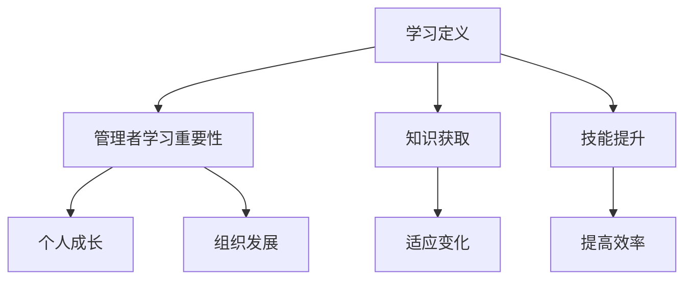

- **知识获取**：管理者需要不断学习新知识，以应对快速变化的市场环境和技术进步。
- **技能提升**：管理者需要提升管理技能，包括领导力、沟通能力和决策能力。
- **个人成长**：学习有助于管理者自我认知，提升自我价值和自信心。
- **组织发展**：管理者的学习能够带动组织整体能力的提升，推动组织持续发展。

#### 1.2 管理者学习与传统学习的区别

管理者学习与传统学习在目标、内容和方式上存在显著差异。以下是一个简单的对比流程图：

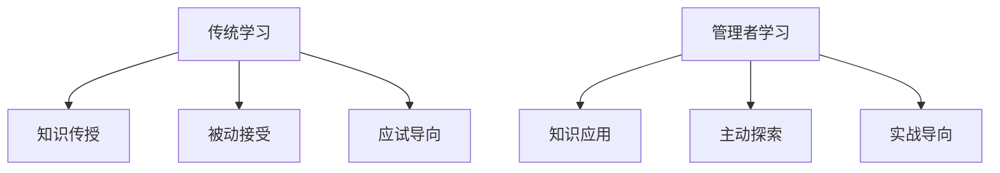

- **知识传授**：传统学习更多注重知识传授，管理者学习则更注重知识的应用。
- **被动接受**：传统学习往往是以教师为中心，管理者学习则是以学习者为中心。
- **应试导向**：传统学习往往以考试成绩为导向，管理者学习则更注重实际问题的解决。

#### 1.3 管理者学习的障碍与挑战

管理者在学习过程中可能会遇到各种障碍与挑战。以下是一个简单的障碍与挑战流程图：

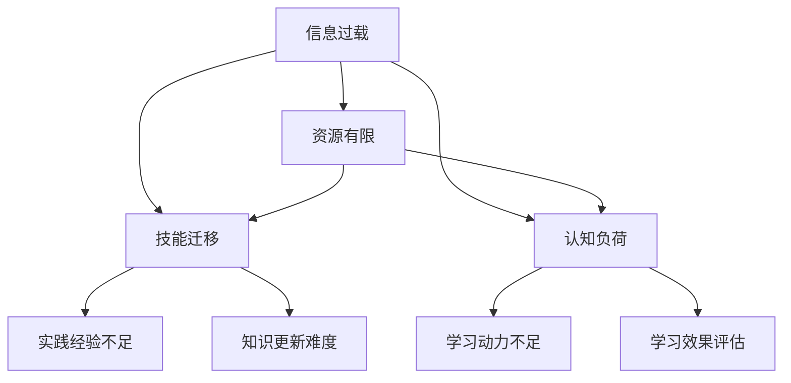

- **信息过载**：管理者面临大量信息，难以筛选和消化。
- **时间管理**：管理者需要平衡工作与学习的时间。
- **技能迁移**：管理者需要将学到的知识应用于实际工作中。
- **认知负荷**：管理者需要处理大量的信息和问题。
- **实践经验不足**：管理者可能缺乏实际操作经验。
- **知识更新难度**：知识更新速度快，管理者需要不断学习新知识。
- **学习动力不足**：管理者可能缺乏持续学习的动力。
- **学习效果评估**：管理者需要评估学习效果，以便调整学习策略。

### 第2章：管理者学习与知识更新

#### 2.1 知识更新的趋势

知识更新速度不断加快，管理者需要适应这些趋势。以下是一个简单的知识更新趋势流程图：

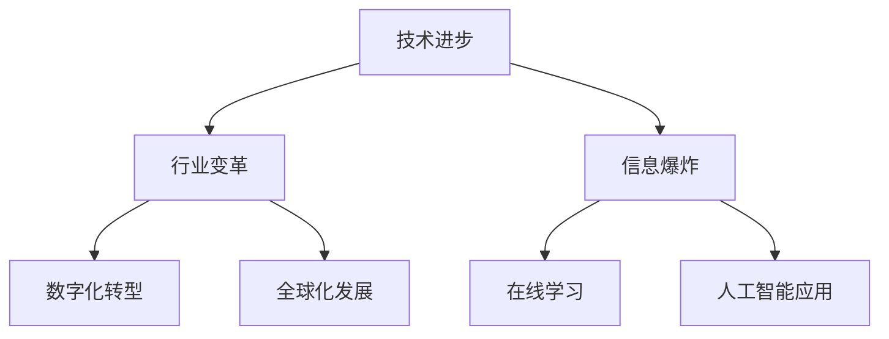

- **技术进步**：新技术的出现不断改变管理者的工作方式和思维方式。
- **行业变革**：行业变革要求管理者具备新的知识和技能。
- **信息爆炸**：信息爆炸使得管理者需要高效筛选和利用信息。
- **数字化转型**：数字化转型要求管理者具备数字化思维和技能。
- **全球化发展**：全球化发展要求管理者具备跨文化沟通和管理能力。
- **在线学习**：在线学习平台和资源为管理者提供了便捷的学习途径。
- **人工智能应用**：人工智能的应用改变了管理者的工作内容和方式。

#### 2.2 管理者知识更新的必要性

管理者知识更新的必要性体现在以下几个方面：

- **提升竞争力**：知识更新有助于管理者提升个人和组织的竞争力。
- **应对变化**：快速变化的市场环境要求管理者具备快速更新的知识。
- **提升决策能力**：知识更新有助于管理者做出更明智的决策。
- **保持职业发展**：知识更新是管理者职业发展的必要条件。

#### 2.3 管理者知识更新的方法

管理者可以通过以下方法进行知识更新：

- **持续学习**：通过在线课程、书籍、研讨会等方式不断学习新知识。
- **实践应用**：将所学知识应用于实际工作中，以验证和巩固学习效果。
- **跨行业交流**：与其他行业的管理者交流，获取新的见解和经验。
- **国际视野**：通过国际交流和合作，拓展视野，了解全球管理趋势。

### 第3章：管理者学习策略

#### 3.1 自我驱动学习

自我驱动学习是管理者学习的重要策略之一。以下是一个简单的自我驱动学习流程图：

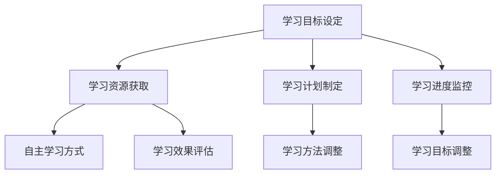

- **学习目标设定**：明确学习目标，有助于提高学习动力和效率。
- **学习资源获取**：利用各种学习资源，如在线课程、书籍、论坛等。
- **学习计划制定**：制定合理的学习计划，确保学习有序进行。
- **学习进度监控**：定期检查学习进度，及时调整学习策略。
- **自主学习方式**：选择适合自己的学习方式，如自学、讨论、实践等。
- **学习效果评估**：评估学习效果，以确定学习目标和学习策略的有效性。
- **学习方法调整**：根据学习效果评估结果，调整学习方法。
- **学习目标调整**：根据实际情况，适时调整学习目标。

#### 3.2 结构化学习

结构化学习是一种系统化的学习策略，有助于管理者系统地掌握知识。以下是一个简单的结构化学习流程图：

- **学习内容规划**：根据学习目标和需求，规划学习内容。
- **学习材料收集**：收集相关学习资料，如书籍、文章、视频等。
- **学习时间安排**：合理安排学习时间，确保学习进度。
- **学习笔记整理**：整理学习笔记，以便复习和巩固。
- **学习小组合作**：与他人合作学习，互相交流和学习。
- **学习效果评估**：评估学习效果，以确定学习目标和策略的有效性。
- **学习进度检查**：定期检查学习进度，确保学习目标实现。
- **学习内容巩固**：通过练习、复习等方式巩固所学内容。

#### 3.3 混合学习

混合学习是一种将传统学习与在线学习相结合的学习策略，有助于提高学习效果。以下是一个简单的混合学习流程图：

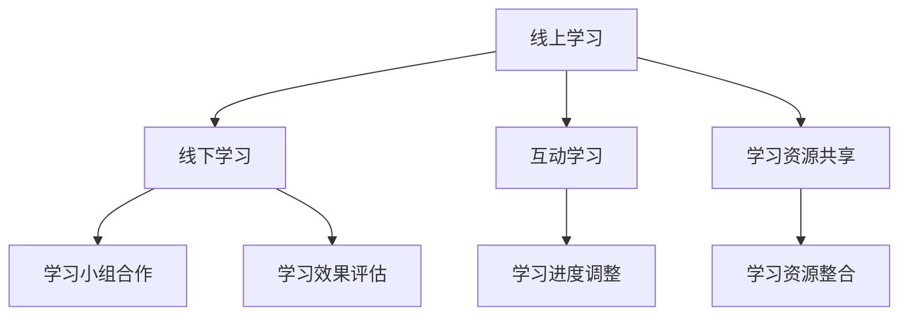

- **线上学习**：利用网络资源进行学习，如在线课程、论坛、博客等。
- **线下学习**：参加线下培训、研讨会、讲座等活动。
- **互动学习**：与他人互动，如讨论、交流、实践等。
- **学习资源共享**：共享学习资源，如书籍、笔记、经验等。
- **学习小组合作**：与他人合作学习，提高学习效果。
- **学习效果评估**：评估学习效果，以确定学习目标和策略的有效性。
- **学习进度调整**：根据学习效果评估结果，调整学习进度。
- **学习资源整合**：整合各种学习资源，提高学习效率。

## 第二部分：管理者学习能力的实践应用

### 第4章：管理者学习能力的评估与提升

#### 4.1 学习能力评估标准

管理者学习能力评估标准包括以下几个方面：

- **知识掌握度**：评估管理者对所学知识的理解和掌握程度。
- **技能应用能力**：评估管理者将所学知识应用于实际工作的能力。
- **学习能力**：评估管理者学习新知识、新技能的能力。
- **学习效率**：评估管理者学习过程中的时间利用效率。

#### 4.2 提升学习能力的方法

管理者可以通过以下方法提升学习能力：

- **制定学习计划**：明确学习目标，制定合理的学习计划。
- **培养学习习惯**：养成良好的学习习惯，如定期学习、持续复习等。
- **积极参与学习活动**：参加各种学习活动，如在线课程、研讨会、讲座等。
- **与他人互动**：与他人交流、讨论、合作，提高学习效果。
- **实践应用**：将所学知识应用于实际工作中，以验证和巩固学习效果。

#### 4.3 学习能力的持续提升

学习能力的持续提升需要管理者关注以下几个方面：

- **技术进步**：关注技术进步，了解新技术、新趋势。
- **行业动态**：关注行业动态，了解行业变革和趋势。
- **跨领域学习**：学习其他领域的知识，拓宽视野，提高综合素质。
- **持续实践**：通过实践不断提升自己的技能和能力。

### 第5章：管理者学习与领导力发展

#### 5.1 学习与领导力提升的关系

学习是提升领导力的基础。以下是一个简单的学习与领导力提升关系流程图：

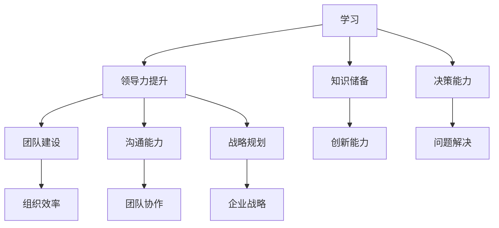

- **知识储备**：学习有助于管理者积累丰富的知识储备，提高决策能力。
- **决策能力**：学习提高管理者的决策能力，使他们能够做出更明智的决策。
- **团队建设**：学习有助于管理者提升团队建设能力，建立高效的团队。
- **沟通能力**：学习提高管理者的沟通能力，增强团队协作。
- **战略规划**：学习有助于管理者制定更有效的战略规划，推动企业持续发展。
- **创新能力**：学习激发管理者的创新能力，推动企业创新发展。
- **问题解决**：学习提高管理者的问题解决能力，帮助他们应对各种挑战。
- **组织效率**：学习提高管理者的组织效率，推动企业高效运作。

#### 5.2 管理者学习中的领导力要素

管理者在学习过程中需要关注以下几个领导力要素：

- **自我领导**：管理者需要自我激励，自我管理，不断提升自己的能力。
- **教练式领导**：管理者需要指导、激励和培养团队成员，提升团队整体能力。
- **变革领导**：管理者需要推动组织变革，引领企业走向新的发展阶段。
- **服务式领导**：管理者需要以服务为导向，关注团队成员的需求，提升团队士气。

#### 5.3 领导力发展的学习策略

管理者可以通过以下学习策略提升领导力：

- **参加领导力培训**：参加专业化的领导力培训，学习领导力理论和实践。
- **阅读领导力书籍**：阅读领导力相关书籍，了解各种领导力理论和方法。
- **实践领导力**：在实际工作中运用领导力理论，不断提升自己的领导力。
- **与领导者交流**：与有经验的领导者交流，学习他们的领导经验和心得。
- **参与领导力项目**：参与领导力项目，锻炼自己的领导能力和团队管理能力。

### 第6章：管理者学习与团队建设

#### 6.1 学习型组织的构建

构建学习型组织是提升管理者学习能力的重要途径。以下是一个简单的学习型组织构建流程图：

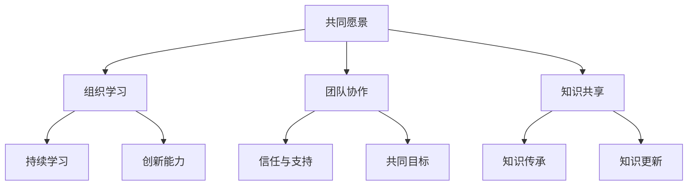

- **共同愿景**：构建学习型组织需要全体成员共同认同的愿景。
- **组织学习**：组织内部持续开展学习活动，提高全体成员的能力。
- **团队协作**：通过团队协作，实现知识共享和技能互补。
- **知识共享**：鼓励成员分享知识，促进组织内部的知识传承。
- **持续学习**：组织鼓励成员持续学习，提升个人和团队的能力。
- **创新能力**：通过学习激发创新思维，推动组织创新发展。
- **信任与支持**：建立信任和支持的文化，促进团队成员的合作。
- **共同目标**：明确共同目标，激励团队成员共同努力。
- **知识传承**：通过知识传承，确保组织知识不断积累和更新。
- **知识更新**：组织关注外部知识，及时更新内部知识库。

#### 6.2 管理者学习与团队协作

管理者学习与团队协作密切相关。以下是一个简单的管理者学习与团队协作流程图：

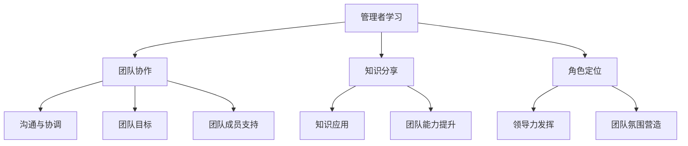

- **管理者学习**：管理者通过学习提升自己的能力，为团队协作提供支持。
- **团队协作**：团队协作是实现团队目标的重要手段。
- **知识分享**：管理者分享所学知识，提高团队成员的能力。
- **角色定位**：管理者明确自己的角色定位，发挥领导作用。
- **沟通与协调**：管理者与团队成员保持有效沟通，协调团队资源。
- **团队目标**：明确团队目标，确保团队协作有的放矢。
- **团队成员支持**：管理者支持团队成员的发展，提高团队整体能力。
- **知识应用**：团队成员将所学知识应用于实际工作中，提高工作效率。
- **团队能力提升**：通过学习，提升团队的整体能力和竞争力。
- **领导力发挥**：管理者发挥领导力，引导团队成员实现团队目标。
- **团队氛围营造**：管理者营造积极向上的团队氛围，提高团队凝聚力。

#### 6.3 管理者学习与团队文化

管理者学习与团队文化密切相关。以下是一个简单的管理者学习与团队文化流程图：

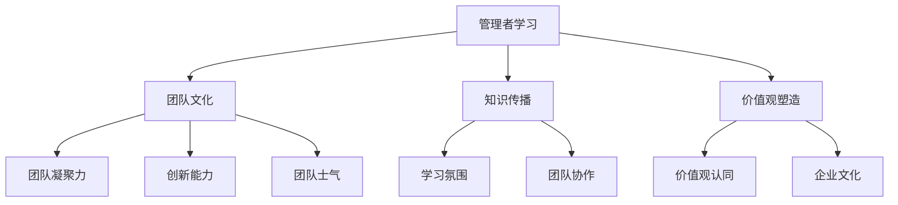

- **管理者学习**：管理者通过学习，提升自己的能力和素质，为团队文化提供支持。
- **团队文化**：团队文化是团队共同价值观和行为准则的体现。
- **知识传播**：管理者将所学知识传播给团队成员，提高团队的整体知识水平。
- **价值观塑造**：管理者通过言行举止，塑造团队共同的价值观。
- **团队凝聚力**：团队文化有助于提高团队的凝聚力，增强团队协作。
- **创新能力**：团队文化鼓励创新，激发团队成员的创新思维。
- **团队士气**：团队文化有助于提高团队士气，激发团队成员的工作热情。
- **学习氛围**：团队文化鼓励学习，营造良好的学习氛围。
- **团队协作**：团队文化促进团队成员之间的协作，提高工作效率。
- **价值观认同**：团队成员认同团队文化，形成共同的目标和价值观。
- **企业文化**：团队文化是企业文化的重要组成部分，有助于企业长远发展。

### 第7章：管理者学习与组织发展

#### 7.1 学习型组织的组织文化

学习型组织的组织文化是推动组织持续发展的关键。以下是一个简单的学习型组织组织文化流程图：

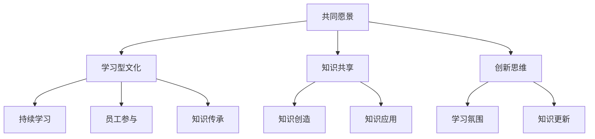

- **共同愿景**：组织成员共同认同组织愿景，为组织发展提供方向。
- **学习型文化**：组织倡导学习型文化，鼓励成员持续学习。
- **知识共享**：组织内部鼓励知识共享，促进知识传承和创新。
- **创新思维**：组织鼓励创新思维，推动组织不断进步。
- **持续学习**：组织提供持续学习的机会和资源，帮助成员不断提升。
- **员工参与**：组织鼓励员工参与决策和项目管理，提高员工积极性。
- **知识传承**：组织注重知识传承，确保组织知识的积累和更新。
- **知识创造**：组织鼓励成员进行知识创造，推动组织知识体系的完善。
- **知识应用**：组织鼓励成员将所学知识应用于实际工作中，提高工作效率。
- **学习氛围**：组织营造良好的学习氛围，激发成员的学习热情。
- **知识更新**：组织关注外部知识，及时更新内部知识库，保持组织的竞争力。

#### 7.2 管理者学习与组织战略

管理者学习与组织战略密切相关。以下是一个简单的管理者学习与组织战略流程图：

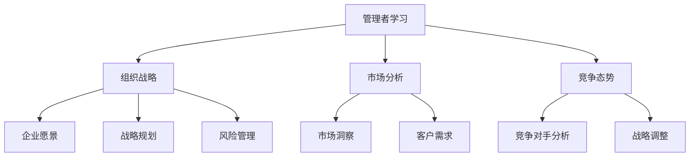

- **管理者学习**：管理者通过学习获取市场、技术和客户等方面的知识，为组织战略提供支持。
- **组织战略**：组织战略是组织发展的总体规划，包括企业愿景、使命、目标、策略等。
- **市场分析**：管理者分析市场环境，了解市场趋势和竞争态势。
- **竞争态势**：管理者了解竞争对手的情况，为组织战略制定提供参考。
- **企业愿景**：组织战略制定需要明确企业愿景，确保组织发展方向正确。
- **战略规划**：管理者根据市场分析、竞争态势和企业愿景，制定组织战略规划。
- **风险管理**：管理者分析组织面临的风险，制定相应的风险管理策略。
- **市场洞察**：管理者通过市场洞察，了解客户需求和市场动态。
- **客户需求**：管理者关注客户需求，确保组织产品或服务满足市场需求。
- **竞争对手分析**：管理者分析竞争对手的优劣势，为组织战略调整提供依据。
- **战略调整**：根据市场变化和竞争态势，管理者适时调整组织战略。

#### 7.3 管理者学习与组织创新

管理者学习与组织创新密切相关。以下是一个简单的管理者学习与组织创新流程图：

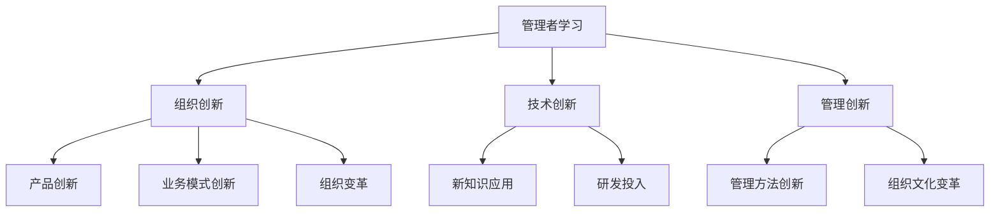

- **管理者学习**：管理者通过学习获取新技术、新知识、新管理方法，为组织创新提供支持。
- **组织创新**：组织创新是组织持续发展的重要动力。
- **技术创新**：管理者学习新技术，推动组织技术创新，提高产品竞争力。
- **管理创新**：管理者学习新管理方法，推动组织管理创新，提高组织效率。
- **产品创新**：组织通过产品创新，满足客户需求，提高市场份额。
- **业务模式创新**：组织通过业务模式创新，开拓新市场，实现可持续发展。
- **组织变革**：组织需要适应外部环境的变化，进行组织变革。
- **新知识应用**：管理者将所学新知识应用于实际工作中，推动组织创新发展。
- **研发投入**：组织增加研发投入，推动技术创新和产品创新。
- **管理方法创新**：管理者学习新管理方法，推动组织管理创新。
- **组织文化变革**：管理者通过组织文化变革，激发员工的创新热情。

## 第三部分：管理者学习能力的未来展望

### 第8章：管理者学习能力的未来发展

#### 8.1 技术对管理者学习的影响

随着技术的不断发展，管理者学习也将面临新的机遇和挑战。以下是一个简单的技术对管理者学习的影响流程图：

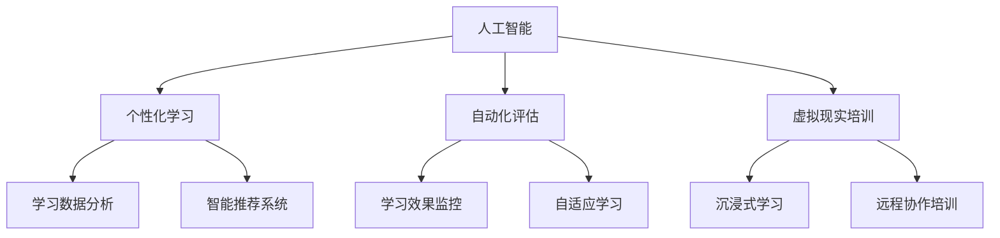

- **人工智能**：人工智能技术将改变管理者学习的模式和方法，实现个性化学习、自动化评估和虚拟现实培训。
- **个性化学习**：人工智能技术可以根据管理者的学习需求和进度，提供个性化的学习内容和服务。
- **自动化评估**：人工智能技术可以自动评估管理者的学习效果，提供实时反馈。
- **虚拟现实培训**：虚拟现实技术可以为管理者提供沉浸式的学习体验，提高学习效果。
- **学习数据分析**：人工智能技术可以对学习数据进行分析，帮助管理者了解学习效果，优化学习策略。
- **智能推荐系统**：人工智能技术可以根据管理者的学习偏好和历史，推荐合适的学习资源和课程。
- **学习效果监控**：人工智能技术可以实时监控管理者的学习进度和效果，确保学习目标的实现。
- **自适应学习**：人工智能技术可以根据管理者的学习情况，动态调整学习内容和进度。
- **沉浸式学习**：虚拟现实技术可以为管理者提供沉浸式的学习体验，提高学习效果。
- **远程协作培训**：人工智能技术可以支持远程协作培训，方便管理者参与学习活动。

#### 8.2 管理者学习的新趋势

管理者学习的新趋势主要体现在以下几个方面：

- **在线学习**：随着互联网的发展，在线学习成为管理者学习的重要途径。
- **移动学习**：移动学习设备的使用，使得管理者可以随时随地学习。
- **混合学习**：传统学习与在线学习相结合，提高学习效果。
- **社群学习**：通过线上和线下社群，管理者可以与同行交流、分享经验。
- **项目驱动学习**：通过实际项目，管理者可以将所学知识应用于实际工作，提高实践能力。

#### 8.3 未来管理者学习能力的挑战与机遇

未来管理者学习能力将面临以下挑战和机遇：

- **技术变革**：技术变革带来新的学习需求和方式，管理者需要不断适应和学习。
- **知识更新**：知识更新速度加快，管理者需要不断学习新知识，保持竞争力。
- **领导力提升**：领导力是管理者的重要素质，未来管理者需要不断提升领导力，应对复杂的管理挑战。
- **创新能力**：创新能力是组织发展的重要动力，未来管理者需要具备创新能力，推动组织创新。
- **持续发展**：管理者需要关注组织的可持续发展，通过学习，提升组织的整体竞争力。

## 附录

### 附录A：管理者学习资源推荐

为了帮助管理者提升学习能力，以下是一些推荐的学习资源：

- **在线学习平台**：Coursera、edX、Udemy等
- **管理类书籍**：《管理者的实践》、《领导力五项修炼》等
- **管理类网站**：Harvard Business Review、Fast Company等
- **管理类社群**：LinkedIn、专业协会等

### 作者信息

作者：AI天才研究院/AI Genius Institute & 禅与计算机程序设计艺术 /Zen And The Art of Computer Programming

本文由AI天才研究院和禅与计算机程序设计艺术共同撰写，旨在为管理者提供有关学习能力提升的指导和建议。如需进一步了解，请访问我们的官方网站。

[本文完] 

