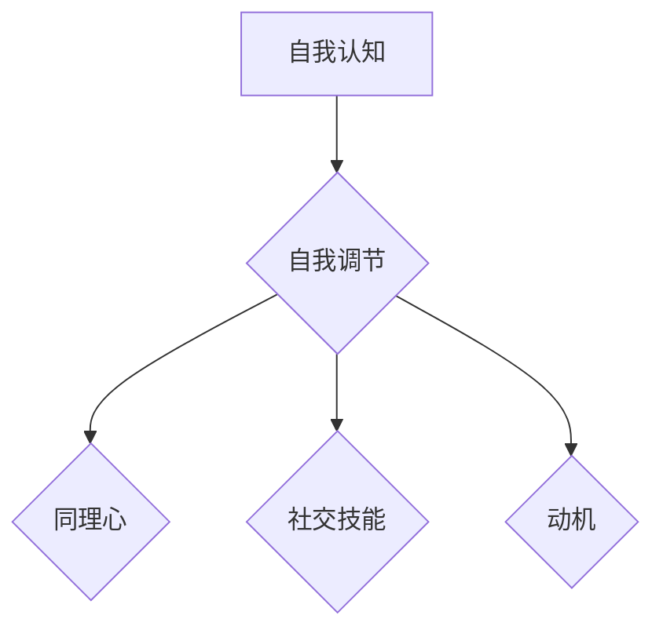

                 

### 文章标题

《管理者怎么管人：高情商领导的秘密武器》

### 关键词

高情商领导，管理者，领导力，人际沟通，团队管理，员工激励

### 摘要

本文旨在探讨高情商领导在管理者日常工作中如何发挥作用，通过解析情商的内涵与外延、提升路径及其具体应用，为管理者提供一套实用的高情商领导策略。文章首先介绍了高情商的定义及其在领导力中的作用，接着详细阐述了提升情商的方法和实践建议，然后从人际关系管理、领导风格与员工激励等方面探讨了高情商领导的具体应用，最后通过实际案例和项目实战，总结高情商领导的成功之道。本文将为管理者在提升领导力和团队管理能力方面提供有价值的参考和启示。{|user|>

## 第一部分：高情商领导的基础

### 第1章：高情商的内涵与外延

#### 1.1 高情商的定义

情商（Emotional Intelligence，简称EQ）是指个体识别、理解、管理自己情绪和他人情绪的能力。情商包括五个核心要素：

1. **自我认知**：了解自己的情绪、需求和动机。
2. **自我调节**：管理自己的情绪，使其在适当的情境下得到表达。
3. **同理心**：理解并感受他人的情绪。
4. **社交技能**：建立和维护人际关系，有效沟通和合作。
5. **动机**：驱动个人目标，激发积极行为。

高情商的定义可以概括为：情商是识别、理解和管理情绪，以及利用这些情绪来驱动个人和社会行为的综合能力。

#### 1.2 高情商与领导力的关系

高情商与领导力之间有着密切的联系。研究表明，情商是领导力的重要组成部分。以下是高情商在领导力中的作用：

1. **人际沟通**：高情商领导者能够更好地理解员工的需求，提高沟通效率，减少误解和冲突。
2. **团队协作**：高情商领导者能够建立积极向上的团队氛围，促进团队成员之间的相互理解和支持。
3. **员工激励**：高情商领导者能够识别员工的优势和潜力，并提供有针对性的激励，激发员工的工作热情和创造力。
4. **决策能力**：高情商领导者能够在面对复杂情境时保持冷静，做出更为合理和明智的决策。

高情商领导者的特征包括：

- **自我认知与自我调节**：能够识别和管理自己的情绪，保持情绪稳定。
- **同理心**：能够站在他人的角度思考问题，理解员工的情绪和需求。
- **社交技能**：具备良好的沟通能力和人际关系管理能力，能够有效地与他人建立联系。
- **动机**：具有强烈的内在动机，追求卓越和持续成长。

#### 1.3 情商模型介绍

常见的情商模型包括Goleman模型、Mayer-Salovey-Caruso模型和Bar-On模型。以下是这些模型的简要解析：

1. **Goleman模型**：Goleman将情商分为五个核心要素，即自我认知、自我调节、同理心、社交技能和动机。他认为这五个要素共同构成了情商的整体框架。
2. **Mayer-Salovey-Caruso模型**：Mayer、Salovey和Caruso提出了情商的四个核心能力，即感知情绪、理解情绪、管理情绪和合理地表达情绪。该模型强调情商的内在认知过程。
3. **Bar-On模型**：Bar-On提出了情商的五个主要领域，包括自我意识、自我调节、社交技能、决策能力和社会责任。每个领域又包含多个子领域，使得该模型具有更高的具体性和操作性。

以下是Goleman情商模型的Mermaid流程图：



为了更好地理解情商，我们可以通过以下自我情商检测量表来评估自己的情商水平：

1. **自我认知**：如何识别和理解自己的情绪？
2. **自我调节**：如何管理自己的情绪？
3. **同理心**：如何理解和感受他人的情绪？
4. **社交技能**：如何与他人建立和维护良好的人际关系？
5. **动机**：如何驱动自己实现目标？

### 第2章：情商提升的路径

#### 2.1 情商提升的必要性与可能性

在现代社会中，情商提升具有重要的必要性。首先，高情商可以帮助管理者更好地应对工作中的压力和挑战，提高工作效率。其次，高情商有助于建立积极的人际关系，促进团队合作。最后，高情商能够提升管理者的领导力，使其在团队中具有更高的影响力和公信力。

情商提升的可能性在于情商是可以通过训练和培养的。研究表明，情商具有一定的可塑性，通过有意识地培养和锻炼，个体的情商水平可以得到显著提升。以下是一些提升情商的方法：

1. **自我认知与自我调节**：通过反思和自我观察，了解自己的情绪和需求，学会控制情绪，使其在适当的情境下得到表达。
2. **同理心**：通过倾听和观察，尝试理解他人的情绪和需求，提高对他人的同理心。
3. **社交技能**：通过参与社交活动和团队合作，锻炼沟通能力和人际关系管理能力。
4. **动机**：设定明确的目标，激发内在动机，持续追求个人成长和进步。

以下是一个简单的情商提升实践建议：

1. **每天花10分钟进行情绪反思**：记录自己的情绪变化，分析情绪产生的原因，学会控制情绪。
2. **每周参与一次社交活动**：与他人建立联系，提高社交技能。
3. **每月设定一个个人成长目标**：激发内在动机，持续追求进步。

通过以上实践，可以逐步提升情商水平，为成为一名高情商领导者打下坚实基础。

#### 2.3 情商培养的实践建议

在职场情境下，情商培养是管理者提升领导力的重要途径。以下是一些建议，帮助管理者在职场中培养情商：

1. **建立良好的人际关系**：通过积极参与团队合作，主动与他人建立联系，提高社交技能。可以参加公司组织的团队建设活动，增进与同事之间的了解和信任。
2. **倾听和同理心**：在与他人交流时，注重倾听对方的意见和需求，尝试理解他人的情绪。可以通过提问和反馈，确保沟通的准确性，减少误解和冲突。
3. **情绪管理**：在工作中遇到压力和挑战时，保持冷静，学会控制情绪。可以采取深呼吸、短暂休息等方法，缓解紧张情绪，保持专注和高效。
4. **自我认知**：定期进行自我反思，了解自己的情绪、需求和动机。可以通过记录日记、反思会议等方式，提高自我认知能力。
5. **持续学习与成长**：关注行业动态，学习新知识和技能，不断提升自己的专业素养。可以通过阅读书籍、参加培训课程等方式，拓展自己的知识面和视野。

以下是一个情商培养的案例：

某公司的一位项目经理，在工作中遇到了团队协作困难的情况。他意识到自己需要提升情商，以更好地管理团队。于是，他采取了以下措施：

1. **倾听和同理心**：在团队会议中，他鼓励团队成员发表意见，并认真倾听。他通过提问和反馈，确保每个人都理解任务要求，减少了误解和冲突。
2. **情绪管理**：当他感到紧张或焦虑时，他会暂时离开会议现场，进行深呼吸和冥想，以缓解情绪。这样，他能够在会议上保持冷静和专注。
3. **建立良好的人际关系**：他主动与团队成员建立联系，了解他们的个人需求和兴趣。通过这些联系，他能够更好地激励团队成员，提高团队凝聚力。

经过一段时间的努力，这位项目经理成功地改善了团队协作，提升了团队绩效。他的情商培养实践为其他管理者提供了有益的启示。

通过以上实践和建议，管理者可以在职场中不断提升情商，成为一名高情商领导者，从而更好地管理团队，实现组织目标。

## 第二部分：高情商领导的具体应用

### 第3章：高情商领导的管理策略

#### 3.1 人际关系管理

人际关系管理是高情商领导的重要策略之一。通过建立有效的人际网络，管理者可以更好地了解员工的需求，提高团队凝聚力，促进信息共享和资源整合。

**3.1.1 建立有效的人际网络**

1. **了解员工背景**：通过了解员工的背景、兴趣和特长，管理者可以更好地了解员工，建立信任和尊重。
2. **主动沟通与交流**：管理者应主动与员工进行沟通，关心员工的个人和生活状况，了解他们的需求和困扰。
3. **建立多层次的联系**：管理者不仅要关注直接下属，还要关注其他部门和管理层，建立广泛的人际网络。

**3.1.2 处理冲突与团队合作**

1. **识别冲突来源**：管理者应善于识别冲突的来源，如沟通不畅、目标不一致、资源分配不公等。
2. **有效沟通**：管理者应通过有效沟通，解决冲突，避免事态升级。可以采取以下策略：
   - **倾听**：倾听对方的观点和需求，理解对方的立场。
   - **表达**：清晰表达自己的观点和需求，避免误解和误传。
   - **反馈**：及时给予反馈，确保双方都理解对方的意思。
3. **促进团队合作**：管理者应通过有效的团队建设活动，促进团队成员之间的相互理解和信任，提高团队协作效率。

#### 3.2 领导风格与情商

情商对领导风格有重要影响。高情商领导者能够根据不同情境和团队成员的特点，灵活调整领导风格，提高团队绩效。

**3.2.1 情商与领导风格的关联**

1. **民主型领导**：高情商领导者善于倾听员工意见，鼓励参与决策，增强员工的归属感和参与感。
2. **权威型领导**：在紧急情况下，高情商领导者可以迅速做出决策，保持团队的稳定和高效。
3. **参与型领导**：高情商领导者关注员工的个人发展，鼓励员工参与项目决策，提高员工的自主性和创新能力。

**3.2.2 多样化领导风格的运用**

1. **情境适应**：高情商领导者应根据不同情境和团队需求，灵活运用不同的领导风格。
2. **个性化管理**：高情商领导者关注员工的个性特点，采用个性化的管理策略，提高员工的工作满意度和绩效。
3. **持续反思与改进**：高情商领导者应不断反思和改进自己的领导风格，以适应团队的发展和变化。

#### 3.3 员工激励与情感管理

员工激励是高情商领导的重要任务之一。通过理解员工情感需求，管理者可以激发员工的工作热情和创造力，提高团队绩效。

**3.3.1 理解员工情感需求**

1. **关注员工心理健康**：管理者应关注员工的情感需求，了解他们的心理状况，提供必要的心理支持和关怀。
2. **倾听员工意见**：管理者应倾听员工的意见和反馈，了解他们的需求和困扰，及时采取措施解决问题。
3. **尊重员工个性**：管理者应尊重员工的个性特点，鼓励员工发挥自己的优势，实现自我价值。

**3.3.2 激发员工潜能**

1. **设定明确目标**：管理者应帮助员工设定明确的目标，明确工作期望，激发员工的内在动力。
2. **提供挑战性任务**：管理者应给员工提供具有挑战性的任务，激发他们的创新思维和创造力。
3. **认可员工成就**：管理者应认可员工的成就，给予及时的表扬和奖励，增强员工的自信心和自豪感。

以下是一个员工激励与情感管理的案例：

某公司的一位项目经理，通过关注员工的情感需求，成功激发了团队的工作热情和创造力。他采取了以下措施：

1. **了解员工需求**：他定期与团队成员进行一对一沟通，了解他们的情感需求和职业发展目标。
2. **提供心理支持**：他关注员工的心理健康，提供必要的心理支持和关怀，帮助他们解决工作和生活中的问题。
3. **设定明确目标**：他为团队成员设定明确的工作目标，明确工作期望，激发员工的内在动力。
4. **提供挑战性任务**：他给团队成员提供具有挑战性的任务，激发他们的创新思维和创造力。
5. **认可员工成就**：他及时认可团队成员的成就，给予及时的表扬和奖励，增强员工的自信心和自豪感。

经过一段时间的努力，这位项目经理成功地激发了团队的工作热情和创造力，团队绩效显著提升。他的员工激励与情感管理实践为其他管理者提供了有益的启示。

通过以上管理策略，高情商领导者可以更好地管理团队，提高团队绩效，实现组织目标。

### 第4章：高情商领导的项目管理

#### 4.1 项目管理与情商

项目管理的核心在于高效地达成项目目标，而情商在其中扮演着关键角色。情商有助于项目管理者在面对复杂情况时做出合理决策，处理团队成员之间的冲突，以及激发团队成员的积极性和创造力。

**4.1.1 情商在项目管理中的作用**

1. **决策能力**：高情商的项目管理者能够更好地处理不确定性和风险，做出更合理、更明智的决策。
2. **冲突管理**：情商帮助管理者在团队冲突中保持冷静，通过有效的沟通和协调解决冲突，维护团队和谐。
3. **团队协作**：情商使管理者能够更好地理解和满足团队成员的需求，促进团队合作，提高团队凝聚力。
4. **员工激励**：情商帮助管理者识别和激发员工的优势和潜力，提高员工的工作满意度和绩效。

**4.1.2 项目管理中的情商挑战**

1. **变化管理**：在项目实施过程中，可能会出现各种变化，需要管理者具备应对变化的能力，保持情绪稳定，调整计划和资源。
2. **跨文化沟通**：全球化背景下，项目团队可能来自不同的文化背景，需要管理者具备跨文化沟通能力，理解并尊重不同文化的差异。
3. **工作压力**：项目管理过程中，管理者常常面临高压力环境，需要具备良好的情绪调节能力，保持高效的工作状态。

#### 4.2 情商领导的项目管理实践

在项目管理中，高情商领导者的实践主要体现在以下几个方面：

**4.2.1 项目启动与规划**

1. **需求分析**：在项目启动阶段，管理者应深入了解项目需求和目标，与利益相关者保持密切沟通，确保项目目标明确、可量化。
2. **资源规划**：根据项目需求和团队能力，合理分配资源，确保团队成员的能力和资源与项目需求相匹配。
3. **风险管理**：识别项目风险，制定风险应对策略，确保项目在风险可控范围内实施。

**4.2.2 项目执行与监控**

1. **团队协作**：在项目执行过程中，管理者应促进团队成员之间的协作，建立良好的沟通机制，确保团队成员明确各自的角色和责任。
2. **情绪管理**：管理者应关注团队成员的情绪变化，及时提供支持和帮助，缓解工作压力，保持团队稳定。
3. **绩效评估**：定期对团队成员的工作绩效进行评估，给予及时的反馈和激励，鼓励团队成员持续改进。

**4.2.3 项目收尾与总结**

1. **成果验收**：在项目收尾阶段，管理者应与利益相关者共同验收项目成果，确保项目目标达成。
2. **经验总结**：对项目过程中的成功经验和教训进行总结，为今后的项目管理提供参考。
3. **团队反馈**：与团队成员进行反馈交流，了解项目执行过程中的问题和改进点，为未来的项目提供支持。

以下是一个高情商领导的项目管理案例：

某公司的项目经理王明在负责一个跨部门项目时，遇到了以下挑战：

1. **需求变化**：项目需求在执行过程中频繁变化，导致项目进度受阻。
2. **跨文化团队**：项目团队成员来自不同文化背景，沟通存在障碍。
3. **工作压力**：项目任务繁重，团队成员压力较大，情绪波动明显。

王明采取了以下措施：

1. **需求管理**：与利益相关者保持密切沟通，确保项目需求明确和稳定。在需求变化时，及时调整项目计划和资源。
2. **跨文化沟通**：组织跨文化培训，提高团队成员的跨文化沟通能力。在沟通中，尊重不同文化背景，促进团队协作。
3. **情绪管理**：关注团队成员的情绪变化，提供心理支持和帮助。定期组织团队活动，缓解工作压力，保持团队稳定。

经过一段时间的努力，王明成功地克服了这些挑战，项目顺利完成了目标。他的高情商领导实践为其他项目经理提供了有益的启示。

通过以上实践，高情商领导者可以更好地应对项目管理中的挑战，提高项目成功率，实现项目目标。

### 第5章：高情商领导的企业文化建设

#### 5.1 企业文化与情商

企业文化是企业的灵魂，对员工的行为和态度具有重要影响。高情商领导者在企业文化建设中发挥着关键作用，他们通过情感管理、沟通和激励，塑造积极向上的企业文化，激发员工的情感归属感。

**5.1.1 情商在企业文化中的地位**

1. **企业价值观**：高情商领导者通过传递企业价值观，引导员工形成共同的目标和愿景，增强员工的归属感和认同感。
2. **员工关系**：情商领导者通过建立和谐的员工关系，促进团队合作，提高员工的满意度和忠诚度。
3. **企业氛围**：情商领导者通过营造积极的企业氛围，激发员工的创造力和创新精神，推动企业的持续发展。

**5.1.2 情商领导对企业文化的影响**

1. **沟通与信任**：高情商领导者善于沟通，建立信任关系，促进信息共享和团队合作。
2. **情感管理**：情商领导者关注员工的情感需求，提供心理支持和关怀，缓解工作压力，增强员工的幸福感。
3. **激励与成长**：情商领导者通过激励和培养，激发员工的潜能，促进员工的个人成长和职业发展。

#### 5.2 情商领导的企业文化建设

高情商领导者在企业文化建设中应采取以下策略：

**5.2.1 塑造积极向上的企业文化**

1. **明确企业价值观**：高情商领导者应明确企业的核心价值观，并通过各种渠道传递给员工，形成共同的价值共识。
2. **建立信任文化**：高情商领导者通过透明、开放的沟通，建立信任关系，增强员工的信任感和归属感。
3. **培养团队精神**：高情商领导者应鼓励团队合作，促进团队成员之间的相互支持和协作，形成积极向上的团队氛围。

**5.2.2 激发员工的情感归属感**

1. **关注员工情感需求**：高情商领导者应关注员工的情感需求，提供心理支持和关怀，缓解工作压力，增强员工的幸福感。
2. **建立情感连接**：高情商领导者应通过情感连接，与员工建立深厚的情感联系，激发员工的情感归属感。
3. **激励员工成长**：高情商领导者应通过激励和培养，激发员工的潜能，促进员工的个人成长和职业发展。

以下是一个高情商领导的企业文化建设案例：

某公司的首席执行官李华通过高情商领导，成功塑造了积极向上的企业文化，激发了员工的情感归属感。他采取了以下措施：

1. **明确企业价值观**：李华明确公司的核心价值观，并通过内部培训和宣传，使员工深刻理解并认同这些价值观。
2. **建立信任文化**：李华倡导透明、开放的沟通，建立信任关系，鼓励员工提出意见和建议，增强员工的信任感和归属感。
3. **关注员工情感需求**：李华定期与员工进行一对一沟通，了解他们的情感需求和困扰，提供心理支持和帮助，缓解工作压力，增强员工的幸福感。
4. **培养团队精神**：李华鼓励团队合作，组织团队建设活动，促进团队成员之间的相互支持和协作，形成积极向上的团队氛围。
5. **激励员工成长**：李华关注员工的职业发展，提供培训和发展机会，激励员工不断学习和成长，实现自我价值。

通过以上措施，李华成功塑造了积极向上的企业文化，激发了员工的情感归属感，公司的绩效和员工满意度显著提升。他的高情商领导实践为其他企业的管理者提供了有益的启示。

通过以上策略，高情商领导者可以更好地塑造企业文化，激发员工的情感归属感，推动企业的持续发展。

### 第6章：高情商领导者的自我成长

#### 6.1 自我成长的重要性

高情商领导者需要不断进行自我成长，以适应不断变化的环境和挑战。自我成长是提升领导力的关键，它有助于领导者更好地管理团队、应对复杂情况，并在职业生涯中取得更大成就。

**6.1.1 情商领导者的发展路径**

1. **自我认知**：自我成长的第一步是自我认知，领导者需要了解自己的情绪、需求和动机，明确自己的优势和劣势。
2. **自我调节**：在自我认知的基础上，领导者需要学会管理自己的情绪，保持情绪稳定，以更好地应对压力和挑战。
3. **同理心**：领导者需要培养同理心，理解他人的情绪和需求，建立良好的人际关系。
4. **社交技能**：领导者需要提高社交技能，包括沟通能力、团队合作能力和冲突解决能力。
5. **动机**：领导者需要保持强烈的内在动机，追求卓越和持续进步。

**6.1.2 自我成长的障碍与克服**

1. **认知偏差**：领导者可能存在认知偏差，如自我中心、过度自信等，这会影响他们的判断和决策。克服方法：通过反思和他人反馈，识别和纠正认知偏差。
2. **情绪波动**：领导者可能因工作压力和挑战而情绪波动，影响工作效率和决策质量。克服方法：通过情绪管理和心理支持，保持情绪稳定。
3. **时间管理**：领导者可能面临时间管理问题，无法平衡工作和生活。克服方法：通过有效的时间管理和优先级设置，确保工作和生活的平衡。

#### 6.2 持续学习与个人发展

持续学习和个人发展是高情商领导者自我成长的重要途径。以下是一些建议：

1. **学习新技能和知识**：领导者应不断学习新技能和知识，包括领导力、管理技能、行业动态等，以适应不断变化的环境。
2. **参加培训课程**：参加专业的培训课程，提高领导力和管理能力。可以选择线上或线下的培训课程，根据自己的时间和需求进行选择。
3. **阅读书籍**：阅读专业书籍和管理书籍，汲取经验和智慧，提升自己的认知水平和领导能力。
4. **建立学习社区**：加入学习社区，与其他领导者进行交流和分享，共同学习和成长。
5. **反思与总结**：定期进行反思和总结，回顾自己的学习和成长过程，识别自己的优点和不足，制定改进计划。

以下是一个自我成长的案例：

某公司的项目经理张强，通过持续学习和自我成长，成功提升了自己的领导力。他采取了以下措施：

1. **学习新技能**：参加项目管理专业培训，学习项目管理方法和工具，提升项目管理能力。
2. **阅读书籍**：阅读领导力和管理方面的书籍，汲取经验和智慧，提升自己的认知水平和领导能力。
3. **反思与总结**：定期进行反思和总结，回顾自己的工作表现和成长过程，识别自己的优点和不足，制定改进计划。
4. **建立学习社区**：加入学习社区，与其他领导者进行交流和分享，共同学习和成长。

通过以上措施，张强成功提升了自己的领导力，带领团队取得了显著的成绩。他的自我成长实践为其他领导者提供了有益的启示。

通过以上实践和建议，高情商领导者可以不断提升自己，成为一名优秀的领导者，为组织的发展和团队的成长贡献力量。

### 第7章：高情商领导的成功案例

#### 7.1 成功案例分析

高情商领导者在不同的行业和领域中取得了显著的成功。以下是一些成功案例及其关键情商要素：

**案例1：乔布斯与苹果公司**

乔布斯作为苹果公司的联合创始人，以其高情商领导力推动了公司的发展。他具备以下关键情商要素：

1. **自我认知**：乔布斯对自己的能力和兴趣有清晰的认识，专注于创新和用户体验。
2. **同理心**：他深刻理解用户需求，注重产品细节，为用户创造卓越体验。
3. **社交技能**：乔布斯具备出色的沟通能力和演讲技巧，能够激励和团结团队成员。
4. **动机**：他对创新和卓越的执着追求，驱使苹果公司不断推出革命性产品。

**案例2：玛丽·斯通与谷歌**

玛丽·斯通是谷歌的首席人力资源官，以其卓越的领导力推动了公司的人才发展和企业文化建设。她具备以下关键情商要素：

1. **自我调节**：玛丽在压力下保持冷静，能够有效管理自己的情绪，保持高效工作。
2. **同理心**：她关注员工的情感需求，提供心理支持和关怀，营造积极向上的工作氛围。
3. **社交技能**：玛丽具备出色的沟通能力和人际关系管理能力，能够建立和维护良好的人际网络。
4. **动机**：她致力于打造最佳的工作环境，激发员工的创造力和创新能力。

**案例3：杰夫·贝索斯与亚马逊**

杰夫·贝索斯是亚马逊的创始人，以其远见卓识和高情商领导力，推动了公司的持续增长。他具备以下关键情商要素：

1. **自我认知**：杰夫·贝索斯对自己的能力和商业理念有清晰的认识，坚持长期战略规划。
2. **同理心**：他关注消费者需求，不断优化购物体验，提升客户满意度。
3. **社交技能**：杰夫·贝索斯具备出色的沟通能力和谈判技巧，能够与合作伙伴建立长期合作关系。
4. **动机**：他对创新的执着追求，推动亚马逊不断拓展业务领域，成为全球最大的电子商务平台。

#### 7.2 启示与借鉴

从以上成功案例中，我们可以得出以下启示：

1. **自我认知**：领导者需要清晰认识自己的能力和兴趣，专注于自己的优势和潜力。
2. **同理心**：领导者需要关注他人的需求和感受，以建立和谐的人际关系和积极的工作氛围。
3. **社交技能**：领导者需要具备出色的沟通能力和人际关系管理能力，以有效地与他人建立联系和合作。
4. **动机**：领导者需要具备强烈的内在动机，追求卓越和持续进步，以推动组织的发展和团队的成长。

高情商领导者可以从这些成功案例中汲取经验和智慧，结合自身实际情况，不断提升自己的领导力，为组织和团队的发展贡献力量。

### 附录

#### 附录A：高情商领导的资源与工具

为了帮助管理者提升情商，以下是一些高情商领导的资源与工具：

**A.1 评估工具**

1. **Gallup的情商量表**：通过量表评估个人的情商水平，了解自己在自我认知、自我调节、同理心和社交技能方面的表现。
2. **迈尔斯-布里格斯性格类型指标（MBTI）**：了解不同性格类型的特点和优势，促进团队合作和沟通。

**A.2 学习资源**

1. **《情商：为什么情商比智商更重要》**：丹尼尔·戈尔曼的经典作品，详细介绍了情商的概念和提升方法。
2. **《高情商领导力》**：提供高情商领导力的理论框架和实践方法，帮助管理者提升领导力。

**A.3 在线课程与研讨会**

1. **Coursera**：提供各种情商提升和管理课程，涵盖自我认知、同理心、社交技能等方面。
2. **LinkedIn Learning**：提供专业的情商提升课程和研讨会，帮助管理者提升情商和领导力。

通过利用这些资源与工具，管理者可以更有效地提升自己的情商，成为一名高情商领导者。

## 结语

高情商领导是一种重要的领导力特质，它不仅能够提升管理者的个人魅力，还能促进团队的协作和组织的成功。本文通过详细分析高情商领导的内涵、提升路径、具体应用和成功案例，为管理者提供了一套实用的高情商领导策略。高情商领导者应不断自我成长，提升自我认知、同理心、社交技能和动机，以应对复杂多变的工作环境。

**小结**：高情商领导是一种通过情感管理和人际关系能力提升领导力的方式。管理者应通过持续学习和实践，不断提升自己的情商，成为一名优秀的领导者。

**注意事项**：在提升情商的过程中，管理者需要关注自身的情感需求，保持情绪稳定，避免过度压力。同时，要关注团队成员的情感需求，提供支持和帮助，营造积极向上的工作氛围。

**拓展阅读**：《情商：为什么情商比智商更重要》、《高情商领导力》等经典书籍，以及在线课程和研讨会，都是提升情商的有益资源。

作者：AI天才研究院/AI Genius Institute & 禅与计算机程序设计艺术 /Zen And The Art of Computer Programming```markdown
# 《管理者怎么管人：高情商领导的秘密武器》

> 关键词：高情商领导，管理者，领导力，人际沟通，团队管理，员工激励

> 摘要：本文探讨了高情商领导在管理者日常工作中如何发挥作用，通过解析情商的内涵与外延、提升路径及其具体应用，为管理者提供了一套实用的高情商领导策略。文章首先介绍了高情商的定义及其在领导力中的作用，接着详细阐述了提升情商的方法和实践建议，然后从人际关系管理、领导风格与员工激励等方面探讨了高情商领导的具体应用，最后通过实际案例和项目实战，总结高情商领导的成功之道。本文将为管理者在提升领导力和团队管理能力方面提供有价值的参考和启示。

## 第一部分：高情商领导的基础

### 第1章：高情商的内涵与外延

#### 1.1 高情商的定义

情商（Emotional Intelligence，简称EQ）是指个体识别、理解、管理自己情绪和他人情绪的能力。情商包括五个核心要素：自我认知、自我调节、同理心、社交技能和动机。高情商的定义可以概括为：情商是识别、理解和管理情绪，以及利用这些情绪来驱动个人和社会行为的综合能力。

#### 1.2 高情商与领导力的关系

高情商与领导力之间有着密切的联系。研究表明，情商是领导力的重要组成部分。以下是高情商在领导力中的作用：

1. **人际沟通**：高情商领导者能够更好地理解员工的需求，提高沟通效率，减少误解和冲突。
2. **团队协作**：高情商领导者能够建立积极向上的团队氛围，促进团队成员之间的相互理解和支持。
3. **员工激励**：高情商领导者能够识别员工的优势和潜力，并提供有针对性的激励，激发员工的工作热情和创造力。
4. **决策能力**：高情商领导者能够在面对复杂情境时保持冷静，做出更为合理和明智的决策。

高情商领导者的特征包括：

- **自我认知与自我调节**：能够识别和管理自己的情绪，保持情绪稳定。
- **同理心**：能够站在他人的角度思考问题，理解员工的情绪和需求。
- **社交技能**：具备良好的沟通能力和人际关系管理能力，能够有效地与他人建立联系。
- **动机**：具有强烈的内在动机，追求卓越和持续成长。

#### 1.3 情商模型介绍

常见的情商模型包括Goleman模型、Mayer-Salovey-Caruso模型和Bar-On模型。以下是这些模型的简要解析：

1. **Goleman模型**：Goleman将情商分为五个核心要素，即自我认知、自我调节、同理心、社交技能和动机。他认为这五个要素共同构成了情商的整体框架。
2. **Mayer-Salovey-Caruso模型**：Mayer、Salovey和Caruso提出了情商的四个核心能力，即感知情绪、理解情绪、管理情绪和合理地表达情绪。该模型强调情商的内在认知过程。
3. **Bar-On模型**：Bar-On提出了情商的五个主要领域，包括自我意识、自我调节、社交技能、决策能力和社会责任。每个领域又包含多个子领域，使得该模型具有更高的具体性和操作性。

以下是Goleman情商模型的Mermaid流程图：


为了更好地理解情商，我们可以通过以下自我情商检测量表来评估自己的情商水平：

1. **自我认知**：如何识别和理解自己的情绪？
2. **自我调节**：如何管理自己的情绪？
3. **同理心**：如何理解和感受他人的情绪？
4. **社交技能**：如何与他人建立和维护良好的人际关系？
5. **动机**：如何驱动自己实现目标？

### 第2章：情商提升的路径

#### 2.1 情商提升的必要性与可能性

在现代社会中，情商提升具有重要的必要性。首先，高情商可以帮助管理者更好地应对工作中的压力和挑战，提高工作效率。其次，高情商有助于建立积极的人际关系，促进团队合作。最后，高情商能够提升管理者的领导力，使其在团队中具有更高的影响力和公信力。

情商提升的可能性在于情商是可以通过训练和培养的。研究表明，情商具有一定的可塑性，通过有意识地培养和锻炼，个体的情商水平可以得到显著提升。以下是一些提升情商的方法：

1. **自我认知与自我调节**：通过反思和自我观察，了解自己的情绪和需求，学会控制情绪，使其在适当的情境下得到表达。
2. **同理心**：通过倾听和观察，尝试理解他人的情绪和需求，提高对他人的同理心。
3. **社交技能**：通过参与社交活动和团队合作，锻炼沟通能力和人际关系管理能力。
4. **动机**：设定明确的目标，激发内在动机，持续追求个人成长和进步。

以下是一个简单的情商提升实践建议：

1. **每天花10分钟进行情绪反思**：记录自己的情绪变化，分析情绪产生的原因，学会控制情绪。
2. **每周参与一次社交活动**：与他人建立联系，提高社交技能。
3. **每月设定一个个人成长目标**：激发内在动机，持续追求进步。

通过以上实践，可以逐步提升情商水平，为成为一名高情商领导者打下坚实基础。

#### 2.2 提升情商的方法

在职场情境下，情商提升是管理者提升领导力的重要途径。以下是一些建议，帮助管理者在职场中培养情商：

1. **建立良好的人际关系**：通过积极参与团队合作，主动与他人建立联系，提高社交技能。可以参加公司组织的团队建设活动，增进与同事之间的了解和信任。
2. **倾听和同理心**：在与他人交流时，注重倾听对方的意见和需求，尝试理解他人的情绪。可以通过提问和反馈，确保沟通的准确性，减少误解和冲突。
3. **情绪管理**：在工作中遇到压力和挑战时，保持冷静，学会控制情绪。可以采取深呼吸、短暂休息等方法，缓解紧张情绪，保持专注和高效。
4. **自我认知**：定期进行自我反思，了解自己的情绪、需求和动机。可以通过记录日记、反思会议等方式，提高自我认知能力。
5. **持续学习与成长**：关注行业动态，学习新知识和技能，不断提升自己的专业素养。可以通过阅读书籍、参加培训课程等方式，拓展自己的知识面和视野。

以下是一个情商提升的案例：

某公司的一位项目经理，在工作中遇到了团队协作困难的情况。他意识到自己需要提升情商，以更好地管理团队。于是，他采取了以下措施：

1. **倾听和同理心**：在团队会议中，他鼓励团队成员发表意见，并认真倾听。他通过提问和反馈，确保每个人都理解任务要求，减少了误解和冲突。
2. **情绪管理**：当他感到紧张或焦虑时，他会暂时离开会议现场，进行深呼吸和冥想，以缓解情绪。这样，他能够在会议上保持冷静和专注。
3. **建立良好的人际关系**：他主动与团队成员建立联系，了解他们的个人需求和兴趣。通过这些联系，他能够更好地激励团队成员，提高团队凝聚力。

经过一段时间的努力，这位项目经理成功地改善了团队协作，提升了团队绩效。他的情商提升实践为其他管理者提供了有益的启示。

通过以上实践和建议，管理者可以在职场中不断提升情商，成为一名高情商领导者，从而更好地管理团队，实现组织目标。

## 第二部分：高情商领导的具体应用

### 第3章：高情商领导的管理策略

#### 3.1 人际关系管理

人际关系管理是高情商领导的重要策略之一。通过建立有效的人际网络，管理者可以更好地了解员工的需求，提高团队凝聚力，促进信息共享和资源整合。

**3.1.1 建立有效的人际网络**

1. **了解员工背景**：通过了解员工的背景、兴趣和特长，管理者可以更好地了解员工，建立信任和尊重。
2. **主动沟通与交流**：管理者应主动与员工进行沟通，关心员工的个人和生活状况，了解他们的需求和困扰。
3. **建立多层次的联系**：管理者不仅要关注直接下属，还要关注其他部门和管理层，建立广泛的人际网络。

**3.1.2 处理冲突与团队合作**

1. **识别冲突来源**：管理者应善于识别冲突的来源，如沟通不畅、目标不一致、资源分配不公等。
2. **有效沟通**：管理者应通过有效沟通，解决冲突，避免事态升级。可以采取以下策略：
   - **倾听**：倾听对方的观点和需求，理解对方的立场。
   - **表达**：清晰表达自己的观点和需求，避免误解和误传。
   - **反馈**：及时给予反馈，确保双方都理解对方的意思。
3. **促进团队合作**：管理者应通过有效的团队建设活动，促进团队成员之间的相互理解和信任，提高团队协作效率。

#### 3.2 领导风格与情商

情商对领导风格有重要影响。高情商领导者能够根据不同情境和团队成员的特点，灵活调整领导风格，提高团队绩效。

**3.2.1 情商与领导风格的关联**

1. **民主型领导**：高情商领导者善于倾听员工意见，鼓励参与决策，增强员工的归属感和参与感。
2. **权威型领导**：在紧急情况下，高情商领导者可以迅速做出决策，保持团队的稳定和高效。
3. **参与型领导**：高情商领导者关注员工的个人发展，鼓励员工参与项目决策，提高员工的自主性和创新能力。

**3.2.2 多样化领导风格的运用**

1. **情境适应**：高情商领导者应根据不同情境和团队需求，灵活运用不同的领导风格。
2. **个性化管理**：高情商领导者关注员工的个性特点，采用个性化的管理策略，提高员工的工作满意度和绩效。
3. **持续反思与改进**：高情商领导者应不断反思和改进自己的领导风格，以适应团队的发展和变化。

#### 3.3 员工激励与情感管理

员工激励是高情商领导的重要任务之一。通过理解员工情感需求，管理者可以激发员工的工作热情和创造力，提高团队绩效。

**3.3.1 理解员工情感需求**

1. **关注员工心理健康**：管理者应关注员工的情感需求，了解他们的心理状况，提供必要的心理支持和关怀。
2. **倾听员工意见**：管理者应倾听员工的意见和反馈，了解他们的需求和困扰，及时采取措施解决问题。
3. **尊重员工个性**：管理者应尊重员工的个性特点，鼓励员工发挥自己的优势，实现自我价值。

**3.3.2 激发员工潜能**

1. **设定明确目标**：管理者应帮助员工设定明确的目标，明确工作期望，激发员工的内在动力。
2. **提供挑战性任务**：管理者应给员工提供具有挑战性的任务，激发他们的创新思维和创造力。
3. **认可员工成就**：管理者应认可员工的成就，给予及时的表扬和奖励，增强员工的自信心和自豪感。

以下是一个员工激励与情感管理的案例：

某公司的一位项目经理，通过关注员工的情感需求，成功激发了团队的工作热情和创造力。他采取了以下措施：

1. **了解员工需求**：他定期与团队成员进行一对一沟通，了解他们的情感需求和职业发展目标。
2. **提供心理支持**：他关注员工的情感需求，提供必要的心理支持和关怀，帮助他们解决工作和生活中的问题。
3. **设定明确目标**：他为团队成员设定明确的工作目标，明确工作期望，激发员工的内在动力。
4. **提供挑战性任务**：他给团队成员提供具有挑战性的任务，激发他们的创新思维和创造力。
5. **认可员工成就**：他及时认可团队成员的成就，给予及时的表扬和奖励，增强员工的自信心和自豪感。

经过一段时间的努力，这位项目经理成功地激发了团队的工作热情和创造力，团队绩效显著提升。他的员工激励与情感管理实践为其他管理者提供了有益的启示。

通过以上管理策略，高情商领导者可以更好地管理团队，提高团队绩效，实现组织目标。

### 第4章：高情商领导的项目管理

#### 4.1 项目管理与情商

项目管理的核心在于高效地达成项目目标，而情商在其中扮演着关键角色。情商有助于项目管理者在面对复杂情况时做出合理决策，处理团队成员之间的冲突，以及激发团队成员的积极性和创造力。

**4.1.1 情商在项目管理中的作用**

1. **决策能力**：高情商的项目管理者能够更好地处理不确定性和风险，做出更合理、更明智的决策。
2. **冲突管理**：情商帮助管理者在团队冲突中保持冷静，通过有效的沟通和协调解决冲突，维护团队和谐。
3. **团队协作**：情商使管理者能够更好地理解和满足团队成员的需求，促进团队合作，提高团队凝聚力。
4. **员工激励**：情商帮助管理者识别和激发员工的优势和潜力，提高员工的工作满意度和绩效。

**4.1.2 项目管理中的情商挑战**

1. **变化管理**：在项目实施过程中，可能会出现各种变化，需要管理者具备应对变化的能力，保持情绪稳定，调整计划和资源。
2. **跨文化沟通**：全球化背景下，项目团队可能来自不同的文化背景，需要管理者具备跨文化沟通能力，理解并尊重不同文化的差异。
3. **工作压力**：项目管理过程中，管理者常常面临高压力环境，需要具备良好的情绪调节能力，保持高效的工作状态。

#### 4.2 情商领导的项目管理实践

在项目管理中，高情商领导者的实践主要体现在以下几个方面：

**4.2.1 项目启动与规划**

1. **需求分析**：在项目启动阶段，管理者应深入了解项目需求和目标，与利益相关者保持密切沟通，确保项目目标明确、可量化。
2. **资源规划**：根据项目需求和团队能力，合理分配资源，确保团队成员的能力和资源与项目需求相匹配。
3. **风险管理**：识别项目风险，制定风险应对策略，确保项目在风险可控范围内实施。

**4.2.2 项目执行与监控**

1. **团队协作**：在项目执行过程中，管理者应促进团队成员之间的协作，建立良好的沟通机制，确保团队成员明确各自的角色和责任。
2. **情绪管理**：管理者应关注团队成员的情绪变化，及时提供支持和帮助，缓解工作压力，保持团队稳定。
3. **绩效评估**：定期对团队成员的工作绩效进行评估，给予及时的反馈和激励，鼓励团队成员持续改进。

**4.2.3 项目收尾与总结**

1. **成果验收**：在项目收尾阶段，管理者应与利益相关者共同验收项目成果，确保项目目标达成。
2. **经验总结**：对项目过程中的成功经验和教训进行总结，为今后的项目管理提供参考。
3. **团队反馈**：与团队成员进行反馈交流，了解项目执行过程中的问题和改进点，为未来的项目提供支持。

以下是一个高情商领导的项目管理案例：

某公司的项目经理王明在负责一个跨部门项目时，遇到了以下挑战：

1. **需求变化**：项目需求在执行过程中频繁变化，导致项目进度受阻。
2. **跨文化团队**：项目团队成员来自不同文化背景，沟通存在障碍。
3. **工作压力**：项目任务繁重，团队成员压力较大，情绪波动明显。

王明采取了以下措施：

1. **需求管理**：与利益相关者保持密切沟通，确保项目需求明确和稳定。在需求变化时，及时调整项目计划和资源。
2. **跨文化沟通**：组织跨文化培训，提高团队成员的跨文化沟通能力。在沟通中，尊重不同文化背景，促进团队协作。
3. **情绪管理**：关注团队成员的情绪变化，提供心理支持和帮助。定期组织团队活动，缓解工作压力，保持团队稳定。

经过一段时间的努力，王明成功地克服了这些挑战，项目顺利完成了目标。他的高情商领导实践为其他项目经理提供了有益的启示。

通过以上实践，高情商领导者可以更好地应对项目管理中的挑战，提高项目成功率，实现项目目标。

### 第5章：高情商领导的企业文化建设

#### 5.1 企业文化与情商

企业文化是企业的灵魂，对员工的行为和态度具有重要影响。高情商领导者在企业文化建设中发挥着关键作用，他们通过情感管理、沟通和激励，塑造积极向上的企业文化，激发员工的情感归属感。

**5.1.1 情商在企业文化中的地位**

1. **企业价值观**：高情商领导者通过传递企业价值观，引导员工形成共同的目标和愿景，增强员工的归属感和认同感。
2. **员工关系**：情商领导者通过建立和谐的员工关系，促进团队合作，提高员工的满意度和忠诚度。
3. **企业氛围**：情商领导者通过营造积极的企业氛围，激发员工的创造力和创新精神，推动企业的持续发展。

**5.1.2 情商领导对企业文化的影响**

1. **沟通与信任**：高情商领导者善于沟通，建立信任关系，促进信息共享和团队合作。
2. **情感管理**：情商领导者关注员工的情感需求，提供心理支持和关怀，缓解工作压力，增强员工的幸福感。
3. **激励与成长**：情商领导者通过激励和培养，激发员工的潜能，促进员工的个人成长和职业发展。

#### 5.2 情商领导的企业文化建设

高情商领导者在企业文化建设中应采取以下策略：

**5.2.1 塑造积极向上的企业文化**

1. **明确企业价值观**：高情商领导者应明确企业的核心价值观，并通过各种渠道传递给员工，形成共同的价值共识。
2. **建立信任文化**：高情商领导者应倡导透明、开放的沟通，建立信任关系，鼓励员工提出意见和建议，增强员工的信任感和归属感。
3. **培养团队精神**：高情商领导者应鼓励团队合作，促进团队成员之间的相互支持和协作，形成积极向上的团队氛围。

**5.2.2 激发员工的情感归属感**

1. **关注员工情感需求**：高情商领导者应关注员工的情感需求，提供心理支持和关怀，缓解工作压力，增强员工的幸福感。
2. **建立情感连接**：高情商领导者应通过情感连接，与员工建立深厚的情感联系，激发员工的情感归属感。
3. **激励员工成长**：高情商领导者应通过激励和培养，激发员工的潜能，促进员工的个人成长和职业发展。

以下是一个高情商领导的企业文化建设案例：

某公司的首席执行官李华通过高情商领导，成功塑造了积极向上的企业文化，激发了员工的情感归属感。他采取了以下措施：

1. **明确企业价值观**：李华明确公司的核心价值观，并通过内部培训和宣传，使员工深刻理解并认同这些价值观。
2. **建立信任文化**：李华倡导透明、开放的沟通，建立信任关系，鼓励员工提出意见和建议，增强员工的信任感和归属感。
3. **关注员工情感需求**：李华定期与员工进行一对一沟通，了解他们的情感需求和困扰，提供心理支持和帮助，缓解工作压力，增强员工的幸福感。
4. **培养团队精神**：李华鼓励团队合作，组织团队建设活动，促进团队成员之间的相互支持和协作，形成积极向上的团队氛围。
5. **激励员工成长**：李华关注员工的职业发展，提供培训和发展机会，激励员工不断学习和成长，实现自我价值。

通过以上措施，李华成功塑造了积极向上的企业文化，激发了员工的情感归属感，公司的绩效和员工满意度显著提升。他的高情商领导实践为其他企业的管理者提供了有益的启示。

通过以上策略，高情商领导者可以更好地塑造企业文化，激发员工的情感归属感，推动企业的持续发展。

### 第6章：高情商领导者的自我成长

#### 6.1 自我成长的重要性

高情商领导者需要不断进行自我成长，以适应不断变化的环境和挑战。自我成长是提升领导力的关键，它有助于领导者更好地管理团队、应对复杂情况，并在职业生涯中取得更大成就。

**6.1.1 情商领导者的发展路径**

1. **自我认知**：自我成长的第一步是自我认知，领导者需要了解自己的情绪、需求和动机，明确自己的优势和劣势。
2. **自我调节**：在自我认知的基础上，领导者需要学会管理自己的情绪，保持情绪稳定，以更好地应对压力和挑战。
3. **同理心**：领导者需要培养同理心，理解他人的情绪和需求，建立良好的人际关系。
4. **社交技能**：领导者需要提高社交技能，包括沟通能力、团队合作能力和冲突解决能力。
5. **动机**：领导者需要保持强烈的内在动机，追求卓越和持续成长。

**6.1.2 自我成长的障碍与克服**

1. **认知偏差**：领导者可能存在认知偏差，如自我中心、过度自信等，这会影响他们的判断和决策。克服方法：通过反思和他人反馈，识别和纠正认知偏差。
2. **情绪波动**：领导者可能因工作压力和挑战而情绪波动，影响工作效率和决策质量。克服方法：通过情绪管理和心理支持，保持情绪稳定。
3. **时间管理**：领导者可能面临时间管理问题，无法平衡工作和生活。克服方法：通过有效的时间管理和优先级设置，确保工作和生活的平衡。

#### 6.2 持续学习与个人发展

持续学习和个人发展是高情商领导者自我成长的重要途径。以下是一些建议：

1. **学习新技能和知识**：领导者应不断学习新技能和知识，包括领导力、管理技能、行业动态等，以适应不断变化的环境。
2. **参加培训课程**：参加专业的培训课程，提高领导力和管理能力。可以选择线上或线下的培训课程，根据自己的时间和需求进行选择。
3. **阅读书籍**：阅读专业书籍和管理书籍，汲取经验和智慧，提升自己的认知水平和领导能力。
4. **建立学习社区**：加入学习社区，与其他领导者进行交流和分享，共同学习和成长。
5. **反思与总结**：定期进行反思和总结，回顾自己的学习和成长过程，识别自己的优点和不足，制定改进计划。

以下是一个自我成长的案例：

某公司的项目经理张强，通过持续学习和自我成长，成功提升了自己的领导力。他采取了以下措施：

1. **学习新技能**：参加项目管理专业培训，学习项目管理方法和工具，提升项目管理能力。
2. **阅读书籍**：阅读领导力和管理方面的书籍，汲取经验和智慧，提升自己的认知水平和领导能力。
3. **反思与总结**：定期进行反思和总结，回顾自己的工作表现和成长过程，识别自己的优点和不足，制定改进计划。
4. **建立学习社区**：加入学习社区，与其他领导者进行交流和分享，共同学习和成长。

通过以上措施，张强成功提升了自己的领导力，带领团队取得了显著的成绩。他的自我成长实践为其他领导者提供了有益的启示。

通过以上实践和建议，高情商领导者可以不断提升自己，成为一名优秀的领导者，为组织的发展和团队的成长贡献力量。

### 第7章：高情商领导的成功案例

#### 7.1 成功案例分析

高情商领导者在不同的行业和领域中取得了显著的成功。以下是一些成功案例及其关键情商要素：

**案例1：乔布斯与苹果公司**

乔布斯作为苹果公司的联合创始人，以其高情商领导力推动了公司的发展。他具备以下关键情商要素：

1. **自我认知**：乔布斯对自己的能力和兴趣有清晰的认识，专注于创新和用户体验。
2. **同理心**：他深刻理解用户需求，注重产品细节，为用户创造卓越体验。
3. **社交技能**：乔布斯具备出色的沟通能力和演讲技巧，能够激励和团结团队成员。
4. **动机**：他对创新和卓越的执着追求，驱使苹果公司不断推出革命性产品。

**案例2：玛丽·斯通与谷歌**

玛丽·斯通是谷歌的首席人力资源官，以其卓越的领导力推动了公司的人才发展和企业文化建设。她具备以下关键情商要素：

1. **自我调节**：玛丽在压力下保持冷静，能够有效管理自己的情绪，保持高效工作。
2. **同理心**：她关注员工的情感需求，提供心理支持和关怀，营造积极向上的工作氛围。
3. **社交技能**：玛丽具备出色的沟通能力和人际关系管理能力，能够建立和维护良好的人际网络。
4. **动机**：她致力于打造最佳的工作环境，激发员工的创造力和创新能力。

**案例3：杰夫·贝索斯与亚马逊**

杰夫·贝索斯是亚马逊的创始人，以其远见卓识和高情商领导力，推动了公司的持续增长。他具备以下关键情商要素：

1. **自我认知**：杰夫·贝索斯对自己的能力和商业理念有清晰的认识，坚持长期战略规划。
2. **同理心**：他关注消费者需求，不断优化购物体验，提升客户满意度。
3. **社交技能**：杰夫·贝索斯具备出色的沟通能力和谈判技巧，能够与合作伙伴建立长期合作关系。
4. **动机**：他对创新的执着追求，推动亚马逊不断拓展业务领域，成为全球最大的电子商务平台。

#### 7.2 启示与借鉴

从以上成功案例中，我们可以得出以下启示：

1. **自我认知**：领导者需要清晰认识自己的能力和兴趣，专注于自己的优势和潜力。
2. **同理心**：领导者需要关注他人的需求和感受，以建立和谐的人际关系和积极的工作氛围。
3. **社交技能**：领导者需要具备出色的沟通能力和人际关系管理能力，以有效地与他人建立联系和合作。
4. **动机**：领导者需要具备强烈的内在动机，追求卓越和持续进步，以推动组织的发展和团队的成长。

高情商领导者可以从这些成功案例中汲取经验和智慧，结合自身实际情况，不断提升自己的领导力，为组织和团队的发展贡献力量。

### 附录

#### 附录A：高情商领导的资源与工具

为了帮助管理者提升情商，以下是一些高情商领导的资源与工具：

**A.1 评估工具**

1. **Gallup的情商量表**：通过量表评估个人的情商水平，了解自己在自我认知、自我调节、同理心和社交技能方面的表现。
2. **迈尔斯-布里格斯性格类型指标（MBTI）**：了解不同性格类型的特点和优势，促进团队合作和沟通。

**A.2 学习资源**

1. **《情商：为什么情商比智商更重要》**：丹尼尔·戈尔曼的经典作品，详细介绍了情商的概念和提升方法。
2. **《高情商领导力》**：提供高情商领导力的理论框架和实践方法，帮助管理者提升领导力。

**A.3 在线课程与研讨会**

1. **Coursera**：提供各种情商提升和管理课程，涵盖自我认知、同理心、社交技能等方面。
2. **LinkedIn Learning**：提供专业的情商提升课程和研讨会，帮助管理者提升情商和领导力。

通过利用这些资源与工具，管理者可以更有效地提升自己的情商，成为一名高情商领导者。

## 结语

高情商领导是一种重要的领导力特质，它不仅能够提升管理者的个人魅力，还能促进团队的协作和组织的成功。本文通过详细分析高情商领导的内涵、提升路径、具体应用和成功案例，为管理者提供了一套实用的高情商领导策略。高情商领导者应不断自我成长，提升自我认知、同理心、社交技能和动机，以应对复杂多变的工作环境。

**小结**：高情商领导是一种通过情感管理和人际关系能力提升领导力的方式。管理者应通过持续学习和实践，不断提升自己的情商，成为一名优秀的领导者。

**注意事项**：在提升情商的过程中，管理者需要关注自身的情感需求，保持情绪稳定，避免过度压力。同时，要关注团队成员的情感需求，提供支持和帮助，营造积极向上的工作氛围。

**拓展阅读**：《情商：为什么情商比智商更重要》、《高情商领导力》等经典书籍，以及在线课程和研讨会，都是提升情商的有益资源。

作者：AI天才研究院/AI Genius Institute & 禅与计算机程序设计艺术 /Zen And The Art of Computer Programming
```

