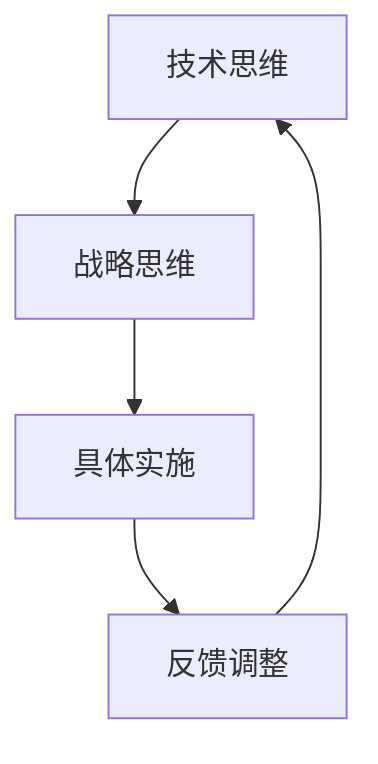
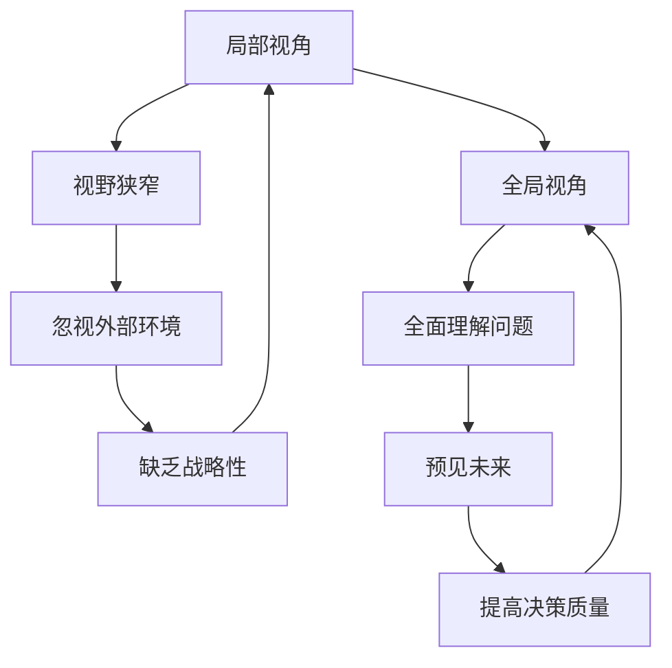
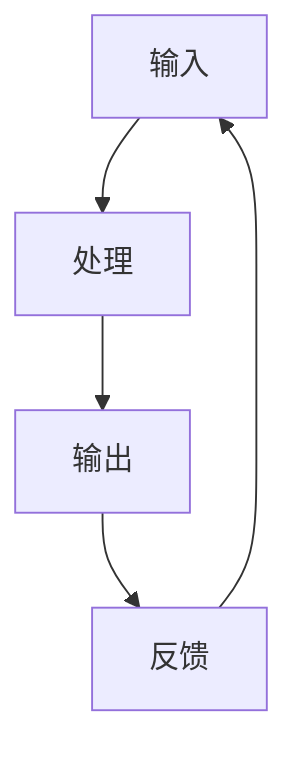
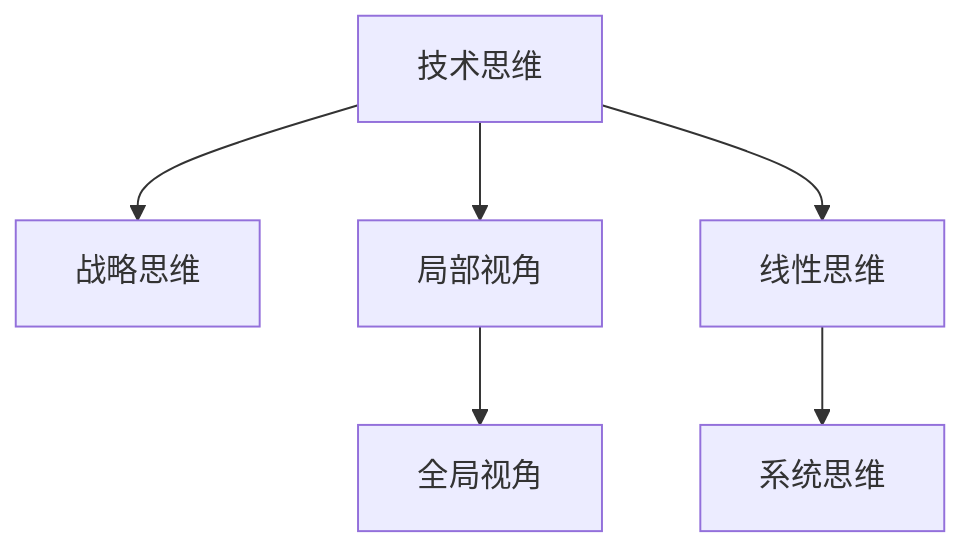
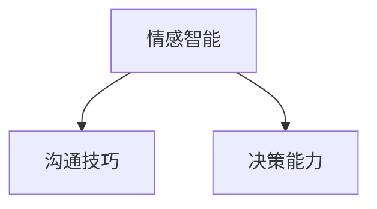
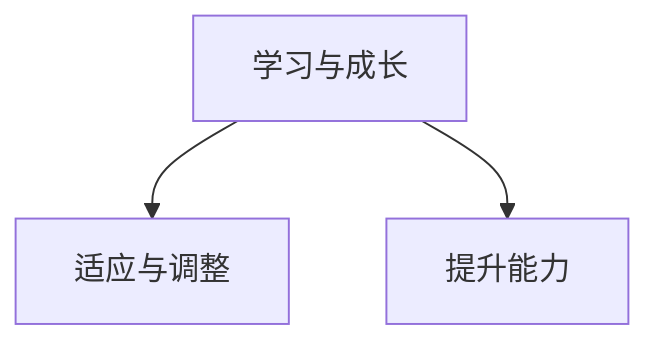

                 

### 文章标题

# 《管理者思维模式：从执行者到领导者的转变》

> 关键词：管理者思维模式，领导力，执行者，领导者，转变，战略思维，全局视角，系统思维，自我提升

> 摘要：本文旨在探讨从执行者到领导者的转变过程中，管理者思维模式的关键要素与转变路径。通过分析领导者与执行者的区别，剖析领导力的核心要素，以及深入探讨技术思维与战略思维、局部视角与全局视角、线性思维与系统思维的转变，本文旨在为管理者提供实际可行的路径和方法，帮助他们在职场中实现成功的领导力转变。

### 目录

## 第一部分：基础与转变

### 第1章：管理者的角色与责任  
#### 1.1 管理者角色的演变  
#### 1.2 执行者与领导者：职责对比  
#### 1.3 自我评估：我是哪一类管理者？

### 第2章：领导力的核心要素  
#### 2.1 领导力理论概述  
#### 2.2 情感智能：领导者的心灵素养  
#### 2.3 沟通技巧：从有效到高效

## 第二部分：思维模式的转变

### 第3章：从技术思维到战略思维  
#### 3.1 技术思维的局限  
#### 3.2 战略思维的重要性  
#### 3.3 技术与战略的平衡

### 第4章：从局部视角到全局视角  
#### 4.1 局部视角的缺陷  
#### 4.2 全局视角的价值  
#### 4.3 实现全局视角的方法

### 第5章：从线性思维到系统思维  
#### 5.1 线性思维的局限  
#### 5.2 系统思维的基本原理  
#### 5.3 如何培养系统思维

## 第三部分：实践与提升

### 第6章：案例研究：成功的领导力转变  
#### 6.1 案例一：企业转型的领导力转变  
#### 6.2 案例二：危机管理中的领导力实践  
#### 6.3 案例三：初创企业领导者的成长历程

### 第7章：自我提升与持续学习  
#### 7.1 领导力的自我评估工具  
#### 7.2 培养领导力的学习资源  
#### 7.3 持续学习的重要性

## 附录：领导力工具与方法  
### 附录1：领导力模型与框架  
### 附录2：提升领导力的实用技巧

### 第一部分：基础与转变

在从执行者到领导者的转变过程中，理解管理者的角色与责任是至关重要的第一步。执行者与领导者的区别在于他们所承担的职责和思维模式。执行者专注于任务的完成，而领导者则需要关注团队的目标、协作和成长。自我评估可以帮助我们认识到自己在这一转变过程中的位置，并明确下一步的方向。

在领导力的核心要素方面，情感智能、沟通技巧等都是领导者不可或缺的素质。这些要素不仅决定了领导者的个人魅力，也直接影响团队的凝聚力和工作效率。通过深入理解这些要素，管理者可以更好地理解领导力的本质，并在实际工作中加以应用。

### 第1章：管理者的角色与责任

#### 1.1 管理者角色的演变

管理者的角色在历史上经历了多次演变。最早的管理者主要职责是监督和分配资源，以确保组织目标的实现。随着社会和经济的发展，管理者的角色逐渐扩展，不再仅仅是执行者，更成为战略规划者和领导者。

在早期工业革命时期，管理者的主要任务是确保生产线的顺畅运行。随着信息时代的到来，管理者的角色发生了重大变化。他们不再仅仅是执行者，而是需要具备战略思维和领导能力，以应对复杂多变的环境。

#### 1.2 执行者与领导者：职责对比

执行者与领导者在职责上存在明显的差异。执行者主要负责具体的任务和项目的完成，他们关注的是细节和执行力。而领导者则更关注团队的目标、协作和成长，他们需要制定战略、协调资源和激励团队。

| 职责对比 | 执行者 | 领导者 |
| --- | --- | --- |
| 关注细节 | 是 | 否 |
| 执行任务 | 是 | 否 |
| 短期目标 | 是 | 否 |
| 战略规划 | 否 | 是 |
| 协调资源 | 否 | 是 |
| 激励团队 | 否 | 是 |

#### 1.3 自我评估：我是哪一类管理者？

为了更好地理解自己在从执行者到领导者的转变过程中的位置，进行自我评估是非常必要的。以下是一些问题，可以帮助你反思自己的管理角色：

- 我是否专注于任务的完成，还是更关注团队的目标和成长？
- 我是否经常参与到团队的战略规划中？
- 我是否能够有效地协调资源和激励团队成员？
- 我是否具备情感智能和沟通技巧？

通过回答这些问题，你可以更好地认识到自己的优势和不足，并明确下一步的方向。

### 第2章：领导力的核心要素

领导力是一种复杂的能力，它不仅仅依赖于技术能力和专业知识，还需要情感智能、沟通技巧等软技能。以下是对领导力核心要素的概述。

#### 2.1 领导力理论概述

领导力理论分为多种，如特质理论、行为理论、情境理论等。特质理论认为领导者具备某些固有的特质，如勇气、自信等。行为理论则认为领导力是一种可以通过学习和实践获得的能力。情境理论则强调领导力与环境的相互作用。

| 领导力理论 | 特点 |
| --- | --- |
| 特质理论 | 领导者具备固有的特质 |
| 行为理论 | 领导力可以通过学习和实践获得 |
| 情境理论 | 领导力与环境的相互作用 |

#### 2.2 情感智能：领导者的心灵素养

情感智能（Emotional Intelligence，简称EQ）是领导者不可或缺的素质。它包括自我意识、自我管理、社交意识和关系管理。高情商的领导者能够更好地理解自己的情感，管理自己的情绪，与他人建立良好的关系。

- **自我意识**：领导者需要认识自己的情感，了解自己的情绪对行为的影响。
- **自我管理**：领导者需要学会控制情绪，以保持冷静和理性。
- **社交意识**：领导者需要理解他人的情感，感知他人的需求。
- **关系管理**：领导者需要建立和维护良好的人际关系，以促进团队协作。

#### 2.3 沟通技巧：从有效到高效

沟通技巧是领导者的重要能力之一。有效的沟通不仅仅是传达信息，更是建立信任、激发团队合作的过程。

- **倾听**：有效的沟通始于倾听。领导者需要认真倾听团队成员的意见和需求，以理解他们的立场和情感。
- **表达**：领导者需要清晰、明确地表达自己的想法和意见，以确保团队成员能够理解。
- **反馈**：领导者需要及时给予反馈，以帮助团队成员改进和成长。
- **非语言沟通**：肢体语言、面部表情等非语言沟通同样重要。领导者需要意识到自己的非语言表达，以增强沟通效果。

### 第二部分：思维模式的转变

从执行者到领导者的转变，不仅仅是角色的变化，更是思维模式的转变。战略思维、全局视角和系统思维是领导者需要培养的重要思维模式。

#### 第3章：从技术思维到战略思维

技术思维关注的是具体问题的解决，而战略思维则着眼于长远规划和整体发展。领导者需要从技术思维转向战略思维，以应对复杂多变的环境。

#### 第4章：从局部视角到全局视角

局部视角容易导致视野狭窄，难以把握全局。领导者需要培养全局视角，以全面理解组织的运作和外部环境，从而做出更明智的决策。

#### 第5章：从线性思维到系统思维

线性思维认为事物是线性发展的，而系统思维则强调事物之间的相互关系和整体性。领导者需要从线性思维转向系统思维，以更全面地分析问题，找到根本解决方案。

### 第3章：从技术思维到战略思维

技术思维是执行者的典型思维模式，它侧重于解决具体的技术问题，关注细节和执行力。然而，对于领导者来说，仅仅具备技术思维是不够的。战略思维是一种更高层次的思维模式，它关注长远规划和整体发展，能够帮助领导者把握全局，做出明智的决策。

#### 3.1 技术思维的局限

技术思维的优势在于其精细和具体，但这也导致了其局限。技术思维容易陷入细节，导致视野狭窄，难以看到整体。此外，技术思维往往注重短期效益，而忽视了长期发展。

| 技术思维的局限 | 描述 |
| --- | --- |
| 视野狭窄 | 过于关注细节，忽视整体 |
| 短期效益 | 忽视长期发展 |
| 缺乏灵活性 | 难以适应环境变化 |

#### 3.2 战略思维的重要性

战略思维是一种基于整体规划和长远发展的思维模式。它能够帮助领导者从宏观层面审视问题，把握全局，从而做出更明智的决策。战略思维不仅关注当前的问题，更关注未来的发展方向。

| 战略思维的重要性 | 描述 |
| --- | --- |
| 长远规划 | 关注未来发展 |
| 整体视角 | 审视整体运作 |
| 明智决策 | 基于全面分析 |

#### 3.3 技术与战略的平衡

在领导者的发展过程中，技术思维和战略思维并不是对立的，而是相辅相成的。技术思维能够为战略思维提供具体的实施路径，而战略思维则能够为技术思维提供方向和目标。

| 技术与战略的平衡 | 描述 |
| --- | --- |
| 技术支持 | 战略思维需要具体实施路径 |
| 战略指导 | 技术思维需要整体方向和目标 |

为了更好地理解技术与战略的关系，我们可以使用以下Mermaid流程图来表示：

在这个流程图中，技术思维和战略思维相互交织，形成一个动态的反馈循环。技术思维为战略思维提供具体实施路径，而战略思维则指导技术思维的方向和目标。通过不断的反馈和调整，领导者能够在技术和战略之间实现平衡。

### 第4章：从局部视角到全局视角

在执行者角色中，局部视角是常见的思维模式。执行者往往关注具体任务和项目的细节，注重短期目标的实现。然而，领导者需要具备全局视角，以全面理解组织的运作和外部环境，从而做出更明智的决策。

#### 4.1 局部视角的缺陷

局部视角容易导致以下缺陷：

- **视野狭窄**：过于关注局部细节，难以看到整体。
- **忽视外部环境**：局限于内部事务，忽视了外部环境的变化。
- **缺乏战略性**：难以从宏观层面审视问题，导致决策缺乏战略性。

| 局部视角的缺陷 | 描述 |
| --- | --- |
| 视野狭窄 | 忽视整体 |
| 忽视外部环境 | 缺乏宏观视角 |
| 缺乏战略性 | 决策缺乏远见 |

#### 4.2 全局视角的价值

全局视角能够帮助领导者：

- **全面理解问题**：从宏观层面审视问题，把握整体。
- **预见未来**：预测外部环境的变化，为未来做好准备。
- **提高决策质量**：基于全面的信息，做出更明智的决策。

| 全局视角的价值 | 描述 |
| --- | --- |
| 全面理解问题 | 从宏观层面审视 |
| 预见未来 | 预测外部环境 |
| 提高决策质量 | 基于全面信息 |

为了更好地理解全局视角的重要性，我们可以使用以下Mermaid流程图来表示：

在这个流程图中，全局视角通过拓宽视野、关注外部环境和提高战略性，解决了局部视角的缺陷。通过全局视角，领导者能够更好地理解问题，预见未来，并提高决策质量。

#### 4.3 实现全局视角的方法

要实现全局视角，领导者可以采取以下方法：

1. **跨部门协作**：与不同部门的同事建立联系，了解组织的整体运作。
2. **外部视角**：与外部合作伙伴、客户等进行交流，了解外部环境的变化。
3. **数据分析**：利用数据分析工具，获取全面的业务数据，进行深度分析。
4. **定期反思**：定期反思自己的决策和行动，以保持全局视角。

通过这些方法，领导者可以不断提升自己的全局视角，从而在职场中更加成功。

### 第5章：从线性思维到系统思维

线性思维是一种简单直接的思维模式，它假设事物按照固定顺序发展，每个步骤都是前一个步骤的结果。然而，现实世界中的问题往往具有复杂性和相互依赖性，线性思维难以应对这些挑战。系统思维则提供了一种更全面、更灵活的思考方式，它强调事物之间的相互关系和整体性。

#### 5.1 线性思维的局限

线性思维的主要局限在于：

- **简化问题**：线性思维往往将复杂问题简化为一系列简单的步骤，忽视了它们之间的复杂关系。
- **忽视反馈**：线性思维假设每个步骤都是独立进行的，忽视了前一个步骤对后续步骤的影响。
- **缺乏灵活性**：线性思维难以适应变化，因为它基于固定顺序和固定结果。

| 线性思维的局限 | 描述 |
| --- | --- |
| 简化问题 | 忽视复杂关系 |
| 忽视反馈 | 忽略前后的相互影响 |
| 缺乏灵活性 | 难以适应变化 |

#### 5.2 系统思维的基本原理

系统思维是一种基于整体性和相互依赖性的思考方式。它强调以下几个方面：

- **整体性**：系统思维将事物看作一个整体，关注各个部分之间的相互作用。
- **反馈循环**：系统思维认识到每个步骤都会产生反馈，这些反馈会影响后续步骤。
- **适应性**：系统思维能够适应复杂的变化，因为它基于整体性和相互依赖性。

| 系统思维的基本原理 | 描述 |
| --- | --- |
| 整体性 | 关注整体 |
| 反馈循环 | 认识到反馈 |
| 适应性 | 应对变化 |

为了更好地理解系统思维，我们可以使用以下Mermaid流程图：

在这个流程图中，输入经过处理产生输出，而输出又产生反馈，这些反馈会影响后续的输入和处理。这种反馈循环使得系统不断演化，从而适应复杂的环境。

#### 5.3 如何培养系统思维

要培养系统思维，领导者可以采取以下方法：

1. **学习系统思维理论**：了解系统思维的基本原理和理论，例如反馈循环、整体性等。
2. **实践案例分析**：通过分析实际案例，了解系统思维在解决复杂问题中的应用。
3. **跨部门协作**：与不同部门的同事合作，了解组织的整体运作和相互关系。
4. **定期反思**：定期反思自己的决策和行动，以培养系统思维。

通过这些方法，领导者可以逐步培养系统思维，从而更有效地应对复杂问题。

### 第三部分：实践与提升

#### 第6章：案例研究：成功的领导力转变

在本部分中，我们将通过几个实际案例，研究成功的领导力转变过程。这些案例涵盖了不同类型的组织和企业，展示了领导者在不同情境下的转变过程和策略。

#### 6.1 案例一：企业转型的领导力转变

在一个传统的制造企业中，由于市场环境的剧变，企业面临着巨大的挑战。为了适应市场变化，企业决定进行转型。企业的领导者在这一过程中发挥了关键作用。

**背景介绍**：

- **企业背景**：一家拥有百年历史的制造企业，主要生产传统机械。
- **市场变化**：随着自动化和数字化技术的发展，传统机械的需求大幅下降。

**核心概念与联系**：

- **领导力转变**：领导者需要从技术思维转向战略思维，从局部视角转向全局视角，从线性思维转向系统思维。

**Mermaid流程图**：

**核心算法原理讲解**：

- **战略规划**：领导者制定长期发展规划，包括产品线的调整、市场拓展和数字化转型。

**数学公式**：

$$
\text{利润} = \text{收入} - \text{成本}
$$

**项目实战**：

- **数字化转型**：领导者推动企业数字化转型，引入自动化生产线和云计算技术，提高生产效率和竞争力。

**代码解读**：

- **Python代码**：编写Python代码，模拟自动化生产线的运行。

**实际案例分析和详细讲解剖析**：

- **案例分析**：领导者通过一系列战略规划和实施，成功实现了企业的转型，提升了企业的市场竞争力和盈利能力。

**项目小结**：

- **经验总结**：领导者需要具备战略思维、全局视角和系统思维，以应对复杂多变的市场环境。

#### 6.2 案例二：危机管理中的领导力实践

在一个全球性金融危机期间，一家大型金融机构面临着巨大的风险和挑战。企业领导者在这场危机中发挥了关键作用，成功应对了危机，保护了企业的利益。

**背景介绍**：

- **企业背景**：一家拥有全球业务的大型金融机构，主要从事投资和金融服务。
- **市场变化**：全球金融危机导致金融市场动荡，投资者信心大幅下降。

**核心概念与联系**：

- **领导力实践**：领导者需要具备情感智能、沟通技巧和决策能力，以应对危机。

**Mermaid流程图**：

**核心算法原理讲解**：

- **危机管理**：领导者通过冷静分析和果断决策，成功应对危机，保护了企业的利益。

**数学公式**：

$$
\text{风险} = \text{潜在损失} \times \text{概率}
$$

**项目实战**：

- **风险管理**：领导者制定和实施一系列风险管理措施，包括资产重组、风险控制和投资分散。

**代码解读**：

- **Python代码**：编写Python代码，模拟风险管理的运行。

**实际案例分析和详细讲解剖析**：

- **案例分析**：领导者通过冷静分析和果断决策，成功应对了金融危机，保护了企业的利益。

**项目小结**：

- **经验总结**：领导者需要具备情感智能、沟通技巧和决策能力，以应对危机。

#### 6.3 案例三：初创企业领导者的成长历程

在一个初创企业中，领导者经历了从执行者到领导者的转变。在这个过程中，领导者不断学习、成长，带领团队取得了成功。

**背景介绍**：

- **企业背景**：一家初创科技企业，专注于人工智能技术的研发和应用。
- **发展阶段**：从初创期到快速发展期。

**核心概念与联系**：

- **领导力成长**：领导者需要不断学习、适应和提升自己的能力。

**Mermaid流程图**：

**核心算法原理讲解**：

- **领导力成长**：领导者通过不断学习、实践和反思，提升自己的领导力。

**数学公式**：

$$
\text{成长} = \text{学习} + \text{实践} + \text{反思}
$$

**项目实战**：

- **技术创新**：领导者推动技术创新，开发出具有竞争力的产品。

**代码解读**：

- **Python代码**：编写Python代码，模拟技术创新的过程。

**实际案例分析和详细讲解剖析**：

- **案例分析**：领导者通过不断学习和实践，带领团队取得了成功。

**项目小结**：

- **经验总结**：领导者需要不断学习、适应和提升自己的能力，以适应不断变化的环境。

### 第7章：自我提升与持续学习

领导力的提升不仅仅是瞬间的转变，而是一个持续的过程。自我提升和持续学习是领导者实现成功的关键。

#### 7.1 领导力的自我评估工具

自我评估是领导者提升自我认知的重要步骤。以下是一些常用的自我评估工具：

- **360度反馈**：通过同事、下属和上级的反馈，了解自己的领导力优势和不足。
- **领导力问卷**：使用专业的领导力问卷，对自身的领导力进行量化评估。
- **自我反思日志**：定期记录自己的行为和决策，反思自己的领导力实践。

#### 7.2 培养领导力的学习资源

为了提升领导力，领导者可以参考以下学习资源：

- **领导力书籍**：《高效能人士的七个习惯》、《领导力的五个层次》等。
- **在线课程**：Coursera、edX等在线教育平台提供的领导力课程。
- **领导力研讨会**：参加专业研讨会，与同行交流领导力实践经验。

#### 7.3 持续学习的重要性

持续学习是领导者保持竞争力的关键。在快速变化的环境中，领导者需要不断更新自己的知识和技能，以应对新的挑战。

| 持续学习的重要性 | 描述 |
| --- | --- |
| 应对变化 | 适应环境 |
| 保持竞争力 | 提升能力 |
| 提升团队绩效 | 促进成长 |

### 附录：领导力工具与方法

#### 附录1：领导力模型与框架

- **PDCA循环**：计划（Plan）、执行（Do）、检查（Check）、行动（Act）。
- **SMART目标**：具体（Specific）、可衡量（Measurable）、可实现（Achievable）、相关（Relevant）、时间-bound（Time-bound）。

#### 附录2：提升领导力的实用技巧

- **有效沟通**：倾听、表达、反馈。
- **团队建设**：信任、协作、激励。
- **决策制定**：信息收集、风险评估、选择方案。

### 总结

从执行者到领导者的转变是一个复杂而持续的过程，它要求管理者在思维模式、情感智能、沟通技巧等方面进行全面提升。通过理解管理者的角色与责任、培养领导力的核心要素、转变思维模式，以及通过实践和持续学习，管理者可以实现从执行者到领导者的成功转变。在未来的职业发展中，领导者需要不断反思和提升自己，以应对不断变化的环境和挑战。

### 作者信息

- 作者：AI天才研究院/AI Genius Institute & 禅与计算机程序设计艺术 /Zen And The Art of Computer Programming

本文结合了现代管理理论与实际案例，旨在为管理者提供一套系统化的领导力提升方案。通过深入分析和详细讲解，读者可以更好地理解领导力的本质和关键要素，从而在职场中实现更有效的领导。希望本文能够为你的职业发展带来启示和帮助。

