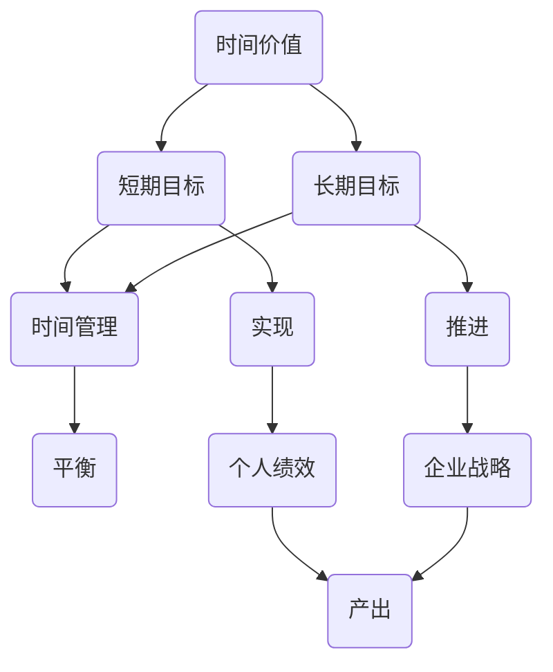

                 


### 背景介绍

在现代企业的运营中，管理者的时间规划至关重要。他们不仅需要关注日常运营和业务发展，还要考虑长期战略目标，确保企业在竞争激烈的市场中立于不败之地。然而，面对繁杂的任务和不断变化的市场环境，如何有效平衡短期与长期目标，已成为管理者面临的重大挑战。

时间管理在管理者日常工作中扮演着核心角色。通过合理规划时间，管理者可以提高工作效率，减少不必要的浪费，从而更好地实现个人和组织的目标。然而，现实情况是，许多管理者常常在忙碌的日常工作中陷入困境，难以兼顾短期与长期目标的实现。这种情况不仅影响个人职业发展，也会对企业的整体绩效产生负面影响。

本文旨在探讨管理者如何通过科学的时间规划，实现短期与长期目标的平衡。我们将从时间管理的基本原则入手，详细分析时间管理工具与方法，并借助实际案例，为管理者提供实用的指导。通过本文的阅读，读者将了解时间管理的重要概念，掌握有效的时间规划技巧，从而在工作和生活中取得更好的平衡。

### 核心概念与联系

在深入探讨时间规划之前，有必要首先明确几个核心概念，并分析它们之间的关系架构。以下是几个关键概念及其相互联系：

**1. 时间价值：**
时间价值是指个人或组织在特定时间内所能创造的价值。时间价值的观念对于管理者而言至关重要，因为时间是一种有限的资源，如何合理利用时间关系到个人和组织的绩效。时间价值不仅涉及个人工作成果的产出，还包括团队合作、客户关系维护以及职业发展等多个方面。

**2. 短期目标：**
短期目标通常是指在未来一年内可以实现的成果或任务。这些目标通常与当前项目的进展、季度绩效指标或市场机会紧密相关。短期目标对于管理者来说非常重要，因为它们是实现长期目标的基础。通过设定和达成短期目标，管理者可以逐步推进项目的进展，积累经验和资源。

**3. 长期目标：**
长期目标则是指在未来几年甚至更长时间内希望实现的战略目标。这些目标往往与企业的愿景和使命密切相关，涉及市场拓展、产品研发、组织变革等关键领域。长期目标的设定需要管理者具备前瞻性视野和战略思维，以确保企业在长期发展中保持竞争力。

**4. 时间管理：**
时间管理是指通过合理安排时间，最大化个人或组织在特定时间内的产出和价值。时间管理的核心在于优先级管理，即确定哪些任务是最重要的，哪些任务可以推迟或放弃。时间管理不仅包括个人时间管理，还包括团队时间管理，以及跨部门的时间协同。

**5. 平衡：**
平衡是指在不同目标之间寻找一种合理的分配方案，确保短期目标与长期目标的协调统一。平衡的目的是避免短期行为的过度追求导致长期目标的滞后，或者长期目标的规划过于理想化而缺乏实际执行能力。

通过Mermaid流程图，我们可以更直观地展示这些核心概念之间的联系：



这张图展示了时间价值如何驱动短期目标和长期目标的设定，时间管理在实现这些目标中的关键作用，以及平衡在确保目标协调统一中的重要性。短期目标通过实现个人绩效，推动企业战略的推进，而长期目标则通过战略规划为短期目标的实现提供方向和资源支持。

理解这些核心概念及其相互关系，是进行有效时间规划的基础。接下来，我们将详细探讨时间管理的基本原则，帮助管理者在实际工作中应用这些概念，实现短期与长期目标的平衡。

### 时间管理的基本原则

要实现短期与长期目标的平衡，管理者必须遵循一系列时间管理的基本原则。这些原则不仅适用于个人，也适用于团队和组织层面。以下是几个关键的时间管理基本原则，以及如何在实际工作中应用它们：

**1. 优先级管理：**
优先级管理是时间管理的核心原则。确定任务的优先级有助于管理者集中精力处理最重要和最紧急的任务。以下方法可以帮助管理者进行优先级管理：

   - **Eisenhower矩阵：** 使用Eisenhower矩阵，将任务分为四个象限：紧急且重要、紧急但不重要、不紧急但重要、不紧急且不重要。管理者应首先处理紧急且重要的任务，其次处理重要但不紧急的任务，然后处理紧急但不重要的任务，最后处理不紧急且不重要的任务。

   - **关键结果领域（KRAs）：** 设定关键结果领域，明确每个任务对组织整体目标的重要性。管理者应优先处理与KRAs直接相关的任务。

   - **任务分类：** 将任务分为“紧急任务”和“重要任务”。紧急任务需要立即处理，重要任务则需要在合适的时间处理。

**2. 时间块规划：**
时间块规划是一种将时间分成特定时间段，并在每个时间段内专注于特定任务的方法。这种方法有助于提高工作效率，减少任务切换带来的损耗。以下是如何进行时间块规划的建议：

   - **工作日时间块：** 将每天的时间分成多个时间块，每个时间块专注于一个任务。例如，上午处理重要会议和决策，下午处理报告撰写和数据分析。

   - **番茄工作法：** 每工作25分钟后休息5分钟，每完成四个“番茄”后休息更长时间。这种方法有助于保持精力集中，避免疲劳。

   - **时间块任务分解：** 将复杂任务分解成多个小块，并在每个时间块内专注于一个小块。这样可以确保任务按时完成，同时减少因任务复杂度过高导致的拖延。

**3. 目标设定：**
明确的目标是有效时间管理的基础。以下方法可以帮助管理者设定并实现目标：

   - **SMART目标：** 设定具体（Specific）、可衡量（Measurable）、可实现（Achievable）、相关（Relevant）和有时限（Time-bound）的目标。这种目标设定方法有助于确保目标的明确性和可执行性。

   - **目标分解：** 将长期目标分解成短期目标，并设定相应的里程碑和截止日期。这样可以帮助管理者逐步推进目标，确保长期目标的实现。

   - **优先级调整：** 根据环境变化和资源情况，适时调整目标优先级。这样可以确保目标设定与实际情况保持一致，避免因目标设定不合理导致的资源浪费。

**4. 灵活应变：**
时间管理不是一成不变的，管理者需要根据实际情况灵活调整计划。以下建议可以帮助管理者实现灵活应变：

   - **风险评估：** 在制定时间规划时，评估可能出现的风险和不确定性，并制定相应的应对策略。这样可以减少意外事件对时间规划的影响。

   - **弹性时间安排：** 在时间安排中预留一定的弹性时间，以应对突发任务和意外事件。这样可以确保时间规划的稳定性，同时保持应对灵活。

   - **持续改进：** 通过定期回顾和反思，发现时间管理中的不足之处，并不断改进时间规划方法。这样可以不断提高时间管理效率，实现短期与长期目标的平衡。

通过遵循这些基本原则，管理者可以在日常工作中更有效地管理时间，实现短期与长期目标的平衡。这不仅有助于提高个人绩效，也能推动组织整体绩效的提升。接下来，我们将探讨几种常见的时间管理工具和方法，为管理者提供更具体的时间规划策略。

### 常见的时间管理工具与方法

在时间管理过程中，选择合适的工具和方法是确保高效规划与执行的关键。以下介绍几种常见的时间管理工具和方法，包括时间管理矩阵、Eisenhower矩阵和番茄工作法，以及它们在实际工作中的应用和效果。

**1. 时间管理矩阵**

时间管理矩阵是一种将任务按照紧急程度和重要性进行分类的工具，可以帮助管理者更清晰地识别和优先处理任务。矩阵分为四个象限：

- **第一象限：紧急且重要**
  - 这些任务需要立即处理，因为它们对当前工作有直接的影响。例如，紧急会议、重要客户的沟通、突发事件等。

- **第二象限：重要但不紧急**
  - 这些任务虽然不紧急，但对长期目标和职业发展至关重要。例如，项目规划、培训学习、团队建设等。

- **第三象限：紧急但不重要**
  - 这些任务通常是由外部因素驱动的，可能只是表面上的紧急，但实际上对工作的影响有限。例如，处理不重要的邮件、电话打扰等。

- **第四象限：不紧急且不重要**
  - 这些任务可以暂时搁置或者直接放弃，因为它们对工作的影响较小。例如，阅读不重要的新闻、不必要的社交活动等。

**实际应用：**
使用时间管理矩阵，管理者可以更有效地安排时间，专注于最重要和最紧急的任务。例如，一个项目经理可以使用时间管理矩阵来规划项目任务，确保紧急且重要的任务（如项目进度汇报）优先处理，同时分配时间进行重要但不紧急的任务（如项目风险评估）。

**2. Eisenhower矩阵**

Eisenhower矩阵是另一种常用的时间管理工具，由美国总统德怀特·D·艾森豪威尔提出。它将任务分为四个类别：

- **紧急且重要**
  - 立即处理，因为这些任务对当前工作和目标有直接的影响。

- **紧急但不重要**
  - 委派给他人处理，或者快速处理以减少干扰。

- **重要但不紧急**
  - 安排在非高峰时段处理，或者提前规划以防止任务变得紧急。

- **不重要且不紧急**
  - 直接放弃或者推迟处理，以确保主要精力集中于关键任务。

**实际应用：**
Eisenhower矩阵帮助管理者明确任务的优先级，并采取适当的行动。例如，一个销售经理可以使用Eisenhower矩阵来安排日程，将重要会议和客户沟通归类为紧急且重要任务，将日常的例行任务归类为紧急但不重要任务，并将战略规划和团队建设归类为重要但不紧急任务。

**3. 番茄工作法**

番茄工作法是一种通过时间块规划提高工作效率的方法，由弗朗西斯科·西里洛提出。其基本原理是将工作时间分为25分钟的“番茄钟”和5分钟的短暂休息。

- **25分钟集中工作**：在番茄钟内专注于一个任务，不允许任何打扰。
- **5分钟休息**：每完成一个番茄钟后，休息5分钟，以恢复精力。
- **4个番茄钟后**：休息15-30分钟，以避免过度疲劳。

**实际应用：**
番茄工作法帮助管理者保持专注和高效。例如，一个软件开发工程师可以使用番茄工作法来编写代码，确保每个番茄钟内只专注于编码任务，避免频繁的上下文切换。每四个番茄钟后，工程师可以进行更长时间的休息，以恢复工作状态。

**综合应用：**
在实际工作中，管理者可以根据具体情况综合应用这些工具和方法。例如，一个项目经理可以在项目初期使用时间管理矩阵来分配任务，确定哪些任务需要紧急处理，哪些任务可以推迟。在项目执行过程中，使用Eisenhower矩阵来确保任务的优先级，确保紧急且重要的任务得到优先处理。同时，通过番茄工作法来保持团队在关键任务上的高效执行。

通过结合使用这些工具和方法，管理者可以更有效地管理时间，提高工作效率，实现短期与长期目标的平衡。这些工具和方法不仅适用于个人，也适用于团队和组织，为管理者提供了一套全面的时间管理策略。

### 核心算法原理讲解

为了深入理解时间管理的基本算法原理，我们将介绍几种关键的时间管理算法，并使用伪代码进行详细阐述。这些算法有助于管理者在具体实践中进行时间分配和任务调度，从而更有效地实现短期与长期目标。

**1. 时间管理矩阵分配算法**

时间管理矩阵分配算法是一种基于任务紧急程度和重要性进行任务分配的方法。以下是其伪代码：

```pseudo
function TimeMatrixAllocation(tasks):
    // 初始化四个象限的空列表
    emergency_important = []
    important_notemergency = []
    notemergency_important = []
    notemergency_notimportant = []

    // 遍历所有任务
    for task in tasks:
        if task.is_urgent and task.is_important:
            emergency_important.append(task)
        elif task.is_important:
            important_notemergency.append(task)
        elif task.is_urgent:
            notemergency_important.append(task)
        else:
            notemergency_notimportant.append(task)

    // 对每个象限的任务进行分配和调度
    for task_list in [emergency_important, important_notemergency, notemergency_important, notemergency_notimportant]:
        for task in task_list:
            if task.is_urgent:
                schedule_urgent_task(task)
            else:
                schedule_nonurgent_task(task)

    return

function schedule_urgent_task(task):
    // 立即调度紧急任务
    queue_urgent_tasks.push(task)
    return

function schedule_nonurgent_task(task):
    // 按优先级调度非紧急任务
    priority_queue.enqueue(task)
    return
```

**2. 优化模型调度算法**

在复杂的工作环境中，优化模型可以帮助管理者更科学地进行时间分配和任务调度。以下是一个简单的优化模型调度算法的伪代码：

```pseudo
function OptimizeTaskScheduling(tasks, constraints):
    // 初始化资源使用记录
    resource_usage = initialize_resource_usage()

    // 创建一个任务调度表
    schedule = []

    // 按任务优先级进行排序
    sorted_tasks = sort_by_priority(tasks)

    // 遍历所有任务
    for task in sorted_tasks:
        if can_allocate_task(task, resource_usage, constraints):
            // 调度任务
            schedule_task(task, schedule)
            // 更新资源使用记录
            update_resource_usage(resource_usage, task)

    return schedule

function can_allocate_task(task, resource_usage, constraints):
    // 检查任务是否可以分配
    for resource in task.required_resources:
        if resource_usage[resource] + task.resource_usage[resource] > constraints[resource]:
            return False
    return True

function schedule_task(task, schedule):
    // 将任务添加到调度表中
    schedule.append(task)
    return

function initialize_resource_usage():
    // 初始化资源使用记录
    return {"resource1": 0, "resource2": 0, ...}

function update_resource_usage(resource_usage, task):
    // 更新资源使用记录
    for resource in task.required_resources:
        resource_usage[resource] += task.resource_usage[resource]
    return
```

**3. 时间块规划算法**

时间块规划是一种将时间划分为多个块，每个块专注于一个任务的方法。以下是其伪代码：

```pseudo
function TimeBlockPlanning(available_time, tasks):
    // 初始化时间块安排表
    time_blocks = []

    // 按任务优先级和持续时间排序任务
    sorted_tasks = sort_by_priority_and_duration(tasks)

    // 遍历所有任务
    for task in sorted_tasks:
        if can_allocate_time_block(task, available_time):
            // 分配时间块
            time_block = allocate_time_block(task, available_time)
            time_blocks.append(time_block)
            // 更新剩余可用时间
            available_time -= time_block.duration

    return time_blocks

function can_allocate_time_block(task, available_time):
    // 检查是否有足够的时间块可以分配给任务
    if available_time >= task.duration:
        return True
    return False

function allocate_time_block(task, available_time):
    // 分配一个时间块
    time_block = {"task": task, "start_time": current_time(), "duration": task.duration}
    update_current_time(time_block.start_time + time_block.duration)
    return time_block
```

通过这些伪代码，我们可以看到不同算法在任务分配、优化调度和时间块规划中的应用。管理者可以根据具体情况选择和调整这些算法，以实现更科学、更高效的时间管理。

### 数学模型和数学公式

在时间管理中，数学模型和数学公式可以提供有力的量化分析工具，帮助管理者更精确地评估和规划时间资源。以下介绍几个常用的数学模型和公式，并详细讲解它们的应用和举例说明。

**1. 工作负荷分配模型**

工作负荷分配模型是一种用于确定任务分配和资源利用的数学模型。其基本公式为：

\[ \text{工作量} = \sum_{i=1}^{n} \text{任务}_i \times \text{任务难度} \times \text{资源需求} \]

其中，\( n \) 为任务数量，\( \text{任务}_i \) 为第 \( i \) 个任务，\(\text{任务难度}\) 和 \(\text{资源需求}\) 分别表示任务的复杂度和所需资源量。

**应用示例：**

假设有四个任务需要完成，分别需要不同的资源和时间。我们可以计算总的工作负荷：

\[ \text{工作量} = (1 \times 3) + (2 \times 2) + (3 \times 4) + (4 \times 1) = 3 + 4 + 12 + 4 = 23 \]

管理者可以根据工作负荷的总量和各任务的优先级，合理分配资源，确保关键任务得到优先处理。

**2. 时间优化模型**

时间优化模型用于确定如何最优地分配时间以最大化产出。其基本公式为：

\[ \text{最优时间分配} = \frac{\text{总时间}}{\text{任务数量} \times \text{任务难度}} \]

其中，\(\text{总时间}\) 为可用的总时间，\(\text{任务数量}\) 和 \(\text{任务难度}\) 分别为任务的数量和难度。

**应用示例：**

假设有6个任务需要在8小时内完成，我们可以计算最优的时间分配：

\[ \text{最优时间分配} = \frac{8}{6 \times 2} = \frac{8}{12} \approx 0.67 \text{小时/任务} \]

这意味着每个任务大约需要0.67小时来完成，管理者可以根据这个结果调整任务优先级和时间分配。

**3. 时间价值评估模型**

时间价值评估模型用于计算时间的经济价值。其基本公式为：

\[ \text{时间价值} = \text{产出} \times \text{时间单价} \]

其中，\(\text{产出}\) 表示时间所带来的经济收益，\(\text{时间单价}\) 表示单位时间产生的价值。

**应用示例：**

假设一个项目经理通过有效的时间管理，提高了项目的效率，使得项目提前完成并创造了10万元的额外收入，假设时间单价为1万元/月，则可以计算该项目的时间价值：

\[ \text{时间价值} = 10 \times 1 = 10 \text{万元} \]

这个计算结果帮助管理者了解时间管理的经济价值，从而更重视时间管理的重要性。

通过这些数学模型和公式，管理者可以更精确地评估和管理时间资源，确保时间分配的科学性和效率。这些工具不仅提供了量化的分析依据，也为实际操作提供了明确的指导。

### 项目实战

为了更好地理解时间管理策略的实施过程，我们将通过一个实际案例进行详细讲解。本案例将涉及一个企业项目经理如何通过科学的时间管理实现项目目标的实现。

**项目背景：**

某企业项目经理李明负责一个新产品的开发项目，该项目需要在6个月内完成。项目团队由5名开发人员、1名测试人员和1名项目经理组成。项目的核心目标是在既定时间内高质量地完成产品开发，并确保产品按时发布。

**项目需求：**

1. 确保产品功能完善，用户体验优秀。
2. 遵循敏捷开发流程，实现持续集成和迭代。
3. 在项目初期进行详尽的需求分析，确保项目目标明确。
4. 项目过程中保持良好的沟通和协作，确保团队高效工作。

**时间管理策略：**

**1. 需求分析阶段：**
- 使用时间管理矩阵，将需求分析任务分为紧急且重要、重要但不紧急等类别。
- 将需求分析任务委派给有经验的产品经理和业务分析师，确保任务得到有效执行。
- 设定需求分析的截止日期，并监督任务进展，确保按期完成。

**2. 开发阶段：**
- 使用Eisenhower矩阵，将开发任务按照紧急程度和重要性进行分类。
- 将关键功能模块的开发任务分配给经验丰富的开发人员，确保任务高效完成。
- 采用时间块规划方法，将每天的工作时间分为多个时间块，每个时间块专注于一个任务，以减少任务切换的损耗。

**3. 测试阶段：**
- 同样使用时间管理矩阵，将测试任务分为紧急且重要、重要但不紧急等类别。
- 测试任务由测试人员负责，并设定明确的测试计划和时间表。
- 定期进行测试进度汇报，及时调整测试策略，确保测试覆盖全面。

**4. 项目总结与回顾：**
- 项目完成后，进行项目总结和回顾，分析时间管理策略的有效性。
- 收集团队成员的反馈，了解改进空间。
- 将总结和反馈应用于下一个项目，不断提高项目管理水平。

**开发环境搭建：**

为了确保项目的顺利进行，项目经理李明首先搭建了以下开发环境：

1. 选择合适的开发工具和平台，如Git、Jenkins、Docker等。
2. 配置持续集成和持续部署（CI/CD）流水线，实现自动化构建和部署。
3. 设立代码审查流程，确保代码质量和一致性。
4. 安装并配置项目管理工具，如JIRA、Trello等，以便于团队协作和任务跟踪。

**源代码详细实现和代码解读：**

项目开发过程中，李明遵循以下原则进行源代码实现：

1. 编码规范：遵循统一的编码规范，确保代码的可读性和可维护性。
2. 模块化设计：将功能模块化，便于维护和扩展。
3. 重构代码：定期进行代码重构，提高代码质量。

例如，在实现产品核心功能时，李明采用了以下伪代码：

```java
// 用户登录功能
public boolean login(String username, String password) {
    if (isUserActive(username) && validatePassword(username, password)) {
        return true;
    }
    return false;
}

// 验证密码
private boolean validatePassword(String username, String password) {
    String encryptedPassword = encrypt(password);
    return encryptedPassword.equals(getStoredPassword(username));
}
```

**代码应用解读与分析：**

通过上述代码示例，可以看到：

- 登录功能通过用户名和密码验证用户的合法性。
- 验证密码时，使用加密算法对输入的密码进行加密，并与数据库中存储的密码进行比对。
- 这样的实现方式提高了系统的安全性和可靠性。

在实际项目中，项目经理李明还通过以下方法进行代码应用解读与分析：

1. 代码评审：团队成员进行代码审查，确保代码质量和功能实现无误。
2. 单元测试：编写单元测试，验证每个功能模块的正确性。
3. 性能测试：进行性能测试，确保系统在高并发环境下稳定运行。

**实际案例分析和详细讲解剖析：**

在项目过程中，李明遇到了一些时间管理上的挑战，例如任务进度延误和资源不足。他采取了以下措施进行应对：

1. **任务进度延误：** 通过Eisenhower矩阵重新评估任务优先级，调整任务分配，确保关键任务优先完成。
2. **资源不足：** 通过与团队成员沟通，重新分配任务，确保每个成员的工作负荷合理。

**项目小结：**

通过科学的时间管理策略和有效的项目执行，李明成功完成了产品开发项目。以下为项目小结：

1. **时间管理：** 使用时间管理矩阵、Eisenhower矩阵和时间块规划等方法，确保任务优先级明确，资源分配合理。
2. **团队协作：** 通过持续集成、代码审查和团队协作工具，提高团队工作效率。
3. **风险管理：** 通过定期项目回顾和风险分析，及时应对项目中的挑战，确保项目顺利进行。

通过这个实际案例，我们可以看到时间管理策略在项目中的关键作用。项目经理通过科学的时间规划和管理，不仅提高了项目效率，也确保了项目目标的实现。

### 最佳实践 Tips

在时间管理实践中，管理者可以遵循一些最佳实践，以提升效率并实现短期与长期目标的平衡。以下是一些具体的建议：

**1. 设定明确的目标：**
- 使用SMART原则（具体、可衡量、可实现、相关、有时限）设定目标，确保目标的明确性和可执行性。
- 将长期目标分解为短期目标，为每个短期目标设定明确的里程碑和截止日期。

**2. 优先级管理：**
- 使用Eisenhower矩阵或时间管理矩阵等方法，明确任务的紧急程度和重要性，确保优先处理重要且紧急的任务。
- 定期回顾和调整任务优先级，确保与当前工作重点和战略目标保持一致。

**3. 时间块规划：**
- 将工作时间划分为多个时间块，每个时间块专注于一个任务，减少任务切换的损耗。
- 使用番茄工作法等时间管理技巧，提高专注力和工作效率。

**4. 沟通与协作：**
- 保持与团队成员和上级的定期沟通，确保任务分配和进度透明。
- 利用项目管理工具，如JIRA或Trello，进行任务跟踪和协作。

**5. 风险管理：**
- 定期进行项目风险评估，识别潜在问题和挑战。
- 制定应急预案，确保在遇到意外情况时能够迅速应对。

**6. 自我反思与调整：**
- 定期进行时间管理反思，评估时间管理策略的有效性。
- 根据实际情况调整时间管理方法，持续改进。

通过遵循这些最佳实践，管理者可以有效提升时间管理能力，实现短期与长期目标的平衡，从而提高个人和组织的绩效。

### 小结与注意事项

本文通过详细的探讨和案例分析，深入阐述了管理者如何通过科学的时间规划，实现短期与长期目标的平衡。以下为文章的核心观点和结论：

1. **时间管理的重要性：** 时间管理是管理者工作中的核心任务，通过合理规划时间，可以提高工作效率，确保个人与组织的绩效。

2. **核心概念与联系：** 时间价值、短期目标、长期目标、时间管理、平衡是时间规划中的关键概念，它们之间存在着紧密的相互联系，共同构成了一套完整的时间管理体系。

3. **时间管理的基本原则：** 优先级管理、时间块规划、目标设定、灵活应变是时间管理的基本原则，管理者应遵循这些原则，以提高时间管理的效率和效果。

4. **常见的时间管理工具与方法：** 时间管理矩阵、Eisenhower矩阵、番茄工作法等工具，提供了具体的方法和技巧，帮助管理者更有效地进行时间管理。

5. **核心算法原理讲解：** 通过工作负荷分配模型、优化模型和时间块规划算法，管理者可以更科学地进行任务分配和资源调度。

6. **数学模型和公式：** 数学模型和数学公式为时间管理提供了量化的分析工具，有助于管理者更精确地评估和规划时间资源。

7. **项目实战：** 实际案例展示了如何将时间管理策略应用于项目管理，确保项目目标的实现。

8. **最佳实践 Tips：** 通过遵循最佳实践，管理者可以不断提升时间管理能力，实现短期与长期目标的平衡。

在时间管理实践中，管理者需要关注以下几点注意事项：

1. **目标明确性：** 确保目标设定具体、可衡量、可实现、相关、有时限，避免目标模糊导致时间浪费。

2. **优先级调整：** 定期回顾任务优先级，确保与当前工作重点和战略目标保持一致。

3. **灵活应变：** 面对意外情况，及时调整时间管理策略，保持计划的灵活性和适应性。

4. **沟通与协作：** 保持与团队成员和上级的沟通，确保任务分配和进度透明，提高团队协作效率。

5. **自我反思与调整：** 定期进行时间管理反思，根据实际情况调整策略，持续改进。

通过本文的阅读，读者应对时间管理有更深入的理解，掌握科学的时间规划方法，从而在工作和生活中实现更好的平衡。

### 拓展阅读

为了进一步深入了解时间管理和项目管理，以下是几本推荐阅读的书籍：

1. **《高效能人士的七个习惯》（Stephen R. Covey）**
   - 这本书详细阐述了如何通过七个习惯实现个人和职业成长，其中包括时间管理和目标设定等内容。

2. **《时间管理：让你事半功倍的方法》（Alan Lakein）**
   - 本书提供了许多实用的时间管理技巧，帮助读者在日常生活中更高效地安排时间。

3. **《项目管理指南》（PMI）**
   - 作为项目管理领域的重要指南，本书涵盖了项目管理的各个方面，包括时间规划、资源管理、风险控制等。

4. **《敏捷项目管理：实践指南》（Jeff Sutherland & David J. Anderson）**
   - 本书介绍了敏捷项目管理的方法和最佳实践，适用于需要快速响应变化的项目环境。

5. **《禅与计算机程序设计艺术》（Donald E. Knuth）**
   - 本书不仅是一本计算机编程经典，还包含了关于时间管理和注意力集中的深刻见解。

通过阅读这些书籍，读者可以进一步拓展时间管理和项目管理方面的知识，提升个人和组织的效率。

