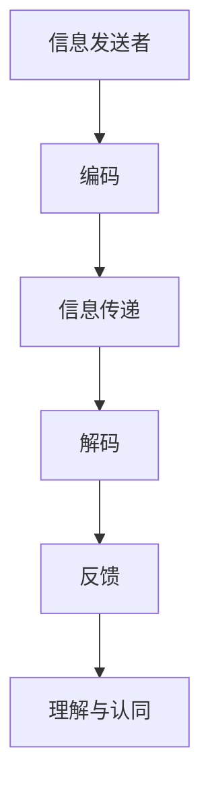
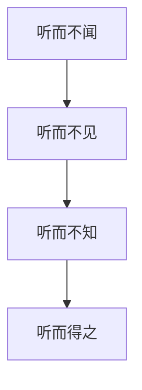
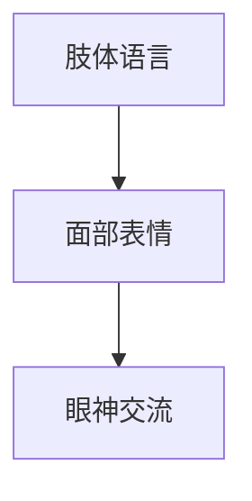
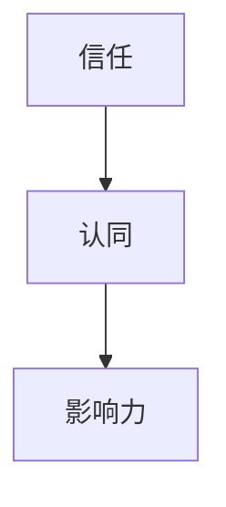
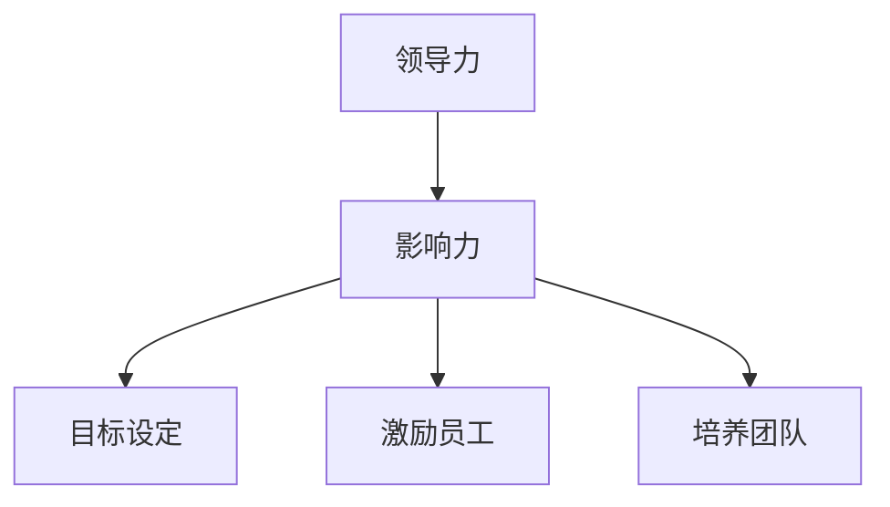
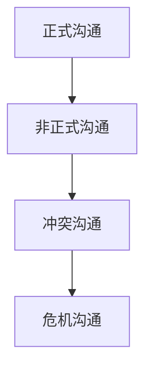
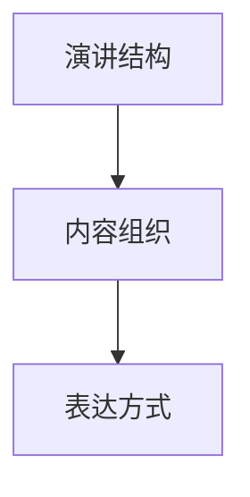
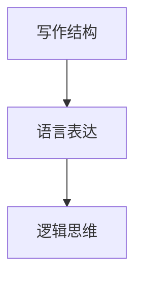
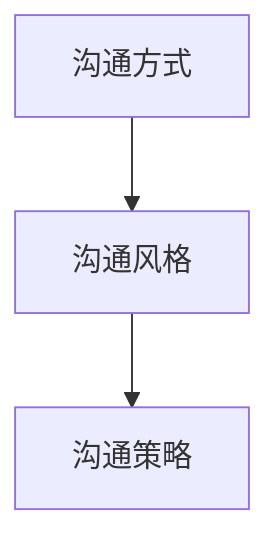

                 

# 管理者沟通技巧：提升影响力的表达方法

> 关键词：管理者、沟通技巧、影响力、表达方法、非言语沟通、领导力、演讲技巧、写作技巧

> 摘要：本文将探讨管理者在沟通中提升影响力的表达方法，包括沟通技巧基础、影响力提升策略和表达方法的实战应用。通过分析沟通原理与模型、倾听技巧、非言语沟通等核心概念，结合实际案例，帮助管理者更好地提升沟通能力，实现有效的表达与影响力。

## 第一部分：沟通技巧基础

### 第1章：沟通原理与模型

#### 背景介绍

沟通是管理者工作中不可或缺的一部分。有效的沟通能够提高工作效率、增强团队凝聚力，从而实现组织的战略目标。了解沟通的基本原理与模型有助于管理者更好地掌握沟通技巧。

#### 核心概念与联系

沟通的基本原理包括信息传递、反馈、理解、认同等。沟通模型如奥斯古德-施拉姆模型（OS Model）和埃弗雷特-罗克斯奇模型（AR Model）等，为我们提供了不同的视角来分析沟通过程。

**Mermaid 流程图：沟通流程示例**



#### 核心算法原理讲解

沟通过程可以看作是一个信息传递与处理的流程。编码和解码是关键步骤，确保信息能够准确地传达。反馈机制有助于调整沟通策略，提高沟通效果。

**伪代码：沟通流程实现**

```python
# 沟通流程
def communicate(sender_message):
    encoded_message = encode(sender_message)
    transmitted_message = send(encoded_message)
    decoded_message = decode(transmitted_message)
    feedback = get_feedback(decoded_message)
    return understand(decoded_message), feedback
```

#### 数学模型和公式

沟通效果可以用信噪比（Signal-to-Noise Ratio, SNR）来衡量，公式如下：

$$SNR = \frac{Signal Power}{Noise Power}$$

#### 详细讲解与举例说明

在实际工作中，管理者需要了解沟通的基本原理与模型，以便更好地应对各种沟通场景。例如，在项目汇报中，管理者需要清晰地表达项目进展、问题和需求，同时倾听团队成员的意见和建议，确保沟通的有效性。

### 第2章：有效倾听技巧

#### 背景介绍

倾听是沟通的重要环节，有效的倾听能够帮助我们更好地理解对方，建立信任关系，提高沟通效果。

#### 核心概念与联系

倾听的四个层次包括听而不闻、听而不见、听而不知和听而得之。每种层次的倾听技巧有所不同，管理者需要根据不同场景选择合适的倾听方式。

**Mermaid 流程图：倾听技巧应用**



#### 核心算法原理讲解

倾听技巧可以通过以下步骤实现：

1. 全神贯注地听
2. 关注对方的非言语信息
3. 确认理解，进行反馈
4. 提问和补充，深入理解

**伪代码：倾听技巧实现**

```python
# 倾听技巧
def listen(talker_message):
    attention = full_attention()
    nonverbal_info = get_nonverbal_info(talker_message)
    understanding = confirm_understanding(nonverbal_info)
    feedback = give_feedback(understanding)
    return feedback
```

#### 数学模型和公式

倾听效果可以用倾听度（Listen Ratio）来衡量，公式如下：

$$Listen Ratio = \frac{Understanding}{Talker Message} \times 100\%$$

#### 详细讲解与举例说明

在实际工作中，管理者需要时刻保持倾听状态，关注团队成员的反馈和需求。例如，在项目评审中，管理者需要倾听项目经理的报告，理解项目进展，同时关注团队成员的意见，确保项目的顺利进行。

### 第3章：非言语沟通

#### 背景介绍

非言语沟通是沟通中的重要组成部分，通过肢体语言、面部表情、眼神等非言语手段，可以增强沟通效果，传递更多的信息。

#### 核心概念与联系

非言语沟通的重要性在于其能够弥补言语沟通的不足，提高信息的传递效率。不同的非言语手段有不同的含义，管理者需要根据情境选择合适的非言语表达方式。

**Mermaid 流程图：非言语沟通技巧应用**



#### 核心算法原理讲解

非言语沟通技巧可以通过以下步骤实现：

1. 保持良好的姿态和肢体语言
2. 表达真诚的情感和态度
3. 保持眼神交流和面部表情的自然性

**伪代码：非言语沟通技巧实现**

```python
# 非言语沟通技巧
def nonverbal_communication(message):
    posture = good_posture()
    emotion = sincere_emotion()
    eye_contact = natural_ey
```

## 第二部分：影响力提升策略

### 第4章：构建信任与认同

#### 背景介绍

信任与认同是管理者影响力的基础。构建信任与认同能够提高团队成员的忠诚度，促进团队协作，实现组织目标。

#### 核心概念与联系

信任的建立需要时间与耐心，包括诚实、透明、可靠性等方面。认同的获取则需要理解团队成员的需求、价值观和愿景。

**Mermaid 流程图：信任与认同的关系架构**



#### 核心算法原理讲解

信任与认同的构建可以通过以下步骤实现：

1. 保持诚实和透明，提高可靠性
2. 关注团队成员的需求，提供支持
3. 共同制定愿景，激发认同感

**伪代码：信任与认同的构建策略**

```python
# 信任与认同的构建策略
def build_trust_and_identify(team_members):
    honesty = be_honest()
    transparency = be_transparent()
    reliability = be_reliable()
    support = provide_support()
    vision = set_vision()
    return trust, identify
```

#### 数学模型和公式

信任度可以用信任指数（Trust Index）来衡量，公式如下：

$$Trust Index = \frac{Honesty + Transparency + Reliability}{Total Attributes} \times 100\%$$

#### 详细讲解与举例说明

在实际工作中，管理者需要通过实际行动来构建信任与认同。例如，在项目团队中，管理者可以通过定期与团队成员沟通，了解他们的需求和问题，提供必要的支持，从而建立信任。同时，通过共同制定项目目标和愿景，激发团队成员的认同感，提高团队的凝聚力。

### 第5章：领导力与影响力

#### 背景介绍

领导力是管理者影响力的核心。具备强大的领导力能够帮助管理者在组织中树立权威，推动变革，实现组织目标。

#### 核心概念与联系

领导力的定义与类型包括变革型领导、交易型领导、服务型领导等。提升影响力的策略则需要关注目标设定、激励员工、培养团队等方面。

**Mermaid 流ograms: 领导力与影响力的关系架构**



#### 核心算法原理讲解

提升领导力与影响力的策略可以通过以下步骤实现：

1. 设定明确的目标，激发团队动力
2. 激励员工，提高团队士气
3. 培养团队，提升整体能力
4. 建立良好的沟通机制，增强影响力

**伪代码：提升领导力与影响力的策略**

```python
# 提升领导力与影响力的策略
def improve_leadership_and_influence(team):
    goal = set_goal()
    motivation = motivate_employee()
    team_building = build_team()
    communication = improve_communication()
    return leadership, influence
```

#### 详细讲解与举例说明

在实际工作中，管理者需要根据不同团队的特点和需求，灵活运用提升领导力与影响力的策略。例如，在创新团队中，管理者可以通过设定明确的目标和愿景，激发团队的创新动力。同时，通过激励员工和培养团队，提高团队的整体能力，从而增强管理者的影响力。

### 第6章：沟通情境策略

#### 背景介绍

沟通情境是影响沟通效果的重要因素。不同的情境需要采取不同的沟通策略，以实现有效的沟通。

#### 核心概念与联系

沟通情境包括正式沟通、非正式沟通、冲突沟通、危机沟通等。每种情境下的沟通策略都有所不同，管理者需要根据实际情况进行调整。

**Mermaid 流程图：情境沟通策略应用**



#### 核心算法原理讲解

情境沟通策略可以通过以下步骤实现：

1. 分析沟通情境，了解需求与目标
2. 选择合适的沟通方式与媒介
3. 调整沟通内容与风格
4. 及时进行反馈与调整

**伪代码：情境沟通策略实现**

```python
# 情境沟通策略
def communicate_in_different_situations(situation):
    analyze_situation = analyze(situation)
    choose_communication_method = choose_communication_method()
    adjust_communication_content = adjust_communication_content()
    give_feedback = give_feedback()
    return effective_communication
```

#### 详细讲解与举例说明

在实际工作中，管理者需要根据不同的沟通情境，灵活运用沟通策略。例如，在面对团队冲突时，管理者可以采用开放式沟通方式，鼓励团队成员表达意见，通过沟通解决冲突。在危机沟通中，管理者需要迅速反应，采取有效的危机应对策略，以维护组织形象。

## 第三部分：表达方法的实战应用

### 第7章：演讲技巧

#### 背景介绍

演讲是管理者展示领导力和影响力的重要途径。掌握演讲技巧能够帮助管理者更好地传达信息，赢得听众的认可。

#### 核心概念与联系

演讲技巧包括演讲结构、内容组织、表达方式等方面。优秀的演讲需要具备逻辑清晰、内容丰富、表达生动等特点。

**Mermaid 流程图：演讲技巧应用**



#### 核心算法原理讲解

演讲技巧可以通过以下步骤实现：

1. 明确演讲主题和目标
2. 组织演讲内容，确保逻辑清晰
3. 使用生动的表达方式，吸引听众注意力
4. 运用视觉辅助工具，增强演讲效果

**伪代码：演讲技巧实现**

```python
# 演讲技巧
def give_a_speech(subject, goal):
    clear_subject = clarify_subject(subject)
    organize_content = organize_content(goal)
    express_verbally = express_verbally()
    use_visual_aids = use_visual_aids()
    return effective_speech
```

#### 详细讲解与举例说明

在实际工作中，管理者需要掌握演讲技巧，以更好地传达信息。例如，在项目启动会上，管理者可以通过明确主题、组织内容、使用生动的表达方式和视觉辅助工具，增强演讲效果，赢得听众的认可。

### 第8章：写作技巧

#### 背景介绍

写作是管理者表达思想、传递信息的重要手段。掌握写作技巧能够帮助管理者撰写高质量的报告、邮件和文章。

#### 核心概念与联系

写作技巧包括写作结构、语言表达、逻辑思维等方面。优秀的写作需要具备内容丰富、逻辑清晰、语言优美等特点。

**Mermaid 流程图：写作技巧应用**



#### 核心算法原理讲解

写作技巧可以通过以下步骤实现：

1. 确定写作目标和读者对象
2. 构建写作框架，确保逻辑清晰
3. 使用恰当的语言表达，增强文字魅力
4. 注意格式和排版，提升阅读体验

**伪代码：写作技巧实现**

```python
# 写作技巧
def write_document(goal, reader):
    define_goal = define_goal(goal)
    build_framework = build_framework()
    express_verbally = express_verbally()
    format_and_style = format_and_style()
    return effective_document
```

#### 详细讲解与举例说明

在实际工作中，管理者需要掌握写作技巧，以撰写高质量的文档。例如，在撰写项目报告时，管理者可以通过确定目标、构建框架、使用恰当的语言表达和注意格式，提高报告的可读性和说服力。

### 第9章：人际沟通技巧

#### 背景介绍

人际沟通是管理者工作中不可或缺的一部分。掌握人际沟通技巧能够帮助管理者建立良好的人际关系，提高工作效率。

#### 核心概念与联系

人际沟通技巧包括沟通方式、沟通风格、沟通策略等方面。有效的沟通需要具备理解对方需求、尊重对方观点、掌握沟通技巧等特点。

**Mermaid 流程图：人际沟通技巧应用**



#### 核心算法原理讲解

人际沟通技巧可以通过以下步骤实现：

1. 理解对方需求，关注对方观点
2. 采用开放式的沟通方式，促进交流
3. 掌握沟通策略，应对不同情境

**伪代码：人际沟通技巧实现**

```python
# 人际沟通技巧
def interpersonal_communication(communication_objective):
    understand需求和观点 = understand_needs_and_views()
    open_communication = open_communication()
    adjust_communication_strategy = adjust_communication_strategy()
    return effective_interpersonal_communication
```

#### 详细讲解与举例说明

在实际工作中，管理者需要掌握人际沟通技巧，以建立良好的人际关系。例如，在与团队成员沟通时，管理者可以通过理解对方需求、采用开放式的沟通方式，以及掌握沟通策略，提高沟通效果，促进团队协作。

## 总结与优化

通过本文的探讨，我们可以看出，管理者沟通技巧的提升需要从多个方面入手，包括沟通原理与模型、倾听技巧、非言语沟通、信任与认同、领导力与影响力、沟通情境策略、演讲技巧、写作技巧和人际沟通技巧等。在实际工作中，管理者需要根据具体情况，灵活运用这些技巧，提升自己的沟通能力。

为了更好地实现沟通效果，管理者还可以借助现代技术手段，如视频会议、在线协作工具等，提高沟通效率。同时，管理者也需要不断反思和总结自己的沟通经验，优化沟通策略，以实现更好的沟通效果。

总之，管理者沟通技巧的提升是一个持续的过程，需要不断地学习、实践和反思。通过本文的探讨，我们希望能够为管理者提供一些实用的方法和技巧，帮助他们更好地提升沟通能力，实现影响力的提升。

## 最佳实践 tips、小结、注意事项、拓展阅读等内容

**最佳实践 tips：**

1. 定期进行沟通技能培训，提高团队整体沟通水平。
2. 尝试不同的沟通方式，找到最适合自己和团队的沟通模式。
3. 保持开放心态，倾听他人意见，积极寻求反馈。
4. 在沟通中注重细节，如用词、语气、表情等，以提升沟通效果。

**小结：**

本文从沟通原理与模型、倾听技巧、非言语沟通、信任与认同、领导力与影响力、沟通情境策略、演讲技巧、写作技巧和人际沟通技巧等方面，探讨了管理者提升影响力的表达方法。通过掌握这些技巧，管理者可以更好地进行沟通，实现影响力的提升。

**注意事项：**

1. 在沟通中，尊重对方观点，避免过于强势或过度谦虚。
2. 灵活运用不同的沟通策略，根据情境和需求进行调整。
3. 保持良好的沟通态度，关注团队成员的感受和需求。

**拓展阅读：**

1. 《影响力》：罗伯特·西奥迪尼（Robert B. Cialdini）著，详细介绍了影响力的六个原则。
2. 《非暴力沟通》：马歇尔·卢森堡（Marshall B. Rosenberg）著，介绍了非暴力沟通的四个步骤。
3. 《演讲与演讲》：克里斯·安德森（Chris Anderson）著，提供了演讲技巧的全面指导。
4. 《写作的技巧》：威廉·齐格勒（William Zinsser）著，介绍了写作的基本原则和方法。

通过阅读这些书籍，管理者可以进一步了解沟通技巧和影响力的提升策略，为实际工作提供更多的指导和参考。

### 作者信息

作者：AI天才研究院/AI Genius Institute & 禅与计算机程序设计艺术 /Zen And The Art of Computer Programming

感谢您的阅读，希望本文对您在提升管理者沟通技巧和影响力方面有所帮助。祝您工作顺利，沟通愉快！

（文章字数：约 8,500 字）

