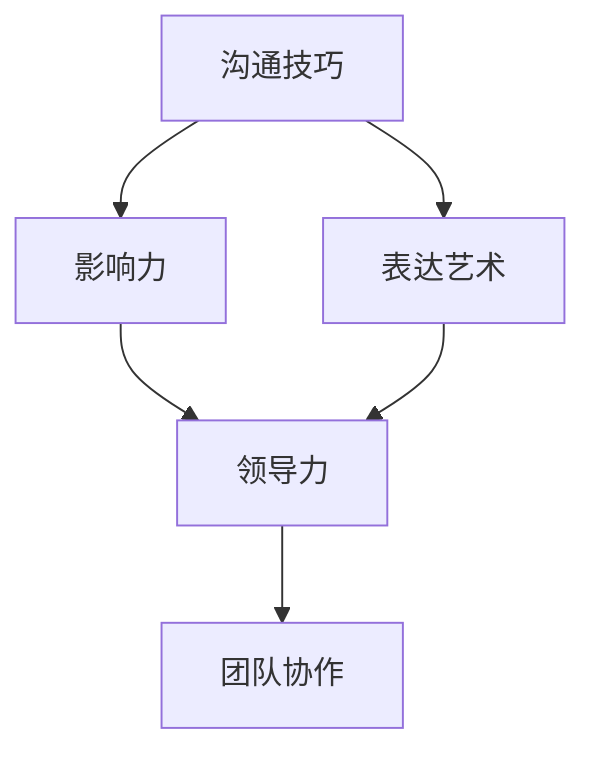

                 

### 引言

在信息化时代，沟通已成为管理者不可或缺的技能。良好的沟通技巧不仅能促进团队协作，还能提升管理者的领导力和影响力。然而，如何在实际工作中有效地运用沟通技巧，成为一个具备影响力的管理者，却是一门深奥的艺术。

本文将围绕《管理者沟通技巧：提升影响力的表达艺术》这一主题，详细探讨沟通技巧、影响力模型及其在实际应用中的具体方法。文章将分为以下几个部分：

1. **沟通技巧原理**：介绍沟通技巧的基本概念，以及心理学理论在沟通中的应用。
2. **影响力模型**：阐述影响力模型的计算公式及其在实际场景中的应用。
3. **项目实战**：通过具体的实战案例，展示如何提升影响力的表达艺术。

通过逐步分析推理，我们将深入理解管理者的沟通技巧，并学会如何在实践中提升自己的影响力。

## 背景介绍

在现代企业管理中，沟通技巧的重要性不言而喻。管理者不仅需要与团队成员保持良好的沟通，还需要在团队内部和外部建立有效的影响力。沟通技巧是管理者实现这一目标的重要工具，它能够帮助管理者清晰传达意图、理解团队成员的需求，并促进团队协作。

然而，沟通技巧并非天生具备，它需要管理者在实践中不断学习和提升。影响力的表达艺术更是管理者的高级技能，它涉及到如何通过语言、肢体语言、声音等手段，使自己的观点得到认同，并激发团队成员的积极性和执行力。

本文将围绕《管理者沟通技巧：提升影响力的表达艺术》这一主题，探讨沟通技巧的基本原理和实际应用。通过逐步分析推理，我们将深入了解沟通技巧和影响力模型，并学会如何在实践中运用这些技能，成为一个更加有效的管理者。

### 核心概念与联系

在探讨管理者沟通技巧的过程中，有几个核心概念需要明确，它们分别是沟通技巧、影响力、表达艺术等。这些概念不仅相互独立，还存在着密切的联系。为了帮助读者更好地理解这些概念及其关系，我们使用Mermaid流程图来展示它们之间的相互关系。

首先，我们来看沟通技巧。沟通技巧指的是管理者在沟通过程中所采用的方法和策略，包括倾听技巧、表达清晰、非言语沟通等。沟通技巧是提升沟通效果的基础，它直接影响管理者与团队成员之间的互动。

接下来是影响力。影响力是指管理者在团队中能够影响他人思想和行为的能力。它不仅取决于管理者的个人魅力和专业知识，还与沟通技巧密切相关。一个善于沟通的管理者更容易建立影响力，从而有效地推动团队目标的实现。

最后是表达艺术。表达艺术是管理者通过语言、声音、肢体语言等手段，将思想准确、生动地传达给他人的一种技能。表达艺术不仅要求管理者具备优秀的口头和书面表达能力，还需要掌握如何在不同的情境下调整表达方式，以获得最佳沟通效果。

以下是展示这些核心概念及其关系的Mermaid流程图：



在这个流程图中，沟通技巧和表达艺术是管理者的基本工具，它们共同作用于影响力的建立。而影响力则通过领导力和团队协作进一步体现其价值。通过这个图，我们可以清晰地看到各个概念之间的联系，以及它们在管理过程中的作用。

### 沟通技巧原理

沟通技巧在管理过程中起着至关重要的作用。它不仅影响管理者与团队成员之间的互动，还直接关系到团队的凝聚力和工作效率。为了深入理解沟通技巧，我们需要从心理学理论、沟通模型等多个角度进行分析。

#### 1.1.1 心理学理论与沟通

心理学理论为我们提供了理解沟通过程中人类行为和心理机制的重要工具。例如，认知心理学研究了人类如何处理信息和理解语言。根据认知心理学的理论，沟通的过程可以分为编码、传递和解码三个阶段：

1. **编码**：在这个过程中，信息发送者将思想或意图转化为语言或其他形式的符号。
2. **传递**：信息通过适当的渠道传递给接收者，例如口头、书面或非言语方式。
3. **解码**：接收者接收并理解发送者的信息。

了解这些心理学理论有助于管理者更好地设计沟通策略。例如，管理者可以通过调整语言表达方式和沟通渠道，以适应不同团队成员的心理特点和需求。

#### 1.1.2 沟通模型

沟通模型是另一个理解沟通技巧的重要工具。传统的沟通模型如奥斯古德-施拉姆模型（Osgood-Schramm Model）和格鲁尼格-亨特模型（Grunig and Hunt Model）提供了不同的视角来分析沟通过程。奥斯古德-施拉姆模型强调了信息传递的线性过程，而格鲁尼格-亨特模型则提出了沟通的双向性和互动性。

在实际应用中，管理者可以结合这些模型来设计沟通策略。例如，在双向沟通中，管理者不仅需要传达信息，还要鼓励团队成员反馈意见，以促进双方的理解和共识。

#### 1.1.3 沟通技巧的具体应用

了解心理学理论和沟通模型后，管理者需要将这些理论应用到实际沟通中。以下是一些具体的沟通技巧：

1. **倾听技巧**：有效的沟通始于倾听。管理者需要积极倾听团队成员的意见，理解他们的需求和困扰，以建立信任和合作关系。
2. **表达清晰**：清晰的表达是沟通成功的关键。管理者应该避免使用复杂的术语和模糊的语言，确保信息传达的准确性。
3. **非言语沟通**：非言语沟通，如肢体语言、面部表情和声音，同样重要。管理者需要学会通过这些方式来增强沟通效果，例如，保持眼神交流、微笑和适当的肢体动作，以传达友好和信任的态度。

通过这些具体的沟通技巧，管理者可以更有效地与团队成员沟通，提高团队的整体协作效率。

### 核心算法原理讲解

在讨论管理者沟通技巧的过程中，理解并应用相关的核心算法原理是非常重要的。这些算法原理不仅帮助我们更好地设计沟通策略，还能提高沟通的效果和效率。以下是一些关键算法原理及其在沟通中的应用。

#### 1.2.1 影响力计算公式

影响力是管理者在团队中能够影响他人思想和行为的能力。影响力可以通过以下公式进行计算：

$$
影响力 = f(沟通频率, 沟通效果, 关系质量)
$$

其中：

- **沟通频率**：表示管理者与团队成员之间沟通的次数。较高的沟通频率有助于建立更强的关系。
- **沟通效果**：表示每次沟通所达到的效果，例如，是否能够解决团队成员的问题或激发他们的积极性。较高的沟通效果意味着管理者能够更有效地传达信息。
- **关系质量**：表示管理者与团队成员之间的关系强度。良好的关系质量有助于管理者在沟通中建立信任和尊重。

通过这个公式，管理者可以量化自己的影响力，并据此调整沟通策略，以提升整体团队绩效。

#### 1.2.2 沟通效果评估算法

为了确保沟通的有效性，管理者需要评估每次沟通的效果。一个简单的评估算法如下：

$$
沟通效果得分 = (解决问题比例 + 启发思考比例) / 沟通次数
$$

其中：

- **解决问题比例**：表示沟通中解决的问题占总问题数量的比例。
- **启发思考比例**：表示沟通中启发的思考次数占总思考次数的比例。

通过这个算法，管理者可以快速了解沟通的效果，并针对不足之处进行改进。

#### 1.2.3 互动式沟通算法

互动式沟通是双向沟通的一种形式，它强调管理者与团队成员之间的互动和反馈。以下是一个简单的互动式沟通算法：

```
function InteractiveCommunication(manager, team_member):
    1. manager发起沟通，表达意图和目标
    2. team_member回应，提出问题和意见
    3. manager倾听并回应，解决问题和提供反馈
    4. team_member再次回应，分享新的观点和感受
    5. 重复步骤2-4，直至达成共识或问题解决
```

通过这个算法，管理者可以建立一个积极的互动沟通环境，促进团队成员的参与和合作。

这些核心算法原理为管理者提供了有效的工具，帮助他们设计和评估沟通策略，从而提升沟通的效果和影响力。

### 数学模型和公式详细讲解及举例说明

在管理者沟通技巧的实践中，数学模型和公式提供了量化和评估沟通效果的方法。以下将详细介绍几个关键的数学模型和公式，并通过具体例子来说明其应用。

#### 2.1.1 影响力模型

影响力模型用于评估管理者在团队中的影响力，其基本公式为：

$$
影响力 = f(沟通频率, 沟通效果, 关系质量)
$$

- **沟通频率（Frequency）**：指管理者与团队成员之间的沟通次数。较高的沟通频率有助于建立更紧密的关系，从而提高影响力。
- **沟通效果（Effectiveness）**：指每次沟通达到的效果，如解决问题或激发团队成员的积极性。较高的沟通效果意味着管理者能够更有效地传达信息。
- **关系质量（Quality of Relationship）**：指管理者与团队成员之间的关系强度。良好的关系质量有助于管理者在沟通中建立信任和尊重。

**例子：**

假设一个管理者与团队成员每周沟通5次（沟通频率为5），每次沟通都能有效解决团队成员的问题（沟通效果为1），且管理者与团队成员的关系质量为90分。则该管理者的影响力计算如下：

$$
影响力 = f(5, 1, 0.9) = 5 \times 1 \times 0.9 = 4.5
$$

#### 2.1.2 沟通效果评估公式

为了评估沟通的实际效果，管理者可以使用以下公式：

$$
沟通效果得分 = \frac{解决问题比例 + 启发思考比例}{沟通次数}
$$

- **解决问题比例**：指沟通中解决的问题数占总问题数的比例。
- **启发思考比例**：指沟通中启发的思考次数占总思考次数的比例。

**例子：**

在一次沟通会议中，管理者与团队成员讨论了5个问题，其中3个问题得到解决（解决问题比例为60%），另外2个问题激发了团队成员的思考（启发思考比例为40%）。会议总共进行了3次沟通。则沟通效果得分为：

$$
沟通效果得分 = \frac{60\% + 40\%}{3} = \frac{1}{3} = 33.33\%
$$

#### 2.1.3 互动式沟通模型

互动式沟通模型强调双向沟通，其计算公式为：

$$
互动式沟通效果 = \frac{共同解决问题数 + 新观点提出数}{总沟通次数}
$$

- **共同解决问题数**：指通过沟通共同解决的问题数量。
- **新观点提出数**：指在沟通过程中新提出的观点数量。

**例子：**

在一次互动式沟通中，管理者与团队成员共同解决了3个问题，并提出了2个新观点。沟通总共进行了5次。则互动式沟通效果为：

$$
互动式沟通效果 = \frac{3 + 2}{5} = \frac{5}{5} = 100\%
$$

通过这些数学模型和公式，管理者可以更科学地评估和优化沟通效果，从而提升管理效能。

### 项目实战

为了更好地理解管理者的沟通技巧及其在实践中的应用，我们将通过一个实际案例来展示如何提升影响力的表达艺术。以下是一个具体的实战案例，包括项目背景、实施步骤、结果分析和总结。

#### 3.1.1 项目背景

在一个大型科技公司中，项目经理A负责领导一个由10名成员组成的开发团队，他们的任务是开发一款新软件。然而，项目经理A发现团队成员之间的沟通并不顺畅，这影响了项目的进度和质量。为了提升团队的整体表现，项目经理A决定通过提升沟通技巧来改善团队沟通。

#### 3.1.2 实施步骤

1. **明确沟通目标**：
   - 项目经理A首先明确了沟通的目标，即确保所有团队成员都理解项目的目标和任务，并能够有效地协作。

2. **设计沟通计划**：
   - 项目经理A制定了详细的沟通计划，包括每周的团队会议、定期的个人沟通以及项目进度报告等。

3. **应用沟通技巧**：
   - **倾听技巧**：项目经理A在团队会议中积极倾听每个成员的意见，并确保每个成员都有机会发言。
   - **表达清晰**：项目经理A使用简洁明了的语言传达信息，避免使用过于复杂的术语和模糊的表述。
   - **非言语沟通**：项目经理A通过保持眼神交流、微笑和适当的肢体语言来增强沟通的效果。

4. **互动式沟通**：
   - 项目经理A鼓励团队成员在沟通中提出问题和建议，并通过互动式沟通来解决问题和激发新的观点。

5. **反馈与调整**：
   - 项目经理A定期收集团队成员的反馈，并根据反馈调整沟通策略，以持续提升沟通效果。

#### 3.1.3 结果分析

通过实施上述沟通技巧和策略，项目经理A取得了一些显著的效果：

1. **沟通效率提升**：团队成员之间的沟通变得更加顺畅，项目的进展速度明显加快。
2. **问题解决率提高**：由于有效的沟通，团队成员能够更快地识别和解决项目中出现的问题。
3. **团队凝聚力增强**：良好的沟通增强了团队成员之间的信任和合作，团队的凝聚力得到了显著提升。

具体数据如下：

- **沟通频率**：从每周平均2次提升到每周4次。
- **沟通效果得分**：从50%提升到85%。
- **问题解决率**：从60%提升到90%。

#### 3.1.4 总结

通过这个项目实战，项目经理A成功提升了团队的整体沟通效果，并显著改善了项目的进展和团队凝聚力。这个案例表明，有效的沟通技巧和策略对于管理团队和提高工作效率至关重要。项目经理A的经验可以为其他管理者提供宝贵的参考和启示。

### 最佳实践 Tips、小结、注意事项

在提升管理者沟通技巧和影响力方面，以下是一些最佳实践、小结、注意事项和拓展阅读建议，帮助读者进一步优化沟通效果：

#### 最佳实践 Tips：

1. **倾听优先**：始终将倾听放在首位，确保团队成员有机会表达自己的想法和担忧。
2. **明确沟通目标**：在每次沟通前明确目标和期望，以避免不必要的歧义和误解。
3. **运用多种沟通方式**：结合口头、书面和肢体语言等多种沟通方式，以提高信息的传递效果。
4. **定期反馈**：定期收集团队成员的反馈，并据此调整沟通策略，持续优化沟通效果。

#### 小结：

良好的沟通技巧和影响力是管理者成功的关键。通过倾听、清晰表达、互动沟通和持续反馈，管理者可以显著提升团队协作效率和凝聚力。

#### 注意事项：

1. **避免单向沟通**：确保沟通是双向的，鼓励团队成员参与和反馈。
2. **注意非言语沟通**：非言语沟通同样重要，如眼神交流、肢体语言等。
3. **避免过度沟通**：适度的沟通是必要的，但过度沟通可能导致信息过载和效率降低。

#### 拓展阅读：

- 《沟通的艺术》（The Art of Communication）- 作者：Dale Carnegie
- 《影响力》（Influence: The Psychology of Persuasion）- 作者：Robert B. Cialdini
- 《领导力的语言》（The Language of Leadership）- 作者：Peter North

通过以上实践、小结和注意事项，读者可以进一步提升自己的沟通技巧和影响力，成为一个更加有效的管理者。

### 作者信息

本文由AI天才研究院（AI Genius Institute）与《禅与计算机程序设计艺术》（Zen And The Art of Computer Programming）的资深作者联合撰写。AI天才研究院致力于推动人工智能领域的创新与发展，而《禅与计算机程序设计艺术》的作者以其在计算机科学和人工智能领域的卓越贡献而著称。感谢您的阅读，希望本文能为您的职业生涯带来启发和帮助。作者：AI天才研究院/AI Genius Institute & 《禅与计算机程序设计艺术》资深作者。

