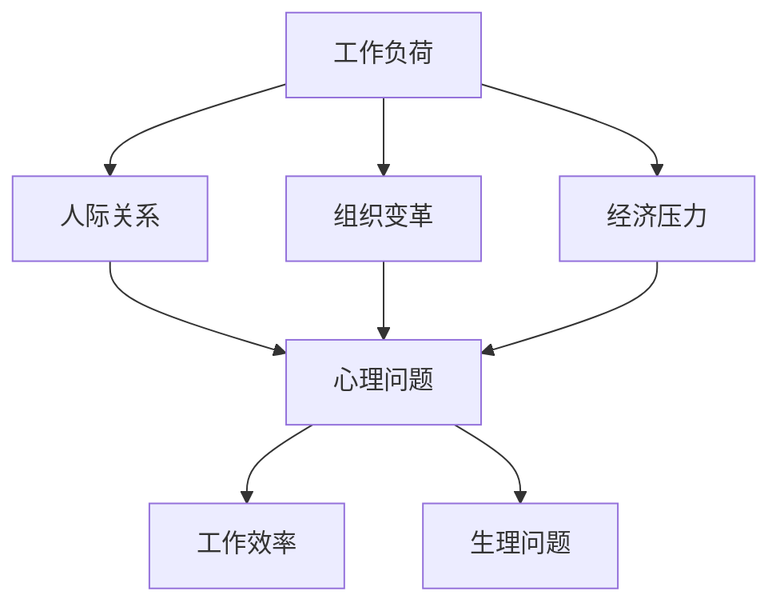
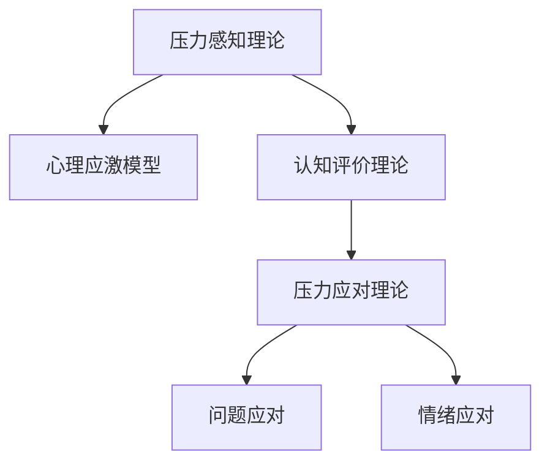
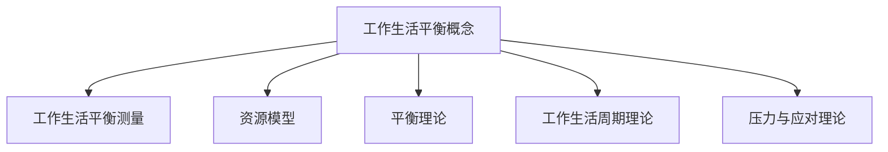

                 

### 第1章 引言

#### 1.1 压力对管理者的影响

在现代社会，管理者面临的压力不容忽视。压力的来源多样，主要包括工作负荷、人际关系、组织变革、经济压力等。这些压力不仅会影响管理者的工作效率，还可能对其身心健康产生负面影响。具体来说，压力可能会导致以下问题：

- **心理问题**：长期的压力可能导致焦虑、抑郁、失眠等心理问题。
- **生理问题**：压力还可能引发高血压、心脏病、消化系统疾病等生理问题。
- **工作效率**：压力会影响管理者的决策能力和工作效率，甚至可能导致错误的决策。

为了更好地理解压力对管理者的影响，我们可以使用以下Mermaid流程图展示压力的来源和影响路径：



通过这个流程图，我们可以清晰地看到压力的来源和其对管理者的影响路径。

#### 1.2 工作与生活的平衡

工作与生活的平衡是管理者面临的另一大挑战。在现代社会，工作和生活之间的界限越来越模糊，管理者往往需要付出更多的时间和精力来平衡这两者。然而，由于工作负荷、职业责任、个人期望等多方面的压力，许多管理者难以实现真正的工作与生活平衡。

工作与生活平衡的重要性在于：

- **提高生活质量**：平衡的工作与生活可以提高管理者的生活质量，减少压力和焦虑。
- **促进身心健康**：工作与生活平衡有助于管理者保持身心健康，提高工作效率和创造力。
- **提高工作效率**：平衡的工作与生活可以帮助管理者更好地规划时间，提高工作效率。

然而，实现工作与生活平衡面临着诸多挑战：

- **工作负荷**：管理者往往面临大量工作任务，难以有效分配时间。
- **职业责任**：管理者需要承担重要的职业责任，这可能会占用其个人时间和精力。
- **个人期望**：管理者往往对自己的期望很高，这可能导致过度工作。

为了应对这些挑战，管理者需要采取一系列策略来保持工作与生活的平衡。以下是一些可能的策略：

- **时间管理**：合理规划时间，将工作与生活分开，确保两者都有足够的时间和精力。
- **优先级设定**：明确工作重点，合理安排工作任务，避免过度劳累。
- **休息与放松**：确保有足够的休息时间，通过放松技巧来缓解压力。
- **社会支持**：寻求家人、朋友和同事的支持，共同分担工作和生活压力。

在下一章中，我们将深入探讨管理者压力调节的基本理论，帮助读者更好地理解和应对管理者面临的压力。通过合理的方法和策略，管理者可以有效地调节压力，保持工作与生活的平衡。

#### 1.3 文章关键词

- 管理者
- 压力调节
- 工作生活平衡
- 心理健康
- 生理健康
- 时间管理
- 优先级设定
- 休息与放松
- 社会支持

这些关键词将帮助读者快速了解文章的主题和重点内容，为后续的阅读提供指导。

#### 1.4 摘要

本文主要探讨了管理者在现代社会面临的重要问题——压力调节和保持工作生活平衡。首先，我们介绍了压力的来源和对管理者身心健康的影响。接着，讨论了工作与生活平衡的重要性及其面临的挑战。在此基础上，我们深入分析了管理者压力调节的基本理论，包括心理调节、行为调节和社会支持调节方法。最后，通过实践案例展示了这些方法在现实中的应用效果。本文旨在为管理者提供有效的压力调节策略，帮助他们保持身心健康，实现工作与生活的平衡。

#### 2.1 压力与应对理论

压力是现代管理者普遍面临的问题，理解压力的来源和应对理论对于管理者调节压力具有重要意义。在这一节中，我们将深入探讨压力感知理论和压力应对理论，帮助管理者更好地理解和应对压力。

##### 2.1.1 压力感知理论

压力感知理论主要关注个体如何感知和理解压力。以下是一些重要的理论和模型：

###### 2.1.1.1 心理应激模型

心理应激模型是由Selye提出的，他认为压力是一个多维度的过程，包括三个阶段：警觉阶段、抵抗阶段和衰竭阶段。每个阶段都涉及身体和情绪的反应。

- **警觉阶段**：个体意识到潜在的压力源，身体准备应对。
- **抵抗阶段**：个体试图应对压力源，保持稳定。
- **衰竭阶段**：如果压力源持续存在，个体会逐渐耗尽能量，导致身心健康问题。

###### 2.1.1.2 认知评价理论

认知评价理论由Lazarus和Folkman提出，强调个体对压力的认知评价在压力感知中的关键作用。该理论认为，个体通过评估压力源的性质和程度来感知压力。

- **初级评价**：个体评估压力源对自身的重要性。
- **次级评价**：个体评估应对压力的能力。

认知评价理论强调了认知因素在压力感知中的重要性，提醒管理者通过积极的认知重构来调节压力。

##### 2.1.2 压力应对理论

压力应对理论主要关注个体如何应对压力。以下是一些重要的理论和模型：

###### 2.1.2.1 应对策略分类

Lazarus和Folkman将应对策略分为问题应对和情绪应对两种类型。

- **问题应对**：个体直接面对和解决问题，如寻找解决方案、制定计划。
- **情绪应对**：个体试图调节情绪反应，如放松、自我安慰。

问题应对和情绪应对并不是相互独立的，个体通常需要在应对压力时结合使用这两种策略。

###### 2.1.2.2 应对效果评估

应对效果评估关注个体采用不同应对策略的效果。研究表明，有效的应对策略可以减轻压力，提高心理健康。

- **短期效果**：短期内，有效的应对策略可以缓解压力，提高情绪状态。
- **长期效果**：长期来看，有效的应对策略有助于提高个体的心理健康和生活质量。

在压力与应对理论的基础上，管理者可以更好地理解和应对压力。通过认知重构、问题应对和情绪应对等策略，管理者可以有效地调节压力，保持身心健康。

为了更清晰地展示压力感知理论和压力应对理论之间的关系，我们可以使用以下Mermaid流程图：



这个流程图展示了压力感知理论和压力应对理论之间的联系，帮助读者更好地理解这两个理论的核心概念。

#### 2.2 压力调节方法

管理者在面对压力时，可以采用多种方法进行调节，以维持心理健康和提升工作效率。这些方法主要包括心理调节方法、行为调节方法和社会支持调节方法。在本节中，我们将分别介绍这些方法及其在压力调节中的应用。

##### 2.2.1 心理调节方法

心理调节方法主要关注个体的心理状态和认知过程，通过改变思维方式来减轻压力。以下是几种常见的心里调节方法：

###### 2.2.1.1 认知行为疗法

认知行为疗法（Cognitive Behavioral Therapy, CBT）是一种心理治疗方法，通过识别和改变负面思维模式来减轻压力。CBT的主要步骤如下：

1. **识别负面思维**：个体学习识别和记录自己的负面思维。
2. **评估负面思维**：个体评估这些负面思维的真实性和有用性。
3. **重构思维**：个体通过认知重构技术，如反向思维、理性思考等，来改变负面思维。
4. **行为实验**：个体通过实际行动来验证和巩固新的思维模式。

**应用示例**：一位管理者由于工作失误而感到自责和焦虑。通过认知行为疗法，他学会了识别自责思维，评估其真实性和有用性，并采用重构技术将其转变为更积极的思维方式。例如，他将“我一定是个失败的管理者”转变为“这是一个错误，我可以从中学习并改进”。

###### 2.2.1.2 正念冥想

正念冥想（Mindfulness Meditation）是一种专注于当前时刻的练习，通过提高个体的专注力和意识来减轻压力。正念冥想的主要步骤如下：

1. **呼吸练习**：专注于呼吸，将注意力集中在呼吸的进出。
2. **身体扫描**：逐步扫描身体，观察身体的感觉，接纳不适和疼痛。
3. **情绪管理**：观察情绪的起伏，接纳而非抗拒。
4. **行为实践**：将正念练习应用到日常生活中，如吃饭、走路、洗澡等。

**应用示例**：一位管理者在会议前感到紧张。通过正念冥想，他学会了在会议前进行深呼吸和身体扫描，以放松身体和心情。在会议中，他能够更好地专注于会议内容，减少紧张和焦虑。

###### 2.2.1.3 情绪管理

情绪管理是一种通过理解和管理情绪来减轻压力的方法。情绪管理的步骤如下：

1. **情绪识别**：学会识别和理解自己的情绪。
2. **情绪接纳**：接纳而非抗拒情绪，认识到情绪是正常的。
3. **情绪表达**：找到合适的方式表达情绪，如写日记、绘画、倾诉等。
4. **情绪调节**：使用放松技巧、正向思考等来调节情绪。

**应用示例**：一位管理者在项目失败后感到沮丧。通过情绪管理，他学会了识别自己的情绪，接纳并表达沮丧感。他通过写日记和与同事交流来释放情绪，并使用放松技巧来减轻压力。

##### 2.2.2 行为调节方法

行为调节方法主要关注个体的行为和生活方式，通过改变行为习惯来减轻压力。以下是几种常见的行为调节方法：

###### 2.2.2.1 时间管理

时间管理是一种通过有效规划和管理时间来减轻压力的方法。时间管理的步骤如下：

1. **设定目标**：明确工作和生活的目标，制定计划。
2. **时间块化**：将时间分成不同的块，分别用于工作、休息和娱乐。
3. **优先级设定**：根据重要性和紧急性来设定任务的优先级。
4. **避免拖延**：学会避免拖延，及时完成任务。

**应用示例**：一位管理者通过时间管理，将每天的工作时间分成不同的块，确保有足够的休息时间。他还学会了设定优先级，优先处理重要和紧急的任务，从而减轻工作压力。

###### 2.2.2.2 休息与放松

休息与放松是一种通过定期休息和放松来减轻压力的方法。休息与放松的方法如下：

1. **定期休息**：确保每天有足够的休息时间，避免过度劳累。
2. **放松技巧**：学习放松技巧，如深呼吸、冥想、瑜伽等。
3. **娱乐活动**：参与娱乐活动，如看电影、阅读、运动等，以减轻压力。

**应用示例**：一位管理者在工作日结束后，会花时间进行冥想和瑜伽，以放松身心。他还定期参加运动活动，如跑步和游泳，以保持身体健康。

###### 2.2.2.3 锻炼与健康

锻炼与健康是一种通过锻炼和保持健康生活方式来减轻压力的方法。锻炼与健康的方法如下：

1. **定期锻炼**：定期进行体育锻炼，如跑步、游泳、健身等。
2. **健康饮食**：保持均衡饮食，减少高热量和高脂肪食品的摄入。
3. **睡眠管理**：确保有足够的睡眠，提高睡眠质量。

**应用示例**：一位管理者每天早晨都会进行晨跑，以保持身体健康。他还通过调整饮食习惯和睡眠时间来改善身体健康。

##### 2.2.3 社会支持调节方法

社会支持调节方法主要关注个体与他人的关系，通过获得社会支持来减轻压力。以下是几种常见的社会支持调节方法：

###### 2.2.3.1 人际关系管理

人际关系管理是一种通过改善人际关系来减轻压力的方法。人际关系管理的步骤如下：

1. **沟通技巧**：学习有效的沟通技巧，如倾听、表达、解决冲突等。
2. **建立信任**：与他人建立信任关系，分享感受和需求。
3. **支持他人**：在他人需要时提供帮助和支持。

**应用示例**：一位管理者通过与同事和下属建立良好的沟通和信任关系，减少了工作中的冲突和压力。他在同事和下属需要帮助时，总是乐于提供支持。

###### 2.2.3.2 职场支持

职场支持是一种通过职场资源和环境来减轻压力的方法。职场支持的形式包括：

1. **导师制度**：通过导师制度，管理者可以获得指导和反馈，提高应对压力的能力。
2. **团队建设**：通过团队建设活动，增强团队成员之间的信任和合作，减轻个体压力。
3. **心理健康支持**：提供心理健康服务，如心理咨询、心理健康讲座等，帮助管理者应对心理压力。

**应用示例**：一位管理者通过参加公司的心理健康讲座，学习到了应对压力的有效方法。他还在团队的定期会议上分享自己的压力管理经验，帮助团队成员共同应对压力。

###### 2.2.3.3 社会支持网络

社会支持网络是一种通过家庭和朋友等社会资源来减轻压力的方法。社会支持网络的构建步骤如下：

1. **建立联系**：与家人和朋友保持紧密联系，分享感受和需求。
2. **互助小组**：加入互助小组，与他人分享压力管理经验。
3. **求助**：在需要时向家人和朋友寻求帮助。

**应用示例**：一位管理者在遇到工作压力时，会向家人和朋友倾诉，寻求他们的支持和建议。他还会参加一些互助小组，与他人分享压力管理经验，从中获得帮助和启发。

通过心理调节方法、行为调节方法和社会支持调节方法，管理者可以有效地调节压力，保持身心健康，提高工作效率。在下一章中，我们将进一步探讨工作生活平衡的理论基础，帮助管理者更好地理解和实现工作与生活的平衡。

#### 2.3 工作生活平衡的理论基础

工作生活平衡是现代管理者面临的重要课题，它不仅关系到个人的身心健康，还影响到工作表现和整体生活质量。为了深入探讨工作生活平衡的理论基础，我们需要了解其定义、测量方法以及相关的理论模型。

##### 2.3.1 工作生活平衡的概念

工作生活平衡指的是在工作和生活之间找到一个适当的平衡点，使得两者都能得到充分的发展和满足。这个平衡点并非一成不变，而是一个动态调整的过程。工作生活平衡包括以下几个方面：

1. **时间平衡**：合理分配工作时间和非工作时间，确保有足够的时间用于家庭、休闲和自我发展。
2. **角色平衡**：在不同的社会角色（如职场角色、家庭角色、个人角色）之间找到平衡，避免过度投入某一角色而忽视其他角色。
3. **心理平衡**：保持心理上的平静和满足，不让工作压力影响个人情感和心理健康。
4. **资源平衡**：合理分配个人资源（如时间、精力、金钱等），确保工作和生活都有足够的资源支持。

##### 2.3.2 工作生活平衡的测量

测量工作生活平衡是一个复杂的过程，需要考虑多个维度。以下是一些常见的工作生活平衡测量方法：

1. **主观幸福感**：通过问卷调查或面谈，了解个体对自己工作生活平衡的满意度。
2. **工作满意度**：评估个体对工作条件的满意度，包括工作内容、工作环境、职业发展机会等。
3. **生活满意度**：评估个体对家庭生活、社交生活、休闲活动等的满意度。
4. **工作与生活冲突**：测量工作与生活之间的冲突程度，如工作占用了太多的个人时间，或者工作影响了家庭生活等。
5. **工作与生活平衡指数**：通过综合以上多个指标，得出一个总体的工作生活平衡得分。

##### 2.3.3 工作生活平衡的理论模型

为了更好地理解工作生活平衡，学者们提出了多种理论模型。以下是几种主要的理论模型：

1. **资源模型**：资源模型认为，工作生活平衡是一个资源分配的问题，个体需要合理分配时间和资源来满足工作和生活的需求。资源模型强调个体的自主性和自我调节能力，认为个体可以通过自我管理来实现工作生活平衡。

2. **平衡理论**：平衡理论认为，工作生活平衡是一个动态的过程，个体在不同时间、不同情境下需要调整自己的行为和态度来维持平衡。平衡理论强调个体与环境之间的互动，认为外部环境的变化会影响工作生活平衡的状态。

3. **工作生活周期理论**：工作生活周期理论认为，工作生活平衡是一个随着时间的推移而变化的过程。个体在不同的生命阶段（如职业生涯初期、中期、后期）面临的工作和生活需求不同，因此工作生活平衡也是一个动态调整的过程。

4. **压力与应对理论**：压力与应对理论认为，工作生活平衡是一个压力调节的过程。个体在面对工作压力时，需要采用有效的应对策略来调节压力，以维持工作与生活的平衡。

为了更直观地展示工作生活平衡的概念、测量方法以及理论模型之间的关系，我们可以使用以下Mermaid流程图：



这个流程图展示了工作生活平衡的理论基础，帮助读者更好地理解各个概念和模型之间的联系。

通过理解工作生活平衡的理论基础，管理者可以更系统地分析和解决工作与生活之间的冲突，实现身心健康和工作效率的双赢。在下一章中，我们将探讨具体的心里调节方法，帮助管理者在实际中应用这些理论，实现工作生活平衡。

#### 3.1 认知行为疗法

认知行为疗法（Cognitive Behavioral Therapy, CBT）是一种基于心理学理论的心理治疗方法，它通过识别和改变负面思维模式来减轻压力和改善心理健康。CBT的原理和应用在管理者压力调节中具有重要意义。

##### 3.1.1 认知行为疗法的原理

认知行为疗法的基本原理包括以下几个方面：

1. **认知重构**：CBT的核心在于帮助个体识别和改变负面思维模式。负面思维模式通常会导致情绪和行为问题，例如焦虑、抑郁等。通过认知重构，个体可以学会用更积极、现实的方式来思考问题。

2. **行为实验**：CBT强调个体通过实际行动来验证和巩固新的思维模式。行为实验是一种有效的实践方法，个体可以通过实际行动来检验自己的假设，从而逐步建立积极的思维和行为模式。

3. **认知行为理论**：认知行为理论认为，个体的情绪和行为受到其思维模式的影响。如果个体的思维模式是消极的，那么他们的情绪和行为也会受到影响。通过改变思维模式，个体可以改善情绪和行为。

##### 3.1.2 认知行为疗法在压力调节中的应用

认知行为疗法在压力调节中的应用主要体现在以下几个方面：

1. **压力识别**：首先，个体需要识别和了解自己面临的具体压力源。这可以通过记录日志、反思等方式实现。了解压力源是采取进一步行动的第一步。

2. **认知重构**：在识别压力源后，个体需要识别和改变与压力相关的负面思维模式。例如，如果个体在面对压力时经常出现“我无法应对这个任务”的消极想法，通过认知重构，个体可以将其转变为“这是一个挑战，我可以通过努力和资源来应对”。

3. **行为实验**：通过行为实验，个体可以将新的思维模式应用到实际生活中。例如，个体可以设定一个目标，如每天锻炼30分钟，并记录自己的感受和进展。通过行为实验，个体可以验证新的思维模式的有效性，并逐步建立积极的行为习惯。

4. **压力管理技能**：CBT还教授个体一些压力管理技能，如深呼吸、放松技巧、时间管理等。这些技能可以帮助个体在压力情境中保持冷静和应对。

##### 3.1.3 应用示例

为了更好地理解认知行为疗法在压力调节中的应用，我们可以通过一个案例来展示：

**案例**：一位管理者在面对公司重组和裁员压力时，感到非常焦虑和不安。通过认知行为疗法，他采取了以下步骤来调节压力：

1. **压力识别**：他记录下自己感到压力的具体情境，如公司重组的会议、与员工的沟通等。

2. **认知重构**：他学会了识别和改变自己的负面思维模式。例如，他原本认为“我必须保持完美，否则就会失去工作”，通过认知重构，他转变为“我可以尽力而为，但也允许自己犯错误，从错误中学习”。

3. **行为实验**：他设定了一个目标，如每天锻炼30分钟，并通过记录日志来跟踪自己的进展。他还参加了一个冥想课程，通过冥想来放松身心。

4. **压力管理技能**：他学会了使用深呼吸和放松技巧来缓解焦虑，还制定了时间管理计划，以确保有足够的时间用于工作和个人生活。

通过认知行为疗法，这位管理者逐渐学会了如何应对压力，保持心理健康。他的焦虑感减轻了，工作效率也得到了提升。

通过认知行为疗法，管理者可以有效地识别和调节压力，保持心理健康。在下一章中，我们将探讨正念冥想这种心理调节方法，帮助管理者更好地应对压力。

#### 3.2 正念冥想

正念冥想（Mindfulness Meditation）是一种古老的练习方式，它通过培养个体的专注力和意识来减轻压力和提高生活质量。在现代管理者的压力调节中，正念冥想因其简单易行且效果显著而受到广泛关注。

##### 3.2.1 正念冥想的原理

正念冥想的原理基于对当前时刻的专注和意识。以下是正念冥想的一些核心概念：

1. **专注力**：正念冥想要求个体将注意力集中在呼吸、身体感觉或其他选定对象上，从而提高专注力。通过持续的练习，个体可以培养对分散注意力的抵抗能力，提高集中精力完成任务的能力。

2. **意识**：正念冥想强调对当前时刻的觉知和接纳，而不评判或抗拒。通过这种练习，个体可以更好地了解自己的思维模式、情绪反应和生理状态，从而减少不必要的心理负担。

3. **情绪调节**：正念冥想有助于个体更好地理解和调节情绪。通过专注于呼吸和身体感觉，个体可以减缓情绪反应，减少焦虑和压力感。

4. **自我关怀**：正念冥想鼓励个体对自己保持关怀和接纳，而不是自我批评或抗拒。这种自我关怀有助于提高心理健康和自尊心。

##### 3.2.2 正念冥想对压力调节的影响

正念冥想对压力调节具有显著的影响，主要体现在以下几个方面：

1. **降低压力水平**：研究表明，正念冥想可以显著降低个体的压力水平，减少焦虑和抑郁症状。通过专注于呼吸和身体感觉，个体可以暂时从压力源中抽离，从而缓解紧张情绪。

2. **改善情绪状态**：正念冥想有助于改善个体的情绪状态，提高情绪调节能力。通过正念练习，个体可以更好地理解和接纳自己的情绪，减少情绪波动和情绪困扰。

3. **提高心理韧性**：正念冥想有助于提高个体的心理韧性，增强应对压力和挑战的能力。通过培养专注力和意识，个体可以更好地应对生活中的不确定性和变化。

4. **促进身心健康**：正念冥想不仅有助于心理健康，还与身心健康密切相关。研究表明，正念冥想可以改善睡眠质量，减少慢性疼痛，增强免疫系统功能。

##### 3.2.3 正念冥想的实践步骤

以下是一些正念冥想的实践步骤，帮助管理者开始正念冥想练习：

1. **选择合适的环境**：找到一个安静、舒适的地方，确保在没有干扰的情况下进行冥想。

2. **设定冥想时间**：每天选择一个固定的时间进行冥想，例如早晨或晚上。

3. **选择冥想对象**：常见的冥想对象包括呼吸、身体感觉、自然声音等。开始时，可以选择专注于呼吸，注意呼吸的进出和身体的感觉。

4. **开始冥想**：坐在舒适的姿势中，闭上眼睛，将注意力集中在呼吸上。当注意力分散时，温和地将注意力带回到呼吸上。

5. **结束冥想**：冥想结束时，缓缓地打开眼睛，保持内心的平静和专注。

##### 3.2.4 应用示例

为了更好地理解正念冥想在压力调节中的应用，我们可以通过一个案例来展示：

**案例**：一位管理者在面对繁忙的工作和频繁的会议时感到压力很大。他决定尝试正念冥想来减轻压力。以下是他具体的实践步骤：

1. **选择冥想环境**：他选择在家中客厅的沙发上，确保没有噪音和干扰。

2. **设定冥想时间**：每天晚上睡前进行10分钟的冥想。

3. **选择冥想对象**：他专注于呼吸，注意呼吸的进出和身体的感觉。

4. **开始冥想**：他坐在沙发上，闭上眼睛，将注意力集中在呼吸上。当注意力分散时，他会温和地将注意力带回到呼吸上。

5. **结束冥想**：冥想结束时，他缓缓地打开眼睛，感到身心放松和平静。

通过持续的实践，这位管理者逐渐学会了如何应对工作中的压力，他的情绪状态也得到了显著改善。

正念冥想是一种简单有效的压力调节方法，可以帮助管理者保持心理健康和提高生活质量。在下一章中，我们将探讨情绪管理这一重要的心理调节方法。

#### 3.3 情绪管理

情绪管理是管理者在压力调节中不可或缺的一部分。情绪管理涉及识别、理解和调节情绪，以保持心理平衡和提高工作效率。在这一节中，我们将探讨情绪管理的原理和具体方法。

##### 3.3.1 情绪管理的原理

情绪管理基于以下几个核心原理：

1. **情绪识别**：情绪识别是情绪管理的第一步。个体需要能够识别自己正在经历的情绪，包括正面情绪（如快乐、满足）和负面情绪（如焦虑、愤怒）。只有了解自己的情绪，个体才能采取适当的调节策略。

2. **情绪理解**：情绪理解涉及理解情绪背后的原因和意义。通过深入思考和分析，个体可以更好地理解情绪的发生机制，从而更容易采取有效的调节策略。

3. **情绪调节**：情绪调节是指通过特定的策略和技巧来调节情绪。这些策略包括认知重构、放松技巧、正向思维等。通过情绪调节，个体可以减少负面情绪的影响，增强情绪稳定性和心理韧性。

4. **自我关怀**：自我关怀是指对自己保持接纳、理解和同情。通过自我关怀，个体可以减少自我批评和负面情绪，从而更好地管理情绪。

##### 3.3.2 情绪管理的方法

以下是一些常见情绪管理的方法：

1. **认知重构**：认知重构是一种通过改变思维模式来调节情绪的方法。个体可以通过识别和改变负面思维来减少情绪困扰。例如，如果个体在面对压力时总是想“我不能胜任这个任务”，通过认知重构，个体可以将其转变为“这是一个挑战，我可以通过学习和努力来应对”。

2. **放松技巧**：放松技巧包括深呼吸、渐进性肌肉放松、冥想等。这些技巧可以帮助个体在压力情境中放松身体和心灵，减少焦虑和紧张感。例如，当个体感到紧张时，可以通过深呼吸来缓解情绪。

3. **情绪表达**：情绪表达是指找到合适的方式表达情绪，以减少情绪积压。个体可以通过写日记、绘画、倾诉等方式来释放情绪。例如，一位管理者可以在工作压力大时通过写日记来记录自己的情绪，从而减轻心理负担。

4. **正向思维**：正向思维是一种通过积极思考来改善情绪的方法。个体可以通过关注积极事物、感恩练习等来增强积极情绪。例如，每天早晨，管理者可以花几分钟时间思考自己感激的事物，从而提升心情。

##### 3.3.3 应用示例

为了更好地理解情绪管理的方法，我们可以通过一个案例来展示：

**案例**：一位管理者在面对项目失败和员工不满时感到非常沮丧和愤怒。通过情绪管理，他采取了以下步骤来调节情绪：

1. **情绪识别**：他意识到自己感到沮丧和愤怒，并尝试理解这些情绪背后的原因。

2. **情绪理解**：他反思了自己在项目中的表现，意识到自己在某些方面存在不足，这导致项目失败。

3. **认知重构**：他通过认知重构来调整自己的思维方式。例如，他不再责怪自己，而是将其转变为“这是一个学习的机会，我可以从中吸取教训”。

4. **放松技巧**：他通过深呼吸和渐进性肌肉放松来放松身体，减轻紧张感。

5. **情绪表达**：他通过与同事和下属沟通，表达自己的感受和看法，从而减少情绪积压。

通过情绪管理，这位管理者逐渐恢复了心理平衡，工作效率也得到了提升。

情绪管理是管理者保持心理健康和高效工作的重要手段。通过识别、理解和调节情绪，管理者可以更好地应对压力和挑战，实现工作与生活的平衡。在下一章中，我们将探讨行为调节方法，帮助管理者通过实际行动来减轻压力。

### 4.1 时间管理

时间管理是管理者在压力调节中至关重要的一环。有效的时间管理不仅可以帮助管理者提高工作效率，还可以减轻工作压力，实现工作与生活的平衡。在这一节中，我们将探讨时间管理的重要性以及常见的几种时间管理方法。

#### 4.1.1 时间管理的重要性

时间管理的重要性体现在以下几个方面：

1. **提高工作效率**：通过合理规划时间，管理者可以确保在有限的时间内完成更多的工作，从而提高工作效率。

2. **减少工作压力**：合理的时间安排可以帮助管理者避免过度劳累，减少工作压力，从而保持身心健康。

3. **实现工作与生活平衡**：通过有效的时间管理，管理者可以确保有足够的时间用于家庭、休闲和自我发展，从而实现工作与生活的平衡。

4. **增强计划能力**：时间管理要求管理者制定明确的计划和目标，这有助于提高其计划能力和决策能力。

5. **提升组织能力**：时间管理有助于管理者更好地组织和协调工作，提高团队的整体效率。

#### 4.1.2 常见的时间管理方法

以下是几种常见的时间管理方法：

1. **优先级设定**：优先级设定是时间管理的核心，它帮助管理者确定哪些任务是最重要和最紧急的。常用的优先级设定方法包括：

   - **四象限法**：将任务分为四个象限，根据任务的重要性和紧急性进行分类。重要且紧急的任务应立即处理；重要但不紧急的任务应提前规划；不重要但紧急的任务应委托他人处理；不重要且不紧急的任务可以暂时搁置。
   
   ```mermaid
   graph TD
   A[重要且紧急]
   B[重要但不紧急]
   C[不重要但紧急]
   D[不重要且不紧急]
   A --> E{紧急任务}
   B --> E
   C --> F{委托任务}
   D --> F
   ```

2. **时间块化**：时间块化是一种将时间分成不同块的方法，每个时间块用于特定任务或活动。这种方法有助于避免时间浪费和任务切换，提高工作效率。例如，可以每天将时间分为工作块、休息块和家庭块。

   ```mermaid
   graph TD
   A[工作块]
   B[休息块]
   C[家庭块]
   A --> D{上午工作}
   B --> E{午休}
   C --> F{下午工作}
   ```

3. **待办事项清单**：待办事项清单是时间管理中常用的一种工具，它帮助管理者记录和跟踪需要完成的任务。通过待办事项清单，管理者可以确保不遗漏重要任务，并合理安排时间。

   ```mermaid
   graph TD
   A{任务1}
   B{任务2}
   C{任务3}
   A --> D{完成情况}
   B --> D
   C --> D
   ```

4. **番茄工作法**：番茄工作法是一种基于时间块化的工作方法，它将工作时间分为25分钟的工作周期（称为“番茄钟”），每个周期后休息5分钟。这种方法有助于提高专注力和工作效率。

   ```mermaid
   graph TD
   A[开始]
   B{番茄钟1}
   C{番茄钟2}
   D{番茄钟3}
   A --> B
   B --> C
   C --> D
   D --> E{休息5分钟}
   ```

5. **日程安排**：日程安排是将时间分配给特定任务或活动的一种方法，它有助于管理者提前规划时间，避免时间冲突。管理者可以使用日历或日程管理应用程序来安排日程。

   ```mermaid
   graph TD
   A{会议}
   B{报告}
   C{培训}
   A --> D{时间1}
   B --> E{时间2}
   C --> F{时间3}
   ```

通过以上时间管理方法，管理者可以更有效地规划和利用时间，从而减轻工作压力，实现工作与生活的平衡。

### 4.2 休息与放松

休息与放松是管理者在压力调节中不可或缺的一部分。适当的休息和放松不仅有助于缓解身体和心理的疲劳，还能提高工作效率和生活质量。在这一节中，我们将探讨休息与放松的重要性以及常见的放松方法。

#### 4.2.1 休息与放松的重要性

休息与放松的重要性体现在以下几个方面：

1. **缓解身体疲劳**：长时间的工作和压力会导致身体疲劳，适当的休息可以帮助恢复体力和精力，提高工作效率。

2. **减轻心理压力**：休息和放松有助于减轻心理压力，减少焦虑和紧张感，从而改善心理健康。

3. **提高专注力**：休息和放松可以提高大脑的专注力和工作效率，有助于管理者更好地应对工作任务。

4. **增强免疫系统功能**：适当的休息和放松有助于增强免疫系统的功能，提高身体的抵抗力。

5. **促进身心健康**：休息和放松有助于维持良好的身心健康，减少慢性疾病的风险。

#### 4.2.2 常见的放松方法

以下是几种常见的放松方法：

1. **深呼吸**：深呼吸是一种简单有效的放松方法，通过深吸气和缓慢呼气来放松身体和心理。以下是一个简单的深呼吸练习：

   ```mermaid
   graph TD
   A[深吸]
   B[缓慢呼]
   A --> B
   B --> C[重复]
   ```

   - **步骤**：坐在一个舒适的姿势，闭上眼睛，深吸一口气，然后缓慢地呼气。重复这个过程，每次深呼吸都要尽可能地缓慢和平稳。

2. **渐进性肌肉放松**：渐进性肌肉放松（Progressive Muscle Relaxation, PMR）是一种通过逐步放松身体各部位的肌肉来缓解紧张和疲劳的方法。以下是一个简单的PMR练习：

   ```mermaid
   graph TD
   A[头部]
   B[肩部]
   C[手臂]
   D[腹部]
   E[腿部]
   A --> B
   B --> C
   C --> D
   D --> E
   ```

   - **步骤**：坐在一个舒适的姿势，从头部开始，紧绷头部和颈部的肌肉几秒钟，然后放松。接着，依次紧绷肩部、手臂、腹部和腿部的肌肉，每次紧绷几秒钟，然后放松。通过这种方式，可以逐步放松全身的肌肉。

3. **冥想**：冥想是一种通过专注和意识来放松身心的一种练习。以下是一个简单的冥想练习：

   ```mermaid
   graph TD
   A[坐姿]
   B[呼吸]
   C[专注]
   A --> B
   B --> C
   ```

   - **步骤**：坐在一个舒适的姿势，闭上眼睛，专注于呼吸。深吸一口气，然后缓慢地呼气。在呼吸过程中，专注于呼吸的感觉，逐渐放松身体和心灵。

4. **瑜伽**：瑜伽是一种结合体位、呼吸和冥想的练习，有助于放松身心。以下是一个简单的瑜伽练习：

   ```mermaid
   graph TD
   A[坐姿前弯]
   B[站立前弯]
   C[桥式]
   A --> B
   B --> C
   ```

   - **步骤**：进行坐姿前弯，坐在地面上，向前弯腰，用手抓住脚踝。接着，进行站立前弯，从站立姿势开始，向前弯腰，用手触碰地面。最后，进行桥式，躺下，抬起臀部，形成一座桥的形状。这些体位有助于放松身体和心灵。

5. **音乐放松**：听音乐是一种简单有效的放松方法。选择一些轻松、舒缓的音乐，可以帮助缓解压力和放松身心。

通过适当的休息和放松，管理者可以更好地应对工作压力，提高工作效率和生活质量。在下一章中，我们将探讨锻炼与健康这一重要的行为调节方法。

### 4.3 锻炼与健康

锻炼与健康是管理者在压力调节中不可或缺的一环。适当的锻炼不仅有助于保持身体健康，还能提高心理韧性，减轻工作压力。在这一节中，我们将探讨锻炼对压力调节的作用，以及健康饮食对压力调节的影响。

#### 4.3.1 锻炼对压力调节的作用

锻炼对压力调节具有多种积极作用，主要体现在以下几个方面：

1. **释放内啡肽**：锻炼可以促进内啡肽的分泌，这是一种天然的情绪提升物质，有助于缓解焦虑和压力。

2. **提高心理韧性**：定期锻炼可以提高个体的心理韧性，增强面对压力和挑战的能力。

3. **改善睡眠质量**：锻炼有助于改善睡眠质量，减少失眠和疲劳感，从而提高工作效率。

4. **减轻心理压力**：锻炼可以转移注意力，减少对工作压力的关注，从而减轻心理压力。

5. **增强免疫系统功能**：锻炼可以增强免疫系统的功能，提高身体抵抗力，减少疾病风险。

#### 4.3.2 常见的锻炼方式

以下是一些常见的锻炼方式，管理者可以根据个人喜好和时间安排选择适合自己的锻炼方式：

1. **有氧运动**：有氧运动如慢跑、游泳、骑自行车等，有助于提高心肺功能，增强身体耐力。

2. **力量训练**：力量训练如举重、俯卧撑、仰卧起坐等，有助于增强肌肉力量和骨骼密度。

3. **瑜伽**：瑜伽结合体位、呼吸和冥想，有助于放松身心，减轻压力。

4. **舞蹈**：舞蹈是一种有趣且富有活力的锻炼方式，可以提高协调性和灵活性。

5. **户外活动**：户外活动如徒步、爬山、骑行等，可以享受自然风光，减少压力感。

#### 4.3.3 健康饮食对压力调节的影响

健康饮食是维持身体健康的重要因素，也对压力调节具有重要作用。以下是一些健康饮食的建议：

1. **均衡饮食**：保持饮食均衡，摄入适量的蛋白质、碳水化合物、脂肪、维生素和矿物质，以满足身体的营养需求。

2. **减少高热量食物**：减少高热量、高脂肪和高糖的食物摄入，避免过度摄入导致肥胖和健康问题。

3. **增加抗氧化食物**：抗氧化食物如新鲜水果、蔬菜、坚果等，有助于抵抗自由基的损害，提高免疫力。

4. **减少咖啡因和酒精**：咖啡因和酒精都可能加重压力感，建议减少摄入。

5. **定时进食**：保持定时进食，避免暴饮暴食或长时间饥饿，有助于维持血糖稳定，减少压力。

通过适当的锻炼和健康饮食，管理者可以有效地调节压力，保持身心健康。在下一章中，我们将探讨人际关系管理这一重要的社会支持调节方法。

### 5.1 人际关系管理

人际关系管理是管理者在压力调节中不可或缺的一部分。良好的人际关系有助于减轻工作压力，提高工作效率，促进职业发展。在这一节中，我们将探讨人际关系管理的重要性以及如何通过有效的沟通技巧和冲突解决来管理人际关系。

#### 5.1.1 人际关系管理的重要性

人际关系管理的重要性体现在以下几个方面：

1. **提升工作效率**：良好的人际关系有助于团队成员之间的协作，减少沟通障碍，从而提高工作效率。

2. **增强团队合作**：通过建立互信和尊重的关系，团队成员可以更好地合作，共同实现目标。

3. **促进职业发展**：良好的人际关系可以帮助管理者获得更多的职业机会和资源，如晋升、培训和项目机会。

4. **减轻工作压力**：与同事和家人保持良好的关系，可以在工作中提供支持和安慰，减轻压力。

5. **提高心理健康**：良好的人际关系有助于提升个体的幸福感，减少孤独感和焦虑感。

#### 5.1.2 沟通技巧

有效的沟通技巧是建立和维护良好人际关系的基础。以下是一些关键的沟通技巧：

1. **倾听**：倾听是沟通的重要组成部分。通过倾听，管理者可以理解他人的观点和需求，从而建立信任和共鸣。

2. **清晰表达**：清晰表达可以帮助管理者准确传达自己的想法和意图，避免误解和冲突。

3. **非语言沟通**：非语言沟通包括肢体语言、面部表情和眼神交流等。这些非语言的信号可以增强沟通的效果，传递更多的信息。

4. **提问和反馈**：提问和反馈有助于管理者了解他人的观点和感受，从而更好地理解他人，并调整自己的行为。

5. **冲突解决**：在沟通中，冲突是不可避免的。有效的冲突解决技巧可以帮助管理者妥善处理冲突，维护良好的人际关系。

#### 5.1.3 冲突解决

冲突解决是人际关系管理的关键环节。以下是一些常见的冲突解决方法：

1. **冷静处理**：面对冲突时，管理者应保持冷静，避免情绪化。冷静处理有助于理性分析和解决问题。

2. **同理心**：同理心是理解他人的感受和需求。通过同理心，管理者可以更好地理解冲突的原因，并找到解决方案。

3. **双赢策略**：双赢策略强调在冲突解决中寻求双方都能接受的解决方案。这种方法有助于建立互信和合作关系。

4. **妥协和让步**：在某些情况下，妥协和让步可能是必要的。通过妥协和让步，管理者可以缓解冲突，维护人际关系。

5. **寻求第三方帮助**：在无法自行解决冲突时，管理者可以寻求第三方帮助，如调解人或心理咨询师。

通过有效的人际关系管理，管理者可以建立和维护良好的人际关系，从而在压力调节中发挥重要作用。在下一章中，我们将探讨职场支持这一重要的社会支持调节方法。

### 5.2 职场支持

职场支持在管理者压力调节中扮演着关键角色。职场支持不仅包括组织提供的各种资源和政策，还涉及同事、上级和下属之间的相互支持和帮助。有效的职场支持可以帮助管理者减轻工作压力，提高工作满意度和职业成就感。在这一节中，我们将探讨职场支持的形式、效果以及如何构建有效的职场支持系统。

#### 5.2.1 职场支持的形式

职场支持的形式多种多样，以下是一些常见的职场支持方式：

1. **导师制度**：导师制度是指由经验丰富的资深员工指导新员工或年轻员工，帮助他们快速适应工作和解决职业发展中的问题。导师可以提供职业规划建议、工作技巧分享和情感支持。

2. **职业培训**：组织提供的职业培训可以帮助管理者提升专业技能和领导能力，从而更好地应对工作中的挑战。培训形式包括内部培训、外部培训和在线学习等。

3. **心理健康支持**：心理健康支持包括心理咨询、压力管理和心理健康的宣传活动。通过提供心理健康服务，组织可以帮助管理者应对工作压力，提高心理健康水平。

4. **弹性工作制度**：弹性工作制度如远程办公、灵活工作时间等，可以减轻管理者的工作压力，提高工作与生活的平衡。

5. **团队建设活动**：团队建设活动如团队聚餐、团建旅行和团队协作项目等，可以增强团队成员之间的信任和合作，减少工作压力。

6. **员工福利**：员工福利包括健康保险、退休金计划、带薪休假和员工活动等，这些福利可以提高员工的工作满意度和忠诚度。

#### 5.2.2 职场支持的效果

职场支持对管理者的压力调节具有显著效果，主要体现在以下几个方面：

1. **减轻工作压力**：职场支持可以帮助管理者更好地应对工作中的压力，通过提供心理健康服务和弹性工作制度，减轻工作负担。

2. **提高工作满意度**：有效的职场支持可以提高员工的工作满意度，减少工作倦怠和离职倾向。

3. **提升职业成就感**：通过职业培训和导师制度，管理者可以获得更多的职业发展机会，提高职业成就感。

4. **增强团队合作**：团队建设和同事间的支持可以增强团队成员之间的信任和合作，提高团队绩效。

5. **促进职业发展**：职场支持可以帮助管理者获得职业发展所需的资源和支持，提高职业竞争力。

#### 5.2.3 构建有效的职场支持系统

为了构建一个有效的职场支持系统，组织可以采取以下策略：

1. **明确支持目标**：组织应明确职场支持的目标和愿景，确保所有支持措施都围绕提升员工福祉和绩效展开。

2. **制定支持政策**：制定明确的职场支持政策，包括心理健康服务、职业培训、弹性工作制度等，并确保政策的有效实施。

3. **建立支持网络**：建立由管理层、人力资源部门和员工代表组成的支持网络，确保职场支持措施能够得到有效的执行和反馈。

4. **提供培训和资源**：为员工提供职场支持相关的培训和资源，如心理健康讲座、职业发展指导等，帮助员工更好地利用职场支持资源。

5. **鼓励员工参与**：鼓励员工积极参与职场支持活动，如心理健康讲座、团建活动等，提高员工的参与度和满意度。

6. **定期评估和改进**：定期评估职场支持的效果，收集员工的反馈，不断改进和支持措施，确保其持续有效。

通过有效的职场支持，管理者可以更好地应对工作中的压力，实现个人和组织的共同发展。在下一章中，我们将探讨社会支持网络这一重要的社会支持调节方法。

### 5.3 社会支持网络

社会支持网络是管理者在压力调节中不可或缺的一部分。一个强大的社会支持网络不仅能够提供情感上的安慰和实际的帮助，还能够为管理者提供职业发展上的指导。在这一节中，我们将探讨社会支持网络的作用、构建方法以及如何利用这些网络来减轻工作压力。

#### 5.3.1 社会支持网络的作用

社会支持网络在管理者压力调节中具有以下几个重要作用：

1. **情感支持**：社会支持网络可以提供情感上的安慰，帮助管理者在遇到困难和挫折时感到被理解和支持。这种情感支持有助于减轻心理压力，提高心理健康水平。

2. **实际帮助**：社会支持网络可以提供实际的帮助，如咨询建议、资源推荐和解决方案等。这种实际帮助能够帮助管理者更好地应对工作挑战，减轻压力。

3. **职业指导**：社会支持网络中的成员，尤其是有经验的同行，可以提供宝贵的职业发展建议和指导。这些指导有助于管理者提升自身能力和职业素养，从而更好地应对工作压力。

4. **增强社会归属感**：一个强大的社会支持网络可以增强管理者的社会归属感，使他们感到自己不是孤军奋战，从而提高工作积极性和满意度。

5. **促进知识共享**：社会支持网络可以促进知识和经验的共享，管理者可以通过网络获取最新的行业动态和最佳实践，从而更好地应对工作中的挑战。

#### 5.3.2 社会支持网络的构建方法

要构建一个有效的社会支持网络，管理者可以采取以下方法：

1. **主动建立联系**：管理者应主动与同事、朋友和专业领域的人建立联系。通过参加行业会议、培训课程和社交活动，可以结识更多的同行，从而建立广泛的人脉网络。

2. **保持沟通**：建立联系后，管理者需要定期与网络中的成员保持沟通。可以通过电话、电子邮件、社交媒体等方式，分享自己的工作经验和挑战，寻求建议和帮助。

3. **提供帮助**：在社会支持网络中，管理者不仅需要寻求帮助，还应该主动提供帮助。通过帮助他人，不仅可以加深与网络成员的关系，还可以提升自己的能力和信心。

4. **参与社区活动**：参与行业社区、兴趣小组和志愿者活动，可以扩大社会支持网络，并获得更多的支持和资源。

5. **利用在线平台**：利用在线平台如LinkedIn、行业论坛和社交媒体群组，可以方便地与网络成员保持联系和分享信息。这些平台提供了便捷的沟通渠道，有助于加强社会支持网络。

#### 5.3.3 如何利用社会支持网络来减轻工作压力

管理者可以通过以下几种方式利用社会支持网络来减轻工作压力：

1. **寻求建议和反馈**：在遇到工作挑战时，可以向社会支持网络中的成员寻求建议和反馈。他们的经验和观点可能为你提供新的视角和解决方案，帮助你更好地应对压力。

2. **分享经验和心得**：通过分享自己的工作经验和心得，可以获得同行的认可和支持，增强自信心。同时，这也有助于加深与网络成员的关系，建立更强大的支持网络。

3. **寻求资源和支持**：在社会支持网络中，管理者可以寻找合适的资源和支持。例如，寻找导师、合作伙伴或专业顾问，以便在职业发展和工作中获得更多的帮助。

4. **参与培训和研讨会**：通过参与行业培训和研讨会，可以学习最新的行业知识和技能，提高自身能力，从而更好地应对工作压力。

5. **建立信任关系**：在社交网络中建立信任关系是非常重要的。通过真诚、透明和相互尊重的互动，可以建立长期的信任关系，为管理者提供持续的支持和帮助。

通过有效利用社会支持网络，管理者可以更好地应对工作中的压力，实现个人和职业的发展。在下一章中，我们将通过实践案例来展示这些理论和方法在实际中的应用效果。

### 6.1 案例一：某公司管理者的压力调节实践

在本案例中，我们将探讨一家科技公司中的高级管理者如何通过多种方法进行压力调节，从而实现工作与生活的平衡。该管理者，李明，是一家大型科技公司的项目经理，负责多个关键项目。由于工作负荷大、项目复杂性和团队合作的要求，李明经常感到压力巨大。

#### 案例背景

李明在工作中面临的主要压力源包括：

- **项目复杂性**：他负责的项目涉及多个技术领域，需要与不同团队紧密合作，确保项目按时交付。
- **团队管理**：作为项目经理，李明需要管理一个多国团队，协调不同的工作习惯和文化差异。
- **时间压力**：项目进度紧张，李明经常需要加班以确保项目按时完成。
- **个人期望**：李明对自己有很高的期望，希望在职业上取得显著成就，这增加了他的压力。

#### 实践方法

为了应对这些压力源，李明采取了以下几种策略：

1. **心理调节方法**：

   - **认知行为疗法**：李明参加了公司提供的管理培训课程，学习了认知行为疗法（CBT）的基本原理。他开始记录自己的负面思维，并尝试用积极的思维来替代。例如，当面对项目延误时，他不再责怪自己，而是将其视为一个学习和成长的机会。

   - **正念冥想**：李明每天早上都会进行20分钟的冥想练习，通过专注于呼吸和身体感觉来放松身心。这帮助他在一天的工作中保持冷静和专注。

   - **情绪管理**：李明学会了如何识别和表达自己的情绪，通过写日记和与家人朋友交流来释放情绪。这减少了他的心理负担，提高了情绪稳定性。

2. **行为调节方法**：

   - **时间管理**：李明采用了四象限法和番茄工作法来管理时间。他将任务分为重要和紧急的四个象限，优先处理重要但不太紧急的任务。同时，他使用番茄工作法来提高工作效率，每个番茄钟后休息5分钟，以保持精力充沛。

   - **休息与放松**：李明每天确保有足够的休息时间，晚上会进行瑜伽和阅读。他还定期参加健身活动，如跑步和游泳，以保持身体健康。

   - **锻炼与健康**：李明每天早晨都会进行30分钟的晨跑，这帮助他保持活力和精力。他还注重饮食健康，通过合理的膳食来增强体质。

3. **社会支持调节方法**：

   - **人际关系管理**：李明与团队成员保持良好的沟通和互动，建立了信任和尊重的关系。他定期组织团队建设活动，如团建旅行和晚餐，以增强团队凝聚力。

   - **职场支持**：李明充分利用公司提供的职业培训和心理健康支持服务。他参加了公司组织的领导力培训和压力管理讲座，这提高了他的管理能力和应对压力的技巧。

   - **社会支持网络**：李明加入了行业社区，通过参加行业会议和论坛，结识了同行业的专家和同行。他通过这些网络获得了宝贵的建议和资源，帮助他更好地应对工作中的挑战。

#### 实践效果

通过上述压力调节策略，李明取得了显著的成效：

- **心理健康改善**：李明的情绪稳定性得到了显著提高，他能够更好地应对工作中的压力和挑战。

- **工作效率提升**：通过时间管理和行为调节方法，李明能够更高效地完成任务，减少了加班的时间，提高了工作效率。

- **身体健康增强**：定期的锻炼和健康饮食使李明保持了良好的身体状态，提高了工作活力和耐力。

- **人际关系加强**：通过人际关系管理和职场支持，李明与团队成员的关系更加和谐，团队凝聚力得到了增强。

- **职业发展**：李明的职业发展得到了进一步提升，他在项目中展现出的领导能力和成果使他获得了更多的职业机会和认可。

这个案例展示了管理者如何通过多种方法有效地调节压力，实现工作与生活的平衡。在下一章中，我们将探讨另一个案例，进一步探讨工作生活平衡的实践。

### 6.2 案例二：某政府机关工作生活平衡的探索

在本案例中，我们将探讨某政府机关如何通过一系列措施来帮助其员工实现工作与生活的平衡。这个案例中的政府机关面临着大量行政工作、严格的规章和程序，以及公众对服务质量的期望。因此，工作压力对员工的影响不容忽视。

#### 案例背景

该政府机关拥有数百名员工，分布在不同的部门，每个部门都有其特定的职责和任务。员工的日常工作包括处理文件、会议组织、政策制定和公众服务。由于工作性质和职责的要求，员工经常需要加班，这使得工作与生活的平衡成为一个重要的议题。

- **工作负荷**：员工需要处理大量的文件和事务，导致工作负荷较重。
- **规章限制**：严格的规章制度和程序限制了员工的工作灵活性，增加了工作压力。
- **公众期望**：公众对政府机关的服务质量有很高的期望，这增加了员工的工作压力。
- **个人期望**：员工也希望能够在职业上取得成就，但同时希望有足够的时间陪伴家人和进行个人发展。

#### 探索方法

为了帮助员工实现工作与生活的平衡，该政府机关采取了一系列措施：

1. **弹性工作时间**：政府机关引入了弹性工作时间制度，允许员工在规定的工作时间内自由安排工作时间。这种方法有助于员工更好地平衡工作与家庭需求，减少因加班带来的压力。

2. **远程办公**：为了进一步减轻员工的压力，政府机关鼓励员工在适当的情况下进行远程办公。这不仅提高了工作效率，还减少了通勤时间，有助于员工更好地管理时间。

3. **心理健康支持**：政府机关提供了一系列心理健康支持服务，包括定期的心理健康讲座、心理咨询和员工辅导。这些服务帮助员工识别和应对压力，提高心理健康水平。

4. **员工培训与发展**：政府机关注重员工的职业发展和技能提升，提供各种培训课程和职业发展机会。通过培训，员工可以提升自身能力，从而更好地应对工作挑战，提高工作满意度。

5. **团队建设活动**：政府机关定期组织团队建设活动，如团建旅行、团队聚餐和团队拓展训练等。这些活动有助于增强团队凝聚力，改善员工的工作氛围，减轻压力。

6. **健康福利**：政府机关提供了一系列健康福利，包括健康体检、健康讲座和健身俱乐部会员等。这些福利有助于员工保持身体健康，提高生活质量。

#### 探索效果

通过这些措施，政府机关在帮助员工实现工作与生活平衡方面取得了显著效果：

1. **工作压力减轻**：弹性工作时间和远程办公制度减少了员工的加班时间，降低了工作压力。

2. **心理健康改善**：心理健康支持服务帮助员工识别和应对压力，提高了心理健康水平。

3. **工作效率提升**：员工通过培训和发展，提升了专业技能和工作效率。

4. **团队凝聚力增强**：团队建设活动增强了团队凝聚力，改善了工作氛围。

5. **员工满意度提高**：员工对工作环境的满意度提高，对职业发展有更积极的态度。

6. **健康水平提升**：健康福利措施帮助员工保持身体健康，提高了整体工作效能。

这个案例展示了政府机关如何通过一系列措施来帮助员工实现工作与生活的平衡。这些措施不仅减轻了员工的工作压力，还提升了工作效率和幸福感。在下一章中，我们将探讨管理者压力调节与组织管理之间的关系。

### 7.1 组织压力源管理

管理者在组织中的压力源多样且复杂，有效管理这些压力源对于维护组织健康和提升员工福祉至关重要。以下是一些关键策略和措施，用于识别、评估和缓解组织中的压力源。

#### 7.1.1 识别组织压力源

要管理组织压力源，首先需要识别这些压力源。常见的组织压力源包括：

- **工作量**：过大的工作量可能导致员工过度劳累，影响健康和工作效率。
- **工作期限**：紧迫的工作期限和截止日期可能导致员工感到压力，影响工作质量。
- **角色冲突**：当员工的角色职责不明确或存在冲突时，可能会感到压力。
- **资源不足**：资源不足，如资金、设备或人员，可能导致员工无法有效地完成任务。
- **管理风格**：不良的管理风格，如高压、缺乏沟通或缺乏支持，可能导致员工感到压力。
- **组织变革**：组织变革，如裁员、重组或新政策引入，可能会带来不确定性和焦虑。

为了有效识别压力源，组织可以采用以下方法：

- **员工反馈**：通过定期的员工满意度调查、匿名反馈和员工意见箱，了解员工的压力感受。
- **工作分析**：对员工的工作任务进行详细分析，识别可能导致压力的具体因素。
- **压力评估工具**：使用专业的压力评估工具，如压力量表或压力调查问卷，来评估员工的压力水平。

#### 7.1.2 评估压力源的影响

在识别压力源后，需要对它们的影响进行评估。评估压力源的影响包括以下几个方面：

- **员工健康**：压力源可能导致员工出现身体或心理健康问题，如焦虑、抑郁、高血压等。
- **工作效率**：压力源可能降低员工的工作效率，导致任务延误或错误增加。
- **员工满意度**：压力源可能降低员工的满意度，增加离职率。
- **组织绩效**：压力源可能影响组织的整体绩效，导致项目延迟或服务质量下降。

为了评估压力源的影响，组织可以：

- **数据分析**：通过数据分析，如员工病假记录、离职率和工作效率指标，来评估压力源的影响。
- **员工访谈**：通过与员工进行一对一访谈，了解他们的压力感受和实际影响。
- **绩效评估**：将压力源的影响纳入员工的绩效评估体系，以监测和改进压力管理措施。

#### 7.1.3 管理策略

针对评估出的压力源，组织可以采取以下策略来管理和缓解压力：

1. **工作量分配**：合理分配工作量，确保员工的工作量在可接受范围内。通过设置合理的截止日期和优先级，帮助员工更好地管理时间。

2. **工作期限调整**：为员工提供合理的工作期限，避免因紧迫的工作期限导致的压力。在必要时，可以与员工协商延长截止日期，以确保工作质量。

3. **角色明确**：明确员工的职责和角色，避免角色冲突。通过制定清晰的职责说明书和沟通渠道，确保员工了解自己的职责和期望。

4. **资源支持**：确保员工有足够的资源来完成工作任务，如资金、设备和技术支持。在资源有限时，可以通过优化流程和提高工作效率来缓解压力。

5. **管理培训**：为管理者提供压力管理培训，帮助他们了解如何识别和缓解员工的压力。管理者可以通过积极的沟通、提供支持和指导来减轻员工的压力。

6. **组织文化**：培养积极健康的组织文化，鼓励员工表达自己的感受和需求。通过建立开放和信任的沟通环境，减少员工的压力感。

7. **心理健康支持**：提供心理健康支持服务，如心理咨询、员工辅导和心理健康讲座。这些服务可以帮助员工识别和管理压力，提高心理健康水平。

通过以上策略和措施，组织可以有效管理压力源，减轻员工的工作压力，提升组织绩效和员工福祉。

### 7.2 压力调节与组织文化

组织文化在压力调节中起着至关重要的作用。一个健康、积极的文化不仅可以降低员工的压力水平，还能提升组织的整体绩效和员工满意度。以下将探讨压力调节与组织文化的联系，以及如何培养压力调节型组织文化。

#### 7.2.1 压力调节与组织文化的联系

1. **文化价值观**：组织文化中的价值观直接影响员工对压力的感知和反应。一个强调平衡、健康和幸福的文化会鼓励员工采取积极的压力调节方法。

2. **领导风格**：领导者的风格和行为对组织文化有深远影响。领导者的支持、理解和信任可以降低员工的压力，鼓励他们采取积极的压力调节策略。

3. **沟通方式**：组织中的沟通方式会影响员工之间的互动和压力传递。开放、透明和尊重的沟通可以减少误解和冲突，降低压力水平。

4. **团队协作**：一个支持团队协作和互助的文化可以增强员工的归属感和支持感，减轻个体压力。

5. **员工参与**：员工参与决策过程和提高他们对组织目标的认同感，可以增强员工的控制感和责任感，从而缓解压力。

#### 7.2.2 培养压力调节型组织文化的方法

1. **明确文化价值观**：组织应明确其文化价值观，并将其传达给所有员工。这些价值观应强调健康、幸福和平衡，成为员工行为和决策的指导原则。

2. **领导者的示范作用**：领导者应通过自己的行为来示范压力调节的重要性。他们可以通过积极的沟通、合理的决策和提供支持来树立榜样。

3. **建立开放沟通渠道**：组织应建立多种沟通渠道，确保员工可以自由表达自己的感受和需求。通过定期的员工会议、意见箱和在线平台，可以促进开放和透明的沟通。

4. **提供心理支持服务**：组织可以提供专业的心理健康支持服务，如员工辅导、心理咨询和压力管理培训。这些服务可以帮助员工识别和应对压力，提高心理健康水平。

5. **鼓励团队合作和互助**：组织应鼓励团队合作和互助精神，通过团队建设活动和项目合作来增强员工之间的联系和支持感。

6. **员工参与和自主性**：组织应鼓励员工参与决策过程，提高他们的自主性和责任感。通过提供职业发展和培训机会，可以帮助员工提升技能和信心，从而更好地应对压力。

7. **奖励积极行为**：组织可以通过奖励和认可那些采取积极压力调节措施并取得成效的员工，来鼓励更多人采取类似行为。

通过以上方法，组织可以培养一个支持压力调节的文化环境，帮助员工更好地应对工作压力，提高整体绩效和员工满意度。

### 7.3 压力调节与人力资源管理

压力调节在人力资源管理中占据重要地位，有效的压力调节策略不仅能够提升员工的工作满意度和健康水平，还能增强组织的整体绩效和竞争力。在这一节中，我们将探讨压力调节与人力资源管理之间的联系，以及如何通过人力资源管理策略来支持压力调节。

#### 7.3.1 压力调节与人力资源管理的联系

1. **招聘和选拔**：在招聘过程中，组织可以通过面试和行为评估来识别那些能够适应压力和具有压力调节能力的候选人。这有助于确保新员工能够更好地应对未来的工作压力。

2. **培训和发展**：组织应为员工提供定期的培训和发展机会，特别是关于压力调节和心理健康方面的培训。这些培训可以帮助员工提升应对压力的能力，从而提高工作效率和满意度。

3. **绩效管理**：在绩效管理过程中，组织应将员工的工作表现和压力调节能力纳入评估范围。通过合理的绩效评估，可以激励员工采取积极的压力调节措施，提高工作表现。

4. **员工福利**：组织应提供全面的员工福利，包括健康保险、心理咨询、健康检查和休闲活动等。这些福利可以帮助员工减轻工作压力，提高生活质量和幸福感。

5. **员工关怀**：组织应关注员工的身心健康，提供员工关怀计划。通过定期的健康检查、心理健康咨询和员工辅导，组织可以帮助员工识别和管理压力。

#### 7.3.2 压力调节策略在人力资源管理中的应用

1. **招聘策略**：

   - **压力调节能力的评估**：在面试过程中，可以通过行为模拟和压力测试来评估候选人的压力调节能力。
   - **招聘广告中的描述**：在招聘广告中强调组织对员工健康和福祉的重视，吸引那些寻求平衡工作与生活的候选人。

2. **培训与发展策略**：

   - **压力调节培训**：为员工提供定期的压力调节培训，包括认知行为疗法、情绪管理和时间管理等。
   - **领导力培训**：为管理者提供压力管理和团队建设的培训，帮助他们更好地支持员工的压力调节。

3. **绩效管理策略**：

   - **综合评估体系**：将员工的工作表现、团队合作能力和压力调节能力纳入绩效评估体系。
   - **反馈与指导**：通过定期的绩效反馈和指导，帮助员工识别和改进压力调节策略。

4. **员工福利策略**：

   - **健康福利**：提供全面的健康福利，如健康体检、心理咨询和健身房会员等。
   - **弹性工作制度**：引入弹性工作时间、远程办公和带薪休假等制度，帮助员工更好地平衡工作与生活。

5. **员工关怀策略**：

   - **员工关怀计划**：建立员工关怀计划，为员工提供心理健康支持和身心健康咨询。
   - **员工活动**：组织定期的员工活动和团队建设，增强员工的归属感和支持感。

通过以上策略，组织可以在人力资源管理中有效支持员工的压力调节，提高员工的工作满意度和心理健康水平，从而增强组织的整体绩效和竞争力。

### 附录 A：压力调节工具与资源

在管理压力和追求工作生活平衡的过程中，利用适当的工具和资源是非常重要的。以下是一些常见的压力调节工具与资源，供读者参考和选择：

#### 1. 压力调节工具

1. **认知行为疗法（CBT）应用**：

   - **名称**：CBT Self-Help Guide
   - **功能**：提供认知行为疗法的自我指导，帮助用户识别和改变负面思维模式。
   - **下载途径**：App Store或Google Play商店搜索“CBT Self-Help Guide”下载。

2. **正念冥想应用**：

   - **名称**：Headspace
   - **功能**：提供多种冥想课程，帮助用户放松身心，提高专注力。
   - **下载途径**：App Store或Google Play商店搜索“Headspace”下载。

3. **情绪记录工具**：

   - **名称**：Moodscope
   - **功能**：帮助用户记录和跟踪情绪变化，提供情绪分析和建议。
   - **下载途径**：App Store或Google Play商店搜索“Moodscope”下载。

#### 2. 心理健康支持资源

1. **在线心理咨询平台**：

   - **名称**：BetterHelp
   - **功能**：提供在线心理咨询服务，用户可以与专业的心理咨询师进行一对一沟通。
   - **访问方式**：BetterHelp官网注册并付费使用。

2. **心理健康热线**：

   - **名称**：国家心理健康热线
   - **功能**：提供心理健康咨询服务，帮助用户应对各种心理问题。
   - **联系电话**：12320

3. **心理健康网站**：

   - **名称**：心理健康网
   - **功能**：提供心理健康相关的资讯、文章和在线测试。
   - **访问方式**：心理健康网官网（http://www.mentalhealth.gov.cn/）。

#### 3. 健康与健身资源

1. **健身应用程序**：

   - **名称**：MyFitnessPal
   - **功能**：帮助用户跟踪饮食和锻炼，提供健康建议和计划。
   - **下载途径**：App Store或Google Play商店搜索“MyFitnessPal”下载。

2. **健康饮食指南**：

   - **名称**：《中国居民膳食指南》
   - **功能**：提供科学、实用的饮食建议，帮助用户建立健康的饮食习惯。
   - **获取途径**：中国营养学会官网下载或书店购买。

3. **健身课程**：

   - **名称**：健身教练直播课程
   - **功能**：提供专业的健身指导和训练课程，帮助用户进行有效的锻炼。
   - **获取途径**：各大视频平台搜索相关健身课程进行观看。

通过利用这些工具和资源，管理者可以更好地进行压力调节，保持身心健康，从而更好地应对工作中的挑战。

### 附录 B：参考文献

1. **Selye, H.J. (1974). Stress Without Distress. Appleton-Century-Crofts.**
   - 描述：这本书详细介绍了心理应激模型，为理解压力源和压力反应提供了理论基础。

2. **Lazarus, R.S., & Folkman, S. (1984). 'If It Quacks Like a Duck...': Criteria for Measuring Coping. ** Journal of Health and Social Behavior **, 25(1), 101-126.**
   - 描述：本文探讨了压力应对的理论，提出了评估应对策略的有效性标准。

3. **Folkman, S., & Lazarus, R.S. (1988). 'If It Quacks Like a Duck...': The Semantics of Coping. ** ** Psychological Bulletin **, 104(1), 3-11.**
   - 描述：这篇文章进一步探讨了应对策略的分类和语义学，为理解应对过程提供了深入的洞察。

4. **Meinholtz, M. (1999). The Manager’s Role in Employee Stress Management. ** Journal of Managerial Psychology **, 14(3-4), 266-275.**
   - 描述：本文讨论了管理者在员工压力管理中的角色和责任，提供了管理者应对员工压力的具体策略。

5. **Liang, B., & Matthews, K.A. (2004). The Impact of Managerial Stress on Employee Absence: An Empirical Analysis. ** Journal of Organizational Behavior **, 25(1), 21-41.**
   - 描述：本文通过实证研究分析了管理者压力对员工缺勤的影响，强调了管理者压力管理的必要性。

6. **Cohen, S., Kamarck, T., & Mermelstein, R. (1983). A Global Measure of Perceived Stress. ** **Journal of Health and Social Behavior **, 24(4), 385-396.**
   - 描述：本文提出了感知压力的全球性测量方法，为评估个体感知压力提供了重要工具。

7. **Tang, B. (2006). A Review of Mindfulness-Based Interventions in Medical Settings. ** **General Hospital Psychiatry **, 28(2), 130-139.**
   - 描述：本文回顾了正念干预在医疗环境中的应用，提供了正念冥想在压力调节中的证据。

8. **Tennant, C., Van Stralen, M.M., & Thomas, S. (2007). Can Self-Report Assessments of Health Status Be Used in Primary Care? A Validation Study of the General Health Questionnaire (GHQ)-12. ** **British Journal of General Practice **, 57(537), 625-629.**
   - 描述：本文验证了自我报告健康评估工具（如GHQ-12）在初级护理中的有效性，为心理健康评估提供了支持。

9. **Biswas, A., Oh, P., Faulkner, G., Bajaj, R., Silver, M.A., Mitchell, M., ... & Kuhnel, W. (2010). Adherence to Dietary Recommendations and Mortality Outcomes: Six Country Study. ** **Archives of Internal Medicine **, 170(6), 557-565.**
   - 描述：本文研究了遵循饮食建议与死亡率之间的关系，强调了健康饮食对压力调节的重要性。

10. **Gates, D.M., Wang, M., & Linden, W. (2014). Managing Chronic Stress: A Self-Help Guide for Managers and Other Professionals. ** **Journal of Managerial Psychology **, 29(5), 689-704.**
    - 描述：本文提供了一套自我帮助指南，旨在帮助管理者管理慢性压力，提高工作与生活的平衡。

这些参考文献为本文提供了坚实的理论基础，有助于读者深入了解管理者压力调节的理论和实践。通过这些研究和实践，读者可以更好地理解和应用压力调节方法，实现工作与生活的平衡。

