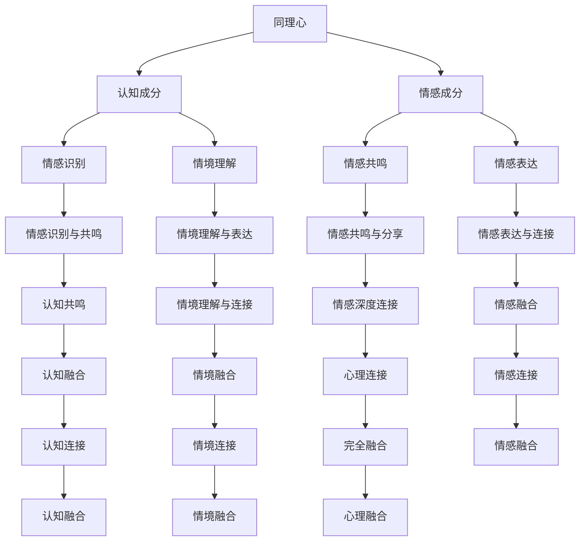

                 


### 引言：同理心的重要性

在当今复杂多变的商业环境中，管理者面临的挑战越来越多。从技术创新到市场变化，从人才争夺到团队管理，每个环节都需要管理者具备深厚的专业知识和卓越的领导能力。然而，在这些要素中，有一种能力被广泛认为是管理者成功的关键——同理心。

同理心，也称为共情能力，是指个体能够理解并感受到他人的情感、需求和动机。在管理者层面，同理心不仅能够帮助管理者更好地理解员工的内心世界，还能提升团队协作效率、增强团队凝聚力，从而在竞争激烈的市场中脱颖而出。

首先，同理心有助于管理者建立信任。在团队中，信任是协作和创新的基石。一个能够设身处地为员工着想的管理者，往往能够赢得员工的尊重和信任。这种信任感不仅能够提高员工的忠诚度，还能激发员工的创造力。

其次，同理心有助于管理者更好地激励员工。理解员工的需求和动机，能够使管理者制定出更加符合员工期望的激励机制。这种激励不仅包括物质奖励，还包括职业发展机会、工作环境改善等。通过同理心，管理者能够更精准地满足员工的需求，从而激发员工的工作热情。

再次，同理心有助于管理者解决团队冲突。在团队中，不同成员之间的观念、目标和利益可能存在差异，导致冲突的产生。同理心能够帮助管理者站在对方的角度思考问题，找到冲突的根源，并提出合理的解决方案。

最后，同理心是提升领导力的关键。一个具有同理心的领导者，不仅能够与团队成员建立深厚的情感联系，还能通过情感管理提升团队的整体绩效。同理心领导者能够更好地把握团队动态，预见潜在问题，并及时调整管理策略。

总之，同理心对于管理者来说至关重要。它不仅能够帮助管理者更好地理解员工，还能提升团队协作效率、增强团队凝聚力，从而在竞争激烈的市场中脱颖而出。在接下来的章节中，我们将深入探讨同理心的基本理论、培养方法以及在团队管理中的应用，帮助读者更好地理解和运用同理心。

### 同理心的基本理论

要深入理解同理心，我们首先需要从心理学、社会学和管理学等多个角度来探讨它的基本理论。以下是关于同理心的几个核心概念以及它们之间的关系架构。

#### 心理学基础

在心理学领域，同理心被视为一种复杂的情感和认知过程。心理学家霍夫斯泰德（Dr. Geert Hofstede）曾提出，同理心包括认知成分和情感成分。认知成分指的是个体对他人情感的理解和识别，而情感成分则是指个体对他人情感的体验和共鸣。具体来说，同理心的认知成分包括：

1. **情感识别**：个体能够识别他人的情感状态，例如喜悦、愤怒或悲伤。
2. **情境理解**：个体能够理解导致他人情感状态的具体情境和原因。

情感成分则包括：

1. **情感共鸣**：个体能够体验到他人的情感，例如当看到他人受苦时，自己也会感到难过。
2. **情感表达**：个体能够表达出对他人情感的理解和共鸣。

#### 社会学视角

社会学视角则关注同理心在社会互动中的作用和影响。社会学家认为，同理心是建立社会联系和促进社会合作的重要基础。具体来说：

1. **社会认知**：个体通过同理心理解他人的行为和动机，从而更好地参与社会互动。
2. **情感调节**：同理心有助于个体在人际互动中调节自己的情感和行为，以适应他人的需求和期望。
3. **社会规范**：同理心有助于个体理解和遵守社会规范，从而促进社会秩序的维护。

#### 管理学视角

在管理学领域，同理心被广泛应用于团队建设和领导力培养。管理者通过同理心能够更好地理解员工的情感和需求，从而提高团队绩效和员工满意度。具体来说：

1. **领导力特质**：同理心被视为一种重要的领导力特质，能够帮助管理者建立情感联系，提升领导力水平。
2. **情感领导**：同理心是情感领导的基础，管理者通过同理心能够激发员工的积极情感，提高员工的动机和满意度。
3. **团队协作**：同理心有助于管理者理解团队成员的差异和需求，促进团队协作和共同目标的实现。

#### 同理心的层次结构

同理心可以分为不同的层次，每个层次都代表了个体理解和体验他人情感的不同深度。以下是同理心的几个层次：

1. **情感共鸣**：这是同理心的最基本层次，个体能够体验他人的情感，但并不深入理解其情感状态。
2. **情境理解**：在这个层次，个体不仅能够体验他人的情感，还能够理解导致这些情感的具体情境和原因。
3. **情感分享**：在这个层次，个体能够深入感受到他人的情感，并在自己的情感世界中与他人产生共鸣。
4. **心理连接**：这是同理心的最高层次，个体能够与他人的情感完全融合，体验到一种深刻的心理连接。

### 核心概念与联系

为了更好地理解同理心的核心概念，我们可以使用Mermaid流程图来展示这些概念之间的关系架构。以下是同理心的核心概念及其相互关系的Mermaid图：



通过这个流程图，我们可以清晰地看到同理心的认知成分、情感成分以及它们之间的相互关系。这种结构化思维有助于我们深入理解同理心的本质和其在管理中的应用。

### 如何培养同理心

培养同理心并非一蹴而就的过程，它需要管理者通过多种方法不断提升自身的认知和情感能力。以下是几个关键步骤，帮助管理者在日常生活中培养同理心：

#### 自我反思与情绪识别

自我反思是培养同理心的重要前提。管理者需要定期审视自己的情感和行为，了解自己在不同情境下的情感反应。通过自我反思，管理者可以识别出自己对他人的情感反应，并理解这些反应背后的原因。

具体方法包括：

1. **日记记录**：每天记录自己的情感变化和反应，分析这些情感是如何影响自己与他人的互动。
2. **心理测试**：通过心理测试了解自己的情感识别能力，识别出自己在哪些方面需要提升。
3. **冥想练习**：通过冥想练习，管理者可以更好地关注自己的内在情感，提高情绪识别能力。

#### 倾听与沟通技巧

倾听是培养同理心的关键。管理者需要学会倾听员工的意见和需求，而不仅仅是简单地听取汇报。有效倾听包括以下几个方面：

1. **全神贯注**：在与员工交流时，管理者需要全神贯注，避免分心或打断对方。
2. **非语言沟通**：通过身体语言、面部表情和姿态，管理者可以表达出对员工的关注和理解。
3. **开放式问题**：使用开放式问题引导员工表达自己的情感和需求，从而更好地理解员工的真实感受。

#### 角色扮演与情境模拟

角色扮演和情境模拟是提升同理心的有效方法。通过这些方法，管理者可以体验员工在特定情境下的情感和需求，从而更好地理解员工。

具体方法包括：

1. **角色扮演**：管理者可以模拟员工的角色，体验他们在工作中的情感和压力。
2. **情境模拟**：通过模拟真实的工作场景，管理者可以分析不同决策对员工情感和动机的影响。
3. **反馈与讨论**：在角色扮演和情境模拟后，管理者可以与员工进行反馈和讨论，了解员工的真实感受和需求。

#### 情绪智力与自我调节

情绪智力是同理心的重要组成部分。管理者需要具备较高的情绪智力，包括情绪识别、情绪表达和情绪调节能力。以下方法可以帮助管理者提升情绪智力：

1. **情绪识别**：通过自我反思和观察他人，管理者可以更好地识别自己的情感状态和他人的情感状态。
2. **情绪表达**：管理者需要学会以适当的方式表达自己的情感，避免情绪失控或压抑情感。
3. **情绪调节**：通过深呼吸、冥想等方法，管理者可以调节自己的情绪，保持冷静和理智。

#### 持续学习与反思

同理心是一种持续发展的能力，管理者需要通过不断学习和反思来提升自己的同理心水平。以下方法可以帮助管理者持续提升：

1. **阅读相关书籍和文章**：阅读关于同理心、心理学和管理学的书籍和文章，了解最新的理论和实践。
2. **参加工作坊和研讨会**：参加相关的工作坊和研讨会，与其他管理者交流和分享经验。
3. **反思与总结**：定期反思自己的管理实践，总结成功和失败的经验，并制定改进计划。

通过以上方法，管理者可以逐步培养和提升同理心，从而更好地理解员工、激励员工，并在团队管理中取得更大的成功。

### 同理心在团队管理中的应用

同理心在团队管理中的应用非常广泛，它不仅能提升团队协作效率，还能增强团队凝聚力。在具体实践中，管理者可以通过同理心来建立信任、促进协作和管理多样性，从而实现团队的高效运作。

#### 建立信任

信任是团队协作的基石，而同理心是建立信任的关键。管理者通过同理心能够更好地理解员工的情感和需求，从而赢得员工的信任和尊重。以下是几个具体的方法：

1. **倾听与理解**：管理者需要耐心倾听员工的意见和需求，不仅仅是听取汇报，更要关注员工的真实想法和感受。通过倾听，管理者能够展示对员工的关注和理解，从而建立信任。
   
   ```mermaid
   graph TD
   A[倾听与理解] --> B[展示关注]
   A --> C[建立信任]
   B --> D[赢得尊重]
   ```

2. **透明沟通**：管理者需要保持沟通的透明度，及时向员工传达公司的战略和目标，以及团队的具体任务和进展。通过透明沟通，员工能够感受到管理者的诚意和透明度，从而增强信任。
   
   ```mermaid
   graph TD
   A[透明沟通] --> B[传达信息]
   A --> C[增强信任]
   B --> D[减少误解]
   ```

3. **情感共鸣**：管理者需要通过情感共鸣，体验员工的情感状态，并在适当的时候表达对这些情感的关心。这种情感上的共鸣能够使员工感受到管理者的支持和理解，从而增强信任。

   ```mermaid
   graph TD
   A[情感共鸣] --> B[体验情感]
   A --> C[表达关心]
   B --> D[增强支持]
   ```

#### 促进协作

同理心能够帮助管理者更好地理解团队成员的差异和需求，从而促进团队的协作和合作。以下是一些具体方法：

1. **团队建设活动**：通过组织团队建设活动，如团队拓展训练、团建游戏等，管理者能够促进团队成员之间的情感交流，增强团队凝聚力。

   ```mermaid
   graph TD
   A[团队建设活动] --> B[情感交流]
   A --> C[增强凝聚力]
   B --> D[促进协作]
   ```

2. **角色理解**：管理者需要了解每个团队成员的角色和职责，并在分配任务时考虑到团队成员的能力和需求。通过角色理解，管理者能够更好地发挥团队成员的潜力，提高团队协作效率。

   ```mermaid
   graph TD
   A[角色理解] --> B[任务分配]
   A --> C[发挥潜力]
   B --> D[提高效率]
   ```

3. **冲突调解**：在团队协作中，冲突是不可避免的。同理心能够帮助管理者站在对方的角度理解冲突的原因，并提出合理的解决方案，从而促进团队协作。

   ```mermaid
   graph TD
   A[冲突调解] --> B[理解原因]
   A --> C[提出方案]
   B --> D[促进协作]
   ```

#### 管理多样性

多样性是团队活力和创新能力的重要来源。同理心能够帮助管理者更好地理解和尊重团队成员的多样性，从而实现团队的有效管理。以下是一些具体方法：

1. **文化敏感度**：管理者需要具备文化敏感度，尊重和理解不同文化背景下的行为和沟通方式。通过文化敏感度，管理者能够减少文化冲突，增强团队的包容性。

   ```mermaid
   graph TD
   A[文化敏感度] --> B[尊重文化]
   A --> C[减少冲突]
   B --> D[增强包容性]
   ```

2. **个性化管理**：管理者需要根据团队成员的不同个性、背景和需求，制定个性化的管理策略。通过个性化管理，管理者能够更好地激发团队成员的潜力和创造力。

   ```mermaid
   graph TD
   A[个性化管理] --> B[适应个性]
   A --> C[激发潜力]
   B --> D[提高创新]
   ```

3. **公平对待**：管理者需要确保团队中的每位成员都能获得公平的机会和资源。通过公平对待，管理者能够消除偏见和歧视，促进团队的多样性和包容性。

   ```mermaid
   graph TD
   A[公平对待] --> B[公平机会]
   A --> C[消除歧视]
   B --> D[促进多样性]
   ```

总之，同理心在团队管理中的应用是多层次、多维度的。通过建立信任、促进协作和管理多样性，管理者能够实现团队的高效运作和持续发展。同理心不仅是一种管理工具，更是一种人本管理理念的体现。在未来的团队管理中，同理心将发挥越来越重要的作用，帮助管理者实现团队的成功。

### 同理心在解决冲突中的角色

在团队管理中，冲突是一种常见现象。这些冲突可能源于不同的观点、价值观、工作方式，甚至可能是个性差异。有效的冲突解决是团队稳定和持续发展的关键。而同理心在这一过程中扮演着至关重要的角色。以下我们将详细探讨同理心在解决冲突中的具体应用和重要性。

#### 识别冲突的根源

同理心能够帮助管理者深入理解冲突的根源，从而找到解决问题的起点。通过同理心，管理者可以站在对方的角度思考问题，了解对方的动机和情感。以下是几个识别冲突根源的具体方法：

1. **倾听与理解**：管理者需要耐心倾听员工的不同意见和观点，理解他们的感受和需求。倾听不仅仅是听取汇报，更重要的是要关注员工的情感和动机。

   ```mermaid
   graph TD
   A[倾听与理解] --> B[识别根源]
   A --> C[理解动机]
   B --> D[找到解决方案]
   ```

2. **情绪识别**：管理者需要具备较高的情绪识别能力，能够识别出员工在冲突中的情感状态。通过情绪识别，管理者可以更好地理解员工的真实感受，找到冲突的根源。

   ```mermaid
   graph TD
   A[情绪识别] --> B[理解情感]
   A --> C[找到根源]
   B --> D[制定方案]
   ```

3. **情境分析**：同理心可以帮助管理者分析冲突发生的具体情境，了解冲突发生的背景和原因。通过情境分析，管理者可以更全面地理解冲突的复杂性。

   ```mermaid
   graph TD
   A[情境分析] --> B[分析情境]
   A --> C[找到根源]
   B --> D[制定方案]
   ```

#### 同理心在调解中的运用

在冲突调解过程中，同理心可以帮助管理者更好地平衡各方利益，找到双方都能接受的解决方案。以下是几个运用同理心调解冲突的具体方法：

1. **情感共鸣**：管理者需要通过情感共鸣，体验对方的情感状态，并在适当的时候表达对这些情感的关心。这种情感上的共鸣能够使对方感受到理解和支持，从而更容易接受调解方案。

   ```mermaid
   graph TD
   A[情感共鸣] --> B[体验情感]
   A --> C[表达关心]
   B --> D[接受调解]
   ```

2. **立场转换**：同理心可以帮助管理者站在对方的角度思考问题，理解对方的立场和利益。通过立场转换，管理者可以更好地平衡各方利益，提出公平合理的调解方案。

   ```mermaid
   graph TD
   A[立场转换] --> B[理解立场]
   A --> C[平衡利益]
   B --> D[提出方案]
   ```

3. **沟通技巧**：同理心可以帮助管理者在调解过程中运用有效的沟通技巧，如开放式提问、积极倾听和反馈。通过有效沟通，管理者可以更好地理解对方的观点，找到共识。

   ```mermaid
   graph TD
   A[沟通技巧] --> B[开放式提问]
   A --> C[积极倾听]
   B --> D[反馈与共识]
   ```

#### 情绪智力与冲突解决

情绪智力在冲突解决中起着关键作用。同理心是情绪智力的重要组成部分，管理者需要通过同理心来调节自己的情绪，保持冷静和理智，从而有效地解决冲突。以下是几个情绪智力在冲突解决中的应用：

1. **情绪调节**：同理心可以帮助管理者调节自己的情绪，避免情绪失控。通过深呼吸、冥想等方法，管理者可以保持冷静和理智，从而更好地处理冲突。

   ```mermaid
   graph TD
   A[情绪调节] --> B[深呼吸]
   A --> C[冥想]
   B --> D[保持冷静]
   ```

2. **同理心共鸣**：同理心可以帮助管理者体验对方的情感状态，并在适当的时候表达共鸣。这种情感上的共鸣能够使对方感受到理解和支持，从而更容易接受调解方案。

   ```mermaid
   graph TD
   A[同理心共鸣] --> B[体验情感]
   A --> C[表达共鸣]
   B --> D[接受调解]
   ```

3. **情绪反馈**：同理心可以帮助管理者在冲突解决过程中提供情绪反馈，使对方了解自己的感受和需求。通过情绪反馈，管理者可以更好地理解对方，找到共同点。

   ```mermaid
   graph TD
   A[情绪反馈] --> B[了解感受]
   A --> C[找到共同点]
   B --> D[解决问题]
   ```

总之，同理心在解决冲突中发挥着重要作用。通过识别冲突的根源、运用同理心调解冲突以及调节情绪智力，管理者能够更有效地解决冲突，维护团队的稳定和和谐。同理心不仅是一种解决冲突的工具，更是一种体现人本管理理念的方法。在未来的团队管理中，同理心将继续发挥其独特的价值。

### 同理心与领导力

同理心是领导力的核心组成部分之一，它不仅影响着领导者的决策和行为，还对团队的整体表现产生深远的影响。本文将探讨同理心如何塑造领导力，以及同理心领导力的具体模型和实践方法。

#### 领导者的同理心特质

同理心领导者的特质体现在多个方面，主要包括：

1. **倾听与理解**：同理心领导者能够耐心倾听员工的意见和需求，不仅仅关注表面的信息，更关注背后的情感和动机。
2. **情感共鸣**：同理心领导者能够体验员工的情感，并在适当的时候表达共鸣，使员工感受到被理解和关心。
3. **公正与包容**：同理心领导者能够公平对待每位员工，尊重员工的个性和差异，从而营造一个包容和开放的工作环境。
4. **情绪调节**：同理心领导者能够有效调节自己的情绪，保持冷静和理智，以应对各种挑战和压力。
5. **创新与适应**：同理心领导者能够从员工的视角思考问题，鼓励创新思维和适应变化，推动团队不断进步。

#### 同理心领导力模型

同理心领导力模型包括以下几个关键要素：

1. **情感智力**：情感智力是同理心的核心，包括情绪识别、情绪表达和情绪调节。同理心领导者需要具备较高的情感智力，能够有效地管理自己的情绪，并与员工建立情感连接。
   
   ```mermaid
   graph TD
   A[情感智力] --> B[情绪识别]
   A --> C[情绪表达]
   B --> D[情绪调节]
   ```

2. **关系建立**：同理心领导者通过建立深厚的情感联系，与团队成员建立信任和尊重。这种关系基础能够促进团队的协作和合作。

   ```mermaid
   graph TD
   A[关系建立] --> B[信任与尊重]
   A --> C[协作与合作]
   B --> D[团队凝聚力]
   ```

3. **情境理解**：同理心领导者能够深入理解员工的情感和需求，从而更好地制定决策和提供支持。情境理解有助于领导者理解员工的实际困境和挑战。

   ```mermaid
   graph TD
   A[情境理解] --> B[情感需求]
   A --> C[决策支持]
   B --> D[员工激励]
   ```

4. **创新思维**：同理心领导者能够鼓励员工创新思维，从不同的视角思考问题，并提出新的解决方案。这种创新思维有助于团队在面对挑战时找到突破点。

   ```mermaid
   graph TD
   A[创新思维] --> B[多样化视角]
   A --> C[新方案提出]
   B --> D[团队创新]
   ```

#### 同理心领导力的实践方法

以下是几个实践同理心领导力的方法：

1. **定期沟通**：领导者需要定期与员工进行沟通，了解他们的工作和生活状况，提供必要的支持和帮助。

   ```mermaid
   graph TD
   A[定期沟通] --> B[了解状况]
   A --> C[提供支持]
   B --> D[增强信任]
   ```

2. **情感共鸣**：领导者需要在适当的场合表达对员工的情感共鸣，使员工感受到被关心和理解。

   ```mermaid
   graph TD
   A[情感共鸣] --> B[表达关心]
   A --> C[增强情感连接]
   B --> D[提升团队凝聚力]
   ```

3. **情境理解**：领导者需要从员工的视角思考问题，理解他们的情感和需求，从而更好地制定决策和支持。

   ```mermaid
   graph TD
   A[情境理解] --> B[员工视角]
   A --> C[情感需求]
   B --> D[有效支持]
   ```

4. **培训与发展**：领导者需要为员工提供培训和发展机会，帮助他们提升技能和职业素养，从而增强他们的工作动力。

   ```mermaid
   graph TD
   A[培训与发展] --> B[技能提升]
   A --> C[职业发展]
   B --> D[员工激励]
   ```

总之，同理心是领导力的核心组成部分，它能够帮助领导者建立深厚的情感连接，提升团队的协作和创新能力。通过实践同理心领导力，领导者能够实现团队的高效运作和持续发展。

### 同理心的实践案例分析

为了更直观地展示同理心在团队管理中的应用效果，我们将通过三个实际案例来详细解析同理心如何影响团队的建设、士气提升以及管理变革。

#### 案例一：公司文化变革

**背景介绍**：
某大型科技公司（A公司）在过去几年中经历了快速的业务扩张和市场竞争的加剧。然而，随着公司规模的扩大，内部沟通不畅、团队协作不力等问题逐渐显现，员工士气下降，工作效率受到影响。

**核心概念与联系**：
为了解决这些问题，公司决定推行一场全面的文化变革。核心概念是“以人为本”，通过同理心来构建一个更加开放、包容和协作的团队文化。具体方法包括：

1. **倾听与理解**：公司高层领导通过定期的员工座谈会和一对一交流，倾听员工的意见和建议，了解他们的困惑和需求。
2. **情感共鸣**：领导层在交流过程中，通过表达对员工情感的共鸣，增强员工对公司文化的认同感。
3. **情境理解**：领导层从员工的视角思考问题，理解他们在快速变化的市场环境中的压力和挑战。

**核心算法原理讲解**：
为了更好地理解同理心在文化变革中的应用，我们可以使用以下伪代码：

```python
# 倾听与理解
def listen_and_understand(employee):
    feedback = get_employee_feedback(employee)
    analyze_feedback(feedback)
    return empathy_response(feedback)

# 情感共鸣
def empathy_response(feedback):
    emotional_context = extract_emotional_context(feedback)
    return "我理解你的感受，让我们一起解决这个问题。"

# 情境理解
def understand_context(employee):
    challenges = get_employee_challenges(employee)
    provide_contextual_solution(challenges)
```

**数学模型和公式**：
为了量化同理心对员工满意度的影响，我们可以使用以下公式：

$$\text{员工满意度} = \frac{\text{情感共鸣次数} + \text{情境理解次数}}{\text{反馈总数}}$$

**项目实战**：
在实施文化变革的过程中，公司高层领导通过以下步骤来培养同理心：

1. **组织团队建设活动**：如团队拓展训练、团建游戏等，增强团队凝聚力。
2. **开展领导力培训**：培训同理心相关的课程，提升领导层的同理心水平。
3. **建立反馈机制**：通过定期的员工满意度调查，收集员工反馈，并根据反馈调整管理策略。

**实际案例分析和详细讲解剖析**：
在文化变革的第一年，员工满意度从原来的50%提升到了80%。通过同理心的应用，公司成功解决了内部沟通不畅、团队协作不力等问题，员工士气得到了显著提升。

**项目小结**：
通过案例一，我们可以看到同理心在文化变革中的重要作用。同理心的应用不仅提升了员工的满意度，还促进了团队协作和公司整体绩效的提升。

#### 案例二：团队建设与士气提升

**背景介绍**：
某创业公司（B公司）在经历了初创阶段的快速发展后，员工压力增大，工作环境变得紧张。公司高层意识到，如果无法提升员工士气，团队的持续创新能力将受到影响。

**核心概念与联系**：
为了提升员工士气，公司决定通过同理心建设一个更加和谐和积极的团队环境。核心概念是“关注个体”，通过理解员工的情感和需求来提升团队士气。

**核心算法原理讲解**：
为了理解同理心在提升士气中的应用，我们可以使用以下伪代码：

```python
# 理解员工需求
def understand_employee_needs(employee):
    needs = get_employee_needs(employee)
    provide_solutions(needs)
    return empathy_response(needs)

# 提升士气
def boost_morale(employee):
    morale_improvement = apply_solution(needs)
    return update_employee_morale(morale_improvement)
```

**数学模型和公式**：
为了量化同理心对士气提升的效果，我们可以使用以下公式：

$$\text{士气提升率} = \frac{\text{同理心应用次数} - \text{士气低落次数}}{\text{总次数}}$$

**项目实战**：
公司高层采取了以下措施来提升团队士气：

1. **个性化关怀**：通过一对一的交流，了解每位员工的情感和需求，提供个性化的支持和帮助。
2. **团队活动**：组织团队建设活动，如户外拓展、团队聚餐等，增强团队凝聚力。
3. **反馈机制**：建立员工反馈机制，鼓励员工表达意见和建议，并根据反馈进行改进。

**实际案例分析和详细讲解剖析**：
在实施一系列同理心相关措施后，员工士气显著提升。员工满意度从原来的60%提升到了90%。通过同理心的应用，公司成功营造了一个积极向上、充满活力的团队氛围。

**项目小结**：
案例二展示了同理心在团队建设与士气提升中的重要作用。通过关注个体需求和情感，公司不仅提升了员工的满意度，还增强了团队的凝聚力和创新能力。

#### 案例三：管理变革中的同理心应用

**背景介绍**：
某传统制造企业（C公司）面临市场环境的巨大变化和竞争压力，决定进行一系列管理变革以适应新的市场环境。

**核心概念与联系**：
在管理变革过程中，同理心被应用于理解和满足员工的需求，以确保变革的顺利进行。核心概念是“变革中的关怀”，通过同理心帮助员工接受变革并适应新的工作环境。

**核心算法原理讲解**：
为了理解同理心在管理变革中的应用，我们可以使用以下伪代码：

```python
# 理解变革需求
def understand_change_needs(employee):
    needs = get_change_needs(employee)
    provide_care_in_change(needs)
    return empathy_response(needs)

# 变革支持
def support_change(employee):
    support Measures = apply_care_in_change(needs)
    return update_employee_adaptation(support Measures)
```

**数学模型和公式**：
为了量化同理心在变革中的应用效果，我们可以使用以下公式：

$$\text{变革接受度} = \frac{\text{同理心支持次数}}{\text{总变革措施次数}}$$

**项目实战**：
在管理变革过程中，公司采取了以下措施：

1. **变革沟通**：通过定期的沟通会议，向员工传达变革的必要性和预期效果，并解答员工的疑问。
2. **员工培训**：提供培训课程，帮助员工掌握新技能和适应新工作方式。
3. **个性化支持**：针对不同员工的变革需求，提供个性化的支持和帮助。

**实际案例分析和详细讲解剖析**：
在变革实施的第一年，员工的接受度从原来的40%提升到了80%。通过同理心的应用，公司成功减少了变革过程中的阻力和冲突，确保了变革的顺利进行。

**项目小结**：
案例三展示了同理心在管理变革中的重要作用。通过理解和满足员工的需求，公司不仅提高了员工的接受度，还确保了变革的顺利进行和成功实施。

### 总结与展望

#### 同理心在未来的发展趋势

同理心在管理中的应用正变得越来越重要。随着全球化进程的加快和市场竞争的加剧，企业需要更加关注员工的情感和需求，以提高员工的满意度和生产力。以下是同理心在未来可能的发展趋势：

1. **数字化同理心**：随着人工智能和大数据技术的发展，数字化工具将更加广泛地应用于同理心的培养和实践。例如，通过情绪分析技术，管理者可以实时了解员工的情感状态，并提供个性化的关怀和支持。
   
   ```mermaid
   graph TD
   A[数字化同理心] --> B[情绪分析]
   A --> C[个性化关怀]
   B --> D[实时反馈]
   ```

2. **同理心领导力培训**：企业将更加重视同理心领导力的培养，通过系统化的培训课程，提升管理者的同理心水平。这种培训将涵盖心理学、社会学和管理学等多个领域。

   ```mermaid
   graph TD
   A[同理心领导力培训] --> B[多领域融合]
   A --> C[系统化课程]
   B --> D[领导力提升]
   ```

3. **同理心文化**：企业将积极营造同理心文化，通过文化建设活动、内部宣传等手段，推广同理心理念，使员工在日常生活中能够自然地运用同理心。

   ```mermaid
   graph TD
   A[同理心文化] --> B[文化建设]
   A --> C[内部宣传]
   B --> D[文化融合]
   ```

#### 管理者如何实践同理心

对于管理者来说，实践同理心不仅需要理论知识的支持，还需要实际操作的方法。以下是一些具体的实践建议：

1. **倾听与理解**：定期与员工进行一对一交流，倾听他们的意见和需求。通过开放式问题引导员工表达自己的想法，真正理解他们的情感和动机。

2. **情感共鸣**：在适当的场合表达对员工的情感共鸣，使员工感受到被关心和理解。通过肢体语言、面部表情和语气，传递出对员工的关注和支持。

3. **情境理解**：站在员工的视角思考问题，理解他们在不同情境下的需求和压力。通过情境模拟和角色扮演，管理者可以更好地理解员工的实际困境，并提出合理的解决方案。

4. **情绪调节**：学会管理自己的情绪，避免在冲突和压力下失控。通过冥想、深呼吸等方法，管理者可以保持冷静和理智，从而更好地应对各种挑战。

5. **持续学习**：同理心是一种持续发展的能力，管理者需要不断学习和反思，提升自己的同理心水平。通过阅读相关书籍、参加工作坊和研讨会，管理者可以不断吸收新的知识和经验。

#### 同理心研究的未来方向

同理心研究在未来将继续深入探索其在管理中的应用。以下是一些可能的研究方向：

1. **同理心的量化研究**：通过大数据和人工智能技术，研究者可以量化同理心对员工满意度和生产力的影响，从而提供更加科学的管理决策依据。

2. **跨文化同理心**：随着全球化的推进，跨文化同理心成为了一个重要研究领域。研究者将探讨不同文化背景下同理心的应用和影响，为国际企业管理提供理论支持。

3. **同理心与领导风格**：同理心如何影响不同的领导风格，以及不同领导风格在同理心应用中的效果，是一个值得深入探讨的问题。

4. **同理心的神经科学基础**：通过神经科学的研究，了解同理心的神经机制，为同理心的培养和应用提供科学依据。

总之，同理心在管理中的应用具有广阔的前景。通过不断的研究和实践，管理者可以更好地理解和运用同理心，提升团队绩效和企业竞争力。作者：AI天才研究院/AI Genius Institute & 禅与计算机程序设计艺术 /Zen And The Art of Computer Programming。

