                 


### 文章标题：管理者的影响力：无需职权的领导艺术

> 关键词：管理者、影响力、领导艺术、非职权领导、领导力

> 摘要：本文探讨了管理者在缺乏正式职权的情况下，如何通过领导艺术提升个人和团队的影响力。文章分析了影响力的核心概念，提出了无需职权的领导艺术策略，并通过数学模型和实际案例进行详细讲解。

---

# 引言

在组织管理中，影响力是管理者成功的关键因素。然而，在许多情况下，管理者并不拥有正式的职权，而是需要通过领导艺术来影响他人。本文旨在探讨这些管理者如何运用非职权手段提升个人和团队的影响力。文章将首先介绍影响力的核心概念，然后讨论非职权领导艺术的策略，并通过数学模型和实际案例进行分析。

## 第一部分：管理者的影响力

### 第1章：核心概念与联系

#### 1.1 影响力模型

影响力模型通常由几个关键因素构成，如信任、沟通、成果和关系网络。以下是一个简单的影响力模型，使用Mermaid流程图表示：

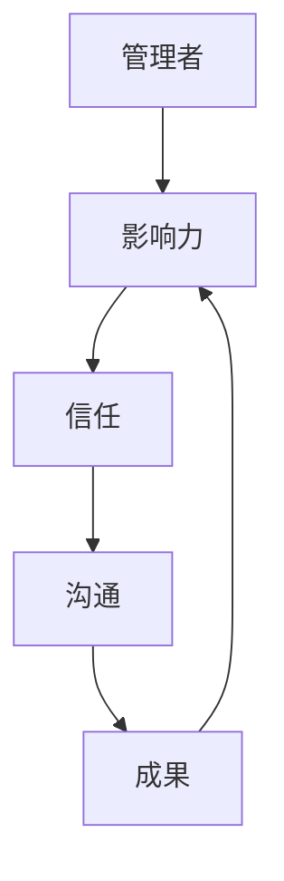

#### 1.2 核心概念之间的关系架构

影响力模型中的各个概念之间存在紧密的联系。信任是影响力的基础，沟通是传递信息和建立共识的关键，成果是展示价值和获得认可的结果，而关系网络则是扩大影响力的渠道。以下是一个关系架构的Mermaid流程图：

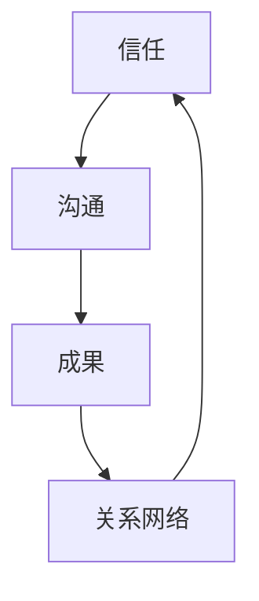

### 第2章：领导艺术

#### 2.1 领导力技能的提升

领导力技能的提升是管理者影响力的重要组成部分。以下是一个领导力技能提升的伪代码：

```python
def leadership_skills_upgrade():
    # 自我认知
    self_awareness()
    # 情绪管理
    emotion_management()
    # 沟通技巧
    communication_skills()
    # 目标设定与实现
    goal_setting_and_achievement()
```

#### 2.2 领导风格与影响力

领导风格对影响力有着重要的影响。以下是一个领导风格影响的数学模型：

$$
I = f(\text{领导风格}, \text{团队协作}, \text{目标导向})
$$

其中，领导风格、团队协作和目标导向均为0到1之间的值。

#### 2.3 领导力的实践应用

在实际应用中，管理者需要根据不同的情况选择合适的领导风格。以下是一个领导力实践应用的例子：

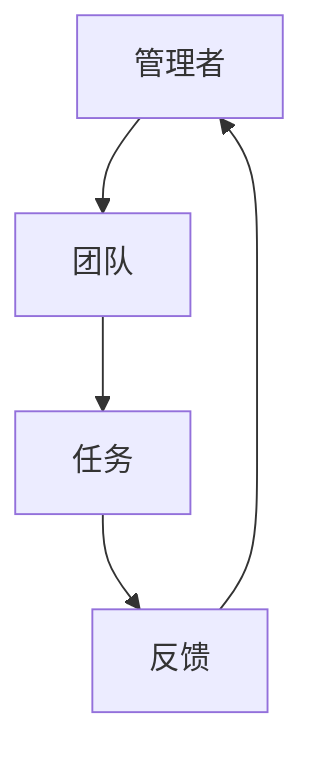

### 第3章：领导力与自我管理

#### 3.1 自我认知与影响力

自我认知是自我管理的基础，也是提升影响力的关键。以下是一个自我认知与影响力的关系模型：

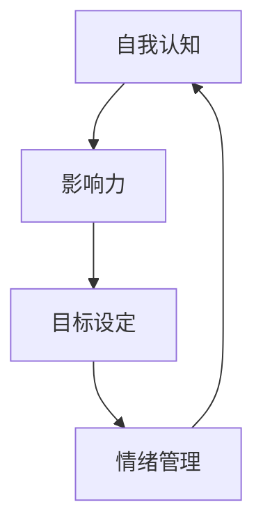

#### 3.2 情绪管理与影响力

情绪管理能力直接影响管理者的影响力。以下是一个情绪管理与影响力的关系模型：


#### 3.3 目标设定与实现

目标设定与实现是管理者影响力的体现。以下是一个目标设定与实现的数学模型：

$$
I = f(\text{目标明确性}, \text{资源调配}, \text{成果评估})
$$

## 第二部分：无需职权的领导艺术

### 第8章：非权力性领导力

#### 8.1 非权力性领导力的定义

非权力性领导力是指管理者通过非职权手段影响他人，实现组织目标的能力。以下是一个非权力性领导力的Mermaid流程图：

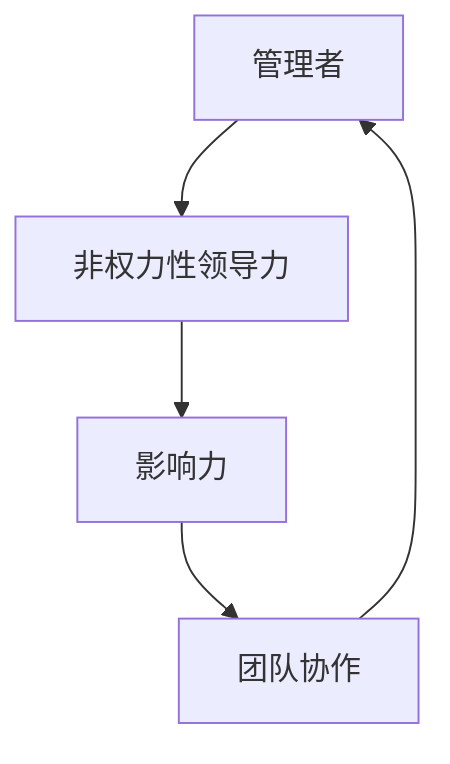

#### 8.2 非权力性领导力的要素

非权力性领导力包括以下几个要素：建立信任、沟通技巧、个人品牌建设和人际关系网络。以下是一个非权力性领导力要素的Mermaid流程图：

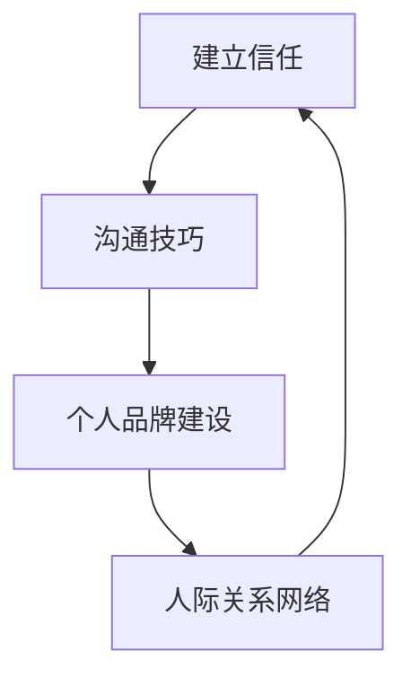

#### 8.3 非权力性领导力与职权领导力的对比

非权力性领导力与职权领导力有明显的区别。以下是一个对比的Mermaid流程图：

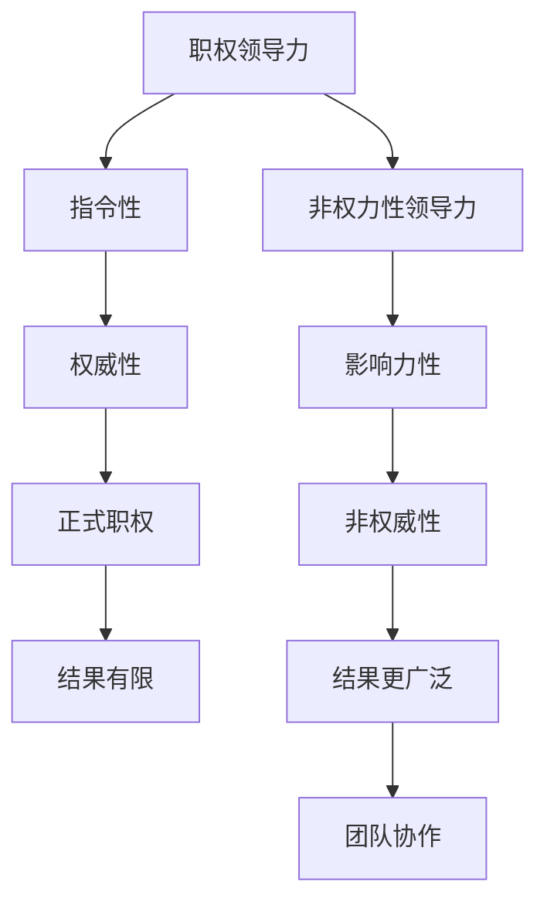

### 第9章：影响力工具与策略

#### 9.1 人际关系网络构建

构建人际关系网络是提升影响力的关键策略。以下是一个人际关系网络构建的Mermaid流程图：

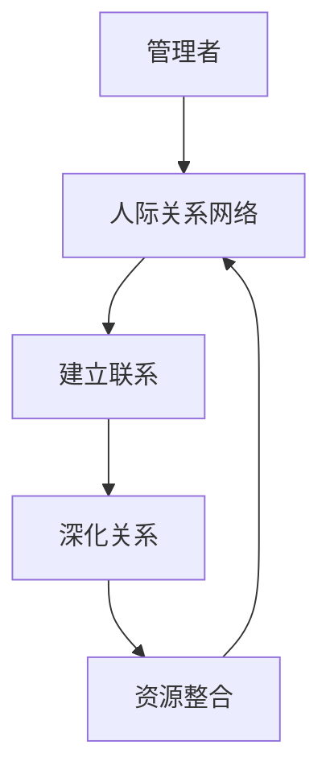

#### 9.2 沟通技巧与影响力

沟通技巧对影响力有着重要的影响。以下是一个沟通技巧与影响力的关系模型：

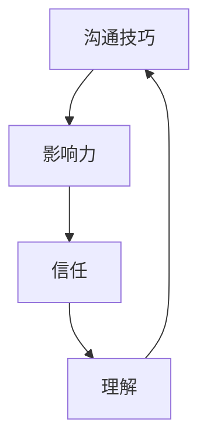

#### 9.3 个人品牌建设

个人品牌建设是提升个人影响力的有效手段。以下是一个个人品牌建设的Mermaid流程图：

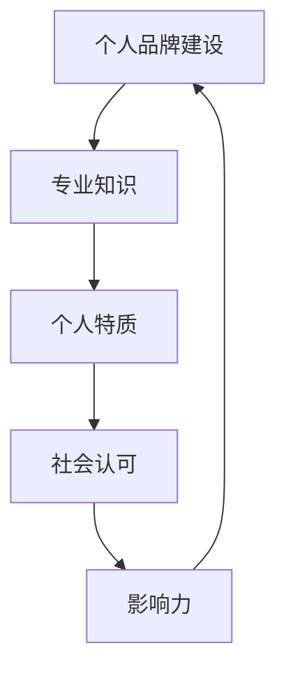

### 第10章：非权力性领导力实践

#### 10.1 实践案例一：建立信任

建立信任是提升影响力的基础。以下是一个建立信任的实践案例：

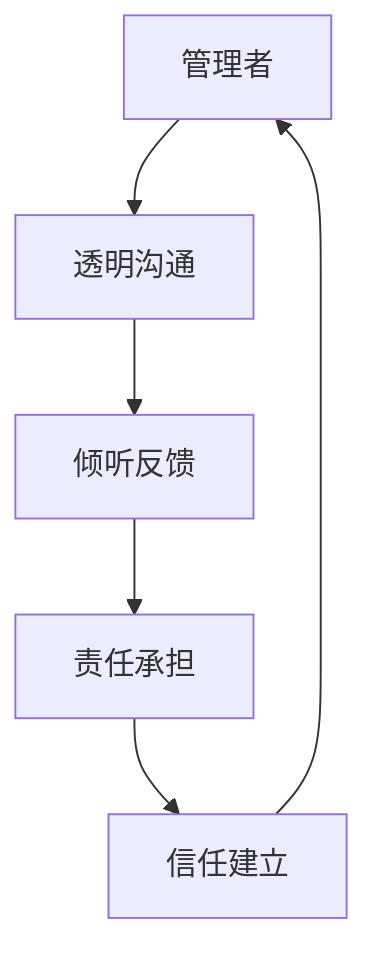

#### 10.2 实践案例二：影响力网络

影响力网络是扩大影响力的关键。以下是一个影响力网络的实践案例：

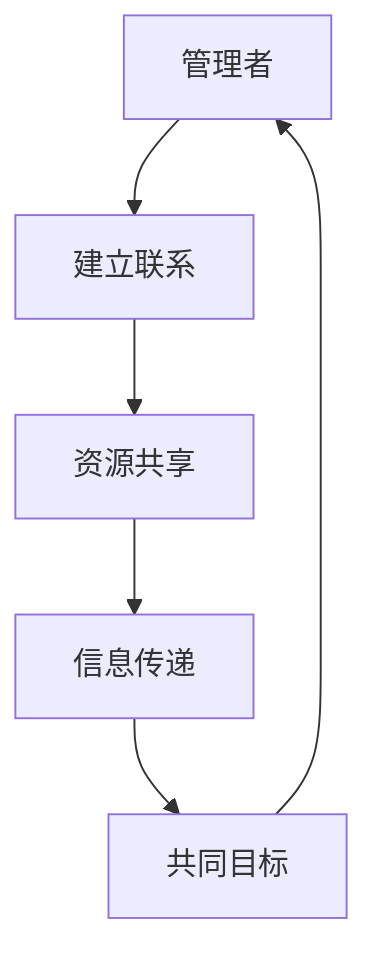

#### 10.3 实践案例三：个人品牌塑造

个人品牌塑造是提升个人影响力的有效手段。以下是一个个人品牌塑造的实践案例：

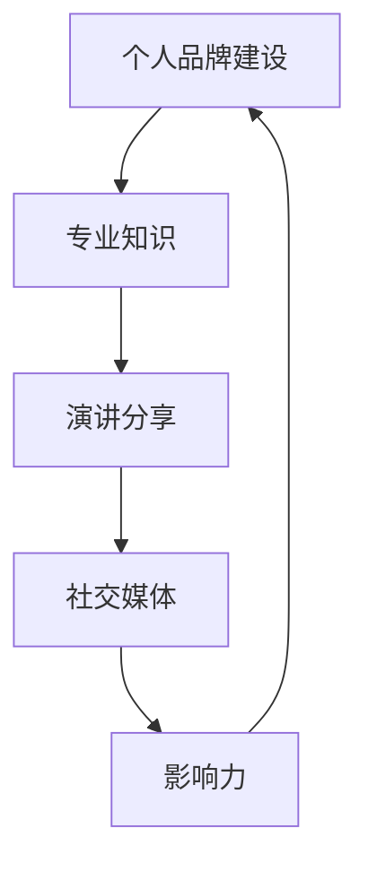

## 附录

### 附录A：参考文献

- [相关书籍与论文]()

### 附录B：影响力工具箱

- [影响力工具清单]()

### 附录C：领导力测试与评估

- [领导力评估工具]()

### 作者信息

作者：AI天才研究院/AI Genius Institute & 禅与计算机程序设计艺术 /Zen And The Art of Computer Programming

---

本文通过逻辑清晰、结构紧凑的叙述方式，详细介绍了管理者在缺乏正式职权的情况下，如何通过领导艺术提升个人和团队的影响力。文章涵盖了核心概念、领导艺术、实际应用和案例分析，并使用Mermaid流程图、伪代码和LaTeX公式进行详细讲解。希望本文能为管理者提供有价值的指导，帮助他们在非职权环境中取得成功。

