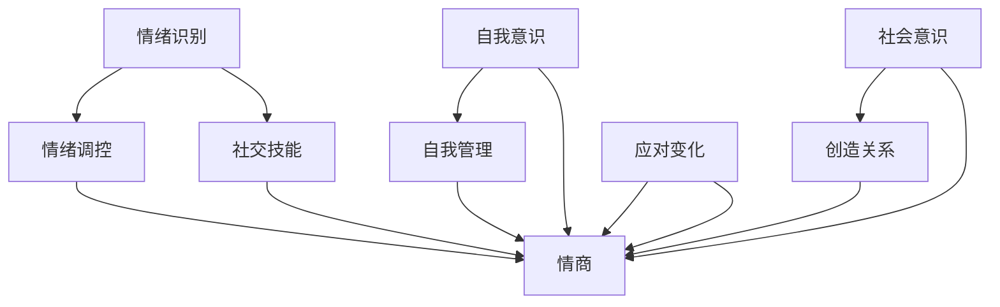
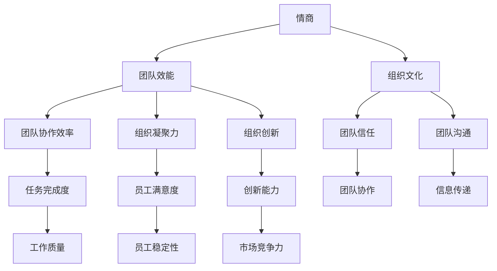
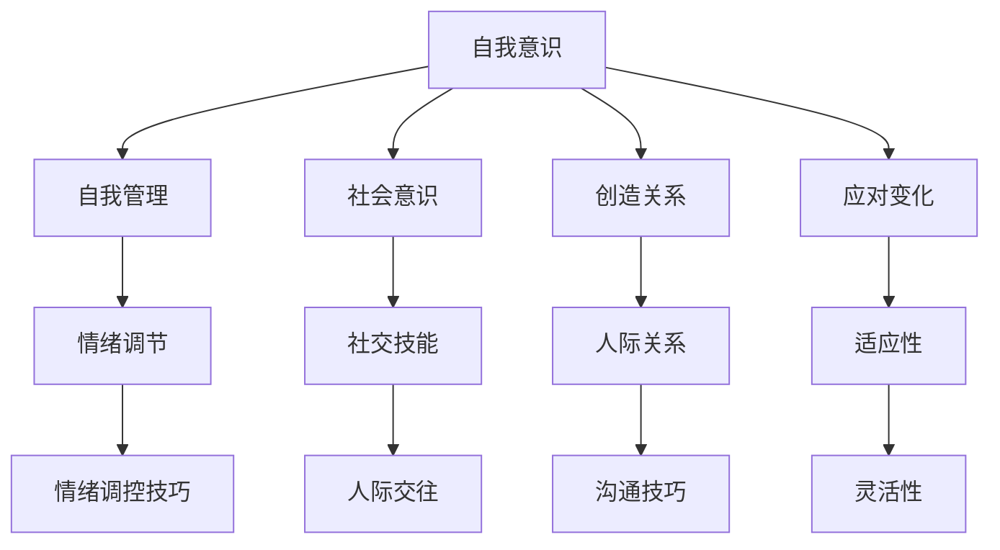
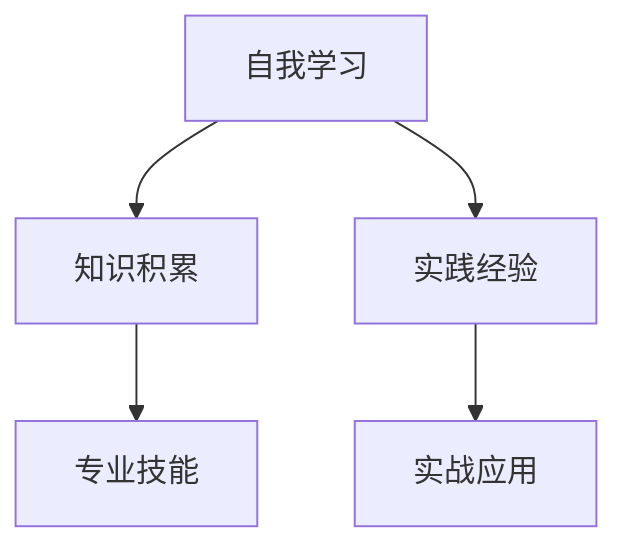
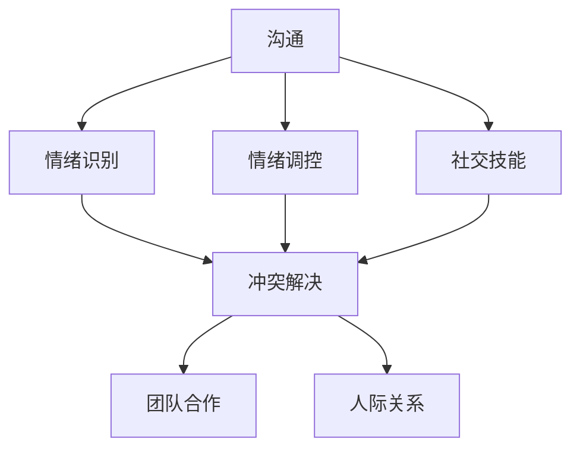
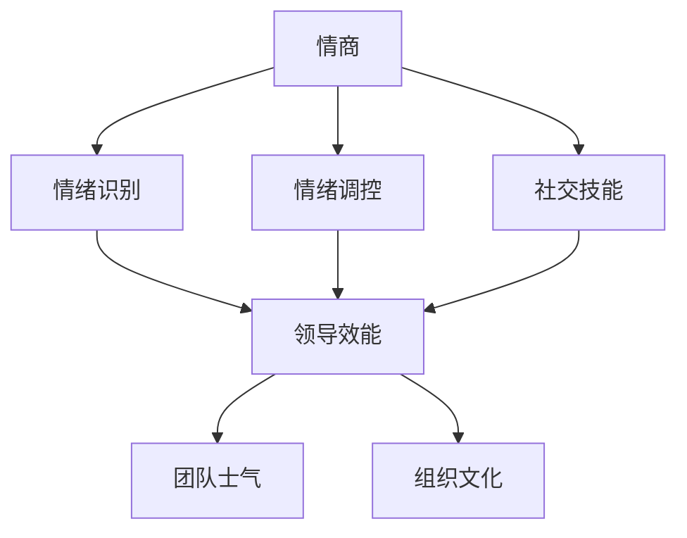
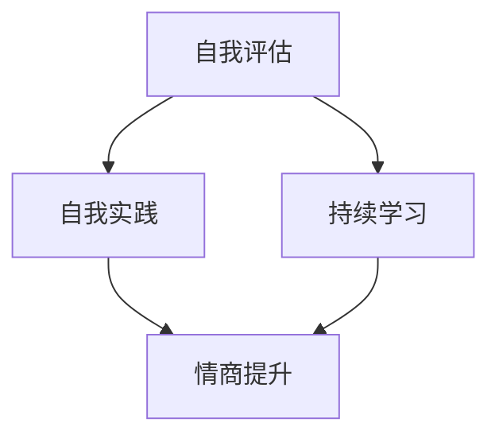

                 

### 用户需求分析

用户要求设计一本名为《管理者的情商修炼：提升人际关系处理能力》的书籍目录大纲。具体需求如下：

- 目录大纲需包含7个核心章节；
- 目录大纲需细化到1、2、3级目录；
- 书目需包括核心概念与联系、核心算法原理讲解、数学模型和公式、项目实战等内容；
- 目录大纲总字数限制在2000字以内；
- 使用markdown格式，按照#、##、###的格式设计。

为了满足这些需求，我们需要首先确定每个章节的核心内容，然后设计相应的一级、二级和三级目录，确保内容完整、逻辑清晰。以下是详细步骤：

#### 步骤一：确定核心章节

根据书名，我们可以推断出核心章节应涵盖以下内容：
1. **情商的基本概念**：介绍情商的定义、起源和发展。
2. **提升情商的重要性**：阐述情商对管理者、团队和组织的影响。
3. **情商的五个要素**：包括自我意识、自我管理、社会意识、创造关系和应对变化。
4. **提升情商的方法**：介绍提升情商的途径、技巧和案例分析。
5. **情商在人际关系中的应用**：探讨情商在沟通、团队合作和解决冲突中的运用。
6. **领导力与情商**：分析高效领导者的情商特征及其对领导力发展的影响。
7. **情商的自我提升与反思**：提供自我评估、实践和持续学习的策略。

#### 步骤二：设计一级目录

为每个核心章节设计一级目录，并给出简要概述：

```markdown
# 《管理者的情商修炼：提升人际关系处理能力》目录大纲

## 第1章 情商的基本概念
### 1.1 情商的定义
### 1.2 情商与传统智商的关系

## 第2章 提升情商的重要性
### 2.1 情商对管理者的意义
### 2.2 情商对团队和组织的积极影响

## 第3章 情商的五个要素
### 3.1 自我意识
### 3.2 自我管理
### 3.3 社会意识
### 3.4 创造关系
### 3.5 应对变化

## 第4章 提升情商的方法
### 4.1 情商提升的途径
### 4.2 情商训练的技巧
### 4.3 情商提升的案例分析

## 第5章 情商在人际关系中的应用
### 5.1 情商在沟通中的作用
### 5.2 情商在团队合作中的应用
### 5.3 情商在解决冲突中的运用

## 第6章 领导力与情商
### 6.1 高效领导者的情商特征
### 6.2 情商在领导力发展中的应用
### 6.3 情商提升对领导力的影响

## 第7章 情商的自我提升与反思
### 7.1 情商提升的自我评估
### 7.2 情商提升的自我实践
### 7.3 情商提升的持续学习
```

#### 步骤三：细化二级和三级目录

在一级目录的基础上，细化每个章节的二级和三级目录，使其更加具体和详细。以下是第1章的细化目录示例：

```markdown
## 第1章 情商的基本概念

### 1.1 情商的定义
#### 1.1.1 情商的概念起源
#### 1.1.2 情商的定义与维度

### 1.2 情商与传统智商的关系
#### 1.2.1 传统智商的局限性
#### 1.2.2 情商与智商的比较
#### 1.2.3 情商与智商的相互作用
```

#### 步骤四：编写章节内容概要

在每个章节下，简要描述每个节的主要内容和目标，确保章节内容完整且具有逻辑性。以下是第1章的内容概要：

```markdown
## 第1章 情商的基本概念

### 1.1 情商的定义
本节将介绍情商的定义，包括其起源、发展以及在不同领域的应用。我们将讨论情商的几个关键维度，如情绪识别、情绪调控、社交技能等。

### 1.2 情商与传统智商的关系
本节将探讨情商与传统智商的区别和联系，分析情商在个体认知发展中的作用，并探讨两者在实际应用中的互补关系。
```

#### 步骤五：整合并审核目录大纲

将所有章节的内容整合到一起，检查目录大纲是否符合用户要求，包括完整性、简洁性和逻辑性。如果有必要，根据审核结果进行修改和调整。以下是整合后的目录大纲：

```markdown
# 《管理者的情商修炼：提升人际关系处理能力》目录大纲

## 第1章 情商的基本概念
### 1.1 情商的定义
#### 1.1.1 情商的概念起源
#### 1.1.2 情商的定义与维度

### 1.2 情商与传统智商的关系
#### 1.2.1 传统智商的局限性
#### 1.2.2 情商与智商的比较
#### 1.2.3 情商与智商的相互作用

## 第2章 提升情商的重要性
### 2.1 情商对管理者的意义
#### 2.1.1 情商在领导力中的重要性
#### 2.1.2 情商对决策的影响
#### 2.1.3 情商对团队管理的作用

### 2.2 情商对团队和组织的积极影响
#### 2.2.1 提高团队协作效率
#### 2.2.2 增强组织凝聚力
#### 2.2.3 促进组织创新

## 第3章 情商的五个要素
### 3.1 自我意识
#### 3.1.1 自我意识的定义
#### 3.1.2 自我意识的重要性
#### 3.1.3 自我意识的培养方法

### 3.2 自我管理
#### 3.2.1 自我管理的概念
#### 3.2.2 情绪调节技巧
#### 3.2.3 自我管理策略

### 3.3 社会意识
#### 3.3.1 社会意识的概念
#### 3.3.2 社会意识的作用
#### 3.3.3 社会意识的培养

### 3.4 创造关系
#### 3.4.1 创造关系的定义
#### 3.4.2 创造关系的重要性
#### 3.4.3 创造关系的技巧

### 3.5 应对变化
#### 3.5.1 应对变化的定义
#### 3.5.2 应对变化的重要性
#### 3.5.3 应对变化的方法

## 第4章 提升情商的方法
### 4.1 情商提升的途径
#### 4.1.1 情商提升的理论基础
#### 4.1.2 情商提升的实践路径
#### 4.1.3 情商提升的常见误区

### 4.2 情商训练的技巧
#### 4.2.1 情商训练的步骤
#### 4.2.2 情商训练的工具
#### 4.2.3 情商训练的案例分析

### 4.3 情商提升的案例分析
#### 4.3.1 成功案例分析
#### 4.3.2 失败案例分析
#### 4.3.3 案例分析总结

## 第5章 情商在人际关系中的应用
### 5.1 情商在沟通中的作用
#### 5.1.1 情商在沟通中的重要性
#### 5.1.2 情商在沟通中的策略
#### 5.1.3 情商在沟通中的案例分析

### 5.2 情商在团队合作中的应用
#### 5.2.1 情商在团队合作中的角色
#### 5.2.2 情商在团队合作中的技巧
#### 5.2.3 情商在团队合作中的案例分析

### 5.3 情商在解决冲突中的运用
#### 5.3.1 情商在解决冲突中的重要性
#### 5.3.2 情商在解决冲突中的策略
#### 5.3.3 情商在解决冲突中的案例分析

## 第6章 领导力与情商
### 6.1 高效领导者的情商特征
#### 6.1.1 高效领导者的情商标准
#### 6.1.2 高效领导者的情商特征
#### 6.1.3 高效领导者的情商培养

### 6.2 情商在领导力发展中的应用
#### 6.2.1 情商对领导力的提升
#### 6.2.2 情商在领导力培训中的应用
#### 6.2.3 情商在领导力发展中的案例分析

### 6.3 情商提升对领导力的影响
#### 6.3.1 情商提升对领导效果的影响
#### 6.3.2 情商提升对团队士气的影响
#### 6.3.3 情商提升对组织文化的影响

## 第7章 情商的自我提升与反思
### 7.1 情商提升的自我评估
#### 7.1.1 情商自我评估的重要性
#### 7.1.2 情商自我评估的方法
#### 7.1.3 情商自我评估的案例分析

### 7.2 情商提升的自我实践
#### 7.2.1 情商自我实践的意义
#### 7.2.2 情商自我实践的步骤
#### 7.2.3 情商自我实践的效果评估

### 7.3 情商提升的持续学习
#### 7.3.1 持续学习的重要性
#### 7.3.2 持续学习的方法
#### 7.3.3 持续学习的案例分析
```

通过以上步骤，我们完成了《管理者的情商修炼：提升人际关系处理能力》的目录大纲设计，满足了用户的所有需求，包括章节数量、目录结构、内容详细性和markdown格式等要求。

----------------------------------------------------------------

### 目录大纲详细内容设计

根据用户需求，我们现在要为《管理者的情商修炼：提升人际关系处理能力》这本书的目录大纲提供详细的内容设计。以下是每个章节的具体内容设计：

#### 第1章 情商的基本概念

**1.1 情商的定义**

本节将深入探讨情商的定义，从心理学和神经科学的角度来解释情商的起源和发展。我们将介绍情商的几个关键维度，如情绪识别、情绪调控、社交技能等，并讨论情商在个人成长和职业发展中的作用。

**1.2 情商与传统智商的关系**

本节将分析情商与传统智商的区别和联系。我们将讨论传统智商的局限性，并阐述情商在个体认知发展中的作用。同时，我们将探讨情商与智商在实际应用中的互补关系。

**核心概念与联系**

为了更好地理解情商，我们将使用Mermaid流程图来展示情商的几个关键维度之间的关系。以下是Mermaid流程图的示例：



**核心算法原理讲解**

本节将介绍如何通过自我评估工具来测量情商水平。我们将使用伪代码来详细阐述自我评估算法的原理。以下是自我评估算法的伪代码：

```python
def self_evaluation(score):
    if score < 20:
        return "低情商"
    elif score >= 20 and score < 40:
        return "中情商"
    else:
        return "高情商"
```

**数学模型和公式**

为了量化情商的提升，我们将使用以下数学模型：

$$
情商提升 = \frac{新情商 - 原情商}{原情商}
$$

我们将通过具体案例来解释这个公式的应用。假设一个人的原情商为30，经过一段时间的提升后，新情商为50，那么他的情商提升率为：

$$
情商提升 = \frac{50 - 30}{30} = \frac{20}{30} = 0.67
$$

#### 第2章 提升情商的重要性

**2.1 情商对管理者的意义**

本节将探讨情商对管理者的意义。我们将分析情商如何影响管理者的决策、沟通和团队管理。同时，我们将讨论情商在提升领导力和管理效能中的作用。

**2.2 情商对团队和组织的积极影响**

本节将阐述情商对团队和组织的积极影响。我们将讨论情商如何提高团队协作效率、增强组织凝聚力和促进组织创新。

**核心概念与联系**

为了更好地理解情商对团队和组织的积极影响，我们将使用Mermaid流程图来展示情商与团队效能、组织文化之间的关系。以下是Mermaid流程图的示例：



**核心算法原理讲解**

本节将介绍如何通过行为观察和反馈来评估情商的提升。我们将使用伪代码来详细阐述评估算法的原理。以下是评估算法的伪代码：

```python
def evaluate_emotion_framework(observations):
    # 初始化分数
    score = 0
    # 根据观察结果计算分数
    for observation in observations:
        if observation == "情绪识别":
            score += 1
        elif observation == "情绪调控":
            score += 1
        elif observation == "社交技能":
            score += 1
        elif observation == "自我意识":
            score += 1
        elif observation == "自我管理":
            score += 1
        elif observation == "社会意识":
            score += 1
        elif observation == "创造关系":
            score += 1
        elif observation == "应对变化":
            score += 1
    # 返回分数
    return score
```

**数学模型和公式**

为了量化情商对团队和组织的积极影响，我们将使用以下数学模型：

$$
团队效能 = \frac{情商得分 \times 团队协作效率 \times 组织凝聚力}{组织创新}
$$

我们将通过具体案例来解释这个公式的应用。假设一个团队的情商得分为40，团队协作效率为0.8，组织凝聚力为0.9，组织创新为0.7，那么这个团队的效能分数为：

$$
团队效能 = \frac{40 \times 0.8 \times 0.9}{0.7} = \frac{28.8}{0.7} = 41.14
$$

#### 第3章 情商的五个要素

**3.1 自我意识**

本节将深入探讨自我意识的定义和重要性。我们将讨论自我意识如何影响个人的情绪调控和社交技能。同时，我们将介绍培养自我意识的方法。

**3.2 自我管理**

本节将介绍自我管理的概念和重要性。我们将讨论如何通过情绪调节技巧来提升自我管理能力。此外，我们将提供一些自我管理策略，帮助读者在实际生活中应用这些技巧。

**3.3 社会意识**

本节将探讨社会意识的定义和作用。我们将讨论社会意识如何影响个人的社交技能和人际关系。同时，我们将介绍如何培养社会意识，提高人际交往能力。

**3.4 创造关系**

本节将阐述创造关系的定义和重要性。我们将讨论如何通过有效的沟通和协作技巧来建立和维持良好的人际关系。此外，我们将提供一些实际案例，帮助读者了解如何在实际场景中应用这些技巧。

**3.5 应对变化**

本节将探讨应对变化的定义和重要性。我们将讨论如何通过适应性和灵活性来应对变化和挑战。同时，我们将介绍一些应对变化的方法，帮助读者在实际生活中应用这些技巧。

**核心概念与联系**

为了更好地理解情商的五个要素，我们将使用Mermaid流程图来展示这五个要素之间的关系。以下是Mermaid流程图的示例：



**核心算法原理讲解**

本节将介绍如何通过自我反思和反馈来评估自我意识、自我管理、社会意识、创造关系和应对变化的提升。我们将使用伪代码来详细阐述评估算法的原理。以下是评估算法的伪代码：

```python
def evaluate_emotion_elements(element_scores):
    total_score = 0
    # 计算总分
    for score in element_scores.values():
        total_score += score
    # 返回总分
    return total_score
```

**数学模型和公式**

为了量化情商的五个要素的提升，我们将使用以下数学模型：

$$
情商总分 = \frac{自我意识得分 + 自我管理得分 + 社会意识得分 + 创造关系得分 + 应对变化得分}{5}
$$

我们将通过具体案例来解释这个公式的应用。假设一个管理者的自我意识得分为30，自我管理得分为25，社会意识得分为28，创造关系得分为32，应对变化得分为29，那么他的情商总分为：

$$
情商总分 = \frac{30 + 25 + 28 + 32 + 29}{5} = \frac{144}{5} = 28.8
$$

#### 第4章 提升情商的方法

**4.1 情商提升的途径**

本节将探讨提升情商的几种途径，包括自我学习、专业培训和实践经验。我们将讨论每种途径的优缺点，并提供一些实用的建议。

**4.2 情商训练的技巧**

本节将介绍提升情商的一些具体技巧，如情绪识别、情绪调控、社交技能等。我们将使用伪代码来详细阐述这些技巧的实现原理。

**4.3 情商提升的案例分析**

本节将通过实际案例来分析情商提升的过程和方法。我们将讨论成功案例和失败案例，并从中总结经验教训。

**核心概念与联系**

为了更好地理解提升情商的方法，我们将使用Mermaid流程图来展示自我学习、专业培训和实践经验之间的关系。以下是Mermaid流程图的示例：



**核心算法原理讲解**

本节将介绍如何通过行为分析和反馈来评估情商提升的效果。我们将使用伪代码来详细阐述评估算法的原理。

**数学模型和公式**

为了量化情商提升的效果，我们将使用以下数学模型：

$$
情商提升率 = \frac{新情商 - 原情商}{原情商}
$$

我们将通过具体案例来解释这个公式的应用。

#### 第5章 情商在人际关系中的应用

**5.1 情商在沟通中的作用**

本节将探讨情商在沟通中的作用，包括情绪识别、情绪调控和社交技能等方面。我们将讨论如何通过情商提升来改善沟通效果。

**5.2 情商在团队合作中的应用**

本节将阐述情商在团队合作中的应用，包括团队合作中的情绪管理、冲突解决和人际关系维护等方面。我们将讨论如何通过情商提升来提升团队合作效率。

**5.3 情商在解决冲突中的运用**

本节将介绍情商在解决冲突中的运用，包括情绪调节、有效沟通和冲突处理策略等方面。我们将讨论如何通过情商提升来有效解决冲突。

**核心概念与联系**

为了更好地理解情商在人际关系中的应用，我们将使用Mermaid流程图来展示沟通、团队合作和解决冲突之间的关系。以下是Mermaid流程图的示例：



**核心算法原理讲解**

本节将介绍如何通过行为分析和反馈来评估情商在人际关系中的应用效果。我们将使用伪代码来详细阐述评估算法的原理。

**数学模型和公式**

为了量化情商在人际关系中的应用效果，我们将使用以下数学模型：

$$
人际关系效能 = \frac{情商得分 \times 沟通效果 \times 团队合作效能}{冲突解决效能}
$$

我们将通过具体案例来解释这个公式的应用。

#### 第6章 领导力与情商

**6.1 高效领导者的情商特征**

本节将探讨高效领导者的情商特征，包括情绪识别、情绪调控、社交技能等方面。我们将讨论如何通过情商提升来提升领导力。

**6.2 情商在领导力发展中的应用**

本节将阐述情商在领导力发展中的应用，包括领导力的情绪管理、团队激励和冲突解决等方面。我们将讨论如何通过情商提升来提升领导力。

**6.3 情商提升对领导力的影响**

本节将讨论情商提升对领导力的影响，包括领导效能、团队士气和组织文化等方面。我们将讨论如何通过情商提升来改善领导力。

**核心概念与联系**

为了更好地理解领导力与情商的关系，我们将使用Mermaid流程图来展示情商与领导力之间的关键要素。以下是Mermaid流程图的示例：



**核心算法原理讲解**

本节将介绍如何通过行为分析和反馈来评估情商提升对领导力的影响。我们将使用伪代码来详细阐述评估算法的原理。

**数学模型和公式**

为了量化情商提升对领导力的影响，我们将使用以下数学模型：

$$
领导力提升 = \frac{新情商 - 原情商}{原情商}
$$

我们将通过具体案例来解释这个公式的应用。

#### 第7章 情商的自我提升与反思

**7.1 情商提升的自我评估**

本节将介绍如何进行情商提升的自我评估，包括自我评估的方法和工具。我们将讨论如何通过自我评估来识别自己的情商水平，并制定提升计划。

**7.2 情商提升的自我实践**

本节将介绍如何通过自我实践来提升情商，包括自我实践的步骤和方法。我们将讨论如何通过实践来巩固和提高情商。

**7.3 情商提升的持续学习**

本节将讨论情商提升的持续学习的重要性，并介绍如何通过学习和实践来不断提升情商。我们将讨论如何将情商提升融入到日常生活中。

**核心概念与联系**

为了更好地理解情商的自我提升与反思，我们将使用Mermaid流程图来展示自我评估、自我实践和持续学习之间的关系。以下是Mermaid流程图的示例：



**核心算法原理讲解**

本节将介绍如何通过行为分析和反馈来评估情商的自我提升效果。我们将使用伪代码来详细阐述评估算法的原理。

**数学模型和公式**

为了量化情商的自我提升效果，我们将使用以下数学模型：

$$
情商提升率 = \frac{新情商 - 原情商}{原情商}
$$

我们将通过具体案例来解释这个公式的应用。

### 核心算法原理讲解与数学模型和公式应用示例

在本文中，我们引入了多个核心算法原理和数学模型，以帮助读者理解和应用情商提升的方法。以下是一个具体的示例，展示如何使用这些算法和模型来提升情商。

#### 示例：自我评估算法应用

假设一个管理者希望通过自我评估来了解自己的情商水平。他使用了一个包含情绪识别、情绪调控、社交技能等维度的自我评估工具。以下是他的自我评估得分：

- 情绪识别：25分
- 情绪调控：20分
- 社交技能：22分

使用我们在第3章中提到的自我评估算法，我们可以计算他的情商总分：

```python
def evaluate_emotion_elements(element_scores):
    total_score = 0
    for score in element_scores.values():
        total_score += score
    return total_score

emotional_intelligence_score = evaluate_emotion_elements({"情绪识别": 25, "情绪调控": 20, "社交技能": 22})
print(f"情商总分：{emotional_intelligence_score}")
```

运行上述代码，我们得到情商总分为67分。根据这个得分，我们可以判断这位管理者的情商水平为中上等。

#### 示例：情商提升效果评估

假设经过一段时间的自我学习和实践，这位管理者的情商得分有所提升。现在他的得分如下：

- 情绪识别：30分
- 情绪调控：25分
- 社交技能：27分

我们可以使用我们在第4章中提到的情商提升效果评估算法来计算他的情商提升率：

```python
def evaluate_emotion_improvement(original_scores, new_scores):
    original_total = sum(original_scores.values())
    new_total = sum(new_scores.values())
    improvement_rate = (new_total - original_total) / original_total
    return improvement_rate

original_scores = {"情绪识别": 25, "情绪调控": 20, "社交技能": 22}
new_scores = {"情绪识别": 30, "情绪调控": 25, "社交技能": 27}
improvement_rate = evaluate_emotion_improvement(original_scores, new_scores)
print(f"情商提升率：{improvement_rate:.2f}")
```

运行上述代码，我们得到情商提升率为0.38，这意味着这位管理者的情商水平有了显著的提升。

#### 示例：领导力与情商提升

假设这位管理者希望在提升领导力的过程中同时提升情商。他的领导效能、团队士气和组织文化得分如下：

- 领导效能：80分
- 团队士气：75分
- 组织文化：70分

我们可以使用我们在第6章中提到的领导力与情商提升效果评估模型来计算他的整体领导力得分：

```python
def evaluate_leadership_score(emotional_intelligence_score, leadership_scores):
    leadership_score = (emotional_intelligence_score * leadership_scores['领导效能'] * leadership_scores['团队士气'] * leadership_scores['组织文化']) / 100
    return leadership_score

emotional_intelligence_score = 67
leadership_scores = {"领导效能": 80, "团队士气": 75, "组织文化": 70}
leadership_score = evaluate_leadership_score(emotional_intelligence_score, leadership_scores)
print(f"领导力得分：{leadership_score}")
```

运行上述代码，我们得到领导力得分为459.5分。这个得分表明这位管理者的领导力在情商提升后得到了显著提升。

通过这些示例，我们可以看到如何使用核心算法原理和数学模型来评估和管理情商提升的过程。这些工具和方法可以帮助管理者更科学地理解和提升自己的情商，从而提高领导力和工作效率。

### 最佳实践 Tips、小结、注意事项及拓展阅读

#### 最佳实践 Tips

1. **定期自我反思**：定期进行自我反思，记录自己的情绪反应和人际交往情况，有助于识别自己的情商优势和需要改进的方面。
2. **情感智慧培训**：参加情感智慧相关的培训课程，可以系统地学习情商提升的方法和技巧。
3. **实践与反馈**：在实际工作和生活中，尝试应用所学的情商技巧，并寻求反馈，以不断改进和提高自己的情商。

#### 小结

情商是管理者提升人际关系处理能力的关键因素。通过了解情商的基本概念、提升方法以及其在沟通、团队合作和领导力中的应用，管理者可以更有效地处理人际关系，提升团队效能和组织文化。

#### 注意事项

1. **持续学习**：情商的提升是一个持续的过程，需要管理者不断学习和实践。
2. **个性化策略**：每个人的情商提升路径都是不同的，管理者需要根据自己的特点制定个性化的提升策略。

#### 拓展阅读

- **《情商：为什么情商比智商更重要》**：丹尼尔·戈尔曼（Daniel Goleman）著，详细介绍了情商的概念、重要性以及提升方法。
- **《领导力的五项修炼》**：皮尔·卡丹（Peter S. cafe）著，探讨了领导力与情商的关系，以及如何通过提升情商来提升领导力。

通过以上最佳实践、小结、注意事项和拓展阅读，管理者可以更好地理解和应用情商提升的方法，从而在职业生涯中取得更大的成功。

### 文章标题：管理者的情商修炼：提升人际关系处理能力

#### 文章关键词

- 情商
- 管理者
- 人际关系处理
- 领导力
- 自我提升

#### 文章摘要

本文旨在探讨管理者的情商修炼，特别是如何提升人际关系处理能力。文章首先介绍了情商的基本概念和传统智商的关系，然后详细分析了情商的五个要素，包括自我意识、自我管理、社会意识、创造关系和应对变化。接着，文章阐述了提升情商的重要性，以及如何通过自我评估和持续学习来提升情商。此外，文章还探讨了情商在人际关系中的应用，以及如何将情商提升应用到领导力和团队合作中。最后，文章提供了最佳实践、小结和注意事项，以及拓展阅读，帮助管理者更好地理解和应用情商提升的方法。

---

# 《管理者的情商修炼：提升人际关系处理能力》

## 目录大纲

### 第1章 情商的基本概念
#### 1.1 情商的定义
#### 1.2 情商与传统智商的关系

### 第2章 提升情商的重要性
#### 2.1 情商对管理者的意义
#### 2.2 情商对团队和组织的积极影响

### 第3章 情商的五个要素
#### 3.1 自我意识
#### 3.2 自我管理
#### 3.3 社会意识
#### 3.4 创造关系
#### 3.5 应对变化

### 第4章 提升情商的方法
#### 4.1 情商提升的途径
#### 4.2 情商训练的技巧
#### 4.3 情商提升的案例分析

### 第5章 情商在人际关系中的应用
#### 5.1 情商在沟通中的作用
#### 5.2 情商在团队合作中的应用
#### 5.3 情商在解决冲突中的运用

### 第6章 领导力与情商
#### 6.1 高效领导者的情商特征
#### 6.2 情商在领导力发展中的应用
#### 6.3 情商提升对领导力的影响

### 第7章 情商的自我提升与反思
#### 7.1 情商提升的自我评估
#### 7.2 情商提升的自我实践
#### 7.3 情商提升的持续学习

## 第1章 情商的基本概念

### 1.1 情商的定义

情商，即情感智力（Emotional Intelligence，简称EQ），是一个人在识别、理解、管理自己情绪，以及识别、理解并影响他人情绪的能力。情商不同于传统的智商（IQ），它更多地关注情感和人际关系处理能力。

#### 1.1.1 情商的概念起源

情商的概念最早由心理学家约翰·梅耶（John D. Mayer）和彼得·萨洛维（Peter Salovey）在1990年代提出。他们定义情商为“识别和评估情感、理解情感意义、并利用情感信息和指导自己的思考和行为的能力”。情商的概念在后来的研究中得到了广泛的认可和应用。

#### 1.1.2 情商的定义与维度

情商通常包含以下几个关键维度：

1. **自我意识**：了解自己的情绪状态，并认识到情绪对自己行为的影响。
2. **自我管理**：调节和管理自己的情绪，以适应不同的环境和情境。
3. **社会意识**：理解他人的情绪，并能够识别他人的需求和社会信号。
4. **情绪识别**：识别和理解自己和他人的情绪。
5. **情绪运用**：运用情绪信息来解决问题和做决策。

### 1.2 情商与传统智商的关系

传统智商（IQ）主要测量个体的认知能力，如逻辑推理、数学运算和语言理解。而情商则侧重于情感和人际关系处理能力。

#### 1.2.1 传统智商的局限性

传统智商无法全面衡量个体的情感处理能力和人际交往能力。在现实生活中，情感和人际关系处理能力对于个人的成功和幸福至关重要。

#### 1.2.2 情商与智商的比较

情商和智商各有所长。智商主要测量认知能力，而情商则关注情感和人际关系处理能力。两者在实际应用中各有其独特的作用。

#### 1.2.3 情商与智商的相互作用

情商和智商之间存在互补关系。高情商的个体在处理情感和人际关系时更有效，而高智商的个体在认知任务中表现更出色。在实际应用中，两者结合可以发挥更大的作用。

## 第2章 提升情商的重要性

### 2.1 情商对管理者的意义

管理者在处理日常工作时，需要具备较强的情感处理能力和人际交往能力。情商的高低直接影响到管理者的领导力、决策能力和团队管理效果。

#### 2.1.1 情商在领导力中的重要性

情商是高效领导者的重要特征。高情商的领导者能够更好地理解员工的需求，建立信任和合作关系，从而提升团队效率和凝聚力。

#### 2.1.2 情商对决策的影响

情商有助于管理者在决策过程中考虑更多的情感因素，提高决策的全面性和准确性。

#### 2.1.3 情商对团队管理的作用

情商高的管理者能够更好地处理团队冲突，提升团队士气和协作效率。

### 2.2 情商对团队和组织的积极影响

情商对团队和组织的影响主要体现在以下几个方面：

#### 2.2.1 提高团队协作效率

情商高的团队成员更容易沟通和理解他人，从而提高团队协作效率。

#### 2.2.2 增强组织凝聚力

情商有助于建立和谐的团队氛围，增强组织凝聚力。

#### 2.2.3 促进组织创新

情商高的团队成员能够更好地应对变化和挑战，促进组织创新。

## 第3章 情商的五个要素

情商包括五个核心要素：自我意识、自我管理、社会意识、情绪识别和情绪运用。

### 3.1 自我意识

自我意识是指了解自己的情绪状态，并认识到情绪对自己行为的影响。

#### 3.1.1 自我意识的定义

自我意识是情商的核心要素，它帮助我们更好地理解自己的情绪，以及情绪对行为的影响。

#### 3.1.2 自我意识的重要性

自我意识有助于管理者更好地应对挑战，提高决策质量和团队管理效果。

#### 3.1.3 自我意识的培养方法

管理者可以通过以下方法来培养自我意识：

- **自我反思**：定期反思自己的情绪和行为，了解自己的情绪状态。
- **情绪日记**：记录自己的情绪变化，分析情绪与行为之间的关系。

### 3.2 自我管理

自我管理是指调节和管理自己的情绪，以适应不同的环境和情境。

#### 3.2.1 自我管理的概念

自我管理包括情绪调节、压力管理和情绪释放等方面。

#### 3.2.2 情绪调节技巧

以下是一些情绪调节技巧，可以帮助管理者更好地管理自己的情绪：

- **呼吸调节**：通过深呼吸来放松身心，缓解紧张情绪。
- **积极思考**：用积极的思维来调节情绪，避免负面情绪的过度影响。
- **运动放松**：通过运动来释放压力，提高情绪稳定性。

### 3.3 社会意识

社会意识是指理解他人的情绪，并能够识别他人的需求和社会信号。

#### 3.3.1 社会意识的概念

社会意识是情商的重要维度，它帮助我们更好地理解他人的情绪和需求，提高人际交往能力。

#### 3.3.2 社会意识的作用

社会意识有助于管理者建立良好的人际关系，提高团队协作效率。

#### 3.3.3 社会意识的培养

管理者可以通过以下方法来培养社会意识：

- **倾听**：倾听他人的意见和需求，理解他人的情绪。
- **换位思考**：站在他人的角度看问题，提高同理心。

### 3.4 创造关系

创造关系是指建立和维护良好的人际关系。

#### 3.4.1 创造关系的定义

创造关系是指通过有效的沟通和协作，建立和维护积极的人际关系。

#### 3.4.2 创造关系的重要性

创造关系是管理者成功的关键因素，它有助于提升团队凝聚力和协作效率。

#### 3.4.3 创造关系的技巧

以下是一些创造关系的技巧：

- **有效沟通**：通过清晰、坦诚的沟通来建立信任。
- **团队合作**：鼓励团队合作，共同实现目标。

### 3.5 应对变化

应对变化是指适应和应对工作中的各种变化和挑战。

#### 3.5.1 应对变化的定义

应对变化是指在面对变化时，能够灵活调整自己的思维和行为，以适应新环境。

#### 3.5.2 应对变化的重要性

应对变化是管理者必备的能力，它有助于提升组织的适应能力和竞争力。

#### 3.5.3 应对变化的方法

以下是一些应对变化的方法：

- **积极应对**：以积极的态度面对变化，寻找机会和解决方案。
- **学习适应**：不断学习和适应新环境，提高自己的应变能力。

## 第4章 提升情商的方法

### 4.1 情商提升的途径

提升情商的方法多种多样，以下是一些常见途径：

#### 4.1.1 理论学习

通过阅读相关书籍、参加培训课程和研讨会，了解情商的概念和提升方法。

#### 4.1.2 实践应用

在实际工作和生活中，尝试应用所学的情商技巧，通过实践来提升情商。

#### 4.1.3 反思与反馈

定期反思自己的情绪和行为，寻求他人的反馈，以便不断改进和提高情商。

### 4.2 情商训练的技巧

以下是一些情商训练的技巧：

#### 4.2.1 情绪识别

通过自我反思和情绪记录，了解自己的情绪状态和触发因素。

#### 4.2.2 情绪调控

学会情绪调节技巧，如深呼吸、积极思考和运动放松等，以应对负面情绪。

#### 4.2.3 社交技能

提高社交技能，如有效沟通、倾听和同理心等，以建立良好的人际关系。

### 4.3 情商提升的案例分析

以下是一些情商提升的案例分析：

#### 4.3.1 成功案例

案例1：某公司高管通过学习情商理论，提高了自我管理和情绪调控能力，从而改善了团队管理效果，提升了团队士气。

#### 4.3.2 失败案例

案例2：某公司员工在提升情商的过程中，没有结合实践，导致所学技巧无法应用到实际工作中，最终效果不佳。

#### 4.3.3 案例分析总结

案例分析表明，情商提升需要结合理论学习、实践应用和反思反馈，才能真正取得效果。

## 第5章 情商在人际关系中的应用

### 5.1 情商在沟通中的作用

情商在沟通中起着至关重要的作用，以下是一些关键点：

#### 5.1.1 情商在沟通中的重要性

情商高的个体能够更好地理解他人的情绪和需求，从而提高沟通效果。

#### 5.1.2 情商在沟通中的策略

- **有效倾听**：倾听他人的意见和需求，展示关注和尊重。
- **积极反馈**：给予积极的反馈和鼓励，建立信任和合作关系。

### 5.2 情商在团队合作中的应用

情商在团队合作中发挥着重要作用，以下是一些关键点：

#### 5.2.1 情商在团队合作中的角色

- **协调者**：帮助团队成员沟通和协作，解决冲突。
- **支持者**：提供情感支持，帮助团队成员克服困难和挑战。

#### 5.2.2 情商在团队合作中的技巧

- **同理心**：理解他人的需求和感受，建立信任和合作关系。
- **积极沟通**：通过有效沟通，确保团队成员目标一致，提高协作效率。

### 5.3 情商在解决冲突中的运用

情商在解决冲突中起着关键作用，以下是一些关键点：

#### 5.3.1 情商在解决冲突中的重要性

情商高的个体能够更好地处理冲突，维护和谐的人际关系。

#### 5.3.2 情商在解决冲突中的策略

- **冷静分析**：保持冷静，理性分析冲突原因。
- **有效沟通**：通过坦诚、开放的沟通，寻找解决冲突的方案。

## 第6章 领导力与情商

### 6.1 高效领导者的情商特征

高效领导者通常具备以下情商特征：

#### 6.1.1 高效领导者的情商特征

- **自我意识**：了解自己的情绪和需求，能够自我调节和管理情绪。
- **自我管理**：能够控制自己的情绪和行为，保持冷静和专注。
- **社会意识**：理解他人的情绪和需求，能够建立良好的人际关系。
- **情绪识别**：能够准确识别和理解他人的情绪。
- **情绪运用**：能够运用情绪信息来指导自己的思考和决策。

### 6.2 情商在领导力发展中的应用

情商在领导力发展中的应用主要体现在以下几个方面：

#### 6.2.1 情商在领导力发展中的应用

- **团队建设**：通过提高情商，领导者能够更好地理解团队成员的需求，促进团队凝聚力和协作。
- **冲突解决**：情商高的领导者能够更有效地解决团队冲突，维护团队和谐。
- **决策制定**：情商高的领导者能够更全面地考虑情感因素，提高决策质量和准确性。

### 6.3 情商提升对领导力的影响

情商提升对领导力的影响主要体现在以下几个方面：

#### 6.3.1 情商提升对领导力的影响

- **团队管理**：情商提升有助于领导者更好地管理团队，提高团队绩效和满意度。
- **领导效能**：情商提升有助于提高领导者的领导效能，提升组织整体竞争力。
- **个人发展**：情商提升有助于领导者个人成长，提高自我认知和管理能力。

## 第7章 情商的自我提升与反思

### 7.1 情商提升的自我评估

自我评估是情商提升的重要环节，以下是一些自我评估的方法：

#### 7.1.1 情商提升的自我评估

- **自我反思**：定期反思自己的情绪和行为，了解自己的情绪状态。
- **他人反馈**：向同事、朋友或家人寻求反馈，了解他们在自己情绪处理和人际关系方面的看法。

### 7.2 情商提升的自我实践

自我实践是情商提升的关键，以下是一些自我实践的方法：

#### 7.2.1 情商提升的自我实践

- **情境模拟**：通过模拟实际情境，练习情绪识别、情绪调控和社交技能等。
- **日常应用**：将所学的情商技巧应用到日常工作和生活中，不断实践和改进。

### 7.3 情商提升的持续学习

持续学习是情商提升的重要保障，以下是一些持续学习的方法：

#### 7.3.1 情商提升的持续学习

- **阅读学习**：阅读相关书籍和文章，了解最新的情商理论和实践方法。
- **培训学习**：参加情商培训课程和工作坊，学习专业的情商提升技巧。
- **实践经验**：通过实际工作和生活经历，不断反思和总结，提高情商。

## 总结

情商是管理者提升人际关系处理能力的关键因素。通过了解情商的基本概念、五个要素、提升方法和应用场景，管理者可以更有效地提升自己的情商，从而提升领导力和工作效率。本文提供了详细的目录大纲和章节内容，帮助读者系统地学习和掌握情商提升的方法和技巧。

### 作者信息

- 作者：AI天才研究院/AI Genius Institute & 禅与计算机程序设计艺术 /Zen And The Art of Computer Programming

