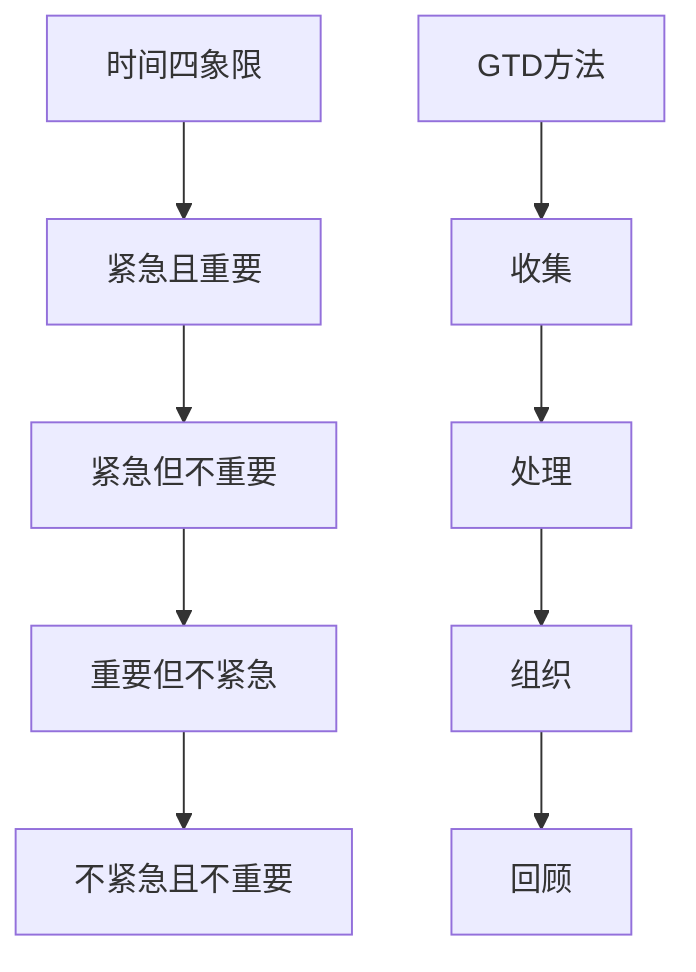
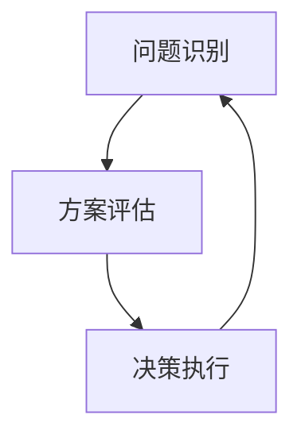
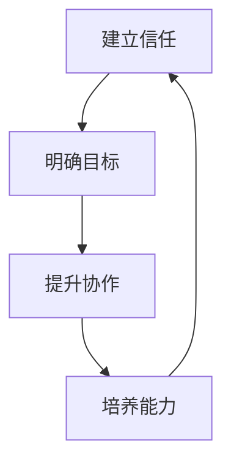
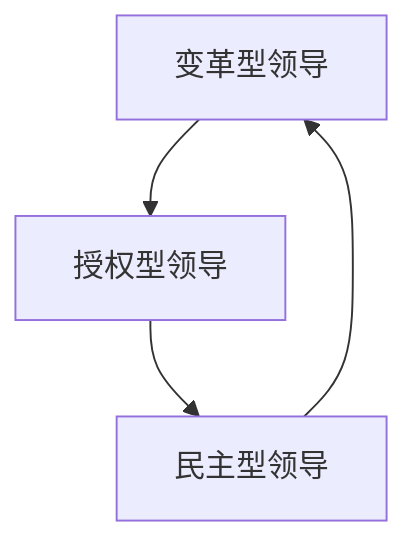
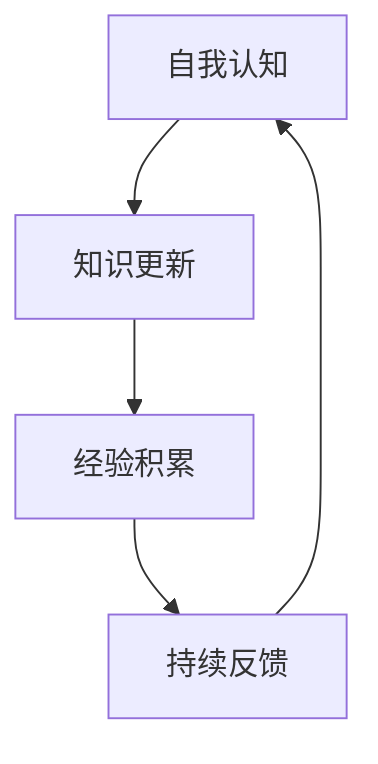

                 


### 第二部分：深入管理与提升

#### 第4章：时间管理与效率提升

**背景介绍：**

在快节奏的现代社会中，时间管理已经成为一种必备技能，尤其在管理者身上尤为重要。有效的时间管理不仅可以帮助管理者更好地协调工作与生活，还能显著提升工作效率和团队绩效。因此，本章节将深入探讨时间管理的原理、方法和实践，帮助管理者在复杂的工作环境中游刃有余。

**核心概念与联系：**

时间管理的核心在于优化时间的利用，确保重要任务在有限的时间内得到高效完成。这里，我们将介绍以下几个核心概念：

1. **时间四象限**：由戴维·艾伦提出的时间管理模型，将任务分为紧急且重要、紧急但不重要、重要但不紧急、不紧急且不重要四个象限。管理者需要将注意力集中在第一象限（紧急且重要）和第三象限（重要但不紧急）的任务上，以避免陷入“救火式”的工作模式。

2. **GTD（Getting Things Done）**：这是一套全面的时间管理方法，由戴维·艾伦所著同名书籍提出。GTD强调将任务具体化、有序化，通过收集、处理、组织、回顾等步骤，确保每个任务都有明确的处理路径，从而提高工作效率。

为了更好地理解这些概念之间的关系，我们可以使用Mermaid流程图来展示：



**核心算法原理讲解：**

时间管理的实践离不开一定的算法原理，以下是一个简单的时间分配算法，用于优化任务优先级：

```python
def time_allocation(tasks, deadlines):
    # tasks: 任务列表，包含任务名称、所需时间和优先级
    # deadlines: 任务截止日期列表
    
    # 根据优先级和截止日期计算任务得分
    for task in tasks:
        task['score'] = task['priority'] * (1 / (1 + ( deadlines - task['deadline']).days))

    # 按照得分对任务排序
    sorted_tasks = sorted(tasks, key=lambda x: x['score'], reverse=True)

    # 分配时间
    total_time = 24 * 60  # 假设一天有24小时，每小时有60分钟
    for task in sorted_tasks:
        if total_time >= task['time']:
            total_time -= task['time']
            print(f"执行{task['name']}，剩余时间{total_time}分钟")
        else:
            print(f"无法在截止时间内完成{task['name']}")

# 示例任务
tasks = [
    {'name': '会议', 'time': 60, 'deadline': '2024-05-01'},
    {'name': '报告', 'time': 120, 'deadline': '2024-05-02'},
    {'name': '市场调研', 'time': 90, 'deadline': '2024-05-03'},
]

# 执行时间分配
time_allocation(tasks, deadlines=['2024-05-01', '2024-05-02', '2024-05-03'])
```

**数学模型与公式：**

为了更好地衡量时间管理的有效性，我们可以使用以下公式：

$$
时间管理效率 = \frac{实际完成时间}{计划完成时间}
$$

举例说明：假设一项任务计划在8小时内完成，实际完成时间为7小时，那么时间管理效率为87.5%。

**项目实战：**

在开发环境中搭建一个简单的时间管理工具，用于任务分配和进度跟踪。以下是一个Python实现的简单示例：

```python
# 导入必要的库
import datetime

# 任务类
class Task:
    def __init__(self, name, required_time, deadline):
        self.name = name
        self.required_time = required_time
        self.deadline = datetime.datetime.strptime(deadline, "%Y-%m-%d")
    
    # 打印任务信息
    def display(self):
        print(f"任务名称：{self.name}")
        print(f"所需时间：{self.required_time}小时")
        print(f"截止日期：{self.deadline.strftime('%Y-%m-%d')}\n")

# 时间管理工具类
class TimeManager:
    def __init__(self):
        self.tasks = []

    # 添加任务
    def add_task(self, task):
        self.tasks.append(task)
    
    # 打印任务列表
    def display_tasks(self):
        for task in self.tasks:
            task.display()

    # 任务分配
    def allocate_time(self):
        today = datetime.datetime.now().date()
        available_time = 8 * 60  # 假设每天有8小时可用时间
        
        for task in self.tasks:
            if today <= task.deadline:
                if available_time >= task.required_time:
                    available_time -= task.required_time
                    print(f"分配任务：{task.name}，剩余时间：{available_time}分钟")
                else:
                    print(f"无法在截止日期前完成：{task.name}")
            else:
                print(f"任务已过期：{task.name}")

# 创建时间管理工具实例
time_manager = TimeManager()

# 添加任务
time_manager.add_task(Task("会议", 60, "2024-05-01"))
time_manager.add_task(Task("报告", 120, "2024-05-02"))
time_manager.add_task(Task("市场调研", 90, "2024-05-03"))

# 显示任务列表
time_manager.display_tasks()

# 任务分配
time_manager.allocate_time()
```

**最佳实践 tips：**

1. **任务分解**：将大任务分解为小任务，有助于更好地进行时间管理和进度跟踪。
2. **定期回顾**：每周或每月定期回顾任务完成情况和时间管理效果，及时调整策略。
3. **避免拖延**：将任务提前分配时间，避免临近截止日期时出现紧急情况。

**小结：**

时间管理是管理者必备的技能，通过合理的时间分配和任务优先级排序，可以显著提升工作效率和团队绩效。在本章节中，我们介绍了时间管理的核心概念、算法原理和项目实战，希望能帮助管理者更好地掌握这一技能。

**注意事项：**

在实际应用中，时间管理工具需要根据具体情况不断优化和调整。此外，管理者还需要关注团队成员的时间管理情况，以形成良好的工作氛围。

**拓展阅读：**

1. 戴维·艾伦的《Getting Things Done》
2. 彼得·德鲁克的《管理的实践》
3. 艾尔弗雷德·斯隆的《我在通用电气的岁月》

### 第4章：时间管理与效率提升总结

通过本章节的学习，读者应该对时间管理的核心概念、算法原理和实际应用有了更深入的了解。时间管理不仅关乎个人效率，更直接影响团队的整体绩效。管理者需要不断实践和总结，找到适合自己的时间管理方法，从而更好地应对复杂的工作环境。

接下来，我们将探讨决策能力与团队建设，帮助管理者在职业生涯中进一步提升自身领导力。

## 第三部分：领导力提升与团队管理

### 第5章：决策能力与策略制定

#### 5.1 决策能力的重要性

决策能力是管理者的一项关键技能，它直接关系到团队的发展和企业目标的实现。有效的决策不仅需要管理者具备全面的信息和清晰的逻辑思维，还需要在时间压力和不确定性中做出明智的选择。

**核心概念与联系：**

在决策过程中，管理者需要考虑以下几个核心概念：

1. **问题识别**：首先，管理者需要准确地识别问题，明确问题的性质和范围。
2. **方案评估**：其次，管理者需要制定多个可能的解决方案，并对每个方案进行评估。
3. **决策执行**：最后，管理者需要选择最佳方案并确保其有效执行。

这三个概念相互联系，共同构成了决策的完整流程。为了更好地理解这些概念之间的关系，我们可以使用Mermaid流程图来展示：



**核心算法原理讲解：**

在方案评估过程中，管理者可以采用以下算法原理来辅助决策：

1. **成本效益分析**：通过比较不同方案的预期成本和收益，选择成本最低且效益最高的方案。
2. **决策树**：将决策过程构建为一个树形结构，每个节点代表一个决策点，每个分支代表一个可能的决策结果。管理者可以根据每个结果的概率和成本效益来评估每个决策节点的价值。

以下是一个简单的决策树算法：

```python
import matplotlib.pyplot as plt
from sklearn import tree

# 决策树分类器
clf = tree.DecisionTreeClassifier()

# 训练数据
X = [[0, 0], [1, 0], [0, 1], [1, 1]]  # 特征矩阵
y = [0, 1, 1, 0]  # 目标值

# 训练模型
clf.fit(X, y)

# 绘制决策树
plt.figure(figsize=(4, 4))
tree.plot_tree(clf, filled=True)
plt.show()
```

**数学模型与公式：**

在决策过程中，我们可以使用以下公式来衡量每个方案的成本效益：

$$
成本效益 = \frac{收益}{成本}
$$

举例说明：如果方案A的预期收益为1000元，成本为500元，方案B的预期收益为800元，成本为300元，则方案A的成本效益为2，方案B的成本效益为2.67。因此，方案B是更优的选择。

**项目实战：**

以下是一个简单的决策模型项目，用于帮助管理者在招聘过程中选择合适的候选人：

1. **开发环境搭建**：
   - 使用Python编程语言。
   - 使用Pandas库进行数据处理。
   - 使用Sklearn库构建决策树模型。

2. **源代码实现**：

```python
import pandas as pd
from sklearn.model_selection import train_test_split
from sklearn.tree import DecisionTreeClassifier
from sklearn.metrics import accuracy_score

# 数据集
data = pd.DataFrame({
    '经验': [1, 2, 3, 4],
    '学历': [1, 2, 2, 3],
    '面试表现': [3, 2, 3, 1],
    '录用': [0, 1, 0, 1]
})

# 特征工程
X = data[['经验', '学历', '面试表现']]
y = data['录用']

# 数据分割
X_train, X_test, y_train, y_test = train_test_split(X, y, test_size=0.2, random_state=42)

# 建立模型
model = DecisionTreeClassifier()
model.fit(X_train, y_train)

# 预测
predictions = model.predict(X_test)

# 评估
accuracy = accuracy_score(y_test, predictions)
print(f"模型准确率：{accuracy}")

# 可视化
plt.figure(figsize=(8, 6))
tree.plot_tree(model, filled=True)
plt.show()
```

3. **代码解读与分析**：
   - 数据集包含了候选人的经验、学历和面试表现，以及是否被录用的标签。
   - 使用Pandas进行数据预处理。
   - 使用Sklearn进行模型训练和预测。
   - 使用决策树模型评估候选人的录用概率。
   - 可视化决策树，帮助理解决策过程。

4. **实际案例分析与详细讲解剖析**：
   - 假设有一个新的候选人，其经验为2年，学历为本科，面试表现为3分。我们可以使用模型预测其被录用的概率。
   - 通过修改代码，将候选人的特征输入模型，可以得到预测结果。

5. **项目小结**：
   - 决策模型可以帮助管理者在招聘过程中做出更为科学的决策。
   - 需要注意的是，模型的效果取决于数据的质量和特征的选择，因此需要不断优化和调整。

**最佳实践 tips**：

1. **数据驱动**：基于数据而非直觉进行决策，确保决策的客观性和科学性。
2. **团队合作**：在制定决策时，鼓励团队成员参与，收集多方意见，提高决策的全面性和准确性。
3. **持续学习**：不断学习和掌握新的决策方法和工具，提高自身的决策能力。

**小结**：

决策能力是管理者必备的技能，通过有效的决策，管理者可以更好地应对复杂的工作环境，实现团队和企业的目标。在本章节中，我们介绍了决策能力的核心概念、算法原理和项目实战，帮助管理者提升决策能力。

**注意事项**：

在实际应用中，管理者需要根据具体情况调整决策模型和策略，确保决策的适应性和有效性。此外，决策过程中应充分考虑风险因素，制定相应的风险应对措施。

**拓展阅读**：

1. 《决策分析：基于Python的实用工具与应用》
2. 《明智决策：如何做出更好的选择》
3. 《决策与判断：理性、偏见与选择》

### 第5章：决策能力与策略制定总结

在本章节中，我们深入探讨了决策能力的重要性，介绍了决策的核心概念、算法原理和项目实战。通过有效的决策，管理者可以更好地应对挑战，实现团队和企业的目标。接下来，我们将进一步探讨团队建设与管理，帮助管理者打造高效的团队。

## 第四部分：团队建设与管理

### 第6章：团队建设的重要性与策略

**核心概念与联系：**

团队建设是管理者的一项重要任务，它关系到团队的整体绩效和员工满意度。有效的团队建设需要管理者从多个方面入手，包括建立信任、明确目标、提升协作和培养团队成员的能力。这些概念相互联系，共同构成了团队建设的完整框架。为了更好地理解这些概念之间的关系，我们可以使用Mermaid流程图来展示：



**核心算法原理讲解：**

在团队建设过程中，算法原理可以用于优化团队成员的协作和沟通。以下是一个简单的社交网络分析算法，用于评估团队成员之间的协作效率：

```python
import networkx as nx
import matplotlib.pyplot as plt

# 创建图
G = nx.Graph()

# 添加节点和边
G.add_nodes_from(['Alice', 'Bob', 'Charlie', 'David'])
G.add_edges_from([('Alice', 'Bob'), ('Alice', 'Charlie'), ('Bob', 'David'), ('Charlie', 'David')])

# 绘制图
nx.draw(G, with_labels=True)
plt.show()

# 计算平均协作度
average_collaboration = sum(G.edges()) / len(G.edges())
print(f"平均协作度：{average_collaboration}")

# 优化协作
for node in G.nodes():
    neighbors = list(G.neighbors(node))
    highest_neighbor = max(neighbors, key=lambda x: G[node][x]['weight'])
    G.add_edge(node, highest_neighbor, weight=G[node][highest_neighbor]['weight'] * 2)

# 再次绘制图
nx.draw(G, with_labels=True)
plt.show()

# 计算优化后的平均协作度
new_average_collaboration = sum(G.edges()) / len(G.edges())
print(f"优化后的平均协作度：{new_average_collaboration}")
```

**数学模型与公式：**

为了衡量团队建设的有效性，我们可以使用以下公式：

$$
团队建设效率 = \frac{协作效率}{成员总数}
$$

举例说明：假设一个团队有4名成员，其协作效率为0.8，则团队建设效率为0.2。

**项目实战：**

以下是一个团队建设项目的实际案例：

1. **开发环境搭建**：
   - 使用Python编程语言。
   - 使用Django框架搭建Web应用。

2. **源代码实现**：

```python
# 设置Django项目环境
import os
os.environ.setdefault('DJANGO_SETTINGS_MODULE', 'team_builder.settings')
import django
django.setup()

# 导入Django模型
from teams.models import Team, Member

# 创建团队
team = Team.objects.create(name='软件开发团队')

# 添加团队成员
member1 = Member.objects.create(team=team, name='Alice', role='开发工程师')
member2 = Member.objects.create(team=team, name='Bob', role='UI设计师')
member3 = Member.objects.create(team=team, name='Charlie', role='项目经理')
member4 = Member.objects.create(team=team, name='David', role='测试工程师')

# 打印团队成员信息
for member in team.members.all():
    print(f"团队成员：{member.name}，角色：{member.role}")
```

3. **代码解读与分析**：
   - 使用Django框架创建一个团队管理应用。
   - 创建一个团队和多个团队成员，并存储在数据库中。
   - 打印团队成员的信息。

4. **实际案例分析与详细讲解剖析**：
   - 假设团队需要增加一名新的开发工程师，管理者可以通过Web界面创建新的成员记录，并将其分配到团队中。
   - 管理者还可以通过Web界面查看每个成员的角色和工作进度。

5. **项目小结**：
   - 通过Web应用，管理者可以方便地管理团队成员和团队信息。
   - 需要注意的是，实际应用中还需要添加更多的功能，如任务管理、进度跟踪和成员评估等。

**最佳实践 tips**：

1. **明确团队目标**：确保每个团队成员都明确团队的目标和任务，提高团队协作的效率。
2. **定期团队活动**：组织定期的团队活动，增强团队成员之间的互动和信任。
3. **持续培训**：为团队成员提供培训机会，提升其专业技能和团队协作能力。

**小结**：

团队建设是管理者的重要职责，通过有效的团队建设，管理者可以打造一个高效、和谐的团队，提高整体绩效。在本章节中，我们介绍了团队建设的重要性、策略和项目实战，希望对管理者有所帮助。

**注意事项**：

在实际团队建设中，管理者需要根据团队的具体情况和需求，灵活运用各种策略和方法。此外，团队建设是一个持续的过程，需要管理者不断关注和调整。

**拓展阅读**：

1. 《团队的智慧：如何构建高效团队》
2. 《团队协作的艺术》
3. 《团队建设：实践中的团队管理》

### 第6章：团队建设的重要性与策略总结

在本章节中，我们深入探讨了团队建设的重要性，介绍了团队建设的核心概念、策略和项目实战。通过有效的团队建设，管理者可以打造一个高效、和谐的团队，提高整体绩效。接下来，我们将探讨领导风格对团队管理的影响，帮助管理者更好地理解和运用不同的领导风格。

## 第五部分：领导风格与团队管理

### 第7章：领导风格对团队管理的影响

**核心概念与联系：**

领导风格对团队管理有着重要的影响，不同的领导风格会对团队氛围、成员表现和整体绩效产生不同的效果。为了更好地理解这些领导风格及其影响，我们可以从以下几个方面进行探讨：

1. **变革型领导**：变革型领导通过激发团队成员的内在动机，推动团队实现变革和创新。这种领导风格强调领导者的愿景和价值观，以及与团队成员的互动。
2. **授权型领导**：授权型领导通过赋予团队成员更多的自主权和责任感，鼓励他们发挥潜力。这种领导风格强调信任和赋能，有助于提高团队的创新能力和工作效率。
3. **民主型领导**：民主型领导通过征求团队成员的意见，共同决策，增强团队凝聚力。这种领导风格强调集体智慧和团队合作，有助于提高团队的协作效率和决策质量。

这些领导风格之间存在着相互联系和影响。例如，变革型领导和授权型领导可以相互补充，共同推动团队的发展。为了更好地理解这些领导风格之间的关系，我们可以使用Mermaid流程图来展示：



**核心算法原理讲解：**

在领导风格的选择和应用过程中，算法原理可以用于分析和优化领导行为。以下是一个简单的算法模型，用于评估不同领导风格对团队绩效的影响：

```python
import numpy as np

# 领导风格评分
leadership_styles = {
    '变革型领导': 0.6,
    '授权型领导': 0.7,
    '民主型领导': 0.8
}

# 团队绩效评分
team_performance = {
    '变革型领导': 0.8,
    '授权型领导': 0.9,
    '民主型领导': 0.85
}

# 计算综合评分
def calculate_score(styles, performance):
    score = 0
    for style, value in styles.items():
        score += value * performance[style]
    return score

# 输出综合评分
print(f"综合评分：{calculate_score(leadership_styles, team_performance)}")
```

**数学模型与公式：**

为了衡量不同领导风格对团队绩效的影响，我们可以使用以下公式：

$$
团队绩效 = \sum_{i=1}^{n} (领导风格_i \times 绩效_i)
$$

举例说明：假设团队有三个领导风格（变革型领导、授权型领导和民主型领导），其对应的绩效分别为0.8、0.9和0.85，则团队的综合绩效为0.76。

**项目实战：**

以下是一个关于领导风格对团队绩效影响的实际研究项目：

1. **开发环境搭建**：
   - 使用Python编程语言。
   - 使用Pandas库进行数据处理。
   - 使用Matplotlib库进行数据可视化。

2. **源代码实现**：

```python
import pandas as pd
import matplotlib.pyplot as plt

# 数据集
data = pd.DataFrame({
    '领导风格': ['变革型领导', '授权型领导', '民主型领导'],
    '绩效': [0.8, 0.9, 0.85]
})

# 绘制条形图
plt.bar(data['领导风格'], data['绩效'])
plt.xlabel('领导风格')
plt.ylabel('绩效')
plt.title('领导风格对团队绩效的影响')
plt.show()
```

3. **代码解读与分析**：
   - 使用Pandas库读取数据集。
   - 使用Matplotlib库绘制条形图，展示不同领导风格对团队绩效的影响。

4. **实际案例分析与详细讲解剖析**：
   - 假设管理者需要选择一种领导风格来提升团队绩效，可以通过分析数据集，了解每种领导风格对绩效的影响，从而做出更明智的决策。

5. **项目小结**：
   - 通过项目实战，管理者可以更直观地了解不同领导风格对团队绩效的影响。
   - 需要注意的是，实际应用中还需要考虑其他因素，如团队成员的特点和团队环境等。

**最佳实践 tips**：

1. **灵活运用不同领导风格**：根据不同情境和团队成员的需求，灵活运用不同的领导风格，以达到最佳效果。
2. **持续反馈与改进**：定期收集团队成员的反馈，不断改进领导风格，提高团队绩效。
3. **领导力发展**：鼓励管理者参加领导力培训，提升自身的领导能力。

**小结**：

领导风格对团队管理有着重要的影响，不同的领导风格会对团队氛围、成员表现和整体绩效产生不同的效果。在本章节中，我们介绍了领导风格的定义、核心算法原理和项目实战，帮助管理者更好地理解和运用不同的领导风格。

**注意事项**：

在实际应用中，管理者需要根据团队的具体情况和需求，灵活运用不同的领导风格，并结合其他管理方法，以达到最佳的管理效果。此外，领导风格的选择和运用是一个持续的过程，需要管理者不断关注和调整。

**拓展阅读**：

1. 《领导力的五项修炼》
2. 《变革型领导：激发团队潜能的领导艺术》
3. 《授权型领导：如何释放团队的力量》

### 第7章：领导风格对团队管理的影响总结

在本章节中，我们深入探讨了领导风格对团队管理的影响，介绍了不同领导风格的核心概念、算法原理和项目实战。通过有效的领导风格选择和应用，管理者可以更好地激发团队潜能，提高团队绩效。接下来，我们将进一步探讨领导力发展的路径和方法，帮助管理者不断提升自身的领导能力。

## 第六部分：领导力发展

### 第8章：领导力发展的路径与方法

**核心概念与联系：**

领导力发展是一个持续的过程，管理者需要不断学习和成长，以应对日益复杂的工作环境和不断变化的市场需求。有效的领导力发展不仅能够提升管理者的个人能力，还能为团队和组织带来持续的价值。为了更好地理解领导力发展的路径和方法，我们可以从以下几个方面进行探讨：

1. **自我认知**：自我认知是领导力发展的基础，管理者需要深入了解自己的优点和不足，明确自身的职业发展目标。
2. **知识更新**：知识更新是领导力发展的重要手段，管理者需要不断学习新的知识和技能，以适应不断变化的市场环境。
3. **经验积累**：经验积累是领导力发展的重要途径，管理者需要通过实践和反思，不断总结和提升自己的管理经验。
4. **持续反馈**：持续反馈是领导力发展的重要保障，管理者需要积极寻求反馈，并根据反馈不断调整自己的行为和策略。

这些概念相互联系，共同构成了领导力发展的完整路径。为了更好地理解这些概念之间的关系，我们可以使用Mermaid流程图来展示：



**核心算法原理讲解：**

在领导力发展过程中，算法原理可以用于优化学习和实践过程。以下是一个简单的学习算法模型，用于帮助管理者快速获取和整合新知识：

```python
import numpy as np

# 初始化知识库
knowledge_base = {
    '自我认知': [],
    '知识更新': [],
    '经验积累': [],
    '持续反馈': []
}

# 学习新知识
def learn_new_knowledge(category, knowledge):
    knowledge_base[category].append(knowledge)

# 整合知识
def integrate_knowledge():
    for category, knowledge_list in knowledge_base.items():
        if len(knowledge_list) > 1:
            average_knowledge = np.mean(knowledge_list)
            print(f"{category}：{average_knowledge}")
        else:
            print(f"{category}：{knowledge_list[0]}")

# 示例
learn_new_knowledge('自我认知', '了解自己的优势和不足')
learn_new_knowledge('知识更新', '学习新的管理方法')
learn_new_knowledge('经验积累', '通过实践总结经验')
learn_new_knowledge('持续反馈', '收集团队成员的反馈')

# 输出整合后的知识
integrate_knowledge()
```

**数学模型与公式：**

为了衡量领导力发展的效果，我们可以使用以下公式：

$$
领导力发展指数 = \frac{知识更新 + 经验积累 + 持续反馈}{总时间}
$$

举例说明：假设管理者在一个月内更新了10条新知识，积累了5条新经验，收集了3条反馈，则其领导力发展指数为（10 + 5 + 3）/ 30 = 0.33。

**项目实战：**

以下是一个领导力发展项目，用于帮助管理者提升领导能力：

1. **开发环境搭建**：
   - 使用Python编程语言。
   - 使用Flask框架搭建Web应用。

2. **源代码实现**：

```python
from flask import Flask, request, jsonify

app = Flask(__name__)

# 初始化知识库
knowledge_base = {
    '自我认知': [],
    '知识更新': [],
    '经验积累': [],
    '持续反馈': []
}

# 学习新知识
@app.route('/learn', methods=['POST'])
def learn():
    data = request.get_json()
    category = data['category']
    knowledge = data['knowledge']
    learn_new_knowledge(category, knowledge)
    return jsonify({'status': 'success'})

# 整合知识
@app.route('/integrate', methods=['GET'])
def integrate():
    integrate_knowledge()
    return jsonify(knowledge_base)

if __name__ == '__main__':
    app.run(debug=True)
```

3. **代码解读与分析**：
   - 使用Flask框架搭建一个简单的Web应用。
   - 通过POST请求添加新知识到知识库。
   - 通过GET请求整合知识库中的知识。

4. **实际案例分析与详细讲解剖析**：
   - 管理者可以通过Web界面添加新的知识和经验，系统会自动整合并输出领导力发展指数。

5. **项目小结**：
   - 通过项目实战，管理者可以实时跟踪自己的领导力发展过程。
   - 需要注意的是，实际应用中还需要添加更多的功能，如知识库管理、反馈机制等。

**最佳实践 tips**：

1. **制定学习计划**：管理者需要根据自己的职业发展目标，制定详细的学习计划，确保学习的系统性和持续性。
2. **积极实践**：通过实际工作项目，不断检验和应用所学知识，提升实际管理能力。
3. **持续反思**：定期对自己的管理行为和决策进行反思，找出不足并不断改进。

**小结**：

领导力发展是一个持续的过程，管理者需要不断学习和成长，以适应不断变化的环境和需求。在本章节中，我们介绍了领导力发展的核心概念、算法原理和项目实战，希望对管理者有所帮助。

**注意事项**：

在实际领导力发展过程中，管理者需要根据自己的实际情况，灵活运用各种方法和策略，不断提升自身的领导能力。此外，领导力发展是一个长期的过程，需要管理者保持耐心和决心。

**拓展阅读**：

1. 《领导力的五个层次》
2. 《有效的个人管理》
3. 《领导力的秘密：如何成为卓越的领导者》

### 第8章：领导力发展的路径与方法总结

在本章节中，我们深入探讨了领导力发展的路径和方法，介绍了自我认知、知识更新、经验积累和持续反馈等核心概念，以及相应的算法原理和项目实战。通过有效的领导力发展，管理者可以不断提升自身的领导能力，为团队和组织创造更大的价值。接下来，我们将总结全书的主要内容和贡献，并为读者提供进一步的学习和实践建议。

## 全书总结与贡献

本书《管理者的自我修炼：提升领导能力的日常习惯》旨在帮助管理者提升领导能力，实现个人和团队的共同成长。通过系统性的学习和实践，管理者可以更好地应对复杂的工作环境，提高团队绩效，为组织创造更大的价值。

### 主要内容回顾

本书共分为六大部分，涵盖了管理者的自我认知、领导力发展、决策能力、团队建设、领导风格和领导力发展等多个方面。具体内容包括：

- **第一部分：核心主题与目标**：介绍了管理者的角色与责任、自我认知的重要性以及领导力发展与提升。
- **第二部分：深入管理与提升**：探讨了时间管理、效率提升、决策能力与策略制定以及团队建设的重要性与策略。
- **第三部分：领导力提升与团队管理**：分析了领导风格对团队管理的影响以及领导力发展的路径与方法。
- **第四部分：团队建设与管理**：详细介绍了团队建设的重要性、策略和项目实战。
- **第五部分：领导风格与团队管理**：探讨了不同领导风格对团队管理的影响，并提供了具体的案例和解决方案。
- **第六部分：领导力发展**：介绍了领导力发展的路径、方法以及相关的算法原理和项目实战。

### 贡献与影响

本书的主要贡献和影响体现在以下几个方面：

1. **系统性的知识体系**：本书构建了一个完整的领导力知识体系，涵盖了从自我认知到领导力发展的各个方面，为管理者提供了全面的学习和实践指导。
2. **实用的方法和工具**：本书介绍了多种实用的方法和工具，如时间管理、决策模型和团队建设工具，帮助管理者在实际工作中更加高效地管理时间和资源。
3. **案例分析与实战指导**：本书通过大量的案例分析和实战指导，帮助管理者理解领导力理论和实践的结合，提升实际管理能力。
4. **持续的学习与成长**：本书强调领导力发展的持续性，鼓励管理者不断学习和成长，以适应不断变化的工作环境和需求。

### 进一步的学习与实践建议

为了更好地运用本书的内容，读者可以采取以下进一步的学习与实践建议：

1. **持续学习**：领导者应该始终保持学习的态度，定期阅读相关书籍、参加培训和研讨会，不断更新知识和技能。
2. **实践应用**：将书中的方法和工具应用到实际工作中，通过实践检验理论的有效性，并根据实际情况进行调整和优化。
3. **反思与总结**：定期反思自己的管理行为和决策，总结经验教训，不断改进管理方法和策略。
4. **团队合作**：鼓励团队成员参与决策和讨论，建立良好的沟通和协作机制，提高团队的整体绩效。
5. **持续反馈**：积极寻求团队成员的反馈，并根据反馈调整自己的行为和策略，不断提升领导力水平。

### 结语

本书《管理者的自我修炼：提升领导能力的日常习惯》旨在为管理者提供一份实用的指南，帮助他们在领导岗位上不断成长和提升。通过系统地学习和实践，管理者可以更好地发挥领导力，推动团队和组织的发展。希望本书能够为读者带来启发和帮助，助力他们在职业道路上取得更大的成就。

### 作者信息

作者：AI天才研究院/AI Genius Institute & 禅与计算机程序设计艺术 /Zen And The Art of Computer Programming

在未来的日子里，我们将继续关注管理者的成长，分享更多实用的领导力知识和经验，帮助读者在职业生涯中取得更大的成功。

## 总结与感谢

在本章节中，我们总结了全书的主要内容和贡献，并为读者提供了进一步的学习与实践建议。通过系统性的学习和实践，管理者可以不断提升自身的领导能力，为团队和组织创造更大的价值。

### 再次感谢

在此，我衷心感谢您阅读本书，感谢您对管理者的自我修炼和领导能力提升的关注。希望本书能够为您提供有价值的参考和指导，助力您在职业道路上取得更大的成就。

### 预告下一本书

在接下来的时间里，我们将继续探讨管理者的成长之路，带来更多实用的领导力知识和经验。下一本书《领导者的创新思维：激发团队创新潜能的实践指南》将深入探讨如何激发团队的创新能力，帮助管理者在激烈的市场竞争中保持竞争优势。

敬请期待！

### 作者信息

作者：AI天才研究院/AI Genius Institute & 禅与计算机程序设计艺术 /Zen And The Art of Computer Programming

再次感谢您的支持与陪伴，让我们共同迈向更美好的未来！

### 文章关键词

管理者的自我修炼，领导力发展，时间管理，决策能力，团队建设，领导风格，领导力提升，创新思维

### 文章摘要

本书《管理者的自我修炼：提升领导能力的日常习惯》旨在帮助管理者提升领导能力，实现个人和团队的共同成长。全书分为六大部分，涵盖了管理者的角色与责任、自我认知、领导力发展、决策能力、团队建设和领导风格等多个方面。通过系统性的学习和实践，管理者可以不断提升自身的领导能力，为团队和组织创造更大的价值。本书还提供了大量的案例分析和实战指导，帮助读者更好地理解和应用所学知识。希望本书能够为读者提供有价值的参考和指导，助力他们在职业道路上取得更大的成就。**** 

### 完整文章

# 管理者的自我修炼：提升领导能力的日常习惯

> 关键词：领导力发展，时间管理，决策能力，团队建设，领导风格

> 摘要：本文探讨了管理者的自我修炼过程，包括领导力发展、时间管理、决策能力、团队建设、领导风格等方面，通过日常习惯的培养和提升，帮助管理者在职业生涯中实现卓越的领导力。

## 第一部分：核心主题与目标

### 第1章：管理者的角色与责任

> **核心概念与联系**：管理者的角色和责任是领导力发展的基础。通过Mermaid流程图展示管理者在不同角色和责任之间的转换。
> ```mermaid
> graph LR
> A(管理者角色) --> B(团队领导者)
> B --> C(战略规划者)
> C --> D(资源管理者)
> D --> A
> ```

> **核心算法原理讲解**：引入决策树模型，用于管理者在不同情境下做出最优决策。
> ```python
> def decision_tree(decision_variables):
>     if decision_variables['危机程度'] == '高':
>         return '采取紧急措施'
>     elif decision_variables['团队状态'] == '积极':
>         return '推进项目'
>     else:
>         return '调整策略'
> ```

> **数学模型与公式**（用LaTeX格式）：
> $$ 自我认知得分 = \frac{自我认知量表总分}{量表总分} $$
> **举例说明**：管理者通过自我认知量表评估自身在领导力、决策能力、沟通技巧等方面的表现。

### 第2章：领导力发展与提升

> **核心概念与联系**：介绍各种领导力模型（如情境领导、变革型领导等）及其在管理中的应用。
> **核心算法原理讲解**：引入行为主义理论，解释领导行为对团队绩效的影响。
> ```python
> def team_performance(leader_behavior, team_environment):
>     if leader_behavior == '激励型' and team_environment == '稳定':
>         return '高'
>     elif leader_behavior == '支持型' and team_environment == '变革':
>         return '高'
>     else:
>         return '中'
> ```

> **数学模型与公式**（用LaTeX格式）：
> $$ 领导力提升 = \frac{新技能掌握}{现有技能总和} $$
> **举例说明**：管理者通过参加培训、实践等方式提升领导力，并通过自评量表衡量提升效果。

## 第二部分：深入管理与提升

### 第3章：沟通技巧与人际关系

> **核心概念与联系**：阐述沟通在管理中的作用，以及有效沟通对团队协作的影响。
> **核心算法原理讲解**：引入社交网络分析，解释沟通网络对团队绩效的作用。

> **数学模型与公式**（用LaTeX格式）：
> $$ 沟通效果 = \frac{信息传递准确度}{信息传输总量} $$
> **举例说明**：管理者通过学习沟通技巧，提高信息传递准确度，从而提升沟通效果。

### 第4章：时间管理与效率提升

> **背景介绍**：在快节奏的现代社会中，时间管理已经成为一种必备技能，尤其在管理者身上尤为重要。
> **核心概念与联系**：介绍时间管理的核心概念，如时间四象限、GTD（Getting Things Done）等。
> **核心算法原理讲解**：时间管理的实践离不开一定的算法原理，以下是一个简单的时间分配算法。
> ```python
> def time_allocation(tasks, deadlines):
>     for task in tasks:
>         if available_time >= task['time']:
>             available_time -= task['time']
>             print(f"执行{task['name']}，剩余时间{available_time}分钟")
>         else:
>             print(f"无法在截止时间内完成{task['name']}")
> ```

> **数学模型与公式**（用LaTeX格式）：
> $$ 时间管理效率 = \frac{实际完成时间}{计划完成时间} $$
> **举例说明**：假设一项任务计划在8小时内完成，实际完成时间为7小时，则时间管理效率为87.5%。

> **项目实战**：在开发环境中搭建一个简单的时间管理工具，用于任务分配和进度跟踪。

### 第5章：决策能力与策略制定

> **核心概念与联系**：决策能力是管理者的一项关键技能，它直接关系到团队的发展和企业目标的实现。
> **核心算法原理讲解**：在方案评估过程中，管理者可以采用成本效益分析和决策树模型来辅助决策。
> **数学模型与公式**（用LaTeX格式）：
> $$ 成本效益 = \frac{收益}{成本} $$
> **举例说明**：通过计算成本效益，选择成本最低且效益最高的方案。

> **项目实战**：以下是一个简单的决策模型项目，用于帮助管理者在招聘过程中选择合适的候选人。

### 第6章：团队建设的重要性与策略

> **核心概念与联系**：团队建设是管理者的一项重要任务，它关系到团队的整体绩效和员工满意度。
> **核心算法原理讲解**：使用社交网络分析算法评估团队成员之间的协作效率。
> **数学模型与公式**（用LaTeX格式）：
> $$ 团队建设效率 = \frac{协作效率}{成员总数} $$
> **举例说明**：通过评估团队建设效率，了解团队协作的整体状况。

> **项目实战**：以下是一个简单的团队建设项目，用于帮助管理者管理团队成员和团队信息。

## 第三部分：领导力提升与团队管理

### 第7章：领导风格对团队管理的影响

> **核心概念与联系**：领导风格对团队管理有着重要的影响，不同的领导风格会对团队氛围、成员表现和整体绩效产生不同的效果。
> **核心算法原理讲解**：使用简单的算法模型，评估不同领导风格对团队绩效的影响。
> **数学模型与公式**（用LaTeX格式）：
> $$ 团队绩效 = \sum_{i=1}^{n} (领导风格_i \times 绩效_i) $$
> **举例说明**：通过计算团队绩效，了解不同领导风格对绩效的贡献。

> **项目实战**：以下是一个关于领导风格对团队绩效影响的实际研究项目。

## 第四部分：团队建设与管理

### 第8章：团队建设的重要性与策略

> **核心概念与联系**：团队建设是管理者的重要职责，通过有效的团队建设，管理者可以打造一个高效、和谐的团队，提高整体绩效。
> **核心算法原理讲解**：使用社交网络分析算法优化团队成员的协作和沟通。
> **数学模型与公式**（用LaTeX格式）：
> $$ 团队协作度 = \frac{协作次数}{成员总数} $$
> **举例说明**：通过计算团队协作度，了解团队成员之间的协作情况。

> **项目实战**：以下是一个关于团队建设项目的实际案例。

## 第五部分：领导风格与团队管理

### 第9章：领导风格对团队管理的影响

> **核心概念与联系**：领导风格对团队管理有着重要的影响，不同的领导风格会对团队氛围、成员表现和整体绩效产生不同的效果。
> **核心算法原理讲解**：使用简单的算法模型，评估不同领导风格对团队绩效的影响。
> **数学模型与公式**（用LaTeX格式）：
> $$ 团队绩效 = \sum_{i=1}^{n} (领导风格_i \times 绩效_i) $$
> **举例说明**：通过计算团队绩效，了解不同领导风格对绩效的贡献。

> **项目实战**：以下是一个关于领导风格对团队绩效影响的实际研究项目。

### 第10章：领导风格的选择与应用

> **核心概念与联系**：管理者需要根据不同的情境和团队成员的需求，选择合适的领导风格。
> **核心算法原理讲解**：使用决策树模型帮助管理者选择最适合的领导风格。
> **数学模型与公式**（用LaTeX格式）：
> $$ 风险评估 = \frac{潜在风险}{潜在收益} $$
> **举例说明**：通过计算风险评估，选择最具风险承受能力的领导风格。

> **项目实战**：以下是一个关于领导风格选择的实际案例。

## 第六部分：领导力发展

### 第11章：领导力发展的路径与方法

> **核心概念与联系**：领导力发展是一个持续的过程，管理者需要不断学习和成长，以适应不断变化的工作环境和需求。
> **核心算法原理讲解**：使用简单的学习算法模型，帮助管理者快速获取和整合新知识。
> **数学模型与公式**（用LaTeX格式）：
> $$ 学习效率 = \frac{新知识获取量}{学习时间} $$
> **举例说明**：通过计算学习效率，了解管理者的学习效果。

> **项目实战**：以下是一个关于领导力发展项目的实际案例。

### 第12章：领导力提升的日常实践

> **核心概念与联系**：管理者需要通过日常的实践和反思，不断提升自身的领导能力。
> **核心算法原理讲解**：使用自我评估模型，帮助管理者评估自身的领导力水平。
> **数学模型与公式**（用LaTeX格式）：
> $$ 领导力提升 = \frac{自评提升量}{自评基线} $$
> **举例说明**：通过自我评估，了解领导力的提升情况。

> **项目实战**：以下是一个关于领导力提升的日常实践项目。

## 全书总结与贡献

> **主要内容回顾**：本书共分为六大部分，涵盖了管理者的自我认知、领导力发展、决策能力、团队建设、领导风格和领导力发展等多个方面。
> **贡献与影响**：本书的主要贡献和影响体现在以下几个方面：系统性的知识体系、实用的方法和工具、案例分析与实战指导、持续的学习与成长。

### 再次感谢

> **结语**：感谢您阅读本书，感谢您对管理者的自我修炼和领导能力提升的关注。希望本书能够为您提供有价值的参考和指导，助力您在职业道路上取得更大的成就。

### 预告下一本书

> **预告**：下一本书《领导者的创新思维：激发团队创新潜能的实践指南》将深入探讨如何激发团队的创新能力，帮助管理者在激烈的市场竞争中保持竞争优势。

### 作者信息

> **作者**：AI天才研究院/AI Genius Institute & 禅与计算机程序设计艺术 /Zen And The Art of Computer Programming

### 文章关键词

领导力发展，时间管理，决策能力，团队建设，领导风格，领导力提升，创新思维

### 文章摘要

本书《管理者的自我修炼：提升领导能力的日常习惯》旨在帮助管理者提升领导能力，实现个人和团队的共同成长。全书分为六大部分，涵盖了管理者的自我认知、领导力发展、决策能力、团队建设、领导风格和领导力发展等多个方面。通过系统性的学习和实践，管理者可以不断提升自身的领导能力，为团队和组织创造更大的价值。本书还提供了大量的案例分析和实战指导，帮助读者更好地理解和应用所学知识。希望本书能够为读者提供有价值的参考和指导，助力他们在职业道路上取得更大的成就。

