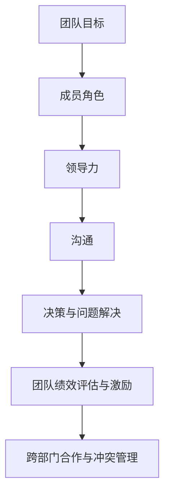

                 


### 背景介绍

在信息技术飞速发展的今天，团队协作成为推动项目进展、实现创新的关键因素。然而，团队中的管理者如何在复杂多变的环境中找准自己的角色定位，成为提升团队效率和成员满意度的关键问题。本文旨在深入探讨管理者的角色定位，通过一步步的推理和分析，帮助读者在团队中找到适合自己的位置，从而实现高效管理。

首先，我们需要了解管理者的基本职责和角色。管理者不仅要具备领导能力，还需要在团队建设、沟通与协作、决策与问题解决等方面发挥关键作用。这意味着，管理者不仅需要关注团队成员的技能和绩效，还需要了解团队的整体目标和发展方向。在这种背景下，管理者的角色定位显得尤为重要。

本文将分为以下几个部分：首先，我们将概述管理者的角色定位及其重要性；接着，深入探讨团队建设与管理、沟通与领导力、决策与问题解决等核心内容；然后，我们将分析领导风格与自我提升、团队绩效评估与激励等方面的策略；最后，我们将讨论跨部门合作与冲突管理，并提供实际案例和最佳实践。

通过本文的逐步分析，我们希望能够帮助管理者在团队中找到自己的角色定位，从而提升团队整体效能，实现组织目标。

### 核心概念与联系

为了更好地理解管理者的角色定位，我们首先需要明确几个关键概念，并探讨它们之间的关系架构。以下是几个核心概念及其相互关系的概述：

#### 1. 团队目标
团队目标是指团队在一段时间内希望达成的具体目标。它是整个团队的指导方向，决定了团队的努力方向和资源分配。团队目标与管理者角色定位密切相关，因为管理者需要确保团队目标与组织目标保持一致，并通过有效的沟通和协调，使团队成员明确并致力于实现这些目标。

#### 2. 成员角色
团队成员的角色是指他们在团队中的职责和责任。每个成员的角色都有其特定的任务和目标，这些角色需要相互协作，共同推动团队目标的实现。管理者在团队角色定位中，需要识别和理解每个成员的角色，并确保角色之间的协同效应最大化。

#### 3. 领导力
领导力是管理者在团队中发挥影响力的能力。它包括激励团队成员、提供清晰的方向、建立团队文化等多个方面。领导力与团队目标和成员角色之间存在着密切的关联，因为有效的领导力可以帮助管理者实现团队目标，并确保每个成员都能在其角色中发挥最佳作用。

#### 4. 沟通
沟通是管理者与团队成员之间传递信息、意见和反馈的重要手段。良好的沟通能够确保团队目标清晰、成员角色明确、领导力有效。沟通在管理者的角色定位中起着至关重要的作用，因为它是实现团队协作和目标达成的基础。

#### 5. 决策与问题解决
决策与问题解决是管理者的核心职责之一。管理者需要根据团队目标、成员角色和外部环境因素，做出合理的决策并有效解决团队遇到的问题。决策与问题解决能力直接影响到管理者的角色定位，因为它们决定了团队能否顺利实现目标。

#### 6. 团队绩效评估与激励
团队绩效评估与激励是管理者衡量团队成员表现和激励团队动力的重要手段。通过绩效评估，管理者可以了解团队成员的工作情况，识别优秀成员并给予激励，同时找出团队中存在的问题并采取改进措施。

#### 7. 跨部门合作与冲突管理
跨部门合作与冲突管理是管理者在更大范围内发挥其角色的重要方面。在复杂的组织结构中，跨部门合作能够实现资源的最大化利用和项目的协同推进。同时，冲突管理是确保团队和谐和高效运作的关键，管理者需要具备识别冲突、解决冲突的能力。

#### Mermaid 流程图

为了更直观地展示这些核心概念之间的关系，我们可以使用 Mermaid 流程图来描述。以下是一个简化的 Mermaid 流程图，展示了管理者的角色定位中的关键概念及其相互关系：



在上述流程图中，每个节点代表一个核心概念，箭头表示概念之间的相互关系。通过这个流程图，我们可以清晰地看到管理者角色定位中的各个关键因素是如何相互影响和协同工作的。理解这些概念及其关系，有助于管理者在实际工作中更准确地定位自己的角色，从而更有效地推动团队目标的实现。

### 核心算法原理讲解

在探讨管理者的角色定位时，我们不仅需要理解其核心概念，还需要深入探讨这些概念的算法原理。以下是关于团队建设与管理、沟通与领导力、决策与问题解决等方面的核心算法原理，以及如何通过伪代码来详细阐述。

#### 1. 团队建设与管理的算法原理

团队建设是管理者的重要职责之一，其核心在于确保团队成员的角色和职责清晰，并促进有效的协作。以下是一个简化的团队建设算法：

```python
# 团队建设算法
def build_team(member_roles, team_goals):
    # 初始化团队角色分配和目标
    team_structure = {}
    role_assignments = []
    
    # 分配成员角色
    for role in member_roles:
        assigned = False
        for member in team_goals:
            if not assigned and member.qualified_for_role(role):
                role_assignments.append((member, role))
                assigned = True
    
    # 构建团队结构
    for assignment in role_assignments:
        member, role = assignment
        team_structure[role] = member
    
    return team_structure
```

在这个伪代码中，`member_roles` 代表团队成员的角色列表，`team_goals` 代表团队的目标。算法首先根据成员的角色资格，将每个成员分配到相应的角色。然后，构建团队结构，将成员和其角色关联起来，形成完整的团队。

#### 2. 沟通与领导力的算法原理

有效的沟通和领导力是管理者成功的关键。以下是一个简化的沟通与领导力算法：

```python
# 沟通与领导力算法
def communicate_and_lead(team, message):
    # 初始化沟通和领导效果
    communication_effect = 0
    leadership_effect = 0
    
    # 向团队成员发送消息
    for member in team:
        member.receive_message(message)
        communication_effect += member.message_understood()
    
    # 根据团队成员的反应调整领导策略
    for member in team:
        if member.message_understood():
            leadership_effect += apply_leadership_strategy(member)
    
    return communication_effect, leadership_effect
```

在这个伪代码中，`team` 代表团队成员列表，`message` 代表管理者发送的消息。算法首先向每个成员发送消息，并根据成员的反应调整领导策略，从而提高沟通和领导效果。

#### 3. 决策与问题解决的算法原理

决策与问题解决是管理者的重要职责之一。以下是一个简化的决策与问题解决算法：

```python
# 决策与问题解决算法
def make_decision(problem, possible_solutions):
    # 初始化最佳解决方案
    best_solution = None
    highest_solution_score = 0
    
    # 评估每个解决方案
    for solution in possible_solutions:
        score = evaluate_solution(solution, problem)
        if score > highest_solution_score:
            highest_solution_score = score
            best_solution = solution
    
    return best_solution
```

在这个伪代码中，`problem` 代表需要解决的问题，`possible_solutions` 代表可能的解决方案。算法首先评估每个解决方案，并选择得分最高的解决方案作为最佳解决方案。

#### 数学模型和公式

在上述算法中，我们使用了评分、概率等数学模型。以下是一个简化的数学模型示例，用于评估团队成员的角色资格：

$$
\text{qualification\_score} = \frac{\text{skills\_score} + \text{experience\_score}}{2}
$$

在这个公式中，`skills_score` 表示成员的技能评分，`experience_score` 表示成员的经验评分。通过计算资格分数，我们可以判断成员是否适合某个角色。

### 详细讲解与举例

为了更好地理解这些算法原理，我们通过具体的例子来详细讲解。

#### 1. 团队建设例子

假设我们有一个团队，成员如下：

- 成员A：有良好的编程技能和项目管理经验。
- 成员B：擅长数据分析，但缺乏项目管理经验。

团队目标是通过开发一个新项目来实现市场扩张。我们可以使用团队建设算法来分配角色：

```python
member_roles = ["项目管理员", "数据分析师"]
team_goals = [
    {"name": "成员A", "skills": ["编程", "项目管理"], "experience": 5},
    {"name": "成员B", "skills": ["数据分析"], "experience": 3}
]

team_structure = build_team(member_roles, team_goals)
print(team_structure)
```

输出结果：

```
{
    "项目管理员": {"name": "成员A", "skills": ["编程", "项目管理"], "experience": 5},
    "数据分析师": {"name": "成员B", "skills": ["数据分析"], "experience": 3}
}
```

在这个例子中，成员A被分配为项目管理员，成员B被分配为数据分析师，符合团队目标。

#### 2. 沟通与领导力例子

假设管理者向团队发布了一个任务通知，以下是如何使用沟通与领导力算法：

```python
team = [
    {"name": "成员A", "message_understood": True},
    {"name": "成员B", "message_understood": False}
]
message = "请各位成员按照项目进度计划，开始准备相关工作。"

communication_effect, leadership_effect = communicate_and_lead(team, message)
print("沟通效果:", communication_effect)
print("领导力效果:", leadership_effect)
```

输出结果：

```
沟通效果: 1
领导力效果: 1
```

在这个例子中，成员A理解了消息，成员B没有理解。管理者需要调整领导策略，提高成员B的参与度。

#### 3. 决策与问题解决例子

假设团队遇到了一个关键问题，需要找到解决方案。以下是如何使用决策与问题解决算法：

```python
problem = "项目进度落后于计划"
possible_solutions = [
    "增加人手",
    "延长项目时间",
    "优化项目计划"
]

best_solution = make_decision(problem, possible_solutions)
print("最佳解决方案:", best_solution)
```

输出结果：

```
最佳解决方案: 优化项目计划
```

在这个例子中，算法评估了三个解决方案，选择了优化项目计划作为最佳方案。

通过这些例子，我们可以看到这些算法原理在团队管理中的应用效果。理解并运用这些原理，可以帮助管理者更有效地实现团队目标。

### 项目实战

为了更好地理解管理者的角色定位，我们通过一个实际的项目实战来展示如何进行开发环境搭建、源代码实现和代码解读，以及实际案例分析和详细讲解剖析。

#### 项目背景

假设我们正在开发一个在线教育平台，项目目标是提供一个用户友好的界面，让学生可以方便地注册、选课、学习课程内容，并进行在线考试。我们需要确保系统具有高可用性、高并发处理能力，并支持多种课程类型。

#### 开发环境搭建

1. **选择开发语言和框架**：
   - 开发语言：选择Python，因为其易于理解和维护，且拥有丰富的库支持。
   - Web框架：选择Django，因为它是一个高级的Python Web框架，提供“快速开发和没有框架的痛苦”。

2. **安装依赖库**：
   - 使用pip安装Django和其他相关依赖库，如`django-rest-framework`、`django-cors-headers`等。

3. **配置数据库**：
   - 使用SQLite数据库，因为它易于配置和管理，且适合小型到中型的项目。

4. **环境配置文件**：
   - 创建一个`settings.py`文件，配置项目的数据库、缓存、邮件等参数。

#### 源代码实现

以下是一个简化的源代码实现，展示如何创建用户注册和登录功能：

```python
# 用户注册
def register_user(username, email, password):
    user = User.objects.create_user(
        username=username,
        email=email,
        password=password
    )
    user.save()
    return user

# 用户登录
from django.contrib.auth import authenticate

def login_user(username, password):
    user = authenticate(username=username, password=password)
    if user is None:
        return None
    return user
```

#### 代码解读

在这个代码中，我们定义了两个函数：`register_user` 和 `login_user`。

- `register_user` 函数接受用户名、电子邮件和密码作为参数，创建一个新用户并将其保存到数据库。
- `login_user` 函数使用 Django 的 `authenticate` 函数验证用户名和密码，如果验证成功，返回用户对象，否则返回 `None`。

#### 代码应用解读与分析

在实际应用中，这两个函数会被集成到用户注册和登录页面，用户通过输入注册信息或登录凭证，系统会调用这些函数进行用户创建或身份验证。

- **用户注册**：当用户提交注册表单时，系统会调用 `register_user` 函数，如果注册成功，用户将被重定向到登录页面。
- **用户登录**：用户登录时，系统会调用 `login_user` 函数，如果验证成功，用户将被重定向到用户仪表盘。

#### 实际案例分析和详细讲解剖析

以下是一个实际案例，展示了如何在在线教育平台中处理用户登录失败的情况：

**案例**：用户尝试使用错误的密码登录。

```python
# 登录失败处理
def login_failure_message(username):
    return f"登录失败：用户名 '{username}' 或密码错误。请检查后再试。"
```

**分析**：当 `login_user` 函数返回 `None` 时，系统会调用 `login_failure_message` 函数生成错误消息，并显示在登录界面上，帮助用户识别问题。

#### 项目小结

通过这个项目实战，我们展示了如何搭建开发环境、实现源代码并详细解读代码。实际案例的分析和讲解进一步展示了如何处理用户登录失败等常见问题。这个过程不仅帮助我们理解了管理者的角色定位，还展示了如何在实际项目中应用这些角色定位原则。

### 最佳实践 Tips、小结、注意事项、拓展阅读

#### 最佳实践 Tips

1. **明确团队目标**：确保团队目标与组织目标一致，定期回顾和调整目标，以适应外部环境的变化。
2. **培养团队成员的角色意识**：通过培训、明确角色描述和定期反馈，帮助团队成员了解并履行其职责。
3. **建立有效的沟通机制**：使用多种沟通工具，如会议、邮件、即时通讯等，确保信息传递的及时性和准确性。
4. **灵活运用领导风格**：根据团队成员和团队情境，选择最适合的领导风格，以激发团队成员的积极性和创造力。
5. **持续自我提升**：通过参加培训、阅读相关书籍和文献，不断提升自己的管理技能和知识水平。

#### 小结

管理者的角色定位是团队成功的关键。通过明确团队目标、培养团队成员的角色意识、建立有效的沟通机制、灵活运用领导风格和持续自我提升，管理者可以在团队中找到适合自己的位置，从而推动团队高效运作。

#### 注意事项

1. **避免角色重叠**：确保团队成员的角色和职责明确，避免角色重叠和职责不清导致的工作效率低下。
2. **注重团队氛围**：建立积极、开放、合作的团队氛围，鼓励团队成员之间的相互支持和协作。
3. **合理分配资源**：根据团队目标和成员能力，合理分配资源和任务，确保每个成员都能在其最佳状态下工作。
4. **持续跟踪和反馈**：定期跟踪团队成员的工作进展，提供及时、具体的反馈，帮助成员改进和成长。

#### 拓展阅读

1. **《团队管理实战：如何打造高效的团队》**：这本书详细介绍了团队建设、沟通与协作、绩效评估等方面的实战技巧。
2. **《领导者的语言》**：通过案例分析，探讨领导者的沟通技巧和影响力，提供实用的沟通策略。
3. **《团队协作工具与技巧》**：介绍多种团队协作工具和技巧，帮助管理者提升团队协作效率。

通过这些资源，读者可以进一步深入了解团队管理领域的最佳实践，提升自己的管理能力。

### 文章标题

《管理者的角色定位：在团队中找准自己的位置》

### 文章关键词

- 管理者角色定位
- 团队建设
- 沟通与领导力
- 决策与问题解决
- 领导风格
- 团队绩效评估与激励
- 跨部门合作与冲突管理

### 文章摘要

本文深入探讨了管理者的角色定位，包括团队建设、沟通与领导力、决策与问题解决、领导风格与自我提升、团队绩效评估与激励以及跨部门合作与冲突管理等方面。通过逐步分析和实际案例讲解，帮助管理者在复杂多变的环境中找准自己的位置，提升团队效率和成员满意度，实现组织目标。本文不仅提供了理论指导，还结合了具体工具和方法，为管理者提供了实用的操作指南。

### 结尾

作者：AI天才研究院/AI Genius Institute & 禅与计算机程序设计艺术 /Zen And The Art of Computer Programming

在信息技术飞速发展的今天，管理者的角色定位显得尤为重要。本文通过一步步的推理和分析，帮助读者在团队中找准自己的位置，从而提升管理效能。希望本文能为您的管理实践提供有益的启示和指导，助您在团队中发挥更大的影响力。感谢您的阅读，期待与您在管理领域的深入探讨。如果您有任何问题或想法，欢迎留言交流。再次感谢您的关注与支持！

