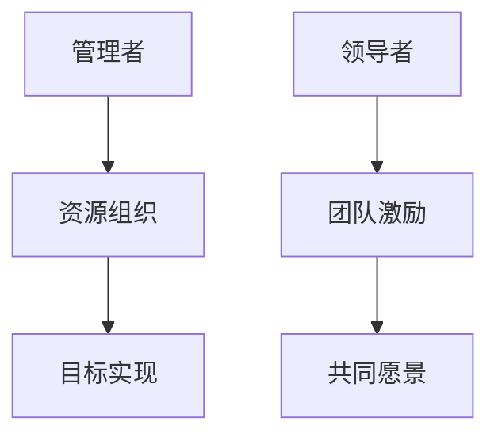
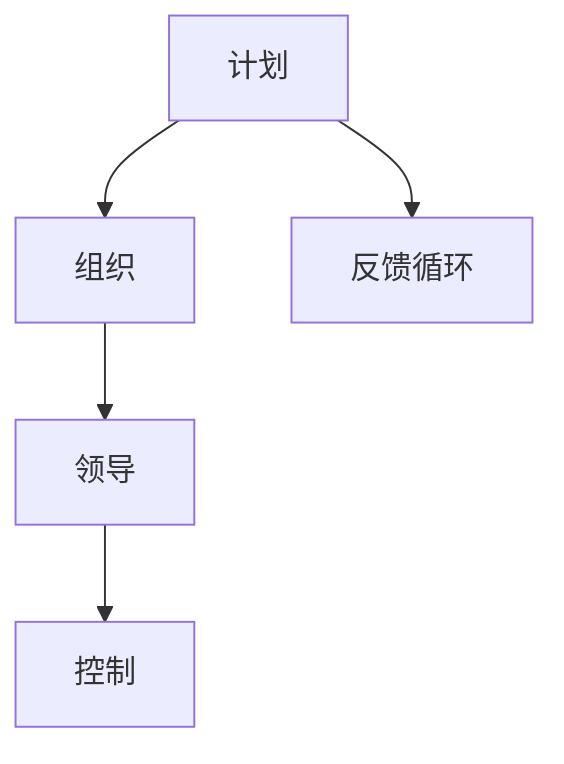
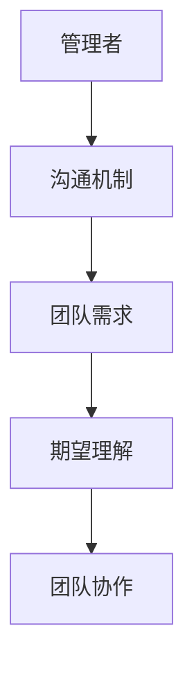
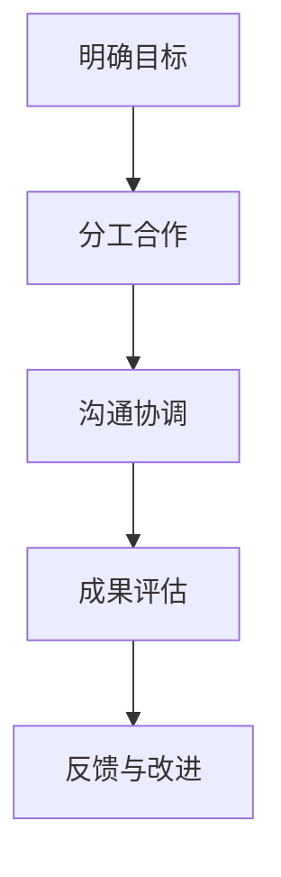
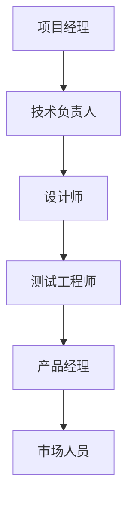
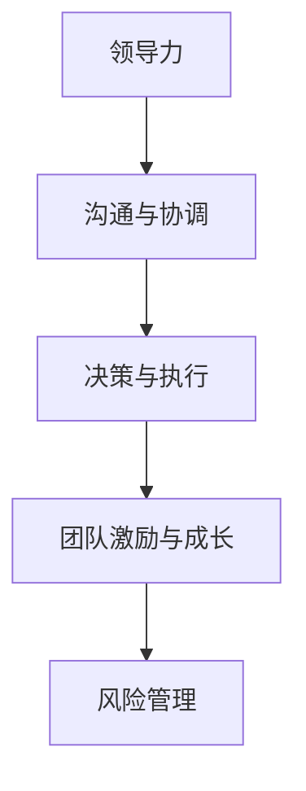

                 


### 文章标题：管理者的角色转换：从专业技术到领导岗位

#### 关键词：管理者角色转换、领导力、团队协作、项目管理和职业发展

#### 摘要：
本文深入探讨从专业技术人才向管理者角色转换的过程，分析这一角色转换的背景、核心概念、转变路径、核心技能以及个人发展策略。通过详细的实例分析和最佳实践，帮助读者理解如何成功实现这一转变。

---

### 引言：管理者的角色转变背景

在当今快速发展的信息技术时代，专业技术人员常常面临着角色转变的压力。随着企业对管理层需求的不断增加，越来越多的技术人员被提升为管理者。这一转变不仅是对个人职业发展的挑战，也是对企业组织结构的调整。本文将探讨这一转变的必要性和过程。

---

### 核心概念与联系

#### 1.1 管理者与领导者的区别

管理者通常负责组织和协调资源，确保目标的实现。领导者则更侧重于激发团队潜力，建立共同愿景。这两者的区别在于职责和目标的差异。下面是一个简单的 Mermaid 流程图，展示了管理者与领导者的关系架构：



#### 1.2 核心管理概念解析

核心管理概念包括计划、组织、领导、控制等。以下是这些概念之间关系的 Mermaid 流程图：



#### 1.3 管理者与团队的关系

管理者与团队的关系是管理过程中至关重要的一环。管理者需要建立良好的沟通机制，理解团队成员的需求和期望。以下是一个描述这一关系的 Mermaid 流程图：



---

### 管理者角色转变的理论基础

#### 2.1 管理者角色转变的模型

管理者角色转变通常分为以下三个阶段：技术专家阶段、过渡阶段和管理者阶段。以下是一个简化的模型描述：

```plaintext
技术专家阶段 → 过渡阶段 → 管理者阶段
1. 技术深度知识积累
2. 技术与管理知识融合
3. 领导力与决策能力提升
```

#### 2.2 角色转变的过程分析

角色转变并非一蹴而就，它涉及到个人心理、技能和知识结构的调整。以下是角色转变过程的步骤：

```plaintext
1. 自我认知与定位
2. 技能提升与知识扩展
3. 情绪管理
4. 领导力培养
5. 团队协作能力提升
```

#### 2.3 角色转变中的心理挑战

管理者在角色转变过程中可能会面临以下心理挑战：

```plaintext
1. 权力距离感
2. 责任与压力
3. 人际关系管理
4. 自我定位模糊
```

---

### 角色转变的实践路径

#### 3.1 从专业技术到管理者的转变

技术专家要转变为管理者，首先需要意识到管理的核心不仅仅是技术，还包括团队协作和资源管理。以下是一个从技术专家到管理者的转变路径：

```plaintext
1. 建立管理知识框架
2. 提升沟通和人际关系管理技能
3. 学会授权和团队激励
4. 理解项目管理流程
```

#### 3.2 专业知识与领导能力的融合

管理者需要将专业知识与领导能力相结合，以更好地指导团队。以下是一个简单的融合策略：

```plaintext
1. 持续学习与技术更新
2. 利用专业知识解决团队问题
3. 建立愿景和目标
4. 激发团队成员的潜力
```

#### 3.3 技术背景下的管理策略

技术背景的管理者在制定管理策略时，应考虑以下因素：

```plaintext
1. 技术趋势与市场变化
2. 团队技术能力评估
3. 技术风险与管理控制
4. 技术创新与团队激励
```

---

### 领导岗位的核心技能

#### 4.1 沟通技巧与团队协作

沟通技巧是管理者必备的核心技能之一。以下是提高沟通技巧的建议：

```plaintext
1. 清晰表达
2. 倾听和理解
3. 非言语沟通
4. 情境沟通
```

团队协作能力也是管理者的重要任务。以下是一个团队协作的流程图：



#### 4.2 决策能力与问题解决

管理者需要具备强大的决策能力和问题解决能力。以下是一个决策流程：

```plaintext
1. 收集信息
2. 分析问题
3. 制定解决方案
4. 评估风险与收益
5. 决策执行
```

#### 4.3 情绪管理与团队建设

情绪管理是管理者心理健康的重要部分。以下是一个情绪管理策略：

```plaintext
1. 自我情绪识别
2. 情绪调节与释放
3. 理解团队成员的情绪
4. 建立积极的团队氛围
```

团队建设也是管理者的重要任务。以下是一个团队建设策略：

```plaintext
1. 建立共同愿景
2. 提升团队凝聚力
3. 增强团队信任
4. 促进团队成员的个人发展
```

---

### 项目管理与团队协作

#### 5.1 项目管理的基本原则

项目管理的基本原则包括：

```plaintext
1. 目标明确
2. 计划详细
3. 资源合理分配
4. 进度控制
5. 风险管理
```

#### 5.2 团队角色与责任分配

有效的团队角色与责任分配是项目成功的关键。以下是一个团队角色分配的示例：



#### 5.3 项目管理与领导力

项目管理与领导力紧密相关。以下是一个项目管理中的领导力模型：



---

### 个人发展与管理技能提升

#### 6.1 个人发展路径规划

个人发展路径规划是管理者成长的关键。以下是一个个人发展路径规划的建议：

```plaintext
1. 自我评估与定位
2. 制定职业发展目标
3. 制定学习计划
4. 定期反思与调整
```

#### 6.2 管理技能提升的方法与实践

管理技能的提升需要系统的学习和实践。以下是一些方法：

```plaintext
1. 参加管理培训课程
2. 阅读管理类书籍
3. 实践项目管理经验
4. 寻求导师指导
5. 参与行业交流活动
```

---

### 管理者的角色转变与未来发展

#### 7.1 角色转变的趋势分析

随着技术的发展和组织结构的变革，管理者的角色也在不断变化。以下是一些趋势分析：

```plaintext
1. 数字化管理
2. 人工智能与自动化
3. 跨文化管理
4. 灵活工作方式
```

#### 7.2 未来管理者的素质要求

未来管理者需要具备以下素质：

```plaintext
1. 持续学习能力
2. 创新思维
3. 团队协作能力
4. 数字化素养
5. 领导力与影响力
```

#### 7.3 管理实践中的挑战与机遇

管理实践中的挑战包括：

```plaintext
1. 技术变革
2. 人才竞争
3. 组织变革
4. 持续压力
```

而机遇则包括：

```plaintext
1. 数字化转型
2. 创新机会
3. 全球化视野
4. 跨行业合作
```

---

### 总结

本文从多个角度探讨了从专业技术到管理者的角色转换过程，分析了核心概念、理论基础、实践路径以及未来发展。通过这些讨论，我们希望能够为那些正在或计划进行这一角色转变的专业技术人员提供有益的指导。

---

### 参考文献

1. Mintzberg, H. (1973). The nature of managerial work. Harper & Row.
2. Greenleaf, R. K. (1977). Servant Leadership: A Journey into the Nature of Legitimate Power and Greatness. Paulist Press.
3. PMI. (2017). A Guide to the Project Management Body of Knowledge (PMBOK® Guide) - Sixth Edition. Project Management Institute.
4. Kouzes, J. M., & Posner, B. Z. (2007). The Leadership Challenge: How to Get Better Results Through Seeing, Feeling, and Thinking Leadership. John Wiley & Sons.
5. Kotter, J. P. (1990).领导力：如何将领导力融入企业组织中. Harvard Business Review.

---

### 作者信息

作者：AI天才研究院/AI Genius Institute & 禅与计算机程序设计艺术 /Zen And The Art of Computer Programming

本文由AI天才研究院和禅与计算机程序设计艺术共同撰写，旨在探讨管理者的角色转换，为读者提供深入且有价值的见解。通过本文，我们希望能够帮助那些正在或计划进行角色转换的专业技术人员实现顺利过渡，提升自身管理能力。

