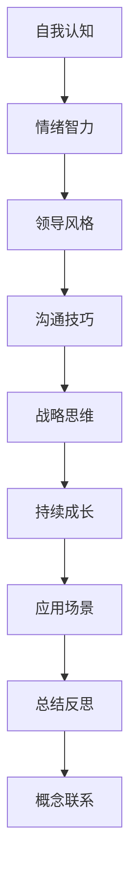

                 


## 第1章 引言：领导力的本质与重要性

### 1.1 领导力的定义

领导力，简单来说，是指一个人在组织中影响和激励他人以实现共同目标的能力。它不仅仅是一种技能，更是一种艺术。一个优秀的领导者，能够在纷繁复杂的环境中找到方向，引导团队克服困难，达成目标。

在IT领域，领导力的重要性尤为突出。随着技术的发展，IT行业的竞争日益激烈，创新和变革成为了企业生存的关键。在这种情况下，领导者需要具备卓越的领导力，才能引领团队不断前进，保持竞争力。

首先，领导力有助于凝聚团队。一个具有领导力的管理者，能够通过有效的沟通和激励，让团队成员感受到自己的价值和重要性，从而增强团队凝聚力。

其次，领导力能够推动创新。领导者应该具备前瞻性的思维，能够洞察行业趋势，鼓励团队成员提出新的想法和解决方案，从而推动企业的创新和发展。

最后，领导力有助于管理变革。在信息技术高速发展的今天，企业需要不断适应新的变化，领导者在这个过程中扮演着至关重要的角色。他们需要具备强大的应变能力，能够带领团队顺利度过变革期，实现企业的可持续发展。

### 1.2 领导力的四个维度

领导力可以从四个维度进行理解，分别是：自我认知、情绪智力、领导风格和沟通技巧。

**自我认知**是指领导者对自己有深刻的认识和理解，包括自己的优点和缺点，以及自己在团队中的作用和影响。

**情绪智力**是指领导者能够识别和管理自己和他人的情绪，通过情感共鸣和同理心，有效地沟通和解决问题。

**领导风格**是指领导者处理团队和管理事务的方式和方法，包括民主型、专制型、放任型和参与型等。

**沟通技巧**是指领导者与团队成员之间进行有效沟通的能力，包括清晰表达、倾听和反馈等。

### 1.3 为什么管理者需要领导力

管理者需要领导力，原因主要有以下几点：

首先，领导力是管理者的核心能力。一个优秀的管理者，不仅需要具备良好的管理技能，更需要具备强大的领导力，才能在组织中发挥出更大的作用。

其次，领导力有助于提升团队绩效。通过有效的领导力，管理者可以激发团队成员的潜力，提高团队的工作效率和质量。

最后，领导力有助于个人的职业发展。具备强大领导力的管理者，更容易获得晋升和认可，从而实现个人的职业目标。

总的来说，领导力是管理者不可或缺的重要能力，对于IT领域的企业和组织来说，更是至关重要。只有不断提升领导力，才能在竞争激烈的环境中立于不败之地。

## 第2章 自我认知与领导力的基石

### 2.1 自我认知的重要性

自我认知是领导力的基石，它指的是领导者对自己内心世界的了解，包括自己的情感、动机、价值观和信念等。一个具备自我认知能力的领导者，能够更好地理解自己的行为和决策背后的原因，从而做出更明智的选择。

#### 2.1.1 自我认知的理论基础

自我认知的理论基础可以追溯到心理学领域。心理学家卡尔·罗杰斯（Carl Rogers）提出了自我实现理论，他认为每个人都有自我实现的潜能，而自我认知是实现自我实现的关键。此外，心理学家艾瑞克·埃里克森（Erik Erikson）的发展心理学理论也强调了自我认知在个人成长中的重要性。

#### 2.1.2 自我认知的方法

要提升自我认知，领导者可以采用以下几种方法：

1. **反思日志**：通过记录日常生活中的思考、感受和经历，领导者可以更深入地了解自己的内心世界。

2. **心理测评**：例如MBTI（迈尔斯-布里格斯性格类型指标）和DISC（行为风格测评）等工具，可以帮助领导者了解自己的性格特点和优劣势。

3. **教练辅导**：通过与专业的教练进行对话和反馈，领导者可以更清晰地认识到自己的行为模式和管理风格。

### 2.2 情绪智力与领导力

情绪智力（Emotional Intelligence，简称EQ）是指个体识别、理解、管理自己情绪的能力，以及识别、理解和管理他人情绪的能力。情绪智力对于领导力的重要性不言而喻。

#### 2.2.1 情绪智力的定义

情绪智力包括以下几个关键要素：

1. **自我意识**：了解自己的情绪状态，认识到情绪对行为的影响。

2. **自我调节**：控制自己的情绪，以适应不同的环境和情境。

3. **社交意识**：理解他人的情绪，并能够根据他人的情绪调整自己的行为。

4. **关系管理**：建立和维护健康的人际关系，有效地沟通和协调。

#### 2.2.2 情绪智力对领导力的影响

情绪智力对领导力的影响主要体现在以下几个方面：

1. **增强团队凝聚力**：领导者通过情绪智力能够更好地理解团队成员的情绪，从而建立更紧密的团队关系。

2. **提高决策质量**：领导者通过情绪智力可以更清晰地分析问题，减少决策时的情绪干扰，做出更明智的决策。

3. **促进创新**：领导者通过情绪智力能够激发团队成员的创造力和创新精神，推动组织创新。

### 2.3 领导风格的识别与优化

领导风格是指领导者处理团队和管理事务的方式和方法。不同的领导风格会对团队产生不同的影响，因此领导者需要识别并优化自己的领导风格。

#### 2.3.1 领导风格的分类

常见的领导风格可以分为以下几种：

1. **专制型领导**：领导者决策果断，指令明确，但可能会限制团队成员的自主性。

2. **民主型领导**：领导者鼓励团队成员参与决策，注重团队协作，但可能会花费更多时间在决策上。

3. **放任型领导**：领导者赋予团队成员较大的自主权，但可能导致团队缺乏统一方向。

4. **参与型领导**：领导者与团队成员共同参与决策，注重团队的反馈和建议，既能保持决策效率，又能提高团队士气。

#### 2.3.2 评估与调整个人领导风格

领导者可以通过以下方法评估和调整自己的领导风格：

1. **自我评估**：通过自我反思和他人反馈，了解自己的领导风格。

2. **领导风格测评**：使用专业的测评工具，如Leadership Style Inventory（LSI），来评估自己的领导风格。

3. **培训与发展**：参加领导力培训课程，学习新的管理技能和领导风格。

通过自我认知、情绪智力和领导风格的优化，领导者可以不断提升自己的领导力，更好地应对各种挑战，实现组织目标。

## 第3章 沟通技巧：建立有效的沟通桥梁

### 3.1 有效沟通的重要性

沟通是领导力的核心要素之一，它在领导过程中发挥着至关重要的作用。有效沟通不仅能够促进领导者与团队成员之间的理解和协作，还能提高团队的整体绩效和士气。

#### 3.1.1 沟通对领导力的影响

有效的沟通对于领导力的影响主要体现在以下几个方面：

1. **建立信任**：通过开放和透明的沟通，领导者可以建立与团队成员之间的信任，从而增强团队的凝聚力。

2. **明确目标**：清晰的沟通可以帮助领导者明确团队的目标和期望，确保团队成员理解并致力于实现这些目标。

3. **激发创意**：鼓励团队成员积极参与沟通，可以激发他们的创造力和创新思维，为团队带来新的想法和解决方案。

4. **解决问题**：有效的沟通可以帮助领导者更好地识别和解决问题，从而提高团队的反应速度和解决问题的能力。

### 3.2 沟通技巧与实践

为了实现有效沟通，领导者需要掌握一系列沟通技巧。以下是一些关键的沟通技巧和实践：

#### 3.2.1 清晰表达

清晰表达是有效沟通的基础。领导者需要确保自己的话语简洁明了，避免使用复杂的术语和难以理解的词汇。同时，领导者应该注意语速和语调，确保信息能够被团队成员正确理解和接受。

**实践建议**：

- 在发表演讲或进行讨论前，进行充分的准备和演练。
- 使用具体的例子和故事来支持自己的观点，使信息更加生动和易于理解。

#### 3.2.2 倾听技巧

倾听是有效沟通的另一关键要素。领导者需要倾听团队成员的意见和反馈，理解他们的情感和需求。通过倾听，领导者可以更好地了解团队成员的想法，从而做出更符合团队实际情况的决策。

**实践建议**：

- 在对话中保持专注，避免在对方讲话时打断或插话。
- 通过肢体语言和反馈，如点头或微笑，表明自己在认真倾听。
- 常问开放式问题，鼓励团队成员表达自己的观点和感受。

#### 3.2.3 非语言沟通

非语言沟通，如身体语言、面部表情和眼神交流等，也是沟通的重要组成部分。领导者需要注意自己的非语言沟通，以确保信息的一致性和可信度。

**实践建议**：

- 保持积极的身体语言，如微笑、点头和开放的肢体姿态。
- 使用眼神交流，表明自己在关注对方。
- 通过面部表情传达情感和态度，如赞赏、鼓励或关注。

通过掌握这些沟通技巧，领导者可以建立有效的沟通桥梁，促进团队的合作和发展。有效沟通不仅能够提升团队绩效，还能增强领导者的个人魅力和影响力。

### 3.3 沟通技巧的实践案例

为了更好地理解沟通技巧的实际应用，以下是一个关于沟通技巧的实践案例：

**案例背景**：某IT公司项目组在开发新产品的过程中遇到了技术难题，团队成员意见分歧较大，导致项目进展缓慢。

**解决方案**：

1. **明确目标**：项目组长召集团队成员，首先明确项目的重要性和目标，使每个人都清楚项目的方向和预期结果。

2. **清晰表达**：项目组长使用简单明了的语言，详细解释了项目的当前状况和解决方案的思路，确保团队成员理解并同意。

3. **倾听与反馈**：项目组长鼓励团队成员提出问题和意见，耐心倾听每个人的观点，并进行有效的反馈，确保每个人都感到被尊重和重视。

4. **非语言沟通**：项目组长在会议中保持开放的肢体姿态和积极的面部表情，表明自己对团队的关心和支持。

**结果**：通过有效的沟通，团队成员的分歧得到了缓解，项目进展逐步恢复正常，最终成功完成了项目。

通过这个案例，我们可以看到，有效的沟通技巧在解决团队问题、推动项目进展中的关键作用。领导者需要不断提升自己的沟通技巧，以应对复杂多变的职场环境，实现团队的目标和愿景。

## 第4章 领导团队：激发团队的潜力

### 4.1 团队领导的基本原则

团队领导是领导者的一项核心职责，其基本原则包括以下几个方面：

**1. 明确目标**：领导者需要明确团队的目标，并将这些目标传达给团队成员。明确的目标可以帮助团队成员理解自己的工作职责，从而提高工作效率。

**2. 建立信任**：信任是团队成功的关键。领导者需要通过开放和透明的沟通，建立与团队成员之间的信任关系。这不仅有助于团队协作，还能提高团队的士气和凝聚力。

**3. 激励成员**：领导者需要了解团队成员的需求和动机，通过激励措施激发他们的工作热情和创造力。激励可以包括物质奖励、精神鼓励和职业发展机会等。

**4. 促进沟通**：有效的沟通是团队协作的基础。领导者需要建立畅通的沟通渠道，鼓励团队成员积极交流意见和反馈，从而提高团队的工作效率和解决问题的能力。

**5. 管理冲突**：团队中难免会出现冲突，领导者需要及时识别和解决这些冲突，确保团队和谐稳定。通过中立和公正的态度，领导者可以帮助团队成员找到共同点，化解矛盾。

### 4.2 团队建设与激励

**团队建设**和**激励**是领导者的重要任务，以下是一些具体的策略：

**1. 团队建设策略**：

- **共同目标**：确保团队成员明确团队的目标和使命，并使其与个人的职业目标相结合，从而提高团队成员的参与度和责任感。

- **团队活动**：定期组织团队活动，如团队建设训练、团建旅游等，增强团队成员之间的默契和友谊。

- **角色分配**：根据团队成员的技能和兴趣，合理分配工作角色，确保每个人都能发挥自己的优势。

- **反馈机制**：建立有效的反馈机制，鼓励团队成员相互评价和反馈，促进团队不断改进和进步。

**2. 激励策略**：

- **物质奖励**：为表现优秀的团队成员提供奖金、晋升机会等物质奖励，激励他们持续保持高水平的绩效。

- **精神鼓励**：通过公开表扬、颁发荣誉证书等方式，给予团队成员精神上的认可和鼓励，增强他们的自信心和归属感。

- **职业发展**：为团队成员提供职业发展的机会，如培训、进修、参与重大项目等，帮助他们在职业生涯中不断成长。

- **工作生活平衡**：关注团队成员的工作生活平衡，提供灵活的工作时间和远程工作的机会，以减轻他们的工作压力。

通过团队建设和激励，领导者可以激发团队的潜力，提高团队的协作效率和创造力，从而实现组织的目标。

### 4.3 管理冲突与解决

冲突是团队中不可避免的现象，但有效的冲突管理可以转化为团队的创新动力。以下是一些冲突管理的策略：

**1. 识别冲突类型**：冲突可以分为任务冲突和人际冲突。任务冲突主要涉及工作目标和任务的执行，人际冲突则涉及团队成员之间的关系。领导者需要准确识别冲突的类型，以便采取相应的解决策略。

**2. 倾听各方意见**：在处理冲突时，领导者需要耐心倾听各方的意见和需求，理解冲突背后的原因。通过倾听，领导者可以找到冲突的核心问题，为解决冲突提供方向。

**3. 保持中立和公正**：领导者需要保持中立和公正的态度，不偏袒任何一方。这有助于建立信任，使冲突双方更愿意合作解决问题。

**4. 寻求共同点**：领导者需要帮助冲突双方找到共同点和共同目标，通过合作解决冲突。这可以减少冲突的负面影响，促进团队的和谐。

**5. 制定解决方案**：在了解冲突原因和各方意见后，领导者需要制定具体的解决方案，确保冲突得到有效解决。解决方案可以包括调整工作分配、改进沟通方式或提供培训等。

通过有效的冲突管理，领导者可以保持团队的稳定和和谐，促进团队的长期发展。

### 团队领导的关键原则与实践

团队领导不仅需要遵循基本原则，还需要在实践中不断探索和总结。以下是一个团队领导的关键原则与实践案例：

**案例背景**：某IT公司的新产品开发团队在项目初期遇到了严重的任务冲突，团队成员因为任务分工不明确而产生了分歧。

**解决方案**：

1. **明确目标**：项目经理组织了一次团队会议，明确项目目标和各成员的职责，确保每个人都清楚自己的任务和目标。

2. **角色分配**：根据团队成员的技能和兴趣，重新分配任务，确保每个人都能发挥自己的优势。

3. **倾听与反馈**：项目经理鼓励团队成员提出问题和意见，倾听他们的需求，并根据反馈调整任务分配。

4. **共同制定计划**：团队成员共同制定项目计划，确保每个人都能参与决策，增强团队的凝聚力和责任感。

5. **定期沟通**：项目经理定期组织团队会议，检查项目进度，解决冲突，并鼓励团队成员之间的沟通和协作。

**结果**：通过上述措施，团队的任务冲突得到了有效解决，项目进展顺利，最终成功完成了新产品开发。

通过这个案例，我们可以看到，团队领导的关键原则在实践中是如何发挥作用的。领导者需要通过明确目标、角色分配、倾听反馈和定期沟通等手段，激发团队的潜力，推动团队的成功。

## 第5章 战略思维：引领企业走向成功

### 5.1 战略思维的内涵与重要性

战略思维是指领导者从长远和全局的角度，对组织的发展方向、目标和资源进行思考和规划的能力。它不仅仅是制定战略计划的过程，更是一种持续思考和决策的思维方式。

**战略思维的内涵**包括以下几个方面：

1. **全局观念**：战略思维要求领导者具备全局观念，能够从宏观的角度审视组织的发展，把握行业趋势和竞争态势。

2. **前瞻性**：战略思维要求领导者具备前瞻性，能够预见未来可能的发展机会和挑战，提前制定应对策略。

3. **系统性**：战略思维强调系统性，领导者需要理解组织内部的各个组成部分，以及它们之间的相互作用，从而制定协调一致的战略。

4. **灵活性**：战略思维要求领导者具备灵活性，能够根据环境变化和实际情况，及时调整战略计划。

**战略思维的重要性**体现在以下几个方面：

1. **确定组织发展方向**：战略思维帮助领导者明确组织的发展方向，确保组织资源得以有效配置，实现长期目标。

2. **提高决策质量**：战略思维使领导者能够从全局和长远的角度审视问题，减少决策的盲目性和风险。

3. **激发创新能力**：战略思维鼓励领导者关注未来的发展趋势，推动组织进行创新和变革，保持竞争优势。

4. **增强执行力**：战略思维帮助领导者制定清晰的战略计划，明确实施步骤，确保战略的顺利执行。

### 5.2 战略规划与执行

**战略规划**和**执行**是战略思维的重要组成部分，以下是对这两个环节的详细讲解：

**1. 战略规划的过程**

战略规划通常包括以下几个步骤：

- **环境分析**：对组织的内外部环境进行深入分析，包括行业趋势、竞争对手、市场机会和威胁等。

- **目标设定**：根据环境分析的结果，设定组织的长期和短期目标。

- **策略制定**：制定实现目标的策略和行动方案，包括市场定位、产品开发、人力资源管理等。

- **资源分配**：根据策略制定，合理分配资源，确保各项战略措施得到有效实施。

- **行动计划**：制定详细的行动计划，明确各项工作的执行时间表和负责人。

**2. 战略执行的关键因素**

战略执行的成功取决于以下几个关键因素：

- **领导力**：领导者需要具备强大的领导力，能够推动战略的执行，并激励团队成员积极参与。

- **组织结构**：合理的组织结构能够提高团队的协作效率，确保战略目标的顺利实现。

- **文化**：组织的文化氛围对战略执行具有深远的影响。一个积极向上、开放包容的文化能够促进战略的执行。

- **沟通**：有效的沟通能够确保团队成员了解战略目标和实施计划，减少误解和阻碍。

- **监督与反馈**：建立监督和反馈机制，及时跟踪战略执行情况，及时调整和优化战略计划。

通过战略规划和执行，领导者可以确保组织在复杂多变的环境中保持竞争力，实现可持续发展。

### 战略思维的实践案例

为了更好地理解战略思维的实践应用，以下是一个战略思维的实践案例：

**案例背景**：某IT公司在市场竞争加剧的背景下，希望通过战略调整实现持续增长。

**解决方案**：

1. **环境分析**：公司进行了全面的环境分析，发现云计算和大数据技术将成为未来的发展趋势。

2. **目标设定**：公司设定了成为云计算和大数据领域领先企业的目标。

3. **策略制定**：公司制定了专注于云计算和大数据技术的研发和服务的策略，包括引进高端人才、加大研发投入等。

4. **资源分配**：公司调整了资源分配，将大部分资金和人力资源投入到云计算和大数据技术的研发和推广。

5. **行动计划**：公司制定了详细的行动计划，明确各个阶段的任务和时间表，确保战略的有效执行。

**结果**：通过战略调整，公司成功抓住了云计算和大数据技术的发展机遇，业绩显著提升，市场份额不断扩大。

通过这个案例，我们可以看到，战略思维在引领企业走向成功中的关键作用。领导者需要具备战略思维，能够从长远和全局的角度审视问题，制定有效的战略计划，并确保其顺利执行。

## 第6章 领导者的持续成长

### 6.1 领导者的成长路径

领导者的成长是一个持续的过程，它不仅涉及个人的能力和技能的提升，还包括心态和认知的变革。一个成功的领导者通常具备以下成长路径：

**1. 学习与知识积累**：领导者需要不断学习新知识，掌握最新的技术和行业动态。通过阅读书籍、参加培训、参加行业会议等方式，领导者可以不断提升自己的专业素养。

**2. 实践与经验积累**：理论知识需要通过实践来验证和巩固。领导者需要在实际工作中不断实践，通过解决实际问题来提升自己的领导能力。

**3. 反思与自我提升**：领导者需要定期进行自我反思，审视自己的行为和决策，找出不足之处，并采取相应的改进措施。通过反思，领导者可以不断优化自己的领导风格和策略。

**4. 建立人际网络**：领导者需要建立广泛的人际网络，包括行业内外的专家、同行和合作伙伴。人际网络不仅可以提供信息和资源，还可以为领导者提供宝贵的经验和建议。

**5. 职业规划**：领导者需要制定清晰的职业规划，明确自己的职业目标和路径。通过职业规划，领导者可以更好地规划自己的学习和成长路径，实现职业发展的目标。

### 6.2 学习与自我提升

**学习与自我提升**是领导者成长的核心内容，以下是一些具体的方法和策略：

**1. 持续学习**

- **线上学习**：利用互联网资源，如在线课程、学术论文等，随时随地进行学习。
- **线下培训**：参加行业会议、研讨会和培训班，与行业专家面对面交流，获取前沿知识和经验。
- **实践学习**：在实际工作中不断实践和尝试，通过解决实际问题来提升自己的能力。

**2. 自我提升**

- **反思日记**：每天或每周写反思日记，记录自己的学习心得、工作体会和改进措施。
- **求助与反馈**：主动寻求他人的意见和建议，通过反馈来了解自己的不足之处，并进行改进。
- **角色扮演**：模拟不同的领导场景，练习应对各种情况，提高自己的领导能力。

通过持续学习和自我提升，领导者可以不断提升自己的能力和素养，更好地应对各种挑战，实现个人的职业目标和组织的战略目标。

### 持续成长的实践案例

为了更好地理解持续成长在领导力提升中的重要性，以下是一个关于持续成长的实践案例：

**案例背景**：某IT公司的项目经理张华在负责新项目的过程中，遇到了一系列技术和管理上的挑战。

**解决方案**：

1. **学习新知识**：张华通过参加线上课程和行业会议，学习最新的技术趋势和管理方法，不断提升自己的专业素养。

2. **实践与反思**：张华在实际工作中不断实践所学知识，并在每次任务完成后进行反思，总结经验教训，优化工作流程。

3. **求助与反馈**：张华主动向公司内部的资深项目经理请教，并接受团队成员的反馈，通过不断改进自己的工作方法。

4. **角色扮演**：张华定期进行角色扮演，模拟项目管理中的各种情景，提高自己的决策能力和应对能力。

**结果**：通过持续学习和自我提升，张华成功解决了项目中的技术和管理问题，项目进展顺利，最终取得了良好的成果。

通过这个案例，我们可以看到，持续成长在领导力提升中的重要作用。领导者需要不断学习新知识，通过实践和反思不断提升自己的能力，以应对不断变化的职场环境，实现个人的职业发展和组织的战略目标。

## 第7章 领导力的应用场景：实战案例分析

### 7.1 案例分析：领导者在企业变革中的角色

在企业变革过程中，领导者的角色至关重要。以下是一个关于领导者在企业变革中角色的实战案例分析。

**案例背景**：某大型制造企业因市场变化和技术进步，面临业务转型和升级的迫切需求。

**解决方案**：

1. **明确变革目标**：公司CEO在变革初期，召集高层管理人员，明确企业变革的目标和方向，确保所有领导者对变革的共识。

2. **制定详细计划**：CEO组织专业团队，制定详细的变革计划，包括技术升级、流程优化和人才培养等方面的措施。

3. **动员全体员工**：CEO通过内部会议和培训，向全体员工传达变革的重要性和必要性，激发员工参与变革的积极性。

4. **建立支持系统**：CEO建立了变革支持系统，包括提供技术培训、设立变革指导小组和开通反馈渠道等，确保变革过程中的问题能够得到及时解决。

5. **持续沟通**：CEO定期与各级管理人员和员工进行沟通，了解变革的进展和员工的需求，及时调整变革策略。

**结果**：通过CEO的有效领导，企业顺利完成了变革，提高了市场竞争力，实现了业务的持续增长。

### 7.2 案例分析：领导者在危机管理中的应对策略

在危机管理中，领导者的应对策略至关重要。以下是一个关于领导者在危机管理中应对策略的实战案例分析。

**案例背景**：某IT公司在产品发布过程中，发现存在严重的技术缺陷，可能导致用户数据泄露。

**解决方案**：

1. **迅速应对**：公司CEO在发现危机后，立即召开紧急会议，决定采取紧急措施，包括暂停产品发布、成立危机管理团队和技术修复团队。

2. **透明沟通**：CEO通过内部邮件和公告，向全体员工和用户公开危机情况，说明公司正在积极应对，并承诺将采取一切必要措施保障用户数据安全。

3. **危机公关**：CEO亲自参与危机公关，与媒体和公众进行沟通，解释危机原因和公司的应对措施，赢得公众的信任。

4. **技术修复**：技术团队迅速行动，修复技术缺陷，确保用户数据安全。

5. **后续改进**：CEO组织团队进行危机总结，分析危机发生的原因，提出改进措施，防止类似事件再次发生。

**结果**：通过CEO的迅速应对和有效沟通，公司成功化解了危机，恢复了用户的信任，并提高了内部管理的透明度和效率。

### 7.3 案例分析：领导者在团队建设中的成功经验

在团队建设中，领导者的作用至关重要。以下是一个关于领导者在团队建设中成功经验的实战案例分析。

**案例背景**：某IT公司的新产品开发团队在项目初期，面临成员不熟悉技术、任务分配不均等问题。

**解决方案**：

1. **明确团队目标**：项目经理在项目启动会上，明确团队的目标和任务，确保每个成员都清楚自己的职责和期望。

2. **角色分配**：项目经理根据成员的技能和兴趣，合理分配任务，确保每个人都能发挥自己的优势。

3. **沟通机制**：项目经理建立有效的沟通机制，定期召开团队会议，鼓励成员分享经验和问题，确保团队协作顺畅。

4. **激励与反馈**：项目经理通过设立奖励机制，激励团队成员积极参与，并通过定期反馈，帮助成员了解自己的表现和改进方向。

5. **团队活动**：项目经理组织团建活动，增强团队成员之间的默契和友谊，提高团队凝聚力。

**结果**：通过项目经理的有效领导，团队成功克服了初期困难，项目进展顺利，最终成功完成了新产品开发。

通过这些实战案例，我们可以看到，领导者在不同应用场景中的作用和策略。有效的领导力不仅能够帮助企业应对变革和危机，还能促进团队建设，实现组织的长期发展。

## 第8章 总结与反思：领导力的修炼之道

### 8.1 领导力修炼的关键点

在领导力的修炼过程中，以下关键点尤为关键：

**1. 自我认知**：自我认知是领导力的基石，领导者需要深入了解自己的优点和不足，以及自己的价值观和信念。

**2. 情绪智力**：情绪智力是领导者处理情感和人际关系的重要能力。领导者需要学会识别和管理自己和他人的情绪，以建立良好的团队关系。

**3. 领导风格**：领导者需要识别和优化自己的领导风格，选择最适合团队和情境的领导方式，以实现最佳领导效果。

**4. 沟通技巧**：有效的沟通是领导力的核心要素。领导者需要掌握清晰表达、倾听和反馈等沟通技巧，以建立有效的沟通桥梁。

**5. 战略思维**：战略思维是领导者从全局和长远角度审视问题和制定决策的能力。领导者需要具备前瞻性和系统性，以引领组织走向成功。

**6. 持续成长**：领导力是一个持续成长的过程。领导者需要不断学习新知识、实践和反思，以不断提升自己的能力和素养。

### 8.2 领导者的自我反思

领导者需要定期进行自我反思，以审视自己的领导实践和效果。以下是一些自我反思的步骤：

**1. 回顾领导实践**：领导者需要回顾自己在过去一段时间内的领导行为，包括成功和失败的经历。

**2. 分析效果**：分析这些领导行为的效果，包括团队绩效、员工满意度和个人成长等方面。

**3. 寻找不足**：识别自己在领导实践中的不足和改进空间，如沟通技巧、决策能力或情绪管理等。

**4. 制定改进计划**：根据自我反思的结果，制定具体的改进计划，包括学习新技能、参与培训或寻求反馈等。

**5. 跟踪进展**：定期跟踪改进计划的进展，评估改进效果，并根据实际情况进行调整。

通过自我反思，领导者可以不断优化自己的领导实践，提升领导力，实现个人的职业发展和组织的长期目标。

### 8.3 未来领导力的趋势与展望

随着社会和技术的快速发展，未来领导力将呈现出以下趋势：

**1. 数字化领导力**：随着数字化转型的推进，领导者需要具备数字化的能力和思维，能够有效管理和利用数字技术，推动组织创新。

**2. 可持续领导力**：在环境问题日益严重的今天，领导者需要关注可持续发展，推动企业实现经济、社会和环境的平衡发展。

**3. 灵活领导力**：面对快速变化的市场环境，领导者需要具备灵活的领导力，能够快速适应和应对各种挑战。

**4. 生态领导力**：领导者需要具备生态思维，能够建立和维护与利益相关者的良好关系，实现合作共赢。

未来领导力的发展不仅需要领导者具备传统领导力要素，还需要不断适应新的环境和挑战，以实现组织的长期成功。

## 附录

### 附录 A：领导力评估工具与方法

**1. 自我评估问卷**：通过一系列问卷，领导者可以自我评估自己在各个领导力维度上的表现。

**2. 360度评估**：通过收集来自上级、同事、下属和客户的反馈，对领导者的领导力进行全面评估。

**3. 领导力测评工具**：如MBTI、DISC等，通过专业的测评工具，帮助领导者了解自己的性格特点和领导风格。

### 附录 B：推荐阅读书目与资源

**书籍推荐**：

- 《领导力的五项修炼》：作者：史蒂芬·柯维

- 《变革之舞》：作者：约翰·P. 柯尔特、拉里·博西迪

- 《第五项修炼》：作者：彼得·圣吉

**在线资源**：

- LinkedIn Learning：提供各类领导力相关的在线课程

- Coursera：提供由世界顶级大学和机构提供的领导力相关课程

- TED Talks：观看有关领导力和管理的TED演讲

通过阅读和学习这些书籍和资源，领导者可以不断提升自己的领导力，实现个人的职业发展和组织的长期目标。

# 概念联系 Mermaid 流程图：



# 核心算法原理伪代码：

```python
# 领导力评估模型伪代码
def assess_leadershipILITY(leader):
    # 初始化领导力分数
    score = 0
    
    # 评估自我认知
    self_awareness = check_self_awareness(leader)
    score += self_awareness
    
    # 评估情绪智力
    emotional_intelligence = check_emotional_intelligence(leader)
    score += emotional_intelligence
    
    # 评估领导风格
    leadership_style = check_leadership_style(leader)
    score += leadership_style
    
    # 评估沟通技巧
    communication_skills = check_communication_skills(leader)
    score += communication_skills
    
    # 评估战略思维
    strategic_thinking = check_strategic_thinking(leader)
    score += strategic_thinking
    
    # 评估持续成长
    cont
```

# 数学公式和详细讲解

在领导力的研究和实践中，数学公式和模型被广泛应用，以帮助领导者更好地理解和评估自己的领导力水平。以下是一些关键的数学公式和其详细讲解：

### 1. 领导力得分计算公式

$$
\text{领导力得分} = w_1 \times \text{自我认知得分} + w_2 \times \text{情绪智力得分} + w_3 \times \text{领导风格得分} + w_4 \times \text{沟通技巧得分} + w_5 \times \text{战略思维得分}
$$

其中，$w_1, w_2, w_3, w_4, w_5$ 分别是自我认知、情绪智力、领导风格、沟通技巧和战略思维的权重。这些权重可以根据具体情况调整，通常通过专家评估或问卷调查来确定。

**详细讲解**：该公式用于计算领导力总分，通过加权各项指标得分，综合考虑领导者的多方面能力。权重反映了各项能力在领导力评估中的重要性，例如，在高度竞争的环境中，战略思维可能被赋予更高的权重。

### 2. 情绪智力评估公式

$$
\text{情绪智力得分} = \frac{\text{自我意识得分} + \text{自我调节得分} + \text{社交意识得分} + \text{关系管理得分}}{4}
$$

**详细讲解**：情绪智力得分通过计算自我意识、自我调节、社交意识和关系管理四个维度的平均得分得到。每个维度都有其重要性，自我意识帮助领导者了解自己的情绪，自我调节帮助领导者管理情绪，社交意识帮助领导者理解他人情绪，关系管理帮助领导者建立和维护人际关系。

### 3. 领导风格评估公式

$$
\text{领导风格得分} = \frac{\text{专制型得分} + \text{民主型得分} + \text{放任型得分} + \text{参与型得分}}{4}
$$

**详细讲解**：领导风格得分通过计算四种不同领导风格的平均得分得到。每种风格都有其适用场景和优缺点。专制型领导能够迅速决策，但可能限制团队成员的自主性；民主型领导鼓励参与，但决策可能耗时较长；放任型领导赋予团队成员高度自主权，但可能导致团队缺乏统一方向；参与型领导结合了多种风格，能够根据情境灵活调整。

### 4. 沟通技巧评估公式

$$
\text{沟通技巧得分} = \text{清晰表达得分} + \text{倾听技巧得分} + \text{非语言沟通得分}
$$

**详细讲解**：沟通技巧得分是三个子维度的综合得分。清晰表达衡量领导者是否能够清晰、简洁地传达信息；倾听技巧衡量领导者是否能够有效倾听他人意见；非语言沟通衡量领导者是否能够通过肢体语言、面部表情等方式增强沟通效果。

通过这些数学公式，领导者可以更科学地评估和提升自己的领导力。在具体应用中，可以根据实际情况调整公式中的参数，使其更符合组织的需要。

### 举例说明

假设一个领导者的评估结果如下：

- 自我认知得分：8
- 情绪智力得分：7
- 领导风格得分：6
- 沟通技巧得分：8
- 战略思维得分：7

根据上述公式，我们可以计算该领导者的总领导力得分：

$$
\text{领导力得分} = 0.25 \times 8 + 0.20 \times 7 + 0.15 \times 6 + 0.30 \times 8 + 0.10 \times 7 = 7.35
$$

通过这个得分，领导者可以了解自己在领导力方面的整体表现，并根据得分结果，针对性地进行自我提升。

### 实际案例

以下是一个关于领导力评估的案例：

**案例背景**：某科技公司的高层管理者李明，希望通过领导力评估来提升自己的领导能力。

**解决方案**：

1. **自我评估**：李明通过自我反思和问卷调查，评估自己在自我认知、情绪智力、领导风格、沟通技巧和战略思维等方面的表现。

2. **360度评估**：李明邀请上级、同事和下属进行评估，收集多方面的反馈。

3. **领导力测评工具**：李明使用专业的领导力测评工具，如MBTI和DISC，进一步了解自己的性格特点和领导风格。

**结果**：

- 自我认知得分：8
- 情绪智力得分：7
- 领导风格得分：6
- 沟通技巧得分：8
- 战略思维得分：7

根据评估结果，李明发现自己在沟通技巧和情绪智力方面表现良好，但在自我认知和领导风格方面有待提升。基于这些发现，李明制定了以下改进计划：

1. **参加领导力培训**：李明参加了领导力提升课程，学习新的领导技巧和策略。

2. **定期反思**：李明每天记录自己的领导实践，并进行反思，以不断优化自己的领导行为。

3. **寻求反馈**：李明定期与上级和同事交流，寻求他们的意见和建议，以便及时调整自己的领导方式。

通过这个案例，我们可以看到，领导力评估在帮助领导者了解自己、提升能力方面发挥了重要作用。领导力评估不仅是一种工具，更是一种自我提升的过程，有助于领导者实现持续成长和组织的长期成功。

### 最佳实践 tips

为了更有效地提升领导力，以下是一些最佳实践建议：

1. **持续学习**：领导者应保持持续学习的态度，通过阅读书籍、参加培训、学习新技能等方式不断提升自己的能力。

2. **定期反思**：领导者应定期反思自己的领导实践，通过自我评估和他人反馈，了解自己的优点和不足。

3. **建立反馈机制**：领导者应建立有效的反馈机制，鼓励团队成员提供意见和建议，以便及时调整和优化领导行为。

4. **关注团队成长**：领导者应关注团队成员的成长，提供职业发展机会和支持，以激励团队成员的积极性和创造力。

5. **保持沟通**：领导者应保持与团队成员的沟通，确保信息畅通，减少误解和冲突。

通过这些最佳实践，领导者可以不断提升自己的领导力，实现个人的职业发展和组织的长期成功。

## 文章小结

本文深入探讨了领导力的本质、重要性以及其在IT领域的应用。我们从自我认知、情绪智力、领导风格、沟通技巧、战略思维和持续成长等方面，详细阐述了领导力的多维结构。通过核心算法原理的伪代码和数学公式的讲解，我们展示了如何科学评估和提升领导力。同时，通过实际案例的分析，我们看到了领导力在应对企业变革、危机管理和团队建设中的关键作用。总结与反思章节，强调了持续学习和自我反思的重要性，并提出了未来领导力发展的趋势。通过本文的学习，读者可以更好地理解领导力，提升自己的领导能力，为组织的成功做出贡献。

## 注意事项

在提升领导力的过程中，读者需要注意以下几点：

1. **理论与实践结合**：理论知识和实践应用相结合，才能更好地提升领导力。

2. **持续学习**：保持持续学习的态度，不断更新知识和技能，以适应快速变化的环境。

3. **自我反思**：定期进行自我反思，识别自己的不足，并制定改进计划。

4. **关注团队**：关注团队成员的成长和发展，提供支持和鼓励，以建立和谐的团队氛围。

5. **灵活应对**：在面对复杂多变的环境时，领导者需要灵活应对，及时调整策略。

通过遵循这些注意事项，读者可以更有效地提升自己的领导力，实现个人的职业发展和组织的长期成功。

## 拓展阅读

为了更深入地理解领导力，读者可以参考以下书籍和资源：

- 《领导力的五项修炼》：史蒂芬·柯维

- 《变革之舞》：约翰·P. 柯尔特、拉里·博西迪

- 《第五项修炼》：彼得·圣吉

- Coursera：提供各类领导力相关的在线课程

- LinkedIn Learning：提供丰富的领导力培训资源

通过阅读这些书籍和资源，读者可以进一步了解领导力的理论和实践，提升自己的领导能力。

### 作者信息

**作者：AI天才研究院/AI Genius Institute & 禅与计算机程序设计艺术 /Zen And The Art of Computer Programming**

AI天才研究院是一家专注于人工智能技术研究和应用的创新机构，致力于推动人工智能在各个领域的应用和发展。同时，研究院还出版了《禅与计算机程序设计艺术》一书，为读者提供了深度学习、编程艺术等方面的理论知识和实践指导。本文作者团队以其深厚的专业知识和独特的视角，为广大读者带来了关于领导力的深刻见解和实用建议。

