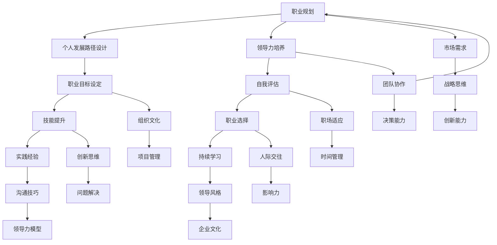

                 


### 1. 引言

#### 背景介绍

在现代商业环境中，管理者在企业运营和发展中扮演着至关重要的角色。他们不仅需要具备专业的业务知识和技能，还需要具备卓越的领导力和管理能力，以便有效地指导团队，推动企业创新，实现战略目标。然而，成为一名优秀的管理者并非易事，需要经过系统的职业规划、领导力培养和个人发展路径设计。

《管理者职业规划：设计个人领导力发展路径》这本书旨在为管理者提供一套完整的职业发展指南，帮助他们在职场中实现个人价值和企业目标的双赢。本书的主要内容和结构包括：引言、职业规划基础、领导力培养、个人发展路径设计、实战案例分析、结语等部分。

#### 核心概念与联系

为了更好地理解管理者职业规划和领导力发展的核心概念，我们可以使用Mermaid流程图来阐述各个概念之间的联系。以下是相关的Mermaid流程图：



通过这个流程图，我们可以清晰地看到职业规划、个人发展路径设计和领导力培养三者之间的相互关系。职业规划是整个过程的起点，包括职业目标设定、自我评估、职业选择等环节；个人发展路径设计则是在职业规划的基础上，进一步明确个人发展的具体路径和目标；领导力培养则是贯穿始终的过程，涵盖了自我评估、技能提升、实践经验、持续学习等多个方面。

#### 核心算法原理讲解

在领导力培养过程中，自我评估是一个关键的环节。通过自我评估，管理者可以了解自己的优势和不足，从而有针对性地进行提升。以下是一个简单的自我评估算法的伪代码：

```python
def self_evaluation():
    # 定义评估指标
    indicators = ["knowledge", "leadership", "communication", "teamwork", "problem_solving"]
    scores = []

    # 对每个指标进行评分
    for indicator in indicators:
        score = input(f"请对您的{indicator}能力进行评分（1-10分）：")
        scores.append(score)

    # 计算总分
    total_score = sum(scores)

    # 输出评估结果
    print(f"您的总分为：{total_score}/10")
    print(f"您的评估结果如下：")
    for i, score in enumerate(scores):
        print(f"{indicators[i]}：{score}/10")

    # 提出改进建议
    if total_score < 7:
        print("您可能需要针对以下方面进行提升：")
        for i, score in enumerate(scores):
            if score < 7:
                print(f"- {indicators[i]}")
```

这个伪代码提供了一个简单的自我评估框架，通过用户对知识、领导力、沟通、团队协作和问题解决等指标进行评分，计算出总分，并针对不足之处提出改进建议。

#### 数学模型和公式

在领导力培养过程中，除了自我评估，还需要考虑其他因素，如市场需求、团队协作能力等。以下是一个简单的线性规划模型，用于确定个人发展路径：

$$
\text{maximize} \quad \text{效用函数} \quad U(x, y)
$$

$$
\text{subject to} \quad C_1x + C_2y \leq B
$$

$$
\quad \quad \quad \quad \quad \quad \quad \quad x \geq 0, y \geq 0
$$

其中，$U(x, y)$ 是个人效用函数，$C_1$ 和 $C_2$ 分别是知识和管理能力的权重，$B$ 是预算限制，$x$ 和 $y$ 分别是知识投入和管理能力投入。

#### 详细讲解和举例说明

假设一个管理者希望在提高知识和管理能力的同时，确保预算在可控范围内。根据上述线性规划模型，我们可以设定以下参数：

- 知识权重 $C_1 = 0.6$
- 管理能力权重 $C_2 = 0.4$
- 预算限制 $B = 1000$

我们需要在以下两个选项中选择最优解：

- 选项一：参加一个为期三个月的领导力培训课程，费用为800元。
- 选项二：购买一系列专业书籍，总费用为500元。

根据线性规划模型，我们可以计算出这两个选项的效用值：

$$
U_1 = 0.6 \times 3 + 0.4 \times 0 = 1.8
$$

$$
U_2 = 0.6 \times 0 + 0.4 \times 3 = 1.2
$$

由于 $U_1 > U_2$，因此管理者应选择选项一，即参加领导力培训课程。

#### 实战案例

假设张三是某公司的一名中层管理者，他希望通过职业规划和领导力培养来实现个人价值的提升。根据前面的自我评估算法，他得出以下评估结果：

- 知识能力：8分
- 领导力：6分
- 沟通能力：7分
- 团队协作：7分
- 问题解决能力：7分

根据这些评估结果，张三决定在以下方面进行提升：

1. 参加领导力培训课程，以提高领导力能力。
2. 阅读专业书籍，增加知识储备。
3. 加强与团队成员的沟通和协作。

为了确保这些提升措施的有效性，张三制定了以下个人发展计划：

- 每周安排一天时间参加领导力培训课程。
- 每月阅读一本专业书籍，并撰写读书笔记。
- 定期组织团队会议，讨论项目进展和问题解决。

通过这些措施，张三在短短一年内，领导力得到了显著提升，团队协作能力也得到加强，最终实现了个人价值的提升。

#### 小结

通过本文的介绍，我们可以看到管理者职业规划和领导力发展是一个复杂而系统的过程。通过明确的职业规划、领导力培养和个人发展路径设计，管理者可以更好地实现个人价值和企业目标的双赢。在职业规划过程中，自我评估是一个关键环节，可以通过算法原理来辅助决策。同时，线性规划模型可以用于确定个人发展路径的最优解。最后，通过实际案例的分析，我们可以看到职业规划和领导力培养在实际应用中的效果。

在接下来的部分，我们将进一步探讨领导力培养的具体策略和实战案例，以帮助读者更深入地了解如何成为一名优秀的管理者。

