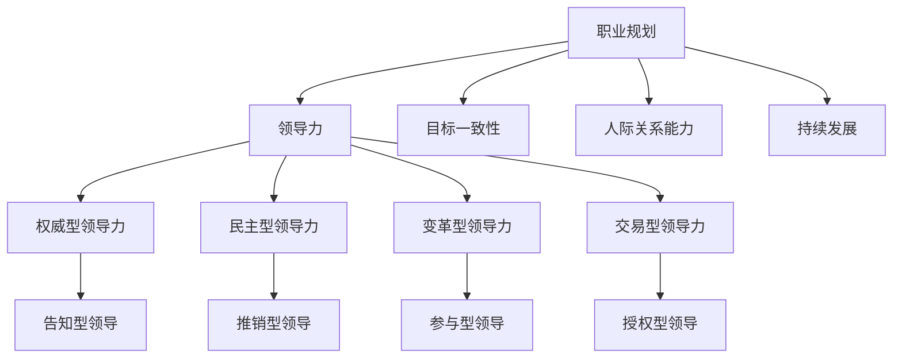

                 


## 第3章：领导力发展的基本概念

### 3.1 领导力的定义与类型

#### 领导力的定义

领导力是指一个人在组织中引导、激励和影响他人以实现共同目标的能力。它不仅包括技术和战略层面的能力，还涉及到人际交往、情感智慧和道德责任。

#### 领导力的类型

1. **权威型领导力（Authoritative Leadership）**

   权威型领导力强调领导者具有明确的目标和愿景，并通过权威和影响力来指导团队成员。这种领导力通常能够迅速做出决策，并要求团队成员遵守。

2. **民主型领导力（Democratic Leadership）**

   民主型领导力强调团队合作和参与，领导者鼓励团队成员参与决策过程，从而提高决策的质量和团队成员的满意度。

3. **变革型领导力（Transformational Leadership）**

   变革型领导力强调领导者的远见和激励能力，通过激发团队成员的内在动机和愿景，推动组织变革和持续改进。

4. **交易型领导力（Transactional Leadership）**

   交易型领导力强调领导者通过奖励和惩罚来激励团队成员，这种领导力注重短期目标和绩效。

### 3.2 领导力与职业规划的关系

#### 关键联系

领导力是职业规划的重要组成部分，良好的领导力能够帮助管理者在职业发展中取得成功。

1. **目标一致性**：领导力可以帮助管理者明确个人职业目标，并与组织的愿景保持一致。

2. **人际关系能力**：领导力强调人际交往和沟通能力，这是建立有效团队和实现目标的关键。

3. **持续发展**：领导力的发展是一个持续的过程，它要求管理者不断学习、成长和适应变化。

### 3.3 领导力发展的模型

#### 赫赛模型（Hersey-Blanchard Leadership Model）

赫赛模型是一种广泛使用的领导力发展模型，它基于情境领导理论，将领导行为与下属成熟度相结合。

- **情境1：告知型领导（Telling）**：领导者告诉团队成员应该做什么，怎么做。

- **情境2：推销型领导（Selling）**：领导者不仅告诉团队成员应该做什么，还解释原因，并寻求团队成员的参与。

- **情境3：参与型领导（Participating）**：领导者鼓励团队成员参与决策过程，共同制定行动计划。

- **情境4：授权型领导（Delegate）**：领导者给予团队成员自主权，让他们负责决策和完成任务。

### 关键概念与联系流程图

使用Mermaid流程图来表示领导力发展的关键概念和联系：



## 第4章：领导力发展的路径规划

### 4.1 领导力发展的步骤与策略

#### 步骤1：自我评估

- **目标**：了解自己的领导力优势和不足。

- **方法**：通过自我反思、360度反馈和领导力测试进行评估。

#### 步骤2：目标设定

- **目标**：明确自己的领导力发展目标。

- **方法**：设定具体的、可衡量的、相关的和有时限的目标（SMART目标）。

#### 步骤3：行动计划

- **目标**：制定实现领导力发展目标的行动计划。

- **方法**：分解目标，制定阶段性任务，设定关键绩效指标（KPI）。

#### 步骤4：持续学习与反馈

- **目标**：不断学习新的领导力知识和技能，并接受反馈。

- **方法**：参加领导力培训、研讨会和工作坊，定期进行自我评估和反馈。

### 4.2 领导力发展的障碍与解决方法

#### 障碍1：缺乏自信

- **解决方法**：通过成功的小目标建立自信，积极参与领导力发展活动。

#### 障碍2：资源限制

- **解决方法**：优先分配时间和资源，寻求外部支持和合作。

#### 障碍3：缺乏经验

- **解决方法**：通过实践和模拟提高领导力经验，寻求导师指导。

### 4.3 领导力发展的评估与调整

#### 评估方法

- **定期评估**：设定固定的时间节点，对领导力发展进行评估。

- **反馈机制**：建立有效的反馈机制，收集团队成员和其他相关者的意见。

#### 调整策略

- **目标调整**：根据评估结果，调整领导力发展目标。

- **行动计划调整**：优化行动计划，以实现领导力发展目标。

### 领导力发展路径规划伪代码

```python
def leadership_development_path():
    # 步骤1：自我评估
    self_evaluation()

    # 步骤2：目标设定
    set_goals()

    # 步骤3：行动计划
    create_action_plan()

    # 步骤4：持续学习与反馈
    continuous_learning_and_feedback()

    # 评估与调整
    assessment_and_adjustment()

def self_evaluation():
    # 使用360度反馈和领导力测试进行评估
    feedback = get_360_feedback()
    test_score = get_leadership_test_score()
    # 分析评估结果，记录优势和不足
    analyze_results(feedback, test_score)

def set_goals():
    # 设定具体的、可衡量的、相关的和有时限的目标
    goals = create_smart_goals()
    # 记录目标
    record_goals(goals)

def create_action_plan():
    # 分解目标，制定阶段性任务，设定关键绩效指标
    action_plan = create_action_plan_based_on_goals()
    # 执行行动计划
    execute_action_plan(action_plan)

def continuous_learning_and_feedback():
    # 参加领导力培训、研讨会和工作坊
    attend_leadership_training()
    # 定期进行自我评估和反馈
    periodic_self_evaluation_and_feedback()

def assessment_and_adjustment():
    # 定期评估
    periodic_assessment()
    # 反馈机制
    feedback_mechanism()
    # 根据评估结果调整目标和行动计划
    adjust_goals_and_action_plan()

# 执行领导力发展路径规划
leadership_development_path()
```

## 第5章：领导力提升的方法与工具

### 5.1 领导力培训与发展的实践

#### 培训内容

- **领导力基础**：包括领导力的定义、类型、原则和模型。

- **沟通技巧**：提高表达能力、倾听能力和冲突解决能力。

- **团队建设**：增强团队凝聚力、协作能力和创新能力。

- **变革管理**：理解组织变革的原理，掌握变革管理的策略。

#### 培训形式

- **内训**：组织内部开展培训，由内部或外部专家授课。

- **外训**：参加外部培训机构或高校开设的领导力课程。

- **在线学习**：利用网络平台进行自学，包括视频课程、电子书籍和在线论坛。

### 5.2 领导力发展的关键技能

#### 技能1：决策能力

- **目标**：在压力和不确定性下做出明智的决策。

- **方法**：使用决策树、成本-收益分析和决策支持系统等工具。

#### 技能2：影响力

- **目标**：在团队中建立信任，并影响他人的行为和态度。

- **方法**：使用情感智慧、影响力策略和沟通技巧。

#### 技能3：变革管理

- **目标**：推动组织变革，实现战略目标。

- **方法**：采用变革管理模型，如Kotter的八个步骤模型，进行变革管理。

### 5.3 领导力发展的实践案例

#### 案例1：某科技公司领导力发展项目

- **背景**：公司管理层发现团队缺乏领导力和协作能力。

- **解决方案**：实施领导力发展项目，包括领导力培训、团队建设和领导力评估。

- **结果**：团队凝聚力显著提升，工作效率提高，公司业绩增长。

#### 案例2：某医院变革管理项目

- **背景**：医院面临医疗资源紧张和患者满意度下降的问题。

- **解决方案**：通过变革管理项目，优化流程、提升服务质量。

- **结果**：医疗资源利用率提高，患者满意度显著提升，医院声誉提升。

### 领导力发展的最佳实践

#### 实践1：建立领导力发展计划

- **目标**：确保每位领导者都有明确的领导力发展计划。

- **方法**：制定领导力发展策略，包括培训计划、评估体系和激励机制。

#### 实践2：提供个性化发展机会

- **目标**：满足不同领导者的个性化发展需求。

- **方法**：提供多样化的培训和学习机会，鼓励领导者参与外部交流和合作。

#### 实践3：建立反馈机制

- **目标**：及时了解领导力发展的效果和问题。

- **方法**：建立定期的反馈机制，包括自我评估、团队反馈和上级评估。

### 小结

领导力提升是一个持续的过程，需要管理者不断学习、实践和反思。通过有效的领导力发展方法和工具，管理者可以提高自身的领导力水平，为组织的成功做出贡献。

## 第6章：管理者职业规划与领导力发展的实践

### 6.1 实际案例分享

#### 案例1：某互联网公司CEO的职业规划与领导力发展

- **背景**：公司CEO在成立公司之初就明确了职业规划，致力于成为一家行业领导者。
- **职业规划**：CEO制定了一系列短期和长期目标，包括产品研发、市场扩展和团队建设。
- **领导力发展**：CEO通过参加领导力培训课程，提高了决策能力和团队管理能力。
- **结果**：公司成功实现了业绩增长，并在行业中建立了良好的声誉。

#### 案例2：某跨国企业部门经理的职业规划与领导力发展

- **背景**：部门经理在入职初期面临团队凝聚力和执行力不足的问题。
- **职业规划**：部门经理制定了一个详细的职业规划，包括提升专业技能、领导力发展和团队建设。
- **领导力发展**：部门经理参加了领导力研讨会，学习了变革管理和沟通技巧。
- **结果**：团队凝聚力显著提升，工作效率提高，部门业绩达到公司预期。

### 6.2 案例分析

#### 分析1：职业规划的有效性

- **目标明确**：案例中的管理者都设定了明确的职业目标，这有助于他们在工作中保持方向感和动力。
- **执行力强**：他们不仅制定了职业规划，还采取了实际行动，通过培训、学习和实践不断提升自身能力。

#### 分析2：领导力发展的关键因素

- **自我提升**：案例中的管理者都注重自我提升，通过参加培训和学习新技能来增强自身的领导力。
- **团队建设**：他们重视团队建设，通过提高团队凝聚力和执行力来提升整体绩效。
- **变革管理**：在面临组织变革时，他们能够运用所学知识和管理技巧，推动变革顺利进行。

### 6.3 实践中的应用策略

#### 策略1：设定明确的职业目标

- **步骤**：通过自我评估和市场分析，明确个人职业目标，并制定具体的行动计划。
- **工具**：使用SMART目标设定方法，确保目标的可衡量性和可实现性。

#### 策略2：持续学习和实践

- **步骤**：定期参加领导力培训，学习新知识和技能，并将其应用到实际工作中。
- **工具**：利用在线学习平台、研讨会和工作坊等资源，提高学习效率。

#### 策略3：建立有效的反馈机制

- **步骤**：建立自我评估和团队反馈机制，定期收集反馈，以便及时调整职业规划和领导力发展策略。
- **工具**：使用360度反馈工具和绩效评估系统，全面了解个人和团队的绩效表现。

### 项目小结

通过实际案例分析和实践应用策略，我们可以看到，管理者职业规划和领导力发展是相互促进的过程。明确的职业目标和持续的学习实践不仅有助于管理者个人成长，还能为组织的成功做出贡献。未来的管理者应该注重这些关键策略，以提高自身的领导力和职业规划能力。

## 第7章：未来趋势与展望

### 7.1 管理者职业规划的未来趋势

#### 自动化与人工智能

- **趋势**：随着人工智能和自动化技术的发展，管理者需要适应新的工作环境，掌握数据分析、机器学习等技能。
- **影响**：自动化将减轻管理者的日常工作负担，使他们能够专注于战略规划和团队管理。

#### 数字化转型

- **趋势**：越来越多的组织正在实施数字化转型，管理者需要具备数字思维和领导数字化变革的能力。
- **影响**：数字化转型将提高组织的效率和市场竞争力，管理者需要领导团队适应并利用这些技术。

### 7.2 领导力发展的新方向

#### 情感智慧

- **趋势**：情感智慧在领导力中的作用越来越受到重视，管理者需要提高情感智慧和同理心。
- **影响**：情感智慧有助于建立信任和团队凝聚力，提高员工满意度和绩效。

#### 持续学习

- **趋势**：持续学习成为领导力发展的新方向，管理者需要具备不断学习新知识和技能的能力。
- **影响**：持续学习使管理者能够适应快速变化的环境，保持竞争力。

### 7.3 职业规划与领导力发展的融合

#### 整合思维

- **策略**：管理者需要将职业规划和领导力发展整合在一起，形成统一的思维模式。
- **影响**：整合思维有助于管理者在职业生涯中实现持续成长，并在组织中发挥更大的影响力。

#### 模式创新

- **策略**：管理者需要探索新的职业规划和领导力发展模式，以适应未来的挑战。
- **影响**：创新模式将提高管理者的适应能力和创新能力，为组织带来新的增长点。

### 展望

未来，管理者职业规划和领导力发展将更加注重个性化和持续学习。管理者需要不断更新自己的知识和技能，适应不断变化的环境。通过整合思维和创新模式，管理者可以在职业生涯中实现持续成长，为组织和社会做出更大的贡献。

### 附录

#### 拓展阅读

- **书籍推荐**：
  - 《智能时代：大数据与未来决策》
  - 《数字转型：领导者的行动手册》
  - 《情感智慧：如何说，如何做，如何成为领导者》

- **在线资源**：
  - Coursera的领导力课程
  - EdX的数字化转型课程
  - LinkedIn Learning的数据分析技能课程

#### 注意事项

- **持续学习**：保持持续学习的习惯，定期更新知识和技能。
- **情感智慧**：关注团队成员的情感需求，提高情感智慧和同理心。
- **创新思维**：勇于尝试新方法，不断探索职业规划和领导力发展的新模式。

作者：AI天才研究院/AI Genius Institute & 禅与计算机程序设计艺术 /Zen And The Art of Computer Programming

----------------------------------------------------------------

# 《管理者职业规划：设计领导力发展路径》

关键词：管理者职业规划、领导力发展、自我认知、情境领导力、持续学习、数字化转型

摘要：本书旨在帮助管理者进行有效的职业规划，并设计合适的领导力发展路径。通过详细的步骤和方法，本书提供了实用的工具和策略，帮助管理者实现个人成长和职业成功。

## 第一部分：管理者职业规划基础理论

### 第1章：管理者职业规划概述

#### 1.1 职业规划的定义与重要性

职业规划是一种有目的、有计划的职业发展过程。对于管理者来说，职业规划的重要性体现在以下几个方面：

1. **提高职业满意度**：通过明确的职业目标和发展路径，管理者能够更好地满足自己的职业需求，提高工作满意度。
2. **提升职业竞争力**：职业规划帮助管理者识别和利用自己的优势和潜力，提高在职场上的竞争力。
3. **促进个人成长**：职业规划不仅是工作规划，也是个人成长规划。通过持续学习和实践，管理者能够不断提升自己的能力。

#### 1.2 管理者职业规划的特点

1. **系统性与长期性**：职业规划需要综合考虑个人的兴趣、能力和市场需求，同时具有长期性，需要不断调整和优化。
2. **战略性与灵活性**：职业规划需要明确职业发展目标和路径，同时要根据市场环境和个人情况灵活调整。

#### 1.3 职业规划的基本步骤

1. **自我认知**：了解个人优势和劣势，确定职业兴趣和价值观。
2. **市场分析**：分析行业趋势和职业前景，识别市场需求和机会。
3. **目标设定**：设定明确的职业目标，制定短期和长期目标。
4. **行动计划**：制定实现目标的行动计划，设定关键绩效指标（KPI）。

## 第二部分：领导力发展的基本概念

### 第2章：领导力发展的基本概念

#### 2.1 领导力的定义与类型

领导力是指一个人在组织中引导、激励和影响他人以实现共同目标的能力。根据不同的情境和目标，领导力可以分为以下几种类型：

1. **权威型领导力**：强调领导者具有明确的目标和愿景，通过权威和影响力来指导团队成员。
2. **民主型领导力**：强调团队合作和参与，领导者鼓励团队成员参与决策过程。
3. **变革型领导力**：强调领导者的远见和激励能力，通过激发团队成员的内在动机和愿景，推动组织变革和持续改进。
4. **交易型领导力**：强调领导者通过奖励和惩罚来激励团队成员，注重短期目标和绩效。

#### 2.2 领导力与职业规划的关系

领导力是职业规划的重要组成部分，良好的领导力能够帮助管理者在职业发展中取得成功。关键联系包括：

1. **目标一致性**：领导力可以帮助管理者明确个人职业目标，并与组织的愿景保持一致。
2. **人际关系能力**：领导力强调人际交往和沟通能力，这是建立有效团队和实现目标的关键。
3. **持续发展**：领导力的发展是一个持续的过程，它要求管理者不断学习、成长和适应变化。

#### 2.3 领导力发展的模型

赫赛模型（Hersey-Blanchard Leadership Model）是一种广泛使用的领导力发展模型，它基于情境领导理论，将领导行为与下属成熟度相结合。模型包括以下四种情境：

1. **告知型领导**：领导者告诉团队成员应该做什么，怎么做。
2. **推销型领导**：领导者不仅告诉团队成员应该做什么，还解释原因，并寻求团队成员的参与。
3. **参与型领导**：领导者鼓励团队成员参与决策过程，共同制定行动计划。
4. **授权型领导**：领导者给予团队成员自主权，让他们负责决策和完成任务。

### 第三部分：领导力发展路径设计

### 第3章：领导力发展的路径规划

#### 3.1 领导力发展的步骤与策略

1. **自我评估**：通过自我反思、360度反馈和领导力测试进行评估，了解自己的领导力优势和不足。
2. **目标设定**：明确自己的领导力发展目标，设定具体的、可衡量的、相关的和有时限的目标（SMART目标）。
3. **行动计划**：制定实现领导力发展目标的行动计划，分解目标，设定关键绩效指标（KPI）。
4. **持续学习与反馈**：通过参加领导力培训、研讨会和工作坊，不断学习新的领导力知识和技能，并接受反馈。

#### 3.2 领导力发展的障碍与解决方法

1. **缺乏自信**：通过成功的小目标建立自信，积极参与领导力发展活动。
2. **资源限制**：优先分配时间和资源，寻求外部支持和合作。
3. **缺乏经验**：通过实践和模拟提高领导力经验，寻求导师指导。

#### 3.3 领导力发展的评估与调整

1. **评估方法**：设定固定的时间节点，对领导力发展进行评估，建立有效的反馈机制，收集团队成员和其他相关者的意见。
2. **调整策略**：根据评估结果，调整领导力发展目标和行动计划，确保持续改进。

### 第4章：领导力提升的方法与工具

#### 4.1 领导力培训与发展的实践

1. **培训内容**：领导力基础、沟通技巧、团队建设、变革管理。
2. **培训形式**：内训、外训、在线学习。
3. **实践案例**：某互联网公司CEO的职业规划与领导力发展，某跨国企业部门经理的职业规划与领导力发展。

#### 4.2 领导力发展的关键技能

1. **决策能力**：在压力和不确定性下做出明智的决策，使用决策树、成本-收益分析和决策支持系统等工具。
2. **影响力**：在团队中建立信任，并影响他人的行为和态度，使用情感智慧、影响力策略和沟通技巧。
3. **变革管理**：推动组织变革，实现战略目标，采用变革管理模型，如Kotter的八个步骤模型。

### 第5章：管理者职业规划与领导力发展的实践

#### 6.1 实际案例分享

1. **案例1**：某互联网公司CEO的职业规划与领导力发展。
2. **案例2**：某跨国企业部门经理的职业规划与领导力发展。

#### 6.2 案例分析

1. **职业规划的有效性**：目标明确，执行力强。
2. **领导力发展的关键因素**：自我提升，团队建设，变革管理。

#### 6.3 实践中的应用策略

1. **设定明确的职业目标**：使用SMART目标设定方法。
2. **持续学习和实践**：定期参加领导力培训，学习新知识和技能，并将其应用到实际工作中。
3. **建立有效的反馈机制**：建立自我评估和团队反馈机制，定期收集反馈，以便及时调整职业规划和领导力发展策略。

### 第6章：未来趋势与展望

#### 7.1 管理者职业规划的未来趋势

1. **自动化与人工智能**：适应新的工作环境，掌握数据分析、机器学习等技能。
2. **数字化转型**：具备数字思维和领导数字化变革的能力。

#### 7.2 领导力发展的新方向

1. **情感智慧**：提高情感智慧和同理心。
2. **持续学习**：不断学习新知识和技能。

#### 7.3 职业规划与领导力发展的融合

1. **整合思维**：将职业规划和领导力发展整合在一起。
2. **模式创新**：探索新的职业规划和领导力发展模式。

### 附录

#### 拓展阅读

1. **书籍推荐**：《智能时代：大数据与未来决策》，《数字转型：领导者的行动手册》，《情感智慧：如何说，如何做，如何成为领导者》。
2. **在线资源**：Coursera的领导力课程，EdX的数字化转型课程，LinkedIn Learning的数据分析技能课程。

#### 注意事项

1. **持续学习**：保持持续学习的习惯，定期更新知识和技能。
2. **情感智慧**：关注团队成员的情感需求，提高情感智慧和同理心。
3. **创新思维**：勇于尝试新方法，不断探索职业规划和领导力发展的新模式。

作者：AI天才研究院/AI Genius Institute & 禅与计算机程序设计艺术 /Zen And The Art of Computer Programming

----------------------------------------------------------------

## 文章总结

在《管理者职业规划：设计领导力发展路径》这本书中，我们详细探讨了管理者职业规划的重要性、领导力发展的基本概念、路径规划、提升方法以及实践应用。以下是本文的主要结论：

1. **职业规划的重要性**：职业规划对于管理者的职业发展至关重要，它能够帮助管理者明确职业目标，提升职业竞争力，促进个人成长。

2. **领导力的类型与关系**：领导力分为权威型、民主型、变革型和交易型等不同类型，这些类型与职业规划密切相关，良好的领导力能够促进职业目标的实现。

3. **领导力发展的路径**：通过自我评估、目标设定、行动计划和持续学习与反馈，管理者可以制定出适合自身的领导力发展路径。

4. **领导力提升的方法**：通过培训与学习、关键技能的培养以及实践案例分析，管理者可以提高自身的领导力水平。

5. **实际案例与实践应用**：通过实际案例分析和应用策略，我们看到了有效的职业规划和领导力发展如何帮助管理者在职业生涯中取得成功。

6. **未来趋势与展望**：随着自动化、人工智能和数字化转型的不断推进，管理者需要不断学习新技能，适应新的工作环境，以保持竞争力。

最后，我们鼓励管理者在职业生涯中持续关注自我提升，建立有效的反馈机制，积极探索新的职业规划和领导力发展模式。通过持续的努力和正确的策略，管理者可以为自己和组织创造更大的价值。

作者：AI天才研究院/AI Genius Institute & 禅与计算机程序设计艺术 /Zen And The Art of Computer Programming

----------------------------------------------------------------

## 感谢与致谢

在撰写《管理者职业规划：设计领导力发展路径》这本书的过程中，我受益良多，感激之情难以言表。首先，我要感谢我的读者们，是您们的支持和鼓励，让我有动力完成这项艰巨的任务。您的每一次反馈都是我前进的动力。

同时，我要感谢我的团队和同事们，感谢您们在研究、编写和校对过程中给予的辛勤付出和宝贵意见。您的专业知识和敬业精神是这本书成功的重要组成部分。

此外，我要感谢所有提供案例和资料的实践者，是您们的宝贵经验和真实故事，为这本书增添了深度和实用性。特别感谢那些在领导力和职业规划领域有着卓越成就的专家学者们，您的智慧和成果为我提供了丰富的理论依据和实践指导。

最后，我要感谢我的家人，感谢您们在我写作过程中的理解和支持。您们的关爱和支持是我最大的动力和安慰。

再次感谢所有为这本书付出努力的人，是您们的共同贡献，让这本书成为了可能。希望这本书能够对您们的职业生涯产生积极的影响，帮助您们实现职业规划的目标，迈向更加辉煌的未来。

