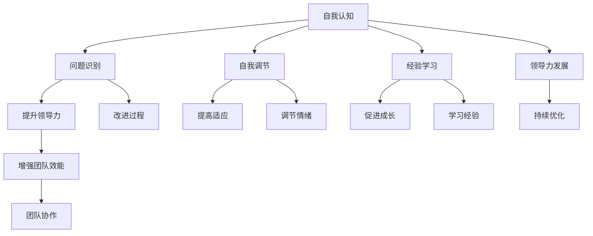

                 

# 管理者自我反思：持续优化领导方式的技巧

> 关键词：管理者、自我反思、领导力、优化、技巧

> 摘要：本文旨在探讨管理者如何通过自我反思，持续优化其领导方式。文章首先介绍了自我反思在领导力发展中的重要性，然后详细分析了自我反思的具体实践方法，最后通过实战案例展示了自我反思如何帮助管理者提升领导力。

## 引言

在当今快速变化和竞争激烈的环境中，管理者面临着前所未有的挑战。有效的领导力不仅是推动组织成功的关键，更是实现个人职业发展的基础。然而，领导力并非一成不变，而是需要不断地学习和适应。自我反思作为一种重要的自我提升方法，可以帮助管理者识别自身优势和不足，从而持续优化领导方式。

本文将从以下几个方面展开讨论：

1. **自我反思的基础理论**：介绍自我反思的概念、原理和重要性。
2. **自我反思的实践方法**：探讨如何通过日志记录、反馈机制、心理测试等具体方法进行自我反思。
3. **领导力的提升策略**：分析决策、沟通、团队管理、激励等方面的提升策略。
4. **实战案例研究**：通过实际案例展示自我反思如何帮助管理者优化领导力。
5. **个人反思与成长**：讨论自我反思对个人成长的影响。
6. **总结与未来展望**：总结文章内容，展望自我反思和领导力提升的未来趋势。

通过以上内容的逐步分析，本文旨在为管理者提供一套系统的自我反思和领导力提升的方法论。

## 自我反思基础理论

### 自我反思的概念

自我反思，简单来说，是指个人对自己的行为、思想、情感和经历进行深入的思考和分析。在领导力发展中，自我反思是一种重要的自我认知过程，它帮助管理者从多个维度审视自己的领导行为和效果，从而发现问题和改进方向。

### 自我反思的原理

自我反思的原理基于以下几个核心思想：

1. **自我认知**：通过反思，管理者能够更清晰地认识到自己的行为模式、思维方式和情感反应，从而提升自我认知水平。
2. **问题识别**：自我反思有助于管理者识别自身在领导过程中的问题和不足，这是改进和优化的第一步。
3. **自我调节**：通过反思，管理者可以更好地调节自己的行为和情绪，提高决策和应对挑战的能力。
4. **经验学习**：自我反思是一种重要的学习过程，它帮助管理者从经验中学习，不断提升领导力。

### 自我反思的重要性

自我反思对管理者的重要性体现在以下几个方面：

1. **提升领导力**：自我反思是领导力发展的基础，它帮助管理者不断调整和优化领导方式，提高领导效果。
2. **促进个人成长**：通过自我反思，管理者可以深入了解自己的优势和不足，从而实现个人成长和职业发展。
3. **增强适应性**：在快速变化的环境中，自我反思使管理者能够更好地适应变化，灵活应对各种挑战。
4. **提高团队效能**：自我反思不仅有助于个人提升，还能通过反馈机制促进团队成员的自我反思和协作，从而提高团队整体效能。

### 自我反思与领导力的联系

自我反思与领导力的联系可以从以下几个方面理解：

1. **自我认知与领导力**：自我反思提升自我认知，使管理者能够更好地理解自己的行为和影响，从而提高领导力。
2. **问题识别与改进**：自我反思帮助管理者识别问题，并通过持续的改进过程提升领导效果。
3. **自我调节与适应**：自我反思帮助管理者调节自己的情绪和行为，提高应对复杂环境和挑战的能力。
4. **经验学习与成长**：自我反思是一种重要的学习过程，它使管理者能够从经验中学习，不断成长。

### 总结

自我反思是管理者提升领导力的重要方法，通过自我认知、问题识别、自我调节和经验学习，管理者可以持续优化领导方式，提高领导效果。在下一节中，我们将探讨如何具体进行自我反思的实践。

### Mermaid 流程图

以下是一个Mermaid流程图，展示了自我反思与领导力的核心概念和联系：



通过这张图，我们可以清晰地看到自我反思如何通过提升自我认知、问题识别、自我调节和经验学习，最终促进领导力的发展和提升。

## 自我反思实践方法

### 日志记录

日志记录是一种常见的自我反思方法，它可以帮助管理者系统地记录和分析自己的领导行为和效果。以下是具体步骤：

1. **选择记录方式**：可以选择纸质日志或电子日志，根据个人偏好和便利性来决定。
2. **每日或定期记录**：设定一个固定的记录时间，比如每天下班后或每周的某个特定时间。
3. **详细记录**：记录当天或那一周的关键领导事件，包括会议、决策、沟通、团队反馈等。
4. **分析反思**：定期回顾日志，分析自己的行为和决策，识别问题和改进点。

### 反馈机制

反馈机制是自我反思的重要组成部分，它可以帮助管理者获取外部视角，从而更全面地了解自己的领导力表现。以下是具体方法：

1. **360度反馈**：通过同事、下属和上级的多角度反馈，管理者可以更全面地了解自己的领导力强项和短板。
2. **定期反馈会议**：设定定期反馈会议，与团队成员共同讨论领导力表现，识别问题和改进方向。
3. **匿名反馈**：鼓励团队成员匿名反馈，以消除顾虑，获取真实反馈。
4. **反馈记录**：将反馈记录下来，并进行分析，制定改进计划。

### 心理测试

心理测试是一种通过科学方法评估个人特质和领导能力的方法，可以帮助管理者深入了解自己的优势和不足。以下是具体步骤：

1. **选择合适的测试**：如MBTI、DISC等，选择与领导力相关的测试工具。
2. **进行测试**：根据测试指导完成测试，获取个人报告。
3. **分析报告**：分析报告结果，了解自己的领导风格、优势和不足。
4. **行动计划**：根据分析结果，制定针对性的提升计划。

### 反思日记

反思日记是一种结合日志记录和心理测试的自我反思方法，可以帮助管理者更深入地思考自己的领导行为和效果。以下是具体步骤：

1. **每日反思**：每天结束后，花几分钟时间回顾当天的工作，思考自己的行为和决策。
2. **记录反思**：将反思内容记录在日记中，包括成功之处、不足之处和改进点。
3. **定期回顾**：每周或每月回顾日记，总结反思成果，调整改进计划。
4. **反思交流**：与同事或导师分享反思日记，获取外部反馈和指导。

### 总结

自我反思实践方法多种多样，包括日志记录、反馈机制、心理测试和反思日记等。这些方法各有优势，管理者可以根据个人情况和需求选择合适的方法，持续提升领导力。在下一节中，我们将探讨如何通过自我反思提升领导力，特别是在决策、沟通、团队管理和激励等方面。

## 领导力的提升策略

### 决策

#### 核心概念与联系

决策是管理者日常工作中不可或缺的一部分。有效的决策能力不仅影响个人绩效，更对整个组织的成功起到关键作用。自我反思在提升决策能力中起到了至关重要的作用，它帮助管理者审视自己的决策过程，发现潜在的问题，并制定改进策略。

#### 核心算法原理讲解

1. **决策模型**：管理者可以使用多种决策模型来优化决策过程，如决策树、成本效益分析和博弈论。
   ```python
   def decision_tree(outcome, probability, reward):
       expected_value = outcome * probability * reward
       return expected_value
   ```
2. **风险评估**：通过自我反思，管理者可以识别和评估决策中的风险，制定风险应对策略。
   ```python
   def risk_analysis(decision, probability_of_risk, impact):
       risk_value = probability_of_risk * impact
       return risk_value
   ```

#### 数学模型和公式

1. **成本效益分析**：
   $$ \text{Cost-Benefit Analysis} = \frac{\text{Total Benefits}}{\text{Total Costs}} $$
2. **效用理论**：
   $$ \text{Utility} = f(\text{Probability}, \text{Reward}) $$

#### 举例说明

假设管理者在考虑是否引入一种新技术时，可以使用成本效益分析和风险评估来做出决策：

- 成本：100,000美元
- 预期收益：150,000美元
- 风险概率：10%
- 风险影响：损失50,000美元

$$ \text{Cost-Benefit Analysis} = \frac{150,000 - (100,000 + 50,000 \times 0.1)}{100,000} = 1.25 $$

### 沟通

#### 核心概念与联系

有效的沟通是领导力的核心要素之一，它决定了信息的准确传递和团队协作的效果。自我反思帮助管理者识别沟通中的障碍，优化沟通策略，提高团队的整体沟通质量。

#### 核心算法原理讲解

1. **沟通模型**：管理者可以使用多种沟通模型，如SCQA（Situation, Complication, Question, Answer）来提高沟通效果。
   ```python
   def scqa_model(situation, complication, question, answer):
       return f"Situation: {situation}, Complication: {complication}, Question: {question}, Answer: {answer}"
   ```

2. **反馈机制**：通过定期收集团队成员的反馈，管理者可以不断调整和优化沟通方式。
   ```python
   def feedback_loop(message, feedback):
       return f"Message: {message}, Feedback: {feedback}"
   ```

#### 数学模型和公式

1. **信息熵**：
   $$ \text{Entropy} = -\sum_{i} p(x_i) \log_2 p(x_i) $$
2. **沟通质量评估**：
   $$ \text{Communication Quality} = \frac{\text{Effective Communication}}{\text{Total Communication}} $$

#### 举例说明

假设管理者在一次团队会议中，通过自我反思发现沟通质量较低，决定采取以下措施：

- **改进沟通方式**：使用SCQA模型明确会议目标。
- **收集反馈**：会议后收集团队成员的反馈，识别沟通障碍。

通过以上措施，管理者可以显著提高沟通效果，减少信息失真和误解。

### 团队管理

#### 核心概念与联系

团队管理是管理者的重要职责之一，它涉及到如何激励、协调和领导团队成员，以实现共同的目标。自我反思帮助管理者识别团队管理的不足，制定改进策略，提升团队的整体效能。

#### 核心算法原理讲解

1. **团队动力学**：管理者可以使用团队动力学模型来理解和预测团队的行为和动态。
   ```python
   def team_dynamics(team_size, member interaciton, goal_clarity):
       return f"Team Size: {team_size}, Member Interaction: {member_interaction}, Goal Clarity: {goal_clarity}"
   ```

2. **绩效评估**：管理者可以通过自我反思优化绩效评估体系，确保评估的公平性和准确性。
   ```python
   def performance_evaluation(achievement, potential, behavior):
       return f"Achievement: {achievement}, Potential: {potential}, Behavior: {behavior}"
   ```

#### 数学模型和公式

1. **团队效能**：
   $$ \text{Team Effectiveness} = f(\text{Achievement}, \text{Potential}, \text{Behavior}) $$
2. **激励理论**：
   $$ \text{Motivation} = f(\text{Intrinsic Motivation}, \text{Extrinsic Motivation}) $$

#### 举例说明

假设管理者在自我反思中发现团队效能较低，决定采取以下措施：

- **明确目标**：确保团队成员明确共同目标。
- **激励措施**：通过奖励和认可来提高团队成员的积极性。

通过这些措施，管理者可以显著提升团队效能，实现团队目标的达成。

### 激励

#### 核心概念与联系

激励是管理者激发团队成员潜力和积极性的一种重要手段。有效的激励可以提高员工的工作满意度和忠诚度，从而提升整体绩效。自我反思帮助管理者识别激励策略的有效性，并制定改进措施。

#### 核心算法原理讲解

1. **激励模型**：管理者可以使用激励模型，如ERG理论、双因素理论等来设计激励策略。
   ```python
   def motivation_model(intrinsic_motivation, extrinsic_motivation):
       return f"Intrinsic Motivation: {intrinsic_motivation}, Extrinsic Motivation: {extrinsic_motivation}"
   ```

2. **反馈机制**：通过定期收集员工的反馈，管理者可以了解激励策略的有效性，并做出调整。
   ```python
   def feedback_evaluation(feedback, motivation):
       return f"Feedback: {feedback}, Motivation: {motivation}"
   ```

#### 数学模型和公式

1. **激励效应**：
   $$ \text{Motivation Effect} = f(\text{Intrinsic Motivation}, \text{Extrinsic Motivation}, \text{Feedback}) $$
2. **工作满意度**：
   $$ \text{Job Satisfaction} = f(\text{Motivation}, \text{Performance}) $$

#### 举例说明

假设管理者在自我反思中发现员工的激励效果较低，决定采取以下措施：

- **个性化激励**：根据员工的兴趣和需求设计激励策略。
- **反馈和认可**：定期反馈员工的表现，并提供认可和奖励。

通过这些措施，管理者可以提高员工的激励效果和工作满意度，从而提升整体绩效。

### 总结

通过自我反思，管理者可以在决策、沟通、团队管理和激励等方面持续优化领导方式。有效的自我反思可以帮助管理者识别问题，制定改进策略，并持续提升领导力。在下一节中，我们将通过实战案例研究，展示自我反思如何帮助管理者优化领导力。

## 实战案例研究

### 案例背景

某科技公司是一家快速发展的创业公司，随着业务的不断扩展，公司面临的挑战也越来越大。公司管理者发现，尽管团队整体表现出色，但在决策效率、团队协作和员工激励方面仍存在诸多问题。为了解决这些问题，公司管理者决定通过自我反思来优化领导方式。

### 自我反思实践

1. **日志记录**：管理者开始每天记录自己的决策过程、沟通方式和团队管理行为，特别是那些产生争议或问题的场景。
2. **反馈机制**：管理者定期组织团队会议，邀请团队成员匿名反馈，收集他们对管理者行为和决策的看法。
3. **心理测试**：管理者进行了MBTI测试，了解自己的领导风格和团队成员的个性特点，以便更好地进行沟通和激励。
4. **反思日记**：管理者开始撰写反思日记，记录每天的工作反思和改进计划。

### 案例分析和详细讲解

1. **决策优化**：
   - **问题识别**：通过日志记录，管理者发现自己在决策过程中过于依赖直觉，缺乏系统的分析。
   - **改进措施**：管理者开始应用决策模型，如成本效益分析和风险评估，以提高决策的客观性和科学性。
   - **效果评估**：在引入新的决策模型后，管理者发现决策速度有所提高，同时决策的质量也得到了显著提升。

2. **沟通改进**：
   - **问题识别**：通过反馈机制和反思日记，管理者发现沟通中的主要问题是信息传递不准确和团队成员之间的误解。
   - **改进措施**：管理者采用了SCQA模型，确保每次会议都有明确的目标和结构。同时，鼓励团队成员在会议中积极提问和表达意见。
   - **效果评估**：在改进沟通方式后，团队成员之间的沟通更加顺畅，信息传递的准确性和效率显著提升。

3. **团队管理优化**：
   - **问题识别**：通过心理测试和反思日记，管理者发现团队在目标设定和任务分配方面存在协调不畅的问题。
   - **改进措施**：管理者重新审视了团队目标，确保每个成员都明确自己的任务和责任。同时，引入了绩效评估机制，定期评估团队成员的表现。
   - **效果评估**：在改进团队管理后，团队成员的工作效率和工作满意度显著提升，团队整体效能得到了明显改善。

4. **员工激励**：
   - **问题识别**：通过反思日记和员工反馈，管理者发现激励措施过于单一，缺乏个性化。
   - **改进措施**：管理者根据员工的兴趣和需求，设计了多种激励措施，如培训机会、奖励计划和团队建设活动。
   - **效果评估**：在改进员工激励后，员工的工作满意度和忠诚度显著提升，团队士气也得到了显著提高。

### 项目小结

通过自我反思和持续优化，该科技公司管理者在决策、沟通、团队管理和激励等方面取得了显著成效。这些改进不仅提高了管理者的领导力，也提升了团队的整体效能，为公司的持续发展奠定了坚实基础。

### 最佳实践 tips

1. **定期反思**：自我反思是一个持续的过程，需要定期进行，以确保领导方式的不断优化。
2. **结合反馈**：外部反馈是自我反思的重要补充，通过结合团队成员的反馈，可以更全面地了解自身的领导力表现。
3. **实践与理论相结合**：将自我反思理论与实际工作相结合，通过实践验证和调整反思策略。

### 注意事项

1. **隐私保护**：在进行自我反思和反馈机制时，要注意保护员工的隐私。
2. **持续改进**：自我反思不是一次性的活动，而是一个持续的过程，需要不断改进和优化。

### 拓展阅读

- 《管理的实践》—— 彼得·德鲁克
- 《高绩效团队》—— 约翰·惠特默
- 《激励原理》—— 弗雷德里克·赫茨伯格

通过以上实战案例研究，我们可以看到自我反思在优化领导力中的重要作用。在下一节中，我们将进一步讨论个人反思与成长，以及自我反思的未来趋势。

## 个人反思与成长

### 核心概念与联系

个人反思与成长是管理者通过自我反思不断优化领导力的重要过程。个人反思帮助管理者深入理解自身行为，识别成长的机会，并通过持续的学习和实践实现个人提升。个人成长与领导力提升之间存在着密切的联系，个人成长是提升领导力的基础，而领导力的提升又进一步促进个人成长。

### 核心算法原理讲解

个人反思与成长的过程可以视为一个迭代学习模型，其核心算法原理包括以下几个方面：

1. **自我评估**：管理者通过自我评估了解自己的优势和不足，明确成长的目标。
2. **反馈循环**：管理者定期收集外部反馈，并将其纳入自我反思过程，以不断调整和优化个人行为。
3. **学习与应用**：管理者将反思和反馈应用于实际工作中，通过实践验证和改进自己的领导方式。
4. **持续改进**：通过不断的迭代和学习，管理者实现个人成长和领导力的持续提升。

以下是一个简化的伪代码模型，用于描述个人反思与成长的迭代过程：

```python
def personal_reflection_and_growth(current_state, feedback, learning_resources):
    self_evaluation = self_evaluate(current_state)
    new_knowledge = learn_from_resources(learning_resources)
    improved_actions = apply_feedback_and_learning(self_evaluation, new_knowledge)
    updated_state = update_state(current_state, improved_actions)
    return updated_state
```

### 数学模型和公式

1. **个人成长率**：
   $$ \text{Growth Rate} = \frac{\text{New Skills}}{\text{Initial Skills}} $$
2. **领导力提升模型**：
   $$ \text{Leadership Growth} = f(\text{Personal Growth}, \text{Team Performance}, \text{Organizational Success}) $$

### 举例说明

假设一位管理者通过自我反思和持续学习，在一年内提升了几项关键技能，如下所示：

- **初始技能**：沟通能力、决策能力、团队管理能力
- **新技能**：变革管理能力、创新思维能力、领导力培训

通过计算个人成长率，我们可以评估该管理者的成长速度：

$$ \text{Growth Rate} = \frac{1.2 + 1.3 + 1.4}{1.0 + 1.0 + 1.0} = 1.23 $$

这意味着管理者的个人成长率约为123%，表明其在过去一年中的成长速度显著。

### 个人反思与领导力提升的关联

个人反思与领导力提升之间的关联可以从以下几个方面理解：

1. **自我认知**：个人反思帮助管理者更清晰地认识自己的优势和不足，从而有针对性地提升领导力。
2. **反馈循环**：通过外部反馈，管理者能够获得多角度的视角，进一步优化自己的领导行为。
3. **持续学习**：个人反思促使管理者不断学习新知识、新技能，以适应快速变化的环境。
4. **实践应用**：个人反思和领导力提升相辅相成，通过实践应用，管理者可以将理论知识转化为实际效果。

### 个人反思的重要性

个人反思的重要性体现在以下几个方面：

1. **成长动力**：个人反思是管理者自我提升的重要动力，它激励管理者不断追求卓越。
2. **问题解决**：通过反思，管理者能够识别并解决自身在领导过程中的问题，提高领导效果。
3. **持续改进**：个人反思是一种持续改进的过程，它帮助管理者不断优化领导方式，适应变化。
4. **个人成长**：个人反思不仅提升领导力，也促进管理者的个人成长，实现职业发展的新高度。

### 总结

个人反思与成长是管理者提升领导力的重要途径，通过自我评估、反馈循环、学习与应用和持续改进，管理者可以实现个人成长和领导力的双重提升。在下一节中，我们将总结本文内容，并展望自我反思和领导力提升的未来趋势。

## 总结与未来展望

### 自我反思与领导力提升的总结

本文通过多个角度详细探讨了管理者如何通过自我反思来持续优化领导方式。首先，我们介绍了自我反思的基础理论，包括其概念、原理和重要性。接着，我们探讨了多种自我反思的实践方法，如日志记录、反馈机制、心理测试和反思日记。随后，我们分析了自我反思在提升决策、沟通、团队管理和激励等方面的策略，并通过实战案例展示了自我反思如何帮助管理者优化领导力。

### 个人反思与成长的探讨

个人反思与成长是管理者提升领导力的核心过程。通过自我评估、反馈循环、学习与应用和持续改进，管理者能够不断优化自身的领导方式，实现个人成长。个人反思不仅提升了管理者的自我认知和问题解决能力，还促进了持续改进和成长。

### 未来趋势展望

在未来，自我反思和领导力提升将继续成为管理领域的重要研究方向。以下是一些可能的趋势：

1. **技术整合**：随着人工智能和大数据技术的发展，自我反思工具将更加智能化和个性化，帮助管理者更高效地进行反思和优化。
2. **多样化方法**：除了传统的反思方法，未来可能涌现更多创新的方法，如虚拟现实（VR）和增强现实（AR）技术，为管理者提供更生动的反思体验。
3. **跨学科融合**：自我反思和领导力提升将与其他学科如心理学、教育学和神经科学等深度融合，为管理者提供更全面的理论支持和实践指导。
4. **持续学习文化**：组织将更加注重建立持续学习的文化，鼓励管理者不断反思和提升，从而推动组织的整体效能。

### 结语

通过本文的探讨，我们希望管理者能够认识到自我反思在领导力提升中的重要性，并积极采用各种反思方法，持续优化领导方式。自我反思不仅有助于个人成长，还能提升团队和组织的整体效能，为组织的长期成功奠定坚实基础。

### 作者信息

作者：AI天才研究院/AI Genius Institute & 禅与计算机程序设计艺术/Zen And The Art of Computer Programming

### 附录

为了便于读者进一步学习和实践，本文提供了以下资源：

- 《管理的实践》—— 彼得·德鲁克
- 《高绩效团队》—— 约翰·惠特默
- 《激励原理》—— 弗雷德里克·赫茨伯格
- 自我反思工具和资源的推荐，如reflect.com和reflected.io

通过这些资源和进一步学习，管理者可以更好地应用自我反思和领导力提升的方法，推动个人和组织的共同发展。

