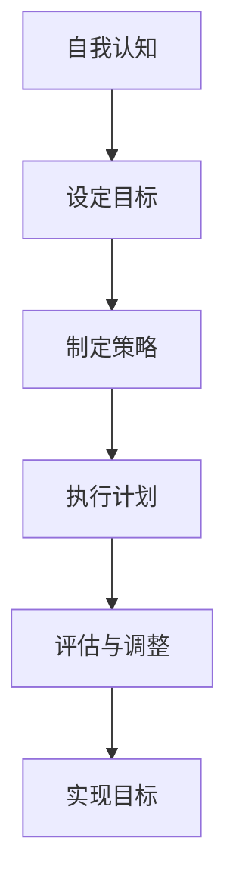
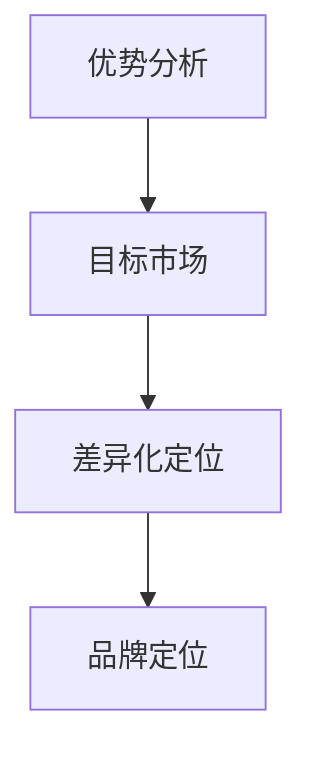
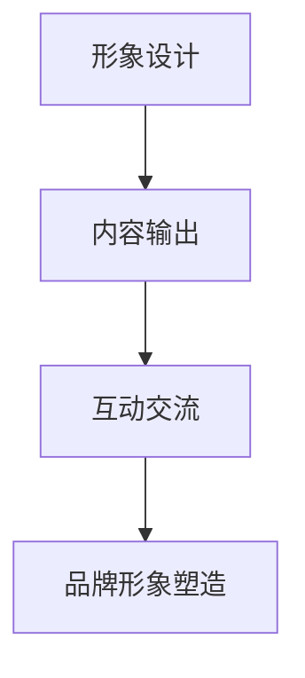
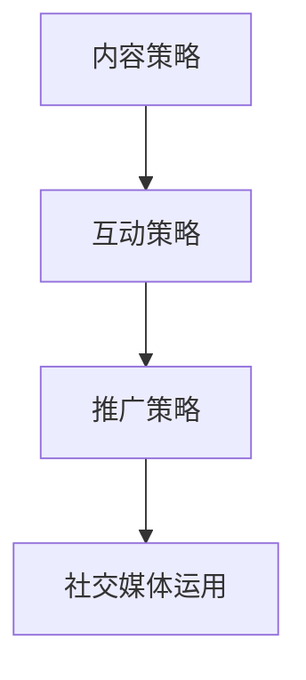
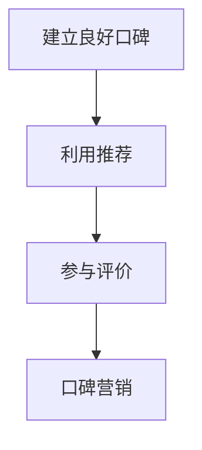

                 

# 管理者自我营销：提升个人影响力

> 关键词：管理者、自我营销、个人影响力、沟通技巧、人脉管理、领导力

> 摘要：在快速变化的企业环境中，管理者如何通过自我营销提升个人影响力已成为关键成功因素。本文将从自我营销概述、个人品牌建设、提升个人影响力的方法以及实战案例与技巧等方面，深入探讨管理者如何通过自我营销提升个人影响力，最终实现职业发展和团队成功。

## 第一部分：自我营销基础

### 第1章：自我营销概述

#### 1.1 什么是自我营销

**核心概念与联系**：
自我营销是指个人通过一系列策略和方法，主动塑造和推广自己的品牌，以提升个人在职场和社会中的认知度和影响力。它涉及到个人形象、专业技能、沟通能力等多个方面，旨在通过有效的自我展示和传播，实现个人职业发展目标。

**Mermaid流程图**：


#### 1.2 自我营销的目的与意义

自我营销的目的是为了在职场中建立个人品牌，提升个人影响力，从而为职业发展创造更多机会。通过自我营销，管理者能够：
- **增加曝光度**：提高在团队、行业内的知名度和认可度。
- **拓展人脉资源**：建立广泛的人脉网络，为职业发展提供支持。
- **增强领导力**：通过有效的沟通和影响，提升团队凝聚力和执行力。

#### 1.3 自我营销的关键要素

自我营销的关键要素包括：
- **个人品牌建设**：包括品牌定位和形象塑造。
- **沟通技巧**：提升语言和非语言沟通能力，确保信息传递的有效性。
- **人脉管理**：建立和维护有价值的社交网络。
- **自我营销策略**：制定和执行个性化的营销计划。

### 第2章：个人品牌建设

#### 2.1 品牌定位

**2.1.1 定位策略**

品牌定位是自我营销的核心，管理者需要明确自己的独特价值和目标受众。定位策略包括：

1. **优势分析**：识别个人在专业技能、经验、性格等方面的独特优势。
2. **目标市场**：确定目标受众，包括行业、职位、兴趣等。
3. **差异化定位**：突出个人在特定领域的专业性和独特性。

**核心概念与联系**：
品牌定位策略可以通过Mermaid流程图展示，如下：


**2.1.2 品牌形象塑造**

品牌形象塑造是个人品牌建设的关键，包括以下几个方面：

1. **形象设计**：包括头像、名片、个人网站等。
2. **内容输出**：通过博客、社交媒体、演讲等方式，展示专业知识和思考。
3. **互动交流**：积极参与行业活动，与同行建立良好互动。

**核心概念与联系**：
品牌形象塑造策略可以通过Mermaid流程图展示，如下：


### 第2章：个人品牌传播

**2.2.1 社交媒体运用**

社交媒体是个人品牌传播的重要渠道，管理者可以利用以下策略：

1. **内容策略**：发布高质量的内容，包括行业洞察、专业分享等。
2. **互动策略**：积极回应评论，参与话题讨论，与粉丝建立互动。
3. **推广策略**：利用社交媒体广告、合作推广等手段扩大影响力。

**核心概念与联系**：
社交媒体运用策略可以通过Mermaid流程图展示，如下：


**2.2.2 口碑营销**

口碑营销是通过他人的评价和推荐来传播个人品牌。管理者可以通过以下方式：

1. **建立良好口碑**：提供优质的服务和专业的指导，赢得客户和同事的信任。
2. **利用推荐**：鼓励满意的客户和同事推荐自己。
3. **参与评价**：在行业平台、社交媒体上积极参与评价和讨论。

**核心概念与联系**：
口碑营销策略可以通过Mermaid流程图展示，如下：


## 第二部分：提升个人影响力的方法

### 第3章：沟通技巧

**3.1 沟通的艺术**

**核心算法原理讲解**：
有效的沟通模型可以通过以下伪代码来阐述：

```python
def effective_communication(sender, receiver, message):
    sender_analyze_receiver_needs()
    sender_prepare_message()
    receiver_understand_message()
    receiver_provide_feedback()
    if receiver_feedback_positive():
        return "Communication successful"
    else:
        return "Communication needs improvement"
```

**3.2 语言运用**

语言运用是沟通技巧的关键，管理者需要：

1. **清晰表达**：使用简单明了的语言传达信息。
2. **准确理解**：通过提问和反馈确保信息传递无误。
3. **适当修辞**：使用适当的修辞手法提升语言表达的吸引力。

**3.3 非语言沟通**

非语言沟通在沟通中起着重要作用，包括：

1. **肢体语言**：通过姿态、眼神、手势等表达态度和情感。
2. **语音语调**：通过语速、音调、语气的变化传递信息。
3. **面部表情**：通过微笑、皱眉等面部表情传达情感。

### 第4章：人脉管理

**4.1 人脉资源的重要性**

**数学模型和数学公式**：
人脉资源的价值可以通过以下Latex公式进行阐述：

$$
\text{人脉价值} = \sum_{i=1}^{n} (\text{关系强度} \times \text{关系价值})
$$

其中，$n$ 表示人脉数量，$\text{关系强度}$ 和 $\text{关系价值}$ 分别表示关系的紧密程度和实际价值。

**4.2 人脉拓展策略**

1. **主动结识**：参加行业活动、社交聚会，主动结识新朋友。
2. **资源共享**：与他人建立互利共赢的关系，通过资源交换拓展人脉。
3. **持续维护**：定期与朋友保持联系，提供帮助和支持，维持良好关系。

**4.3 人脉维护技巧**

1. **及时反馈**：对朋友的帮助和支持及时表示感谢和反馈。
2. **提供价值**：在交流中提供有价值的信息和资源，增强关系的紧密性。
3. **个性化沟通**：针对不同的人脉关系，采取个性化的沟通方式。

### 第5章：自我营销策略

**5.1 自我营销计划**

**5.1.1 计划制定步骤**

制定自我营销计划需要遵循以下步骤：

1. **目标设定**：明确个人职业发展目标。
2. **资源分析**：评估自身资源和可用资源。
3. **策略规划**：制定具体的自我营销策略。
4. **执行与监控**：执行计划，并持续监控效果。

**5.1.2 风险管理**

在自我营销过程中，管理者需要识别和应对潜在的风险：

1. **风险识别**：通过SWOT分析识别潜在风险。
2. **风险应对**：制定应对策略，降低风险影响。
3. **监控与调整**：持续监控风险，并根据实际情况进行调整。

**5.2 自我营销工具**

**5.2.1 社交媒体工具**

社交媒体工具在自我营销中起着重要作用，包括：

1. **LinkedIn**：专业的职业社交平台，适合发布专业内容和建立行业人脉。
2. **Twitter**：快速传播信息，适合发布短小精悍的见解和新闻。
3. **微信公众号**：适合长期内容输出，建立个人品牌。

**5.2.2 内容营销工具**

内容营销工具包括：

1. **博客**：深度分析和专业知识分享，提高个人品牌认知度。
2. **视频**：通过视频展示个人魅力和专业技能，吸引更多关注。
3. **PPT**：通过精美的PPT展示专业知识和项目成果，增强说服力。

## 第三部分：实战案例与技巧

### 第7章：成功案例解析

**7.1 案例背景**

以某知名互联网公司技术总监的案例为例，该技术总监通过自我营销成功提升了个人影响力，并在公司内部和行业内建立了良好的声誉。

**7.2 案例分析**

**7.2.1 核心策略**

该技术总监采取了以下核心策略：

1. **品牌定位**：明确自身在技术领域和团队管理方面的专业优势。
2. **内容输出**：定期在博客和社交媒体上发布技术见解和项目经验。
3. **人脉拓展**：通过参加行业活动和专业社群，建立广泛的人脉网络。
4. **口碑营销**：积极帮助同事和行业朋友，赢得良好的口碑。

**7.2.2 实施效果**

通过上述策略，该技术总监实现了以下效果：

1. **个人品牌认知度提升**：在行业内建立了良好的个人品牌。
2. **人脉资源拓展**：建立了广泛且深入的行业人脉网络。
3. **职业发展机会增加**：在职业发展上获得了更多机会，包括晋升和合作项目。

**7.3 案例启示**

从该案例中，管理者可以得到的启示：

1. **明确品牌定位**：清晰的品牌定位是自我营销成功的基础。
2. **内容输出**：高质量的内容是建立个人品牌的关键。
3. **人脉管理**：积极拓展和维护人脉资源，为职业发展提供支持。
4. **口碑营销**：通过积极的人际互动和帮助他人，赢得良好的口碑。

### 第8章：技巧与实践

**8.1 实践技巧**

**8.1.1 沟通技巧实践**

1. **清晰表达**：在会议和沟通中，使用简单明了的语言传达信息。
2. **倾听技巧**：积极倾听他人的意见和需求，确保有效沟通。
3. **非语言沟通**：通过肢体语言和语音语调增强沟通效果。

**8.1.2 人脉管理实践**

1. **主动结识**：在会议、活动等场合主动结识新朋友。
2. **资源共享**：与他人建立互利共赢的关系，通过资源交换拓展人脉。
3. **持续维护**：定期与朋友保持联系，提供帮助和支持，维持良好关系。

**8.2 个人营销计划书撰写**

**8.2.1 撰写流程**

撰写个人营销计划书需要遵循以下流程：

1. **目标设定**：明确个人职业发展目标。
2. **资源分析**：评估自身资源和可用资源。
3. **策略规划**：制定具体的自我营销策略。
4. **执行与监控**：执行计划，并持续监控效果。

**8.2.2 案例分析**

以某技术经理的个人营销计划书为例，分析其实施过程和效果。该技术经理通过以下步骤成功提升了个人影响力：

1. **目标设定**：明确提升个人品牌认知度和拓展人脉资源。
2. **资源分析**：评估自身在技术和管理方面的优势，以及可用的资源。
3. **策略规划**：制定包括内容输出、社交媒体运用和人脉拓展在内的自我营销策略。
4. **执行与监控**：定期执行计划，并根据实际情况进行调整。

通过上述策略，该技术经理成功提升了个人品牌，并在行业内建立了良好声誉，实现了职业发展目标。

## 附录

### 附录 A：自我营销资源推荐

**A.1 书籍推荐**

1. 《影响力》：关于说服力和影响力的经典著作，适合管理者提升沟通技巧和影响力。
2. 《关键对话》：指导如何在关键场合有效沟通，提升个人影响力。

**A.2 网络资源**

1. LinkedIn：专业的职业社交平台，适合建立个人品牌和拓展人脉。
2. Medium：内容创作和分享平台，适合发布专业见解和专业知识。

**A.3 工具推荐**

1. Hootsuite：社交媒体管理工具，适合管理多个社交媒体账号。
2. Canva：设计工具，适合制作高质量的图片和海报，提升个人品牌形象。

### 作者

**作者：AI天才研究院/AI Genius Institute & 禅与计算机程序设计艺术 /Zen And The Art of Computer Programming**

