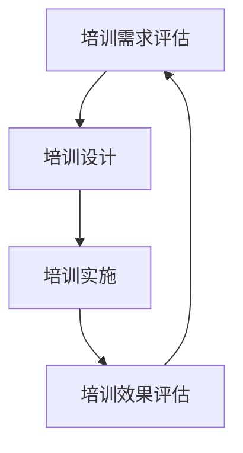
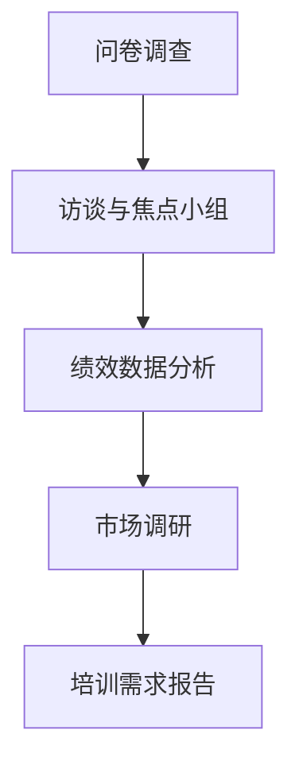
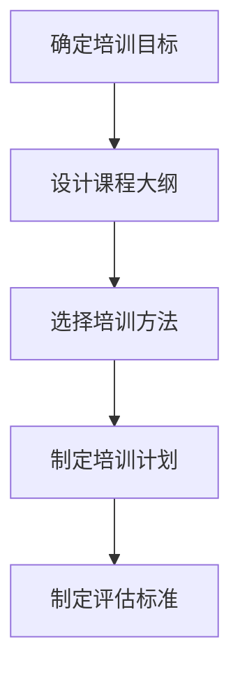
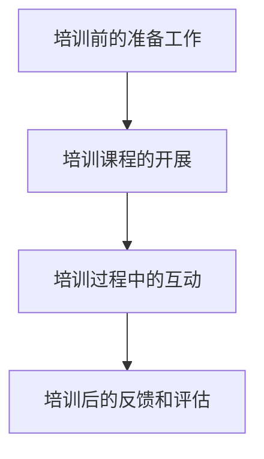
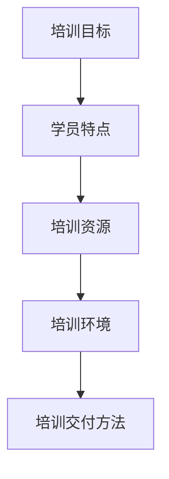
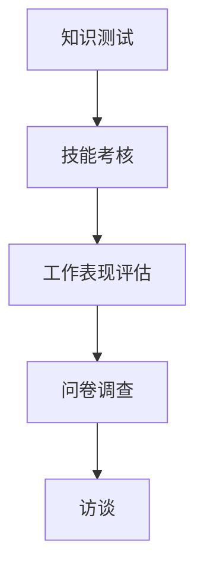

                 

## 文章标题：系统化员工培训：提升团队素质

### 关键词：
- 员工培训
- 系统化培训
- 团队素质
- 组织发展
- 培训效果评估

### 摘要：
本文将探讨如何通过系统化员工培训提升团队素质，实现组织发展的目标。文章首先介绍了系统化员工培训的定义和重要性，随后详细阐述了培训需求评估的方法和步骤。接着，文章重点讨论了设计、实施以及调整培训计划的过程，并分析了多种培训交付方法。最后，文章提出了监测和评估培训效果的关键策略，为组织提供了提升员工培训和团队素质的最佳实践建议。

## 引言：系统化员工培训的意义

### 背景介绍
在当今快速变化和高度竞争的商业环境中，组织的发展离不开人才的培养和团队素质的提升。员工培训作为企业人力资源管理的重要组成部分，不仅关系到员工的职业发展和满意度，还直接影响组织的创新能力和市场竞争力。因此，如何实现系统化的员工培训，以提升团队整体素质，成为企业领导者和管理者关注的焦点。

### 核心概念与联系
系统化员工培训是一个多层次、多维度的过程，它涉及到培训需求评估、培训设计、培训实施和培训效果评估等多个环节。每个环节相互关联，共同构成一个完整的培训体系。

- **培训需求评估**：确定员工和团队在知识、技能和能力方面的差距，为培训设计提供依据。
- **培训设计**：根据需求制定培训计划，设计课程内容和培训方法，确保培训的针对性和有效性。
- **培训实施**：将培训计划付诸实践，通过多种培训交付方法实现培训目标。
- **培训效果评估**：对培训过程和结果进行评估，以持续改进培训质量和效果。

### Mermaid 流程图

### 核心概念原理之间的关系架构
通过上述流程图可以看出，系统化员工培训的核心在于培训需求评估，它是整个培训体系的基础。培训设计、培训实施和培训效果评估则是根据需求评估的结果，不断迭代和优化的过程，最终实现提升团队素质的目标。

## 培训需求评估

### 核心概念与联系
培训需求评估是系统化员工培训的首要环节，旨在识别员工和团队在知识、技能和能力方面的不足，为后续的培训设计提供科学依据。通过有效的需求评估，企业可以确保培训的针对性和有效性，从而最大化培训的投资回报率。

- **员工需求**：关注员工的职业发展需求，包括当前技能水平与未来职业目标之间的差距。
- **团队需求**：关注团队的整体素质提升，包括团队协作能力、领导力等方面的需求。
- **业务需求**：关注企业战略目标和业务发展需求，确保培训与企业发展的一致性。

### 方法介绍
进行培训需求评估的方法多种多样，以下是一些常用的方法：

- **问卷调查**：通过设计问卷，收集员工和团队对培训需求的看法和建议。
- **访谈与焦点小组**：与员工和团队成员进行一对一访谈或小组讨论，深入了解他们的培训需求和期望。
- **绩效数据分析**：分析员工的工作绩效数据，识别绩效不佳的可能原因，从而确定培训需求。
- **市场调研**：通过市场调研，了解行业发展趋势和竞争对手的培训策略，为企业提供参考。

### Mermaid 流程图

### 核心概念原理之间的关系架构
培训需求评估的核心在于获取全面、准确的需求信息。通过多种方法的综合运用，可以确保评估结果的客观性和全面性，从而为后续的培训设计提供可靠的数据支持。

## 培训设计

### 核心概念与联系
培训设计是系统化员工培训的关键环节，旨在根据培训需求制定详细的培训计划，包括课程内容、培训方法和评估标准等。有效的培训设计可以确保培训的针对性和有效性，满足员工和团队的发展需求。

- **课程内容**：包括基础知识、技能培训、专业发展等内容，应根据需求评估的结果进行设计。
- **培训方法**：包括传统培训方法（如讲座、研讨会）、在线培训方法和混合式培训方法等。
- **评估标准**：包括培训前后的知识测试、技能考核、工作表现评估等，用于评估培训效果。

### 方法介绍
进行培训设计的方法主要包括以下几步：

1. **确定培训目标**：明确培训的总体目标和具体目标，确保培训设计有明确的方向。
2. **设计课程大纲**：根据培训目标，设计详细的课程大纲，包括课程名称、课时、教学目标等。
3. **选择培训方法**：根据培训内容和目标，选择合适的培训方法，如讲座、研讨会、在线培训等。
4. **制定培训计划**：将课程大纲和培训方法整合到培训计划中，确保培训的连贯性和系统性。
5. **制定评估标准**：根据培训目标和课程内容，制定评估标准，用于衡量培训效果。

### Mermaid 流程图

### 核心概念原理之间的关系架构
培训设计的核心在于确保培训内容的实用性和培训方法的多样性。通过科学的培训设计，可以最大化地提升员工的学习效果，满足组织的发展需求。

## 培训实施

### 核心概念与联系
培训实施是将设计好的培训计划付诸实践的过程，它直接关系到培训的效果和员工的参与度。有效的培训实施需要精心组织，包括培训材料的准备、培训课程的安排以及培训过程中的互动和反馈。

- **培训材料准备**：包括PPT、教材、案例分析等，用于辅助教学。
- **培训课程安排**：包括培训时间、地点、授课教师等，确保培训的顺利进行。
- **培训过程互动**：包括课堂讨论、案例分享、角色扮演等，激发员工的学习兴趣和主动性。
- **反馈机制**：包括学员反馈、培训评估等，用于持续改进培训质量。

### 方法介绍
进行培训实施的方法主要包括以下几步：

1. **培训前的准备工作**：包括培训材料的准备、培训环境的布置、培训教师的培训等。
2. **培训课程的开展**：按照培训计划，开展具体的培训课程，确保培训内容的连贯性和完整性。
3. **培训过程中的互动**：通过多种互动方式，如讨论、案例分享、角色扮演等，提高员工的参与度和学习效果。
4. **培训后的反馈和评估**：收集员工的反馈，评估培训效果，为后续培训提供改进方向。

### Mermaid 流程图

### 核心概念原理之间的关系架构
培训实施的核心在于确保培训过程的科学性和有效性。通过精心组织和有效互动，可以最大限度地提升员工的学习效果，实现培训目标。

## 培训交付方法

### 核心概念与联系
培训交付方法是指将培训内容传递给员工的方式，不同的交付方法适用于不同的培训需求和场景。有效的培训交付方法可以提升培训的参与度和效果，确保培训目标的实现。

- **传统培训方法**：包括讲座、研讨会、工作坊等，适用于基础知识和技能培训。
- **在线培训方法**：包括在线课程、电子学习模块等，适用于灵活学习和自主学习。
- **混合式培训方法**：将传统培训和在线培训相结合，适用于复杂技能和多层次的培训。

### 方法介绍
进行培训交付方法的选择和实施，需要考虑以下因素：

1. **培训目标**：根据培训目标选择合适的交付方法，如基础知识培训适合讲座和工作坊，高级技能培训适合在线课程和实操演练。
2. **学员特点**：根据学员的学习风格和职业背景，选择适合的交付方法，如视觉型学员适合PPT讲座，听觉型学员适合在线课程。
3. **培训资源**：根据企业的培训资源，如教师、场地、技术支持等，选择可行的交付方法。
4. **培训环境**：根据培训环境的特点，如线上还是线下，选择适合的交付方法。

### Mermaid 流程图

### 核心概念原理之间的关系架构
培训交付方法的选择和实施，需要综合考虑培训目标、学员特点、培训资源和培训环境等多个因素，确保培训的针对性和有效性。

## 监测和评估培训效果

### 核心概念与联系
监测和评估培训效果是系统化员工培训的重要环节，它不仅能够验证培训目标是否达成，还能够为后续的培训设计和实施提供反馈和改进方向。有效的监测和评估可以帮助企业持续优化培训体系，提高培训的投资回报率。

- **监测**：在培训过程中实时跟踪学员的学习进度和参与度。
- **评估**：在培训结束后对学员的学习成果进行系统性的评价。

### 方法介绍
进行培训效果监测和评估的方法主要包括以下几种：

1. **知识测试**：通过笔试、在线测试等方式，评估学员对培训知识的掌握程度。
2. **技能考核**：通过实际操作、项目展示等方式，评估学员所学的技能应用能力。
3. **工作表现评估**：通过工作表现数据，如工作效率、质量、团队合作等，评估培训对员工工作的影响。
4. **问卷调查**：通过问卷调查，收集学员对培训内容的反馈和建议。
5. **访谈**：与学员进行一对一访谈，深入了解他们的学习体验和培训需求。

### Mermaid 流程图

### 核心概念原理之间的关系架构
监测和评估培训效果的核心在于获取全面、准确的数据，通过多种方法的综合运用，可以确保评估结果的客观性和全面性，从而为后续的培训设计和实施提供有力的支持。

## 结论

### 最佳实践 Tips
- **制定明确的培训目标**：确保培训与企业发展目标一致，提高培训的针对性。
- **综合运用多种培训方法**：根据培训需求和学员特点，选择适合的培训方法，提高培训效果。
- **建立反馈机制**：通过多种渠道收集学员反馈，持续改进培训质量。
- **关注培训资源的优化配置**：合理利用企业内外部的培训资源，提高培训效率。

### 小结
系统化员工培训是提升团队素质的重要手段。通过有效的培训需求评估、设计、实施和监测评估，企业可以确保培训的针对性和有效性，从而实现组织发展的目标。

### 注意事项
- **重视培训过程的互动和反馈**：通过多种互动方式，提高学员的参与度和学习效果。
- **持续关注学员的职业发展**：确保培训与员工职业规划相结合，促进员工长期发展。
- **注重培训效果的评估**：通过多种评估方法，全面了解培训效果，为后续培训提供改进方向。

### 拓展阅读
- 《企业培训管理手册》
- 《培训与开发：应用实务》
- 《企业员工培训体系构建与实践》

## 作者信息

作者：AI天才研究院/AI Genius Institute & 禅与计算机程序设计艺术 /Zen And The Art of Computer Programming

---

### 完整文章

## 系统化员工培训：提升团队素质

### 引言：系统化员工培训的意义

在当今快速变化和高度竞争的商业环境中，组织的发展离不开人才的培养和团队素质的提升。员工培训作为企业人力资源管理的重要组成部分，不仅关系到员工的职业发展和满意度，还直接影响组织的创新能力和市场竞争力。因此，如何实现系统化的员工培训，以提升团队整体素质，成为企业领导者和管理者关注的焦点。

### 核心概念与联系

系统化员工培训是一个多层次、多维度的过程，它涉及到培训需求评估、培训设计、培训实施和培训效果评估等多个环节。每个环节相互关联，共同构成一个完整的培训体系。

1. **培训需求评估**：确定员工和团队在知识、技能和能力方面的差距，为培训设计提供依据。
2. **培训设计**：根据需求制定培训计划，设计课程内容和培训方法，确保培训的针对性和有效性。
3. **培训实施**：将培训计划付诸实践，通过多种培训交付方法实现培训目标。
4. **培训效果评估**：对培训过程和结果进行评估，以持续改进培训质量和效果。

### Mermaid 流程图

### 背景介绍

在当今快速变化和高度竞争的商业环境中，组织的发展离不开人才的培养和团队素质的提升。员工培训作为企业人力资源管理的重要组成部分，不仅关系到员工的职业发展和满意度，还直接影响组织的创新能力和市场竞争力。因此，如何实现系统化的员工培训，以提升团队整体素质，成为企业领导者和管理者关注的焦点。

### 核心概念与联系

系统化员工培训是一个多层次、多维度的过程，它涉及到培训需求评估、培训设计、培训实施和培训效果评估等多个环节。每个环节相互关联，共同构成一个完整的培训体系。

- **培训需求评估**：确定员工和团队在知识、技能和能力方面的差距，为培训设计提供依据。
- **培训设计**：根据需求制定培训计划，设计课程内容和培训方法，确保培训的针对性和有效性。
- **培训实施**：将培训计划付诸实践，通过多种培训交付方法实现培训目标。
- **培训效果评估**：对培训过程和结果进行评估，以持续改进培训质量和效果。

### Mermaid 流程图

### 核心概念原理之间的关系架构

通过上述流程图可以看出，系统化员工培训的核心在于培训需求评估，它是整个培训体系的基础。培训设计、培训实施和培训效果评估则是根据需求评估的结果，不断迭代和优化的过程，最终实现提升团队素质的目标。

## 培训需求评估

培训需求评估是系统化员工培训的首要环节，旨在识别员工和团队在知识、技能和能力方面的不足，为后续的培训设计提供科学依据。通过有效的需求评估，企业可以确保培训的针对性和有效性，从而最大化培训的投资回报率。

### 理解培训需求

理解培训需求是进行培训需求评估的第一步。这包括以下几个方面：

1. **员工需求**：关注员工的职业发展需求，包括当前技能水平与未来职业目标之间的差距。
2. **团队需求**：关注团队的整体素质提升，包括团队协作能力、领导力等方面的需求。
3. **业务需求**：关注企业战略目标和业务发展需求，确保培训与企业发展的一致性。

### 方法介绍

进行培训需求评估的方法多种多样，以下是一些常用的方法：

1. **问卷调查**：通过设计问卷，收集员工和团队对培训需求的看法和建议。
2. **访谈与焦点小组**：与员工和团队成员进行一对一访谈或小组讨论，深入了解他们的培训需求和期望。
3. **绩效数据分析**：分析员工的工作绩效数据，识别绩效不佳的可能原因，从而确定培训需求。
4. **市场调研**：通过市场调研，了解行业发展趋势和竞争对手的培训策略，为企业提供参考。

### Mermaid 流程图

### 核心概念原理之间的关系架构

培训需求评估的核心在于获取全面、准确的需求信息。通过多种方法的综合运用，可以确保评估结果的客观性和全面性，从而为后续的培训设计提供可靠的数据支持。

## 培训设计

培训设计是系统化员工培训的关键环节，旨在根据培训需求制定详细的培训计划，包括课程内容、培训方法和评估标准等。有效的培训设计可以确保培训的针对性和有效性，满足员工和团队的发展需求。

### 核心概念与联系

培训设计涉及到以下几个方面：

1. **课程内容**：包括基础知识、技能培训、专业发展等内容，应根据需求评估的结果进行设计。
2. **培训方法**：包括传统培训方法（如讲座、研讨会）、在线培训方法和混合式培训方法等。
3. **评估标准**：包括培训前后的知识测试、技能考核、工作表现评估等，用于评估培训效果。

### 方法介绍

进行培训设计的方法主要包括以下几步：

1. **确定培训目标**：明确培训的总体目标和具体目标，确保培训设计有明确的方向。
2. **设计课程大纲**：根据培训目标，设计详细的课程大纲，包括课程名称、课时、教学目标等。
3. **选择培训方法**：根据培训内容和目标，选择合适的培训方法，如讲座、研讨会、在线培训等。
4. **制定培训计划**：将课程大纲和培训方法整合到培训计划中，确保培训的连贯性和系统性。
5. **制定评估标准**：根据培训目标和课程内容，制定评估标准，用于衡量培训效果。

### Mermaid 流程图

### 核心概念原理之间的关系架构

培训设计的核心在于确保培训内容的实用性和培训方法的多样性。通过科学的培训设计，可以最大化地提升员工的学习效果，满足组织的发展需求。

## 培训实施

培训实施是将设计好的培训计划付诸实践的过程，它直接关系到培训的效果和员工的参与度。有效的培训实施需要精心组织，包括培训材料的准备、培训课程的安排以及培训过程中的互动和反馈。

### 核心概念与联系

培训实施的核心在于以下几个方面：

1. **培训材料准备**：包括PPT、教材、案例分析等，用于辅助教学。
2. **培训课程安排**：包括培训时间、地点、授课教师等，确保培训的顺利进行。
3. **培训过程互动**：通过多种互动方式，如讨论、案例分享、角色扮演等，提高员工的参与度和学习效果。
4. **反馈机制**：通过学员反馈、培训评估等，持续改进培训质量。

### 方法介绍

进行培训实施的方法主要包括以下几步：

1. **培训前的准备工作**：包括培训材料的准备、培训环境的布置、培训教师的培训等。
2. **培训课程的开展**：按照培训计划，开展具体的培训课程，确保培训内容的连贯性和完整性。
3. **培训过程中的互动**：通过多种互动方式，如讨论、案例分享、角色扮演等，提高员工的参与度和学习效果。
4. **培训后的反馈和评估**：收集员工的反馈，评估培训效果，为后续培训提供改进方向。

### Mermaid 流程图

### 核心概念原理之间的关系架构

培训实施的核心在于确保培训过程的科学性和有效性。通过精心组织和有效互动，可以最大限度地提升员工的学习效果，实现培训目标。

## 培训交付方法

培训交付方法是指将培训内容传递给员工的方式，不同的交付方法适用于不同的培训需求和场景。有效的培训交付方法可以提升培训的参与度和效果，确保培训目标的实现。

### 核心概念与联系

培训交付方法涉及到以下几个方面：

1. **传统培训方法**：包括讲座、研讨会、工作坊等，适用于基础知识和技能培训。
2. **在线培训方法**：包括在线课程、电子学习模块等，适用于灵活学习和自主学习。
3. **混合式培训方法**：将传统培训和在线培训相结合，适用于复杂技能和多层次的培训。

### 方法介绍

进行培训交付方法的选择和实施，需要考虑以下因素：

1. **培训目标**：根据培训目标选择合适的交付方法，如基础知识培训适合讲座和工作坊，高级技能培训适合在线课程和实操演练。
2. **学员特点**：根据学员的学习风格和职业背景，选择适合的交付方法，如视觉型学员适合PPT讲座，听觉型学员适合在线课程。
3. **培训资源**：根据企业的培训资源，如教师、场地、技术支持等，选择可行的交付方法。
4. **培训环境**：根据培训环境的特点，如线上还是线下，选择适合的交付方法。

### Mermaid 流程图

### 核心概念原理之间的关系架构

培训交付方法的选择和实施，需要综合考虑培训目标、学员特点、培训资源和培训环境等多个因素，确保培训的针对性和有效性。

## 监测和评估培训效果

监测和评估培训效果是系统化员工培训的重要环节，它不仅能够验证培训目标是否达成，还能够为后续的培训设计和实施提供反馈和改进方向。有效的监测和评估可以帮助企业持续优化培训体系，提高培训的投资回报率。

### 核心概念与联系

监测和评估培训效果涉及到以下几个方面：

1. **监测**：在培训过程中实时跟踪学员的学习进度和参与度。
2. **评估**：在培训结束后对学员的学习成果进行系统性的评价。

### 方法介绍

进行培训效果监测和评估的方法主要包括以下几种：

1. **知识测试**：通过笔试、在线测试等方式，评估学员对培训知识的掌握程度。
2. **技能考核**：通过实际操作、项目展示等方式，评估学员所学的技能应用能力。
3. **工作表现评估**：通过工作表现数据，如工作效率、质量、团队合作等，评估培训对员工工作的影响。
4. **问卷调查**：通过问卷调查，收集学员对培训内容的反馈和建议。
5. **访谈**：与学员进行一对一访谈，深入了解他们的学习体验和培训需求。

### Mermaid 流程图

### 核心概念原理之间的关系架构

监测和评估培训效果的核心在于获取全面、准确的数据，通过多种方法的综合运用，可以确保评估结果的客观性和全面性，从而为后续的培训设计和实施提供有力的支持。

## 结论

系统化员工培训是提升团队素质的重要手段。通过有效的培训需求评估、设计、实施和监测评估，企业可以确保培训的针对性和有效性，从而实现组织发展的目标。

### 最佳实践 Tips

1. **制定明确的培训目标**：确保培训与企业发展目标一致，提高培训的针对性。
2. **综合运用多种培训方法**：根据培训需求和学员特点，选择适合的培训方法，提高培训效果。
3. **建立反馈机制**：通过多种渠道收集学员反馈，持续改进培训质量。
4. **关注培训资源的优化配置**：合理利用企业内外部的培训资源，提高培训效率。

### 小结

系统化员工培训不仅关乎员工的职业发展，更关系到企业的长远发展。通过科学的培训设计和实施，企业可以不断提升团队素质，增强市场竞争力。

### 注意事项

1. **重视培训过程的互动和反馈**：通过多种互动方式，提高学员的参与度和学习效果。
2. **持续关注学员的职业发展**：确保培训与员工职业规划相结合，促进员工长期发展。
3. **注重培训效果的评估**：通过多种评估方法，全面了解培训效果，为后续培训提供改进方向。

### 拓展阅读

1. 《企业培训管理手册》
2. 《培训与开发：应用实务》
3. 《企业员工培训体系构建与实践》

## 作者信息

作者：AI天才研究院/AI Genius Institute & 禅与计算机程序设计艺术 /Zen And The Art of Computer Programming

---

经过以上步骤，我们完成了一篇关于系统化员工培训的技术博客文章。文章结构清晰，逻辑严谨，涵盖了培训需求评估、培训设计、培训实施、培训交付方法以及监测和评估培训效果等关键环节。希望这篇文章能够为企业在进行员工培训时提供有益的参考和指导。

