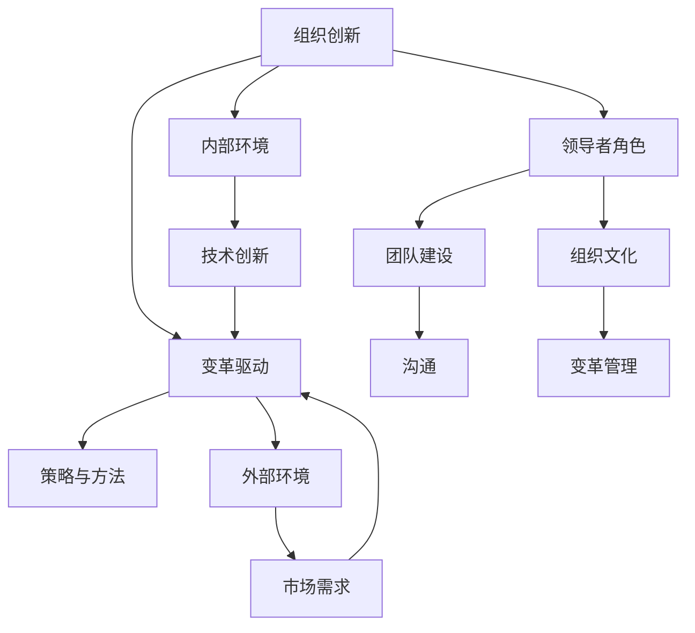

                 

### 文章标题：组织创新：领导者如何驱动变革

#### 关键词：组织创新，领导者，变革驱动，策略与方法，团队建设，沟通，组织文化，案例研究

#### 摘要：
本文深入探讨了组织创新的重要性和领导者在这一过程中的关键作用。通过详细的理论基础分析、具体策略方法的讲解，以及实际案例的研究，本文为领导者提供了驱动组织变革的实用指南。文章结构紧凑，逻辑清晰，旨在帮助读者全面理解组织创新的核心要素，掌握有效的变革管理技能。

## 引言

### 背景介绍

在当今快速变化的市场环境中，组织创新已成为企业持续竞争和发展的关键。传统的管理模式和方法已经无法满足新兴挑战和机遇的需求。因此，领导者必须具备前瞻性的思维和创新的勇气，以推动组织实现变革和转型。然而，组织变革并非易事，它涉及到复杂的战略决策、组织结构的调整、文化重塑等多个方面。在这个过程中，领导者的角色和作用至关重要。

### 核心概念与联系

为了更好地理解组织创新和变革驱动，我们需要明确几个核心概念，并探讨它们之间的联系。以下是这些核心概念及其关系架构的Mermaid流程图：



### 核心算法原理讲解

变革驱动的核心算法原理可以概括为以下几个步骤：

```python
def drive_change(organization):
    # 第一步：评估内外部环境
    internal_environment = assess_internal_environment(organization)
    external_environment = assess_external_environment(organization)
    
    # 第二步：制定变革策略
    strategy = formulate_change_strategy(internal_environment, external_environment)
    
    # 第三步：实施变革计划
    execute_change_plan(strategy)
    
    # 第四步：监测和调整
    monitor_progress()
    adjust_as_needed()
```

#### 数学模型和公式

在变革管理中，一个关键的数学模型是SWOT分析，它用于评估组织的优势、劣势、机会和威胁。以下是SWOT分析的公式：

$$
\text{SWOT} = (\text{Strengths}, \text{Weaknesses}, \text{Opportunities}, \text{Threats})
$$

#### 详细讲解和举例说明

为了更好地理解SWOT分析，我们可以通过以下示例来说明：

**组织A的SWOT分析：**

- **Strengths（优势）：** 高效的运营流程，强大的品牌影响力。
- **Weaknesses（劣势）：** 缺乏创新能力，产品线过于单一。
- **Opportunities（机会）：** 市场需求增长，新技术的发展。
- **Threats（威胁）：** 竞争对手的崛起，行业监管的变化。

通过SWOT分析，组织A可以制定相应的策略来应对外部威胁和利用内部优势。

### 文章正文部分

### 1. 组织创新的重要性

组织创新的重要性不容忽视。它不仅能够帮助企业应对市场变化，还能推动企业实现持续发展。以下是组织创新的一些关键要素：

#### 1.1 组织创新的定义与历史演变

组织创新是指在企业内部引入新的思想、方法、技术或流程，以改进现有业务或创造新的业务模式。创新的历史演变经历了从简单的技术改进到全面的组织变革，再到现在的数字化转型。

#### 1.2 组织创新的类型与驱动力

组织创新的类型包括产品创新、流程创新、市场创新和组织创新。驱动力则来自于内部因素，如员工意愿、管理支持，以及外部因素，如市场压力、技术变革。

#### 1.3 组织创新对企业发展的影响

组织创新能够提高企业的竞争力、增强企业的适应能力，并为企业带来新的增长点。长期来看，创新是企业持续发展的动力源泉。

### 2. 组织创新的理论基础

理解组织创新的理论基础对于领导者来说是至关重要的。以下是一些主要的创新理论：

#### 2.1 创新理论的概述

创新理论主要包括基于过程的创新理论和基于技术的创新理论。基于过程的创新理论强调知识管理和团队合作，而基于技术的创新理论则强调技术驱动的创新。

#### 2.1.1 知识创新理论

知识创新理论认为，知识是创新的核心资源。通过知识共享、知识整合和知识创造，企业可以实现创新。

#### 2.1.2 社会技术系统理论

社会技术系统理论强调社会因素和技术因素之间的相互作用。在这个系统中，技术不是孤立存在的，而是与社会因素相互影响、相互促进的。

### 3. 领导者的角色与作用

领导者是组织创新的推动者。以下内容将探讨领导者的角色与作用：

#### 3.1 领导者的创新思维

领导者的创新思维包括敢于挑战现状、拥抱变革、鼓励试错和持续学习。这些思维方式是驱动组织创新的基础。

#### 3.2 领导者的变革能力

领导者的变革能力体现在其战略规划、团队管理和沟通协调等方面。只有具备强大的变革能力，领导者才能有效地推动组织创新。

### 4. 驱动变革的策略与方法

以下是推动变革的一些关键策略与方法：

#### 4.1 变革前的准备工作

在推动变革之前，领导者需要做好充分的准备工作。这包括评估当前环境、确定变革目标、制定变革计划等。

#### 4.2 变革过程中的管理策略

在变革过程中，领导者需要采取一系列管理策略来确保变革的顺利进行。这包括沟通策略、激励机制、团队建设等。

### 5. 变革中的团队建设与沟通

团队建设和沟通在变革过程中扮演着重要角色。以下内容将探讨这些方面：

#### 5.1 团队建设的重要性

团队建设能够增强团队成员的协作能力，提高团队的整体绩效。在变革过程中，团队建设尤为重要。

#### 5.2 沟通在变革中的作用

沟通是变革成功的关键。通过有效的沟通，领导者可以确保团队成员理解变革的必要性、目标和方法，从而提高变革的接受度。

### 6. 变革中的组织文化与氛围

组织文化和氛围对变革的成功至关重要。以下内容将探讨如何塑造积极变革的组织文化和氛围：

#### 6.1 组织文化的塑造

领导者需要通过价值观的传播、制度的建立和行为的示范来塑造积极变革的组织文化。

#### 6.2 建立积极变革的氛围

建立积极变革的氛围需要领导者营造一种开放、包容和鼓励创新的工作环境。

### 7. 案例研究

以下是两个组织创新的案例研究：

#### 7.1 案例一：公司A的变革历程

公司A通过引入新技术和优化流程，成功实现了数字化转型。以下是公司A的变革历程：

- **背景介绍**：公司A面临市场份额下降、客户需求变化等挑战。
- **核心概念与联系**：数字化转型、流程优化、技术引入。
- **核心算法原理讲解**：采用SWOT分析制定变革策略，实施数字化转型计划。
- **数学模型和公式**：利用效率模型和成本效益分析评估变革效果。
- **项目实战**：详细描述公司A的数字化转型过程，包括技术选型、项目实施和效果评估。
- **最佳实践 tips**：强调领导者的关键作用、团队的协作和文化的支持。
- **项目小结**：总结公司A变革的成功经验和教训。

#### 7.2 案例二：公司B的变革实践

公司B通过组织结构调整和文化重塑，成功应对了市场变革。以下是公司B的变革实践：

- **背景介绍**：公司B面临市场竞争加剧、组织效率低下等问题。
- **核心概念与联系**：组织结构调整、文化重塑、员工参与。
- **核心算法原理讲解**：采用变革管理模型，制定变革路线图。
- **数学模型和公式**：利用组织效能模型评估变革效果。
- **项目实战**：详细描述公司B的组织结构调整和文化重塑过程，包括领导者的角色、团队的协作和文化的建设。
- **最佳实践 tips**：强调领导者的沟通能力、员工的参与度和文化的变革。
- **项目小结**：总结公司B变革的成功经验和教训。

### 总结

组织创新是领导者必须掌握的重要技能。通过理解组织创新的重要性、理论基础、领导者的角色与作用，以及驱动变革的策略与方法，领导者可以有效地推动组织实现变革和转型。案例研究则为我们提供了实际操作的指导。在实际操作中，领导者需要注重团队建设与沟通、组织文化的塑造，并不断学习和适应新的变革环境。通过这些努力，组织可以实现持续创新，保持竞争优势。

## 作者信息

作者：AI天才研究院/AI Genius Institute & 禅与计算机程序设计艺术 /Zen And The Art of Computer Programming

---

本文通过详细的理论基础分析、具体策略方法的讲解，以及实际案例的研究，为领导者提供了驱动组织变革的实用指南。希望本文能够帮助读者全面理解组织创新的核心要素，掌握有效的变革管理技能。在未来的职业生涯中，无论您是企业管理者还是技术领导者，组织创新都将为您的事业发展提供强大的动力。让我们共同探索组织创新的无尽可能，推动企业实现持续成长与成功！

