                 

### 组织变革管理：引导团队度过转型期

#### 关键词：组织变革、团队管理、领导艺术、变革策略、变革技术、变革评估

#### 摘要：
在当今快速变化的市场环境中，组织变革已成为企业生存和发展的必要手段。然而，变革并非一帆风顺，如何引导团队度过转型期，实现平稳过渡，是企业管理者面临的重要挑战。本文将深入探讨组织变革管理的核心概念与原理，变革过程中的团队管理与领导艺术，变革策略与实施方法，以及变革管理的工具与技术，旨在为读者提供一套全面、实用的变革管理指南。

## 第1章：变革管理的核心概念与原理

### 1.1 组织变革的定义与类型

组织变革是指企业为了适应外部环境变化或实现内部发展目标，对现有组织结构、业务流程、管理模式等方面进行的一系列调整和优化。根据变革的对象和内容，组织变革可分为以下几种类型：

1. **结构性变革**：涉及组织结构、部门设置、职责分配等方面的调整。
2. **流程性变革**：针对业务流程、工作流程、信息系统等方面的优化和改进。
3. **文化性变革**：旨在塑造和传播新的企业价值观、行为规范和企业文化。
4. **技术性变革**：引入新技术、新设备、新方法等，以提高企业竞争力。

#### 核心概念与联系

组织变革的核心概念包括变革的驱动力、变革的目标、变革的过程和变革的成效。这些概念之间存在着紧密的联系，共同构成了组织变革的理论体系。

- **变革的驱动力**：外部环境的变化（如市场需求、竞争态势、技术进步等）和内部发展的需求（如企业愿景、战略目标、管理改进等）是推动组织变革的主要力量。
- **变革的目标**：明确变革的目的和预期成果，有助于指导变革的方向和策略。
- **变革的过程**：包括启动、规划、实施、监控和评估等环节，是组织变革的核心内容。
- **变革的成效**：评估变革的成果，包括短期和长期的效果，为后续变革提供参考。

以下是一个简化的Mermaid流程图，展示了组织变革的核心概念及其相互关系：

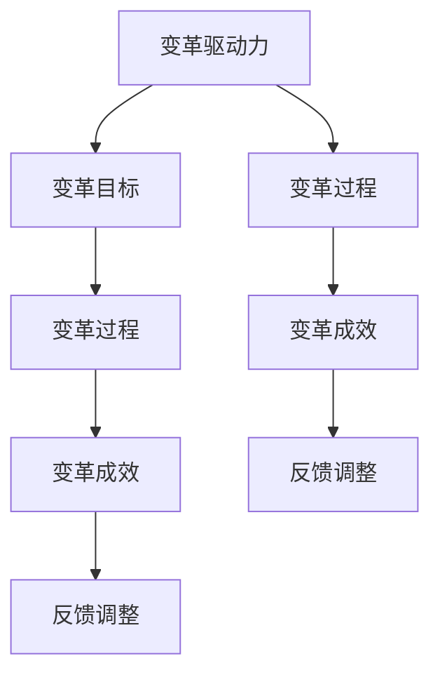

### 1.2 变革管理的必要性

在当前全球化、信息化的背景下，企业面临的环境日益复杂多变，竞争压力不断加大。为了应对这些挑战，企业必须不断进行变革，以保持竞争力和持续发展。变革管理的必要性体现在以下几个方面：

1. **适应外部环境变化**：随着市场、技术、政策等因素的变化，企业需要调整内部结构和业务模式，以适应新的环境。
2. **实现内部发展目标**：企业为了实现长期发展目标，需要不断改进管理模式、提升组织效能，以实现战略目标。
3. **提高竞争力**：通过变革，企业可以优化业务流程、提升创新能力、降低成本，从而在市场竞争中占据优势。
4. **激发员工潜力**：变革可以激发员工的积极性和创造力，提高员工的参与度和满意度。

### 1.3 变革管理的框架与流程

变革管理是一个系统性的过程，涉及多个环节和步骤。一个典型的变革管理框架包括以下阶段：

1. **启动变革**：明确变革的背景和目标，获得领导层和员工的支持。
2. **评估现状**：分析当前组织结构、流程、文化等方面的问题和瓶颈，为变革提供依据。
3. **制定策略**：根据评估结果，确定变革的方向、目标和实施方案。
4. **实施变革**：组织资源，推动变革计划的执行，确保变革目标的实现。
5. **监控与调整**：跟踪变革的进展，及时发现问题并调整方案，确保变革的顺利进行。
6. **评估结果**：对变革成效进行评估，总结经验教训，为后续变革提供参考。

以下是变革管理流程的伪代码，简要描述了每个阶段的操作步骤：

```python
# 变革管理流程伪代码

# 启动变革
start_change()
    display("启动变革")
    get_support_from_leaders()
    get_support_from_employees()

# 评估现状
evaluate_current_status()
    analyze_org_structure()
    analyze_business_processes()
    analyze_org_culture()

# 制定策略
define_change_strategy()
    set_change_direction()
    set_change_objectives()
    develop_implementation_plan()

# 实施变革
implement_change()
    allocate_resources()
    execute_implementation_plan()

# 监控与调整
monitor_and_adjust()
    track_progress()
    identify_issues()
    adjust_plans()

# 评估结果
evaluate_outcomes()
    assess_achievement_of_objectives()
    summarize_learning()
    provide_references_for_future_changes()
```

通过以上框架和流程，企业可以有条不紊地进行变革，提高变革的成功率。在下一章中，我们将进一步探讨变革过程中的团队管理与领导艺术。请持续关注。## 第2章：变革过程中的团队管理

### 2.1 团队成员的心理准备与引导

组织变革不仅涉及企业层面的调整，更深刻地影响着每个团队成员的心理状态。团队成员的心理准备与引导是变革成功的关键因素之一。以下是一些关键点：

**心理准备的重要性**：

- **接受变革**：团队成员需要理解变革的必要性和紧迫性，接受变革带来的不确定性。
- **调整心态**：团队成员需要调整自己的心态，从被动适应到主动参与，以积极的态度面对变革。
- **建立信心**：通过培训和心理辅导，帮助团队成员建立信心，克服变革过程中的心理障碍。

**引导策略**：

- **沟通与反馈**：通过定期沟通和反馈，了解团队成员的担忧和疑虑，及时解答问题，提供心理支持。
- **参与决策**：让团队成员参与变革的决策过程，增强他们的参与感和归属感。
- **提供培训**：为团队成员提供相关培训和辅导，提升他们的技能和知识，增强应对变革的能力。
- **团队建设**：通过团队建设活动，增强团队成员之间的信任和合作，共同面对变革的挑战。

**案例解析**：

以某大型制造企业为例，该企业在进行流程性变革时，通过以下措施有效地引导了团队成员的心理准备：

- **沟通与反馈**：定期召开团队会议，讨论变革的进展和影响，收集团队成员的反馈和建议。
- **参与决策**：邀请团队成员参与变革方案的讨论和制定，让他们感受到自己的意见被重视。
- **提供培训**：组织了多场变革管理培训，包括变革心理、沟通技巧、团队协作等方面的内容。
- **团队建设**：通过团队拓展活动和团队建设课程，增强了团队成员之间的信任和协作。

通过这些措施，该企业成功地引导了团队成员的心理准备，为变革的顺利进行奠定了基础。

### 2.2 沟通策略与技巧

沟通在组织变革过程中起着至关重要的作用。有效的沟通可以确保团队成员对变革有清晰的理解，减少误解和冲突，增强团队凝聚力。以下是一些关键的沟通策略与技巧：

**沟通策略**：

- **明确目标**：在沟通前明确沟通的目标和关键信息，确保信息的准确传达。
- **多样化渠道**：利用多种沟通渠道，如会议、邮件、即时通讯等，以满足不同团队成员的沟通需求。
- **倾听与反馈**：积极倾听团队成员的意见和反馈，及时回应，建立双向沟通机制。
- **透明度**：保持沟通的透明度，及时公布变革的进展和成果，增加团队成员的信任感。

**沟通技巧**：

- **情感共鸣**：站在对方的角度思考问题，表达理解和关心，增强沟通的亲和力。
- **简化语言**：使用简单易懂的语言，避免使用专业术语和复杂的句子结构。
- **有效提问**：通过提问引导对话，了解团队成员的困惑和疑虑，解决问题。
- **非语言沟通**：利用肢体语言、面部表情和声音的语调，增强沟通的效果。

**案例分析**：

以某互联网公司为例，该企业在进行文化性变革时，通过以下沟通策略与技巧，有效地促进了团队成员的理解和参与：

- **明确目标**：在每次沟通会议前，明确会议的目的和关键信息，确保团队成员了解会议内容。
- **多样化渠道**：通过公司内部邮件、即时通讯工具和面对面会议等多种渠道，确保信息传达的全面性。
- **倾听与反馈**：鼓励团队成员提问和表达意见，及时解答问题，并收集团队成员的反馈。
- **透明度**：定期公布变革的进展和成果，包括变革带来的好处和挑战，增加团队成员的信任感。

通过这些沟通策略与技巧，该企业成功地减少了变革过程中的误解和冲突，增强了团队的凝聚力。

### 2.3 团队协作与冲突管理

在组织变革过程中，团队协作和冲突管理至关重要。有效的团队协作可以增强团队凝聚力，提高工作效率，而有效的冲突管理可以化解团队内部的矛盾，确保变革的顺利进行。

**团队协作**：

- **明确职责**：为团队成员分配明确的职责和任务，确保每个人都清楚自己的工作内容和目标。
- **建立共同目标**：团队成员共同确定团队目标，增强协作的动力和方向。
- **沟通与协作工具**：利用协作工具，如项目管理系统、团队沟通软件等，提高团队协作效率。
- **培训与发展**：为团队成员提供培训和发展机会，提升团队协作能力。

**冲突管理**：

- **预防冲突**：通过提前沟通和规划，减少潜在冲突的发生。
- **识别冲突**：及时识别和面对冲突，避免问题积累。
- **理解冲突**：了解冲突的原因和背后的利益关系，找到解决冲突的方法。
- **协商解决**：通过对话和协商，寻找各方都能接受的解决方案。

**案例分析**：

以某科技创新企业为例，该企业在进行技术创新项目时，通过以下措施有效地管理了团队协作和冲突：

- **明确职责**：为每个团队成员分配明确的职责和任务，确保项目目标的实现。
- **建立共同目标**：项目启动前，团队成员共同讨论并确定项目目标，明确每个人的角色和责任。
- **沟通与协作工具**：使用项目管理软件和即时通讯工具，提高团队协作效率。
- **预防冲突**：通过定期团队会议和项目进度报告，提前识别和解决潜在冲突。
- **识别冲突**：当冲突发生时，及时召开会议，了解冲突的起因和影响，共同寻找解决方案。
- **理解冲突**：通过对话和讨论，了解冲突各方的立场和利益，找到共同点。
- **协商解决**：通过协商和谈判，找到各方都能接受的解决方案，确保项目的顺利进行。

通过这些措施，该企业成功地管理了团队协作和冲突，确保了技术创新项目的成功实施。

综上所述，团队管理在组织变革过程中发挥着关键作用。通过引导团队成员的心理准备、有效的沟通策略和技巧、团队协作与冲突管理，企业可以确保变革的顺利进行，实现组织目标。在下一章中，我们将探讨变革管理的领导艺术，包括领导者的角色与责任、变革中的领导风格和领导者的自我调适。请持续关注。## 第3章：变革管理的领导艺术

### 3.1 领导者的角色与责任

在组织变革过程中，领导者的角色和责任至关重要。领导者不仅是变革的倡导者和推动者，还是团队成员的支持者和引导者。以下从几个方面分析领导者的角色与责任：

**领导者的角色**：

- **变革的倡导者**：领导者需要率先认同并倡导变革，为团队成员树立榜样。
- **愿景的传播者**：领导者需要明确变革的目标和愿景，并将其传播给团队成员，激发他们的热情和参与。
- **变革的推动者**：领导者需要积极推动变革计划的实施，确保变革目标的实现。
- **支持者与引导者**：领导者需要关心和支持团队成员，帮助他们克服变革过程中的困难和挑战。

**领导者的责任**：

- **明确变革方向**：领导者需要明确变革的目标和方向，制定切实可行的变革计划。
- **制定变革策略**：领导者需要根据组织特点和外部环境，制定合适的变革策略，确保变革的顺利进行。
- **资源调配**：领导者需要合理调配组织资源，包括人力、财力、物力等，为变革提供保障。
- **沟通协调**：领导者需要与团队成员、管理层和外部利益相关者保持良好的沟通，协调各方关系，减少变革阻力。
- **监督与反馈**：领导者需要监督变革的进展，及时发现问题并进行调整，确保变革目标的实现。
- **评估与总结**：领导者需要评估变革的成效，总结变革过程中的经验和教训，为后续变革提供参考。

以下是一个简化版的领导者在变革管理中的职责伪代码，描述了领导者的主要任务和步骤：

```python
# 变革管理中领导者的职责伪代码

# 明确变革方向
set_change_direction()

# 制定变革策略
define_change_strategy()

# 资源调配
allocate_resources()

# 沟通协调
communicate_and协调()

# 监督与反馈
monitor_progress() {
    identify_issues()
    provide_feedback()
}

# 评估与总结
evaluate_outcomes() {
    summarize_learning()
    provide_references()
}
```

### 3.2 变革中的领导风格

领导风格是领导者领导行为和态度的体现，不同的领导风格会对变革过程产生不同的影响。根据领导者如何与团队成员互动和决策，领导风格可分为以下几种：

**1. 转变型领导**：

- **激励与鼓励**：领导者通过激励和鼓励，激发团队成员的积极性和创造力。
- **愿景引导**：领导者明确变革的愿景，引导团队成员朝着共同目标努力。
- **授权与信任**：领导者信任团队成员，给予他们足够的自主权和责任。

**2. 交易型领导**：

- **奖励与惩罚**：领导者通过奖励和惩罚来激励团队成员，以达成组织目标。
- **任务导向**：领导者关注任务完成的情况，强调效率和结果。
- **控制与监督**：领导者通过监督和控制，确保团队成员按照预定计划执行任务。

**3. 情境领导**：

- **适应性领导**：领导者根据团队成员的能力和外部环境的变化，调整自己的领导风格。
- **灵活多变**：领导者能够灵活应对不同的情况和挑战，采取适当的领导策略。

**领导风格的选择与匹配**：

领导风格的选择和匹配对变革的成功至关重要。领导者需要根据组织的实际情况和变革的需求，选择合适的领导风格。例如：

- **在初期阶段**，变革型领导有助于激发团队成员的积极性和创造力，推动变革的启动和实施。
- **在中期阶段**，交易型领导可以通过奖励和惩罚机制，确保团队成员按照计划执行任务。
- **在后期阶段**，情境领导有助于适应变革过程中的变化和挑战，确保变革目标的实现。

以下是一个情境领导模型，描述了不同领导风格在不同情境下的适用性：

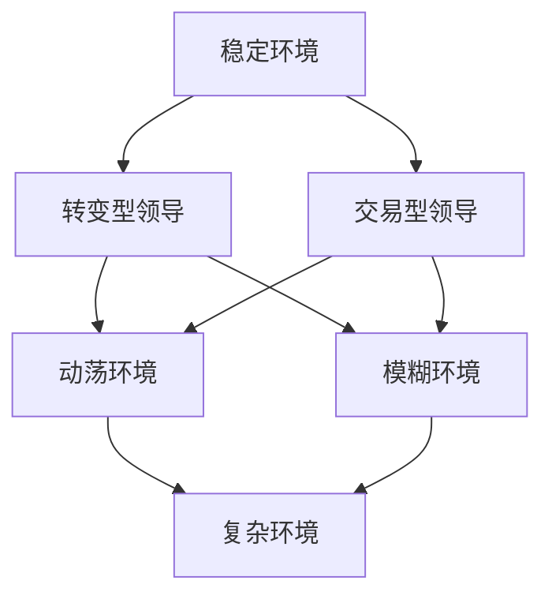

### 3.3 领导者的自我调适

在组织变革过程中，领导者不仅需要关注变革的推动和执行，还需要关注自身的成长和调适。以下是一些关键点：

**1. 自我反思**：领导者需要定期进行自我反思，了解自己在变革过程中的表现和不足，找到改进的方向。

**2. 学习与成长**：领导者需要不断学习和成长，提升自己的领导能力和专业知识，以应对变革的挑战。

**3. 建立支持网络**：领导者需要建立支持网络，包括导师、同事、下属等，从他们那里获取建议和支持。

**4. 保持耐心与毅力**：变革是一个长期的过程，领导者需要保持耐心和毅力，克服变革过程中的困难和挫折。

**5. 健康管理**：领导者需要关注自己的身心健康，保持良好的精神状态，以应对变革带来的压力和挑战。

以下是一个自我调适的伪代码，描述了领导者在变革过程中的自我调适步骤：

```python
# 领导者自我调适伪代码

# 自我反思
reflect_on_self()

# 学习与成长
learn_and_grow()

# 建立支持网络
build_support_network()

# 保持耐心与毅力
maintain_patience_and_determination()

# 健康管理
manage_health()
```

通过以上自我调适，领导者可以更好地应对变革过程中的挑战，确保变革的成功实施。

综上所述，变革管理的领导艺术包括领导者的角色与责任、变革中的领导风格和领导者的自我调适。在下一章中，我们将探讨变革策略与实施方法，包括变革策略的制定与评估、变革实施的关键步骤以及变革实施中的挑战与应对。请持续关注。## 第4章：变革策略与实施方法

### 4.1 变革策略的制定与评估

变革策略的制定是变革管理的重要环节，它决定了变革的方向和目标。一个有效的变革策略应考虑以下关键因素：

**1. 变革目标**：明确变革的目的和预期成果，如提升效率、优化流程、增强创新能力等。

**2. 变革范围**：确定变革的覆盖范围，包括组织结构、业务流程、人员配置等。

**3. 变革步骤**：制定详细的变革计划，包括启动、评估、实施、监控和评估等阶段。

**4. 变革资源**：评估变革所需的资源，包括人力、资金、技术等。

**5. 变革阻力**：识别潜在的变革阻力，并制定相应的应对措施。

**制定策略的方法**：

- **战略地图**：使用战略地图工具，将变革目标分解为具体的行动计划和指标，确保变革目标的实现。

- **SWOT分析**：通过SWOT分析，评估组织在变革中的优势、劣势、机会和威胁，为制定策略提供依据。

- **流程图**：使用流程图工具，描述当前的业务流程和变革后的业务流程，明确变革的具体步骤和关键节点。

以下是变革策略制定过程的伪代码：

```python
# 变革策略制定伪代码

# 确定变革目标
define_change_goals()

# 分析变革范围
analyze_change_scope()

# 制定变革步骤
define_change_steps()

# 评估变革资源
evaluate_change_resources()

# 识别变革阻力
identify_change_resistance()

# 制定应对措施
define_countermeasures()

# 制定战略地图
create_strategic_map()

# 完成变革策略
complete_change_strategy()
```

**评估策略的方法**：

- **KPI指标**：设定关键绩效指标（KPI），用于评估变革策略的有效性。

- **基准对比**：将变革前后的绩效数据进行对比，评估变革成果。

- **员工反馈**：收集员工对变革的反馈，了解变革对员工的影响和满意度。

- **成本效益分析**：评估变革的成本和效益，确保变革的经济合理性。

### 4.2 变革实施的关键步骤

制定好变革策略后，下一步是实施变革。以下是一个典型的变革实施步骤：

**1. 启动阶段**：

- **动员大会**：召开动员大会，传达变革策略和目标，激发员工积极性。

- **团队组建**：组建变革团队，明确团队成员的职责和任务。

- **启动计划**：制定详细的启动计划，包括时间表、里程碑和关键任务。

**2. 实施阶段**：

- **培训与沟通**：为员工提供必要的培训，提高他们对变革的理解和接受度。

- **试点实施**：选择部分部门或团队进行试点实施，收集反馈并进行调整。

- **全面推进**：在试点成功的基础上，全面推进变革计划。

**3. 监控与调整阶段**：

- **进度跟踪**：监控变革的进展，确保按照计划执行。

- **问题解决**：及时解决变革过程中出现的问题和挑战。

- **反馈机制**：建立反馈机制，收集员工的意见和建议，持续改进变革计划。

以下是变革实施关键步骤的伪代码：

```python
# 变革实施伪代码

# 启动阶段
start_change_stage() {
    call_motivation_meeting()
    form_change_teams()
    define_start_up_plan()
}

# 实施阶段
implementation_stage() {
    provide_training()
    conduct_pilot_implement()
    advance_fullscale_implement()
}

# 监控与调整阶段
monitor_and_adjust_stage() {
    track_progress()
    solve_issues()
    establish_feedback_mechanism()
}
```

### 4.3 变革实施中的挑战与应对

在变革实施过程中，企业可能会面临各种挑战。以下是一些常见的挑战及应对策略：

**1. 阻力与反对**：

- **挑战**：员工对变革的抵触情绪，可能源于对变革的不理解、对未知的恐惧、对现状的依赖等。

- **应对策略**：通过沟通、培训和激励机制，增加员工对变革的理解和接受度。同时，让员工参与到变革过程中，增强他们的参与感和归属感。

**2. 时间与资源限制**：

- **挑战**：变革过程中可能面临时间紧迫、资源不足等问题。

- **应对策略**：合理安排变革计划，确保有足够的时间和资源进行变革。通过优先级排序和资源调配，确保关键任务的顺利完成。

**3. 技术变革**：

- **挑战**：技术变革可能涉及新技术的引入、现有系统的改造等，对技术和人力资源的要求较高。

- **应对策略**：提前进行技术评估和规划，确保技术变革的可行性。加强技术培训和人才引进，提升团队的技术能力。

**4. 文化变革**：

- **挑战**：文化变革涉及企业价值观、行为规范等方面的调整，难度较大。

- **应对策略**：通过文化建设活动、文化引导和价值观传播，逐步推动企业文化的变革。同时，领导者要以身作则，树立良好的榜样。

通过以上策略，企业可以更好地应对变革实施中的挑战，确保变革的顺利进行。

综上所述，变革策略的制定与评估、变革实施的关键步骤以及变革实施中的挑战与应对，构成了变革管理的核心内容。在下一章中，我们将探讨变革管理的工具与技术，包括变革管理的工具概述、常用变革管理技术的应用以及变革管理技术的选择与实施。请持续关注。## 第5章：变革管理的工具与技术

### 5.1 变革管理的工具概述

在组织变革管理过程中，使用适当的工具和技术可以显著提高变革的成功率。以下是一些常用的变革管理工具：

**1. 项目管理软件**：用于规划、跟踪和报告变革项目的进度，如Trello、Asana、Jira等。

**2. 数据分析工具**：用于收集、分析和展示变革过程中的数据，如Excel、Tableau、Power BI等。

**3. 团队沟通工具**：用于促进团队成员之间的沟通和协作，如Slack、Microsoft Teams、Zoom等。

**4. 知识管理工具**：用于记录、共享和更新变革过程中的知识，如Confluence、SharePoint、Google Drive等。

**5. 培训与学习平台**：用于提供在线培训和学习资源，如LinkedIn Learning、Coursera、Udemy等。

### 5.2 常用变革管理技术的应用

**1. SWOT分析**：

SWOT分析是一种常用的战略规划工具，用于评估组织的优势、劣势、机会和威胁。在变革管理中，SWOT分析可以帮助组织确定变革的目标和策略。

- **优势（Strengths）**：识别组织在变革中的优势，如员工技能、企业文化等。
- **劣势（Weaknesses）**：识别组织在变革中的劣势，如流程瓶颈、资源限制等。
- **机会（Opportunities）**：识别外部环境中的机会，如市场需求、技术进步等。
- **威胁（Threats）**：识别外部环境中的威胁，如竞争加剧、政策变化等。

以下是一个简化的SWOT分析流程图：

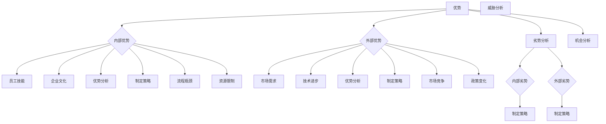

**2. SMART目标**：

SMART目标是用于设定具体、可衡量、可实现、相关和有时间限制的目标。在变革管理中，SMART目标可以帮助组织明确变革的目标和期望成果。

- **具体（Specific）**：目标要明确具体，避免模糊不清。
- **可衡量（Measurable）**：目标要具有可衡量性，以便跟踪进展。
- **可实现（Achievable）**：目标要现实可行，避免过于理想化。
- **相关（Relevant）**：目标要与组织的战略和愿景相关联。
- **有时间限制（Time-bound）**：目标要设定具体的时间期限。

以下是一个SMART目标的示例：

**目标**：在2023年底前，将公司的客户满意度提升至90%以上。

**3. PDCA循环**：

PDCA循环（计划、执行、检查、行动）是一种有效的质量管理工具，适用于变革管理。PDCA循环可以帮助组织持续改进和优化变革过程。

- **计划（Plan）**：制定变革计划，明确目标和步骤。
- **执行（Do）**：执行变革计划，实施具体的变革行动。
- **检查（Check）**：检查变革的执行情况，评估效果。
- **行动（Act）**：根据检查结果，采取行动，持续改进。

以下是一个简化的PDCA循环流程图：

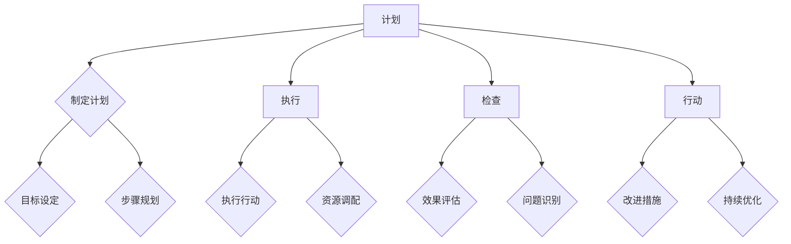

### 5.3 变革管理技术的选择与实施

选择合适的变革管理技术对于提高变革的成功率至关重要。以下是一些关键点：

**1. 需求分析**：在开始选择变革管理技术之前，首先要进行需求分析，明确组织在变革管理方面的具体需求和目标。

**2. 技术评估**：对潜在的变革管理技术进行评估，考虑其功能、性能、成本、可扩展性等方面。

**3. 用户参与**：让团队成员参与到技术选择过程中，确保选定的技术能够满足他们的实际需求。

**4. 测试与验证**：在正式实施前，进行技术测试和验证，确保技术能够顺利运行。

**5. 培训与支持**：为团队成员提供必要的培训和支持，确保他们能够熟练使用变革管理技术。

以下是一个变革管理技术选型流程的伪代码：

```python
# 变革管理技术选型流程

# 需求分析
analyze_requirements()

# 技术评估
evaluate_technologies()

# 用户参与
involve_users()

# 测试与验证
test_and_validate()

# 培训与支持
provide_training()

# 实施变革管理技术
implement_change_management_technology()
```

通过以上步骤，组织可以有效地选择和实施适合自己需求的变革管理技术，提高变革的成功率。

综上所述，变革管理的工具与技术是推动变革的重要手段。在下一章中，我们将探讨变革管理的评估与反馈，包括变革效果的评估方法、变革过程中的反馈机制以及变革成果的持续改进。请持续关注。## 第6章：变革管理的评估与反馈

### 6.1 变革效果的评估方法

评估变革效果是变革管理的重要组成部分，有助于了解变革的实施情况、成效以及存在的问题，为后续的改进提供依据。以下是一些常用的评估方法：

**1. KPI指标**：

KPI（关键绩效指标）是评估变革效果的重要工具。通过设定和跟踪一系列关键指标，可以定量评估变革的影响。常见的KPI指标包括：

- **财务指标**：如收入、利润、成本降低等。
- **运营指标**：如生产效率、客户满意度、员工满意度等。
- **流程指标**：如流程周期时间、错误率、响应时间等。

以下是一个简化的KPI指标跟踪流程图：

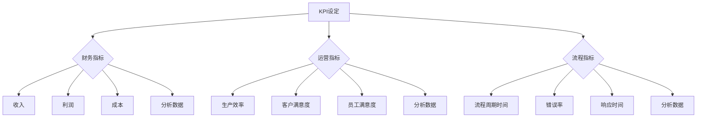

**2. 员工满意度调查**：

员工满意度调查是一种常用的定性评估方法，通过收集员工对变革的看法和感受，了解变革对员工的影响。调查内容可以包括：

- **工作环境**：如工作条件、设备设施等。
- **职业发展**：如培训机会、晋升机会等。
- **工作氛围**：如团队合作、沟通效果等。

以下是一个员工满意度调查的流程图：

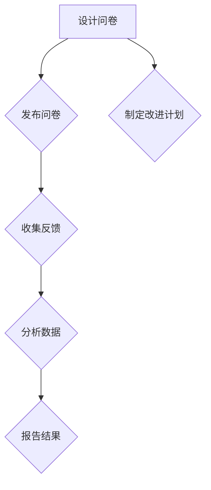

**3. 客户满意度调查**：

客户满意度调查是评估变革对客户影响的重要手段。通过收集客户对产品和服务的反馈，了解变革对客户体验的影响。调查内容可以包括：

- **产品质量**：如产品性能、可靠性等。
- **服务体验**：如响应速度、服务态度等。
- **价值感知**：如价格合理性、性价比等。

以下是一个客户满意度调查的流程图：


### 6.2 变革过程中的反馈机制

有效的反馈机制是变革管理的重要环节，有助于及时识别和解决问题，确保变革的顺利进行。以下是一些关键点：

**1. 定期反馈会议**：

定期举行反馈会议，让团队成员分享变革过程中的心得体会和遇到的问题。通过面对面的沟通，可以更有效地收集反馈，解决问题。

以下是一个定期反馈会议的流程图：

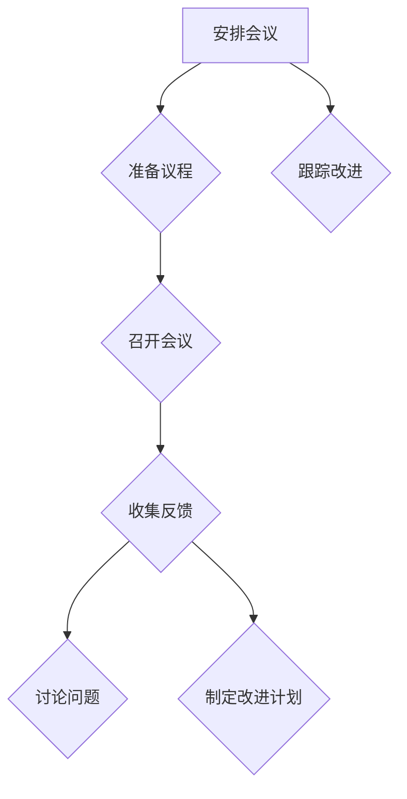

**2. 持续反馈系统**：

建立持续反馈系统，如内部意见箱、在线反馈平台等，方便团队成员随时提交意见和建议。这种机制可以确保反馈的及时性和全面性。

以下是一个持续反馈系统的流程图：

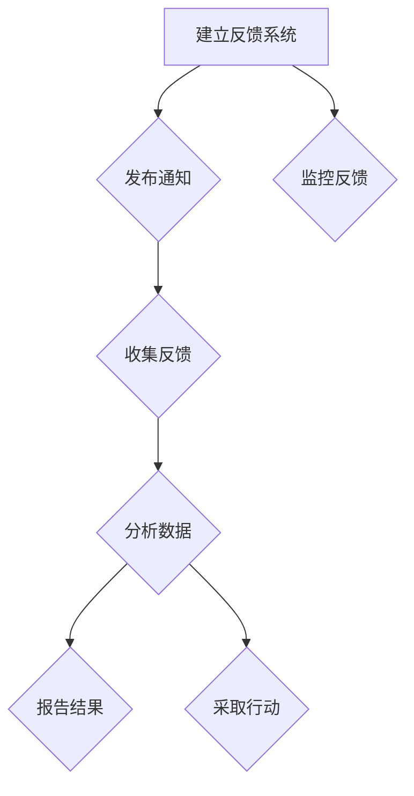

**3. 反馈激励机制**：

为了鼓励团队成员积极反馈，可以设立反馈激励机制，如奖励制度、表彰活动等。这种机制可以增强员工的参与感和责任感。

以下是一个反馈激励机制的流程图：

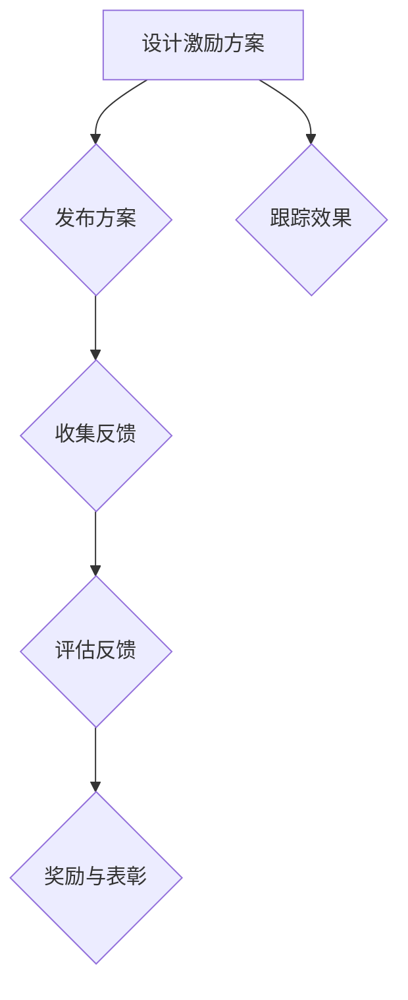

### 6.3 变革成果的持续改进

变革并非一蹴而就，持续改进是确保变革成效的重要手段。以下是一些关键点：

**1. 持续监控与评估**：

在变革完成后，持续监控和评估变革的效果，确保变革成果的持续性和稳定性。通过定期检查和评估，可以发现新的问题和挑战，及时进行调整和优化。

以下是一个持续改进的流程图：

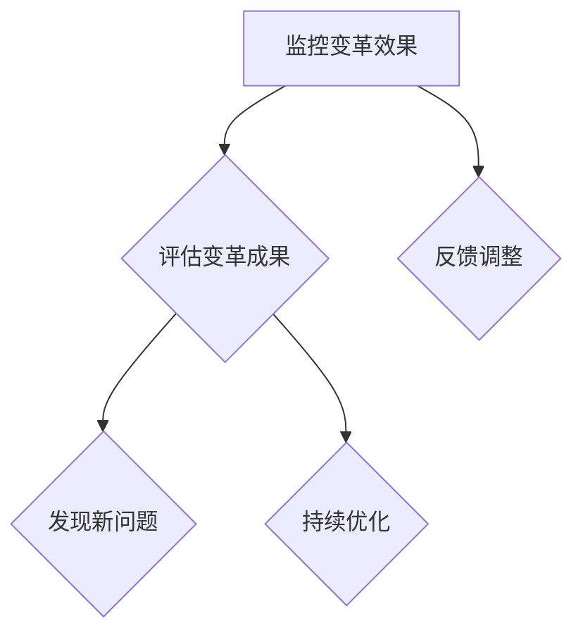

**2. 学习与分享**：

鼓励团队成员学习新知识和技能，分享变革过程中的经验和教训。通过学习和分享，可以不断提升团队的素质和能力，为未来的变革做好准备。

以下是一个学习与分享的流程图：

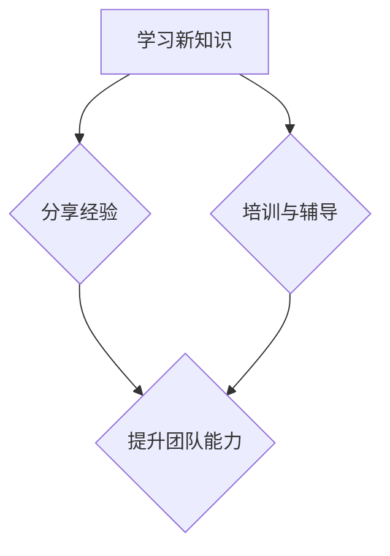

**3. 持续创新**：

在变革的基础上，鼓励持续创新，推动组织的持续发展和成长。通过引入新技术、新方法和新理念，不断提升组织的竞争力和创新能力。

以下是一个持续创新的流程图：

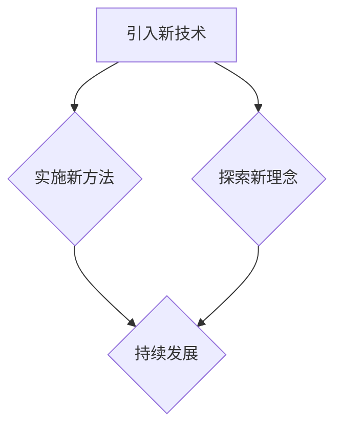

通过以上持续改进措施，组织可以确保变革成果的长期稳定和持续发展。

综上所述，变革管理的评估与反馈是确保变革成功的关键环节。通过有效的评估方法、反馈机制和持续改进，组织可以不断提高变革成效，实现长期发展目标。在下一章中，我们将通过案例研究与实战指导，深入探讨变革管理的实际应用和经验教训。请持续关注。## 第7章：案例研究与实战指导

### 7.1 成功变革案例解析

在组织变革管理领域，有许多成功的案例可以提供宝贵的经验和启示。以下是一些典型的成功变革案例及其关键要素：

**案例1：通用电气（GE）的数字化转型**

**背景**：通用电气（GE）是一家拥有多个业务领域的跨国公司，面临市场竞争加剧、技术进步和客户需求变化等多重挑战。

**变革目标**：通过数字化转型，提升业务效率、创新能力和市场竞争力。

**关键要素**：

- **明确目标**：GE设定了明确的数字化目标，包括提高生产效率、降低成本、增强客户体验等。
- **领导支持**：CEO Jeff Immelt亲自领导数字化转型，为变革提供了强有力的支持。
- **技术创新**：引入大数据、云计算、物联网等新技术，推动业务流程的数字化改造。
- **员工参与**：通过内部培训和文化建设，激发员工的数字化意识和参与度。
- **持续改进**：建立持续改进机制，不断优化数字化转型的效果。

**成效**：GE的数字化转型取得了显著成效，包括生产效率提升、新产品研发周期缩短、市场份额增加等。

**案例2：微软公司的云计算转型**

**背景**：随着云计算技术的兴起，微软公司意识到传统软件业务将面临巨大挑战，需要进行转型。

**变革目标**：通过云计算转型，抓住市场机遇，提升公司的创新能力和竞争力。

**关键要素**：

- **战略规划**：微软制定了清晰的云计算战略，明确了目标市场、产品路线和合作伙伴关系。
- **技术投入**：微软大力投入云计算技术研发，推出了Azure云服务平台。
- **客户导向**：微软以客户需求为导向，不断提升云服务的质量和性能。
- **合作伙伴关系**：与多家云计算服务商建立战略合作伙伴关系，共同推动云计算市场的发展。
- **持续创新**：持续投入研发，不断推出新的云服务和产品，保持市场竞争力。

**成效**：微软的云计算转型取得了巨大成功，Azure成为全球领先的云服务平台，为公司带来了丰厚的利润和市场份额。

**案例3：丰田汽车公司的精益生产变革**

**背景**：丰田汽车公司面临生产效率低下、成本高昂和产品品质问题等挑战。

**变革目标**：通过精益生产变革，提升生产效率、降低成本和改善产品品质。

**关键要素**：

- **领导重视**：丰田公司高层领导高度重视精益生产，亲自推动变革。
- **全员参与**：从高层管理到一线员工，全员参与精益生产的培训和实施。
- **持续改进**：通过持续改进，不断优化生产流程和操作方法。
- **质量控制**：实施严格的质量控制体系，确保产品品质的持续提升。
- **技术支持**：引入先进的自动化和信息技术，提高生产效率和灵活性。

**成效**：丰田汽车的精益生产变革取得了显著成效，生产效率大幅提升，成本显著降低，产品品质得到显著改善。

### 7.2 失败变革案例分析

尽管组织变革管理有很多成功的案例，但失败的变革案例也时有发生。以下是一些典型的失败变革案例及其原因：

**案例1：某大型制造企业的流程再造**

**背景**：该企业希望通过流程再造提升生产效率和竞争力。

**失败原因**：

- **缺乏明确目标**：变革缺乏明确的目标和计划，导致变革方向不明确。
- **缺乏领导支持**：企业高层对变革缺乏足够的重视和支持，变革推动不力。
- **缺乏员工参与**：员工对变革缺乏理解和参与度，导致变革阻力较大。
- **实施不力**：变革计划实施过程中缺乏有效的监控和调整，导致变革效果不理想。

**案例2：某金融机构的数字化转型**

**背景**：该金融机构希望通过数字化转型提升业务效率和服务质量。

**失败原因**：

- **技术选择不当**：选择的数字化技术不适合企业实际需求，导致实施困难。
- **缺乏专业人才**：企业缺乏具备数字化技能的专业人才，导致项目进展缓慢。
- **忽视用户体验**：数字化转型过程中忽视用户体验，导致客户满意度下降。
- **缺乏持续投入**：数字化转型缺乏持续的资金和技术投入，导致项目半途而废。

### 7.3 变革管理的实战指导

基于以上成功和失败的变革案例，以下是一些实用的变革管理实战指导：

**1. 明确变革目标**：制定清晰的变革目标和计划，确保变革方向明确，减少不确定性。

**2. 获得领导支持**：争取企业高层的重视和支持，为变革提供强有力的推动力。

**3. 增强员工参与**：通过培训和沟通，提高员工对变革的理解和接受度，增强变革的内部支持。

**4. 持续改进**：建立持续改进机制，不断优化变革过程和效果。

**5. 技术与人才匹配**：选择适合企业需求的技术和解决方案，并加强数字化人才的培养和引进。

**6. 关注用户体验**：在数字化转型过程中，始终关注用户体验，确保变革能够带来实际价值。

**7. 持续投入**：确保数字化转型和变革项目得到持续的资金和技术投入，避免半途而废。

通过以上实战指导，企业可以更好地实施组织变革，实现长期发展目标。在下一章中，我们将总结全文，并给出最佳实践建议。请持续关注。## 总结与最佳实践

### 总结

本文通过对组织变革管理的核心概念、团队管理、领导艺术、变革策略与实施方法、变革管理的工具与技术以及变革评估与反馈的深入探讨，为读者提供了一套全面、实用的变革管理指南。以下是本文的主要观点和结论：

1. **变革管理的核心概念**：组织变革涉及多个方面，包括结构、流程、文化和技术。明确变革的驱动力、目标和过程，是确保变革成功的关键。
2. **团队管理**：引导团队成员的心理准备，采用有效的沟通策略和团队协作技巧，是变革过程中的重要环节。
3. **领导艺术**：领导者的角色与责任、变革中的领导风格和自我调适，对于变革的成功至关重要。
4. **变革策略与实施**：制定有效的变革策略、实施关键步骤以及应对挑战，是推动变革成功的关键。
5. **工具与技术**：选择合适的变革管理工具和技术，能够提高变革的效率和效果。
6. **评估与反馈**：通过KPI指标、员工满意度调查等评估方法，建立有效的反馈机制，持续改进变革成果。

### 最佳实践

基于上述总结，以下是一些最佳实践建议：

**1. 明确变革目标与策略**：在启动变革前，明确变革的目标和策略，制定详细的实施计划，确保变革方向的清晰和目标的可实现性。

**2. 获得领导支持**：领导者的支持是变革成功的关键。通过沟通和引导，使领导层认同并积极参与变革，为变革提供必要的资源和保障。

**3. 引导团队心理准备**：通过培训和心理辅导，帮助团队成员理解变革的必要性，减少变革带来的心理压力，增强团队成员的信心和积极性。

**4. 采用有效的沟通策略**：利用多种沟通渠道，确保信息的透明和及时传递，减少误解和冲突。倾听员工的意见和反馈，建立双向沟通机制。

**5. 建立团队协作与冲突管理机制**：明确团队成员的职责，建立共同的团队目标，提高团队协作效率。通过识别和解决冲突，确保团队凝聚力的提升。

**6. 选择合适的变革工具与技术**：根据企业的具体需求，选择适合的变革管理工具和技术，提高变革的效率和效果。

**7. 持续评估与改进**：通过KPI指标和员工满意度调查等评估方法，持续监控变革的进展和成效，及时调整变革策略，确保变革目标的实现。

**8. 持续学习和创新**：鼓励团队成员持续学习和创新，提升个人和团队的能力，为未来的变革奠定基础。

通过以上最佳实践，企业可以更好地应对变革挑战，实现组织的持续发展和成长。在变革管理的道路上，不断探索和实践，才能找到最适合自己的变革路径。

### 拓展阅读

为了深入了解组织变革管理的理论和实践，以下是几本推荐阅读的书籍：

1. **《变革之舞：持续变革中的组织战略管理》**：作者理查德·达曼宁，通过深入的理论分析和丰富的案例研究，探讨了组织变革的战略管理和实施方法。
2. **《变革之旅：企业转型实践手册》**：作者约翰·P. 霍华德，提供了实用的变革管理工具和方法，帮助企业管理者成功实施组织变革。
3. **《变革之心：领导者如何引领变革》**：作者约翰·凯，从领导者的角度出发，分析了变革过程中领导者的角色和责任，提供了有效的领导策略。
4. **《精益创业：新商业思维的实践指南》**：作者埃里克·莱斯，介绍了精益创业方法，强调快速迭代和持续改进在组织变革中的应用。

通过阅读这些书籍，读者可以更全面地了解组织变革管理的理论体系和实践方法，为自己的变革管理实践提供有益的启示。让我们一起在变革的道路上，不断探索、学习和成长。## 参考文献

1. Richard L. D'Aveni. **The Dance of Change: Managing Organizational Change through People Simulation**. Harvard Business Press, 1996.
2. John P. Howard. **The Change Journey: A Practical Guide for Implementing Change**. Routledge, 2018.
3. John Kay. **The Heart of Change: Real-World Insights into Managing Business Transformation**. Harvard Business Press, 2009.
4. Eric Ries. **The Lean Startup: How Today's Entrepreneurs Use Continuous Innovation to Create Radically Successful Businesses**. Crown Business, 2011.
5. John P. Kotter. **Leading Change: Why Transformation Efforts Fail**. Harvard Business Press, 1996.
6. William E. Bridges. **Transitions: Making Sense of Life's Changes**. Da Capo Press, 2004.
7. Jeffrey Pfeffer. **The Human Equation: Building Profits by Putting People First**. Harvard Business Press, 1998.

