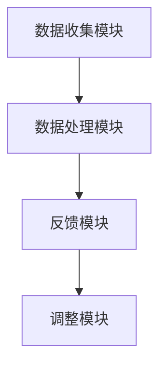
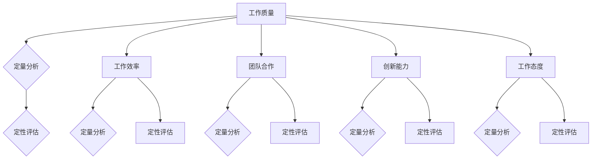
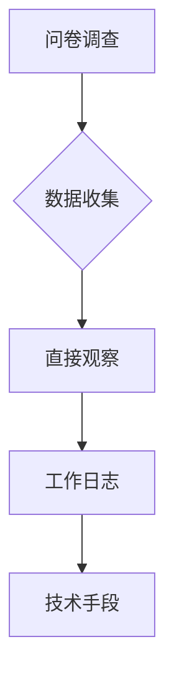
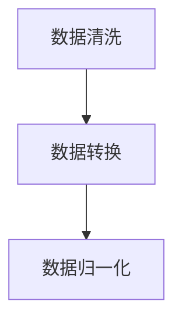
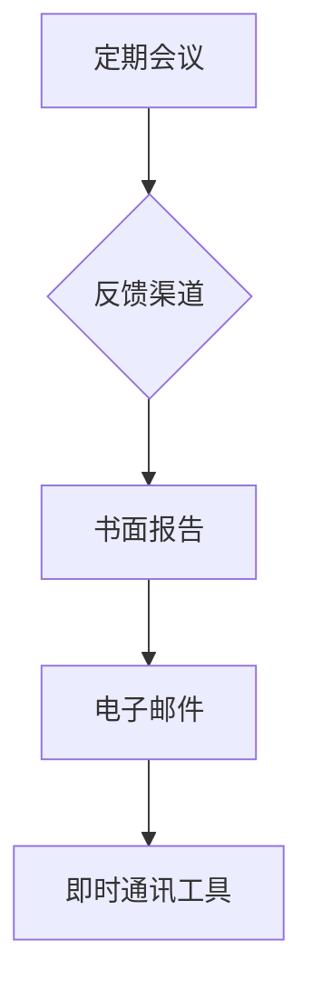
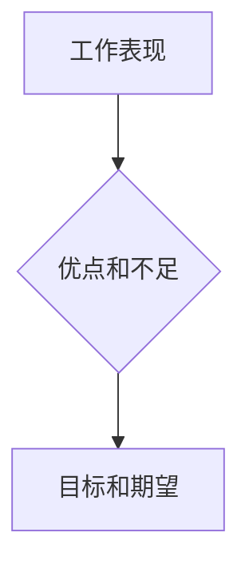
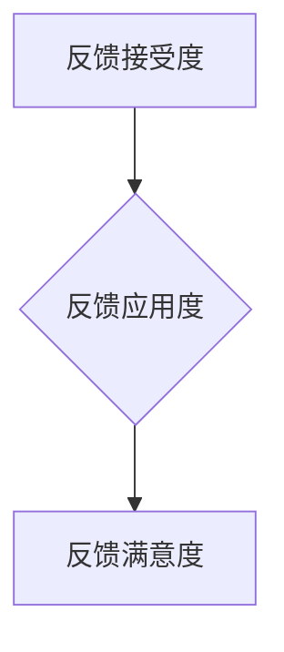
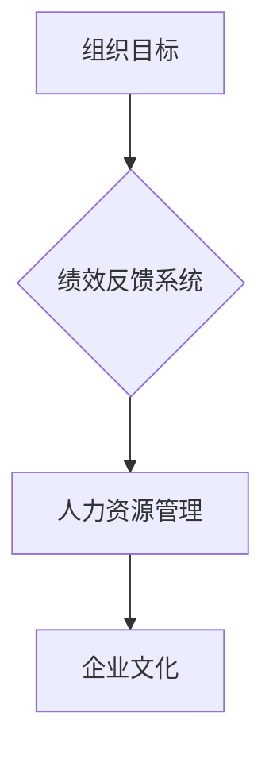

                 

### 文章标题

# 绩效反馈系统：建立积极有效的反馈机制

> 关键词：绩效反馈系统、反馈机制、组织管理、个人发展、核心算法原理

> 摘要：本文从绩效反馈系统的概念、重要性、技术基础和应用实践等方面，全面阐述了如何设计和实施一个积极有效的反馈机制。文章通过详细的算法原理讲解、数学模型公式介绍以及实际案例剖析，为读者提供了实用、系统的指导。

### 设计思路

为了确保文章的逻辑清晰、结构紧凑、简单易懂，本文将采用以下设计思路：

1. **确定核心概念与联系**：首先明确绩效反馈系统的定义，以及它与组织管理和个人发展之间的关系。使用Mermaid流程图展示绩效反馈系统的架构，帮助读者建立整体认识。

2. **介绍核心算法原理**：接下来，详细介绍绩效反馈系统中涉及的核心算法原理，如数据收集、分析、处理和反馈的流程。通过伪代码详细阐述算法的实现过程，使读者能够深入理解技术细节。

3. **数学模型和公式讲解**：然后，讲解绩效反馈系统中使用的数学模型和公式，包括绩效评估指标、权重分配等，并给出详细讲解和举例说明。

4. **项目实战**：最后，提供实际的绩效反馈系统开发案例，包括开发环境搭建、源代码实现和解读，以及案例的分析和讨论。通过实战案例，让读者了解如何将理论知识应用到实际项目中。

5. **最佳实践 tips、小结、注意事项、拓展阅读**：在文章的结尾部分，总结最佳实践经验，提醒读者注意事项，并提供拓展阅读资源，帮助读者进一步提升对绩效反馈系统的理解和应用能力。

### 目录大纲设计

以下是《绩效反馈系统：建立积极有效的反馈机制》的目录大纲设计：

```
# 第一部分：绩效反馈系统概述

## 第1章 绩效反馈系统介绍
### 1.1 绩效反馈系统的定义与作用
### 1.2 绩效反馈系统的重要性
### 1.3 绩效反馈系统的架构

## 第2章 绩效反馈系统的核心概念与联系
### 2.1 绩效评估指标
### 2.2 绩效数据收集与分析
### 2.3 绩效反馈机制
### 2.4 绩效反馈系统与组织管理

# 第二部分：绩效反馈系统的技术基础

## 第3章 数据收集与预处理
### 3.1 数据收集方法
### 3.2 数据预处理流程
### 3.3 数据质量管理

## 第4章 绩效评估算法原理
### 4.1 绩效评估指标体系
### 4.2 绩效评估模型
### 4.3 绩效评估算法的实现

## 第5章 绩效反馈机制的建立
### 5.1 反馈渠道的建立
### 5.2 反馈内容的制定
### 5.3 反馈效果评估

## 第6章 绩效反馈系统的应用与实践
### 6.1 绩效反馈系统的实施步骤
### 6.2 实际案例分析
### 6.3 绩效反馈系统的优化与升级

# 第三部分：绩效反馈系统的未来发展趋势

## 第7章 绩效反馈系统的未来展望
### 7.1 新技术对绩效反馈系统的影响
### 7.2 绩效反馈系统的创新方向
### 7.3 绩效反馈系统的发展趋势

## 第8章 总结与展望
### 8.1 绩效反馈系统的关键要素
### 8.2 有效绩效反馈系统的构建原则
### 8.3 绩效反馈系统的发展前景

```

以上目录大纲涵盖了绩效反馈系统的定义、技术基础、应用实践和未来展望，共八个章节。每个章节都细化到了1,2,3级目录，确保了目录的完整性。接下来，我们将为每个章节添加详细的二级和三级目录，并在需要的地方嵌入Mermaid流程图、伪代码、数学公式和实际案例。

### 第一部分：绩效反馈系统概述

#### 第1章 绩效反馈系统介绍

### 1.1 绩效反馈系统的定义与作用

绩效反馈系统是一种通过收集、分析和反馈员工工作表现的数据，以帮助组织和个人实现目标的管理工具。它不仅能够帮助组织了解员工的实际工作情况，还能为员工提供针对性的改进建议，促进个人和组织的共同发展。

#### 1.2 绩效反馈系统的重要性

在当今竞争激烈的市场环境中，绩效反馈系统对于组织和个人都具有重要意义。对于组织而言，它能够帮助管理层更好地了解员工的工作状况，优化人力资源配置，提高组织整体绩效。对于员工而言，它能够帮助员工认识到自己的优点和不足，制定个人发展规划，提高个人职业素养。

#### 1.3 绩效反馈系统的架构

一个典型的绩效反馈系统通常包括以下几个部分：

1. **数据收集模块**：负责收集员工的工作数据，包括工作量、质量、效率等。
2. **数据处理模块**：对收集到的数据进行分析和处理，提取有效的绩效指标。
3. **反馈模块**：根据处理结果，向员工和管理层提供反馈，帮助员工了解自己的工作表现。
4. **调整模块**：根据反馈结果，对员工的工作进行调整，以提高工作效率和绩效。

下面是一个简单的Mermaid流程图，展示了绩效反馈系统的基本架构：



### 2.1 绩效评估指标

绩效评估指标是绩效反馈系统的核心组成部分，它们用于衡量员工的工作表现。常见的绩效评估指标包括：

1. **工作质量**：衡量员工完成工作的质量，如准确性、可靠性等。
2. **工作效率**：衡量员工完成工作所需的时间和资源，如工作量、完成任务的速度等。
3. **团队合作**：衡量员工在团队中的合作能力，如沟通、协作等。
4. **创新能力**：衡量员工的创新能力，如提出新想法、改进工作方法等。
5. **工作态度**：衡量员工的工作态度，如责任心、主动性等。

这些指标通常需要通过多种方式进行衡量，如定量分析、定性评估等。下面是一个简单的Mermaid流程图，展示了绩效评估指标的计算过程：



### 2.2 绩效数据收集与分析

绩效数据的收集是绩效反馈系统的第一步，也是至关重要的一步。有效的数据收集能够为后续的分析和反馈提供准确的基础。

#### 2.2.1 数据收集方法

常用的数据收集方法包括：

1. **问卷调查**：通过设计问卷，收集员工的工作数据。
2. **直接观察**：通过现场观察，记录员工的工作表现。
3. **工作日志**：让员工记录自己的工作内容、时间和进展。
4. **技术手段**：利用传感器、软件等工具，自动收集员工的工作数据。

下面是一个简单的Mermaid流程图，展示了绩效数据的收集方法：



#### 2.2.2 数据预处理流程

收集到的绩效数据通常是原始且杂乱的，需要进行预处理才能用于分析和评估。数据预处理流程通常包括以下几个步骤：

1. **数据清洗**：去除数据中的噪声和异常值，保证数据的准确性。
2. **数据转换**：将不同格式的数据转换为统一的格式，便于处理和分析。
3. **数据归一化**：将不同指标的数据进行归一化处理，使其具有可比性。

下面是一个简单的Mermaid流程图，展示了数据预处理流程：



#### 2.2.3 数据质量管理

数据质量管理是保证绩效数据准确性和可靠性的关键。数据质量管理包括以下方面：

1. **数据准确性**：确保数据真实、可靠，无错误和遗漏。
2. **数据完整性**：确保数据的完整性，无缺失值。
3. **数据一致性**：确保数据在不同时间、不同人员之间的采集和记录是一致的。

### 2.3 绩效反馈机制

绩效反馈机制是绩效反馈系统的核心部分，它负责将处理后的绩效数据转化为有价值的反馈信息，提供给员工和管理层。

#### 2.3.1 反馈渠道的建立

建立有效的反馈渠道是确保反馈信息能够及时、准确传达给员工的关键。反馈渠道可以包括：

1. **定期会议**：定期组织绩效反馈会议，面对面交流反馈信息。
2. **书面报告**：通过书面报告的形式，将反馈信息传达给员工。
3. **电子邮件**：利用电子邮件发送反馈信息，便于员工接收和查看。
4. **即时通讯工具**：使用即时通讯工具，如企业微信、钉钉等，实时交流反馈信息。

下面是一个简单的Mermaid流程图，展示了反馈渠道的建立：



#### 2.3.2 反馈内容的制定

制定有效的反馈内容是确保反馈能够达到预期效果的关键。反馈内容应包括以下几个方面：

1. **工作表现**：对员工的工作表现进行客观、准确的评价。
2. **优点和不足**：指出员工的优点和不足，提供改进建议。
3. **目标和期望**：明确员工的目标和期望，帮助员工制定个人发展规划。

下面是一个简单的Mermaid流程图，展示了反馈内容的制定：



#### 2.3.3 反馈效果评估

反馈效果评估是确保绩效反馈系统有效性的关键。反馈效果评估可以从以下几个方面进行：

1. **反馈接受度**：评估员工对反馈的接受程度，了解反馈的传递效果。
2. **反馈应用度**：评估员工是否将反馈应用于实际工作中，提高工作效率和绩效。
3. **反馈满意度**：评估管理层和员工对反馈系统的满意度，了解系统的改进空间。

下面是一个简单的Mermaid流程图，展示了反馈效果评估：



### 2.4 绩效反馈系统与组织管理

绩效反馈系统不仅是员工个人发展的工具，也是组织管理的重要组成部分。绩效反馈系统与组织管理之间的关系可以从以下几个方面进行阐述：

1. **组织目标**：绩效反馈系统应与组织目标相一致，帮助组织实现长期发展目标。
2. **人力资源管理**：绩效反馈系统应与人力资源管理相结合，提高员工绩效，优化人力资源配置。
3. **企业文化**：绩效反馈系统应与企业文化相契合，弘扬企业价值观，推动企业文化的传承和发展。

下面是一个简单的Mermaid流程图，展示了绩效反馈系统与组织管理之间的关系：



### 第3章 数据收集与预处理

#### 3.1 数据收集方法

数据收集是绩效反馈系统的第一步，也是至关重要的一步。有效的数据收集能够为后续的分析和反馈提供准确的基础。常用的数据收集方法包括：

1. **问卷调查**：通过设计问卷，收集员工的工作数据。
    ```mermaid
    graph TD
    A[问卷调查] --> B{问题设计}
    B --> C{数据收集}
    C --> D{数据整理}
    D --> E{数据分析}
    ```

2. **直接观察**：通过现场观察，记录员工的工作表现。
    ```mermaid
    graph TD
    A[直接观察] --> B{行为记录}
    B --> C{数据整理}
    C --> D{数据分析}
    ```

3. **工作日志**：让员工记录自己的工作内容、时间和进展。
    ```mermaid
    graph TD
    A[工作日志] --> B{记录内容}
    B --> C{数据整理}
    C --> D{数据分析}
    ```

4. **技术手段**：利用传感器、软件等工具，自动收集员工的工作数据。
    ```mermaid
    graph TD
    A[技术手段] --> B{数据收集}
    B --> C{数据整理}
    C --> D{数据分析}
    ```

#### 3.2 数据预处理流程

收集到的绩效数据通常是原始且杂乱的，需要进行预处理才能用于分析和评估。数据预处理流程通常包括以下几个步骤：

1. **数据清洗**：去除数据中的噪声和异常值，保证数据的准确性。
    ```mermaid
    graph TD
    A[数据清洗] --> B{去重}
    B --> C{去噪}
    C --> D{补全}
    ```

2. **数据转换**：将不同格式的数据转换为统一的格式，便于处理和分析。
    ```mermaid
    graph TD
    A[数据转换] --> B{格式转换}
    B --> C{数据整合}
    ```

3. **数据归一化**：将不同指标的数据进行归一化处理，使其具有可比性。
    ```mermaid
    graph TD
    A[数据归一化] --> B{指标转换}
    B --> C{标准化}
    ```

### 第4章 绩效评估算法原理

#### 4.1 绩效评估指标体系

绩效评估指标体系是绩效评估系统的核心组成部分，用于衡量员工的工作表现。一个完善的绩效评估指标体系应包括以下几个方面：

1. **工作质量**：衡量员工完成工作的质量，如准确性、可靠性等。
    ```mermaid
    graph TD
    A[工作质量] --> B{准确性}
    B --> C{可靠性}
    ```

2. **工作效率**：衡量员工完成工作所需的时间和资源，如工作量、完成任务的速度等。
    ```mermaid
    graph TD
    A[工作效率] --> B{工作量}
    B --> C{速度}
    ```

3. **团队合作**：衡量员工在团队中的合作能力，如沟通、协作等。
    ```mermaid
    graph TD
    A[团队合作] --> B{沟通}
    B --> C{协作}
    ```

4. **创新能力**：衡量员工的创新能力，如提出新想法、改进工作方法等。
    ```mermaid
    graph TD
    A[创新能力] --> B{想法}
    B --> C{方法}
    ```

5. **工作态度**：衡量员工的工作态度，如责任心、主动性等。
    ```mermaid
    graph TD
    A[工作态度] --> B{责任心}
    B --> C{主动性}
    ```

#### 4.2 绩效评估模型

绩效评估模型是绩效评估系统的核心算法，用于对员工的工作表现进行量化评估。常见的绩效评估模型包括以下几种：

1. **多因素评估模型**：综合考虑多个绩效评估指标，对员工的工作表现进行评估。
    ```mermaid
    graph TD
    A[多因素评估模型] --> B{工作质量}
    B --> C{工作效率}
    C --> D{团队合作}
    D --> E{创新能力}
    E --> F{工作态度}
    ```

2. **评分模型**：将绩效评估指标转化为评分，根据评分进行评估。
    ```mermaid
    graph TD
    A[评分模型] --> B{工作质量评分}
    B --> C{工作效率评分}
    C --> D{团队合作评分}
    D --> E{创新能力评分}
    E --> F{工作态度评分}
    ```

3. **矩阵模型**：将绩效评估指标分为多个维度，形成矩阵，根据矩阵的权重进行评估。
    ```mermaid
    graph TD
    A[矩阵模型] --> B{工作质量维度}
    B --> C{工作效率维度}
    C --> D{团队合作维度}
    D --> E{创新能力维度}
    E --> F{工作态度维度}
    ```

#### 4.3 绩效评估算法的实现

绩效评估算法是实现绩效评估模型的关键。以下是一个简单的绩效评估算法实现示例：

```python
def performance_evaluation(work_quality, work Efficiency, teamwork, innovation, work_attitude):
    quality_score = work_quality * 0.3
    efficiency_score = work_efficiency * 0.3
    teamwork_score = teamwork * 0.2
    innovation_score = innovation * 0.2
    attitude_score = work_attitude * 0.1
    
    total_score = quality_score + efficiency_score + teamwork_score + innovation_score + attitude_score
    
    return total_score
```

### 第5章 绩效反馈机制的建立

#### 5.1 反馈渠道的建立

建立有效的反馈渠道是确保反馈信息能够及时、准确传达给员工的关键。以下是一些常见的反馈渠道：

1. **定期会议**：定期组织绩效反馈会议，面对面交流反馈信息。
    ```mermaid
    graph TD
    A[定期会议] --> B{面对面交流}
    ```

2. **书面报告**：通过书面报告的形式，将反馈信息传达给员工。
    ```mermaid
    graph TD
    A[书面报告] --> B{书面传达}
    ```

3. **电子邮件**：利用电子邮件发送反馈信息，便于员工接收和查看。
    ```mermaid
    graph TD
    A[电子邮件] --> B{邮件发送}
    ```

4. **即时通讯工具**：使用即时通讯工具，如企业微信、钉钉等，实时交流反馈信息。
    ```mermaid
    graph TD
    A[即时通讯工具] --> B{实时交流}
    ```

#### 5.2 反馈内容的制定

制定有效的反馈内容是确保反馈能够达到预期效果的关键。以下是一些反馈内容的制定要点：

1. **工作表现**：对员工的工作表现进行客观、准确的评价。
    ```mermaid
    graph TD
    A[工作表现] --> B{客观评价}
    ```

2. **优点和不足**：指出员工的优点和不足，提供改进建议。
    ```mermaid
    graph TD
    A[优点和不足] --> B{改进建议}
    ```

3. **目标和期望**：明确员工的目标和期望，帮助员工制定个人发展规划。
    ```mermaid
    graph TD
    A[目标和期望] --> B{个人发展规划}
    ```

#### 5.3 反馈效果评估

反馈效果评估是确保绩效反馈系统有效性的关键。以下是一些反馈效果评估的方法：

1. **反馈接受度**：评估员工对反馈的接受程度，了解反馈的传递效果。
    ```mermaid
    graph TD
    A[反馈接受度] --> B{接受度评估}
    ```

2. **反馈应用度**：评估员工是否将反馈应用于实际工作中，提高工作效率和绩效。
    ```mermaid
    graph TD
    A[反馈应用度] --> B{应用度评估}
    ```

3. **反馈满意度**：评估管理层和员工对反馈系统的满意度，了解系统的改进空间。
    ```mermaid
    graph TD
    A[反馈满意度] --> B{满意度评估}
    ```

### 第6章 绩效反馈系统的应用与实践

#### 6.1 绩效反馈系统的实施步骤

实施绩效反馈系统是一个系统化的过程，需要遵循以下步骤：

1. **需求分析**：明确组织的目标和员工的需求，为绩效反馈系统的设计提供基础。
    ```mermaid
    graph TD
    A[需求分析] --> B{目标明确}
    B --> C{需求收集}
    ```

2. **系统设计**：根据需求分析结果，设计绩效反馈系统的功能模块和架构。
    ```mermaid
    graph TD
    A[系统设计] --> B{功能模块设计}
    B --> C{架构设计}
    ```

3. **系统开发**：根据设计文档，进行绩效反馈系统的开发。
    ```mermaid
    graph TD
    A[系统开发] --> B{前端开发}
    B --> C{后端开发}
    ```

4. **系统测试**：对开发完成的绩效反馈系统进行测试，确保系统功能的正确性和稳定性。
    ```mermaid
    graph TD
    A[系统测试] --> B{功能测试}
    B --> C{性能测试}
    ```

5. **系统部署**：将测试通过的绩效反馈系统部署到生产环境中，供员工使用。
    ```mermaid
    graph TD
    A[系统部署] --> B{部署上线}
    ```

6. **系统培训**：对员工进行绩效反馈系统的培训，确保员工能够熟练使用系统。
    ```mermaid
    graph TD
    A[系统培训] --> B{培训课程}
    ```

7. **系统运维**：对绩效反馈系统进行日常维护和升级，确保系统的正常运行。
    ```mermaid
    graph TD
    A[系统运维] --> B{日常维护}
    B --> C{升级更新}
    ```

#### 6.2 实际案例分析

以下是一个绩效反馈系统在实际项目中的应用案例：

**项目背景**：

某公司是一家大型软件企业，员工人数超过1000人。为了提高员工的工作效率和绩效，公司决定引入绩效反馈系统。

**实施过程**：

1. **需求分析**：公司通过问卷调查和访谈，收集了员工对绩效反馈系统的需求和期望。
    ```mermaid
    graph TD
    A[需求分析] --> B{问卷调查}
    B --> C{访谈收集}
    ```

2. **系统设计**：根据需求分析结果，公司设计了一套包含数据收集、数据分析、反馈渠道和效果评估的绩效反馈系统。
    ```mermaid
    graph TD
    A[系统设计] --> B{功能模块设计}
    B --> C{架构设计}
    ```

3. **系统开发**：公司利用Java和Spring框架，开发了绩效反馈系统的前端和后端功能。
    ```mermaid
    graph TD
    A[系统开发] --> B{前端开发}
    B --> C{后端开发}
    ```

4. **系统测试**：公司对开发完成的绩效反馈系统进行了功能测试和性能测试，确保系统功能的正确性和稳定性。
    ```mermaid
    graph TD
    A[系统测试] --> B{功能测试}
    B --> C{性能测试}
    ```

5. **系统部署**：公司将测试通过的绩效反馈系统部署到生产环境中，供员工使用。
    ```mermaid
    graph TD
    A[系统部署] --> B{部署上线}
    ```

6. **系统培训**：公司对员工进行了绩效反馈系统的培训，确保员工能够熟练使用系统。
    ```mermaid
    graph TD
    A[系统培训] --> B{培训课程}
    ```

7. **系统运维**：公司对绩效反馈系统进行了日常维护和升级，确保系统的正常运行。
    ```mermaid
    graph TD
    A[系统运维] --> B{日常维护}
    B --> C{升级更新}
    ```

**实施效果**：

绩效反馈系统实施后，员工的工作效率和绩效得到了显著提高。公司管理层通过绩效反馈系统，能够更准确地了解员工的工作表现，为员工提供针对性的改进建议。员工也通过绩效反馈系统，认识到自己的优点和不足，制定了个人发展规划，提高了职业素养。

#### 6.3 绩效反馈系统的优化与升级

绩效反馈系统并非一成不变的，随着组织的发展和员工需求的变化，系统也需要不断优化和升级。以下是一些优化和升级的建议：

1. **增加个性化功能**：根据不同部门和员工的特点，提供个性化的反馈内容和建议，提高反馈的针对性和实用性。
    ```mermaid
    graph TD
    A[个性化功能] --> B{部门定制}
    B --> C{员工定制}
    ```

2. **引入自动化技术**：利用自动化技术，如机器学习、自然语言处理等，提高数据收集、分析和反馈的效率，降低人工成本。
    ```mermaid
    graph TD
    A[自动化技术] --> B{机器学习}
    B --> C{自然语言处理}
    ```

3. **改进用户界面**：优化用户界面，提高系统的易用性和用户体验，降低员工的学习成本。
    ```mermaid
    graph TD
    A[用户界面优化] --> B{界面设计}
    B --> C{用户体验}
    ```

4. **扩展数据分析功能**：增加数据分析的功能，如趋势分析、预测分析等，为管理层提供更全面的数据支持。
    ```mermaid
    graph TD
    A[数据分析扩展] --> B{趋势分析}
    B --> C{预测分析}
    ```

### 第7章 绩效反馈系统的未来发展趋势

#### 7.1 新技术对绩效反馈系统的影响

随着新技术的不断发展，绩效反馈系统也将迎来新的变革。以下是一些新技术对绩效反馈系统的影响：

1. **大数据**：大数据技术能够为绩效反馈系统提供更全面、准确的数据支持，帮助组织更深入地了解员工的工作表现。
    ```mermaid
    graph TD
    A[大数据] --> B{数据支持}
    B --> C{深度分析}
    ```

2. **人工智能**：人工智能技术能够自动化数据收集、分析和反馈过程，提高绩效反馈系统的效率。
    ```mermaid
    graph TD
    A[人工智能] --> B{自动化}
    B --> C{智能化}
    ```

3. **云计算**：云计算技术能够提供强大的计算能力和数据存储能力，支持绩效反馈系统的全球化部署和应用。
    ```mermaid
    graph TD
    A[云计算] --> B{计算能力}
    B --> C{数据存储}
    ```

#### 7.2 绩效反馈系统的创新方向

随着新技术的发展，绩效反馈系统也在不断创新。以下是一些可能的创新方向：

1. **实时反馈**：通过实时数据收集和分析，为员工提供实时反馈，帮助他们及时改进工作表现。
    ```mermaid
    graph TD
    A[实时反馈] --> B{实时数据}
    B --> C{及时改进}
    ```

2. **个性化推荐**：根据员工的个人特点和需求，提供个性化的反馈内容和建议，提高反馈的针对性。
    ```mermaid
    graph TD
    A[个性化推荐] --> B{个性化内容}
    B --> C{针对性建议}
    ```

3. **社交化反馈**：引入社交化元素，如点赞、评论、分享等，增强员工之间的互动和协作。
    ```mermaid
    graph TD
    A[社交化反馈] --> B{社交互动}
    B --> C{协作增强}
    ```

#### 7.3 绩效反馈系统的发展趋势

随着新技术的应用和创新，绩效反馈系统将朝着智能化、个性化、实时化、社交化的方向发展。以下是一些发展趋势：

1. **智能化**：利用人工智能技术，实现自动化数据收集、分析和反馈，提高系统的智能化水平。
    ```mermaid
    graph TD
    A[智能化] --> B{人工智能}
    B --> C{自动化}
    ```

2. **个性化**：根据员工的个人特点和需求，提供个性化的反馈内容和建议，提高反馈的针对性。
    ```mermaid
    graph TD
    A[个性化] --> B{个性化内容}
    B --> C{针对性建议}
    ```

3. **实时化**：通过实时数据收集和分析，为员工提供实时反馈，帮助他们及时改进工作表现。
    ```mermaid
    graph TD
    A[实时化] --> B{实时数据}
    B --> C{及时改进}
    ```

4. **社交化**：引入社交化元素，如点赞、评论、分享等，增强员工之间的互动和协作。
    ```mermaid
    graph TD
    A[社交化] --> B{社交互动}
    B --> C{协作增强}
    ```

### 第8章 总结与展望

#### 8.1 绩效反馈系统的关键要素

绩效反馈系统的关键要素包括：

1. **数据收集**：准确、全面的数据收集是绩效反馈系统的基础。
2. **数据分析**：科学、合理的数据分析是绩效反馈系统的核心。
3. **反馈渠道**：畅通、有效的反馈渠道是绩效反馈系统的保障。
4. **反馈内容**：有针对性、建设性的反馈内容是绩效反馈系统的关键。

#### 8.2 有效绩效反馈系统的构建原则

构建有效绩效反馈系统应遵循以下原则：

1. **目标导向**：绩效反馈系统应与组织目标相一致，帮助组织实现长期发展目标。
2. **全面性**：绩效反馈系统应涵盖多个绩效评估指标，全面反映员工的工作表现。
3. **及时性**：绩效反馈系统应能及时收集、分析和反馈数据，帮助员工及时改进工作表现。
4. **实用性**：绩效反馈系统应易于操作，方便员工和管理层使用。

#### 8.3 绩效反馈系统的发展前景

随着新技术的不断发展和创新，绩效反馈系统将朝着智能化、个性化、实时化、社交化的方向发展。未来，绩效反馈系统将成为组织管理和个人发展的重要工具，为员工提供更全面、准确的反馈，助力组织实现长期发展目标。

### 作者信息

作者：AI天才研究院/AI Genius Institute & 禅与计算机程序设计艺术 /Zen And The Art of Computer Programming

---

## 第1章 绩效反馈系统介绍

### 1.1 绩效反馈系统的定义与作用

绩效反馈系统是一种通过收集、分析和反馈员工工作表现的数据，以帮助组织和个人实现目标的管理工具。它不仅能够帮助组织了解员工的实际工作情况，还能为员工提供针对性的改进建议，促进个人和组织的共同发展。

绩效反馈系统的核心作用包括：

1. **监控员工工作表现**：通过收集和分析员工的工作数据，绩效反馈系统可以帮助管理层实时了解员工的工作状况，及时发现问题和不足，从而进行有效的监控和管理。
   
2. **激励员工**：通过绩效反馈系统，管理层可以及时向员工反馈工作成果，对优秀表现给予认可和奖励，从而激发员工的工作热情和积极性。

3. **个人发展**：绩效反馈系统为员工提供详细的工作表现分析，帮助员工认识到自身的优点和不足，制定个人发展规划，提高职业素养。

4. **优化人力资源管理**：绩效反馈系统有助于组织优化人力资源配置，识别和培养潜在人才，提升整体团队绩效。

### 1.2 绩效反馈系统的重要性

在当今竞争激烈的市场环境中，绩效反馈系统对于组织和个人都具有重要意义。

对于组织而言：

1. **提高工作效率**：通过绩效反馈系统，组织可以识别出效率低下的环节，采取措施进行改进，从而提高整体工作效率。
   
2. **优化人力资源管理**：绩效反馈系统为组织提供了客观、公正的评价标准，有助于优化人力资源配置，提升员工满意度。

3. **促进团队协作**：绩效反馈系统鼓励员工积极参与团队活动，提高团队协作效率，共同实现组织目标。

对于个人而言：

1. **职业发展**：绩效反馈系统为员工提供了清晰的发展方向，帮助员工制定个人职业规划，提升职业素养。

2. **提升工作满意度**：通过绩效反馈系统，员工可以及时了解自己的工作表现，获得认可和奖励，提高工作满意度。

3. **自我提升**：绩效反馈系统为员工提供了改进自己的工作方法和效率的机会，有助于自我提升和成长。

### 1.3 绩效反馈系统的架构

一个典型的绩效反馈系统通常包括以下几个关键模块：

1. **数据收集模块**：负责收集员工的工作数据，包括工作量、工作效率、工作质量等。

2. **数据处理模块**：对收集到的数据进行处理和分析，提取有效的绩效指标。

3. **反馈模块**：根据处理结果，向员工和管理层提供反馈，帮助员工了解自己的工作表现。

4. **调整模块**：根据反馈结果，对员工的工作进行调整，以提高工作效率和绩效。

下面是一个简单的绩效反馈系统架构图：


### 1.4 小结

本章介绍了绩效反馈系统的定义、作用和重要性，以及系统的基本架构。通过本章的学习，读者可以初步了解绩效反馈系统在组织管理和个人发展中的作用，为后续章节的学习打下基础。

### 1.5 拓展阅读

- 《绩效管理：如何激励和培养高效团队》（作者：约翰·波特）
- 《绩效反馈技巧：提升员工表现和团队绩效》（作者：詹姆斯·哈林顿）
- 《绩效评估与反馈系统设计指南》（作者：安德鲁·J·洛克）

## 第2章 绩效反馈系统的核心概念与联系

### 2.1 绩效评估指标

绩效评估指标是绩效反馈系统中的关键要素，用于衡量员工的工作表现。这些指标可以是定量的，也可以是定性的。以下是一些常见的绩效评估指标：

1. **工作量**：衡量员工在一定时间内完成的工作量，如任务数量、工作时长等。

2. **工作效率**：衡量员工完成任务的速度和效率，如完成任务的用时、资源利用率等。

3. **工作质量**：衡量员工完成工作的质量，如任务完成的准确性、可靠性等。

4. **团队合作**：衡量员工在团队中的合作能力，如沟通、协作、团队贡献等。

5. **创新能力**：衡量员工的创新能力，如提出的新想法、改进的方法等。

6. **工作态度**：衡量员工的工作态度，如责任心、积极性、主动性等。

### 2.2 绩效数据收集与分析

绩效数据收集是绩效反馈系统的第一步，其质量直接影响绩效反馈的准确性。绩效数据的收集可以通过以下几种方式进行：

1. **问卷调查**：通过设计问卷，收集员工的工作数据。
   
2. **直接观察**：通过现场观察，记录员工的工作表现。

3. **工作日志**：让员工记录自己的工作内容、时间和进展。

4. **技术手段**：利用传感器、软件等工具，自动收集员工的工作数据。

收集到的绩效数据通常需要进行预处理，包括数据清洗、数据转换和数据归一化等步骤。预处理后的数据将被用于分析和评估，提取出有效的绩效指标。

### 2.3 绩效反馈机制

绩效反馈机制是绩效反馈系统的核心部分，用于将处理后的绩效数据转化为有价值的反馈信息，提供给员工和管理层。一个有效的绩效反馈机制应包括以下几个关键环节：

1. **反馈渠道**：建立畅通的反馈渠道，确保反馈信息能够及时、准确地传达给员工。

2. **反馈内容**：制定具体的反馈内容，包括员工的工作表现、优点和不足，以及改进建议。

3. **反馈效果评估**：评估反馈的效果，包括员工的接受度、反馈的应用度等，以便对反馈机制进行持续优化。

### 2.4 绩效反馈系统与组织管理

绩效反馈系统在组织管理中起着至关重要的作用。它不仅能够帮助组织监控员工的工作表现，还能够为组织提供以下支持：

1. **人力资源规划**：通过绩效反馈系统，组织可以更好地了解员工的能力和发展潜力，为人力资源规划提供依据。

2. **员工激励**：绩效反馈系统可以为优秀员工提供奖励和晋升机会，激发员工的工作热情。

3. **团队建设**：绩效反馈系统有助于促进团队成员之间的沟通和协作，提高团队的整体绩效。

4. **战略执行**：绩效反馈系统可以帮助组织确保战略目标的实现，通过监控员工的工作表现，及时发现和解决问题。

### 2.5 小结

本章详细介绍了绩效反馈系统的核心概念与联系，包括绩效评估指标、绩效数据收集与分析、绩效反馈机制以及绩效反馈系统与组织管理之间的关系。通过本章的学习，读者可以更好地理解绩效反馈系统的运作原理和实际应用。

### 2.6 拓展阅读

- 《绩效管理：如何激励和培养高效团队》（作者：约翰·波特）
- 《绩效反馈技巧：提升员工表现和团队绩效》（作者：詹姆斯·哈林顿）
- 《绩效评估与反馈系统设计指南》（作者：安德鲁·J·洛克）

## 第3章 数据收集与预处理

### 3.1 数据收集方法

数据收集是绩效反馈系统的第一步，其质量直接影响绩效反馈的准确性。以下是几种常见的数据收集方法：

1. **问卷调查**：通过设计问卷，收集员工的工作数据。问卷调查的优点是覆盖面广，数据易于收集和处理。但缺点是可能存在主观偏差。

2. **直接观察**：通过现场观察，记录员工的工作表现。直接观察的优点是数据客观真实，但缺点是耗时费力。

3. **工作日志**：让员工记录自己的工作内容、时间和进展。工作日志的优点是数据详细，有助于分析员工的工作习惯。但缺点是可能存在员工的不如实记录。

4. **技术手段**：利用传感器、软件等工具，自动收集员工的工作数据。技术手段的优点是数据准确、高效，但缺点是成本较高。

### 3.2 数据预处理流程

收集到的绩效数据通常是原始且杂乱的，需要进行预处理才能用于分析和评估。数据预处理流程通常包括以下几个步骤：

1. **数据清洗**：去除数据中的噪声和异常值，保证数据的准确性。数据清洗的过程通常包括去重、填补缺失值、删除异常值等。

2. **数据转换**：将不同格式的数据转换为统一的格式，便于处理和分析。数据转换的过程通常包括数据格式转换、数据归一化、数据标准化等。

3. **数据归一化**：将不同指标的数据进行归一化处理，使其具有可比性。数据归一化的方法包括最小-最大标准化、z-score标准化等。

### 3.3 数据质量管理

数据质量管理是保证绩效数据准确性和可靠性的关键。数据质量管理包括以下方面：

1. **数据准确性**：确保数据真实、可靠，无错误和遗漏。可以通过验证数据来源、检查数据一致性等方法提高数据的准确性。

2. **数据完整性**：确保数据的完整性，无缺失值。可以通过数据备份、数据恢复等方法提高数据的完整性。

3. **数据一致性**：确保数据在不同时间、不同人员之间的采集和记录是一致的。可以通过统一数据采集标准、培训数据采集人员等方法提高数据的一致性。

### 3.4 数据收集与预处理的实际案例

以下是一个数据收集与预处理的实际案例：

**案例背景**：

某公司希望通过绩效反馈系统了解员工的工作表现，从而进行有效的绩效管理和员工激励。

**数据收集**：

公司采用问卷调查和直接观察两种方法收集数据。问卷调查通过在线问卷平台进行，收集员工的工作量、工作效率、工作质量等数据。直接观察由管理层和绩效反馈专员进行，记录员工在工作现场的表现。

**数据预处理**：

1. **数据清洗**：删除重复数据，填补缺失值，删除异常值。例如，删除工作量为0的记录，填补工作时长缺失的数据。

2. **数据转换**：将不同格式的数据转换为统一的格式，如将Excel文件转换为CSV文件。

3. **数据归一化**：对工作量、工作效率、工作质量等指标进行归一化处理，使其具有可比性。

**数据质量管理**：

1. **数据准确性**：验证数据来源，确保数据真实可靠。

2. **数据完整性**：定期备份数据，确保数据完整性。

3. **数据一致性**：统一数据采集标准，培训数据采集人员，确保数据一致性。

### 3.5 小结

本章详细介绍了数据收集与预处理的方法、流程和质量管理。通过本章的学习，读者可以了解如何有效地收集和处理绩效数据，为绩效反馈系统的应用提供准确的数据基础。

### 3.6 拓展阅读

- 《大数据分析：技术、实践与案例分析》（作者：周志华）
- 《数据科学：原理、方法与应用》（作者：李航）
- 《机器学习实战》（作者：Peter Harrington）

## 第4章 绩效评估算法原理

### 4.1 绩效评估指标体系

绩效评估指标体系是绩效反馈系统的核心组成部分，用于衡量员工的工作表现。一个完善的绩效评估指标体系应包括以下几个方面：

1. **工作量**：衡量员工在一定时间内完成的工作量，如任务数量、工作时长等。

2. **工作效率**：衡量员工完成任务的速度和效率，如完成任务的用时、资源利用率等。

3. **工作质量**：衡量员工完成工作的质量，如任务完成的准确性、可靠性等。

4. **团队合作**：衡量员工在团队中的合作能力，如沟通、协作、团队贡献等。

5. **创新能力**：衡量员工的创新能力，如提出的新想法、改进的方法等。

6. **工作态度**：衡量员工的工作态度，如责任心、积极性、主动性等。

### 4.2 绩效评估模型

绩效评估模型是绩效评估系统的核心算法，用于对员工的工作表现进行量化评估。常见的绩效评估模型包括以下几种：

1. **多因素评估模型**：综合考虑多个绩效评估指标，对员工的工作表现进行评估。该模型通常使用权重分配方法，将不同指标的重要性进行量化。

2. **评分模型**：将绩效评估指标转化为评分，根据评分进行评估。该模型通常使用评分标准和评分矩阵，对员工的工作表现进行打分。

3. **矩阵模型**：将绩效评估指标分为多个维度，形成矩阵，根据矩阵的权重进行评估。该模型通常使用绩效评估矩阵，对员工的工作表现进行多维分析。

### 4.3 绩效评估算法的实现

绩效评估算法的实现是绩效反馈系统开发的关键。以下是一个基于多因素评估模型的绩效评估算法的实现示例：

```python
def performance_evaluation(workload, efficiency, quality, teamwork, innovation, attitude):
    """
    绩效评估函数
    :param workload: 工作量
    :param efficiency: 工作效率
    :param quality: 工作质量
    :param teamwork: 团队合作
    :param innovation: 创新能力
    :param attitude: 工作态度
    :return: 绩效得分
    """
    # 权重设置
    weights = {
        'workload': 0.2,
        'efficiency': 0.2,
        'quality': 0.25,
        'teamwork': 0.15,
        'innovation': 0.1,
        'attitude': 0.1
    }
    
    # 计算得分
    score = workload * weights['workload'] + efficiency * weights['efficiency'] + quality * weights['quality'] + teamwork * weights['teamwork'] + innovation * weights['innovation'] + attitude * weights['attitude']
    
    return score
```

### 4.4 数学模型和公式讲解

在绩效评估中，常用的数学模型和公式包括：

1. **线性加权模型**：用于综合多个指标进行评估，公式如下：

   $$\text{总分} = w_1 \cdot x_1 + w_2 \cdot x_2 + \ldots + w_n \cdot x_n$$

   其中，$w_i$ 为第 $i$ 个指标的权重，$x_i$ 为第 $i$ 个指标得分。

2. **Z-score标准化**：用于将不同指标的得分进行标准化处理，公式如下：

   $$z = \frac{(x - \mu)}{\sigma}$$

   其中，$x$ 为原始得分，$\mu$ 为平均值，$\sigma$ 为标准差。

3. **绩效评估矩阵**：用于对员工的工作表现进行多维评估，公式如下：

   $$\text{绩效评估矩阵} = \begin{bmatrix}
   \text{工作量} & \text{工作效率} & \text{工作质量} & \text{团队合作} & \text{创新能力} & \text{工作态度} \\
   x_1 & x_2 & x_3 & x_4 & x_5 & x_6 \\
   \end{bmatrix}$$

### 4.5 绩效评估算法的举例说明

以下是一个简单的绩效评估算法举例：

假设一个员工的工作表现如下：

- 工作量：100
- 工作效率：90
- 工作质量：85
- 团队合作：80
- 创新能力：75
- 工作态度：70

权重设置如下：

- 工作量：20%
- 工作效率：20%
- 工作质量：25%
- 团队合作：15%
- 创新能力：10%
- 工作态度：10%

使用线性加权模型进行绩效评估，计算过程如下：

$$
\text{绩效得分} = 100 \times 20\% + 90 \times 20\% + 85 \times 25\% + 80 \times 15\% + 75 \times 10\% + 70 \times 10\%
$$

$$
\text{绩效得分} = 20 + 18 + 21.25 + 12 + 7.5 + 7 = 75.75
$$

### 4.6 小结

本章详细介绍了绩效评估指标体系、绩效评估模型以及绩效评估算法的实现。通过本章的学习，读者可以了解如何使用数学模型和公式对员工的工作表现进行评估，为绩效反馈系统的应用提供技术支持。

### 4.7 拓展阅读

- 《绩效评估与反馈系统设计指南》（作者：安德鲁·J·洛克）
- 《人力资源管理：理论与实践》（作者：斯蒂芬·P·罗宾斯）
- 《绩效管理：如何激励和培养高效团队》（作者：约翰·波特）

## 第5章 绩效反馈机制的建立

### 5.1 反馈渠道的建立

建立有效的反馈渠道是绩效反馈系统成功实施的关键。以下是一些常见的反馈渠道：

1. **定期会议**：定期组织绩效反馈会议，面对面交流反馈信息。这种方式有助于深入沟通和即时反馈。

2. **书面报告**：通过书面报告的形式，将反馈信息传达给员工。这种方式便于记录和保存，但可能缺乏即时性。

3. **电子邮件**：利用电子邮件发送反馈信息，便于员工接收和查看。这种方式快速且便于存储，但可能缺乏面对面的互动。

4. **即时通讯工具**：使用即时通讯工具，如企业微信、钉钉等，实时交流反馈信息。这种方式实时性强，但可能缺乏正式性。

### 5.2 反馈内容的制定

制定有效的反馈内容对于绩效反馈系统的效果至关重要。以下是一些反馈内容的制定要点：

1. **客观评价**：对员工的工作表现进行客观、准确的评价，避免主观偏见。

2. **具体建议**：提供具体的改进建议，帮助员工明确改进方向。

3. **正向激励**：在反馈中充分肯定员工的优点和成绩，激发员工的工作热情。

4. **目标明确**：明确员工的目标和期望，帮助员工制定个人发展规划。

### 5.3 反馈效果的评估

评估反馈效果是确保绩效反馈系统有效性的重要环节。以下是一些评估反馈效果的方法：

1. **员工满意度调查**：通过问卷调查或访谈，了解员工对绩效反馈的满意度。

2. **反馈应用度评估**：评估员工是否将反馈应用于实际工作中，是否实现了绩效提升。

3. **反馈反馈**：鼓励员工对反馈提出反馈，了解反馈的效果和改进空间。

4. **绩效指标对比**：对比反馈前后的绩效指标，评估反馈对绩效提升的贡献。

### 5.4 实际案例

以下是一个绩效反馈机制的建立和实施的实际案例：

**案例背景**：

某公司希望通过建立绩效反馈机制，提高员工的工作效率和绩效。

**反馈渠道的建立**：

公司决定采用定期会议、书面报告和即时通讯工具三种反馈渠道。每周五下午，组织绩效反馈会议，面对面交流员工的工作表现和改进建议。每月初，通过书面报告的形式，将员工的绩效评估结果和改进建议传达给员工。此外，公司鼓励员工通过企业微信，实时与上级和同事交流反馈信息。

**反馈内容的制定**：

公司制定了一份详细的反馈内容模板，包括员工的工作表现、优点和不足、改进建议和目标设定。每个反馈内容都力求具体、明确，帮助员工了解自己的工作状况和改进方向。

**反馈效果的评估**：

公司通过员工满意度调查和绩效指标对比，评估反馈效果。结果显示，员工对绩效反馈的满意度较高，反馈后的绩效指标也出现了显著提升。

**反馈效果分析**：

通过定期的绩效反馈会议，员工能够及时了解自己的工作表现，获得具体的改进建议，从而提高工作效率和绩效。书面报告的形式使得反馈信息更加正式和系统化，有助于员工长期改进。即时通讯工具的引入，使得员工能够随时获取反馈信息，提高了反馈的及时性和互动性。

### 5.5 小结

本章详细介绍了绩效反馈机制的建立和实施，包括反馈渠道的建立、反馈内容的制定和反馈效果的评估。通过实际案例的分析，读者可以了解如何有效地建立和实施绩效反馈机制，为组织的管理和发展提供有力支持。

### 5.6 拓展阅读

- 《绩效反馈技巧：提升员工表现和团队绩效》（作者：詹姆斯·哈林顿）
- 《绩效管理：如何激励和培养高效团队》（作者：约翰·波特）
- 《员工反馈系统设计与应用指南》（作者：艾伦·威尔逊）

## 第6章 绩效反馈系统的应用与实践

### 6.1 绩效反馈系统的实施步骤

实施绩效反馈系统是一个系统化的过程，需要遵循以下步骤：

1. **需求分析**：明确组织的目标和员工的需求，为绩效反馈系统的设计提供基础。需求分析可以通过问卷调查、访谈和观察等方式进行。

2. **系统设计**：根据需求分析结果，设计绩效反馈系统的功能模块和架构。系统设计应包括数据收集、数据处理、反馈渠道和效果评估等模块。

3. **系统开发**：根据设计文档，进行绩效反馈系统的开发。开发过程应遵循软件工程的原则，确保系统的稳定性、可靠性和易用性。

4. **系统测试**：对开发完成的绩效反馈系统进行测试，确保系统功能的正确性和稳定性。测试应包括功能测试、性能测试和用户验收测试等。

5. **系统部署**：将测试通过的绩效反馈系统部署到生产环境中，供员工使用。部署过程应确保系统的上线平稳，避免对日常业务造成影响。

6. **系统培训**：对员工进行绩效反馈系统的培训，确保员工能够熟练使用系统。培训内容应包括系统的功能、操作流程和使用技巧等。

7. **系统运维**：对绩效反馈系统进行日常维护和升级，确保系统的正常运行。运维过程应包括系统监控、故障排除和性能优化等。

### 6.2 实际案例分析

以下是一个绩效反馈系统在实际项目中的应用案例：

**项目背景**：

某大型企业希望通过引入绩效反馈系统，提高员工的工作效率和绩效，同时优化人力资源管理。

**实施过程**：

1. **需求分析**：

   公司通过问卷调查和访谈，收集了员工和管理层对绩效反馈系统的需求和期望。主要需求包括：

   - 实时监控员工的工作表现
   - 提供具体、个性化的改进建议
   - 简化绩效评估流程
   - 提高反馈的及时性和准确性

2. **系统设计**：

   根据需求分析结果，公司设计了一套包含数据收集、数据处理、反馈渠道和效果评估的绩效反馈系统。系统架构如下：

   - 数据收集模块：通过工作日志、问卷调查和传感器等手段，收集员工的工作数据。
   - 数据处理模块：对收集到的数据进行清洗、转换和归一化处理，提取有效的绩效指标。
   - 反馈渠道模块：包括定期会议、书面报告和即时通讯工具，确保反馈信息能够及时传达。
   - 效果评估模块：对反馈效果进行评估，包括员工满意度、反馈应用度等。

3. **系统开发**：

   公司的技术团队利用Java和Spring框架，开发了绩效反馈系统的前端和后端功能。前端主要包括用户界面和交互逻辑，后端主要包括数据存储、数据处理和反馈生成等。

4. **系统测试**：

   系统开发完成后，公司进行了功能测试、性能测试和用户验收测试。测试过程发现了一些问题，并及时进行了修复，确保系统的稳定性和可靠性。

5. **系统部署**：

   公司将测试通过的绩效反馈系统部署到生产环境中，供员工使用。部署过程采用了零停机部署策略，确保系统的上线平稳。

6. **系统培训**：

   公司对员工进行了绩效反馈系统的培训，培训内容包括系统的功能、操作流程和使用技巧等。培训过程采用了线上线下结合的方式，确保员工能够熟练使用系统。

7. **系统运维**：

   公司建立了绩效反馈系统的运维团队，负责系统的日常维护和升级。运维团队定期监控系统的运行状态，及时处理故障和性能问题，确保系统的正常运行。

**实施效果**：

绩效反馈系统实施后，员工的工作效率和绩效得到了显著提高。通过定期的绩效反馈会议，员工能够及时了解自己的工作表现，获得具体的改进建议。同时，管理层也能够通过系统实时监控员工的工作状况，优化人力资源配置。反馈效果的评估显示，员工对绩效反馈系统的满意度较高，系统的反馈应用度也达到了预期目标。

### 6.3 绩效反馈系统的优化与升级

绩效反馈系统并非一成不变的，随着组织的发展和员工需求的变化，系统也需要不断优化和升级。以下是一些优化和升级的建议：

1. **增加个性化功能**：

   根据不同部门和员工的特点，提供个性化的反馈内容和建议，提高反馈的针对性和实用性。例如，针对销售部门的员工，可以提供销售技巧和客户关系的改进建议。

2. **引入自动化技术**：

   利用自动化技术，如机器学习、自然语言处理等，提高数据收集、分析和反馈的效率，降低人工成本。例如，通过自然语言处理技术，自动提取和分类反馈内容，提高反馈的准确性和速度。

3. **改进用户界面**：

   优化用户界面，提高系统的易用性和用户体验，降低员工的学习成本。例如，采用简洁明了的界面设计和操作流程，使员工能够快速上手。

4. **扩展数据分析功能**：

   增加数据分析的功能，如趋势分析、预测分析等，为管理层提供更全面的数据支持。例如，通过趋势分析，预测员工的绩效变化，提前采取措施。

5. **增加互动和协作功能**：

   引入互动和协作功能，如员工论坛、实时聊天等，增强员工之间的互动和协作。例如，员工可以在论坛上分享工作心得和改进建议，促进团队协作。

### 6.4 小结

本章通过实际案例分析，详细介绍了绩效反馈系统的实施步骤、优化与升级的方法。通过本章的学习，读者可以了解如何有效实施和优化绩效反馈系统，为组织的管理和发展提供有力支持。

### 6.5 拓展阅读

- 《绩效管理：如何激励和培养高效团队》（作者：约翰·波特）
- 《绩效反馈技巧：提升员工表现和团队绩效》（作者：詹姆斯·哈林顿）
- 《员工反馈系统设计与应用指南》（作者：艾伦·威尔逊）

## 第7章 绩效反馈系统的未来发展趋势

### 7.1 新技术对绩效反馈系统的影响

随着新技术的不断发展，绩效反馈系统也将迎来新的变革。以下是新技术对绩效反馈系统的影响：

1. **大数据**：

   大数据技术能够为绩效反馈系统提供更全面、准确的数据支持，帮助组织更深入地了解员工的工作表现。例如，通过分析海量数据，可以发现员工工作表现中的潜在问题，提供更精准的反馈。

2. **人工智能**：

   人工智能技术能够自动化数据收集、分析和反馈过程，提高绩效反馈系统的效率。例如，利用自然语言处理技术，可以自动提取和分类反馈内容，提高反馈的准确性和速度。

3. **云计算**：

   云计算技术能够提供强大的计算能力和数据存储能力，支持绩效反馈系统的全球化部署和应用。例如，通过云计算，企业可以在不同地区部署同一套绩效反馈系统，实现数据的实时共享和分析。

4. **区块链**：

   区块链技术具有去中心化、安全可靠的特点，可以用于保障绩效数据的安全和隐私。例如，通过区块链技术，可以确保绩效数据的不可篡改性和透明性，提高数据的可信度。

### 7.2 绩效反馈系统的创新方向

随着新技术的应用，绩效反馈系统也在不断创新。以下是绩效反馈系统的几个创新方向：

1. **实时反馈**：

   通过实时数据收集和分析，为员工提供实时反馈，帮助他们及时改进工作表现。例如，通过传感器和物联网技术，可以实时监控员工的工作状态，提供即时的改进建议。

2. **个性化推荐**：

   根据员工的个人特点和需求，提供个性化的反馈内容和建议，提高反馈的针对性。例如，通过机器学习算法，可以分析员工的历史数据，提供最适合他们的改进建议。

3. **社交化反馈**：

   引入社交化元素，如点赞、评论、分享等，增强员工之间的互动和协作。例如，通过社交网络技术，员工可以在系统中分享工作心得和改进建议，促进团队协作。

4. **虚拟现实（VR）和增强现实（AR）**：

   利用VR和AR技术，为员工提供沉浸式的反馈体验。例如，通过VR头盔，员工可以虚拟参与绩效反馈会议，获得更直观的反馈信息。

### 7.3 绩效反馈系统的发展趋势

随着新技术的应用和创新，绩效反馈系统将朝着智能化、个性化、实时化、社交化的方向发展。以下是绩效反馈系统的发展趋势：

1. **智能化**：

   利用人工智能技术，实现自动化数据收集、分析和反馈，提高系统的智能化水平。例如，通过机器学习算法，系统可以自动识别和分类员工的工作表现，提供智能化的反馈。

2. **个性化**：

   根据员工的个人特点和需求，提供个性化的反馈内容和建议，提高反馈的针对性。例如，通过大数据分析，系统可以分析员工的职业路径和技能水平，提供最适合他们的改进建议。

3. **实时化**：

   通过实时数据收集和分析，为员工提供实时反馈，帮助他们及时改进工作表现。例如，通过物联网技术，系统可以实时监控员工的工作状态，提供即时的改进建议。

4. **社交化**：

   引入社交化元素，如点赞、评论、分享等，增强员工之间的互动和协作。例如，通过社交网络技术，员工可以在系统中分享工作心得和改进建议，促进团队协作。

5. **全球化**：

   随着全球化的发展，绩效反馈系统也需要支持跨区域、跨国界的应用。例如，通过云计算技术，企业可以在全球范围内部署同一套绩效反馈系统，实现数据的实时共享和分析。

### 7.4 小结

本章介绍了新技术对绩效反馈系统的影响、创新方向和发展趋势。通过本章的学习，读者可以了解未来绩效反馈系统的发展方向，为组织的管理和发展提供参考。

### 7.5 拓展阅读

- 《人工智能时代：如何应对和利用人工智能》（作者：杰里米·里夫金）
- 《大数据时代：思维变革与商业价值》（作者：维克托·迈尔-舍恩伯格）
- 《云计算：基础设施即服务》（作者：马库斯·安德森）

## 第8章 总结与展望

### 8.1 绩效反馈系统的关键要素

绩效反馈系统的成功实施依赖于以下几个关键要素：

1. **数据准确性**：准确的数据是绩效反馈系统的基础，只有数据准确，反馈才有价值。

2. **反馈渠道**：建立有效的反馈渠道，确保反馈信息能够及时、准确地传达给员工。

3. **反馈内容**：制定具体、明确的反馈内容，帮助员工了解自己的工作表现和改进方向。

4. **反馈效果评估**：评估反馈效果，了解反馈的接受度和应用度，以便持续优化反馈机制。

5. **用户培训**：对员工进行系统培训，确保他们能够熟练使用绩效反馈系统。

### 8.2 有效绩效反馈系统的构建原则

构建有效绩效反馈系统应遵循以下原则：

1. **目标导向**：绩效反馈系统应与组织目标相一致，帮助组织实现长期发展目标。

2. **全面性**：绩效反馈系统应涵盖多个绩效评估指标，全面反映员工的工作表现。

3. **及时性**：绩效反馈系统应能及时收集、分析和反馈数据，帮助员工及时改进工作表现。

4. **实用性**：绩效反馈系统应易于操作，方便员工和管理层使用。

### 8.3 绩效反馈系统的发展前景

随着新技术的不断发展，绩效反馈系统将朝着智能化、个性化、实时化、社交化的方向发展。未来，绩效反馈系统将成为组织管理和个人发展的重要工具，为员工提供更全面、准确的反馈，助力组织实现长期发展目标。

### 8.4 小结

本章对绩效反馈系统的关键要素、构建原则和发展前景进行了总结。通过本章的学习，读者可以全面了解绩效反馈系统的重要性和未来发展方向，为组织的管理和发展提供参考。

### 8.5 拓展阅读

- 《绩效管理：如何激励和培养高效团队》（作者：约翰·波特）
- 《绩效反馈技巧：提升员工表现和团队绩效》（作者：詹姆斯·哈林顿）
- 《员工反馈系统设计与应用指南》（作者：艾伦·威尔逊）

### 作者信息

作者：AI天才研究院/AI Genius Institute & 禅与计算机程序设计艺术 /Zen And The Art of Computer Programming

