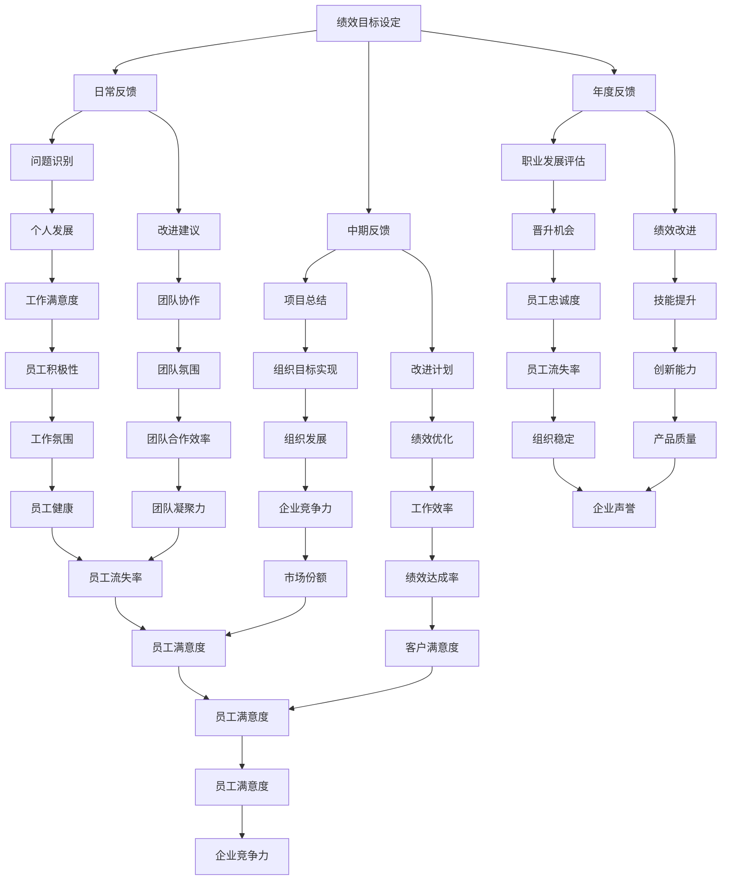

                 

### 文章标题

# 绩效反馈：建立积极的反馈机制

### 关键词

- 绩效反馈
- 积极反馈机制
- 组织管理
- 反馈流程
- 解决方案

### 摘要

本文旨在探讨绩效反馈在组织管理中的重要性，以及如何建立积极的反馈机制。通过详细的分析与实例，我们将了解绩效反馈的概念、原则、实施流程以及常见问题。文章将结合实际案例，提供优化反馈机制的策略，并探讨技术工具在绩效反馈中的应用。通过本文，读者将获得关于绩效反馈的全面理解和实践指导。

---

## 引言

在当今快速变化的工作环境中，组织面临的挑战日益增多，如何有效地管理员工绩效成为企业成功的关键因素之一。绩效反馈作为一种重要的管理工具，不仅有助于提高员工的个人能力，还能促进组织的整体发展。然而，传统的绩效反馈往往存在形式单一、反馈不及时、缺乏建设性等问题，难以达到预期的效果。

本文将围绕“绩效反馈：建立积极的反馈机制”这一主题，系统地探讨绩效反馈的概念、原则、实施流程以及常见问题。通过分析实际案例，我们将总结出优化反馈机制的有效策略，并探讨技术工具在绩效反馈中的应用。希望本文能为企业管理者、人力资源专业人员以及其他对绩效反馈感兴趣的读者提供有价值的参考。

## 绩效反馈的概念与重要性

### 绩效反馈的定义

绩效反馈是指管理者或团队成员对员工在工作中的表现进行评估和指导的过程。这种反馈可以是正面的，也可以是负面的，目的是帮助员工了解自己的工作表现，发现问题和改进机会。绩效反馈不仅包括对工作成果的评价，还涵盖了工作态度、团队合作、创新能力等多个方面。

### 绩效反馈的重要性

绩效反馈在组织管理中扮演着至关重要的角色，主要表现在以下几个方面：

1. **促进员工个人成长**：通过绩效反馈，员工可以清楚地了解自己的优势和不足，有针对性地进行自我提升，从而实现个人职业发展。

2. **提升组织绩效**：绩效反馈有助于组织识别和培养关键人才，优化团队结构，提高整体工作效率和业绩。

3. **构建积极的企业文化**：积极的绩效反馈机制能够增强员工的工作动力和归属感，促进团队合作，营造一个开放、包容、鼓励创新的工作环境。

4. **提高管理效率**：绩效反馈为管理者提供了重要的管理工具，有助于及时发现问题、调整管理策略，提高管理效率。

### 绩效反馈的三个层次

绩效反馈可以分为三个层次：日常反馈、中期反馈和年度反馈。

1. **日常反馈**：指在工作过程中的即时反馈，如项目进展汇报、团队讨论等。这种反馈能够帮助员工快速纠正错误，提高工作效率。

2. **中期反馈**：通常在项目或工作阶段结束后进行，对一段时间内的表现进行总结和评价。这种反馈有助于员工了解自己在整个项目中的表现，以及需要改进的地方。

3. **年度反馈**：通常在年末进行，对员工一年的工作进行全面的评价。这种反馈对员工的职业发展和晋升具有重要意义。

### 绩效反馈的核心概念与联系

为了更好地理解绩效反馈的运作机制，我们引入一个Mermaid流程图，展示绩效反馈的核心概念及其相互联系。



这个流程图展示了绩效反馈在不同层次、不同方面之间的相互作用，有助于我们全面理解绩效反馈的运作机制。

### 核心算法原理讲解

在绩效反馈中，关键算法原理涉及数据收集、分析和评估。以下是一个简化的伪代码，用于阐述绩效反馈的核心算法原理。

```python
# 绩效反馈算法伪代码

# 初始化绩效数据结构
performance_data = {
    'daily_feedback': [],
    'mid_term_feedback': [],
    'annual_feedback': []
}

# 收集绩效数据
def collect_performance_data():
    # 日常反馈
    daily_feedback = get_daily_feedback()
    performance_data['daily_feedback'].append(daily_feedback)
    
    # 中期反馈
    mid_term_feedback = get_mid_term_feedback()
    performance_data['mid_term_feedback'].append(mid_term_feedback)
    
    # 年度反馈
    annual_feedback = get_annual_feedback()
    performance_data['annual_feedback'].append(annual_feedback)

# 分析绩效数据
def analyze_performance_data():
    # 分析日常反馈
    for daily_feedback in performance_data['daily_feedback']:
        analyze_daily_feedback(daily_feedback)
    
    # 分析中期反馈
    for mid_term_feedback in performance_data['mid_term_feedback']:
        analyze_mid_term_feedback(mid_term_feedback)
    
    # 分析年度反馈
    for annual_feedback in performance_data['annual_feedback']:
        analyze_annual_feedback(annual_feedback)

# 评估绩效
def evaluate_performance():
    # 根据绩效数据评估员工表现
    performance_evaluation = calculate_performance_score(performance_data)
    return performance_evaluation

# 改进绩效
def improve_performance(performance_evaluation):
    # 根据评估结果提供改进建议
    improvement_plan = generate_improvement_plan(performance_evaluation)
    return improvement_plan
```

在这个伪代码中，`collect_performance_data`用于收集不同层次的绩效数据，`analyze_performance_data`用于分析这些数据，`evaluate_performance`用于评估员工的整体表现，而`improve_performance`则根据评估结果提供改进建议。

### 数学模型和数学公式讲解

在绩效反馈中，数学模型和数学公式有助于量化绩效评估过程，提高反馈的客观性和准确性。以下是一个简化的数学模型，用于说明绩效评估的指标计算。

$$
绩效评分 = \frac{日常反馈得分 + 中期反馈得分 + 年度反馈得分}{3}
$$

其中，每个层次的反馈得分可以进一步分解为以下几个指标：

1. **工作成果**：
   $$
   成果得分 = \frac{完成的任务数量 \times 每个任务的权重}{总任务数量}
   $$

2. **工作态度**：
   $$
   态度得分 = \frac{正面的工作态度表现数量 \times 每个表现的权重}{总表现数量}
   $$

3. **团队合作**：
   $$
   团队合作得分 = \frac{团队任务完成情况得分 + 团队协作表现得分}{2}
   $$

这些指标可以结合具体情况进行调整和权重分配，以确保绩效评估的全面性和准确性。

### 绩效反馈的实施流程

要成功实施绩效反馈机制，企业需要遵循一个系统化的流程，以确保反馈的及时性、准确性和有效性。以下是一个详细的绩效反馈实施流程：

#### 准备阶段

1. **明确反馈目标和标准**：首先，企业需要明确绩效反馈的目标，例如提升员工能力、优化工作流程、促进团队合作等。同时，制定具体的绩效评估标准和指标，以便为后续的反馈提供依据。

2. **确定反馈对象和方式**：根据反馈目标，确定哪些员工需要接受反馈，以及反馈的具体方式，如个别反馈、团队反馈或在线反馈等。

3. **制定反馈计划和时间表**：制定详细的反馈计划，包括反馈的频率、周期和具体的时间表，以确保反馈的连续性和规律性。

#### 实施过程

1. **实施前的沟通**：在开始反馈前，与员工进行充分的沟通，让他们了解反馈的目的、标准和预期效果，以便消除顾虑，提高反馈的接受度。

2. **实施中的技巧**：在反馈过程中，管理者需要运用有效的沟通技巧，如积极倾听、具体说明、鼓励提问等，确保反馈的正面性和建设性。

3. **实施后的跟进**：反馈后，及时跟进员工的表现，了解他们是否按照反馈建议进行了改进，并根据改进情况调整后续的反馈计划。

### 具体步骤

1. **制定绩效计划**：明确绩效目标和关键绩效指标（KPI），并与员工进行沟通，确保双方对目标和指标有清晰的认识。

2. **日常绩效监控**：通过工作日志、周报、项目进展报告等形式，监控员工的日常绩效，收集反馈数据。

3. **定期绩效评估**：在中期和年度末，对员工的工作表现进行全面评估，结合日常监控数据和员工自评，形成综合评估结果。

4. **反馈面谈**：与员工进行一对一的反馈面谈，详细说明评估结果，肯定员工的优点，指出需要改进的地方，并提供具体的改进建议。

5. **反馈跟进**：在面谈后，持续跟进员工的表现，了解他们是否采取了改进措施，并根据实际情况调整反馈策略。

### 实施绩效反馈的常见问题与解决方案

在实施绩效反馈过程中，企业可能会遇到以下常见问题：

1. **反馈不足**：员工可能没有收到足够的反馈，导致无法了解自己的工作表现和改进方向。

   **解决方案**：加强日常绩效监控，增加反馈频率，确保反馈的及时性和连续性。

2. **反馈过度**：频繁的反馈可能让员工感到压力过大，影响工作积极性。

   **解决方案**：合理安排反馈的频率和形式，避免过度反馈，确保反馈的正面性和建设性。

3. **反馈不当**：反馈可能过于笼统或负面，导致员工产生抵触情绪。

   **解决方案**：提供具体、明确的反馈，避免使用模糊的语言，确保反馈的针对性和建设性。

4. **反馈不及时**：反馈可能因为各种原因而延迟，导致员工错过改进的最佳时机。

   **解决方案**：制定明确的反馈时间表，确保反馈的及时性，避免拖延。

通过以上问题及解决方案，企业可以更好地实施绩效反馈机制，提高员工的工作满意度和绩效水平。

### 实际案例分析与探讨

为了更好地理解绩效反馈的实施过程和效果，以下将分析两个实际案例，探讨绩效反馈在企业中的成功与挑战。

#### 案例一：某企业绩效反馈机制的建立与实施

**案例背景**：某企业是一家快速发展的科技公司，员工人数超过500人。由于公司规模不断扩大，员工的工作压力和职责分工日益复杂，管理层意识到需要建立一套有效的绩效反馈机制来提升整体绩效和员工满意度。

**案例分析**：
1. **明确反馈目标和标准**：公司首先明确了绩效反馈的目标，包括提升员工技能、优化工作流程和增强团队协作。同时，制定了具体的绩效评估标准，如工作效率、工作质量和团队合作等。
2. **制定反馈计划和时间表**：公司制定了一份详细的绩效反馈计划，包括日常反馈、季度反馈和年度反馈。反馈周期为每季度一次，年度反馈与公司年度总结相结合。
3. **实施前的沟通**：在每次反馈前，管理层都会与员工进行一对一的沟通，说明反馈的目的、标准和预期效果，确保员工理解并接受反馈。
4. **反馈面谈与改进跟进**：在季度反馈中，管理层与员工进行面对面的绩效面谈，详细说明评估结果，肯定员工的优点，指出需要改进的地方，并提供具体的改进建议。在后续的工作中，管理层会持续跟进员工的改进情况，根据实际情况调整反馈策略。

**案例启示**：
1. **明确目标和标准**：明确的目标和标准是实施绩效反馈的基础，有助于提高反馈的针对性和有效性。
2. **有效沟通**：充分的沟通是绩效反馈成功的关键，确保员工理解并接受反馈，有助于提高反馈的接受度和执行力。
3. **持续改进**：绩效反馈不是一次性的活动，而是一个持续的过程。通过定期跟进和调整，确保反馈机制能够真正发挥作用。

#### 案例二：某组织绩效反馈中的成功与挑战

**案例背景**：某非营利组织致力于社会公益事业，员工主要为志愿者和兼职人员。由于人员流动性较大，组织在绩效反馈方面面临一定的挑战。

**案例分析**：
1. **反馈频率和形式的灵活调整**：由于志愿者和兼职人员的参与时间和形式多样，组织在反馈频率和形式上进行了灵活调整。例如，对于长期志愿者，组织每季度进行一次全面反馈，而对于短期志愿者，则通过即时反馈和邮件反馈相结合的方式进行。
2. **建立反馈机制的文化**：组织通过内部培训和宣传，建立了积极的反馈文化，鼓励员工主动提出反馈和建议，增强了组织内部的沟通和协作。
3. **反馈中的挑战**：尽管组织在反馈方面做了很多努力，但仍然面临一些挑战。例如，部分员工由于对反馈的不理解或抵触情绪，导致反馈效果不佳。此外，由于人员流动性较大，一些反馈建议和改进措施难以长期落实。

**案例启示**：
1. **灵活调整反馈机制**：根据员工的特点和工作形式，灵活调整反馈频率和形式，确保反馈能够真正发挥作用。
2. **建立反馈文化**：通过培训和宣传，建立积极的反馈文化，鼓励员工主动参与反馈，提高反馈的接受度和执行力。
3. **应对人员流动性**：针对人员流动性大的情况，组织需要建立一套有效的反馈跟踪机制，确保反馈建议和改进措施能够长期落实。

通过这两个案例，我们可以看到绩效反馈在不同类型组织中的成功与挑战。无论是企业还是非营利组织，都需要根据自身的特点和需求，建立和完善绩效反馈机制，以提高员工的工作满意度和组织的整体绩效。

### 绩效反馈机制的持续优化

#### 评估与改进绩效反馈机制

要确保绩效反馈机制的有效性，企业需要定期评估其运行情况，并根据评估结果进行改进。以下是一些评估和改进绩效反馈机制的方法：

1. **员工反馈**：通过员工调查问卷或面谈，收集员工对绩效反馈机制的看法和建议，了解他们在反馈过程中遇到的问题和挑战。

2. **数据分析**：利用数据分析工具，对绩效反馈的数据进行深入分析，识别反馈机制的优缺点，以及改进的方向。

3. **定期审查**：定期审查绩效反馈机制的实施情况，评估其是否符合组织的目标和需求，以及是否达到了预期的效果。

#### 改进策略

根据评估结果，企业可以采取以下策略来优化绩效反馈机制：

1. **增强反馈技巧**：通过培训和管理者指导，提高管理者的反馈技巧，确保反馈具有建设性和针对性。

2. **改善反馈环境**：优化反馈的环境和氛围，确保反馈过程舒适、轻松，降低员工的抵触情绪。

3. **利用技术工具**：引入先进的技术工具，如绩效管理系统、数据分析工具等，提高反馈的准确性和效率。

4. **明确反馈目标**：确保反馈目标清晰、具体，与组织目标和员工发展需求相结合。

5. **加强跟进和沟通**：在反馈后，加强对员工的跟进和沟通，了解他们是否采取了改进措施，并根据实际情况进行调整。

#### 持续优化的重要性

持续优化绩效反馈机制对企业和员工都具有重要意义：

1. **提升绩效**：通过优化反馈机制，企业可以更好地发现和解决员工的问题，提升整体绩效和团队协作效率。

2. **促进个人发展**：持续优化的反馈机制有助于员工了解自己的优势和不足，促进个人职业发展。

3. **建立积极文化**：持续优化绩效反馈机制，有助于在企业内部建立积极、开放、包容的文化，提高员工的归属感和工作满意度。

4. **提升竞争力**：优化后的绩效反馈机制有助于企业吸引和留住优秀人才，提升企业的市场竞争力。

通过持续优化绩效反馈机制，企业可以不断提高员工的工作效率和绩效水平，实现组织目标的同时，促进员工的个人发展。

### 技术工具与绩效反馈

在现代企业中，技术工具在绩效反馈中发挥着越来越重要的作用。通过利用这些工具，企业可以更有效地收集、分析和利用绩效数据，提高反馈的准确性和效率。以下是一些常见的技术工具及其在绩效反馈中的应用。

#### 数据分析工具

数据分析工具可以帮助企业对大量的绩效数据进行分析，识别关键绩效指标（KPI）和潜在问题。例如，企业可以使用数据可视化工具（如Tableau或Power BI）来创建图表和报告，直观地展示绩效数据，便于管理者快速理解并做出决策。数据分析工具的优势在于：

- **高效的数据处理**：能够处理大规模数据，提高数据分析的速度和准确性。
- **可视化呈现**：通过图表和报告，使得数据更加直观，便于理解和分析。

#### 沟通与协作工具

沟通与协作工具（如Slack、Microsoft Teams或Zoom）在绩效反馈过程中也发挥了重要作用。这些工具提供了即时沟通和协作的平台，使得反馈过程更加高效和灵活。具体应用包括：

- **实时反馈**：通过即时消息或视频会议，管理者可以实时与员工进行沟通，提供及时的反馈和建议。
- **文件共享与协作**：团队成员可以共享工作文件和资料，协同完成任务，提高团队协作效率。

#### 反馈与评估工具

专门的绩效反馈与评估工具（如Lattice、KPI>|assistant|>

### 总结与展望

通过本文的探讨，我们全面了解了绩效反馈在组织管理中的重要性，以及如何建立积极的反馈机制。从定义、重要性到核心概念与联系，再到实施流程和问题解决，再到实际案例分析与优化策略，以及技术工具的应用，我们逐步构建了一个完整的绩效反馈体系。

绩效反馈不仅是提升员工个人能力和职业发展的关键，更是优化组织绩效、构建积极企业文化的有力工具。通过持续优化和利用先进的技术工具，企业可以更有效地实施绩效反馈，提高员工的满意度和绩效水平。

未来的绩效反馈机制将继续向智能化和个性化方向发展。随着人工智能和数据技术的进步，企业将能够更加精准地收集和分析绩效数据，为员工提供个性化的反馈和发展建议。同时，随着远程工作和虚拟团队的增加，绩效反馈也将更加灵活和多样化。

总之，绩效反馈是企业实现长期发展的关键因素。通过建立积极的反馈机制，企业不仅可以提升员工的个人能力和绩效，还可以构建一个健康、积极、包容的企业文化，为企业的持续发展奠定坚实基础。

---

**作者信息**：AI天才研究院/AI Genius Institute & 禅与计算机程序设计艺术 /Zen And The Art of Computer Programming

**版权声明**：本文版权所有，未经授权不得转载或使用。如需转载，请联系作者获得授权。

**拓展阅读**：
1. *《绩效管理实战指南》*：详细介绍了绩效管理的理论和实践方法，适合企业管理者和人力资源专业人员阅读。
2. *《积极心理学在职场中的应用》*：探讨如何通过积极心理学的理念和方法，提升员工的幸福感和工作效率。
3. *《敏捷绩效管理》*：介绍了敏捷绩效管理的方法和工具，适用于追求高效和灵活的企业。

