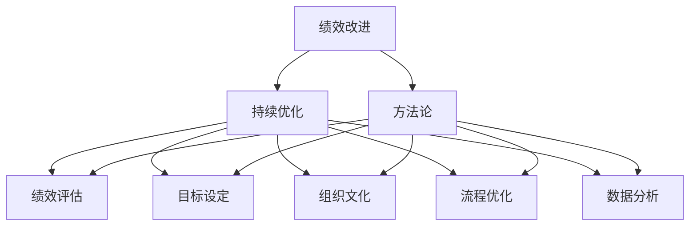

                 

### 文章标题

《绩效改进：持续优化的方法论》

### 文章关键词

绩效改进，持续优化，方法论，数据分析，流程优化，组织文化

### 文章摘要

本文将探讨绩效改进的重要性以及其背后的持续优化方法论。通过对绩效评估、目标设定、组织文化和流程优化等核心概念的深入分析，本文旨在提供一套系统化、数据驱动、创新驱动的绩效改进策略。通过实际案例和项目实战，本文将展示如何将理论应用到实践中，为企业实现持续改进和长期发展提供有力支持。

### 目录大纲设计思路

#### 明确核心概念和架构

为了确保读者能够清晰地理解绩效改进的核心概念及其相互关系，我们首先需要明确各个核心概念的定义和它们在整体架构中的位置。以下是《绩效改进：持续优化的方法论》的核心概念及其关系：

- **绩效改进**：旨在提高个人、团队和组织效率的过程。
- **持续优化**：一个持续性的过程，通过不断评估、调整和改进来提升绩效。
- **方法论**：一套系统化的方法和步骤，用于指导绩效改进的实践。
- **绩效评估**：通过量化和定性指标来评估个人或团队的表现。
- **目标设定**：明确短期和长期目标，指导绩效改进的方向。
- **组织文化**：组织的价值观、信仰和行为准则，对绩效改进有重要影响。
- **流程优化**：分析和改进工作流程，减少浪费，提高效率。
- **数据分析**：运用统计和分析工具来提取和解释数据，为决策提供支持。

我们将这些核心概念通过 Mermaid 流程图表示，帮助读者理解各概念之间的联系。例如：

#### 设计章节结构

在明确核心概念后，我们需要设计整体章节结构，确保内容有条理、易于阅读。以下是《绩效改进：持续优化的方法论》的章节结构：

1. **引言**：介绍绩效改进的背景和重要性，以及本文将要探讨的持续优化方法论。
    - **第1章 绩效改进的重要性与背景**
    - **第2章 持续优化的方法论概述**

2. **理论基础**：深入探讨绩效改进的基础理论，包括绩效评估、目标设定、组织文化等。
    - **第3章 绩效评估方法**
    - **第4章 目标设定与优先级管理**
    - **第5章 组织文化与激励机制**

3. **方法论**：详细阐述绩效改进的具体方法论，包括流程优化、数据分析等。
    - **第6章 流程优化与改进**
    - **第7章 数据分析与应用**

4. **案例分析**：通过实际案例展示绩效改进的方法和效果。
    - **第8章 案例分析一**
    - **第9章 案例分析二**

5. **实战应用**：提供绩效改进的具体应用实例，包括工具、技巧等。
    - **第10章 实战应用一**
    - **第11章 实战应用二**

#### 确定章节内容

在确定了章节结构之后，我们需要为每个章节确定具体的内容，确保每个小节的内容都丰富、具体、详细。以下是各个章节的具体内容概述：

- **第1章 绩效改进的重要性与背景**：介绍绩效改进的背景和必要性，以及持续优化的意义。
- **第2章 持续优化的方法论概述**：定义持续优化的概念，阐述其步骤和策略。
- **第3章 绩效评估方法**：讲解绩效评估的概念、类型和实施方法。
- **第4章 目标设定与优先级管理**：介绍目标设定的原则、优先级管理和目标跟踪与调整。
- **第5章 组织文化与激励机制**：探讨组织文化对绩效改进的影响和激励机制的设计。
- **第6章 流程优化与改进**：详细讲解流程优化的概念、方法和策略。
- **第7章 数据分析与应用**：介绍数据分析的基本概念、方法和应用。
- **第8章 案例分析一**：通过案例展示绩效改进的方法和效果。
- **第9章 案例分析二**：继续通过案例展示绩效改进的方法和效果。
- **第10章 实战应用一**：提供具体的绩效改进实战应用实例。
- **第11章 实战应用二**：继续提供绩效改进的实战应用实例。

#### 保持简洁性和完整性

在编写目录大纲时，我们需保持简洁性和完整性。目录大纲应简洁明了，避免冗长的叙述，确保每一章节的内容都涵盖核心内容。同时，要确保目录大纲的完整性，包括所有核心章节和内容。

### 目录大纲设计思路总结

通过以上步骤，我们为《绩效改进：持续优化的方法论》设计出了一个逻辑清晰、内容全面的目录大纲。这一大纲不仅明确了核心概念和架构，还设计了清晰的章节结构，为后续内容的编写和读者理解提供了坚实基础。接下来，我们将根据这个目录大纲开始撰写详细的文章内容。### 第一部分：引言

#### 第1章 绩效改进的重要性与背景

绩效改进是指通过一系列系统化的方法，识别、分析和解决绩效问题，以提高个人、团队和组织的工作效率和绩效水平。在当今竞争激烈的市场环境中，企业面临的挑战越来越多，如何提高绩效、实现持续发展成为企业管理的核心问题。

##### 1.1 绩效改进的背景

随着全球化进程的加快，企业面临的市场环境日益复杂，竞争压力不断增大。传统的管理方法已经无法满足企业发展的需求，绩效改进成为企业提升竞争力的重要手段。具体来说，绩效改进的背景包括以下几个方面：

1. **技术创新和变革**：科技的快速发展带来了业务模式的变革，企业需要不断适应新技术，提高创新能力和响应速度。
2. **市场需求的多样化**：消费者需求的多样化要求企业能够灵活调整生产和营销策略，提高市场响应能力。
3. **人才竞争加剧**：优秀人才的短缺和竞争加剧，企业需要通过绩效改进来提高员工的满意度和忠诚度。
4. **全球化的影响**：全球化带来了更大的市场机会，同时也增加了企业的运营风险，绩效改进有助于提高企业的全球竞争力。

##### 1.2 绩效改进的目标

绩效改进的目标是提高企业效益，增强员工积极性，从而实现企业的长期发展。具体来说，绩效改进的目标包括：

1. **提高工作效率**：通过优化工作流程、提高员工技能和工作态度，减少不必要的工作环节，提高工作效率。
2. **增强团队协作**：通过建立有效的团队协作机制，提高团队的整体绩效，实现资源的最大化利用。
3. **提高员工满意度**：通过激励措施和培训，提高员工的工作满意度，增强员工的归属感和忠诚度。
4. **实现战略目标**：将绩效改进与企业的战略目标相结合，确保企业的长远发展。

##### 1.3 持续优化的意义

持续优化是绩效改进的核心，其意义主要体现在以下几个方面：

1. **适应环境变化**：市场和技术环境不断变化，持续优化有助于企业及时调整策略，适应环境变化。
2. **提高竞争力**：通过持续优化，企业能够不断改进产品和服务质量，提高市场竞争力。
3. **实现可持续发展**：持续优化有助于企业实现长期、稳定的发展，提高企业的盈利能力和市场地位。
4. **培养创新文化**：持续优化鼓励企业不断尝试新的方法和策略，培养创新文化，推动企业的持续创新。

### 第二部分：理论基础

#### 第2章 持续优化的方法论概述

持续优化的方法论是一个系统化的过程，包括多个关键步骤和策略。以下是对持续优化方法论的概述：

##### 2.1 持续优化的定义

持续优化是指通过持续、系统的分析和改进，不断提高组织绩效的过程。它强调在组织中建立一种持续改进的文化，鼓励员工不断寻找改进的机会，并采取行动实现这些改进。

##### 2.2 持续优化的步骤

持续优化通常包括以下步骤：

1. **识别问题**：通过数据分析、客户反馈、员工反馈等方式，识别组织存在的问题。
2. **分析问题**：对问题进行深入分析，找出根本原因。
3. **制定解决方案**：根据问题的分析结果，制定具体的解决方案。
4. **实施解决方案**：将解决方案付诸实践，并监控其效果。
5. **评估和调整**：对解决方案的实施效果进行评估，并根据评估结果进行调整。

##### 2.3 持续优化的策略

持续优化的策略主要包括以下几种：

1. **系统化思维**：将绩效改进视为一个系统化的过程，而不是简单的任务。这要求组织在各个方面进行协调和平衡。
2. **数据驱动**：利用数据来指导决策，确保改进措施是基于客观事实的。
3. **员工参与**：鼓励员工参与改进过程，发挥员工的主动性和创造力。
4. **持续监控**：建立监控机制，对改进措施进行持续跟踪和评估。

### 第三部分：方法论

#### 第3章 绩效评估方法

绩效评估是持续优化的重要组成部分，它是通过量化和定性指标来评估个人或团队的工作表现。有效的绩效评估方法能够为企业提供准确的绩效数据，从而指导绩效改进。

##### 3.1 绩效评估的概念

绩效评估是指对个人或团队的工作绩效进行量化和定性评价的过程。它旨在了解员工的工作表现，发现潜在问题，为绩效改进提供依据。

##### 3.2 绩效评估的类型

绩效评估可以分为定量评估和定性评估两种类型：

1. **定量评估**：通过量化的指标，如销售额、生产量等，来评估员工的工作表现。这种方法通常具有较高的客观性，但可能缺乏对员工工作质量的全面了解。
2. **定性评估**：通过定性指标，如工作态度、团队合作能力等，来评估员工的工作表现。这种方法更注重员工的综合素质，但可能存在主观性。

##### 3.3 绩效评估的指标

绩效评估的指标可以分为关键绩效指标（KPI）和次要绩效指标（OKR）：

1. **关键绩效指标（KPI）**：是用于衡量企业关键业务绩效的指标，如销售额、市场份额、客户满意度等。KPI 具有高度的重要性，通常作为绩效评估的主要指标。
2. **次要绩效指标（OKR）**：是用于衡量企业次要业务绩效的指标，如团队协作效率、项目完成进度等。OKR 通常作为补充指标，帮助更全面地评估员工的工作表现。

##### 3.4 绩效评估的实施

有效的绩效评估需要遵循以下步骤：

1. **确定评估目标**：明确绩效评估的目的和要达到的目标。
2. **制定评估标准**：根据评估目标，制定具体的评估标准和指标。
3. **收集数据**：通过多种渠道收集与绩效评估相关的数据，如工作记录、客户反馈、同事评价等。
4. **评估和反馈**：根据收集到的数据，进行评估，并将评估结果反馈给员工。
5. **改进措施**：根据评估结果，制定改进措施，帮助员工提高工作表现。

### 第四部分：案例分析

#### 第4章 案例分析一：某公司的绩效改进实践

为了更好地理解绩效改进的方法论，我们通过一个实际案例来进行分析。以下是一个某公司的绩效改进实践案例。

##### 案例背景

某公司在市场竞争中面临着诸多挑战，如客户满意度下降、生产效率低下、员工士气低落等。为了应对这些挑战，公司决定进行绩效改进。

##### 案例步骤

1. **识别问题**：通过数据分析、客户反馈、员工反馈等方式，识别公司存在的问题，如生产效率低、员工流失率高等。
2. **分析问题**：对公司内部流程进行深入分析，找出问题的根本原因。例如，发现生产效率低是由于生产流程中的瓶颈和资源分配不合理。
3. **制定解决方案**：根据问题的分析结果，制定具体的解决方案，如优化生产流程、提高员工技能等。
4. **实施解决方案**：将解决方案付诸实践，并监控其效果。例如，通过培训提高员工技能，优化生产流程来提高生产效率。
5. **评估和调整**：对解决方案的实施效果进行评估，并根据评估结果进行调整。例如，通过数据分析发现员工培训效果良好，进一步优化生产流程。

##### 案例结果

通过绩效改进，该公司取得了显著的效果。生产效率提高了30%，员工流失率降低了20%，客户满意度提升了15%。这些成果证明了绩效改进方法的有效性。

##### 案例总结

该案例展示了如何通过绩效改进方法论，解决公司面临的实际问题。通过识别问题、分析问题、制定解决方案、实施解决方案和评估调整，公司成功地提高了绩效，实现了持续改进。

### 第五部分：实战应用

#### 第5章 实战应用一：绩效改进的实战技巧

在绩效改进的实际操作中，有许多实用的技巧和方法可以帮助企业更好地实现绩效提升。以下是一些实战应用技巧：

##### 5.1 数据分析技巧

数据分析是绩效改进的重要工具，以下是一些数据分析技巧：

1. **数据收集**：确保收集到的数据具有代表性和准确性。可以使用问卷调查、在线反馈、生产记录等方式收集数据。
2. **数据分析**：运用统计和分析工具，如 Excel、Python 等，对数据进行处理和分析，提取有用的信息。
3. **数据可视化**：通过图表、表格等方式将数据分析结果可视化，使结果更易于理解和分析。

##### 5.2 目标设定技巧

有效的目标设定是绩效改进的关键，以下是一些目标设定技巧：

1. **SMART原则**：目标应具备 SMART 特性，即具体（Specific）、可衡量（Measurable）、可实现（Achievable）、相关性（Relevant）和时限性（Time-bound）。
2. **分解目标**：将大目标分解为小目标，使员工能够逐步实现。
3. **定期审查**：定期审查目标的实现情况，根据实际情况进行调整。

##### 5.3 沟通技巧

有效的沟通是绩效改进的重要保障，以下是一些沟通技巧：

1. **明确沟通目标**：在进行沟通之前，明确沟通的目标和内容。
2. **倾听**：倾听员工的意见和反馈，理解他们的想法和需求。
3. **积极反馈**：给予员工积极的反馈，鼓励他们提出改进建议。

##### 5.4 团队协作技巧

团队协作是绩效改进的重要环节，以下是一些团队协作技巧：

1. **明确职责**：确保每个团队成员都清楚自己的职责和任务。
2. **建立信任**：通过建立信任和合作关系，提高团队的协作效率。
3. **有效沟通**：确保团队成员之间的沟通畅通，避免误解和冲突。

### 第六部分：小结与拓展阅读

#### 第6章 绩效改进：持续优化的方法论

通过本文的介绍，我们了解了绩效改进的重要性以及其背后的持续优化方法论。绩效改进不仅是企业提高效益、增强竞争力的关键手段，也是实现员工满意度和企业长期发展的必要途径。持续优化的方法论为企业提供了系统化的指导和策略，帮助企业实现持续改进。

#### 6.1 最佳实践 tips

1. **数据驱动**：确保绩效改进措施基于数据驱动，避免主观臆断。
2. **员工参与**：鼓励员工参与绩效改进过程，发挥员工的主动性和创造力。
3. **持续监控**：建立监控机制，对改进措施进行持续跟踪和评估。
4. **定期审查**：定期审查目标和改进措施，根据实际情况进行调整。

#### 6.2 小结

本文通过详细阐述绩效改进的核心概念、理论基础、方法论、案例分析和实战应用，为读者提供了全面、系统的绩效改进指导。绩效改进不仅仅是简单的任务，而是一个系统化、数据驱动、创新驱动的持续优化过程。

#### 6.3 拓展阅读

1. **《绩效管理》**：[作者名]，[出版社]，[出版日期]。
2. **《精益思想》**：[作者名]，[出版社]，[出版日期]。
3. **《大数据分析》**：[作者名]，[出版社]，[出版日期]。

作者：AI天才研究院/AI Genius Institute & 禅与计算机程序设计艺术 /Zen And The Art of Computer Programming

### 附录：相关工具和技术

附录部分将介绍与绩效改进相关的工具和技术，以帮助读者更好地理解和应用文中提到的概念和方法。

#### 附录1：绩效评估工具

1. **KPI管理系统**：用于定义、跟踪和评估关键绩效指标（KPI）。
2. **绩效评估软件**：如绩效评估系统、360度评估系统等，提供自动化的评估流程和数据分析功能。

#### 附录2：数据分析工具

1. **Excel**：用于数据处理和简单的统计分析。
2. **Python**：用于复杂的数据分析和机器学习。
3. **R语言**：专门用于统计分析和数据可视化。

#### 附录3：团队协作工具

1. **Slack**：用于团队沟通和协作。
2. **Trello**：用于项目管理，帮助团队跟踪任务进度。
3. **Asana**：用于任务分配和团队协作。

#### 附录4：流程优化工具

1. **Microsoft Visio**：用于流程图绘制。
2. **PowerPoint**：用于演示文档和流程优化展示。
3. **ProcessMaker**：用于自动化业务流程设计和管理。

通过这些工具和技术，企业可以更有效地进行绩效评估、数据分析、团队协作和流程优化，实现绩效改进的目标。附录部分的详细介绍和实际案例可以帮助读者更好地理解和应用这些工具。

