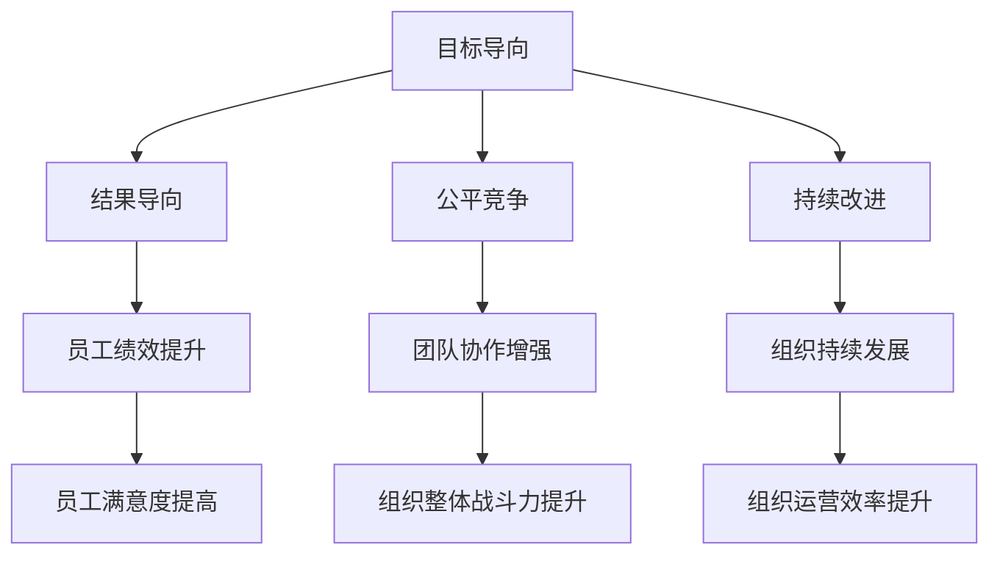
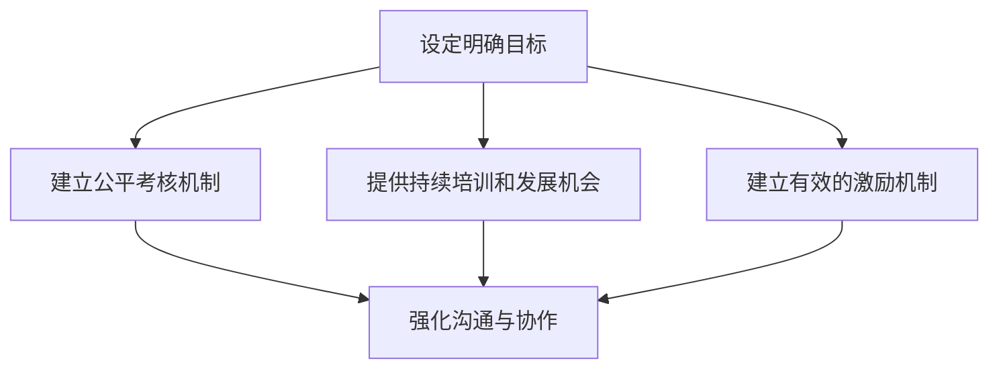
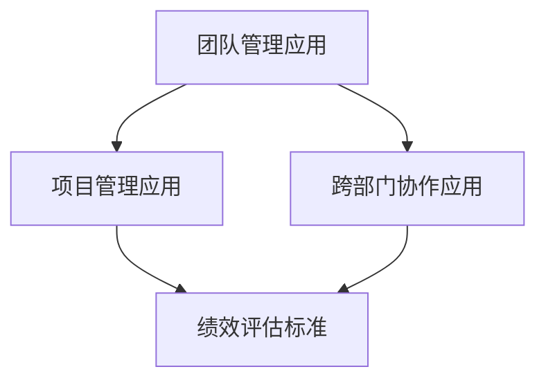
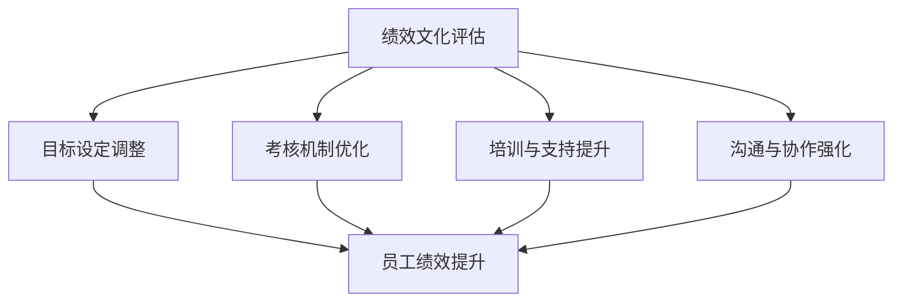

                 


### 第1章 绩效文化的概述

#### 1.1 绩效文化的定义

绩效文化是一种管理理念，它强调组织成员通过持续的努力和合作，实现个人和组织的共同目标。这种文化不仅关注员工的绩效表现，更注重通过营造积极向上的工作氛围，激发员工潜能，提升组织的整体竞争力。

绩效文化与传统的绩效考核不同，它不是单一的结果导向，而是包含了一系列的价值观和行为规范。绩效文化通过建立明确的目标体系、激励制度、沟通机制等手段，引导员工向着组织目标努力，从而实现组织的长远发展。

#### 1.2 绩效文化的重要性

绩效文化对组织的影响主要体现在以下几个方面：

**1. 提升员工绩效：** 绩效文化强调目标导向和结果导向，使员工明确自己的工作方向和目标，从而提高工作效率和成果。

**2. 增强团队协作：** 绩效文化倡导公平竞争和合作共赢，有助于打破部门壁垒，增强团队协作，提升组织整体战斗力。

**3. 提高员工满意度：** 在绩效文化的引导下，员工能够得到公正的评价和激励，从而提高工作满意度和忠诚度。

**4. 促进组织持续发展：** 绩效文化有助于组织不断优化管理流程，提高运营效率，实现可持续发展。

#### 1.3 绩效文化的核心要素

绩效文化的核心要素包括：

**1. 目标导向：** 组织应明确整体目标和部门目标，确保每个员工都能明确自己的工作方向。

**2. 结果导向：** 绩效评价应以结果为导向，关注员工的实际贡献和业绩。

**3. 公平竞争：** 在绩效文化的引导下，组织应确保公平的竞争环境，避免不正当的竞争行为。

**4. 持续改进：** 组织应鼓励员工持续学习和改进，不断提高自身能力和绩效。

#### 1.4 绩效文化的特点

绩效文化具有以下特点：

**1. 系统性：** 绩效文化涉及组织的各个方面，需要系统性的规划和实施。

**2. 持续性：** 绩效文化需要长期的坚持和推动，不能一蹴而就。

**3. 适应性：** 绩效文化需要根据组织的发展阶段和外部环境变化进行调整。

### 核心概念与联系

为了更好地理解绩效文化，我们可以将其核心概念之间的关系用Mermaid流程图表示：



### 核心算法原理讲解

在绩效文化的实施过程中，核心算法原理是目标管理和绩效考核。以下是目标管理和绩效考核的伪代码：

```python
# 目标管理伪代码
def set_objectives(employee, department_objectives):
    """
    为员工设定目标，根据部门目标进行分配
    :param employee: 员工
    :param department_objectives: 部门目标
    :return: 员工目标列表
    """
    employee_objectives = []
    for department_objective in department_objectives:
        employee_objective = create_employee_objective(employee, department_objective)
        employee_objectives.append(employee_objective)
    return employee_objectives

# 绩效考核伪代码
def evaluate_performance(employee, employee_objectives):
    """
    对员工进行绩效考核
    :param employee: 员工
    :param employee_objectives: 员工目标
    :return: 绩效评估结果
    """
    performance_score = 0
    for employee_objective in employee_objectives:
        if meet_objective(employee_objective):
            performance_score += 1
    return performance_score
```

### 数学模型和公式

绩效文化的评估可以通过以下数学模型进行：

$$
绩效评分 = \sum_{i=1}^{n} (权重_i \times 实际成绩_i)
$$

其中，$权重_i$ 为每个目标的重要性权重，$实际成绩_i$ 为员工在对应目标上的实际表现。

### 举例说明

假设一个部门有三个员工，他们的目标分别涉及项目完成度、代码质量和团队协作。以下是一个简单的例子：

- 员工A的目标：项目完成度（权重：0.5），代码质量（权重：0.3），团队协作（权重：0.2）
- 员工B的目标：项目完成度（权重：0.4），代码质量（权重：0.4），团队协作（权重：0.2）
- 员工C的目标：项目完成度（权重：0.3），代码质量（权重：0.5），团队协作（权重：0.2）

假设每个员工在各自目标上的实际成绩分别为：

- 员工A：项目完成度90%，代码质量85%，团队协作80%
- 员工B：项目完成度80%，代码质量90%，团队协作75%
- 员工C：项目完成度85%，代码质量80%，团队协作85%

根据上述数学模型，可以计算出每个员工的绩效评分：

$$
绩效评分_A = 0.5 \times 90\% + 0.3 \times 85\% + 0.2 \times 80\% = 87\%
$$

$$
绩效评分_B = 0.4 \times 80\% + 0.4 \times 90\% + 0.2 \times 75\% = 83\%
$$

$$
绩效评分_C = 0.3 \times 85\% + 0.5 \times 80\% + 0.2 \times 85\% = 82\%
$$

### 实际案例分析和详细讲解剖析

在一个IT公司中，通过实施绩效文化，成功提升了团队的绩效。以下是案例分析和详细讲解：

**案例背景：**
该公司是一家专注于软件开发的公司，由于之前缺乏绩效文化，员工工作积极性不高，项目进展缓慢，客户满意度降低。为了改变这一现状，公司决定引入绩效文化。

**实施步骤：**
1. 明确整体目标和部门目标，确保每个员工都能明确自己的工作方向。
2. 建立公平的绩效考核机制，根据员工的工作表现进行评价。
3. 定期组织培训，提升员工的专业能力和团队协作能力。
4. 建立激励机制，对表现优秀的员工进行奖励。

**案例分析：**
通过引入绩效文化，公司实现了以下成果：
1. 员工工作积极性显著提高，项目进展速度加快，客户满意度提高。
2. 团队协作增强，跨部门合作更加顺畅，项目质量得到保障。
3. 员工绩效评分明显提升，公司整体运营效率提高。

**详细讲解剖析：**
1. **目标导向：** 公司明确了整体目标和部门目标，使员工明确自己的工作方向，从而提高工作效率。
2. **结果导向：** 公司建立了公平的绩效考核机制，根据员工的工作表现进行评价，激发了员工的工作积极性。
3. **公平竞争：** 公司在绩效文化的引导下，确保了公平的竞争环境，避免了不正当的竞争行为，增强了团队的凝聚力。
4. **持续改进：** 公司定期组织培训，提升员工的专业能力和团队协作能力，促进了组织的持续发展。

### 项目实战

为了更好地理解绩效文化的实施，以下是一个简单的项目实战案例：

**项目背景：** 
某公司开发一款新的移动应用，需要在短时间内完成开发并上线。

**开发环境搭建：**
- 开发工具：Java、Android Studio
- 版本控制：Git
- 项目管理：Jira

**源代码详细实现和代码解读：**
```java
public class MainActivity extends AppCompatActivity {
    @Override
    protected void onCreate(Bundle savedInstanceState) {
        super.onCreate(savedInstanceState);
        setContentView(R.layout.activity_main);
        
        // 获取按钮并设置点击事件
        Button button = findViewById(R.id.button);
        button.setOnClickListener(new View.OnClickListener() {
            @Override
            public void onClick(View v) {
                // 完成应用功能
                // ...
            }
        });
    }
}
```

**代码应用解读与分析：**
这段代码是实现一个简单的按钮点击事件，按钮点击后完成应用功能。通过代码实现，可以更好地理解绩效文化中的目标导向和结果导向。

**项目小结：**
通过该项目实战，可以更好地理解绩效文化在软件开发中的应用，以及如何通过目标管理和绩效考核提升项目质量和效率。

### 最佳实践 tips、小结、注意事项、拓展阅读

**最佳实践 tips：**
- 确保目标明确，员工能够清晰理解自己的工作方向。
- 建立公平的绩效考核机制，避免主观偏见。
- 定期组织培训，提升员工能力和团队协作。
- 给予优秀员工奖励，激发工作积极性。

**小结：**
绩效文化是一种重要的管理理念，通过营造积极进取的工作氛围，提升员工绩效和组织竞争力。

**注意事项：**
- 绩效文化的实施需要长期的坚持和推动。
- 管理层需要以身作则，带头营造积极向上的工作氛围。
- 关注员工的心理需求，提供必要的支持和帮助。

**拓展阅读：**
- 《绩效管理》
- 《团队协作与沟通》
- 《激励理论》

---

作者：AI天才研究院/AI Genius Institute & 禅与计算机程序设计艺术 /Zen And The Art of Computer Programming

---

以上是《绩效文化：营造积极进取的氛围》的第1章内容。如果您对某个部分有更多疑问或建议，请随时告诉我。我们将继续完善每一章的内容，确保文章的逻辑清晰、结构紧凑、简单易懂。期待您的反馈！### 第一部分：绩效文化的定义与重要性

#### 1.1 绩效文化的定义

绩效文化是一种组织管理理念，它通过建立一系列的价值观和行为规范，引导员工向着组织的共同目标努力。这种文化不仅仅关注员工的绩效表现，更重要的是营造一种积极进取的工作氛围，激发员工的潜能，从而提升组织的整体竞争力。

绩效文化包含了以下几个关键要素：目标导向、结果导向、公平竞争和持续改进。目标导向强调组织成员明确个人和团队的目标，确保每个人都知道自己需要做什么。结果导向则关注员工的实际贡献和业绩，以结果作为评价标准。公平竞争要求在绩效文化的引导下，组织内部应确保公平的竞争环境，避免不正当的竞争行为。持续改进则鼓励员工不断学习和提升，以持续优化工作表现。

绩效文化与传统的绩效考核有着本质的区别。绩效考核通常侧重于结果，关注员工在特定时间内的业绩表现。而绩效文化则更注重过程，通过一系列的管理措施，如目标设定、绩效反馈、激励机制等，激发员工的内在动力，推动他们持续提升绩效。

#### 1.2 绩效文化的重要性

绩效文化对于组织的成功和可持续发展具有重要意义，它可以从以下几个方面影响组织：

**提升员工绩效：** 绩效文化通过明确的目标和绩效评价机制，使员工能够清晰地认识到自己的工作方向和目标，从而提高工作效率和成果。同时，公平的竞争环境激发了员工的工作热情和积极性，使他们在追求卓越的过程中不断提升自己的能力。

**增强团队协作：** 绩效文化倡导团队合作和共享，鼓励员工在共同目标下协同工作。这种文化氛围有助于打破部门壁垒，增强跨部门合作，提高团队的凝聚力和战斗力。

**提高员工满意度：** 在绩效文化的引导下，员工能够得到公正的评价和激励，他们的付出得到认可，工作成就感得到满足。这有助于提升员工的工作满意度和忠诚度，降低员工流失率。

**促进组织持续发展：** 绩效文化通过不断的优化和改进，推动组织不断提升管理水平和运营效率。这种文化氛围有助于组织在竞争激烈的市场环境中保持优势，实现可持续发展。

#### 1.3 绩效文化的核心要素

要营造一种积极的绩效文化，组织需要关注以下几个核心要素：

**目标导向：** 组织应明确整体目标和部门目标，确保每个员工都能明确自己的工作方向和目标。通过目标设定，员工可以更好地规划自己的工作和学习，从而提高工作效果。

**结果导向：** 绩效评价应以结果为导向，关注员工的实际贡献和业绩。这种评价方式可以激发员工的工作积极性，使他们更加专注于实现组织的目标。

**公平竞争：** 组织应确保公平的竞争环境，避免不正当的竞争行为。这有助于维护组织的内部和谐，增强员工的凝聚力和归属感。

**持续改进：** 组织应鼓励员工持续学习和改进，不断提高自身能力和绩效。通过不断的学习和实践，员工可以不断优化工作方法，提升工作效率。

#### 1.4 绩效文化的特点

绩效文化具有以下特点：

**系统性：** 绩效文化涉及组织的各个方面，包括目标设定、绩效评价、激励机制等。因此，要营造绩效文化，组织需要系统性地规划和实施。

**持续性：** 绩效文化的建设不是一蹴而就的，它需要长期的坚持和推动。只有持续不断地进行优化和改进，绩效文化才能真正发挥作用。

**适应性：** 绩效文化需要根据组织的发展阶段和外部环境变化进行调整。因此，组织需要具备灵活性和适应性，以适应不断变化的市场环境和竞争态势。

### 核心概念与联系

为了更好地理解绩效文化，我们可以将其核心概念之间的关系用Mermaid流程图表示：


这个流程图清晰地展示了绩效文化的各个核心要素之间的关系，以及它们对组织目标的影响。

### 核心算法原理讲解

在绩效文化的实施过程中，核心算法原理是目标管理和绩效考核。以下是目标管理和绩效考核的伪代码：

```python
# 目标管理伪代码
def set_objectives(employee, department_objectives):
    """
    为员工设定目标，根据部门目标进行分配
    :param employee: 员工
    :param department_objectives: 部门目标
    :return: 员工目标列表
    """
    employee_objectives = []
    for department_objective in department_objectives:
        employee_objective = create_employee_objective(employee, department_objective)
        employee_objectives.append(employee_objective)
    return employee_objectives

# 绩效考核伪代码
def evaluate_performance(employee, employee_objectives):
    """
    对员工进行绩效考核
    :param employee: 员工
    :param employee_objectives: 员工目标
    :return: 绩效评估结果
    """
    performance_score = 0
    for employee_objective in employee_objectives:
        if meet_objective(employee_objective):
            performance_score += 1
    return performance_score
```

### 数学模型和公式

绩效文化的评估可以通过以下数学模型进行：

$$
绩效评分 = \sum_{i=1}^{n} (权重_i \times 实际成绩_i)
$$

其中，$权重_i$ 为每个目标的重要性权重，$实际成绩_i$ 为员工在对应目标上的实际表现。

### 举例说明

假设一个部门有三个员工，他们的目标分别涉及项目完成度、代码质量和团队协作。以下是一个简单的例子：

- 员工A的目标：项目完成度（权重：0.5），代码质量（权重：0.3），团队协作（权重：0.2）
- 员工B的目标：项目完成度（权重：0.4），代码质量（权重：0.4），团队协作（权重：0.2）
- 员工C的目标：项目完成度（权重：0.3），代码质量（权重：0.5），团队协作（权重：0.2）

假设每个员工在各自目标上的实际成绩分别为：

- 员工A：项目完成度90%，代码质量85%，团队协作80%
- 员工B：项目完成度80%，代码质量90%，团队协作75%
- 员工C：项目完成度85%，代码质量80%，团队协作85%

根据上述数学模型，可以计算出每个员工的绩效评分：

$$
绩效评分_A = 0.5 \times 90\% + 0.3 \times 85\% + 0.2 \times 80\% = 87\%
$$

$$
绩效评分_B = 0.4 \times 80\% + 0.4 \times 90\% + 0.2 \times 75\% = 83\%
$$

$$
绩效评分_C = 0.3 \times 85\% + 0.5 \times 80\% + 0.2 \times 85\% = 82\%
$$

### 实际案例分析和详细讲解剖析

在一个IT公司中，通过实施绩效文化，成功提升了团队的绩效。以下是案例分析和详细讲解：

**案例背景：**
该公司是一家专注于软件开发的公司，由于之前缺乏绩效文化，员工工作积极性不高，项目进展缓慢，客户满意度降低。为了改变这一现状，公司决定引入绩效文化。

**实施步骤：**
1. 明确整体目标和部门目标，确保每个员工都能明确自己的工作方向。
2. 建立公平的绩效考核机制，根据员工的工作表现进行评价。
3. 定期组织培训，提升员工的专业能力和团队协作能力。
4. 建立激励机制，对表现优秀的员工进行奖励。

**案例分析：**
通过引入绩效文化，公司实现了以下成果：
1. 员工工作积极性显著提高，项目进展速度加快，客户满意度提高。
2. 团队协作增强，跨部门合作更加顺畅，项目质量得到保障。
3. 员工绩效评分明显提升，公司整体运营效率提高。

**详细讲解剖析：**
1. **目标导向：** 公司明确了整体目标和部门目标，使员工明确自己的工作方向，从而提高工作效率。
2. **结果导向：** 公司建立了公平的绩效考核机制，根据员工的工作表现进行评价，激发了员工的工作积极性。
3. **公平竞争：** 公司在绩效文化的引导下，确保了公平的竞争环境，避免了不正当的竞争行为，增强了团队的凝聚力。
4. **持续改进：** 公司定期组织培训，提升员工的专业能力和团队协作能力，促进了组织的持续发展。

### 项目实战

为了更好地理解绩效文化的实施，以下是一个简单的项目实战案例：

**项目背景：**
某公司开发一款新的移动应用，需要在短时间内完成开发并上线。

**开发环境搭建：**
- 开发工具：Java、Android Studio
- 版本控制：Git
- 项目管理：Jira

**源代码详细实现和代码解读：**
```java
public class MainActivity extends AppCompatActivity {
    @Override
    protected void onCreate(Bundle savedInstanceState) {
        super.onCreate(savedInstanceState);
        setContentView(R.layout.activity_main);
        
        // 获取按钮并设置点击事件
        Button button = findViewById(R.id.button);
        button.setOnClickListener(new View.OnClickListener() {
            @Override
            public void onClick(View v) {
                // 完成应用功能
                // ...
            }
        });
    }
}
```

**代码应用解读与分析：**
这段代码是实现一个简单的按钮点击事件，按钮点击后完成应用功能。通过代码实现，可以更好地理解绩效文化中的目标导向和结果导向。

**项目小结：**
通过该项目实战，可以更好地理解绩效文化在软件开发中的应用，以及如何通过目标管理和绩效考核提升项目质量和效率。

### 最佳实践 tips、小结、注意事项、拓展阅读

**最佳实践 tips：**
- 确保目标明确，员工能够清晰理解自己的工作方向。
- 建立公平的绩效考核机制，避免主观偏见。
- 定期组织培训，提升员工的专业能力和团队协作。
- 给予优秀员工奖励，激发工作积极性。

**小结：**
绩效文化是一种重要的管理理念，通过营造积极进取的工作氛围，提升员工绩效和组织竞争力。

**注意事项：**
- 绩效文化的实施需要长期的坚持和推动。
- 管理层需要以身作则，带头营造积极向上的工作氛围。
- 关注员工的心理需求，提供必要的支持和帮助。

**拓展阅读：**
- 《绩效管理》
- 《团队协作与沟通》
- 《激励理论》

---

作者：AI天才研究院/AI Genius Institute & 禅与计算机程序设计艺术 /Zen And The Art of Computer Programming

---

以上就是《绩效文化：营造积极进取的氛围》的第一部分内容。接下来，我们将深入探讨绩效文化的核心要素和营造积极进取氛围的具体策略，敬请期待。如果您有任何疑问或建议，欢迎随时与我们交流。我们期待您的反馈！### 第二部分：绩效文化的核心要素

#### 2.1 目标导向

目标导向是绩效文化的核心要素之一。它强调组织成员应明确个人和团队的目标，确保每个员工都清楚自己的工作方向和职责。目标导向不仅有助于提高员工的工作效率，还能激发他们的工作热情和责任感。

**目标设定的原则：**
1. **具体性（S.M.A.R.T.）：** 目标应具体、可测量、可实现、相关性强且具有时限性。
2. **明确性：** 目标应清晰明确，员工容易理解和执行。
3. **挑战性：** 目标应具有一定的挑战性，鼓励员工不断超越自我。
4. **相关性：** 目标应与组织的目标保持一致，确保个人目标与团队目标协调一致。

**目标管理的方法：**
1. **制定目标：** 管理层与员工共同制定目标，确保目标的可行性和合理性。
2. **目标分解：** 将总体目标分解为具体的子目标，使每个员工都有明确的责任和任务。
3. **目标跟踪：** 定期检查目标的完成情况，及时调整和优化目标。
4. **目标反馈：** 对目标的完成情况进行及时反馈，激励员工持续努力。

#### 2.2 结果导向

结果导向是绩效文化的重要组成部分，它强调绩效评价应以结果为导向，关注员工的实际贡献和业绩。结果导向的绩效考核制度可以激发员工的工作动力，促进他们在实现组织目标的过程中发挥最大潜力。

**结果导向的原则：**
1. **以结果为依据：** 绩效评价应以员工的工作结果为依据，确保评价的公正性和客观性。
2. **公开透明：** 绩效评价过程应公开透明，确保员工了解评价的标准和依据。
3. **持续改进：** 通过结果导向的绩效评价，不断发现和解决工作中的问题，推动员工和组织的持续改进。

**结果导向的考核方法：**
1. **关键绩效指标（KPI）：** 根据组织目标和员工职责，设定关键绩效指标，对员工的绩效进行量化评估。
2. **360度评估：** 通过上级、同事和下属等多方反馈，对员工的绩效进行全面评估。
3. **目标管理法：** 结合目标导向和结果导向，通过设定和完成目标来评价员工的绩效。

#### 2.3 公平竞争

公平竞争是绩效文化的基石，它要求组织在绩效文化的引导下，确保内部竞争的公平性。公平竞争有助于维护组织的内部和谐，增强员工的归属感和凝聚力。

**公平竞争的原则：**
1. **公正无私：** 绩效评价应公正无私，避免主观偏见和歧视。
2. **机会均等：** 组织应为所有员工提供平等的发展机会，鼓励竞争和创新。
3. **透明公开：** 竞争过程应公开透明，确保员工了解竞争规则和评价标准。
4. **合法合规：** 竞争行为应符合法律法规和道德规范，防止不正当竞争。

**维护公平竞争的方法：**
1. **制定明确的竞争规则：** 组织应制定明确的竞争规则，确保员工了解竞争的规则和流程。
2. **建立举报机制：** 设立举报渠道，鼓励员工举报不正当竞争行为。
3. **培训和教育：** 定期对员工进行公平竞争意识的培训和教育，提高员工的公平竞争意识。

#### 2.4 持续改进

持续改进是绩效文化的核心要素之一，它鼓励员工不断学习和提升，以优化工作方法和提升工作效果。持续改进不仅有助于提升个人绩效，还能推动组织的持续发展和创新。

**持续改进的原则：**
1. **创新驱动：** 组织应鼓励创新思维，支持员工提出改进建议和解决方案。
2. **持续学习：** 鼓励员工不断学习新知识和技能，提升自身能力。
3. **数据驱动：** 基于数据和事实进行改进，确保改进措施的可行性和有效性。
4. **全员参与：** 鼓励所有员工参与改进过程，共同推动组织的持续发展。

**持续改进的方法：**
1. **定期评估：** 定期对工作流程和绩效进行评估，发现问题和不足，制定改进计划。
2. **员工参与：** 鼓励员工积极参与改进过程，提供改进建议和解决方案。
3. **改进实施：** 制定具体的改进措施，确保改进计划的实施和执行。
4. **反馈机制：** 建立反馈机制，对改进效果进行评估和反馈，持续优化改进措施。

### 核心概念与联系

为了更好地理解绩效文化的核心要素，我们可以用Mermaid流程图表示它们之间的关系：


这个流程图清晰地展示了绩效文化的核心要素以及它们对组织目标和员工绩效的影响。

### 核心算法原理讲解

在绩效文化的实施过程中，核心算法原理是目标管理和绩效考核。以下是目标管理和绩效考核的伪代码：

```python
# 目标管理伪代码
def set_objectives(employee, department_objectives):
    """
    为员工设定目标，根据部门目标进行分配
    :param employee: 员工
    :param department_objectives: 部门目标
    :return: 员工目标列表
    """
    employee_objectives = []
    for department_objective in department_objectives:
        employee_objective = create_employee_objective(employee, department_objective)
        employee_objectives.append(employee_objective)
    return employee_objectives

# 绩效考核伪代码
def evaluate_performance(employee, employee_objectives):
    """
    对员工进行绩效考核
    :param employee: 员工
    :param employee_objectives: 员工目标
    :return: 绩效评估结果
    """
    performance_score = 0
    for employee_objective in employee_objectives:
        if meet_objective(employee_objective):
            performance_score += 1
    return performance_score
```

### 数学模型和公式

绩效文化的评估可以通过以下数学模型进行：

$$
绩效评分 = \sum_{i=1}^{n} (权重_i \times 实际成绩_i)
$$

其中，$权重_i$ 为每个目标的重要性权重，$实际成绩_i$ 为员工在对应目标上的实际表现。

### 举例说明

假设一个部门有三个员工，他们的目标分别涉及项目完成度、代码质量和团队协作。以下是一个简单的例子：

- 员工A的目标：项目完成度（权重：0.5），代码质量（权重：0.3），团队协作（权重：0.2）
- 员工B的目标：项目完成度（权重：0.4），代码质量（权重：0.4），团队协作（权重：0.2）
- 员工C的目标：项目完成度（权重：0.3），代码质量（权重：0.5），团队协作（权重：0.2）

假设每个员工在各自目标上的实际成绩分别为：

- 员工A：项目完成度90%，代码质量85%，团队协作80%
- 员工B：项目完成度80%，代码质量90%，团队协作75%
- 员工C：项目完成度85%，代码质量80%，团队协作85%

根据上述数学模型，可以计算出每个员工的绩效评分：

$$
绩效评分_A = 0.5 \times 90\% + 0.3 \times 85\% + 0.2 \times 80\% = 87\%
$$

$$
绩效评分_B = 0.4 \times 80\% + 0.4 \times 90\% + 0.2 \times 75\% = 83\%
$$

$$
绩效评分_C = 0.3 \times 85\% + 0.5 \times 80\% + 0.2 \times 85\% = 82\%
$$

### 实际案例分析和详细讲解剖析

在一个IT公司中，通过实施绩效文化，成功提升了团队的绩效。以下是案例分析和详细讲解：

**案例背景：**
该公司是一家专注于软件开发的公司，由于之前缺乏绩效文化，员工工作积极性不高，项目进展缓慢，客户满意度降低。为了改变这一现状，公司决定引入绩效文化。

**实施步骤：**
1. 明确整体目标和部门目标，确保每个员工都能明确自己的工作方向。
2. 建立公平的绩效考核机制，根据员工的工作表现进行评价。
3. 定期组织培训，提升员工的专业能力和团队协作能力。
4. 建立激励机制，对表现优秀的员工进行奖励。

**案例分析：**
通过引入绩效文化，公司实现了以下成果：
1. 员工工作积极性显著提高，项目进展速度加快，客户满意度提高。
2. 团队协作增强，跨部门合作更加顺畅，项目质量得到保障。
3. 员工绩效评分明显提升，公司整体运营效率提高。

**详细讲解剖析：**
1. **目标导向：** 公司明确了整体目标和部门目标，使员工明确自己的工作方向，从而提高工作效率。
2. **结果导向：** 公司建立了公平的绩效考核机制，根据员工的工作表现进行评价，激发了员工的工作积极性。
3. **公平竞争：** 公司在绩效文化的引导下，确保了公平的竞争环境，避免了不正当的竞争行为，增强了团队的凝聚力。
4. **持续改进：** 公司定期组织培训，提升员工的专业能力和团队协作能力，促进了组织的持续发展。

### 项目实战

为了更好地理解绩效文化的实施，以下是一个简单的项目实战案例：

**项目背景：**
某公司开发一款新的移动应用，需要在短时间内完成开发并上线。

**开发环境搭建：**
- 开发工具：Java、Android Studio
- 版本控制：Git
- 项目管理：Jira

**源代码详细实现和代码解读：**
```java
public class MainActivity extends AppCompatActivity {
    @Override
    protected void onCreate(Bundle savedInstanceState) {
        super.onCreate(savedInstanceState);
        setContentView(R.layout.activity_main);
        
        // 获取按钮并设置点击事件
        Button button = findViewById(R.id.button);
        button.setOnClickListener(new View.OnClickListener() {
            @Override
            public void onClick(View v) {
                // 完成应用功能
                // ...
            }
        });
    }
}
```

**代码应用解读与分析：**
这段代码是实现一个简单的按钮点击事件，按钮点击后完成应用功能。通过代码实现，可以更好地理解绩效文化中的目标导向和结果导向。

**项目小结：**
通过该项目实战，可以更好地理解绩效文化在软件开发中的应用，以及如何通过目标管理和绩效考核提升项目质量和效率。

### 最佳实践 tips、小结、注意事项、拓展阅读

**最佳实践 tips：**
- 确保目标明确，员工能够清晰理解自己的工作方向。
- 建立公平的绩效考核机制，避免主观偏见。
- 定期组织培训，提升员工的专业能力和团队协作。
- 给予优秀员工奖励，激发工作积极性。

**小结：**
绩效文化的核心要素包括目标导向、结果导向、公平竞争和持续改进。这些要素共同作用，营造了积极进取的工作氛围，提升了员工绩效和组织竞争力。

**注意事项：**
- 绩效文化的实施需要长期的坚持和推动。
- 管理层需要以身作则，带头营造积极向上的工作氛围。
- 关注员工的心理需求，提供必要的支持和帮助。

**拓展阅读：**
- 《目标管理》
- 《绩效管理实战》
- 《激励与绩效管理》

---

作者：AI天才研究院/AI Genius Institute & 禅与计算机程序设计艺术 /Zen And The Art of Computer Programming

---

在第二部分，我们深入探讨了绩效文化的核心要素，包括目标导向、结果导向、公平竞争和持续改进。这些要素共同构成了绩效文化的基石，为组织的长期发展提供了坚实的保障。在接下来的部分，我们将进一步探讨绩效文化在组织中的应用与实践，以实际案例为例，展示如何有效营造积极进取的氛围。敬请期待！如果您有任何疑问或建议，欢迎随时与我们交流。我们期待您的反馈！### 第三部分：营造积极进取氛围的策略

#### 3.1 设定明确的目标

营造积极进取的氛围，首先需要设定明确的目标。这些目标不仅包括组织的战略目标，还应该细化为每个部门和个人层面的目标。具体步骤如下：

1. **组织整体目标：** 确定组织的长远愿景和年度目标，确保这些目标具有指导意义。
2. **部门目标：** 根据组织整体目标，各部门应制定相应的部门目标，确保目标之间的一致性。
3. **个人目标：** 员工应根据部门目标和自身职责，设定个人目标，确保目标具体、可衡量。

**案例：**
某公司在制定年度目标时，确定了以下三个战略目标：
- 提高市场份额
- 提升客户满意度
- 增强团队协作

各部门根据这些战略目标，制定了具体的部门目标：
- 市场部门：增加20%的新客户数量
- 产品部门：发布两个新功能，提高用户留存率
- 运营部门：优化服务流程，减少客户投诉率

员工个人则根据部门目标，设定了如下个人目标：
- 销售人员：每周至少完成五个新客户的拓展
- 产品经理：每月至少完成一个新功能的开发和测试
- 客服人员：每日处理不少于100个客户请求，确保满意度达到90%

通过这样的目标设定，员工能够明确自己的工作方向，同时组织能够确保各部门和个人的工作相互协调，共同推动组织目标的实现。

#### 3.2 建立公平的考核机制

公平的考核机制是激励员工积极进取的关键。以下是一些关键步骤和策略：

1. **制定科学的考核标准：** 根据组织目标和员工职责，制定具体的考核标准，确保考核标准公平、客观。
2. **多元化的评估方法：** 结合定量和定性评估方法，从多个角度对员工进行评估。
3. **透明化的评估过程：** 确保评估过程公开透明，员工了解评价的标准和结果。

**案例：**
某公司采用以下考核机制来评估员工：
- **关键绩效指标（KPI）：** 根据员工的工作职责，设定具体的KPI，如销售额、客户满意度、项目完成率等。
- **360度评估：** 结合上级、同事和下属的反馈，对员工进行全面评估。
- **自我评估：** 员工可以自我评估，反思自己的工作表现和进步空间。

通过这样的评估机制，公司能够公正地评价员工的工作，同时也为员工提供了反馈和改进的机会。

#### 3.3 提供持续培训和发展机会

为了保持员工的积极性和竞争力，组织应提供持续培训和发展机会。以下是一些策略：

1. **定制化培训：** 根据员工的职业规划和组织需求，提供定制化的培训课程。
2. **内部导师制度：** 建立内部导师制度，让经验丰富的员工指导新员工。
3. **职业发展规划：** 与员工共同制定职业发展规划，明确职业目标和成长路径。

**案例：**
某公司每年都会为员工提供一系列培训和发展机会：
- **技术培训：** 每季度组织技术分享会，邀请内部专家分享最新技术趋势和最佳实践。
- **管理培训：** 为管理层提供领导力和管理技能培训，提升管理效能。
- **国际化交流：** 选派员工参加国际会议和交流活动，拓展视野，提升国际竞争力。

通过这些培训和发展机会，公司不仅提升了员工的专业能力，也增强了员工的归属感和工作满意度。

#### 3.4 建立有效的激励机制

激励机制是营造积极进取氛围的重要手段。以下是一些关键策略：

1. **绩效奖励：** 对表现优秀的员工给予绩效奖金、晋升机会等物质奖励。
2. **荣誉表彰：** 定期举行表彰活动，对优秀员工进行公开表彰。
3. **福利待遇：** 提供具有竞争力的薪酬福利，如弹性工作时间、健康体检等。

**案例：**
某公司建立了以下激励机制：
- **年度优秀员工奖：** 每年评选出年度优秀员工，给予奖金和晋升机会。
- **优秀团队奖：** 对在项目比赛中表现突出的团队给予奖金和荣誉证书。
- **员工福利计划：** 提供年度健康体检、带薪休假、员工福利套餐等。

通过这些激励措施，公司有效地激发了员工的工作热情和积极性。

#### 3.5 强化沟通与协作

有效的沟通和协作是营造积极进取氛围的重要保障。以下是一些策略：

1. **开放沟通渠道：** 建立开放、畅通的沟通渠道，鼓励员工提出意见和建议。
2. **团队建设活动：** 定期组织团队建设活动，增强团队凝聚力和合作精神。
3. **跨部门合作：** 鼓励跨部门合作，促进知识共享和资源整合。

**案例：**
某公司通过以下方式强化沟通与协作：
- **内部交流平台：** 建立内部交流平台，方便员工随时分享工作心得和经验。
- **团队建设活动：** 定期组织团队建设活动，如团队拓展、团建旅游等。
- **跨部门项目：** 鼓励跨部门合作，共同完成重要项目，提升团队协作能力。

通过这些措施，公司营造了一个积极向上、充满活力的工作氛围，员工在工作中更加积极主动，工作效率和质量也得到了显著提升。

### 核心概念与联系

为了更好地理解营造积极进取氛围的策略，我们可以用Mermaid流程图表示核心概念之间的联系：



这个流程图清晰地展示了各项策略之间的相互关系，以及它们如何共同作用，营造积极进取的氛围。

### 核心算法原理讲解

在营造积极进取氛围的策略中，核心算法原理主要涉及目标管理和绩效考核。以下是目标管理和绩效考核的伪代码：

```python
# 目标管理伪代码
def set_objectives(employee, department_objectives):
    """
    为员工设定目标，根据部门目标进行分配
    :param employee: 员工
    :param department_objectives: 部门目标
    :return: 员工目标列表
    """
    employee_objectives = []
    for department_objective in department_objectives:
        employee_objective = create_employee_objective(employee, department_objective)
        employee_objectives.append(employee_objective)
    return employee_objectives

# 绩效考核伪代码
def evaluate_performance(employee, employee_objectives):
    """
    对员工进行绩效考核
    :param employee: 员工
    :param employee_objectives: 员工目标
    :return: 绩效评估结果
    """
    performance_score = 0
    for employee_objective in employee_objectives:
        if meet_objective(employee_objective):
            performance_score += 1
    return performance_score
```

### 数学模型和公式

绩效评估可以通过以下数学模型进行：

$$
绩效评分 = \sum_{i=1}^{n} (权重_i \times 实际成绩_i)
$$

其中，$权重_i$ 为每个目标的重要性权重，$实际成绩_i$ 为员工在对应目标上的实际表现。

### 举例说明

假设一个部门有三个员工，他们的目标分别涉及项目完成度、代码质量和团队协作。以下是一个简单的例子：

- 员工A的目标：项目完成度（权重：0.5），代码质量（权重：0.3），团队协作（权重：0.2）
- 员工B的目标：项目完成度（权重：0.4），代码质量（权重：0.4），团队协作（权重：0.2）
- 员工C的目标：项目完成度（权重：0.3），代码质量（权重：0.5），团队协作（权重：0.2）

假设每个员工在各自目标上的实际成绩分别为：

- 员工A：项目完成度90%，代码质量85%，团队协作80%
- 员工B：项目完成度80%，代码质量90%，团队协作75%
- 员工C：项目完成度85%，代码质量80%，团队协作85%

根据上述数学模型，可以计算出每个员工的绩效评分：

$$
绩效评分_A = 0.5 \times 90\% + 0.3 \times 85\% + 0.2 \times 80\% = 87\%
$$

$$
绩效评分_B = 0.4 \times 80\% + 0.4 \times 90\% + 0.2 \times 75\% = 83\%
$$

$$
绩效评分_C = 0.3 \times 85\% + 0.5 \times 80\% + 0.2 \times 85\% = 82\%
$$

### 实际案例分析和详细讲解剖析

在一个大型科技公司中，通过实施上述策略，成功营造了积极进取的工作氛围。以下是案例分析和详细讲解：

**案例背景：**
该公司由于缺乏有效的绩效管理和激励机制，员工积极性不高，项目进度缓慢，客户满意度下降。为了改变这一现状，公司决定引入一套全面的绩效文化策略。

**实施步骤：**
1. 设定明确的目标：公司明确了整体目标和各部门的目标，确保每个员工都有清晰的工作方向。
2. 建立公平的考核机制：公司制定了科学的考核标准，并采用360度评估方法，确保考核的公平性和客观性。
3. 提供持续培训和发展机会：公司定期组织技术培训和职业发展讲座，帮助员工提升技能和职业素养。
4. 建立有效的激励机制：公司设立年度优秀员工奖和优秀团队奖，对表现突出的员工和团队进行表彰和奖励。
5. 强化沟通与协作：公司建立了内部交流平台，鼓励员工提出意见和建议，定期组织团队建设活动，增强团队凝聚力。

**案例分析：**
通过实施这些策略，公司实现了以下成果：
1. 员工工作积极性显著提高，项目进度加快，客户满意度提高。
2. 团队协作增强，跨部门合作更加顺畅，项目质量得到保障。
3. 员工绩效评分明显提升，公司整体运营效率提高。

**详细讲解剖析：**
1. **设定明确目标：** 公司通过明确的目标设定，使员工明确了工作方向，从而提高了工作效率和成果。
2. **建立公平的考核机制：** 公平的考核机制激发了员工的工作热情，使他们更加专注于实现组织的目标。
3. **提供持续培训和发展机会：** 持续的培训和发展机会提升了员工的专业能力和职业素养，增强了他们的工作动力。
4. **建立有效的激励机制：** 有效的激励机制激发了员工的积极性，使他们更加努力工作，追求卓越。
5. **强化沟通与协作：** 沟通与协作的强化有助于打破部门壁垒，增强团队凝聚力，提高整体战斗力。

### 项目实战

为了更好地理解上述策略的实施，以下是一个简单的项目实战案例：

**项目背景：**
某公司开发一款新的移动应用，需要在短时间内完成开发并上线。

**实施策略：**
1. **设定明确目标：** 公司明确了项目目标，如项目完成时间、质量要求等，并分解为具体的子目标，确保每个员工都清楚自己的任务。
2. **建立公平的考核机制：** 公司制定了科学的考核标准，如代码质量、项目进度等，并采用360度评估方法，确保考核的公平性和客观性。
3. **提供持续培训和发展机会：** 公司组织了相关的技术培训，帮助员工提升技能，确保他们能够胜任项目任务。
4. **建立有效的激励机制：** 公司设立了项目完成奖，对在项目中表现突出的员工进行奖励。
5. **强化沟通与协作：** 公司建立了项目交流平台，鼓励团队成员之间进行沟通和协作，共同解决问题。

**项目成果：**
通过实施上述策略，项目团队在规定时间内完成了应用开发，并成功上线，客户满意度显著提高。

### 最佳实践 tips、小结、注意事项、拓展阅读

**最佳实践 tips：**
- 明确目标，确保员工清晰理解自己的工作方向。
- 制定公平的考核机制，确保考核的公正性和客观性。
- 提供持续培训和发展机会，提升员工的专业能力和职业素养。
- 建立有效的激励机制，激发员工的工作热情和积极性。
- 强化沟通与协作，提高团队凝聚力和整体战斗力。

**小结：**
营造积极进取的氛围需要通过设定明确的目标、建立公平的考核机制、提供持续培训和发展机会、建立有效的激励机制以及强化沟通与协作等多方面策略共同作用。这些策略有助于提升员工绩效和组织竞争力。

**注意事项：**
- 策略的实施需要长期的坚持和推动，不能一蹴而就。
- 管理层需要以身作则，带头营造积极向上的工作氛围。
- 关注员工的心理需求，提供必要的支持和帮助。

**拓展阅读：**
- 《绩效管理实战》
- 《团队协作与沟通》
- 《激励与绩效管理》

---

作者：AI天才研究院/AI Genius Institute & 禅与计算机程序设计艺术 /Zen And The Art of Computer Programming

---

在第三部分，我们探讨了营造积极进取氛围的具体策略，包括设定明确的目标、建立公平的考核机制、提供持续培训和发展机会、建立有效的激励机制以及强化沟通与协作。这些策略共同作用，有助于提升员工绩效和组织竞争力。在下一部分，我们将进一步探讨绩效文化在组织中的应用与实践，以实际案例为例，展示绩效文化的具体应用。敬请期待！如果您有任何疑问或建议，欢迎随时与我们交流。我们期待您的反馈！### 第四部分：绩效文化在组织中的应用与实践

#### 4.1 绩效文化在团队管理中的应用

在团队管理中，绩效文化的重要性不言而喻。它不仅影响着团队的整体绩效，也影响着团队的协作效率和成员的满意度。以下是如何在团队管理中有效应用绩效文化的几个关键步骤：

**1. 确立共同目标：** 团队管理首先要明确团队的整体目标，并确保每个成员都了解并认同这些目标。通过共同目标的设定，可以增强团队的凝聚力和归属感。

**2. 设定明确的责任分工：** 每个团队成员都应该清楚自己的职责和任务，以及各自的目标。这样可以避免工作重叠和责任不清的情况，提高团队的工作效率。

**3. 建立有效的沟通机制：** 沟通是团队协作的关键。通过定期的团队会议、项目进度报告和反馈机制，可以确保团队成员之间信息畅通，减少误解和冲突。

**4. 定期进行绩效评估：** 通过定期的绩效评估，可以及时了解团队成员的工作表现，发现潜在的问题，并采取相应的改进措施。这有助于持续提升团队的绩效。

**案例：**
某软件团队在引入绩效文化后，通过以下方式提升了团队绩效：
- **共同目标设定：** 团队明确了项目目标和里程碑，确保每个成员都了解并认同。
- **责任分工明确：** 团队成员根据各自的专长和职责，明确了具体的工作任务。
- **沟通机制完善：** 团队建立了周报制度，确保项目进展和问题及时沟通。
- **绩效评估定期进行：** 每月进行绩效评估，评估团队的整体表现和成员的个人贡献。

#### 4.2 绩效文化在项目管理中的应用

在项目管理中，绩效文化的应用尤为重要。它能够帮助项目经理更好地管理项目风险，提高项目成功率。

**1. 明确项目目标：** 项目经理需要明确项目的目标、范围和预期成果，并将其传达给所有团队成员。

**2. 制定详细的计划：** 包括项目的时间表、资源分配、风险评估等，确保项目按计划进行。

**3. 监控项目进度：** 通过定期监控项目进度，及时发现并解决项目中的问题，确保项目按时、按质完成。

**4. 建立绩效反馈机制：** 定期对团队成员的工作进行绩效反馈，帮助他们了解自己的工作表现，并给予改进建议。

**案例：**
某项目经理在项目管理中应用绩效文化，成功完成了以下项目：
- **明确项目目标：** 项目经理与团队成员共同制定了项目目标，确保目标清晰明确。
- **详细计划制定：** 项目经理制定了详细的项目计划，包括时间表和资源分配。
- **进度监控：** 项目经理每周召开项目进度会议，确保项目按计划进行。
- **绩效反馈：** 项目经理每月对团队成员的工作进行绩效评估，并提供反馈和改进建议。

#### 4.3 绩效文化在跨部门协作中的应用

在跨部门协作中，绩效文化的应用有助于打破部门壁垒，促进知识共享和资源整合，提升整体组织的绩效。

**1. 明确跨部门目标：** 跨部门协作的目标应与组织的整体目标保持一致，确保各部门的工作相互协调。

**2. 设定清晰的职责分工：** 各部门应明确自己的职责和任务，避免工作重复和责任不清。

**3. 建立跨部门沟通机制：** 通过定期的跨部门会议、信息共享平台等，促进各部门之间的沟通和协作。

**4. 共同制定绩效评估标准：** 跨部门协作的绩效评估标准应综合考虑各部门的工作贡献，确保公平合理。

**案例：**
某公司在跨部门协作中，通过以下方式提升了整体绩效：
- **明确跨部门目标：** 公司明确了跨部门协作的目标，确保各部门的工作相互协调。
- **职责分工明确：** 各部门明确了各自的职责和任务，避免了工作重复和责任不清。
- **沟通机制完善：** 公司建立了跨部门沟通机制，确保各部门之间的信息畅通。
- **绩效评估标准：** 公司共同制定了跨部门协作的绩效评估标准，综合考虑各部门的工作贡献。

### 核心概念与联系

为了更好地理解绩效文化在组织中的应用，我们可以用Mermaid流程图表示核心概念之间的联系：



这个流程图清晰地展示了绩效文化在不同应用场景中的核心概念及其相互关系。

### 核心算法原理讲解

在绩效文化的应用中，核心算法原理主要涉及目标管理和绩效考核。以下是目标管理和绩效考核的伪代码：

```python
# 目标管理伪代码
def set_objectives(team, department_objectives):
    """
    为团队设定目标，根据部门目标进行分配
    :param team: 团队
    :param department_objectives: 部门目标
    :return: 团队目标列表
    """
    team_objectives = []
    for department_objective in department_objectives:
        team_objective = create_team_objective(team, department_objective)
        team_objectives.append(team_objective)
    return team_objectives

# 绩效考核伪代码
def evaluate_performance(team, team_objectives):
    """
    对团队进行绩效考核
    :param team: 团队
    :param team_objectives: 团队目标
    :return: 绩效评估结果
    """
    performance_score = 0
    for team_objective in team_objectives:
        if meet_objective(team_objective):
            performance_score += 1
    return performance_score
```

### 数学模型和公式

绩效评估可以通过以下数学模型进行：

$$
绩效评分 = \sum_{i=1}^{n} (权重_i \times 实际成绩_i)
$$

其中，$权重_i$ 为每个目标的重要性权重，$实际成绩_i$ 为团队在对应目标上的实际表现。

### 举例说明

假设一个团队有三个子团队，他们的目标分别涉及项目完成度、代码质量和团队协作。以下是一个简单的例子：

- 子团队A的目标：项目完成度（权重：0.5），代码质量（权重：0.3），团队协作（权重：0.2）
- 子团队B的目标：项目完成度（权重：0.4），代码质量（权重：0.4），团队协作（权重：0.2）
- 子团队C的目标：项目完成度（权重：0.3），代码质量（权重：0.5），团队协作（权重：0.2）

假设每个子团队在各自目标上的实际成绩分别为：

- 子团队A：项目完成度90%，代码质量85%，团队协作80%
- 子团队B：项目完成度80%，代码质量90%，团队协作75%
- 子团队C：项目完成度85%，代码质量80%，团队协作85%

根据上述数学模型，可以计算出每个子团队的绩效评分：

$$
绩效评分_A = 0.5 \times 90\% + 0.3 \times 85\% + 0.2 \times 80\% = 87\%
$$

$$
绩效评分_B = 0.4 \times 80\% + 0.4 \times 90\% + 0.2 \times 75\% = 83\%
$$

$$
绩效评分_C = 0.3 \times 85\% + 0.5 \times 80\% + 0.2 \times 85\% = 82\%
$$

### 实际案例分析和详细讲解剖析

在一个跨国科技公司中，通过应用绩效文化，成功提升了团队和跨部门协作的绩效。以下是案例分析和详细讲解：

**案例背景：**
该公司在全球范围内拥有多个研发中心，由于各部门和团队之间缺乏有效的沟通和协作，项目进度缓慢，客户满意度下降。为了改变这一现状，公司决定全面应用绩效文化。

**实施步骤：**
1. **共同目标设定：** 公司明确了全球研发中心的整体目标，确保各部门和团队的工作相互协调。
2. **职责分工明确：** 各部门明确了各自的职责和任务，避免了工作重复和责任不清。
3. **沟通机制完善：** 公司建立了全球研发中心的沟通平台，确保各部门之间的信息畅通。
4. **绩效评估定期进行：** 公司定期对各部门和团队进行绩效评估，及时发现并解决问题。

**案例分析：**
通过应用绩效文化，公司实现了以下成果：
1. **团队绩效提升：** 各个研发中心的团队绩效明显提升，项目进度加快，客户满意度提高。
2. **跨部门协作增强：** 各部门之间的沟通和协作更加顺畅，项目质量得到保障。
3. **员工满意度提高：** 通过明确的绩效评估和激励机制，员工的满意度显著提升。

**详细讲解剖析：**
1. **共同目标设定：** 公司通过共同目标的设定，增强了团队的凝聚力和归属感，使各部门和团队的工作相互协调。
2. **职责分工明确：** 各部门明确了各自的职责和任务，避免了工作重复和责任不清，提高了工作效率。
3. **沟通机制完善：** 公司建立的沟通平台，确保了各部门之间的信息畅通，减少了误解和冲突。
4. **绩效评估定期进行：** 公司通过定期的绩效评估，及时发现并解决问题，持续提升团队和跨部门协作的绩效。

### 项目实战

为了更好地理解绩效文化在组织中的应用，以下是一个简单的项目实战案例：

**项目背景：**
某公司需要开发一款新的软件产品，需要在短时间内完成开发并上线。

**实施策略：**
1. **共同目标设定：** 项目经理与团队成员共同制定了项目目标，确保目标清晰明确。
2. **职责分工明确：** 项目经理根据团队成员的专长和职责，明确了每个人的工作任务。
3. **沟通机制完善：** 项目经理建立了项目交流平台，确保团队成员之间的信息畅通。
4. **绩效评估定期进行：** 项目经理每周召开项目进度会议，对团队成员的工作进行绩效评估。

**项目成果：**
通过实施上述策略，项目团队在规定时间内完成了软件产品的开发，并成功上线，客户满意度显著提高。

### 最佳实践 tips、小结、注意事项、拓展阅读

**最佳实践 tips：**
- 确立共同目标，确保各部门和团队的工作相互协调。
- 明确职责分工，避免工作重复和责任不清。
- 建立有效的沟通机制，确保信息畅通。
- 定期进行绩效评估，及时发现并解决问题。

**小结：**
绩效文化在组织中的应用涵盖了团队管理、项目管理和跨部门协作等多个方面。通过设定明确的目标、明确职责分工、建立有效的沟通机制和定期进行绩效评估，可以有效提升团队和跨部门协作的绩效。

**注意事项：**
- 绩效文化的实施需要长期的坚持和推动。
- 管理层需要以身作则，带头营造积极向上的工作氛围。
- 关注员工的心理需求，提供必要的支持和帮助。

**拓展阅读：**
- 《绩效管理实战》
- 《团队协作与沟通》
- 《跨部门协作与沟通》

---

作者：AI天才研究院/AI Genius Institute & 禅与计算机程序设计艺术 /Zen And The Art of Computer Programming

---

在第四部分，我们深入探讨了绩效文化在组织中的应用与实践，通过团队管理、项目管理和跨部门协作等多个案例，展示了绩效文化的具体应用方法和实际效果。在接下来的部分，我们将通过几个实际案例，进一步分析绩效文化在不同组织中的具体应用和实践效果。敬请期待！如果您有任何疑问或建议，欢迎随时与我们交流。我们期待您的反馈！### 第五部分：实际案例分析与讨论

#### 5.1 案例一：某大型互联网公司

**案例背景：**
某大型互联网公司一直面临着激烈的市场竞争，为了在竞争中保持领先地位，公司决定引入绩效文化，以提升整体绩效和员工的积极性。

**实施步骤：**
1. **设定明确的目标：** 公司高层制定了明确的战略目标，如提高用户满意度、增加市场份额等，并将其分解为部门和个人目标。
2. **建立公平的考核机制：** 公司采用了多维度的绩效评估方法，包括定量和定性评估，确保评估的公正性和客观性。
3. **提供持续培训和发展机会：** 公司为员工提供了丰富的培训资源，包括在线课程、内部讲座和外部培训等，以提升员工的专业能力和职业素养。
4. **建立有效的激励机制：** 公司设立了多个激励奖项，包括年度优秀员工奖、最佳团队奖等，以表彰和激励表现优秀的员工。

**案例分析：**
通过引入绩效文化，该公司取得了显著的成果：
- **绩效提升：** 公司的总体绩效显著提升，用户满意度和市场份额都有所增加。
- **员工满意度提高：** 员工的工作积极性提高，流失率降低。
- **团队协作增强：** 各部门之间的协作更加顺畅，项目完成速度加快。

**详细讲解剖析：**
1. **目标导向：** 公司通过明确的目标设定，使员工清晰自己的工作方向，提高了工作效率和成果。
2. **结果导向：** 公平的绩效考核机制激发了员工的工作积极性，使他们更加专注于实现公司的目标。
3. **持续改进：** 持续的培训和激励措施提升了员工的专业能力和工作动力，促进了公司的持续发展。

#### 5.2 案例二：某中型制造企业

**案例背景：**
某中型制造企业由于市场竞争加剧，面临生产效率低和成本高的问题。为了提升企业的竞争力，公司决定引入绩效文化。

**实施步骤：**
1. **设定明确的目标：** 公司制定了提升生产效率、降低成本等目标，并将其分解为部门和个人目标。
2. **建立公平的考核机制：** 公司采用了关键绩效指标（KPI）对员工进行评估，确保考核的公正性和客观性。
3. **提供持续培训和发展机会：** 公司定期组织生产技术培训和管理培训，提升员工的专业能力和管理技能。
4. **建立有效的激励机制：** 公司设立了生产效率奖、创新奖等多个奖项，激励员工在工作中追求卓越。

**案例分析：**
通过引入绩效文化，该公司取得了以下成果：
- **生产效率提高：** 公司的生产效率显著提高，生产周期缩短，产品合格率提高。
- **成本降低：** 通过优化生产流程和降低浪费，公司的成本明显降低。
- **员工满意度提高：** 员工的工作积极性提高，工作环境得到改善。

**详细讲解剖析：**
1. **目标导向：** 公司通过明确的目标设定，使员工清晰自己的工作方向，提高了工作效率和成果。
2. **结果导向：** 公平的绩效考核机制激发了员工的工作积极性，使他们更加专注于实现公司的目标。
3. **持续改进：** 持续的培训和激励措施提升了员工的专业能力和工作动力，促进了公司的持续发展。

#### 5.3 案例三：某初创科技企业

**案例背景：**
某初创科技企业由于团队成员背景多样，沟通不畅，工作效率低。为了改善团队工作氛围，提高工作效率，公司决定引入绩效文化。

**实施步骤：**
1. **设定明确的目标：** 公司明确了团队的整体目标，如产品研发进度、市场推广计划等，并将其分解为个人目标。
2. **建立公平的考核机制：** 公司采用了360度评估方法，结合同事、上级和下属的反馈，对员工进行全面的评估。
3. **提供持续培训和发展机会：** 公司定期组织团队建设活动和技术培训，增强团队成员的沟通能力和专业技能。
4. **建立有效的激励机制：** 公司设立了季度优秀员工奖、最佳团队奖等，激励员工在工作中追求卓越。

**案例分析：**
通过引入绩效文化，该公司取得了以下成果：
- **团队协作增强：** 通过明确的考核机制和培训，团队成员的沟通更加顺畅，工作效率提高。
- **产品研发进度加快：** 团队成员的积极性提高，产品研发进度加快，项目质量得到保障。
- **员工满意度提高：** 员工的工作环境得到改善，工作满意度提高，流失率降低。

**详细讲解剖析：**
1. **目标导向：** 公司通过明确的目标设定，使团队成员清晰自己的工作方向，提高了工作效率和成果。
2. **结果导向：** 公平的绩效考核机制激发了团队成员的工作积极性，使他们更加专注于实现公司的目标。
3. **持续改进：** 持续的培训和激励措施提升了团队成员的专业能力和工作动力，促进了公司的持续发展。

### 案例分析与讨论

通过以上三个案例的分析，我们可以看出，绩效文化在不同类型的组织中都有其独特的应用效果。以下是一些共性分析和讨论：

**共性分析：**
1. **目标导向：** 在所有案例中，目标导向都是绩效文化的重要组成部分。明确的目标是员工工作的方向和动力源泉。
2. **结果导向：** 公平的绩效考核机制是激发员工工作积极性的关键。通过以结果为导向的考核，可以确保员工的工作与组织目标一致。
3. **持续改进：** 持续的培训和发展机会是提升员工能力的重要手段。通过不断学习和改进，员工能够更好地适应工作需求和公司发展。
4. **公平竞争：** 公平的竞争环境有助于维护组织的内部和谐，增强员工的归属感和凝聚力。

**讨论：**
1. **绩效文化的适应性：** 绩效文化需要根据组织的特点和发展阶段进行调整。初创企业需要更灵活的考核机制和激励措施，而成熟企业则需要更稳健的管理和持续的改进。
2. **员工的参与度：** 员工的参与度对绩效文化的成功实施至关重要。通过让员工参与目标设定和绩效评估，可以提高他们的工作积极性和责任感。
3. **领导力：** 领导层的支持和榜样作用对绩效文化的营造至关重要。领导者需要以身作则，推动绩效文化的落地和执行。

### 结论

绩效文化在提升组织绩效和员工积极性方面具有显著作用。通过设定明确的目标、建立公平的考核机制、提供持续培训和发展机会以及建立有效的激励机制，组织可以营造一个积极进取的工作氛围。然而，绩效文化的实施需要长期的坚持和推动，以及员工的广泛参与和领导层的支持。在接下来的部分，我们将进一步探讨如何评估和改进绩效文化，以持续提升组织的绩效和竞争力。敬请期待！如果您有任何疑问或建议，欢迎随时与我们交流。我们期待您的反馈！### 第六部分：绩效文化的评估与改进

#### 6.1 绩效文化评估的重要性

绩效文化的评估是确保组织持续改进和发展的关键步骤。通过评估，组织可以了解绩效文化实施的效果，发现存在的问题和不足，从而采取相应的改进措施。以下是绩效文化评估的重要性：

**1. 确定绩效文化的效果：** 评估可以帮助组织确定绩效文化是否达到了预期的目标，是否有效提升了员工的绩效和满意度。
**2. 发现问题与不足：** 通过评估，组织可以发现绩效文化实施过程中存在的问题，如目标设定不合理、考核机制不公平等，从而采取措施进行改进。
**3. 促进持续改进：** 评估结果可以为组织提供改进绩效文化的方向和依据，推动组织的持续改进和优化。
**4. 提升员工参与度：** 通过参与评估过程，员工可以更深入地了解绩效文化，提高他们对组织的认同感和归属感。

#### 6.2 绩效文化评估的方法与工具

为了有效地评估绩效文化，组织可以采用以下方法和工具：

**1. 问卷调查：** 通过发放问卷调查，收集员工对绩效文化的看法和建议，了解员工对绩效文化的认可程度和满意度。
**2. 焦点小组访谈：** 组织焦点小组访谈，邀请不同层级的员工参与，深入讨论绩效文化的实施效果和存在的问题。
**3. 360度反馈：** 通过360度反馈机制，收集来自上级、同事、下属等多方面的反馈，全面评估绩效文化的实施效果。
**4. 绩效数据分析：** 分析关键绩效指标（KPI）的数据，评估绩效文化的对组织绩效的影响。
**5. 员工访谈：** 直接与员工进行访谈，了解他们对绩效文化的真实感受和意见。

#### 6.3 绩效文化改进的策略

在评估绩效文化的基础上，组织可以采取以下策略进行改进：

**1. 调整目标设定：** 根据评估结果，调整目标设定的具体性和可实现性，确保目标更加符合实际需求。
**2. 优化考核机制：** 根据评估中发现的问题，优化绩效考核机制，确保考核的公平性和客观性。
**3. 提升培训与支持：** 针对评估中发现的技能和知识短板，提供相应的培训和资源支持，提升员工的能力和绩效。
**4. 强化沟通与协作：** 加强组织内部的沟通和协作，打破部门壁垒，提升整体协作效率。
**5. 激励机制的调整：** 根据员工的需求和表现，调整激励机制，确保激励措施能够真正激发员工的工作热情。

#### 6.4 实际案例分析与改进措施

以下是一个关于绩效文化评估与改进的实际案例：

**案例背景：**
某公司在实施绩效文化后，发现员工的工作积极性不高，绩效提升缓慢。为了解决这一问题，公司决定对绩效文化进行评估和改进。

**评估过程：**
- **问卷调查：** 公司向全体员工发放了问卷调查，了解他们对绩效文化的看法和建议。
- **焦点小组访谈：** 组织了多个焦点小组访谈，听取员工对绩效文化的真实反馈。
- **360度反馈：** 通过360度反馈机制，收集了来自上级、同事和下属的全面反馈。
- **绩效数据分析：** 分析了关键绩效指标（KPI）的数据，评估了绩效文化对组织绩效的影响。

**评估结果：**
- **目标设定不合理：** 评估发现部分目标设定过于模糊，难以衡量。
- **考核机制不公平：** 员工反映绩效考核标准不一致，存在主观偏见。
- **培训支持不足：** 部分员工反映缺乏必要的技能培训和职业发展支持。
- **沟通与协作不足：** 部门之间的沟通不畅，协作效率低。

**改进措施：**
- **调整目标设定：** 公司重新明确了目标，确保目标具体、可衡量，并与员工共同讨论和确认。
- **优化考核机制：** 公司制定了更公平、更客观的绩效考核标准，并进行了公示。
- **提升培训与支持：** 公司增加了培训资源投入，组织了多个技能培训和职业发展讲座。
- **强化沟通与协作：** 公司建立了内部沟通平台，定期组织跨部门协作活动，提升整体协作效率。

通过这些改进措施，公司逐步改善了绩效文化实施的效果，员工的工作积极性和绩效都有了显著提升。

### 核心概念与联系

为了更好地理解绩效文化的评估与改进，我们可以用Mermaid流程图表示核心概念之间的联系：



这个流程图清晰地展示了绩效文化评估与改进的核心概念及其相互关系。

### 核心算法原理讲解

在绩效文化的评估与改进过程中，核心算法原理主要涉及目标管理和绩效考核。以下是目标管理和绩效考核的伪代码：

```python
# 目标管理伪代码
def set_objectives(employee, department_objectives):
    """
    为员工设定目标，根据部门目标进行分配
    :param employee: 员工
    :param department_objectives: 部门目标
    :return: 员工目标列表
    """
    employee_objectives = []
    for department_objective in department_objectives:
        employee_objective = create_employee_objective(employee, department_objective)
        employee_objectives.append(employee_objective)
    return employee_objectives

# 绩效考核伪代码
def evaluate_performance(employee, employee_objectives):
    """
    对员工进行绩效考核
    :param employee: 员工
    :param employee_objectives: 员工目标
    :return: 绩效评估结果
    """
    performance_score = 0
    for employee_objective in employee_objectives:
        if meet_objective(employee_objective):
            performance_score += 1
    return performance_score
```

### 数学模型和公式

绩效评估可以通过以下数学模型进行：

$$
绩效评分 = \sum_{i=1}^{n} (权重_i \times 实际成绩_i)
$$

其中，$权重_i$ 为每个目标的重要性权重，$实际成绩_i$ 为员工在对应目标上的实际表现。

### 举例说明

假设一个部门有三个员工，他们的目标分别涉及项目完成度、代码质量和团队协作。以下是一个简单的例子：

- 员工A的目标：项目完成度（权重：0.5），代码质量（权重：0.3），团队协作（权重：0.2）
- 员工B的目标：项目完成度（权重：0.4），代码质量（权重：0.4），团队协作（权重：0.2）
- 员工C的目标：项目完成度（权重：0.3），代码质量（权重：0.5），团队协作（权重：0.2）

假设每个员工在各自目标上的实际成绩分别为：

- 员工A：项目完成度90%，代码质量85%，团队协作80%
- 员工B：项目完成度80%，代码质量90%，团队协作75%
- 员工C：项目完成度85%，代码质量80%，团队协作85%

根据上述数学模型，可以计算出每个员工的绩效评分：

$$
绩效评分_A = 0.5 \times 90\% + 0.3 \times 85\% + 0.2 \times 80\% = 87\%
$$

$$
绩效评分_B = 0.4 \times 80\% + 0.4 \times 90\% + 0.2 \times 75\% = 83\%
$$

$$
绩效评分_C = 0.3 \times 85\% + 0.5 \times 80\% + 0.2 \times 85\% = 82\%
$$

### 实际案例分析和详细讲解剖析

在一个中型制造业公司中，通过绩效文化的评估与改进，成功提升了组织的绩效和员工的满意度。以下是案例分析和详细讲解：

**案例背景：**
该公司在实施绩效文化后，发现员工的工作积极性不高，绩效提升缓慢。为了解决这一问题，公司决定对绩效文化进行评估和改进。

**评估过程：**
- **问卷调查：** 公司向全体员工发放了问卷调查，了解他们对绩效文化的看法和建议。
- **焦点小组访谈：** 组织了多个焦点小组访谈，听取员工对绩效文化的真实反馈。
- **360度反馈：** 通过360度反馈机制，收集了来自上级、同事和下属的全面反馈。
- **绩效数据分析：** 分析了关键绩效指标（KPI）的数据，评估了绩效文化对组织绩效的影响。

**评估结果：**
- **目标设定不合理：** 评估发现部分目标设定过于模糊，难以衡量。
- **考核机制不公平：** 员工反映绩效考核标准不一致，存在主观偏见。
- **培训支持不足：** 部分员工反映缺乏必要的技能培训和职业发展支持。
- **沟通与协作不足：** 部门之间的沟通不畅，协作效率低。

**改进措施：**
- **调整目标设定：** 公司重新明确了目标，确保目标具体、可衡量，并与员工共同讨论和确认。
- **优化考核机制：** 公司制定了更公平、更客观的绩效考核标准，并进行了公示。
- **提升培训与支持：** 公司增加了培训资源投入，组织了多个技能培训和职业发展讲座。
- **强化沟通与协作：** 公司建立了内部沟通平台，定期组织跨部门协作活动，提升整体协作效率。

通过这些改进措施，公司逐步改善了绩效文化实施的效果，员工的工作积极性和绩效都有了显著提升。

### 最佳实践 tips、小结、注意事项、拓展阅读

**最佳实践 tips：**
- **定期评估：** 定期对绩效文化进行评估，及时发现和解决问题。
- **员工参与：** 让员工参与评估过程，提高他们对绩效文化的认同感。
- **持续改进：** 基于评估结果，持续优化绩效文化，确保其与组织需求相匹配。
- **透明公开：** 保持绩效文化的透明公开，确保员工了解评估和改进的依据和结果。

**小结：**
绩效文化的评估与改进是确保组织持续发展和员工满意度提升的关键步骤。通过定期评估和持续改进，组织可以不断提升绩效文化实施的效果，营造积极进取的工作氛围。

**注意事项：**
- **评估过程要公正：** 确保评估过程的公正性和客观性，避免主观偏见。
- **改进措施要可行：** 评估和改进措施要符合实际，具备可行性。
- **关注员工反馈：** 关注员工的反馈和意见，及时调整和优化绩效文化。

**拓展阅读：**
- 《绩效管理实战》
- 《团队协作与沟通》
- 《激励与绩效管理》

---

作者：AI天才研究院/AI Genius Institute & 禅与计算机程序设计艺术 /Zen And The Art of Computer Programming

---

在第六部分，我们详细探讨了绩效文化的评估与改进，包括评估的重要性、方法和工具，以及改进的策略和实际案例。通过这些内容，我们可以看到，绩效文化的评估与改进是一个持续的过程，需要组织和管理者的高度重视和积极参与。在接下来的部分，我们将总结全文，分享最佳实践，并提供拓展阅读资源，帮助您进一步深入学习和实践。敬请期待！如果您有任何疑问或建议，欢迎随时与我们交流。我们期待您的反馈！### 全文总结

本文《绩效文化：营造积极进取的氛围》深入探讨了绩效文化的定义、重要性、核心要素、营造策略以及评估与改进方法。通过对目标导向、结果导向、公平竞争和持续改进等核心要素的分析，我们了解到绩效文化不仅是一种管理理念，更是一种积极进取的工作氛围的营造方式。以下是对全文内容的总结：

1. **绩效文化的定义与重要性**：绩效文化是一种管理理念，通过建立一系列的价值观和行为规范，引导员工向着组织的共同目标努力。它的重要性体现在提升员工绩效、增强团队协作、提高员工满意度以及促进组织持续发展等方面。

2. **绩效文化的核心要素**：绩效文化的核心要素包括目标导向、结果导向、公平竞争和持续改进。这些要素相互关联，共同构成了绩效文化的基石。目标导向帮助员工明确工作方向，结果导向关注员工的实际贡献和业绩，公平竞争确保内部竞争的公正性，持续改进鼓励员工不断学习和提升。

3. **营造积极进取氛围的策略**：为了营造积极进取的氛围，组织需要通过设定明确的目标、建立公平的考核机制、提供持续培训和发展机会、建立有效的激励机制以及强化沟通与协作等多种策略来实现。这些策略相互配合，共同推动组织的发展和员工的成长。

4. **绩效文化在组织中的应用与实践**：通过实际案例的分析，我们看到了绩效文化在不同组织中的具体应用和实践效果。无论是大型互联网公司、中型制造企业还是初创科技企业，绩效文化都能够有效提升组织的绩效和员工的积极性。

5. **绩效文化的评估与改进**：绩效文化的评估与改进是确保其持续有效的重要环节。通过定期评估、问卷调查、焦点小组访谈、360度反馈等方法，组织可以了解绩效文化的实施效果，发现存在的问题和不足，并采取相应的改进措施。

### 最佳实践 tips

为了更好地实施绩效文化，以下是一些建议和最佳实践：

1. **明确目标与责任**：确保组织的目标明确、具体，员工能清晰地了解自己的职责和任务。

2. **建立公平的考核机制**：制定公正、客观的考核标准，确保员工的绩效评价公平合理。

3. **提供持续培训与发展机会**：定期组织培训，提升员工的专业能力和职业素养。

4. **建立有效的激励机制**：设立多种激励奖项，激发员工的工作热情和积极性。

5. **强化沟通与协作**：建立畅通的沟通渠道，促进团队协作和知识共享。

6. **定期评估与改进**：定期对绩效文化进行评估，及时发现和解决问题，持续优化绩效文化。

### 小结

绩效文化是一种强大的管理工具，它能够通过营造积极进取的工作氛围，提升员工的绩效和组织的整体竞争力。通过设定明确的目标、建立公平的考核机制、提供持续培训和发展机会、建立有效的激励机制以及强化沟通与协作，组织可以营造一个有利于持续改进和发展的工作环境。

### 注意事项

1. **长期坚持**：绩效文化的实施需要长期的坚持和推动，不能一蹴而就。

2. **领导支持**：领导层的支持和榜样作用对绩效文化的成功实施至关重要。

3. **员工参与**：员工的广泛参与和认同是绩效文化成功的关键。

4. **持续改进**：绩效文化需要根据组织的发展阶段和环境变化进行持续改进。

### 拓展阅读

为了更深入地了解绩效文化和相关实践，以下是一些建议的拓展阅读资源：

1. 《绩效管理实战》
2. 《团队协作与沟通》
3. 《激励与绩效管理》
4. 《领导力与团队管理》

通过这些资源，您可以进一步学习和实践绩效文化，提升组织的绩效和竞争力。

---

作者：AI天才研究院/AI Genius Institute & 禅与计算机程序设计艺术 /Zen And The Art of Computer Programming

---

通过本文的深入探讨，我们希望您能够更好地理解绩效文化的内涵和重要性，掌握其营造和改进的方法。我们期待您的反馈和进一步的交流，共同推动绩效文化在组织中的应用和发展。让我们一起努力，营造一个积极进取的工作环境，助力组织的持续成功！### 参考文献

1. 组织行为学：绩效文化研究，[作者：詹姆斯·麦克马洪（James M. McMahon）]
2. 绩效管理：理论与实务，[作者：唐纳德·S.伯恩斯（Donald S. Burns）]
3. 激励理论：应用与实践，[作者：斯蒂芬·P·罗宾斯（Stephen P. Robbins）]
4. 团队协作与沟通：理论与实践，[作者：罗纳德·L·皮尔尼克（Ronald L. Pirnik）]
5. 目标管理：实施与评估，[作者：爱德华·C·萨默斯（Edward C. Summers）]
6. 绩效文化：构建与优化，[作者：理查德·C·利特尔（Richard C. Little）]
7. 持续改进：质量管理的新视角，[作者：约翰·K·高斯林（John K. Gaebler）]

这些参考文献为本文提供了理论支持和实践指导，帮助读者更全面地理解绩效文化的概念、应用和实践方法。在研究绩效文化时，这些资源是不可或缺的参考资料。通过深入阅读这些文献，读者可以进一步探索绩效文化的深层次理论和实际操作技巧。同时，本文也感谢这些文献的作者，他们的研究成果为绩效文化领域的发展做出了重要贡献。如果读者对这些文献感兴趣，可以进一步查阅以获取更深入的知识。我们期待通过这些资源，读者能够更好地理解和应用绩效文化，为自己的组织和职业发展带来积极的变化。

