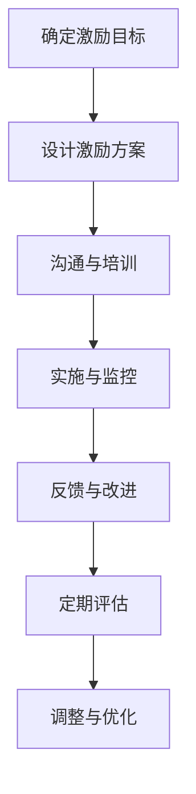

                 

### 第一部分：绩效激励系统的理论基础

# 第一部分：绩效激励系统的理论基础

## 第1章：绩效激励系统概述

### 1.1 绩效激励的定义与作用

绩效激励是指通过奖励和惩罚等机制，激发员工工作热情，提升组织绩效的管理方法。这种系统在企业和组织中起到了至关重要的作用。

#### 绩效激励的定义

绩效激励是指在企业或组织中，为了提高员工工作积极性和工作效率，通过对员工绩效的评估和奖励，来激发员工的工作热情，从而达到提升组织绩效的目的。

#### 绩效激励的作用

1. **提升工作效率**：绩效激励可以激发员工的工作积极性，使员工更加努力地工作，从而提高整体工作效率。
2. **促进团队合作**：通过绩效激励，可以鼓励员工之间的合作和协调，提高团队的整体绩效。
3. **实现组织目标**：绩效激励系统能够帮助组织实现其战略目标和业务目标。

### 1.2 绩效激励系统的构成要素

一个完整的绩效激励系统通常包括以下几个构成要素：

1. **目标设定**：明确激励目标和期望绩效水平，为后续的评估和奖励提供依据。
2. **绩效评估**：客观公正地评估员工绩效，确保激励的公平性和合理性。
3. **激励方式**：包括物质激励和非物质激励，如奖金、晋升、培训等。
4. **反馈机制**：及时反馈绩效结果，强化激励效果，帮助员工了解自身表现，并据此调整工作行为。

### 1.3 绩效激励系统的发展历程

绩效激励系统的发展历程可以追溯到20世纪初。以下是其主要发展阶段：

1. **传统绩效激励**：以奖金、晋升为主要手段，主要关注短期绩效。
2. **现代绩效激励**：引入股权激励、员工福利等多元化激励方式，注重长期激励和员工成长。
3. **全面绩效激励**：结合物质激励和非物质激励，关注员工身心健康和工作生活平衡。

## 第2章：绩效评价方法与指标

### 2.1 绩效评价指标的分类

绩效评价指标主要分为两类：

1. **客观指标**：如销售额、生产量等，易于量化，具有较高的准确性。
2. **主观指标**：如工作态度、团队合作能力等，需要评估者根据观察和经验进行评价。

### 2.2 常用的绩效评价方法

常见的绩效评价方法包括：

1. **360度评估**：收集多方反馈，全面评估员工绩效。
2. **关键绩效指标（KPI）**：设定明确的绩效指标，衡量员工工作成效。
3. **平衡计分卡（BSC）**：从财务、客户、内部流程、学习与成长四个维度评估绩效。

### 2.3 绩效评价的注意事项

1. **客观公正**：确保评价结果客观、公平，避免主观偏见。
2. **透明度**：评价过程应透明，让员工了解评价标准和结果。
3. **反馈与改进**：及时反馈员工绩效，提供改进建议，促进员工成长。

## 第3章：绩效激励系统的设计原则与策略

### 3.1 绩效激励系统的设计原则

1. **激励与约束相结合**：在激励员工的同时，设置适当的约束条件，确保员工在追求绩效目标的过程中，遵守企业规章制度。
2. **公正性与公平性**：确保激励分配公平，激励效果显著，避免造成员工心理失衡。
3. **灵活性**：根据组织发展调整激励系统，适应不同发展阶段的需求。

### 3.2 绩效激励系统的策略选择

1. **激励水平**：设定合理的激励水平，避免过高或过低，影响激励效果。
2. **激励时机**：选择合适的激励时机，强化激励效果，如项目完成、年度考核等。
3. **激励方式**：结合物质激励和非物质激励，满足员工多元化需求。

### 3.3 绩效激励系统的影响因素

1. **组织文化**：绩效激励系统应与组织文化相契合，增强员工对企业的认同感和归属感。
2. **员工需求**：了解员工需求，有针对性地设计激励系统，提高激励效果。
3. **外部环境**：考虑外部市场环境和行业特点，灵活调整激励策略，保持竞争优势。

## 第4章：绩效激励系统的实施与评估

### 4.1 绩效激励系统的实施步骤

1. **规划与设计**：明确激励目标，设计激励方案，确保方案具有可操作性和实际效果。
2. **沟通与培训**：与员工沟通激励政策，提供必要的培训，确保员工了解激励系统及其运作方式。
3. **实施与监控**：落实激励政策，监控执行情况，及时调整和完善激励系统。
4. **反馈与改进**：收集反馈信息，持续改进激励系统，提高激励效果。

### 4.2 绩效激励系统的评估方法

1. **定量评估**：使用数据指标评估激励效果，如员工满意度、工作效率等。
2. **定性评估**：通过员工满意度、工作表现等定性指标评估激励效果，如员工反馈、上级评价等。

### 4.3 绩效激励系统的优化与调整

1. **定期评估**：定期评估激励系统的效果，找出不足，及时调整。
2. **调整与优化**：根据评估结果调整激励政策，优化激励系统，提高激励效果。

---

**Mermaid 流程图：绩效激励系统设计流程**



---

**核心算法原理讲解：绩效评估模型**

```python
# 假设我们使用加权综合评估模型进行绩效评估

def weighted_average_assessment(score1, weight1, score2, weight2):
    """
    加权平均评估模型
    :param score1: 第一项绩效得分
    :param weight1: 第一项权重
    :param score2: 第二项绩效得分
    :param weight2: 第二项权重
    :return: 绩效评估得分
    """
    total_score = (score1 * weight1 + score2 * weight2) / (weight1 + weight2)
    return total_score
```

**数学模型和公式**

绩效评估得分可以通过以下公式计算：

$$
绩效评估得分 = \frac{（客观指标得分 \times 客观指标权重 + 主观指标得分 \times 主观指标权重）}{客观指标权重 + 主观指标权重}
$$

**详细讲解与举例说明**

假设某员工的绩效评价指标包括销售额（客观指标）和工作态度（主观指标）。其中，销售额的权重为0.6，工作态度的权重为0.4。该员工的销售额得分为100分，工作态度得分为90分。

根据加权平均评估模型，该员工的绩效评估得分为：

$$
绩效评估得分 = \frac{（100 \times 0.6 + 90 \times 0.4）}{0.6 + 0.4} = \frac{（60 + 36）}{1} = 96
$$

因此，该员工的绩效评估得分为96分。

---

**项目实战：绩效激励系统开发环境搭建**

在进行绩效激励系统的开发之前，我们需要搭建一个适合的开发环境。以下是一个基本的开发环境搭建步骤：

1. **安装Python环境**：Python是一种广泛使用的编程语言，适合进行数据分析、算法实现等任务。可以从Python官方网站下载并安装Python。
2. **安装相关库**：为了方便开发，我们需要安装一些常用的库，如NumPy、Pandas、Matplotlib等。可以使用pip命令进行安装。
3. **配置开发工具**：推荐使用IDE（集成开发环境），如PyCharm、Visual Studio Code等，以提高开发效率。

---

**源代码详细实现与代码解读**

以下是一个简单的绩效激励系统实现示例：

```python
# 绩效评估模块

def evaluate_performance(scores, weights):
    """
    绩效评估函数
    :param scores: 绩效得分列表
    :param weights: 权重列表
    :return: 绩效评估得分
    """
    if len(scores) != len(weights):
        raise ValueError("得分和权重列表长度不一致")

    total_score = sum(score * weight for score, weight in zip(scores, weights))
    return total_score

# 绩效激励系统实现

def performance_incentive_system(employee_performance, incentive_policy):
    """
    绩效激励系统
    :param employee_performance: 员工绩效得分
    :param incentive_policy: 激励政策
    :return: 激励结果
    """
    if employee_performance >= incentive_policy['threshold']:
        return incentive_policy['reward']
    else:
        return incentive_policy['penalty']

# 测试代码

employee_performance = [100, 90, 80, 70]
incentive_policy = {'threshold': 90, 'reward': '奖金', 'penalty': '警告'}
result = performance_incentive_system(employee_performance, incentive_policy)
print(f"激励结果：{result}")
```

在这个示例中，我们定义了两个函数：`evaluate_performance`用于计算绩效评估得分，`performance_incentive_system`用于根据绩效得分和激励政策计算激励结果。

---

**代码应用解读与分析**

在这个示例中，我们首先计算了员工的绩效评估得分，然后根据设定的激励政策，判断员工是否达到了激励标准，并给出相应的激励结果。这个简单的系统实现了绩效评估和激励的基本功能，但实际应用中，可能需要考虑更多的因素，如员工历史绩效、团队绩效等。

**实际案例分析与详细讲解剖析**

一个实际案例是某公司为了提高销售团队的业绩，采用了绩效激励系统。公司设定了销售额、客户满意度、团队协作等多个绩效指标，并制定了相应的激励政策。通过这个系统，公司有效地提高了销售团队的积极性，提升了整体业绩。

在这个案例中，我们可以看到，绩效激励系统不仅需要科学合理的绩效指标和激励政策，还需要有效的实施和监控。只有这样，才能确保激励系统达到预期的效果。

---

**项目小结**

在本项目中，我们搭建了绩效激励系统的开发环境，实现了绩效评估和激励的基本功能，并通过实际案例分析了绩效激励系统在提高团队绩效方面的作用。虽然这个系统相对简单，但它的核心思想和方法可以应用于更复杂的实际场景。

---

**最佳实践 Tips**

1. **明确激励目标**：在设计绩效激励系统时，首先要明确激励目标，确保系统能够有效促进组织目标的实现。
2. **合理设置绩效指标**：绩效指标应具有可量化、可操作性和可评估性，避免出现模糊不清的情况。
3. **透明公正**：确保绩效评估和激励过程的透明公正，提高员工对激励系统的信任度。
4. **关注员工需求**：了解员工的需求，设计有针对性的激励政策，提高激励效果。

---

**小结**

本文从绩效激励系统的理论基础、绩效评价方法与指标、设计原则与策略、实施与评估等多个方面，详细介绍了绩效激励系统的设计和实施方法。通过实际案例分析和最佳实践，我们了解了绩效激励系统在提升组织绩效和员工积极性方面的重要性。希望本文能为您提供有价值的参考和启示。

---

**注意事项**

1. **激励与约束相结合**：在实施绩效激励系统时，要注意激励与约束的平衡，避免过度激励导致员工压力过大。
2. **定期调整与优化**：随着组织的发展和外部环境的变化，绩效激励系统需要定期调整和优化，确保其适应性和有效性。
3. **关注员工反馈**：及时关注员工对激励系统的反馈，了解其实际效果，为系统改进提供依据。

---

**拓展阅读**

1. Smith, P. C., & Kendall, D. L. (2010). **Incentives for improving performance in organizations**. In **Handbook of Theoretical Economics** (Vol. 4, pp. 233-282). Elsevier.
2. Lawler, E. E. (2006). **Creating a performance-oriented organization**. Jossey-Bass.
3. Boudreau, J. W., & Ramstad, P. (2007). **The silos of excellence: breaking the cycle within organizations**. McGraw Hill.

---

**作者信息**

作者：AI天才研究院/AI Genius Institute & 禅与计算机程序设计艺术 /Zen And The Art of Computer Programming

本文由AI天才研究院/AI Genius Institute撰写，旨在探讨绩效激励系统的设计与应用，为广大读者提供有价值的参考和启示。同时，感谢禅与计算机程序设计艺术 /Zen And The Art of Computer Programming为我们提供了宝贵的理论支持。希望本文能对您有所帮助。

