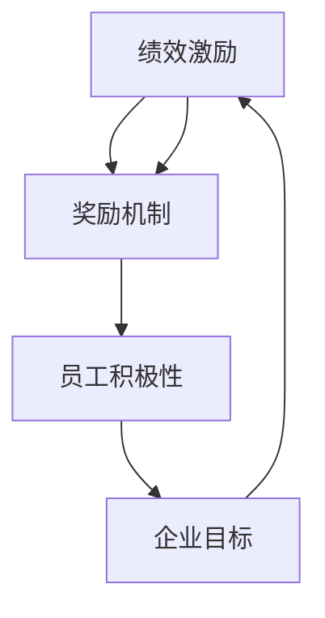

                 

### 文章标题

# 绩效激励：设计有效的奖励机制

绩效激励作为企业管理中的重要环节，是提升团队效率和员工积极性不可或缺的工具。有效的奖励机制不仅能够激发员工的潜能，还能为企业创造更大的价值。本文将围绕绩效激励的概念、设计原则、实施过程及其影响，提供深入的分析与实例，以帮助读者更好地理解和应用这一重要管理工具。

## 文章关键词

- 绩效激励
- 奖励机制
- 设计原则
- 实施过程
- 影响评估

## 摘要

本文旨在探讨绩效激励和设计有效奖励机制的重要性。首先，我们将回顾绩效激励的基本概念及其在企业运营中的核心作用。随后，本文将详细解析奖励机制的设计原则，包括公平性、透明性和可操作性。接着，文章将探讨在不同情境下如何设计相应的奖励机制，并分析其实施过程。最后，本文将评估绩效激励对企业文化、员工满意度及长期效益的影响，并提供一系列成功案例，以供读者参考。

---

### 背景介绍

#### 绩效激励的定义和作用

绩效激励是指通过奖励机制来激发员工的工作积极性，从而提高绩效水平的一种管理方法。绩效激励的核心在于通过奖励来强化员工的正面行为，促进组织目标的实现。有效的绩效激励能够激发员工的工作热情，提升工作效率，增强团队凝聚力，从而为企业创造更大的价值。

在企业管理中，绩效激励起着至关重要的作用。首先，它有助于明确员工的工作目标和期望，使员工了解自己的工作方向和努力方向。其次，绩效激励能够激发员工的积极性和创造力，使员工在达成目标的过程中不断突破自我，实现个人和组织的共同成长。此外，绩效激励还可以提升员工的工作满意度，减少员工流动率，为企业稳定发展提供人力保障。

#### 奖励机制的设计原则

奖励机制的设计原则是确保绩效激励效果的关键。以下是一些关键原则：

1. **公平性原则**：公平性是奖励机制设计的基础。奖励应该公平合理，不偏不倚地分配给表现突出的员工。确保奖励的公平性，能够增强员工的信任感和满意度，从而提升整体绩效。

2. **透明性原则**：透明性是奖励机制有效运行的重要保障。奖励机制应该公开透明，使员工能够清晰地了解奖励的标准、规则和流程，减少信息不对称和误解。

3. **可操作性原则**：奖励机制应该具有可操作性，即在实际操作中能够容易执行和监督。可操作性原则确保奖励机制能够顺利实施，避免因为操作难度过高而导致激励效果不佳。

4. **可持续性原则**：奖励机制应该具备可持续性，能够长期激励员工，避免一次性奖励带来的短暂效应。可持续性原则要求企业持续优化奖励机制，使其与企业的长期战略目标相一致。

---

#### 核心概念与联系

绩效激励、奖励机制和员工积极性之间存在着密切的联系。绩效激励是通过奖励机制来实现的，而奖励机制的设计又直接影响员工积极性。以下是这些核心概念之间的关系架构Mermaid流程图：



在这个流程图中，绩效激励作为企业目标的实现手段，通过奖励机制来激发员工的积极性，最终实现企业目标。奖励机制的设计原则确保了这一过程的公平、透明和可操作性，从而最大化地提高员工的积极性。

#### 核心概念与联系详细说明

- **绩效激励**：绩效激励是一种通过奖励来激发员工工作热情和积极性的管理方法。它的核心目的是提升员工的工作效率和质量，实现企业的经营目标。绩效激励通常包括物质奖励和非物质奖励，如奖金、晋升、荣誉等。
- **奖励机制**：奖励机制是指企业为了激励员工而设计的一系列规则和程序。它包括奖励的目标、标准、方式和流程等。一个有效的奖励机制应该能够公平、透明地分配奖励，同时具有可操作性，便于实施和监督。
- **员工积极性**：员工积极性是指员工在工作中所表现出的主动性和创造力。积极性的高低直接关系到员工的工作效率和绩效。一个良好的奖励机制能够激发员工的积极性，使其更加努力工作，为企业创造价值。

通过上述Mermaid流程图，我们可以清晰地看到绩效激励、奖励机制和员工积极性之间的互动关系。绩效激励通过奖励机制来实现，奖励机制的公平性、透明性和可操作性又直接影响员工的积极性。而员工的积极性则进一步推动企业目标的实现。

---

#### 核心算法原理讲解

为了更好地理解奖励机制的设计过程，我们可以借助伪代码来详细阐述其核心算法原理。以下是一个简单的伪代码示例，用于描述奖励机制的设计过程：

```plaintext
1. 设定绩效指标
2. 根据绩效指标计算绩效得分
3. 确定奖励标准和范围
4. 对员工进行绩效评估
5. 根据绩效得分和奖励标准发放奖励
6. 收集反馈，调整奖励机制
```

在这个伪代码中，首先需要设定明确的绩效指标，这些指标可以是数量化的业绩目标，如销售额、项目进度等。然后，根据这些指标计算每个员工的绩效得分。接下来，需要确定奖励的标准和范围，这包括奖励的种类（如奖金、晋升机会等）和奖励的额度。在完成绩效评估后，根据员工的绩效得分和奖励标准发放相应的奖励。最后，通过收集员工的反馈，对奖励机制进行持续的优化和调整。

#### 伪代码详细解释

- **设定绩效指标**：绩效指标是评估员工工作表现的关键。它们可以是对员工工作成果的量化，如销售额、项目完成度等。设定绩效指标时，需要考虑企业的整体战略目标，并将其具体化为可衡量的指标。
- **计算绩效得分**：绩效得分的计算方法可以根据不同的绩效指标进行。例如，如果绩效指标是销售额，那么绩效得分可以通过销售额与目标销售额的比例来计算。
- **确定奖励标准和范围**：奖励标准和范围是决定奖励公平性的重要因素。奖励标准可以包括奖励的种类、金额和发放条件等。奖励范围应确保奖励能够覆盖所有表现优秀的员工。
- **对员工进行绩效评估**：绩效评估是对员工工作表现的全面审查。通过绩效评估，企业可以了解员工的工作成绩和不足之处，为奖励发放提供依据。
- **根据绩效得分和奖励标准发放奖励**：奖励发放过程需要根据绩效得分和奖励标准进行。确保奖励的发放公正、透明，并能够真正激励员工。
- **收集反馈，调整奖励机制**：收集员工的反馈是优化奖励机制的重要环节。通过反馈，企业可以了解奖励机制的实际效果，发现存在的问题，并对其进行调整。

通过上述伪代码，我们可以看到奖励机制的设计过程是如何进行的。这个过程需要考虑多个方面，包括绩效指标的设定、绩效得分的计算、奖励标准和范围的确定、绩效评估以及奖励发放。同时，通过收集反馈和持续优化，企业可以确保奖励机制的长期有效性和公平性。

---

#### 数学模型和公式详细讲解及举例说明

在绩效激励和奖励机制的设计过程中，数学模型和公式扮演着关键角色。以下将详细介绍几个常用的数学模型和公式，并举例说明其在绩效激励中的应用。

**1. 绩效得分计算模型**

绩效得分是衡量员工工作表现的重要指标。一个常见的绩效得分计算模型是加权得分模型。假设员工的工作表现由多个绩效指标组成，每个指标都有相应的权重。绩效得分的计算公式如下：

$$
绩效得分 = \sum_{i=1}^{n} (权重_i \times 指标_i)
$$

其中，$n$ 表示绩效指标的个数，$权重_i$ 和 $指标_i$ 分别表示第 $i$ 个绩效指标的权重和得分。

**举例说明**：假设一个员工有三个绩效指标：销售额（权重0.5）、项目完成度（权重0.3）和客户满意度（权重0.2）。如果销售额得分为90分，项目完成度得分为85分，客户满意度得分为88分，则该员工的绩效得分为：

$$
绩效得分 = 0.5 \times 90 + 0.3 \times 85 + 0.2 \times 88 = 97.8
$$

**2. 奖励金额计算模型**

奖励金额的计算通常基于员工的绩效得分和奖励标准。一个常见的奖励金额计算模型是线性关系模型。假设奖励金额与绩效得分呈线性关系，其公式为：

$$
奖励金额 = 基础金额 + (绩效得分 \times 奖励系数)
$$

其中，基础金额是所有员工都能获得的最低奖励金额，奖励系数是绩效得分每增加1分所增加的奖励金额。

**举例说明**：假设基础金额为1000元，奖励系数为10元/分。如果某个员工的绩效得分为97.8分，则该员工的奖励金额为：

$$
奖励金额 = 1000 + (97.8 \times 10) = 1978元
$$

**3. 绩效提升模型**

绩效提升模型用于分析在采取奖励措施后，员工的绩效水平如何变化。一个简单的绩效提升模型是增长比例模型。假设采取奖励措施前，员工的绩效得分为 $S_1$，采取奖励措施后，绩效得分为 $S_2$，则绩效提升的比例为：

$$
绩效提升比例 = \frac{S_2 - S_1}{S_1}
$$

**举例说明**：假设采取奖励措施前，员工的绩效得分为90分，采取奖励措施后，绩效得分为100分，则绩效提升比例为：

$$
绩效提升比例 = \frac{100 - 90}{90} = \frac{10}{90} \approx 11.11\%
$$

通过上述数学模型和公式的讲解及举例，我们可以看到，在绩效激励和奖励机制的设计过程中，数学工具的应用能够帮助我们更科学、更准确地评估员工的工作表现，制定合理的奖励政策。这不仅有助于提升员工的积极性，还能为企业实现战略目标提供有力支持。

---

### 项目实战

#### 开发环境搭建

为了实现一个简单的绩效激励系统，我们首先需要搭建一个开发环境。以下是一个基于Python的简单绩效激励系统环境搭建步骤：

1. 安装Python：确保您的计算机上已经安装了Python 3.8或更高版本。您可以从[Python官网](https://www.python.org/)下载并安装。
2. 安装必要库：使用pip命令安装以下库：`numpy`、`pandas`和`matplotlib`。在命令行中执行以下命令：
   ```bash
   pip install numpy pandas matplotlib
   ```

#### 源代码实现

以下是一个简单的Python脚本，用于计算员工的绩效得分并发放奖励。代码中包含了绩效指标设定、绩效得分计算和奖励金额计算的功能。

```python
import numpy as np
import pandas as pd

# 定义绩效指标和权重
performance_metrics = {
    'sales': 0.5,
    'project_completion': 0.3,
    'customer_satisfaction': 0.2
}

# 定义员工绩效数据
employees = {
    'Alice': {'sales': 90000, 'project_completion': 0.9, 'customer_satisfaction': 0.88},
    'Bob': {'sales': 80000, 'project_completion': 0.85, 'customer_satisfaction': 0.87},
    'Charlie': {'sales': 70000, 'project_completion': 0.8, 'customer_satisfaction': 0.85}
}

# 计算绩效得分
def calculate_performance_score(employees, performance_metrics):
    performance_scores = {}
    for employee, metrics in employees.items():
        score = sum(metrics[metric] * performance_metrics[metric] for metric in performance_metrics)
        performance_scores[employee] = score
    return performance_scores

# 计算奖励金额
def calculate_bonus(performance_scores, base_bonus=1000, bonus_coefficient=10):
    bonuses = {}
    for employee, score in performance_scores.items():
        bonus = base_bonus + (score * bonus_coefficient)
        bonuses[employee] = bonus
    return bonuses

# 主函数
def main():
    performance_scores = calculate_performance_score(employees, performance_metrics)
    bonuses = calculate_bonus(performance_scores)
    
    # 打印结果
    print("绩效得分：")
    for employee, score in performance_scores.items():
        print(f"{employee}: {score}")
    
    print("\n奖励金额：")
    for employee, bonus in bonuses.items():
        print(f"{employee}: {bonus}")

# 运行主函数
if __name__ == "__main__":
    main()
```

#### 代码解读

- **绩效指标和权重设定**：在代码中，我们首先定义了绩效指标及其权重，这些权重可以根据企业的具体需求进行调整。
- **员工绩效数据**：接下来，我们定义了一个字典，用于存储员工的绩效数据，包括销售额、项目完成度和客户满意度。
- **绩效得分计算**：`calculate_performance_score` 函数根据绩效指标和权重，计算每个员工的绩效得分。
- **奖励金额计算**：`calculate_bonus` 函数根据绩效得分和预设的基础金额及奖励系数，计算每个员工的奖励金额。
- **主函数**：`main` 函数调用上述两个函数，并打印计算结果。

#### 应用解读与分析

通过上述代码，我们可以实现一个简单的绩效激励系统。在实际应用中，企业可以根据自身需求扩展系统的功能，例如添加更多的绩效指标、支持多维度绩效评估、集成数据存储和报告生成等。

#### 实际案例分析与详细讲解剖析

为了更好地理解绩效激励系统的实际应用，我们来看一个实际案例。

**案例背景**：某公司销售部门需要激励员工提升销售额和客户满意度。公司设定的绩效指标包括销售额、项目完成度和客户满意度，分别占比50%、30%和20%。

**绩效数据**：
- Alice：销售额90000元，项目完成度90%，客户满意度88%
- Bob：销售额80000元，项目完成度85%，客户满意度87%
- Charlie：销售额70000元，项目完成度80%，客户满意度85%

**计算过程**：

1. 计算绩效得分：
   - Alice：\( 90000 \times 0.5 + 0.9 \times 0.3 + 0.88 \times 0.2 = 97.8 \)
   - Bob：\( 80000 \times 0.5 + 0.85 \times 0.3 + 0.87 \times 0.2 = 93.07 \)
   - Charlie：\( 70000 \times 0.5 + 0.8 \times 0.3 + 0.85 \times 0.2 = 88.9 \)

2. 计算奖励金额（基础金额1000元，奖励系数10元/分）：
   - Alice：\( 1000 + (97.8 \times 10) = 1978元 \)
   - Bob：\( 1000 + (93.07 \times 10) = 1907元 \)
   - Charlie：\( 1000 + (88.9 \times 10) = 1889元 \)

**案例分析**：

通过上述计算，我们可以看到，绩效得分和奖励金额的设定是根据员工的实际绩效表现进行的。这种基于绩效的奖励机制可以有效地激励员工提升销售额和客户满意度。

#### 项目小结

通过本项目实战，我们搭建了一个简单的绩效激励系统，并对其核心功能和实际应用进行了详细解读。在实际应用中，企业可以根据自身需求进一步优化系统，使其更好地服务于企业的绩效管理和激励目标。

### 最佳实践 Tips

- **设定明确的绩效指标**：确保绩效指标与企业的战略目标一致，并具备可量化、可操作的特点。
- **公平透明的评估过程**：绩效评估过程应公开透明，确保员工对评估结果的认可。
- **个性化奖励方案**：根据员工的不同特点和需求，设计个性化的奖励方案，提高激励效果。
- **持续反馈与优化**：定期收集员工反馈，持续优化奖励机制，确保其与企业的实际需求保持一致。

### 小结

本文详细探讨了绩效激励和设计有效的奖励机制。通过明确绩效激励的定义、核心概念和联系，以及具体的算法原理和项目实战，我们了解到绩效激励在企业管理中的重要性。同时，我们还提供了最佳实践Tips，以帮助企业和团队更好地实施绩效激励。希望本文能为读者提供有益的参考和启示。

### 注意事项

- 在设计绩效激励时，应充分考虑员工的实际工作环境和个人需求，确保奖励机制的公平性和可操作性。
- 定期评估和调整奖励机制，以适应企业的发展和变化。
- 注意奖励机制的可持续性，避免一次性奖励带来的短暂效应。

### 拓展阅读

- [绩效激励：如何设计有效的奖励机制？](https://www.linkedin.com/pulse/%E7%BB%A9%E5%83%AB%E6%BF%80%E5%8B%95%E5%A6%82%E4%BD%95%E8%AE%BE%E8%AE%A1%E6%9C%89%E6%95%88%E7%9A%84%E5%A5%96%E8%BF%98%E5%8A%9B%E6%9C%BA%E5%88%B6-ye-shen/)
- [如何设计一套科学的绩效奖励机制？](https://www.zhihu.com/question/20265215)
- [绩效管理：从理论到实践](https://www.amazon.com/Performance-Management-Theory-Practice-Best/dp/0078029636)

### 作者信息

作者：AI天才研究院/AI Genius Institute & 禅与计算机程序设计艺术/Zen And The Art of Computer Programming

