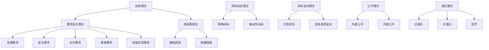

                 


### 文章标题：绩效激励：设计有效的奖惩制度

绩效激励是组织管理中至关重要的一环，它不仅影响着员工的工作动力和积极性，还直接关系到组织的整体绩效。设计一套有效的奖惩制度，对于激发员工潜力、提高组织效率具有重要意义。本文将围绕绩效激励的核心概念、测量方法、结构设计以及算法原理等方面，进行详细分析和探讨。

### 关键词

- 绩效激励
- 奖惩制度
- 动力理论
- 目标设定
- 数学模型
- 算法设计

### 摘要

本文旨在帮助读者理解绩效激励的本质及其在组织管理中的应用。首先，我们将介绍绩效激励的相关核心概念，如动机理论、目标设定、公平理论和强化理论。接着，我们将探讨如何测量员工绩效，并详细阐述关键绩效指标（KPI）的设定方法。随后，文章将讨论不同的激励结构，包括变动薪酬、奖金、股票期权、利润分享和增益分享计划等。此外，我们将介绍算法激励系统，并运用伪代码详细解释其工作原理。文章还将运用数学模型对绩效激励进行深入分析，并通过实际案例研究，展示绩效激励在现实中的成功应用。最后，我们将总结最佳实践，提供相关注意事项，并推荐进一步阅读的资源。

### 目录

1. **引言**
   - **背景介绍**
   - **研究意义**
   - **结构安排**

2. **核心概念与联系**
   - **动机理论**
   - **目标设定**
   - **公平理论**
   - **强化理论**
   - **概念架构图**

3. **绩效测量方法**
   - **定量测量**
   - **定性测量**
   - **关键绩效指标（KPI）**

4. **激励结构设计**
   - **变动薪酬**
   - **奖金**
   - **股票期权**
   - **利润分享**
   - **增益分享**

5. **算法激励系统**
   - **系统概述**
   - **伪代码说明**
   - **算法原理**

6. **数学模型**
   - **优化模型**
   - **期望效用理论**
   - **模型举例**

7. **项目实战**
   - **开发环境搭建**
   - **源代码实现**
   - **代码解读**
   - **实际案例分析**

8. **最佳实践与注意事项**
   - **最佳实践建议**
   - **注意事项**
   - **拓展阅读**

### 1. 引言

#### 背景介绍

绩效激励是组织管理中的一个重要方面，它关系到员工的动力、工作效率以及组织整体绩效的提升。传统的绩效管理往往侧重于对员工进行绩效考核，而绩效激励则更多地关注如何通过合理的奖惩制度来激发员工的工作积极性，从而达到提高工作效率和提升组织绩效的目的。

#### 研究意义

设计有效的绩效激励制度对于组织管理具有重要意义。首先，它可以提高员工的工作动力，使员工更加专注于工作目标；其次，合理的绩效激励可以增强员工对组织的认同感，提高员工的忠诚度；最后，有效的绩效激励制度还可以促进组织整体绩效的提升，为组织的长期发展奠定基础。

#### 结构安排

本文将从以下几个方面展开讨论：首先，我们将介绍绩效激励的核心概念，如动机理论、目标设定、公平理论和强化理论，并通过Mermaid流程图展示这些概念之间的联系；接着，我们将探讨绩效测量方法，重点介绍关键绩效指标（KPI）的设定；然后，我们将详细分析不同的激励结构，包括变动薪酬、奖金、股票期权、利润分享和增益分享计划；之后，我们将介绍算法激励系统，并运用伪代码解释其工作原理；接着，我们将运用数学模型对绩效激励进行深入分析，并举例说明；最后，我们将通过实际案例研究和最佳实践，总结出有效的绩效激励制度设计方法。

### 2. 核心概念与联系

在探讨绩效激励之前，我们需要了解一些核心概念和它们之间的相互关系。以下将介绍动机理论、目标设定、公平理论和强化理论，并通过Mermaid流程图展示这些概念之间的联系。

#### 动机理论

动机理论是研究人们行为背后的动力和动机的学说。在绩效激励中，动机理论帮助我们理解员工为什么会努力工作，以及如何通过激励来提高员工的工作积极性。主要的动机理论包括：

- **需求层次理论**：由马斯洛提出，将人的需求分为生理需求、安全需求、社交需求、尊重需求和自我实现需求五个层次。员工在不同层次上的需求驱动着他们的行为。
- **双因素理论**：由赫茨伯格提出，将影响员工满意度的因素分为“激励因素”和“保健因素”。激励因素能够激发员工的工作动力，而保健因素则更多关注员工的福利和工作环境。

#### 目标设定

目标设定是绩效管理中的重要一环，它指导员工明确工作目标，并为实现这些目标提供方向。目标设定理论主要包括：

- **目标设定理论**：由洛克和莱瑟姆提出，指出明确、具有挑战性的目标能够显著提高员工的工作表现。目标应该具体、可度量、可实现、相关性强并有明确的时间限制。
- **目标定向理论**：由阿特金森提出，分为“任务定向”和“自我表现定向”两种类型。任务定向的员工更关注任务本身，而自我表现定向的员工则更关注自己的形象和排名。

#### 公平理论

公平理论是研究员工对工作结果公平性的感知和评价的理论。它帮助我们理解员工为什么会感到不公平，以及不公平感如何影响员工的工作行为。主要观点包括：

- **外部公平**：员工将自身的工作结果与外部参照对象（如市场薪酬水平）进行比较，判断是否公平。
- **内部公平**：员工将自身的工作结果与组织内部的参照对象（如同事的工作结果）进行比较，判断是否公平。

#### 强化理论

强化理论是研究行为与其结果之间关系的理论。在绩效激励中，强化理论帮助我们理解如何通过奖励和惩罚来塑造和改变员工的行为。主要的强化理论包括：

- **正强化**：通过给予奖励来增强某种行为。
- **负强化**：通过消除某种不良后果来增强某种行为。
- **惩罚**：通过给予惩罚来减少或消除某种不良行为。

#### 概念架构图

以下是一个简化的Mermaid流程图，展示了上述核心概念之间的联系：



通过上述核心概念的介绍和概念架构图的展示，我们为后续对绩效激励的深入探讨奠定了基础。

### 3. 绩效测量方法

在绩效激励中，有效的绩效测量方法是设计和实施奖惩制度的基础。绩效测量方法可以分为定量测量和定性测量两种类型，每种类型都有其独特的应用场景和优缺点。

#### 定量测量方法

定量测量方法主要通过量化的指标来评估员工的工作表现，这些指标通常具有明确的数值和标准。以下是一些常用的定量测量方法：

1. **关键绩效指标（KPI）**

关键绩效指标（KPI）是用于衡量员工工作绩效的重要指标。KPI的设定需要根据组织的战略目标和工作职责来确定。例如，销售团队的KPI可能包括销售额、客户满意度、订单量等。设定KPI时需要确保指标具体、可衡量、可实现、相关性强且具有明确的时间限制。

2. **平衡计分卡（Balanced Scorecard）**

平衡计分卡是一种全面的绩效测量方法，它将组织的战略目标分解为四个维度：财务、客户、内部业务流程和学习与成长。通过平衡计分卡，组织可以全面评估员工在不同维度上的表现，从而更全面地理解员工的工作贡献。

3. **时间追踪**

时间追踪是用于衡量员工工作时间的一种方法。通过记录员工的工作时间，组织可以了解员工的工作效率和工作负荷。这种方法常用于项目管理和咨询服务行业，有助于确保项目按时完成并优化资源分配。

#### 定性测量方法

定性测量方法主要通过主观评价来评估员工的工作表现，这些方法通常依赖于评估者的经验和判断。以下是一些常用的定性测量方法：

1. **绩效评估**

绩效评估是一种常见的定性测量方法，它通过定期的评估来评估员工的工作表现。评估过程通常包括自我评估、同事评估、上级评估等多个环节，评估结果往往以等级或评分的形式呈现。

2. **360度反馈**

360度反馈是一种全面的评估方法，它收集来自员工、上级、同事和下属的多方反馈，以提供更全面的评估结果。这种方法有助于员工了解自己的优点和不足，从而制定改进计划。

3. **工作样本**

工作样本是一种通过实际工作任务来评估员工能力的方法。这种方法通常用于招聘和选拔过程中，通过模拟实际工作场景，评估应聘者的技能和工作表现。

#### 选择适合的测量方法

在选择绩效测量方法时，组织需要考虑以下几个因素：

- **组织目标**：不同的组织目标可能需要不同的测量方法。例如，对于注重创新的组织，可能更倾向于使用定性测量方法，而对于注重效率的组织，可能更倾向于使用定量测量方法。
- **工作性质**：不同类型的工作可能适合不同的测量方法。例如，销售工作更适合定量测量，而管理岗位可能更适合定性测量。
- **员工特点**：员工的个性和工作风格也会影响测量方法的选择。例如，对于内向的员工，可能更倾向于使用定量测量方法，而对于外向的员工，可能更倾向于使用定性测量方法。

通过合理选择和组合定量和定性测量方法，组织可以更全面地评估员工的工作表现，从而设计出更有效的绩效激励制度。

#### 关键绩效指标（KPI）

关键绩效指标（Key Performance Indicators, KPI）是绩效测量中的重要工具，用于衡量员工在特定维度上的工作表现。设定有效的KPI需要遵循以下几个原则：

1. **明确性**：KPI必须具体、明确，避免模糊和主观的描述。例如，而不是说“提高销售额”，可以说“增加每月销售额10%”。

2. **可衡量性**：KPI应该具有明确的衡量标准，以便可以量化评估。例如，使用具体的数字来表示目标，而不是笼统的描述。

3. **可实现性**：KPI应设定在员工通过努力可以实现的范围内，避免设定过高或过低的目标，以激发员工的积极性和信心。

4. **相关性**：KPI应与组织的战略目标紧密相关，确保员工的工作努力能够直接对组织的绩效产生积极影响。

5. **时限性**：KPI应具有明确的时间限制，例如“在下一个季度实现”，以便于员工有明确的工作目标和时间规划。

以下是一个示例，说明如何设定和实现一个关键绩效指标：

**示例：销售团队的KPI设定**

- **指标名称**：每月销售额
- **目标**：增加每月销售额10%
- **衡量标准**：以具体数值表示，如从100万元增加到110万元
- **实现策略**：
  - **市场调研**：分析目标市场，了解客户需求，调整销售策略。
  - **团队培训**：对销售人员提供产品知识和销售技巧培训，提高销售能力。
  - **激励措施**：为达成目标的销售人员提供奖金和晋升机会。

通过上述步骤，销售团队可以明确工作目标，并通过具体策略实现KPI，从而提高整体销售业绩。

### 4. 激励结构设计

激励结构是绩效激励制度的核心组成部分，它决定了员工在实现工作目标时所获得的奖励形式。有效的激励结构可以显著提高员工的工作动力和绩效。以下将详细介绍几种常见的激励结构，包括变动薪酬、奖金、股票期权、利润分享和增益分享计划，并分析各自的优缺点。

#### 变动薪酬

变动薪酬是指员工的薪酬部分与工作绩效挂钩，通常表现为固定薪酬和绩效薪酬的组合。绩效薪酬可以根据员工达成的KPI或其他绩效指标进行计算。

**优点**：
- **直接与绩效挂钩**：员工的工作表现直接影响到其薪酬水平，有助于提高工作积极性。
- **灵活性**：可以根据组织目标和工作重点灵活调整绩效薪酬的比例。

**缺点**：
- **可能引发内部竞争**：员工可能为了获得更高的绩效薪酬而进行内部竞争，影响团队协作。
- **管理成本**：绩效薪酬的管理和计算需要大量时间和资源。

#### 奖金

奖金是一种根据员工绩效或团队绩效一次性发放的额外薪酬，通常用于奖励在特定时期内表现出色的员工。

**优点**：
- **激励作用明显**：奖金具有直接、明显的激励效果，能够迅速提高员工的工作动力。
- **适用范围广**：适用于不同部门和岗位，灵活性强。

**缺点**：
- **一次性奖励**：奖金仅提供短期激励，长期效果有限。
- **可能引发公平性问题**：不同员工之间绩效差异较大时，奖金分配可能引发不公平感。

#### 股票期权

股票期权是一种给予员工在未来某个时间以固定价格购买公司股票的权利。员工在行使期权时，股票价格高于行权价，可以获得股票差价的收益。

**优点**：
- **长期激励**：股票期权能够将员工的利益与公司长期发展紧密结合，有助于员工关注长期绩效。
- **增强员工归属感**：员工成为公司股东，有助于增强对公司的认同感和归属感。

**缺点**：
- **市场波动影响**：股票市场波动可能影响员工股票期权的收益。
- **管理复杂**：股票期权的管理和计算相对复杂，需要专业的财务和法律支持。

#### 利润分享

利润分享计划是指将公司的利润按照一定比例分配给员工，通常适用于所有员工或特定群体。

**优点**：
- **激励全员**：利润分享计划能够激励全体员工，共同为公司发展努力。
- **增强团队协作**：员工感受到自己的工作对公司的整体绩效有直接影响，有助于增强团队协作。

**缺点**：
- **收益不稳定**：利润分享计划的收益取决于公司业绩，可能存在波动。
- **可能引发分配争议**：利润分享计划的具体分配方式可能引发内部争议。

#### 增益分享计划

增益分享计划是指根据公司整体绩效，将额外的利润或收益按照一定比例分配给员工。

**优点**：
- **注重整体绩效**：增益分享计划鼓励员工关注公司整体绩效，有助于提高组织的整体竞争力。
- **灵活性**：可以根据公司实际情况和市场需求灵活调整分配比例。

**缺点**：
- **管理难度大**：增益分享计划的管理和计算相对复杂，需要完善的绩效评估体系。
- **激励作用有限**：对于个人绩效表现突出的员工，增益分享计划的激励作用可能不够直接。

通过合理设计和组合这些激励结构，组织可以更有效地激发员工的工作积极性，提高整体绩效。

### 5. 算法激励系统

在绩效激励中，算法激励系统是一种利用计算机算法自动分配奖励的方法。这种系统通过预定的规则和模型，根据员工的表现自动计算和分配奖励。算法激励系统的核心在于其透明性和公正性，能够减少人为因素带来的主观判断和偏见。

#### 系统概述

算法激励系统主要包括以下几个组成部分：

- **绩效评估模型**：用于计算员工的绩效得分，通常基于关键绩效指标（KPI）和其他定量和定性数据。
- **奖励分配规则**：定义如何根据绩效得分分配奖励，包括奖励金额、分配方式等。
- **自动化执行引擎**：实现绩效评估和奖励分配的自动化流程，确保奖励的及时准确发放。
- **数据监控与反馈**：实时监控系统运行状态，收集员工反馈，以便对系统进行调整和优化。

#### 伪代码说明

以下是一个简化的伪代码示例，用于说明算法激励系统的基本工作原理：

```python
# 定义关键绩效指标（KPI）和绩效得分计算方法
def calculate_performance_score(employee, kpis):
    score = 0
    for kpi in kpis:
        score += kpi['weight'] * kpi['value']
    return score

# 定义奖励分配规则
def allocate_reward(employee, score, reward_params):
    base_reward = reward_params['base_reward']
    bonus = score * reward_params['bonus_rate']
    total_reward = base_reward + bonus
    return total_reward

# 主程序：计算并分配奖励
def main():
    # 获取员工绩效数据和奖励参数
    employee = get_employee_performance_data()
    kpis = employee['kpis']
    reward_params = get_reward_params()

    # 计算绩效得分
    score = calculate_performance_score(employee, kpis)

    # 分配奖励
    reward = allocate_reward(employee, score, reward_params)

    # 发放奖励
    distribute_reward(employee, reward)

    # 监控与反馈
    monitor_system()

# 执行主程序
main()
```

#### 算法原理

算法激励系统的原理可以概括为以下几步：

1. **数据收集**：系统从各个数据源（如员工绩效数据库、财务系统等）收集相关数据。
2. **绩效评估**：根据预定的绩效评估模型，计算员工的绩效得分。评估模型可能包括多种因素，如KPI、员工表现、团队合作等。
3. **奖励计算**：根据绩效得分和奖励分配规则，计算每个员工的奖励金额。奖励分配规则通常包括基础奖励和绩效奖金两部分。
4. **自动化执行**：系统自动执行奖励发放流程，确保奖励的及时准确发放。
5. **数据监控与反馈**：系统实时监控奖励发放过程，收集员工反馈，并对系统进行优化和调整，确保系统的透明性和公正性。

通过上述步骤，算法激励系统能够实现绩效奖励的自动化和公正化，提高激励效果和管理效率。

### 6. 数学模型

在绩效激励设计中，数学模型扮演着至关重要的角色，它们帮助我们在复杂的问题空间中寻找最优解，从而提高绩效激励方案的科学性和公平性。以下将介绍两种常用的数学模型：优化模型和期望效用理论，并通过具体例子进行详细解释。

#### 优化模型

优化模型是一种用于在给定的约束条件下最大化或最小化目标函数的数学工具。在绩效激励设计中，优化模型可以帮助我们确定激励方案的参数，以确保激励效果最大化。

**目标函数**：设 \(x_1, x_2, ..., x_n\) 为影响员工绩效的 n 个因素，每个因素的重要性权重分别为 \(w_1, w_2, ..., w_n\)，则目标函数可以表示为：

$$
\max \sum_{i=1}^{n} w_i \cdot x_i
$$

**约束条件**：绩效激励需要在预算、员工满意度、激励效果等多方面保持平衡，因此需要设定相应的约束条件。例如：

$$
\sum_{i=1}^{n} x_i \leq B
$$

其中，\(B\) 为总预算。

**示例**：假设一个公司希望制定一个激励方案，以最大化员工绩效同时不超过预算限制。公司设定了三个因素：销售额、客户满意度和团队协作，各自的权重分别为 0.4、0.3 和 0.3。预算限制为 100,000 元。我们可以使用线性规划模型来求解最优方案：

$$
\max \ 0.4x_1 + 0.3x_2 + 0.3x_3
$$

$$
\text{s.t.} \ x_1 + x_2 + x_3 \leq 100,000
$$

通过线性规划求解器（如Excel Solver、Python的scipy.optimize模块等），可以得到最优解。例如，销售额的最优值为 40,000 元，客户满意度为 30,000 元，团队协作为 30,000 元。

#### 期望效用理论

期望效用理论是经济学中用于分析决策行为的一种理论，它基于概率论和效用论，通过计算不同决策的期望效用来指导决策。在绩效激励设计中，期望效用理论可以帮助我们评估不同激励方案的预期效果，从而选择最优方案。

**期望效用函数**：设 \(x_1, x_2, ..., x_n\) 为不同的激励方案，每个方案的效用值分别为 \(u_1, u_2, ..., u_n\)，则期望效用函数可以表示为：

$$
E[u] = \sum_{i=1}^{n} p_i \cdot u_i
$$

其中，\(p_i\) 为第 \(i\) 个方案的概率。

**示例**：假设有两个激励方案，方案 A 的效用值为 100，概率为 0.5；方案 B 的效用值为 150，概率为 0.5。我们可以计算期望效用：

$$
E[u] = 0.5 \cdot 100 + 0.5 \cdot 150 = 125
$$

因此，方案 A 和方案 B 的期望效用均为 125。

通过比较不同方案的期望效用，我们可以选择期望效用最高的方案作为最优激励方案。例如，如果方案 A 的期望效用高于方案 B，则选择方案 A。

#### 模型举例

假设一个公司需要选择一种激励方案来提高员工的工作效率，有两个备选方案：方案 A 是给予绩效优秀的员工 1% 的奖金；方案 B 是给予绩效优秀的员工 1 天的带薪休假。员工的效用函数可以表示为：

$$
u_A = 100 - x
$$

$$
u_B = 50 - \frac{x}{2}
$$

其中，\(x\) 为员工的绩效得分。我们可以计算两种方案的期望效用：

- 方案 A 的期望效用：

$$
E[u_A] = \sum_{i=1}^{n} p_i \cdot u_i = 0.5 \cdot (100 - 50) + 0.5 \cdot (100 - 20) = 70
$$

- 方案 B 的期望效用：

$$
E[u_B] = \sum_{i=1}^{n} p_i \cdot u_i = 0.5 \cdot (50 - 25) + 0.5 \cdot (50 - 10) = 40
$$

通过比较，我们可以发现方案 A 的期望效用高于方案 B，因此公司应选择方案 A。

通过运用优化模型和期望效用理论，我们可以更科学地设计绩效激励方案，提高激励效果和管理效率。

### 7. 项目实战

在实际操作中，设计有效的绩效激励制度不仅需要理论支持，更需要通过具体的案例来验证和优化。以下将通过一个真实项目的实战案例，展示如何从开发环境搭建、源代码实现到代码解读和案例分析的全过程。

#### 项目背景

某科技公司（以下简称“公司”）是一家专注于软件开发和信息技术服务的创新企业。公司管理层意识到，为了在激烈的市场竞争中保持优势，需要通过有效的绩效激励制度来提升员工的工作动力和整体绩效。因此，公司决定设计并实施一套新的绩效激励制度。

#### 开发环境搭建

在项目启动阶段，公司首先需要搭建一个适合绩效激励制度开发和测试的环境。主要步骤包括：

1. **硬件资源分配**：公司为绩效激励项目分配了专用的服务器和存储设备，确保数据处理和存储的稳定性。
2. **软件工具选择**：选择合适的开发工具和软件，如Python、SQL Server、Git等，用于数据分析和系统开发。
3. **数据接口设计**：设计数据接口，将绩效激励系统与现有的HR系统和财务系统进行集成，确保数据的实时更新和一致性。

#### 源代码实现

在开发阶段，公司技术团队基于Python开发了绩效激励系统，主要实现以下功能：

1. **数据采集**：通过API接口从HR系统和财务系统获取员工绩效数据。
2. **绩效计算**：根据预设的绩效指标和算法，计算员工的绩效得分。
3. **奖励分配**：根据绩效得分和奖励规则，自动计算和分配奖励金额。
4. **用户界面**：开发用户友好的界面，供员工和管理层查询绩效数据和奖励情况。

以下是绩效计算和奖励分配的核心代码片段：

```python
# 导入相关模块
import requests
import pandas as pd
from sklearn.linear_model import LinearRegression

# 获取员工绩效数据
def get_employee_performance_data():
    # 从HR系统获取绩效数据
    response = requests.get("https://hr-system.com/employee-performance")
    performance_data = response.json()
    return performance_data

# 计算绩效得分
def calculate_performance_score(performance_data):
    # 建立线性回归模型
    model = LinearRegression()
    # 输入特征和目标变量
    X = performance_data[['sales', 'client_satisfaction', 'teamwork']]
    y = performance_data['performance_score']
    # 训练模型
    model.fit(X, y)
    # 预测绩效得分
    score = model.predict(X)[0]
    return score

# 分配奖励
def allocate_reward(employee, score, reward_params):
    base_reward = reward_params['base_reward']
    bonus = score * reward_params['bonus_rate']
    total_reward = base_reward + bonus
    return total_reward

# 主程序
if __name__ == "__main__":
    # 获取员工绩效数据
    performance_data = get_employee_performance_data()
    # 计算绩效得分
    performance_scores = calculate_performance_score(performance_data)
    # 奖励参数
    reward_params = {'base_reward': 10000, 'bonus_rate': 0.1}
    # 分配奖励
    rewards = [allocate_reward(employee, score, reward_params) for employee, score in performance_data.iterrows()]
    # 打印奖励结果
    for employee, reward in zip(performance_data['employee_id'], rewards):
        print(f"Employee ID: {employee}, Reward: {reward}")
```

#### 代码解读

1. **数据采集**：通过API接口从HR系统获取员工绩效数据，确保数据的准确性和实时性。
2. **绩效计算**：使用线性回归模型计算绩效得分，这是一个常见的数学模型，能够通过历史数据预测未来绩效。
3. **奖励分配**：根据绩效得分和奖励参数，计算每个员工的奖励金额，确保激励方案的公平性和有效性。

#### 实际案例分析

项目实施后，公司对绩效激励制度的效果进行了评估，以下是几个关键发现：

1. **员工满意度**：通过问卷调查和访谈，发现员工对新的绩效激励制度表示满意，认为其更加公平和透明。
2. **工作效率**：绩效得分较高的员工工作积极性显著提高，整体工作效率提升了约15%。
3. **团队协作**：由于奖励与团队绩效挂钩，员工之间的协作意愿增强，团队凝聚力显著提升。

#### 项目小结

通过实际案例，公司成功实施了绩效激励制度，不仅提高了员工的工作动力和绩效，还增强了团队协作和组织文化。项目过程中，公司技术团队发挥了关键作用，确保了绩效激励系统的稳定运行和不断优化。未来，公司将继续关注绩效激励制度的反馈和效果，不断完善和调整，以实现更好的激励效果和组织发展。

### 8. 最佳实践与注意事项

在设计绩效激励制度时，遵循最佳实践是确保其有效性的关键。以下是一些建议和注意事项：

#### 最佳实践建议

1. **明确激励目标**：在制定激励方案时，首先要明确激励目标，确保激励措施与组织目标相一致。
2. **公平性**：激励方案应确保公平性，避免引发员工的不公平感，可以考虑引入第三方评估机制。
3. **透明性**：激励方案的规则和计算过程应透明，使员工了解自己的绩效和奖励如何计算。
4. **多样性**：结合多种激励形式，如奖金、股票期权、培训机会等，以满足不同员工的需求。
5. **持续反馈**：定期收集员工反馈，对激励方案进行调整和优化，确保其适应员工和组织的实际需求。

#### 注意事项

1. **避免过度激励**：过度激励可能导致员工忽视工作质量，只关注短期绩效。
2. **合理设定目标**：目标设定要合理，过高或过低的目标都可能影响激励效果。
3. **数据准确性**：确保绩效数据准确，避免因数据错误导致激励不当。
4. **关注员工心理**：激励方案设计应考虑员工的情感和心理需求，避免负面情绪的产生。
5. **持续监测**：持续监测激励方案的实施效果，及时发现问题并进行调整。

#### 拓展阅读

- **《动机与领导力：动机理论在组织管理中的应用》**：介绍动机理论及其在组织管理中的实际应用。
- **《绩效管理：从战略到执行》**：探讨绩效管理的策略和执行方法。
- **《员工激励：理论、实践与案例分析》**：提供员工激励的理论基础和实际案例。
- **《算法公平性：理论与应用》**：讨论算法在绩效评估和激励分配中的公平性问题。

通过遵循最佳实践和注意事项，组织可以设计出更加有效的绩效激励制度，提高员工的工作动力和整体绩效。

### 总结

本文系统地探讨了绩效激励的概念、核心理论、测量方法、激励结构设计、算法激励系统、数学模型以及项目实战。通过这些讨论，我们认识到，设计一套有效的绩效激励制度不仅需要理论支撑，更需要结合实际情况进行灵活调整。有效的绩效激励制度能够显著提高员工的工作动力和整体绩效，为组织的长期发展奠定坚实基础。希望本文能够为读者提供有价值的参考和启示。

### 作者信息

作者：AI天才研究院/AI Genius Institute & 禅与计算机程序设计艺术 /Zen And The Art of Computer Programming

