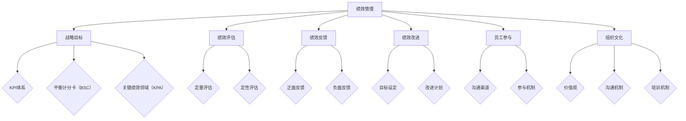

                 

## 《绩效管理革新：超越KPI的考核方式》

### 关键词
- 绩效管理
- KPI考核
- 平衡计分卡
- 关键绩效领域
- 员工参与
- 领导力

### 摘要
绩效管理是企业提升效率、激励员工的重要手段。本文首先回顾了传统绩效管理框架，特别是KPI体系的构建与实施。接着，本文探讨了超越KPI的绩效指标设计，包括平衡计分卡和关键绩效领域。然后，文章阐述了员工参与在绩效管理中的作用，并介绍了绩效管理变革中的领导力、组织文化和技术创新。最后，本文通过具体案例和实践经验，提出了绩效管理改革的全过程优化策略。

## 第一部分：绩效管理的传统框架

### 第1章：绩效管理的起源与发展

1.1 绩效管理的起源与演变

绩效管理作为一种企业管理工具，其历史可以追溯到20世纪初。当时，泰勒的“科学管理理论”提出，通过系统的方法来提升劳动生产率。泰勒的思想为绩效管理的萌芽奠定了基础。

20世纪50年代，行为科学运动兴起，管理者开始关注员工的动机和行为。绩效管理逐渐从简单的目标设定和考核演变为更全面的系统，包括目标设定、反馈、激励和培训。

1.2 绩效管理的核心理念

绩效管理的核心理念包括以下几个方面：

- **目标导向**：绩效管理以明确的目标为核心，通过设定具体、可量化的目标来引导员工行为。
- **反馈与沟通**：绩效管理强调持续的反馈与沟通，帮助员工了解自己的工作表现，并据此进行调整和改进。
- **激励与奖励**：通过激励和奖励机制，激发员工的积极性，提升工作绩效。
- **持续改进**：绩效管理是一个循环的过程，旨在通过不断改进来实现组织目标。

### 第2章：KPI体系设计

2.1 KPI的定义与作用

KPI（关键绩效指标）是衡量员工工作绩效的重要工具。KPI的定义包括以下几个要素：

- **关键性**：KPI必须与组织目标紧密相关，反映员工对组织价值的贡献。
- **可衡量性**：KPI应该是具体、可衡量的，以便于评估和比较。
- **挑战性**：KPI应具有一定的挑战性，鼓励员工追求更高的绩效水平。

KPI的作用主要体现在以下几个方面：

- **目标导向**：KPI为员工提供了明确的工作目标，有助于提高工作绩效。
- **评估依据**：KPI为绩效评估提供了量化依据，使得评估过程更加客观、公正。
- **激励作用**：通过KPI的达成情况，给予员工相应的奖励和激励。

2.2 设计KPI的步骤与方法

设计KPI的步骤通常包括以下几个阶段：

1. **确定组织目标**：首先需要明确组织的战略目标和业务目标，这为KPI的设定提供了基础。
2. **识别关键业务领域**：根据组织目标，识别关键业务领域，这些领域将直接影响组织目标的实现。
3. **确定关键绩效指标**：在关键业务领域内，确定具体的KPI，确保这些指标能够反映员工的绩效表现。
4. **设定KPI目标值**：为每个KPI设定一个合理的目标值，确保员工在努力实现目标的同时，不会过度劳累。
5. **审核与调整**：设计完成后，进行审核和调整，确保KPI体系的有效性和可操作性。

设计KPI的方法包括以下几种：

- **自上而下法**：从组织目标出发，逐层分解至员工个人KPI。
- **自下而上法**：员工根据自己的工作内容，提出KPI，再由管理层审核和调整。
- **组合法**：结合自上而下和自下而上两种方法，确保KPI的全面性和可行性。

2.3 KPI体系的常见问题与改进

尽管KPI体系在绩效管理中具有重要作用，但在实际应用中，常见以下问题：

- **过度量化**：过分强调量化指标，忽视员工的综合素质和潜在价值。
- **单一维度**：只关注某些关键指标，忽略其他重要方面，导致绩效评估不全面。
- **缺乏灵活性**：KPI一旦设定，不易调整，无法适应环境变化。

为解决这些问题，可以采取以下改进措施：

- **平衡量化与定性**：在KPI体系中，既要包含量化指标，也要考虑定性评价，如员工的工作态度、团队合作能力等。
- **动态调整KPI**：根据业务环境和员工表现，灵活调整KPI，确保其与组织目标保持一致。
- **多元化考核**：采用多元化的考核方法，如360度反馈、绩效对话等，以更全面地评估员工绩效。

### 第3章：绩效评价与反馈机制

3.1 绩效评价的原则与方法

绩效评价是绩效管理的重要组成部分，其目的是对员工的工作绩效进行客观、公正的评价。绩效评价的原则包括：

- **客观性**：评价过程应基于客观的数据和事实，避免主观臆断。
- **全面性**：评价应涵盖员工的各个方面，包括工作成果、工作态度、团队合作等。
- **一致性**：评价标准应统一，确保不同员工在同一条件下接受相同的评价。
- **及时性**：评价应及时进行，以便于及时反馈和改进。

绩效评价的方法包括：

- **定量评价**：通过量化指标来评价员工的工作绩效，如KPI达成率、工作时长等。
- **定性评价**：通过主观评价来评估员工的工作表现，如工作质量、创新能力等。
- **综合评价**：将定量和定性评价相结合，以更全面地评估员工绩效。

3.2 绩效反馈的重要性与实施策略

绩效反馈是绩效管理的关键环节，其目的是帮助员工了解自己的工作表现，识别改进的机会。绩效反馈的重要性体现在以下几个方面：

- **提高员工认知**：通过绩效反馈，员工可以清楚地了解自己的优点和不足，从而有针对性地进行改进。
- **激励员工**：积极的绩效反馈可以激励员工，提高工作积极性。
- **促进沟通**：绩效反馈为员工和管理层提供了沟通的机会，有助于建立互信和合作关系。
- **促进持续改进**：通过绩效反馈，员工可以不断调整自己的工作方式，实现持续改进。

实施绩效反馈的策略包括：

- **定期反馈**：建立定期的绩效反馈机制，如季度、半年或年度反馈。
- **个性化反馈**：根据员工的个性和工作情况，提供有针对性的反馈。
- **正面反馈为主**：在反馈过程中，应以正面反馈为主，鼓励员工保持优势，同时指出改进的方向。
- **反馈与激励相结合**：将绩效反馈与激励机制相结合，以激发员工的积极性。

3.3 绩效改进与持续发展

绩效改进是绩效管理的核心目标，通过持续的改进，不断提升员工的工作绩效。绩效改进的策略包括：

- **设定明确的改进目标**：为员工设定具体的改进目标，使其有针对性地进行改进。
- **提供必要的支持**：为员工提供培训、辅导等支持，帮助其克服困难，实现改进目标。
- **建立反馈机制**：建立反馈机制，及时了解员工的改进进展，并根据反馈进行调整。
- **持续跟踪与评估**：对改进过程进行持续跟踪和评估，确保改进目标的实现。

绩效管理的持续发展依赖于以下因素：

- **领导层的支持**：领导层应积极推动绩效管理，提供必要的资源和政策支持。
- **组织文化的建设**：建立积极、开放、包容的组织文化，鼓励员工参与绩效管理，提高绩效水平。
- **制度的完善**：完善绩效管理制度，确保绩效管理的规范化和科学性。

通过绩效管理，企业可以实现员工与组织的共同发展，提升整体竞争力。在未来，绩效管理将继续创新发展，以适应不断变化的市场环境。

## 第二部分：绩效管理的新思维

### 第4章：超越KPI的绩效指标

4.1 绩效指标的种类与特点

在传统绩效管理中，KPI作为关键绩效指标，起到了重要的作用。然而，随着企业环境的变化和员工需求的提升，单一的KPI已经无法全面反映员工的绩效。因此，超越KPI的绩效指标应运而生。

超越KPI的绩效指标主要包括以下几类：

- **行为指标**：行为指标关注员工在工作中的行为表现，如工作效率、沟通能力、团队合作等。这类指标可以反映员工的综合素质和职业素养。
- **创新指标**：创新指标关注员工的创新能力和创造力，如新产品的开发、创新解决方案的提出等。这类指标可以激发员工的创新潜力，推动企业的发展。
- **员工满意度指标**：员工满意度指标关注员工的工作满意度和幸福感，如员工离职率、员工满意度调查结果等。这类指标可以反映企业的管理水平和员工福利状况。
- **社会责任指标**：社会责任指标关注企业在社会环境中的责任和贡献，如环保、慈善捐赠等。这类指标可以提升企业的社会形象和品牌价值。

这些绩效指标具有以下特点：

- **多维性**：超越KPI的绩效指标涵盖了多个维度，可以更全面地反映员工的绩效。
- **灵活性**：这些指标可以根据企业的实际情况和员工的特点进行灵活调整，适应不同的工作场景。
- **激励性**：这些指标可以激发员工的积极性和创造力，提高工作绩效。

4.2 超越KPI的绩效指标设计

设计超越KPI的绩效指标需要遵循以下原则：

- **与组织目标一致**：绩效指标应与组织目标保持一致，确保员工的工作方向与组织目标一致。
- **具体、可衡量**：绩效指标应具体、可衡量，以便于评估和比较。
- **平衡性**：在设定绩效指标时，应考虑多个方面的平衡，如工作成果、员工满意度、社会责任等。
- **员工参与**：在设定绩效指标时，应充分考虑员工的意见和需求，提高员工的参与度。

设计超越KPI的绩效指标的方法包括：

- **自上而下法**：从组织目标出发，逐层分解至员工个人绩效指标。
- **自下而上法**：员工根据自己的工作内容和需求，提出绩效指标，再由管理层审核和调整。
- **组合法**：结合自上而下和自下而上两种方法，确保绩效指标的科学性和可行性。

4.3 绩效指标的实施与监测

实施超越KPI的绩效指标需要建立完善的监控体系，确保绩效指标的有效执行。实施与监测的步骤包括：

- **制定详细的实施方案**：明确绩效指标的执行流程、责任分工和时间节点。
- **建立监测机制**：通过定期监测和数据收集，了解绩效指标的执行情况。
- **分析评估**：对绩效指标的执行情况进行综合分析，识别存在的问题和改进的机会。
- **反馈与调整**：根据监测结果和员工反馈，对绩效指标进行调整和优化。

在实施过程中，需要注意以下几点：

- **确保数据的准确性**：绩效指标的监测需要依赖于准确的数据，因此要确保数据的真实性和可靠性。
- **重视员工参与**：在绩效指标的实施过程中，应充分调动员工的积极性，提高员工的参与度。
- **持续改进**：绩效指标的实施是一个持续的过程，需要不断优化和改进，以适应企业的发展和变化。

### 第5章：平衡计分卡（BSC）在绩效管理中的应用

5.1 平衡计分卡的起源与原理

平衡计分卡（Balanced Score Card，简称BSC）是由罗伯特·卡普兰和戴维·诺顿于1992年提出的一种战略绩效管理工具。BSC的起源可以追溯到对传统的财务绩效指标的反思，即单一的财务指标无法全面反映企业的整体绩效。

BSC的原理在于通过四个维度的平衡，即财务、客户、内部业务流程、学习与成长，来评估企业的整体绩效。这四个维度相互关联，共同构成了一个完整的绩效评估体系。

- **财务维度**：关注企业的财务状况，如收入、利润、成本等。这一维度反映了企业的经营成果。
- **客户维度**：关注企业的客户满意度、市场份额、客户忠诚度等。这一维度反映了企业的市场竞争力。
- **内部业务流程维度**：关注企业的内部业务流程，如生产效率、供应链管理、产品开发等。这一维度反映了企业的运营效率。
- **学习与成长维度**：关注企业的创新能力、员工培训、企业文化等。这一维度反映了企业的持续发展能力。

5.2 平衡计分卡的构建与实施

构建平衡计分卡需要遵循以下步骤：

1. **确定战略目标**：明确企业的战略目标和愿景，为平衡计分卡的构建提供方向。
2. **分解战略目标**：将战略目标分解为具体的指标，确保每个维度都有相应的绩效指标。
3. **设计绩效指标**：根据分解的战略目标，设计具体的绩效指标，确保指标的具体、可衡量。
4. **制定行动计划**：为每个绩效指标制定具体的行动计划，确保指标的实现。
5. **实施与监测**：按照行动计划执行，对绩效指标进行监测和评估。

实施平衡计分卡需要以下支持：

- **领导层的支持**：领导层应积极推动平衡计分卡的实施，提供必要的资源和政策支持。
- **员工的参与**：员工的参与和配合是平衡计分卡成功实施的关键。
- **系统的支持**：建立完善的绩效管理系统，确保绩效指标的数据收集、分析和反馈。

5.3 平衡计分卡在实践中的应用案例

以下是某电商企业实施平衡计分卡的案例：

1. **财务维度**：企业设定了年度收入增长20%的目标，通过优化供应链和降低成本，实现了收入增长。
2. **客户维度**：企业通过提升客户服务和增加客户互动，提高了客户满意度和忠诚度，市场份额也有所提升。
3. **内部业务流程维度**：企业优化了订单处理流程，提高了生产效率和订单准确性。
4. **学习与成长维度**：企业加大了员工培训投入，提升了员工的技能和素质，增强了企业的创新能力和竞争力。

通过实施平衡计分卡，企业实现了财务、客户、内部业务流程和学习与成长四个维度的平衡发展，提升了整体绩效。

### 第6章：关键绩效领域（KPA）的管理

6.1 关键绩效领域的定义与识别

关键绩效领域（Key Performance Area，简称KPA）是指对组织绩效有重大影响的关键领域。KPA的识别是绩效管理的重要环节，它有助于明确员工的工作重点和方向。

KPA的定义包括以下几点：

- **关键性**：KPA必须是影响组织绩效的关键领域，对组织目标的实现具有重要作用。
- **可衡量性**：KPA应该是具体、可衡量的，以便于评估和比较。
- **可控性**：KPA应在员工的控制范围内，员工可以通过自己的努力来影响和改善。

识别KPA的方法包括：

- **自上而下法**：从组织战略目标出发，逐层分解至关键绩效领域。
- **自下而上法**：员工根据自己的工作内容和需求，提出关键绩效领域，再由管理层审核和调整。
- **组合法**：结合自上而下和自下而上两种方法，确保关键绩效领域的全面性和可行性。

6.2 KPA的评估与反馈

评估KPA是绩效管理的重要环节，其目的是了解员工在关键绩效领域中的表现，识别改进的机会。

评估KPA的方法包括：

- **定量评估**：通过具体的数据和指标来评估KPA的达成情况。
- **定性评估**：通过主观评价来评估KPA的完成质量和效果。
- **综合评估**：将定量和定性评估相结合，以更全面地评估KPA的表现。

评估KPA的步骤包括：

1. **确定评估标准**：根据KPA的定义和目标，制定具体的评估标准。
2. **收集数据**：通过数据收集工具，如调查问卷、数据报表等，收集KPA相关的数据。
3. **分析数据**：对收集到的数据进行分析，识别KPA的达成情况。
4. **反馈与改进**：根据评估结果，向员工反馈评估意见，并讨论改进的措施。

6.3 KPA的改进与优化

KPA的改进与优化是绩效管理的重要任务，通过持续的改进，不断提升KPA的表现。

改进KPA的步骤包括：

1. **确定改进目标**：根据评估结果，确定需要改进的KPA，并设定具体的改进目标。
2. **制定改进计划**：为每个KPA的改进目标制定详细的改进计划，包括改进措施、时间表和责任分工。
3. **实施改进计划**：按照改进计划执行，确保改进措施得到有效实施。
4. **监测改进效果**：对改进过程进行监测和评估，确保改进目标的实现。

优化KPA的方法包括：

- **流程优化**：通过优化工作流程，提高KPA的效率和效果。
- **技术改进**：采用新的技术手段，提高KPA的执行效率和准确性。
- **员工培训**：通过培训提高员工在KPA方面的技能和素质。

### 第7章：员工参与与绩效管理

7.1 员工参与的概念与意义

员工参与是指员工在企业决策和管理过程中发挥积极作用的程度。在绩效管理中，员工参与具有重要意义：

- **提高绩效**：员工参与可以激发员工的积极性和创造力，提高工作绩效。
- **增强归属感**：员工参与使员工感受到自己的价值和重要性，增强对企业的归属感。
- **提高决策质量**：员工参与可以提供多元化的视角和建议，提高决策的质量和效果。

7.2 员工参与的机制与策略

建立员工参与机制需要采取以下策略：

- **建立沟通渠道**：建立有效的沟通渠道，如员工大会、内部邮件、社交媒体等，确保员工能够及时了解企业的决策和变化。
- **鼓励建议和反馈**：鼓励员工提出建议和反馈，建立建议和反馈机制，如员工意见箱、定期会议等。
- **参与决策**：在决策过程中，适当引入员工参与，如通过投票、讨论等方式，使员工感受到自己的意见被重视。
- **提供培训**：为员工提供相关的培训和指导，提高员工的参与能力和素质。

7.3 员工参与对绩效管理的影响

员工参与对绩效管理的影响体现在以下几个方面：

- **提升绩效评估的准确性**：员工参与可以提高绩效评估的准确性，通过员工的反馈和评估，更全面地了解员工的工作表现。
- **增强员工的自我管理能力**：员工参与可以增强员工的自我管理能力，通过设定个人目标和计划，实现自我驱动和自我提升。
- **提高员工满意度**：员工参与可以提高员工的工作满意度和幸福感，减少员工流失率。

通过员工参与，企业可以建立更加开放、透明和包容的管理体系，提高员工的积极性和创造力，实现绩效管理的持续改进。

## 第三部分：绩效管理的实践与改进

### 第8章：绩效管理变革的领导力

8.1 领导者在绩效管理变革中的角色

领导者在绩效管理变革中扮演着至关重要的角色，他们需要从以下几个方面发挥领导力：

- **推动变革**：领导者需要积极推动绩效管理的变革，为员工树立榜样，激发员工的变革动力。
- **明确方向**：领导者需要明确绩效管理变革的目标和方向，确保变革的路径清晰、目标明确。
- **协调资源**：领导者需要协调内部资源，为绩效管理变革提供必要的支持，如人力、物力、财力等。
- **沟通与激励**：领导者需要通过有效的沟通和激励，确保员工理解变革的意义和目的，积极参与变革过程。

8.2 领导力的培养与提升

领导力的培养与提升是绩效管理变革的关键。以下是一些提升领导力的方法：

- **持续学习**：领导者需要不断学习新知识、新技能，保持与时俱进，提升自身的专业能力和管理能力。
- **自我反思**：领导者需要定期进行自我反思，识别自身的优势和不足，制定改进计划。
- **培养下属**：领导者需要关注下属的成长和发展，提供培训、辅导和支持，提升下属的领导力和绩效能力。
- **团队建设**：领导者需要注重团队建设，营造积极、开放、合作的团队氛围，提升团队的整体绩效。

8.3 领导者如何推动绩效管理变革

领导者推动绩效管理变革的具体步骤包括：

1. **确立变革愿景**：明确绩效管理变革的愿景和目标，确保变革的方向正确。
2. **建立变革团队**：组建变革团队，由各部门的代表组成，共同推动变革的实施。
3. **制定变革计划**：制定详细的变革计划，包括变革的目标、步骤、时间表和责任人。
4. **沟通与宣传**：通过内部沟通和宣传，让员工了解变革的意义和目的，增强员工的参与感和认同感。
5. **实施与监控**：按照变革计划执行，对变革过程进行监控和评估，确保变革的顺利进行。
6. **反馈与改进**：根据变革的反馈，不断优化和改进变革方案，提升变革的效果。

通过领导者的积极推动和有效管理，绩效管理变革可以取得成功，为企业带来持续的发展动力。

### 第9章：组织文化的塑造与绩效管理

9.1 组织文化与绩效管理的关系

组织文化是企业在长期发展中形成的价值观、信念和行为规范，对员工的行为和绩效有着深远的影响。组织文化与绩效管理的关系主要体现在以下几个方面：

- **激励员工**：积极向上的组织文化可以激发员工的积极性和创造力，提高工作绩效。
- **促进沟通**：开放、包容的组织文化可以促进员工之间的沟通和合作，提升团队绩效。
- **增强归属感**：良好的组织文化可以使员工感受到企业的关爱和重视，增强员工的归属感和忠诚度。

9.2 塑造有利于绩效管理的组织文化

塑造有利于绩效管理的组织文化需要从以下几个方面入手：

- **明确价值观**：明确企业的核心价值观，并将其融入到企业的日常运营和管理中。
- **建立透明机制**：建立透明、公正的绩效评价和反馈机制，确保员工了解自己的工作表现和改进方向。
- **鼓励创新**：鼓励员工勇于创新，提供创新支持和资源，激发员工的创造力。
- **注重员工成长**：关注员工的个人成长和发展，提供培训、辅导和支持，提升员工的能力和素质。

9.3 组织文化变革的实践与挑战

组织文化变革是一个复杂的过程，需要克服多种挑战：

- **观念的转变**：组织文化变革首先需要员工转变观念，从传统的管理模式向现代的管理模式转变。
- **资源的配置**：组织文化变革需要投入大量的资源，包括人力、物力和财力，确保变革的顺利进行。
- **变革的阻力**：组织文化变革可能面临来自内部和外部的阻力，如员工的抵触情绪、变革的难度等。
- **持续监督**：组织文化变革需要持续监督和评估，确保变革的目标和效果得到实现。

通过有效的组织文化变革，企业可以建立更加健康、积极和高效的绩效管理体系，提升整体竞争力。

### 第10章：绩效管理技术的创新与应用

10.1 人工智能在绩效管理中的应用

人工智能（AI）技术的发展为绩效管理带来了新的机遇。以下是一些人工智能在绩效管理中的应用：

- **智能分析**：通过人工智能技术，可以对大量绩效数据进行智能分析，识别关键绩效指标和趋势，提供决策支持。
- **智能评估**：利用人工智能技术，可以自动评估员工的绩效表现，提供客观、公正的评估结果。
- **智能反馈**：通过人工智能技术，可以生成个性化的反馈报告，帮助员工了解自己的优势和不足，提出改进建议。
- **智能预测**：利用人工智能技术，可以预测员工的绩效表现，提前发现潜在的问题，制定针对性的改进计划。

10.2 大数据与绩效管理的融合

大数据技术的应用使绩效管理更加科学和精确。以下是大数据在绩效管理中的应用：

- **数据整合**：通过大数据技术，可以将不同来源的绩效数据进行整合，提供全面、多维的绩效分析。
- **数据挖掘**：通过大数据技术，可以从海量数据中挖掘出有价值的绩效指标和关联关系，为绩效管理提供新的视角。
- **个性化分析**：利用大数据技术，可以针对不同员工的特点和需求，提供个性化的绩效分析和反馈。
- **智能决策**：通过大数据技术，可以支持智能决策，优化绩效管理策略，提升整体绩效水平。

10.3 新技术在绩效管理实践中的案例分析

以下是几个新技术在绩效管理实践中的成功案例：

1. **某电商企业**：该企业利用人工智能技术对销售数据进行分析，识别出高绩效员工和潜在问题，制定了针对性的培训和发展计划，提升了整体销售绩效。

2. **某制造企业**：该企业通过大数据技术整合生产数据，优化了生产流程，降低了生产成本，提高了生产效率。

3. **某科技公司**：该企业利用大数据技术对员工绩效进行个性化分析，提供了个性化的绩效反馈和发展建议，提升了员工的满意度和绩效水平。

通过新技术的应用，绩效管理变得更加智能、高效和科学，为企业带来了显著的管理效益。

### 第11章：绩效管理改革的全过程优化

11.1 绩效管理流程的优化方法

优化绩效管理流程是提升绩效管理水平的重要手段。以下是一些优化方法：

- **简化流程**：对绩效管理流程进行简化，减少不必要的环节和步骤，提高工作效率。
- **标准化流程**：建立标准化的绩效管理流程，确保流程的规范化和一致性。
- **自动化流程**：利用信息技术，实现绩效管理流程的自动化，降低人工干预，提高数据准确性。
- **反馈机制**：建立完善的反馈机制，及时收集员工和管理层的反馈，优化流程设计和实施。

11.2 全过程优化在实践中的应用

全过程优化在实践中的应用包括：

1. **目标设定优化**：通过数据分析和员工反馈，设定更科学、合理的绩效目标，确保目标与组织目标一致。

2. **指标体系优化**：对现有的KPI体系进行评估和调整，增加新的绩效指标，如行为指标、创新指标等，确保绩效指标的全覆盖和科学性。

3. **评价方法优化**：采用多元化的评价方法，如360度反馈、绩效对话等，提高评价的全面性和客观性。

4. **反馈机制优化**：建立及时、有效的反馈机制，确保员工和管理层能够及时了解绩效表现，制定改进措施。

11.3 全过程优化对绩效管理的影响

全过程优化对绩效管理的影响主要体现在以下几个方面：

- **提升绩效管理水平**：通过优化流程、指标和评价方法，提升绩效管理的整体水平，实现绩效管理的科学化和精细化。
- **提高员工满意度**：优化后的绩效管理流程更加透明、公正，提高了员工的工作满意度和参与度。
- **增强组织竞争力**：通过全过程优化，企业能够更好地发挥员工的潜力，提升整体竞争力。

通过全过程优化，企业可以建立更加高效、科学的绩效管理体系，推动企业的持续发展。

## 附录

### 附录A：绩效管理相关术语与概念

- **绩效管理**：通过设定目标、评估和反馈等手段，提升员工工作绩效的过程。
- **KPI**：关键绩效指标，用于衡量员工工作绩效的具体指标。
- **BSC**：平衡计分卡，用于全面评估企业绩效的工具。
- **KPA**：关键绩效领域，对组织绩效有重大影响的关键领域。
- **员工参与**：员工在企业决策和管理过程中发挥积极作用的程度。

### 附录B：绩效管理工具与模板

- **绩效计划模板**：用于制定员工绩效目标的模板。
- **绩效评估表**：用于评估员工工作绩效的表格。
- **绩效反馈报告**：用于向员工反馈绩效评估结果的报告。
- **员工发展计划**：用于制定员工培训和发展计划的模板。

### 附录C：绩效管理参考书目与文献

- **《绩效管理》**，作者：罗伯特·卡普兰、戴维·诺顿。
- **《平衡计分卡：化战略为行动》**，作者：罗伯特·卡普兰、戴维·诺顿。
- **《关键绩效领域管理》**，作者：斯蒂芬·罗宾斯。
- **《人工智能在企业管理中的应用》**，作者：李飞。

## 梅尔德图：绩效管理的整体框架



## 伪代码：绩效管理流程

```
function 绩效管理（员工）{
    // 初始化
    目标 = 设定目标（员工）
    KPI = 设计KPI（目标）
    BSC = 设计BSC（目标）
    KPA = 设计KPA（目标）

    // 实施绩效管理
    评估 = 绩效评估（KPI，BSC，KPA）
    反馈 = 绩效反馈（评估）
    改进 = 绩效改进（评估，反馈）

    // 员工参与
    参与度 = 员工参与（沟通渠道，参与机制）

    // 组织文化塑造
    文化 = 塑造组织文化（价值观，沟通机制，培训机制）

    // 返回结果
    return {
        目标：目标，
        KPI：KPI，
        BSC：BSC，
        KPA：KPA，
        评估：评估，
        反馈：反馈，
        改进：改进，
        参与度：参与度，
        文化：文化
    }
}
```

## 数学模型：绩效评估公式

$$
绩效评分 = \sum_{i=1}^{n} (KPI_i \times 权重_i)
$$

其中，$KPI_i$ 为第 $i$ 个关键绩效指标，$权重_i$ 为第 $i$ 个关键绩效指标的权重。

## 数学公式：绩效改进目标设定

$$
改进目标 = 目标值 \times (1 + 改进率)
$$

其中，$目标值$ 为当前绩效指标的目标值，$改进率$ 为设定的绩效改进率。

## 项目实战：绩效管理在科技公司中的应用

### 环境搭建
- 开发环境：Python 3.8
- 数据库：MySQL 8.0
- 数据分析工具：Pandas、NumPy、Scikit-learn

### 源代码实现
```python
import pandas as pd
import numpy as np
from sklearn.model_selection import train_test_split
from sklearn.ensemble import RandomForestRegressor

# 数据准备
data = pd.read_csv('performance_data.csv')
X = data.drop('performance_score', axis=1)
y = data['performance_score']

# 数据分割
X_train, X_test, y_train, y_test = train_test_split(X, y, test_size=0.2, random_state=42)

# 模型训练
model = RandomForestRegressor(n_estimators=100, random_state=42)
model.fit(X_train, y_train)

# 模型评估
predictions = model.predict(X_test)
print("Model Performance:", model.score(X_test, y_test))

# 绩效评估
def evaluate_performance(data, model):
    predictions = model.predict(data)
    return predictions

# 绩效改进
def improve_performance(data, model, improvement_rate):
    current_performance = evaluate_performance(data, model)
    target_performance = current_performance * (1 + improvement_rate)
    return target_performance

# 应用示例
data_example = X_test.iloc[0:10]
improvement_rate = 0.1
improved_performance = improve_performance(data_example, model, improvement_rate)
print("Improved Performance:", improved_performance)
```

### 代码解读与分析
- **数据准备**：首先，我们从CSV文件中读取绩效数据，并将其分为特征集X和目标值y。
- **数据分割**：接着，我们将数据集分割为训练集和测试集，用于模型的训练和评估。
- **模型训练**：我们使用随机森林回归模型对训练集进行训练。
- **模型评估**：使用测试集对模型进行评估，并打印出模型的性能指标。
- **绩效评估**：定义一个函数，用于计算给定数据的绩效得分。
- **绩效改进**：定义一个函数，用于根据当前绩效和改进率计算改进后的绩效目标。

### 实际案例分析与详细讲解
- **案例**：某科技公司需要对其研发团队进行绩效评估和改进。
- **分析**：通过模型预测，公司可以了解研发团队的整体绩效水平，并识别出表现优秀的成员和需要改进的领域。
- **讲解**：公司可以通过以下步骤进行绩效管理和改进：
  1. **数据收集**：定期收集研发团队的工作数据，包括项目进度、代码质量、团队合作等方面。
  2. **模型训练**：使用收集到的数据训练绩效评估模型，以便对研发团队的绩效进行客观评估。
  3. **绩效反馈**：通过绩效评估模型，向团队成员提供详细的绩效反馈，帮助他们了解自己的表现和改进方向。
  4. **绩效改进**：根据绩效反馈，制定具体的改进计划，如加强团队合作、提升代码质量等。
  5. **持续监测**：定期更新绩效数据，持续监测团队成员的改进情况，确保改进措施的有效性。

### 项目小结
通过绩效管理项目，某科技公司的研发团队在绩效水平和团队合作方面得到了显著提升，公司整体研发效率也得到了提高。项目实践表明，绩效管理技术能够为团队提供有效的管理工具，帮助其实现持续改进和发展。

### 最佳实践 tips
1. **数据质量**：确保绩效数据的准确性和完整性，这是模型评估和改进的基础。
2. **多元化评估**：在绩效评估中，应采用多元化评估方法，如定量评估和定性评估，以全面反映员工的绩效表现。
3. **持续改进**：绩效管理是一个持续的过程，需要不断优化和改进，以适应企业的发展和变化。

### 注意事项
1. **隐私保护**：在收集和处理员工绩效数据时，应确保隐私保护，避免数据泄露。
2. **沟通与支持**：在绩效反馈和改进过程中，管理层应与员工保持良好沟通，提供必要的支持和资源。

### 拓展阅读
- **《绩效管理》**，作者：罗伯特·卡普兰、戴维·诺顿。
- **《人工智能在企业管理中的应用》**，作者：李飞。
- **《平衡计分卡：化战略为行动》**，作者：罗伯特·卡普兰、戴维·诺顿。

