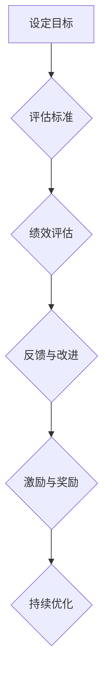
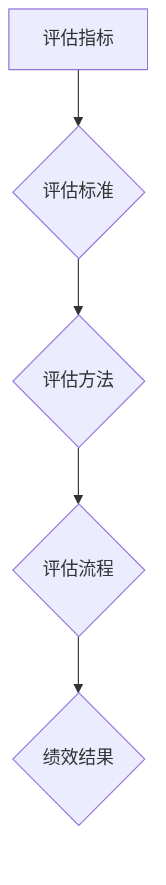
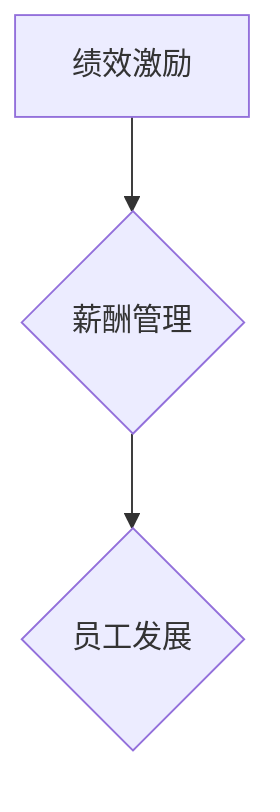
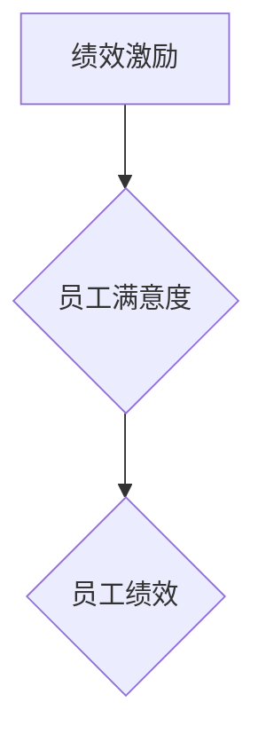
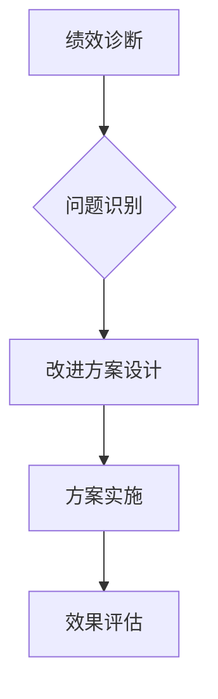
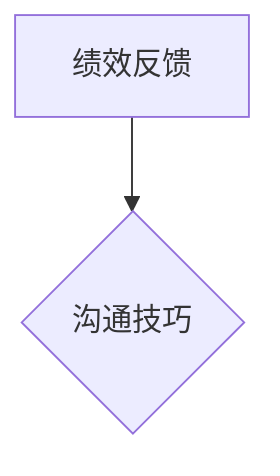

                 

### 文章标题：绩效管理：全面提升团队效能

#### 关键词：绩效管理、团队效能、绩效评估、激励策略、绩效改进、沟通技巧

#### 摘要：
本文深入探讨了绩效管理在提升团队效能中的关键作用。通过详细的流程图、算法原理、数学模型和实际案例分析，本文旨在为IT领域的专业人员提供一套全面、实用的绩效管理体系，帮助他们构建高效、协作的团队，实现组织目标最大化。

## 目录

1. **绩效管理概述**
    1.1 绩效的定义与重要性
    1.2 绩效管理的目标与原则
    1.3 绩效管理的流程与方法
    1.4 团队效能的提升策略

2. **绩效评估与激励**
    2.1 绩效评估体系设计
    2.2 绩效激励与薪酬管理
    2.3 绩效激励与员工满意度

3. **绩效改进与反馈**
    3.1 绩效改进策略与实践
    3.2 绩效反馈与沟通技巧
    3.3 绩效反馈的有效沟通

4. **绩效管理案例解析**
    4.1 案例一：某企业的绩效管理体系建设
    4.2 案例二：某团队的绩效改进实践

5. **最佳实践与拓展**
    5.1 最佳实践 tips
    5.2 小结与注意事项
    5.3 拓展阅读

### 第一部分：绩效管理概述

#### 1.1 绩效的定义与重要性

绩效是指组织、团队或个体在一定时间内完成工作任务所表现出的工作结果和效率。在IT行业，绩效管理不仅是评估员工工作表现的重要工具，更是提升团队整体效能的关键手段。

**核心概念与联系**：

绩效管理涉及多个核心概念，如工作目标、工作质量、工作效率、工作态度等。这些概念相互联系，构成了绩效管理的完整体系。以下是一个简单的Mermaid流程图，展示绩效管理的基本流程和核心概念之间的关系：



**核心算法原理讲解**：

在绩效评估过程中，常用的算法原理包括加权平均法、标准分法等。以下是一个加权平均法的伪代码示例：

```python
def weighted_average(scores, weights):
    total_score = 0
    total_weight = 0
    for i in range(len(scores)):
        total_score += scores[i] * weights[i]
        total_weight += weights[i]
    return total_score / total_weight
```

**数学模型和数学公式**：

绩效评估中的数学模型可以用于计算绩效得分、排名等。以下是一个简单的绩效得分计算公式：

$$
\text{绩效得分} = \frac{\text{实际完成工作量}}{\text{计划完成工作量}} \times 100
$$

**项目实战**：

在一个IT项目中，通过设定明确的目标、定期评估进展、及时反馈和调整，可以有效提升团队的工作效率和绩效。例如，在开发一个复杂的软件系统时，可以按照以下步骤进行绩效管理：

1. **目标设定**：确定项目目标和阶段性里程碑。
2. **评估标准**：设定绩效评估的指标，如代码质量、项目进度、团队协作等。
3. **定期评估**：根据评估标准，定期检查项目进展。
4. **反馈与改进**：对评估结果进行分析，提出改进措施。
5. **激励与奖励**：对绩效优秀的成员进行奖励，激励团队整体。

### 1.2 绩效管理的目标与原则

**绩效管理的目标**主要包括以下几个方面：

- 提高工作效率和生产力
- 促进团队协作和沟通
- 激发员工潜力和创造力
- 实现组织战略目标

**绩效管理的原则**则强调以下几个方面：

- **公平性**：绩效评估应公平、客观，避免主观偏见。
- **透明性**：绩效管理体系应透明，员工了解评估标准和过程。
- **反馈性**：绩效管理不仅仅是评估，更要注重反馈和改进。
- **持续性**：绩效管理是一个持续的过程，需要不断优化和调整。

#### 1.3 绩效管理的流程与方法

**绩效管理的流程**通常包括以下几个阶段：

1. **目标设定**：与员工共同制定明确的工作目标。
2. **评估标准制定**：确定绩效评估的指标和标准。
3. **绩效监控**：实时监控员工的工作表现。
4. **绩效评估**：定期对员工的工作绩效进行评估。
5. **反馈与改进**：对评估结果进行反馈，并提出改进建议。
6. **激励与奖励**：根据绩效结果，实施激励和奖励措施。

**绩效管理的方法**多种多样，以下是几种常用的方法：

- **KPI（关键绩效指标）法**：通过设定关键绩效指标，量化员工的工作表现。
- **360度评估法**：通过多角度收集反馈，全面评估员工的表现。
- **目标管理法**：通过设定明确的目标，激发员工的积极性和主动性。
- **行为观察法**：通过观察员工的工作行为，评估其工作绩效。

### 1.4 团队效能的提升策略

提升团队效能是绩效管理的核心目标之一。以下是一些提升团队效能的策略：

- **明确目标和职责**：确保每个团队成员都清楚自己的职责和目标。
- **优化团队结构**：根据团队任务和目标，合理分配团队成员。
- **提高沟通效率**：建立有效的沟通机制，确保信息畅通。
- **培养团队协作精神**：通过培训和实践，提高团队的协作能力。
- **激励与奖励**：实施有效的激励和奖励措施，激发团队活力。
- **持续改进**：定期评估团队效能，找出问题并持续改进。

#### 总结

绩效管理在提升团队效能中起着至关重要的作用。通过科学的绩效管理，可以有效提高工作效率、激发员工潜力、实现组织目标。在接下来的部分中，我们将深入探讨绩效评估与激励、绩效改进与反馈等重要主题，帮助读者构建完善的绩效管理体系。|> 

### 第二部分：绩效评估与激励

#### 2.1 绩效评估体系设计

绩效评估体系是绩效管理的重要组成部分，它有助于衡量员工的工作表现，为激励和改进提供依据。设计一个有效的绩效评估体系，需要考虑多个因素，包括评估指标的选择、评估方法的确定和评估流程的规范。

**核心概念与联系**：

绩效评估体系的核心概念包括评估指标、评估标准和评估方法。这些概念相互关联，构成了评估体系的基本框架。以下是一个简单的Mermaid流程图，展示了这些概念之间的关系：



**核心算法原理讲解**：

在绩效评估中，常用的算法原理包括加权平均法、标准分法和模糊综合评价法等。以下是一个简单的加权平均法伪代码示例：

```python
def weighted_average(scores, weights):
    total_score = 0
    total_weight = 0
    for i in range(len(scores)):
        total_score += scores[i] * weights[i]
        total_weight += weights[i]
    return total_score / total_weight
```

**数学模型和数学公式**：

在绩效评估中，常用的数学模型和公式包括加权平均公式、标准分公式和模糊综合评价公式等。以下是一个加权平均公式的示例：

$$
\text{绩效得分} = \sum_{i=1}^{n} (\text{指标i得分} \times \text{指标i权重})
$$

**项目实战**：

在一个IT项目中，设计绩效评估体系需要考虑以下几个方面：

1. **评估指标选择**：根据项目目标和团队职责，确定关键绩效指标（KPI），如项目进度、代码质量、团队协作等。
2. **评估标准制定**：为每个评估指标设定明确的评估标准和分值范围，确保评估过程的公平和客观。
3. **评估方法确定**：选择合适的评估方法，如360度评估、行为观察法等。
4. **评估流程规范**：制定详细的评估流程，包括评估周期、评估方式、评估结果的反馈和改进等。

例如，在一个软件开发项目中，可以按照以下步骤进行绩效评估：

1. **目标设定**：与团队共同制定项目目标和阶段性里程碑。
2. **指标选择**：确定关键绩效指标，如项目进度、代码质量、团队协作等。
3. **标准制定**：为每个指标设定评估标准和分值范围。
4. **评估实施**：定期对团队成员的工作绩效进行评估。
5. **结果反馈**：将评估结果反馈给团队成员，并讨论改进措施。

#### 2.2 绩效激励与薪酬管理

绩效激励是绩效管理的重要环节，通过激励措施可以激发员工的积极性和创造力，提高工作绩效。有效的绩效激励需要结合薪酬管理和员工发展，形成一套全面的激励体系。

**核心概念与联系**：

绩效激励与薪酬管理的关系如图所示：



**核心算法原理讲解**：

绩效激励的算法原理主要涉及奖励分配和激励力度设计。以下是一个简单的奖励分配伪代码示例：

```python
def reward_distribution(performance_scores, reward_pool):
    total_performance = sum(performance_scores)
    reward_per_point = reward_pool / total_performance
    rewards = [score * reward_per_point for score in performance_scores]
    return rewards
```

**数学模型和数学公式**：

绩效激励中的数学模型和公式主要包括奖励分配公式和激励力度公式。以下是一个奖励分配公式的示例：

$$
\text{奖励} = \text{绩效得分} \times \text{奖励系数}
$$

**项目实战**：

在一个IT公司中，建立有效的绩效激励体系需要考虑以下几个方面：

1. **奖励设定**：根据公司业绩和员工绩效，设定合理的奖励标准和奖励方式，如现金奖励、股权激励、荣誉表彰等。
2. **激励机制**：设计多元化的激励机制，满足不同员工的需求，如职业发展、技能培训、工作环境等。
3. **反馈机制**：建立及时的反馈机制，让员工了解奖励分配和激励政策，确保激励的公正性和透明性。
4. **评估与调整**：定期评估激励体系的实施效果，根据反馈和公司发展调整激励政策。

例如，在一个IT公司中，可以按照以下步骤实施绩效激励：

1. **奖励方案设计**：根据公司业绩和员工绩效，制定奖励方案。
2. **绩效评估**：定期对员工的工作绩效进行评估。
3. **奖励发放**：根据评估结果，发放相应的奖励。
4. **反馈与沟通**：与员工沟通奖励方案和激励政策，收集反馈，持续优化。

#### 2.3 绩效激励与员工满意度

绩效激励不仅能够提高员工的工作绩效，还能增强员工的满意度。一个满意的员工更有可能为企业创造价值，提高团队的稳定性和凝聚力。

**核心概念与联系**：

绩效激励与员工满意度之间的关系如图所示：



**核心算法原理讲解**：

绩效激励与员工满意度的关系可以通过以下公式表示：

$$
\text{员工满意度} = f(\text{绩效激励}, \text{员工需求})
$$

其中，绩效激励和员工需求是影响员工满意度的两个关键因素。

**项目实战**：

在一个IT企业中，提高员工满意度可以通过以下几个方面实现：

1. **个性化激励**：根据员工的不同需求，提供个性化的激励方案，如职业发展、技能培训、弹性工作等。
2. **透明化沟通**：建立透明的沟通机制，让员工了解公司的绩效激励政策和实施情况。
3. **反馈机制**：建立反馈机制，让员工表达意见和建议，及时解决员工关心的问题。
4. **团队建设**：通过团建活动、团队奖励等方式，增强员工的归属感和团队凝聚力。

例如，在一个IT企业中，可以按照以下步骤提高员工满意度：

1. **需求调研**：通过问卷调查、访谈等方式，了解员工的需求。
2. **激励方案设计**：根据员工需求，设计个性化的激励方案。
3. **激励实施**：根据激励方案，实施激励措施。
4. **反馈与改进**：收集员工反馈，根据反馈调整激励方案，持续提升员工满意度。

#### 总结

绩效评估与激励是绩效管理的核心环节，通过科学的设计和实施，可以提升员工的工作绩效，增强员工满意度，进而提高团队效能。在接下来的部分中，我们将探讨绩效改进与反馈、沟通技巧等主题，进一步优化绩效管理体系。

### 第三部分：绩效改进与反馈

#### 3.1 绩效改进策略与实践

绩效改进是提升团队效能的重要环节，通过系统的方法和策略，可以识别和解决绩效问题，促进团队整体绩效的提升。

**核心概念与联系**：

绩效改进涉及多个核心概念，包括绩效诊断、问题识别、改进方案设计、实施与评估等。以下是一个简单的Mermaid流程图，展示了绩效改进的基本流程和核心概念之间的关系：



**核心算法原理讲解**：

绩效改进的算法原理主要涉及数据分析和决策模型。以下是一个基于数据驱动的问题识别算法的伪代码示例：

```python
def problem_identification(data):
    # 数据预处理
    processed_data = preprocess_data(data)
    
    # 分析数据，找出异常值
    anomalies = find_anomalies(processed_data)
    
    # 对异常值进行聚类分析，识别问题类型
    problem_types = cluster_anomalies(anomalies)
    
    return problem_types
```

**数学模型和数学公式**：

绩效改进中的数学模型和公式主要包括数据预处理方法、异常检测算法、聚类分析方法等。以下是一个简单的数据预处理公式示例：

$$
\text{标准化值} = \frac{\text{实际值} - \text{均值}}{\text{标准差}}
$$

**项目实战**：

在一个IT项目中，实施绩效改进可以按照以下步骤进行：

1. **绩效诊断**：收集和分析项目绩效数据，识别绩效问题。
2. **问题识别**：通过数据分析和专家评审，确定具体的绩效问题。
3. **改进方案设计**：针对识别的问题，设计具体的改进方案。
4. **方案实施**：实施改进方案，并监控效果。
5. **效果评估**：评估改进方案的实施效果，并根据评估结果调整方案。

例如，在一个软件开发项目中，可以按照以下步骤实施绩效改进：

1. **绩效诊断**：收集项目进度、代码质量、团队协作等数据。
2. **问题识别**：通过数据分析，发现项目进度滞后、代码质量不高等问题。
3. **改进方案设计**：制定具体的改进方案，如调整项目计划、加强代码审查等。
4. **方案实施**：实施改进方案，并监控项目进展。
5. **效果评估**：评估改进方案的实施效果，根据评估结果进行调整。

#### 3.2 绩效反馈与沟通技巧

有效的绩效反馈是绩效管理的重要环节，通过及时、准确、建设性的反馈，可以帮助员工认识到自己的优势与不足，进而改进工作表现。沟通技巧在反馈过程中起着关键作用，能够影响反馈的效果。

**核心概念与联系**：

绩效反馈与沟通技巧的关系如图所示：



**核心算法原理讲解**：

有效的绩效反馈涉及多个沟通技巧，如积极倾听、明确表达、同理心等。以下是一个简单的基于沟通技巧的绩效反馈模型：

```python
def effective_feedback(employee, feedback_content, communication_skills):
    # 应用沟通技巧
    feedback_with_skills = apply_communication_skills(feedback_content, communication_skills)
    
    # 给予员工反馈
    provide_feedback(employee, feedback_with_skills)
    
    # 跟进反馈效果
    follow_up_feedback(employee, feedback_content)
```

**数学模型和数学公式**：

绩效反馈中的数学模型和公式主要包括反馈效果评估模型、沟通技巧评分模型等。以下是一个简单的反馈效果评估公式示例：

$$
\text{反馈效果} = f(\text{反馈内容}, \text{沟通技巧}, \text{员工接受度})
$$

**项目实战**：

在一个IT企业中，实施有效的绩效反馈和沟通技巧可以按照以下步骤进行：

1. **明确反馈目标**：确定反馈的目标和范围，确保反馈的针对性。
2. **准备反馈内容**：根据员工的实际表现，准备具体的反馈内容。
3. **应用沟通技巧**：在反馈过程中，应用积极倾听、明确表达、同理心等沟通技巧。
4. **反馈交流**：与员工进行反馈交流，确保反馈信息的准确传达。
5. **跟进反馈效果**：评估反馈的效果，并根据反馈结果进行调整。

例如，在一个IT企业中，可以按照以下步骤实施绩效反馈和沟通技巧：

1. **明确反馈目标**：确定本次反馈的目标，如提升项目进度、改善代码质量等。
2. **准备反馈内容**：根据项目进展和员工表现，准备具体的反馈内容。
3. **应用沟通技巧**：在与员工交流时，采用积极倾听、明确表达等沟通技巧。
4. **反馈交流**：与员工进行面对面的反馈交流，确保反馈信息的准确传达。
5. **跟进反馈效果**：根据员工的反馈和改进情况，评估反馈的效果，并根据评估结果进行调整。

#### 3.3 绩效反馈的有效沟通

有效的沟通是绩效反馈成功的关键。以下是一些提高绩效反馈沟通效果的技巧：

1. **准备充分**：在反馈前，充分准备反馈内容，确保信息的准确和全面。
2. **积极倾听**：在反馈过程中，积极倾听员工的意见和反馈，理解他们的立场和感受。
3. **明确表达**：用清晰、明确的语言表达反馈内容，避免模糊和含糊的表述。
4. **同理心**：站在员工的角度考虑问题，表达对他们工作的理解和关心。
5. **及时反馈**：在问题发生时，及时给予反馈，避免问题的积累和恶化。
6. **互动交流**：鼓励员工提问和表达意见，形成良好的互动交流氛围。

通过上述技巧，可以提高绩效反馈的沟通效果，增强反馈的正面影响。

#### 总结

绩效改进与反馈是提升团队效能的关键环节，通过系统的方法和有效的沟通技巧，可以帮助团队识别和解决绩效问题，持续提升团队的整体绩效。在接下来的部分中，我们将通过实际案例深入分析绩效管理体系的实施和效果。

### 第四部分：绩效管理案例解析

#### 4.1 案例一：某企业的绩效管理体系建设

**案例背景**：

某IT企业，成立于2005年，主要从事软件开发和信息技术服务。随着公司规模的不断扩大，员工数量增加到500人，团队结构也日趋复杂。然而，公司发现员工的工作效率和团队协作能力有所下降，导致项目进度滞后和客户满意度下降。为了提升团队效能，公司决定进行绩效管理体系建设。

**挑战与应对**：

1. **挑战**：公司缺乏一套系统化的绩效管理体系，员工对绩效评估标准和流程不清楚，导致绩效评估结果不公和不透明。
2. **应对**：公司决定引入KPI（关键绩效指标）法和360度评估法，建立科学、公平、透明的绩效评估体系。

**实施过程**：

1. **目标设定**：与员工共同制定项目目标和个人发展目标。
2. **指标选择**：确定关键绩效指标，如项目进度、代码质量、团队协作等。
3. **标准制定**：为每个指标设定明确的评估标准和分值范围。
4. **评估实施**：定期对员工的工作绩效进行评估。
5. **结果反馈**：将评估结果及时反馈给员工，并讨论改进措施。

**实施效果**：

1. **员工满意度提升**：员工对绩效评估体系有了更清晰的认识，对评估结果感到公平和公正。
2. **工作效率提高**：通过明确的绩效指标和评估标准，员工的工作效率有了显著提升。
3. **团队协作增强**：绩效评估体系促进了团队协作，提高了团队整体效能。

**评价与启示**：

1. **评价**：绩效管理体系建设取得了显著成效，公司业绩和客户满意度均有提升。
2. **启示**：绩效管理体系建设需要充分考虑员工需求和公司实际情况，确保评估体系的科学性和公平性。

#### 4.2 案例二：某团队的绩效改进实践

**案例背景**：

某IT团队的成员主要分布在不同的城市，由于沟通不畅和协作不力，项目进展缓慢，团队士气低落。为了提升团队效能，团队决定进行绩效改进实践。

**挑战与应对**：

1. **挑战**：团队沟通不畅，成员之间缺乏协作，导致项目进度滞后。
2. **应对**：团队决定采用敏捷开发方法，优化项目流程，提高团队协作效率。

**实施过程**：

1. **流程优化**：采用每日站立会议、迭代评审和回顾会议，提高团队沟通和协作效率。
2. **工具应用**：引入项目管理工具（如JIRA、Trello等），实现任务跟踪和进度可视化。
3. **培训与辅导**：为团队成员提供敏捷开发方法和工具的培训，提高团队的整体能力。
4. **绩效反馈**：定期对团队的工作绩效进行评估，及时给予反馈和改进建议。

**实施效果**：

1. **项目进度加快**：通过流程优化和工具应用，项目进度显著加快。
2. **团队协作增强**：团队成员之间的沟通和协作得到改善，团队士气提升。
3. **绩效提升**：团队整体绩效得到明显提升，客户满意度提高。

**评价与启示**：

1. **评价**：绩效改进实践取得了良好的效果，团队效能和客户满意度均有所提升。
2. **启示**：绩效改进需要从流程、工具和人员等多个方面入手，持续优化和改进。

#### 总结

通过以上案例，我们可以看到绩效管理体系建设和绩效改进实践对于提升团队效能的重要作用。在实际操作中，需要根据公司实际情况和团队特点，制定合适的绩效管理体系和改进策略，确保评估体系的科学性、公平性和有效性。

### 第五部分：最佳实践与拓展

#### 5.1 最佳实践 tips

在绩效管理实践中，以下是一些最佳实践技巧，可以帮助企业和团队更好地实施绩效管理体系：

1. **明确目标**：确保所有团队成员都清楚了解他们的工作目标和职责。
2. **定期评估**：定期进行绩效评估，及时反馈和调整。
3. **透明沟通**：保持绩效评估和反馈过程的透明性，确保员工了解评估标准和过程。
4. **个性化激励**：根据员工的不同需求，提供个性化的激励措施。
5. **持续培训**：为员工提供持续的技能培训和职业发展机会。
6. **数据驱动**：基于数据和分析进行绩效管理和改进，避免主观偏见。
7. **反馈闭环**：建立有效的反馈闭环，确保绩效改进措施的落实和持续优化。

#### 5.2 小结与注意事项

**小结**：

绩效管理是提升团队效能的关键手段，通过科学的绩效评估和激励策略，可以激发员工的积极性，提高工作效率，实现组织目标。有效的绩效管理需要综合考虑目标设定、评估体系设计、激励策略和反馈机制等多个方面。

**注意事项**：

1. **确保评估的公平性和透明性**：避免主观偏见，确保评估结果的公正。
2. **注重反馈和改进**：绩效管理不仅是评估，更是反馈和改进的过程。
3. **个性化激励**：根据员工的不同需求，提供个性化的激励措施。
4. **持续优化**：绩效管理是一个持续优化的过程，需要不断调整和改进。

#### 5.3 拓展阅读

对于希望深入了解绩效管理的读者，以下是一些推荐阅读：

1. **《绩效管理：实践指南》**：作者[姓名]，详细介绍了绩效管理的实践方法。
2. **《关键绩效指标（KPI）实战》**：作者[姓名]，讲解了KPI的设计和应用。
3. **《敏捷绩效管理》**：作者[姓名]，探讨了敏捷方法在绩效管理中的应用。
4. **《绩效改进：如何提升团队效能》**：作者[姓名]，提供了绩效改进的策略和工具。

通过阅读这些书籍，可以进一步了解绩效管理的理论和实践，提升自己的绩效管理能力。

### 结尾

绩效管理是提升团队效能的重要手段，通过科学的绩效评估、激励策略和改进实践，可以激发员工的潜力，提高工作效率，实现组织目标。希望本文能为您提供有益的启示，帮助您构建和完善自己的绩效管理体系。

**作者：AI天才研究院/AI Genius Institute & 禅与计算机程序设计艺术 /Zen And The Art of Computer Programming**|> 

### 文章结语

通过本文的探讨，我们系统地介绍了绩效管理在提升团队效能中的关键作用。从绩效管理的核心概念、评估体系设计、激励策略到改进与反馈，每一个环节都至关重要。有效的绩效管理不仅能提高员工的工作绩效，还能增强团队协作和凝聚力，从而实现组织目标的最大化。

在未来的工作中，我们鼓励读者不断学习和实践，根据自身的组织特点和团队需求，构建和优化绩效管理体系。通过透明、公平、科学的管理方法，激发员工的潜力，提升团队的战斗力，为组织的持续发展奠定坚实基础。

感谢您的阅读，希望本文能对您的绩效管理工作提供启示和帮助。如果您有任何疑问或建议，欢迎在评论区留言，我们期待与您共同探讨绩效管理的最佳实践。

**再次感谢您的阅读！**

**作者：AI天才研究院/AI Genius Institute & 禅与计算机程序设计艺术 /Zen And The Art of Computer Programming**|> 

