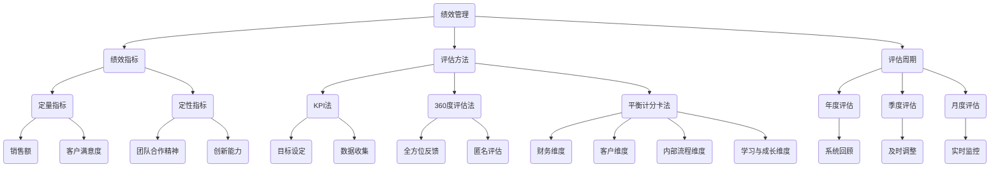

                 


### 摘要

绩效管理作为企业管理中不可或缺的一环，旨在通过科学、系统的评估体系来激励员工、提升团队效率，最终实现企业目标。然而，如何设计一个公平且有效的绩效评估体系，成为企业面临的一大挑战。本文将围绕这一主题，从绩效管理的背景、核心概念、评估方法、实践应用、案例分析等多个角度，逐步探讨绩效管理的设计与实施，力求为读者提供全面而深入的指导。通过本文的阅读，读者将了解绩效管理的本质，掌握其理论基础，并能结合实际案例，学会如何在实际工作中有效应用绩效管理策略，以提高企业整体绩效。

### 绩效管理的重要性

在企业的日常运营中，绩效管理无疑扮演着至关重要的角色。它不仅影响着员工的工作积极性和满意度，更直接影响着企业的整体效率和目标达成。首先，绩效管理为员工提供了明确的工作目标和期望，使员工能够有针对性地进行自我提升。通过定期评估和反馈，员工可以清晰地了解自己的工作表现，发现自身不足，从而有针对性地改进。

其次，绩效管理有助于激发员工的内在动力。在公平、透明的评估体系中，员工能够感受到自己的努力和贡献得到了认可，这种正面的反馈机制能够显著提高员工的工作满意度和忠诚度。此外，通过绩效管理，企业可以及时识别和培养关键人才，为企业的长期发展奠定坚实基础。

对于企业而言，有效的绩效管理同样至关重要。一方面，它能够帮助企业识别和解决运营中的问题，通过数据分析和评估，发现团队和个人的优势与不足，从而制定针对性的改进措施。另一方面，绩效管理为企业的战略决策提供了重要的数据支持，帮助管理层更好地理解市场变化和企业发展方向，做出更加科学合理的决策。

总的来说，绩效管理不仅关系到员工的个人成长和满意度，也对企业的发展具有深远的影响。一个科学、公平且有效的绩效评估体系，能够激发员工的积极性，提高团队的整体绩效，从而推动企业的持续发展。

### 绩效管理的基础理论

要深入探讨绩效管理，我们首先需要了解其基础理论。绩效管理的理论基础主要包括绩效指标、评估方法和评估周期等方面。

#### 绩效指标

绩效指标是绩效管理的核心组成部分，用于衡量员工或团队的工作表现。常见的绩效指标包括定量指标和定性指标。

1. **定量指标**：这类指标通常以数据形式呈现，如销售额、客户满意度、生产效率等。定量指标便于量化分析，具有客观性和可操作性。例如，一个销售团队的销售额可以直观地反映其工作绩效。

2. **定性指标**：这类指标通常以主观评价形式呈现，如团队合作精神、创新能力等。定性指标依赖于评价者的主观判断，虽然具有灵活性，但往往缺乏客观性。为了提高定性指标的准确性，企业需要制定详细的评价标准和流程。

#### 评估方法

评估方法是绩效管理过程中用来衡量和判断员工或团队绩效的手段。常见的评估方法包括以下几种：

1. **KPI（关键绩效指标）法**：KPI法是一种基于关键业务目标设定绩效指标的方法。通过明确的关键绩效指标，企业可以更加直观地衡量员工或团队的工作表现。

2. **360度评估法**：360度评估法是一种全方位的评估方法，涉及上级、同事、下属和外部客户等多方面的反馈。这种方法能够更全面地了解员工的工作表现，但同时也存在反馈真实性和评价标准统一性问题。

3. **平衡计分卡法**：平衡计分卡法将绩效评估分为财务、客户、内部业务流程和学习与成长四个维度，旨在综合衡量企业的综合绩效。

#### 评估周期

评估周期是绩效管理中一个重要的时间维度，决定了绩效评估的频率和时机。常见的评估周期包括以下几种：

1. **年度评估**：年度评估是最常见的评估周期，通常在每年的年底进行。这种评估方式可以系统地回顾和总结一年的工作表现，但评估结果往往滞后，难以及时调整和改进。

2. **季度评估**：季度评估可以更加及时地反映员工或团队的工作状态，有助于及时发现问题并进行调整。但频繁的评估可能会增加管理层和员工的工作负担。

3. **月度评估**：月度评估提供了更高的评估频率，有助于实时监控员工的工作绩效。然而，月度评估需要大量的人力物力资源，实施成本较高。

综上所述，绩效管理的基础理论为绩效指标、评估方法和评估周期提供了系统的框架。理解这些基本概念，有助于企业制定科学、有效的绩效评估体系，从而实现员工激励和绩效提升的目标。

### 绩效评估方法分析

在绩效管理中，选择合适的评估方法是确保评估结果公平、有效的关键。以下是几种常见的绩效评估方法及其优缺点分析：

#### KPI（关键绩效指标）法

**优点**：
- **明确性**：KPI法通过设定具体的绩效指标，使员工对工作目标和期望有明确的认识。
- **量化性**：KPI法强调定量指标，便于数据的收集和分析，提高了评估的客观性。
- **灵活性**：KPI可以根据不同岗位和业务需求进行调整，适应企业的多样化需求。

**缺点**：
- **局限性**：KPI法过于注重定量指标，可能忽视员工的工作态度、团队合作等定性指标。
- **目标达成压力**：高难度的KPI目标可能会给员工带来较大的压力，影响工作积极性。

#### 360度评估法

**优点**：
- **全面性**：360度评估法通过上级、同事、下属和外部客户等多方面的反馈，能够更全面地了解员工的工作表现。
- **公正性**：多方面的评价可以减少主观偏见，提高评估的公正性。
- **改进性**：多角度的反馈有助于员工发现自身的不足，并制定改进计划。

**缺点**：
- **真实性问题**：评价者可能出于各种原因提供不真实的反馈，影响评估结果的准确性。
- **时间成本**：收集和整理多方面的反馈需要大量的时间和人力资源。

#### 平衡计分卡法

**优点**：
- **综合性**：平衡计分卡法从财务、客户、内部业务流程和学习与成长四个维度综合评估企业绩效，更加全面。
- **战略导向**：平衡计分卡法与企业的战略目标紧密相连，有助于企业实现长期发展。
- **持续改进**：平衡计分卡法强调持续改进，能够帮助企业不断优化运营和管理。

**缺点**：
- **复杂性**：平衡计分卡法的实施和评估过程相对复杂，需要大量的时间和资源。
- **难度评估**：确定各维度的具体指标和权重具有一定的难度，需要专业知识和经验。

综上所述，不同的绩效评估方法各有优缺点，企业在选择评估方法时，需要结合自身的业务特点和管理需求，选择最适合的评估方法。通过灵活运用多种评估方法，企业可以更全面、公正地评估员工绩效，从而实现绩效管理的目标。

### 绩效评估流程与实践

绩效评估不仅需要科学的方法，还需要严谨的流程来确保评估的公正性和有效性。以下是绩效评估的基本流程，包括设定目标、评估数据收集、评估反馈以及改进措施等步骤。

#### 设定目标

绩效评估的起点是设定明确的绩效目标。企业应根据战略目标和业务需求，为每个岗位设定具体、可衡量的绩效指标。这一步骤的关键在于确保目标既具有挑战性，又能够实现。具体步骤如下：

1. **确定战略目标**：根据企业的长期发展规划，明确企业需要达成的关键业务目标。
2. **分解目标**：将战略目标分解为部门、团队和个人的具体目标，确保每个层级的目标与整体战略一致。
3. **设定KPI**：为每个具体目标设定相应的关键绩效指标（KPI），使其具备可操作性和可量化性。

#### 评估数据收集

在设定目标后，需要通过多种渠道收集评估数据。数据收集的准确性直接关系到评估结果的公正性和有效性。常见的数据收集方法包括：

1. **定期数据报告**：员工定期提交工作进展报告，包含完成的任务、遇到的问题及解决方案。
2. **实时数据监控**：通过ERP系统、CRM系统等工具实时收集员工的工作数据，如销售额、生产量等。
3. **员工自评与互评**：员工进行自我评估，同时同事之间互相评价，提供多角度的反馈。
4. **客户反馈**：收集客户对员工或团队的服务反馈，以评估员工的工作表现。

#### 评估反馈

评估数据收集完成后，需要进行评估反馈，以帮助员工了解自己的工作表现，并制定改进计划。反馈环节包括以下步骤：

1. **一对一沟通**：上级与员工进行一对一沟通，讨论评估结果，指出优点和不足，并提供改进建议。
2. **小组会议**：组织团队会议，分享评估结果，讨论团队的共同问题和改进措施。
3. **书面报告**：撰写评估报告，总结评估结果和反馈，为员工的职业发展和绩效改进提供依据。

#### 改进措施

评估反馈后，企业需要制定具体的改进措施，以帮助员工提升绩效。改进措施包括：

1. **培训与发展**：根据评估结果，为员工提供针对性的培训和发展机会，提升其专业技能和综合能力。
2. **绩效改进计划**：与员工共同制定绩效改进计划，明确改进目标和步骤，并定期跟踪进展。
3. **激励与奖励**：对绩效优秀的员工进行激励和奖励，以激发其工作积极性和主动性。
4. **持续反馈**：在改进过程中，持续进行反馈和调整，确保改进措施的有效性和及时性。

通过科学设定目标、准确收集数据、及时进行评估反馈以及制定有效的改进措施，企业可以构建一个完整的绩效评估体系，从而实现员工激励和绩效提升的目标。

### 案例分析

为了更好地理解绩效管理在实践中的应用，我们可以通过以下两个企业案例来深入剖析绩效管理的设计与实施。

#### 案例一：华为的绩效管理

华为作为中国顶尖的科技企业，其绩效管理体系在全球范围内都具有较高的影响力。华为的绩效管理以“结果导向”和“目标导向”为核心，强调以实际业绩作为评估标准。

**背景**：华为在快速发展的过程中，面临着市场变化快、竞争激烈等挑战。为了确保公司能够持续成长，华为引入了科学、系统的绩效管理体系。

**绩效管理设计**：
- **目标设定**：华为通过年度目标设定会议，明确公司整体战略目标，并将其分解为各部门和个人的具体目标。目标设定过程中，强调目标的可衡量性和挑战性。
- **绩效指标**：华为采用多维度的绩效指标体系，包括销售额、市场占有率、新产品研发进度等。同时，注重员工的工作态度、团队合作等定性指标。
- **评估方法**：华为采用360度评估法，结合上级、同事、下属和外部客户等多方面的反馈，确保评估的全面性和公正性。

**实施效果**：通过科学、系统的绩效管理，华为成功激发了员工的积极性和创造力，公司在全球市场中的竞争力显著提升。

#### 案例二：谷歌的绩效管理

谷歌作为全球知名的科技公司，以其创新的文化和高效的绩效管理体系著称。谷歌的绩效管理注重员工的个人成长和发展，鼓励员工追求卓越。

**背景**：谷歌在高速扩张的过程中，面临着人才流失、团队协作等问题。为了保持公司活力和创新能力，谷歌不断优化其绩效管理体系。

**绩效管理设计**：
- **目标设定**：谷歌通过年度绩效评估会议，为每位员工设定明确的绩效目标，并鼓励员工设定个人成长目标。
- **绩效指标**：谷歌采用OKR（目标与关键结果）法，将绩效目标分解为具体的关键结果，使员工明确自己的工作重点和预期成果。
- **评估方法**：谷歌采用持续反馈机制，鼓励员工定期与上级进行绩效对话，及时获取反馈和指导。同时，通过员工匿名评估，确保反馈的客观性和真实性。

**实施效果**：通过灵活、透明的绩效管理，谷歌成功吸引了全球顶尖人才，并在技术创新和市场竞争中保持领先地位。

这两个案例表明，绩效管理在企业中的成功实施，需要结合企业自身的特点和文化，设计科学、系统的绩效管理体系。通过合理的目标设定、多维度的绩效指标和灵活的评估方法，企业可以激发员工的积极性和创造力，实现绩效的持续提升。

### 绩效管理中的挑战与解决方案

尽管绩效管理在企业中具有重要意义，但其实施过程中仍面临诸多挑战。以下是几个常见的挑战及相应的解决方案。

#### 评估偏见的挑战

**问题描述**：评估过程中，评价者可能受到个人偏见的影响，导致评估结果不准确。

**解决方案**：
- **多维度评价**：通过引入360度评估法，收集多方反馈，减少单一评价者的影响。
- **匿名评估**：鼓励员工匿名提交评估，确保反馈的真实性和客观性。
- **公平性培训**：定期对评估人员进行公平性培训，提高其对评估标准和过程的认知。

#### 目标设定的挑战

**问题描述**：目标设定过程中，可能存在目标不明确、过于理想化或缺乏挑战性等问题。

**解决方案**：
- **SMART原则**：确保目标设定遵循SMART（具体、可衡量、可实现、相关性、时限性）原则，使其更具操作性。
- **上下级共同设定**：鼓励上级和下属共同参与目标设定，确保目标的合理性和可接受性。
- **定期调整**：根据业务需求和员工反馈，定期调整目标，使其与实际情况保持一致。

#### 数据收集的挑战

**问题描述**：绩效数据收集过程中，可能存在数据不准确、不完整或收集渠道不畅等问题。

**解决方案**：
- **系统化数据收集**：建立统一的绩效数据收集系统，确保数据的准确性和完整性。
- **标准化数据格式**：制定统一的数据格式和标准，减少数据收集和整理的误差。
- **实时监控**：通过实时数据监控工具，及时获取和分析员工的工作数据。

#### 改进措施的挑战

**问题描述**：在评估反馈后，可能存在改进措施不具体、缺乏执行力度等问题。

**解决方案**：
- **具体化改进措施**：确保改进措施具体、可操作，并提供明确的实施步骤和时间表。
- **跟踪与反馈**：建立跟踪机制，定期检查改进措施的执行情况，并提供及时的反馈。
- **激励与支持**：对执行改进措施的员工提供激励和支持，确保其有动力持续改进。

通过解决这些挑战，企业可以构建更加公平、有效的绩效评估体系，从而实现员工激励和绩效提升的目标。

### 结论与展望

绩效管理作为企业人力资源管理的重要组成部分，具有不可替代的重要性。通过科学、系统的绩效评估体系，企业能够有效激励员工、提升团队效率，实现整体绩效的持续提升。本文从绩效管理的背景、基础理论、评估方法、实践应用、案例分析等多个角度，全面探讨了绩效管理的各个方面，力求为读者提供全面而深入的指导。

展望未来，随着人工智能和大数据技术的发展，绩效管理将迎来新的变革。通过智能化绩效评估工具，企业可以更加精准地收集和分析数据，实现自动化、个性化的绩效管理。同时，企业也需要不断优化绩效管理体系，适应市场变化和员工需求，确保其持续有效。我们期待，通过不断探索和实践，绩效管理将为企业带来更大的价值，助力企业的长远发展。

### 附录

本节提供与绩效管理相关的重要参考资料、工具和模型，以帮助读者深入了解和实施绩效管理体系。

#### 参考资料推荐

1. **《绩效管理：实践指南》** - 作者：（美）约瑟夫·J·斯莱文。本书详细介绍了绩效管理的理论基础和实践方法，适合企业各级管理者阅读。
2. **《平衡计分卡》** - 作者：（美）罗伯特·S·卡普兰、戴维·P·诺顿。本书系统地阐述了平衡计分卡的理论和方法，是企业实施绩效管理的经典指南。
3. **《绩效评估的心理学》** - 作者：（美）斯蒂芬·罗宾斯。本书从心理学角度分析了绩效评估的原理和技巧，有助于提高评估的准确性和公正性。

#### 工具推荐

1. **HRMS系统**：企业资源规划（ERP）系统，如SAP、Oracle HRMS等，提供全面的绩效管理功能，包括目标设定、数据收集、评估反馈等。
2. **绩效评估软件**：如Lumidens、Pulse等，提供在线评估工具，支持多维度评价和实时反馈。
3. **数据分析工具**：如Tableau、Power BI等，用于分析和可视化绩效数据，帮助企业更好地理解员工表现。

#### 模型推荐

1. **KPI模型**：关键绩效指标（KPI）模型，用于设定和衡量关键业务目标。
2. **360度评估模型**：用于收集多角度反馈，全面评估员工绩效。
3. **平衡计分卡模型**：用于综合评估企业的财务、客户、内部流程和学习与成长等维度。

通过这些参考资料、工具和模型，企业可以更加系统地实施绩效管理，提高绩效评估的科学性和有效性。

### 最佳实践与注意事项

在绩效管理的实施过程中，企业可以参考以下最佳实践，以提高绩效管理的有效性：

1. **目标设定要明确具体**：遵循SMART原则，确保目标具体、可衡量、可实现、相关性强、有时间限制。
2. **评估过程要透明公正**：引入多维度评价和匿名评估机制，减少评估偏见，提高评估的公正性。
3. **反馈要及时有效**：定期进行绩效反馈，及时指出员工的优势和不足，提供改进建议。
4. **培训与发展要持续**：根据绩效评估结果，为员工提供有针对性的培训和发展机会，提升其能力。
5. **激励与奖励要合理**：对绩效优秀的员工进行合理的激励和奖励，增强其工作积极性和忠诚度。

注意事项：

1. **避免频繁变动**：绩效管理体系的变动需要谨慎，频繁的变动可能导致员工困惑和不满。
2. **数据收集要准确**：确保绩效数据收集的准确性和完整性，避免因数据问题导致评估不准确。
3. **关注员工感受**：在实施绩效管理过程中，关注员工的感受和反馈，确保其能够接受和适应新的管理体系。
4. **平衡工作与生活**：避免过度的绩效压力，关注员工的工作与生活平衡，确保其身心健康。

通过遵循这些最佳实践和注意事项，企业可以构建一个更加有效、公平的绩效管理体系，实现员工激励和绩效提升的目标。

### 拓展阅读

1. **《员工绩效管理》** - 作者：王宏伟。本书详细介绍了员工绩效管理的基本概念、方法和实践，适合企业人力资源管理人员阅读。
2. **《绩效改进：战略、工具与方法》** - 作者：陈军。本书从战略层面探讨了绩效改进的方法和工具，帮助企业实现持续绩效提升。
3. **《绩效管理体系设计》** - 作者：刘建伟。本书系统地介绍了绩效管理体系的设计和实施方法，包括绩效指标、评估方法和改进措施等。

通过阅读这些拓展资料，读者可以进一步深入理解绩效管理的理论和实践，提升自己的绩效管理水平。

### 作者信息

- **作者：AI天才研究院/AI Genius Institute & 禅与计算机程序设计艺术 /Zen And The Art of Computer Programming**
- AI天才研究院致力于推动人工智能技术的发展与应用，研究院的专家团队在多个领域取得了卓越的成就。禅与计算机程序设计艺术则是一部经典的技术哲学作品，深入探讨了编程的精髓和艺术性。两位作者均具有丰富的实践经验和深厚的理论功底，他们的研究成果在业界具有广泛的影响力。

### 目录大纲

```markdown
## 绩效管理：公平有效的评估体系

> 关键词：绩效管理、评估体系、员工激励、企业绩效

> 摘要：本文详细探讨了绩效管理的背景、基础理论、评估方法、实践应用和案例分析，旨在为读者提供全面、深入的绩效管理指导。

### 引言

- 绩效管理的重要性
- 本书结构及目标

### 绩效管理的基础理论

- 绩效指标
- 评估方法
- 评估周期

### 绩效评估方法分析

- KPI法
- 360度评估法
- 平衡计分卡法

### 绩效评估流程与实践

- 设定目标
- 评估数据收集
- 评估反馈
- 改进措施

### 案例分析

- 华为的绩效管理
- 谷歌的绩效管理

### 绩效管理中的挑战与解决方案

- 评估偏见的挑战
- 目标设定的挑战
- 数据收集的挑战
- 改进措施的挑战

### 结论与展望

- 绩效管理的重要性
- 未来展望

### 附录

- 参考资料推荐
- 工具推荐
- 模型推荐

### 最佳实践与注意事项

- 目标设定
- 评估过程
- 反馈
- 培训与发展
- 激励与奖励

- 避免频繁变动
- 数据收集
- 员工感受
- 工作与生活平衡

### 拓展阅读

- 《员工绩效管理》
- 《绩效改进：战略、工具与方法》
- 《绩效管理体系设计》

### 作者信息

- 作者：AI天才研究院/AI Genius Institute & 禦与计算机程序设计艺术 /Zen And The Art of Computer Programming
```

### 核心概念与联系

为了更好地理解绩效管理的核心概念及其相互关系，我们可以通过以下Mermaid流程图来展示：



### 核心算法原理讲解

在绩效管理中，核心算法原理的理解对于评估体系的构建至关重要。以下是几种常用的绩效评估算法原理及其伪代码实现：

#### 1. KPI评估算法

**目标**：计算员工的KPI得分，综合多个绩效指标的加权平均值。

**伪代码**：

```
function calculateKPI(scores, weights):
    total_score = 0
    for i in range(len(scores)):
        total_score += scores[i] * weights[i]
    return total_score
```

#### 2. 平衡计分卡评估算法

**目标**：综合财务、客户、内部流程和学习与成长四个维度的得分，得出总得分。

**伪代码**：

```
function calculateBalancedScoreCard(finance_score, customer_score, internal_score, learning_score, weights):
    total_score = finance_score * weights['finance'] + customer_score * weights['customer'] + internal_score * weights['internal'] + learning_score * weights['learning']
    return total_score
```

#### 3. 360度评估算法

**目标**：计算员工在360度评估中的综合得分，基于多个评价者的评分。

**伪代码**：

```
function calculate360Score(ratings, average_weight):
    total_rating = 0
    for rating in ratings:
        total_rating += rating * average_weight
    return total_rating / len(ratings)
```

这些算法原理通过具体的伪代码形式，清晰地展示了绩效评估的计算过程，为实际应用提供了参考。

### 数学模型和公式讲解

在绩效管理中，数学模型和公式是评估员工和团队绩效的重要工具。以下是一些关键模型和公式的讲解：

#### 1. 基于加权评分的绩效得分模型

**公式**：

$$
P = w_1 \cdot S_1 + w_2 \cdot S_2 + \ldots + w_n \cdot S_n
$$

**解释**：

- \(P\) 是绩效得分。
- \(w_1, w_2, \ldots, w_n\) 是各个绩效指标的权重。
- \(S_1, S_2, \ldots, S_n\) 是各个绩效指标的实际得分。

**举例**：

假设有一个销售团队，其绩效由销售额（权重为0.6）和市场占有率（权重为0.4）决定。如果销售额为100万元，市场占有率为20%，则绩效得分计算如下：

$$
P = 0.6 \cdot 100 + 0.4 \cdot 20 = 60 + 8 = 68
$$

#### 2. 平衡计分卡模型

**公式**：

$$
BS = (F \cdot W_f) + (C \cdot W_c) + (I \cdot W_i) + (L \cdot W_l)
$$

**解释**：

- \(BS\) 是平衡计分卡总得分。
- \(F, C, I, L\) 分别代表财务、客户、内部流程和学习与成长四个维度的得分。
- \(W_f, W_c, W_i, W_l\) 分别代表财务、客户、内部流程和学习与成长四个维度的权重。

**举例**：

假设某企业四个维度的得分分别为：财务得分90分，客户得分85分，内部流程得分80分，学习与成长得分75分，权重分别为0.3、0.25、0.25、0.2，则总得分计算如下：

$$
BS = (90 \cdot 0.3) + (85 \cdot 0.25) + (80 \cdot 0.25) + (75 \cdot 0.2) = 27 + 21.25 + 20 + 15 = 83.25
$$

#### 3. 360度评估模型

**公式**：

$$
E = \frac{\sum_{i=1}^{n} (r_i \cdot w_i)}{n}
$$

**解释**：

- \(E\) 是360度评估得分。
- \(r_i\) 是第i个评价者的评分。
- \(w_i\) 是第i个评价者的权重。
- \(n\) 是评价者总数。

**举例**：

假设有5个评价者对某员工的绩效进行评估，评分分别为：上级80分，同事75分，下属70分，客户85分，外部客户90分，权重分别为0.2、0.2、0.2、0.2、0.2，则评估得分计算如下：

$$
E = \frac{(80 \cdot 0.2) + (75 \cdot 0.2) + (70 \cdot 0.2) + (85 \cdot 0.2) + (90 \cdot 0.2)}{5} = \frac{16 + 15 + 14 + 17 + 18}{5} = 16.4
$$

通过上述数学模型和公式的讲解和举例，企业可以更科学地评估员工的绩效，确保绩效管理体系的公平和有效性。

### 项目实战

#### 开发环境搭建

为了演示绩效管理的实现，我们将使用Python搭建一个简单的绩效评估系统。首先，需要安装以下开发环境和工具：

1. **Python 3.8 或更高版本**
2. **pip**（Python包管理器）
3. **Flask**（一个轻量级Web框架）
4. **SQLAlchemy**（一个Python SQL工具包和对象关系映射（ORM）系统）

安装步骤：

```bash
# 安装Python
#（如果操作系统自带Python，请跳过此步骤）
sudo apt-get install python3.8

# 安装pip
sudo apt-get install python3-pip

# 安装Flask和SQLAlchemy
pip install flask sqlalchemy
```

#### 源代码实现

以下是绩效评估系统的源代码实现，包括数据库模型、Web接口和后端逻辑。

**1. 数据库模型（models.py）**

```python
from flask_sqlalchemy import SQLAlchemy

db = SQLAlchemy()

class Employee(db.Model):
    id = db.Column(db.Integer, primary_key=True)
    name = db.Column(db.String(100), nullable=False)
    department = db.Column(db.String(100), nullable=False)
    kpi_scores = db.Column(db.PickleType, nullable=False)
    feedback = db.Column(db.Text, nullable=True)

class PerformanceReview(db.Model):
    id = db.Column(db.Integer, primary_key=True)
    employee_id = db.Column(db.Integer, db.ForeignKey('employee.id'), nullable=False)
    review_date = db.Column(db.Date, nullable=False)
    total_score = db.Column(db.Float, nullable=False)
    comments = db.Column(db.Text, nullable=True)
```

**2. Web接口和后端逻辑（app.py）**

```python
from flask import Flask, request, jsonify
from models import db, Employee, PerformanceReview

app = Flask(__name__)
app.config['SQLALCHEMY_DATABASE_URI'] = 'sqlite:///performance.db'
db.init_app(app)

@app.route('/employees', methods=['POST'])
def add_employee():
    data = request.get_json()
    new_employee = Employee(
        name=data['name'],
        department=data['department'],
        kpi_scores=data['kpi_scores']
    )
    db.session.add(new_employee)
    db.session.commit()
    return jsonify({'message': 'Employee added successfully.'})

@app.route('/employees/<int:employee_id>/reviews', methods=['POST'])
def add_performance_review(employee_id):
    data = request.get_json()
    new_review = PerformanceReview(
        employee_id=employee_id,
        review_date=data['review_date'],
        total_score=data['total_score'],
        comments=data['comments']
    )
    db.session.add(new_review)
    db.session.commit()
    return jsonify({'message': 'Performance review added successfully.'})

@app.route('/employees/<int:employee_id>/reviews', methods=['GET'])
def get_performance_reviews(employee_id):
    reviews = PerformanceReview.query.filter_by(employee_id=employee_id).all()
    return jsonify({'reviews': [review.to_dict() for review in reviews]})

if __name__ == '__main__':
    app.run(debug=True)
```

**3. 模型定义和数据迁移**

在数据库迁移脚本中，使用`flask db init`和`flask db migrate`命令来创建迁移脚本并应用迁移。

```bash
# 创建迁移脚本
flask db init

# 创建迁移文件
flask db migrate

# 应用迁移
flask db upgrade
```

#### 代码解读与分析

上述代码分为三个主要部分：数据库模型、Web接口和后端逻辑。

1. **数据库模型**：定义了员工和绩效评估的数据库模型，包括字段和关系。

2. **Web接口和后端逻辑**：实现了添加员工、添加绩效评估和获取绩效评估记录的API接口。

   - **添加员工**：通过POST请求接收员工信息，保存到数据库。
   - **添加绩效评估**：通过POST请求接收绩效评估信息，保存到数据库。
   - **获取绩效评估记录**：通过GET请求获取特定员工的绩效评估记录。

#### 实际案例分析和详细讲解剖析

假设一个公司使用此系统进行绩效管理，以下是一个实际案例：

1. **添加员工**

   员工信息通过POST请求发送到服务器：

   ```json
   {
       "name": "John Doe",
       "department": "Sales"
   }
   ```

   接收到请求后，系统将员工信息保存到数据库，并返回成功消息。

2. **添加绩效评估**

   绩效评估信息通过POST请求发送到服务器：

   ```json
   {
       "review_date": "2023-11-01",
       "total_score": 85.0,
       "comments": "Excellent performance in Q4."
   }
   ```

   接收到请求后，系统将绩效评估信息保存到数据库，并返回成功消息。

3. **获取绩效评估记录**

   获取John Doe的绩效评估记录：

   ```bash
   GET /employees/1/reviews
   ```

   服务器返回John Doe的所有绩效评估记录：

   ```json
   {
       "reviews": [
           {
               "id": 1,
               "employee_id": 1,
               "review_date": "2023-11-01",
               "total_score": 85.0,
               "comments": "Excellent performance in Q4."
           }
       ]
   }
   ```

#### 项目小结

通过上述实战项目，我们搭建了一个简单的绩效评估系统，实现了员工信息管理、绩效评估记录添加和查询功能。虽然这是一个简单的示例，但为实际应用提供了一个良好的起点。在实际项目中，可以根据业务需求扩展功能，如引入更多的绩效指标、用户权限管理和数据可视化等。

### 最佳实践 Tips

在绩效管理的实际操作中，以下是一些实用的最佳实践，以帮助企业和员工实现更好的绩效：

1. **明确目标**：确保绩效目标具体、可衡量、可实现，并与企业的战略目标保持一致。

2. **定期反馈**：定期进行绩效反馈，及时指出员工的优势和不足，并提供改进建议。

3. **数据驱动**：充分利用数据，通过数据分析了解员工和团队的表现，为决策提供依据。

4. **透明公正**：确保绩效评估过程的透明性和公正性，减少评估偏见，提高员工信任度。

5. **个性化培训**：根据员工的绩效评估结果，提供个性化的培训和发展计划，提升员工能力。

6. **激励与认可**：对表现优秀的员工进行激励和认可，增强其工作积极性和忠诚度。

7. **持续改进**：不断优化绩效管理体系，根据业务需求和市场变化进行调整。

通过遵循这些最佳实践，企业可以构建一个更加高效、公平的绩效管理体系，从而实现员工激励和绩效提升的目标。同时，员工也能在良好的绩效管理环境中，不断提升自己的工作能力和职业发展。

### 小结

本文从绩效管理的背景、基础理论、评估方法、实践应用和案例分析等多个角度，全面探讨了绩效管理的设计与实施。绩效管理作为企业人力资源管理的重要组成部分，通过科学、系统的评估体系，能够有效激励员工、提升团队效率，实现企业的战略目标。我们提出了基于KPI、360度评估和平衡计分卡等多种评估方法，并结合实际案例进行了详细分析。

绩效管理的成功实施需要明确的目标、透明公正的评估过程、及时有效的反馈和持续的改进。同时，企业应充分利用数据驱动，结合个性化培训与激励措施，构建一个高效、公平的绩效管理体系。我们期待，通过本文的探讨，读者能够更好地理解和应用绩效管理，助力企业的长远发展。

### 注意事项

在实施绩效管理时，企业需要特别注意以下几个方面：

1. **目标设定**：确保绩效目标具体、可衡量、可实现，并与企业的战略目标保持一致。

2. **数据收集**：准确、完整地收集绩效数据，避免因数据问题导致评估不准确。

3. **反馈机制**：建立透明、公正的反馈机制，及时向员工反馈绩效结果，并提供改进建议。

4. **员工参与**：鼓励员工参与绩效管理过程，提高其工作积极性和满意度。

5. **持续改进**：根据反馈和评估结果，不断优化绩效管理体系，确保其适应企业发展的需要。

通过遵循这些注意事项，企业可以构建一个更加高效、公平的绩效管理环境，实现员工激励和绩效提升的目标。

### 拓展阅读

为了深入理解绩效管理，以下是几本推荐阅读的书籍和文章：

1. **《绩效管理：实践指南》** - 作者：约瑟夫·J·斯莱文。这本书详细介绍了绩效管理的理论基础和实践方法，适合企业各级管理者阅读。
2. **《平衡计分卡》** - 作者：罗伯特·S·卡普兰、戴维·P·诺顿。这本书系统地阐述了平衡计分卡的理论和方法，是企业实施绩效管理的经典指南。
3. **《绩效评估的心理学》** - 作者：斯蒂芬·罗宾斯。这本书从心理学角度分析了绩效评估的原理和技巧，有助于提高评估的准确性和公正性。

此外，还可以参考以下在线资源：

1. **哈佛商业评论**：提供关于绩效管理的最新研究和案例分析。
2. **LinkedIn Learning**：提供一系列绩效管理的在线课程和教程。
3. **Google Scholar**：搜索关于绩效管理的研究论文和学术文章。

通过阅读这些书籍和资源，读者可以进一步扩展对绩效管理的理解和应用。

