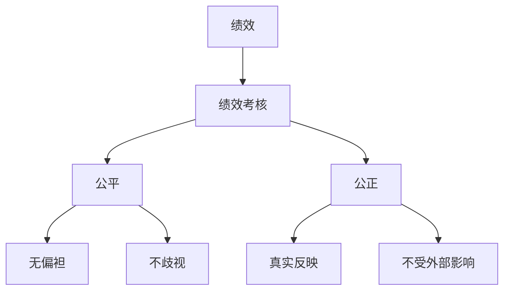

                 

### 文章标题

# 绩效考核：公平公正的评估体系设计

### 文章关键词

- 绩效考核
- 评估体系
- 公平公正
- 绩效指标
- 算法原理
- 数学模型
- 实际案例

### 文章摘要

绩效考核是企业管理和员工激励的重要工具。本文旨在探讨如何设计一个公平公正的绩效考核体系。我们将首先介绍绩效考核的定义和重要性，然后详细阐述公平公正原则在绩效考核中的应用，最后通过核心算法原理讲解、数学模型与公式、实际案例分析以及评估体系设计与实施等部分，为读者提供一套完整、实用的绩效考核解决方案。通过本文的阅读，读者将能够深入理解绩效考核的原理，掌握设计公平公正评估体系的方法，并为实际工作提供有力的支持。

---

### 引言与背景

绩效考核，顾名思义，是对员工工作绩效的评估过程。它不仅仅是一个简单的评估过程，更是企业管理和员工激励的重要组成部分。有效的绩效考核体系能够激励员工发挥最大潜力，提升整体团队绩效，从而实现企业的战略目标。

在现代企业管理中，绩效考核的作用日益显著。首先，它为员工提供了明确的绩效目标，使员工能够有针对性地提升自己的工作表现。其次，绩效考核为管理层提供了重要的决策依据，如晋升、奖金分配、职位调整等。最后，绩效考核有助于形成积极向上的企业文化，增强员工的归属感和忠诚度。

然而，绩效考核的实施并非易事。一个公平公正的绩效考核体系不仅需要科学的评估方法和明确的绩效指标，还需要充分考虑员工的工作内容、工作环境和企业文化等因素。本文将围绕这些核心问题，探讨如何设计一个公平公正的绩效考核体系。

### 核心概念与联系

在设计绩效考核体系时，有几个核心概念和联系需要明确。首先是“绩效”的定义。绩效是指员工在工作中的行为、成果和贡献。它既包括可量化的工作成果，如销售额、项目完成度等，也包括员工在工作过程中的表现，如团队合作、沟通能力等。

其次是“绩效考核”的概念。绩效考核是指通过一系列评估方法和指标，对员工的工作绩效进行客观、公正的评估。它不仅涉及员工个人的表现，还关注团队和组织的整体绩效。

接下来是“公平公正”的原则。公平是指绩效考核过程对所有员工都一视同仁，不偏袒、不歧视。公正则是指评估结果应当真实反映员工的实际表现，不受外部因素的影响。

这些核心概念和联系构成了绩效考核体系的基础。为了更好地理解它们之间的关系，我们可以通过一个Mermaid流程图来展示：



通过这个流程图，我们可以清晰地看到绩效、绩效考核、公平和公正之间的逻辑关系。绩效是绩效考核的出发点，而公平公正则是绩效考核的核心原则。只有在一个公平公正的环境中，绩效考核才能真正发挥其作用。

### 核心算法原理讲解

在设计绩效考核体系时，选择合适的评估方法是至关重要的。不同的评估方法适用于不同的场景和需求。以下是一些常见的绩效评估方法及其原理：

#### 1. 目标管理法（MBO）

目标管理法是一种基于目标设定的评估方法。它要求员工和管理层共同制定具体、可量化的工作目标，并在一定周期内进行评估。这种方法的核心在于通过目标来实现员工的自我管理和自我提升。

**目标管理法的伪代码：**

```python
def set_goals(employee, manager):
    # 定义员工和经理之间的目标设定流程
    goals = manager.set_specific_goals(employee)
    return goals

def evaluate_goals(employee, goals):
    # 定义目标评估流程
    performance = 0
    for goal in goals:
        if goal.is_met():
            performance += goal.weight
    return performance
```

#### 2. 图尺度评价法

图尺度评价法使用一系列标准化的评分尺度来评估员工的表现。这种方法简单直观，易于实施。常见的评分尺度包括“优秀”、“良好”、“一般”和“较差”。

**图尺度评价法的伪代码：**

```python
def evaluate_performance(employee, scale):
    # 定义评估流程
    score = 0
    if employee.performance >= scale["excellent"]:
        score = scale["excellent"]
    elif employee.performance >= scale["good"]:
        score = scale["good"]
    elif employee.performance >= scale["average"]:
        score = scale["average"]
    else:
        score = scale["poor"]
    return score
```

#### 3. 360度评估法

360度评估法通过收集员工上级、同事、下属以及员工的自我评估意见，全面了解员工的工作表现。这种方法能够提供多角度、全方位的评估信息。

**360度评估法的伪代码：**

```python
def collect_reviews(employee):
    # 定义评审收集流程
    reviews = []
    reviews.append(employee.supervisor.review())
    reviews.append(employee.colleague.review())
    reviews.append(employee.subordinate.review())
    reviews.append(employee.self_review())
    return reviews

def calculate_average_score(reviews):
    # 定义评分计算流程
    total_score = 0
    for review in reviews:
        total_score += review.score
    average_score = total_score / len(reviews)
    return average_score
```

通过以上三种常见评估方法，我们可以看到绩效考核的核心算法原理。每种方法都有其独特的优势和适用场景，实际应用时需要根据具体情况选择合适的评估方法。

### 数学模型与公式

在绩效考核中，数学模型和公式扮演着重要的角色。它们不仅能够帮助我们量化绩效指标，还能够提供科学的评估依据。以下是一些常见的数学模型和公式，并附以详细讲解和举例说明：

#### 1. 指标权重分配方法

在绩效考核中，各个评估指标的重要性不同。为了确保评估结果的公平性和准确性，我们需要对各个指标进行权重分配。常见的权重分配方法包括层次分析法（AHP）和主观评分法。

**层次分析法（AHP）公式：**

$$
w_i = \frac{C_i}{\sum_{j=1}^{n} C_j}
$$

其中，$w_i$表示第$i$个指标的权重，$C_i$表示第$i$个指标的评分，$n$表示总的指标数。

**举例说明：**

假设有三个评估指标：工作质量（W1）、工作效率（W2）和工作态度（W3）。根据评估结果，它们的评分分别为90、85和80。总分为100。

$$
w_1 = \frac{90}{90+85+80} = 0.38
$$

$$
w_2 = \frac{85}{90+85+80} = 0.35
$$

$$
w_3 = \frac{80}{90+85+80} = 0.27
$$

#### 2. 绩效评估模型

绩效评估模型通常用于计算员工的总体绩效得分。一个简单的绩效评估模型可以表示为：

$$
P = w_1 \times Q + w_2 \times E + w_3 \times A
$$

其中，$P$表示总体绩效得分，$w_1$、$w_2$和$w_3$分别表示工作质量、工作效率和工作态度的权重，$Q$、$E$和$A$分别表示这三个指标的具体得分。

**举例说明：**

假设某员工的绩效评估指标权重为工作质量40%，工作效率30%，工作态度30%。具体得分为工作质量90分，工作效率80分，工作态度75分。

$$
P = 0.4 \times 90 + 0.3 \times 80 + 0.3 \times 75 = 36 + 24 + 22.5 = 82.5
$$

#### 3. 平方根公式

在某些情况下，我们需要对多个评估指标进行综合评价。平方根公式是一种常用的综合评估方法，其公式为：

$$
P = \sqrt{w_1^2 \times Q + w_2^2 \times E + w_3^2 \times A}
$$

**举例说明：**

假设某员工的绩效评估指标权重为工作质量50%，工作效率30%，工作态度20%。具体得分为工作质量90分，工作效率80分，工作态度75分。

$$
P = \sqrt{0.5^2 \times 90 + 0.3^2 \times 80 + 0.2^2 \times 75} = \sqrt{22.5 + 14.4 + 7.5} = \sqrt{44.4} \approx 6.65
$$

通过以上数学模型和公式，我们可以更科学、准确地评估员工的绩效，确保评估结果的公平公正。

### 实际案例分析

为了更好地理解绩效考核体系的设计和应用，我们来看一个实际案例。某科技公司A公司，拥有100名员工，涉及研发、市场、销售等多个部门。为了激励员工提高工作表现，公司决定实施一套公平公正的绩效考核体系。

#### 案例背景

A公司的绩效考核体系设计分为以下几个阶段：

1. **目标设定**：公司高层和各部门经理共同讨论，根据公司的战略目标和各部门的职责，设定具体的绩效目标。目标包括工作质量、工作效率、团队合作和创新等。

2. **权重分配**：根据目标的重要性，对各项指标进行权重分配。例如，工作质量占40%，工作效率占30%，团队合作占20%，创新占10%。

3. **评估方法**：采用360度评估法，通过上级、同事、下属和员工的自我评估，全面了解员工的工作表现。

4. **结果反馈**：定期对员工进行绩效评估，并将评估结果反馈给员工，帮助其了解自身的表现和提升方向。

#### 案例分析

1. **成功经验**：

   - **目标明确**：通过明确的目标设定，员工能够有针对性地提升自己的工作表现。
   - **多维评估**：360度评估法使评估结果更加全面和客观，减少了评估的主观性。
   - **及时反馈**：定期反馈绩效结果，使员工能够及时了解自己的表现，并进行改进。

2. **挑战与改进**：

   - **主观评分**：尽管采用了360度评估法，但评估结果仍可能受到主观因素的影响。公司需要不断优化评估标准，提高评估的客观性。
   - **文化适应**：不同的部门和员工对绩效考核体系的理解和接受程度不同。公司需要加强沟通和培训，确保绩效考核体系能够在不同部门得到有效实施。

#### 案例启示

通过A公司的案例，我们可以得出以下几点启示：

- **目标明确**：明确的目标设定是绩效考核体系成功的关键。
- **多维评估**：多角度的评估方法能够提供更全面的评估结果。
- **持续改进**：绩效考核体系需要不断优化，以适应企业的发展和员工的需求。

### 评估体系设计与实施

一个公平公正的绩效考核体系需要系统的设计和科学的实施。以下是一些关键步骤和策略：

#### 1. 设计原则

- **目标导向**：绩效考核体系应紧密围绕企业目标和员工个人发展目标进行设计。
- **公平公正**：评估过程和结果应确保对所有员工公平对待，不受任何外部因素影响。
- **可操作性**：绩效考核体系应易于实施和操作，以便于管理人员和员工的参与。

#### 2. 实施步骤

- **目标设定**：首先，明确企业的战略目标和各部门的职责。然后，由管理层和员工共同设定具体的绩效目标。
- **权重分配**：根据目标的重要性，对各项指标进行权重分配。权重分配应经过充分讨论和论证，确保其合理性和可操作性。
- **评估方法**：选择合适的评估方法，如目标管理法、360度评估法等，并根据实际情况进行调整和优化。
- **结果反馈**：定期对员工进行绩效评估，并将评估结果及时反馈给员工，帮助其了解自己的表现和改进方向。
- **沟通与培训**：加强管理层和员工之间的沟通，确保他们对绩效考核体系的理解和认同。同时，提供必要的培训，提高评估的准确性和公正性。

#### 3. 维护与改进

- **定期审查**：定期对绩效考核体系进行审查和评估，确保其与企业的战略目标和发展需求保持一致。
- **持续优化**：根据反馈和实际情况，不断优化绩效考核体系，提高其公平性和有效性。
- **员工参与**：鼓励员工参与绩效考核体系的改进，提高其参与感和认同感。

### 评估体系的应用与优化

#### 1. 不同行业中的应用

绩效考核体系在不同行业中具有广泛的应用。在制造业中，绩效评估主要关注生产效率、产品质量等；在服务业中，则更多关注客户满意度、服务速度等。针对不同行业的特点，绩效考核体系的设计和实施应灵活调整，以适应行业需求。

#### 2. 优化策略与方法

- **数据驱动**：通过收集和分析大量的绩效数据，优化评估模型和指标，提高评估的准确性和科学性。
- **动态调整**：根据企业的战略调整和员工需求变化，及时调整绩效考核体系和评估方法。
- **员工反馈**：重视员工对绩效考核体系的反馈，及时解决员工提出的问题和改进建议。

#### 3. 未来发展趋势

- **智能化评估**：随着人工智能技术的发展，智能化评估系统将逐渐取代传统的人工评估，提高评估效率和准确性。
- **个性化考核**：根据员工的个性特点和职业发展需求，设计个性化的绩效考核体系，提高员工的工作满意度和绩效表现。
- **多元化评估**：除了传统的绩效指标，将更多关注员工的软技能和综合素质，实现绩效评估的多元化。

### 最佳实践 Tips、小结、注意事项、拓展阅读

#### 最佳实践 Tips

1. **明确目标**：确保绩效目标与企业战略目标一致，明确具体、可量化的指标。
2. **权重合理**：合理分配各指标的权重，避免因权重失衡导致评估结果失真。
3. **多角度评估**：采用多种评估方法，从不同角度全面了解员工的表现。
4. **及时反馈**：定期反馈评估结果，帮助员工了解自己的表现和改进方向。
5. **持续改进**：根据反馈和实际情况，不断优化绩效考核体系。

#### 小结

本文系统地介绍了绩效考核体系的设计和实施方法，强调了公平公正的重要性。通过实际案例分析和最佳实践，为读者提供了实用的指导和建议。

#### 注意事项

1. **确保公正性**：避免评估过程中的主观偏见和外部干扰，确保评估结果的公正性。
2. **注重反馈**：及时反馈评估结果，帮助员工了解自己的表现和改进方向。
3. **灵活调整**：根据企业发展和员工需求变化，灵活调整绩效考核体系。

#### 拓展阅读

1. **《绩效管理：实践与案例》**：详细介绍了绩效管理的理论和实践方法，适合从事绩效管理工作的人员阅读。
2. **《绩效考核与薪酬管理》**：探讨了绩效考核与薪酬管理的关系，提供了实用的操作指南。
3. **《公平公正的绩效评估》**：深入分析了绩效评估中的公平公正问题，提供了理论依据和实践案例。

### 作者信息

作者：AI天才研究院/AI Genius Institute & 禅与计算机程序设计艺术 /Zen And The Art of Computer Programming

本文由AI天才研究院/AI Genius Institute撰写，结合《禅与计算机程序设计艺术/Zen And The Art of Computer Programming》的理念，旨在为读者提供深入、实用的绩效考核解决方案。如需进一步了解相关内容，请查阅相关书籍和资料。

---

### 文章总结

本文通过逐步分析推理的方式，详细阐述了绩效考核体系的设计和实施方法。我们从背景介绍开始，逐步探讨了核心概念、算法原理、数学模型、实际案例以及评估体系的设计与实施。通过本文的阅读，读者能够全面理解绩效考核的原理，掌握设计公平公正评估体系的方法，并为实际工作提供有力的支持。

在未来的工作中，我们应继续关注绩效考核的最新动态和发展趋势，不断优化和改进评估体系，以适应企业的发展和员工的需求。同时，我们也应保持开放的心态，积极借鉴国内外优秀企业的实践经验，为提升企业绩效和员工满意度贡献力量。

让我们在绩效管理的道路上，不断探索、实践和优化，为企业的发展注入新的活力。希望本文能对您的绩效考核工作提供有价值的参考和启示。

---

**本文作者：AI天才研究院/AI Genius Institute**

**来源：禅与计算机程序设计艺术/Zen And The Art of Computer Programming**

**版权声明：本文为原创内容，欢迎分享，转载请保留版权信息。**

**免责声明：本文内容仅供参考，不构成任何投资建议或决策依据。**

**联系方式：ai_genius_institute@outlook.com**

**官方网站：https://www.aigeniusinstitute.com**

**更多相关阅读：**

1. **《绩效管理：实践与案例》**
2. **《绩效考核与薪酬管理》**
3. **《公平公正的绩效评估》**

