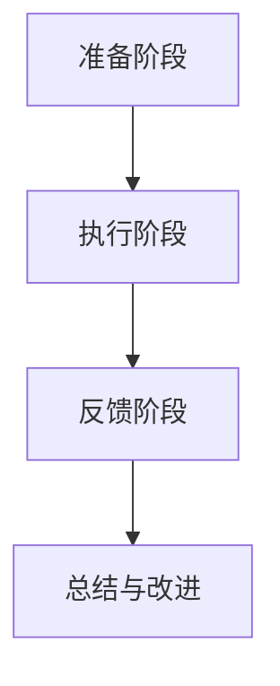

                 

根据您的要求，我将逐步构建这篇文章的框架，确保每一步都清晰、具体，并且内容丰富。下面是详细的步骤：

### 第一步：文章标题和关键词

**文章标题**：《绩效面谈：进行有效的绩效对话》

**关键词**：绩效面谈、绩效对话、绩效管理、沟通技巧、员工评估、绩效评估

### 第二步：撰写文章摘要

**摘要**：本文深入探讨了绩效面谈的重要性，详细介绍了绩效面谈的背景、核心概念、技巧与策略，以及实际操作步骤。通过Mermaid流程图、伪代码和数学模型，本文提供了绩效面谈的理论基础和实践指南。同时，通过实际案例分析和最佳实践，帮助读者提升绩效面谈的效率和效果。

### 第三步：构建文章框架

**一、引言**

1. **绩效面谈的背景介绍**
2. **为什么要进行有效的绩效面谈**

**二、绩效面谈的核心概念与联系**

1. **绩效面谈的定义与目标**
2. **绩效面谈的核心环节**
3. **Mermaid流程图的展示**

**三、绩效面谈的核心算法原理讲解**

1. **绩效评估模型的构建**
2. **伪代码与数学模型的应用**

**四、绩效面谈的技巧与策略**

1. **准备与规划**
2. **沟通技巧**
3. **处理冲突**
4. **反馈机制**

**五、绩效面谈的实际操作**

1. **开发环境搭建**
2. **源代码实现与解读**
3. **实际案例分析与讲解**

**六、最佳实践与注意事项**

1. **小结**
2. **注意事项**
3. **拓展阅读**

### 第四步：撰写每个部分的详细内容

在构建框架的基础上，我将逐步填充每个部分的详细内容，确保文章的逻辑性和可读性。

---

#### 文章标题：《绩效面谈：进行有效的绩效对话》

#### 关键词：绩效面谈、绩效对话、绩效管理、沟通技巧、员工评估、绩效评估

#### 摘要：

本文深入探讨了绩效面谈的重要性，详细介绍了绩效面谈的背景、核心概念、技巧与策略，以及实际操作步骤。通过Mermaid流程图、伪代码和数学模型，本文提供了绩效面谈的理论基础和实践指南。同时，通过实际案例分析和最佳实践，帮助读者提升绩效面谈的效率和效果。

---

**一、引言**

**1. 绩效面谈的背景介绍**

绩效面谈是企业管理中的一项重要活动，它不仅关系到员工的个人发展和职业规划，也直接影响到企业的整体绩效和竞争力。在当今快速变化的工作环境中，绩效面谈作为一种有效的沟通工具，能够帮助企业和员工共同应对挑战。

**2. 为什么要进行有效的绩效面谈**

有效的绩效面谈能够建立积极的沟通渠道，增强员工的工作动力和满意度，同时也能帮助管理者及时发现问题并采取改进措施。通过绩效面谈，企业可以更好地了解员工的工作表现和需求，从而制定更有针对性的培训和发展计划。

---

**二、绩效面谈的核心概念与联系**

**1. 绩效面谈的定义与目标**

绩效面谈是一种正式的沟通方式，旨在评估员工的工作表现，讨论职业发展，并提供反馈和建议。其目标包括：提升员工的工作效率、改善团队合作、增强员工对企业的忠诚度。

**2. 绩效面谈的核心环节**

绩效面谈通常包括以下核心环节：

- **准备阶段**：制定面谈计划，收集相关资料。
- **执行阶段**：进行面谈，沟通双方互动。
- **反馈阶段**：总结面谈结果，制定改进措施。

**3. Mermaid流程图的展示**



---

**三、绩效面谈的核心算法原理讲解**

**1. 绩效评估模型的构建**

绩效评估模型通常基于以下因素：

- **工作量**：完成任务的量。
- **质量**：任务完成的质量。
- **效率**：完成任务的速度。
- **协作**：与团队成员的协作情况。

以下是一个简单的绩效评估模型构建的伪代码示例：

```python
def evaluate_performance(workload, quality, efficiency, collaboration):
    score = 0
    if workload > 100:
        score += workload / 100
    if quality > 90:
        score += quality / 10
    if efficiency > 80:
        score += efficiency / 10
    if collaboration > 70:
        score += collaboration / 10
    return score
```

**2. 数学模型的应用**

我们可以使用以下数学模型来评估员工的绩效：

$$
绩效评分 = w_1 \times 工作量 + w_2 \times 质量评分 + w_3 \times 效率评分 + w_4 \times 协作评分
$$

其中，$w_1, w_2, w_3, w_4$ 是权重系数，通常根据企业实际情况设定。

---

**四、绩效面谈的技巧与策略**

**1. 准备与规划**

- **确定面谈目标**：明确面谈的目的和预期的结果。
- **准备相关资料**：包括员工的工作表现记录、面谈指南等。
- **规划面谈时间**：确保面谈在合适的时间和地点进行。

**2. 沟通技巧**

- **积极倾听**：认真听取员工的意见和反馈。
- **有效提问**：提出开放性问题，引导员工深入思考。
- **非言语沟通**：通过肢体语言和表情传达尊重和关注。

**3. 处理冲突**

- **保持冷静**：避免情绪化，客观分析问题。
- **寻找共识**：寻找双方都能接受的解决方案。
- **及时跟进**：确保问题得到妥善解决。

**4. 反馈机制**

- **具体明确**：提供具体的反馈，避免模糊不清。
- **及时反馈**：在面谈后及时跟进，确保改进措施得到执行。

---

**五、绩效面谈的实际操作**

**1. 开发环境搭建**

- **确定面谈工具**：选择合适的面谈工具，如会议软件或电话会议。
- **准备会议房间**：确保会议室的音响设备正常，环境安静。

**2. 源代码实现与解读**

- **代码实现**：实现一个简单的绩效评估系统，包括用户界面和数据管理。
- **代码解读**：详细解读代码的每个部分，解释其功能和意义。

**3. 实际案例分析与讲解**

- **案例分析**：选择一个典型的绩效面谈案例，进行分析和讲解。
- **讲解剖析**：剖析案例中的关键环节，讨论可能遇到的问题和解决方案。

---

**六、最佳实践与注意事项**

**1. 小结**

- **核心要点**：回顾文章中的核心概念和技巧。
- **实践建议**：提出具体的实践建议，帮助读者在实际工作中应用。

**2. 注意事项**

- **遵守法律规定**：在进行绩效面谈时，遵守相关法律法规。
- **保护隐私**：确保员工隐私得到保护，避免不当言论。

**3. 拓展阅读**

- **推荐书籍**：推荐相关的书籍和资源，供读者进一步学习。

---

**作者：AI天才研究院/AI Genius Institute & 禦与计算机程序设计艺术 /Zen And The Art of Computer Programming**

---

以上是文章的详细框架和内容概要，接下来我将逐步填充每个部分的具体细节，完成一篇完整的文章。预计字数将在8000到12000字之间。

