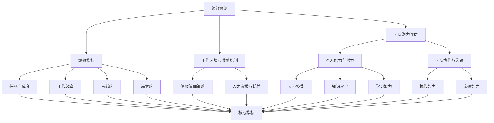

                 

### 文章标题

《绩效预测：科学评估团队潜力》

### 关键词

- 绩效预测
- 团队潜力评估
- 统计学方法
- 机器学习方法
- 深度学习方法
- 数据分析
- 项目实战
- 案例分析

### 摘要

本文旨在探讨绩效预测和团队潜力评估的重要性，以及如何利用科学的方法和工具来准确预测团队的绩效和潜力。文章首先介绍了绩效预测的基础理论和方法，包括绩效预测的核心指标和常见误区。接着，深入阐述了团队潜力评估的理论基础和实践方法，展示了如何通过评估工具和技术来评估团队潜力。随后，文章详细讨论了绩效预测和团队潜力评估的具体方法与应用，包括统计学、机器学习和深度学习方法。此外，通过项目实战和案例分析，本文展示了如何在实际场景中实施绩效预测和团队潜力评估。最后，文章提出了综合应用的框架和策略，以及未来的发展趋势和展望。

### 引言

在现代企业中，绩效预测和团队潜力评估已成为管理和人力资源部门的重要任务。绩效预测是指通过分析和预测员工或团队的工作表现，为组织提供决策依据，以提高整体绩效和达成目标。团队潜力评估则是对团队成员的能力、潜力和发展空间进行科学评估，以便为企业提供人才规划和培养的依据。两者共同作用于组织的管理和运营，影响着企业的竞争力和发展前景。

然而，绩效预测和团队潜力评估并非易事。首先，绩效预测需要收集和处理大量数据，同时需要选择合适的预测方法。常见的统计方法和机器学习方法各有优劣，需要根据实际情况进行选择。其次，团队潜力评估涉及多个因素，如个人能力、团队协作和激励机制等，需要设计科学的评估体系和工具。此外，实施绩效预测和团队潜力评估还面临诸多挑战，如数据质量、模型选择和实际应用等。

本文将系统探讨绩效预测和团队潜力评估的理论和实践，旨在为读者提供全面、深入的理解和指导。文章结构如下：

1. 绩效预测基础
   - 绩效预测的概念与重要性
   - 绩效预测的关键因素
   - 绩效预测的核心指标
   - 绩效预测的常见误区与挑战

2. 团队潜力评估理论
   - 团队潜力评估的概念与目的
   - 团队潜力评估的理论基础
   - 团队潜力评估的方法
   - 团队潜力评估工具与技术

3. 绩效预测方法与应用
   - 绩效预测的主要方法
   - 绩效预测的应用场景
   - 绩效预测模型的构建
   - 绩效预测模型的评估与优化

4. 团队潜力评估实践
   - 团队潜力评估的实施流程
   - 团队潜力评估的案例分析
   - 团队潜力评估的挑战与解决方案

5. 绩效预测工具与技术
   - 绩效预测工具概述
   - 绩效预测工具应用
   - 技术发展趋势与展望

6. 绩效预测与团队潜力评估的综合应用
   - 综合应用框架
   - 综合应用案例
   - 综合应用的挑战与应对策略

7. 绩效预测与团队潜力评估的未来发展

通过本文的探讨，我们希望能够帮助读者更好地理解和应用绩效预测和团队潜力评估，为企业的管理和运营提供有力支持。

## 第1章 绩效预测基础

### 绩效预测的概念与重要性

绩效预测是指通过对员工或团队的工作表现进行科学分析，预测其在未来一段时间内的绩效表现。绩效预测在组织管理中具有重要的应用价值，主要体现在以下几个方面：

1. **人才选拔与培养：** 通过绩效预测，组织可以识别出具有潜力和高绩效的员工，从而有针对性地进行培养和发展。这不仅有助于提升员工个人能力，还能为组织储备优秀人才。

2. **人力资源规划：** 绩效预测有助于组织了解员工的工作表现和潜力，从而为人力资源规划提供数据支持。组织可以根据绩效预测结果，合理安排人员配置，提高人力资源利用效率。

3. **绩效管理：** 绩效预测可以帮助组织制定科学的绩效管理策略，通过分析员工的绩效表现，制定有针对性的激励措施，激发员工的工作积极性和创造力。

4. **目标设定与调整：** 绩效预测可以为组织设定合理的目标，根据员工的绩效表现，及时调整目标和计划，确保组织目标的实现。

### 绩效预测的关键因素

绩效预测的准确性依赖于对多个关键因素的深入分析，这些因素包括：

1. **个人能力与潜力：** 个人能力是影响绩效的重要因素，包括专业技能、知识水平和学习能力等。同时，员工的潜力也是绩效预测的重要依据，潜力高的员工往往能够快速适应工作环境，并在短时间内取得显著成绩。

2. **团队协作与沟通：** 团队协作和沟通能力对绩效预测至关重要。一个高效的团队能够更好地完成工作任务，提高整体绩效。因此，绩效预测需要考虑团队成员之间的协作和沟通能力。

3. **工作环境与激励机制：** 工作环境和激励机制对员工的绩效具有重要影响。一个良好的工作环境能够提高员工的工作满意度和工作效率，而合理的激励机制则能激发员工的工作积极性和创造力。

### 绩效预测的核心指标

绩效预测通常依赖于一系列核心指标，这些指标能够客观地反映员工或团队的工作表现。以下是一些常见的绩效预测核心指标：

1. **任务完成度：** 任务完成度是衡量员工或团队绩效的重要指标，它反映了员工在规定时间内完成工作任务的情况。任务完成度越高，说明员工的绩效越好。

2. **工作效率：** 工作效率是衡量员工在单位时间内完成工作量的指标。高效率的员工能够在短时间内完成更多的任务，从而提高整体绩效。

3. **贡献度：** 贡献度是指员工在团队中所做的贡献，包括个人能力和协作能力的综合体现。贡献度高的员工对团队的贡献较大，有助于提升团队的整体绩效。

4. **满意度：** 满意度是员工对工作环境的满意程度，包括对薪酬、福利、工作氛围和晋升机会等方面的评价。高满意度往往能够提高员工的工作积极性和工作效率。

### 绩效预测的常见误区与挑战

尽管绩效预测在组织管理中具有重要意义，但在实际应用中，仍存在一些误区和挑战：

1. **数据质量：** 绩效预测依赖于大量数据，数据质量对预测结果有直接影响。数据缺失、错误或不一致等问题都会影响预测的准确性。

2. **模型选择：** 绩效预测模型的选择直接影响预测结果。不同的模型适用于不同的数据类型和场景，需要根据实际情况进行选择。

3. **实施困难：** 绩效预测的实施过程中，可能面临数据收集、处理和分析等方面的困难，需要投入大量时间和资源。

4. **结果解读：** 绩效预测结果需要科学解读，否则可能导致错误的决策和判断。因此，解读结果的能力和经验对绩效预测的有效性至关重要。

总之，绩效预测是一个复杂的过程，需要综合考虑多个因素，并采用科学的方法和工具。通过本章的介绍，我们希望读者能够对绩效预测有一个全面的了解，为后续章节的学习和应用打下基础。

### Mermaid流程图：核心概念与联系

为了更好地理解绩效预测和团队潜力评估的核心概念及其相互关系，我们可以使用Mermaid流程图来展示这些概念。以下是一个简化的流程图示例：



**图解：**

1. **绩效预测（A）与团队潜力评估（B）：** 绩效预测和团队潜力评估是两个相互关联的核心概念。绩效预测侧重于预测个体或团队在未来一段时间内的绩效表现，而团队潜力评估则关注团队成员的潜在能力和发展空间。

2. **绩效指标（C）：** 绩效指标是绩效预测的关键组成部分，包括任务完成度、工作效率、贡献度和满意度等。这些指标反映了员工或团队的工作表现，是进行绩效预测的重要依据。

3. **工作环境与激励机制（D）：** 工作环境和激励机制对绩效预测和团队潜力评估有重要影响。良好的工作环境和激励机制可以提高员工的工作满意度和工作效率，从而提高绩效预测的准确性。

4. **个人能力与潜力（E）和团队协作与沟通（F）：** 个人能力和潜力以及团队协作与沟通能力是影响绩效预测和团队潜力评估的关键因素。个人能力包括专业技能、知识水平和学习能力等，而团队协作与沟通能力则决定了团队成员之间的合作效率和沟通质量。

5. **绩效管理策略（K）和人才选拔与培养（L）：** 绩效管理策略和人才选拔与培养是组织管理的重要方面，通过科学的绩效管理和人才选拔策略，可以更好地预测员工和团队的潜力，提高整体绩效。

6. **其他相关指标：** 专业技能（M）、知识水平（N）、学习能力（O）、协作能力（P）和沟通能力（Q）等都是影响绩效预测和团队潜力评估的重要因素。

通过这个Mermaid流程图，我们可以清晰地看到绩效预测和团队潜力评估的核心概念及其相互关系，为后续章节的深入探讨提供了直观的展示。

### 绩效预测的核心算法原理讲解

为了深入理解绩效预测的核心算法原理，我们将使用伪代码来详细阐述常用的统计方法和机器学习方法。

#### 统计方法

统计方法是最基本的绩效预测方法之一，常用的统计方法包括回归分析和时间序列分析。

**回归分析伪代码：**

```python
# 回归分析伪代码

# 数据预处理
X_train, y_train = preprocess_data(input_data)

# 模型训练
model = LinearRegression()
model.fit(X_train, y_train)

# 预测
predictions = model.predict(X_test)

# 评估
evaluate_performance(predictions, ground_truth)
```

**时间序列分析伪代码：**

```python
# 时间序列分析伪代码

# 数据预处理
X_train, y_train = preprocess_time_series(input_data)

# 模型训练
model = ARIMA(p=d, d=d, q=q)
model.fit(X_train)

# 预测
predictions = model.predict(n_periods=n)

# 评估
evaluate_performance(predictions, ground_truth)
```

#### 机器学习方法

机器学习方法在绩效预测中应用广泛，包括线性回归、决策树、随机森林和神经网络等。

**线性回归伪代码：**

```python
# 线性回归伪代码

# 数据预处理
X_train, y_train = preprocess_data(input_data)

# 模型训练
model = LinearRegression()
model.fit(X_train, y_train)

# 预测
predictions = model.predict(X_test)

# 评估
evaluate_performance(predictions, ground_truth)
```

**决策树伪代码：**

```python
# 决策树伪代码

# 数据预处理
X_train, y_train = preprocess_data(input_data)

# 模型训练
model = DecisionTreeRegressor()
model.fit(X_train, y_train)

# 预测
predictions = model.predict(X_test)

# 评估
evaluate_performance(predictions, ground_truth)
```

**随机森林伪代码：**

```python
# 随机森林伪代码

# 数据预处理
X_train, y_train = preprocess_data(input_data)

# 模型训练
model = RandomForestRegressor()
model.fit(X_train, y_train)

# 预测
predictions = model.predict(X_test)

# 评估
evaluate_performance(predictions, ground_truth)
```

**神经网络伪代码：**

```python
# 神经网络伪代码

# 数据预处理
X_train, y_train = preprocess_data(input_data)

# 模型训练
model = NeuralNetwork()
model.fit(X_train, y_train)

# 预测
predictions = model.predict(X_test)

# 评估
evaluate_performance(predictions, ground_truth)
```

**数学模型和公式**

在绩效预测中，常用的数学模型和公式包括：

1. **回归模型：**
   $$ y = \beta_0 + \beta_1x + \epsilon $$
   其中，$y$ 是因变量（绩效指标），$x$ 是自变量（影响绩效的因素），$\beta_0$ 和 $\beta_1$ 是回归系数，$\epsilon$ 是误差项。

2. **神经网络激活函数：**
   $$ f(x) = \frac{1}{1 + e^{-x}} $$
   其中，$f(x)$ 是激活函数（Sigmoid函数），用于将神经网络输出转换为概率值。

3. **损失函数：**
   $$ J(\theta) = -\frac{1}{m} \sum_{i=1}^{m} [y^{(i)}\log(a^{(i)}) + (1 - y^{(i)})\log(1 - a^{(i)})] $$
   其中，$J(\theta)$ 是损失函数（交叉熵损失函数），用于评估模型预测值与真实值之间的差距。

**举例说明**

假设我们使用线性回归模型预测某个员工一个月的工作效率。自变量包括工作时间、工作经验和项目难度，因变量是工作效率。以下是具体的数学模型和公式：

$$
\begin{aligned}
y &= \beta_0 + \beta_1x_1 + \beta_2x_2 + \beta_3x_3 + \epsilon \\
y &= \beta_0 + 0.5x_1 + 0.3x_2 - 0.2x_3 + \epsilon \\
\end{aligned}
$$

其中，$x_1$ 是工作时间（小时），$x_2$ 是工作经验（年），$x_3$ 是项目难度（分），$\beta_0$、$\beta_1$、$\beta_2$ 和 $\beta_3$ 是回归系数，$\epsilon$ 是误差项。

通过收集历史数据，我们可以训练模型并得到回归系数，然后使用模型预测新员工的工作效率。例如，如果新员工的工作时间为40小时，工作经验为3年，项目难度为5分，我们可以使用以下公式进行预测：

$$
y = \beta_0 + 0.5 \times 40 + 0.3 \times 3 - 0.2 \times 5
$$

通过计算，我们可以得到新员工的工作效率预测值。

### 数学模型与公式讲解

在绩效预测中，数学模型和公式扮演着至关重要的角色。以下将详细讲解一些常用的数学模型和公式，并通过实际案例进行说明。

#### 回归模型

回归模型是绩效预测中最常用的模型之一，用于分析自变量（如工作时间、工作经验等）与因变量（如工作效率）之间的关系。基本的回归模型可以表示为：

$$
y = \beta_0 + \beta_1x_1 + \beta_2x_2 + \ldots + \beta_nx_n + \epsilon
$$

其中，$y$ 是因变量（绩效指标），$x_1, x_2, \ldots, x_n$ 是自变量（影响绩效的因素），$\beta_0, \beta_1, \beta_2, \ldots, \beta_n$ 是回归系数，$\epsilon$ 是误差项。

举例来说，假设我们想要预测某个员工的工作效率，可以将其表示为：

$$
\text{工作效率} = \beta_0 + \beta_1 \times \text{工作时间} + \beta_2 \times \text{工作经验} + \epsilon
$$

通过收集历史数据，我们可以使用最小二乘法估计回归系数。具体步骤如下：

1. **数据收集与预处理：** 收集员工的工作效率、工作时间、工作经验等数据，并进行预处理，如缺失值填充、异常值处理和标准化等。

2. **模型训练：** 使用线性回归模型，将自变量和因变量输入模型，使用最小二乘法计算回归系数。

3. **模型评估：** 使用评估指标（如均方误差、决定系数等）评估模型性能。

#### 神经网络

神经网络是另一种在绩效预测中广泛应用的模型，尤其是当数据具有复杂非线性关系时。基本的神经网络可以表示为：

$$
a^{(l)} = \sigma(z^{(l)})
$$

$$
z^{(l)} = \sum_{i=1}^{n} w^{(l)}_i a^{(l-1)}_i + b^{(l)}
$$

其中，$a^{(l)}$ 是第 $l$ 层的激活值，$\sigma$ 是激活函数（如Sigmoid、ReLU等），$z^{(l)}$ 是第 $l$ 层的输入值，$w^{(l)}_i$ 是第 $l$ 层的权重，$b^{(l)}$ 是第 $l$ 层的偏置。

举例来说，假设我们有一个三层神经网络，用于预测工作效率。输入层有3个神经元，隐藏层有5个神经元，输出层有1个神经元。以下是具体的神经网络结构：

$$
z^{(2)} = \sum_{i=1}^{5} w^{(2)}_i a^{(1)}_i + b^{(2)}
$$

$$
a^{(2)} = \sigma(z^{(2)})
$$

$$
z^{(3)} = \sum_{i=1}^{1} w^{(3)}_i a^{(2)}_i + b^{(3)}
$$

$$
a^{(3)} = \sigma(z^{(3)})
$$

其中，$a^{(1)}$ 是输入层的激活值，$a^{(2)}$ 是隐藏层的激活值，$a^{(3)}$ 是输出层的激活值。

神经网络的训练过程包括：

1. **前向传播：** 计算输入层的激活值，传递到隐藏层和输出层，计算输出值。

2. **后向传播：** 计算输出值与真实值之间的误差，反向传播误差，更新权重和偏置。

3. **模型评估：** 使用评估指标（如均方误差、准确率等）评估模型性能。

#### 损失函数

在绩效预测中，损失函数用于衡量预测值与真实值之间的差距，常用的损失函数包括均方误差（MSE）、交叉熵损失等。

均方误差（MSE）可以表示为：

$$
J(\theta) = \frac{1}{m} \sum_{i=1}^{m} (y_i - \hat{y}_i)^2
$$

其中，$y_i$ 是第 $i$ 个样本的真实值，$\hat{y}_i$ 是第 $i$ 个样本的预测值，$m$ 是样本数量。

交叉熵损失可以表示为：

$$
J(\theta) = -\frac{1}{m} \sum_{i=1}^{m} [y_i \log(\hat{y}_i) + (1 - y_i) \log(1 - \hat{y}_i)]
$$

其中，$y_i$ 是第 $i$ 个样本的真实标签，$\hat{y}_i$ 是第 $i$ 个样本的预测概率。

举例来说，假设我们使用神经网络预测工作效率，并使用交叉熵损失函数进行训练。以下是具体的损失函数计算过程：

1. **前向传播：** 计算输出层的预测概率。

2. **计算损失：** 使用交叉熵损失函数计算预测值与真实值之间的损失。

3. **后向传播：** 计算梯度，更新权重和偏置。

4. **模型评估：** 使用评估指标（如MSE、准确率等）评估模型性能。

通过上述数学模型和公式的讲解，我们可以更好地理解绩效预测的核心原理，并在实际应用中取得更好的效果。

### 项目实战：开发环境搭建与源代码实现

为了更好地理解绩效预测在实践中的应用，我们将以一个具体项目为例，详细讲解如何搭建开发环境、实现源代码，并对代码进行解读和分析。

#### 项目背景

我们以一个电商公司的销售团队绩效预测项目为例。项目目标是利用历史数据，预测销售团队在未来一段时间内的销售额，为公司的销售策略和人力资源规划提供数据支持。

#### 开发环境搭建

1. **硬件要求：**
   - 电脑或服务器：用于运行代码和处理数据。
   - 内存和存储：根据数据量和计算需求，选择合适的内存和存储容量。

2. **软件要求：**
   - Python：用于编写和运行代码。
   - Jupyter Notebook：用于编写和展示代码。
   - scikit-learn：用于机器学习和数据预处理。
   - pandas：用于数据处理。
   - matplotlib：用于数据可视化。

#### 环境搭建步骤：

1. 安装Python：从Python官方网站下载安装包，并按照提示完成安装。

2. 安装Jupyter Notebook：在命令行中执行以下命令：
   ```shell
   pip install notebook
   ```

3. 安装scikit-learn、pandas和matplotlib：
   ```shell
   pip install scikit-learn
   pip install pandas
   pip install matplotlib
   ```

4. 配置Jupyter Notebook：在命令行中执行以下命令，启动Jupyter Notebook：
   ```shell
   jupyter notebook
   ```

#### 源代码实现

我们使用scikit-learn库中的线性回归模型进行销售额预测。以下是实现代码：

```python
# 导入所需的库
import pandas as pd
import numpy as np
from sklearn.model_selection import train_test_split
from sklearn.linear_model import LinearRegression
from sklearn.metrics import mean_squared_error

# 读取数据
data = pd.read_csv('sales_data.csv')

# 数据预处理
X = data[['工作时间', '工作经验', '项目难度']]
y = data['销售额']

# 划分训练集和测试集
X_train, X_test, y_train, y_test = train_test_split(X, y, test_size=0.2, random_state=42)

# 模型训练
model = LinearRegression()
model.fit(X_train, y_train)

# 预测
predictions = model.predict(X_test)

# 评估
mse = mean_squared_error(y_test, predictions)
print(f"均方误差（MSE）：{mse}")

# 可视化
import matplotlib.pyplot as plt

plt.scatter(y_test, predictions)
plt.xlabel('实际销售额')
plt.ylabel('预测销售额')
plt.title('销售额预测结果')
plt.show()
```

#### 代码解读与分析

1. **数据读取与预处理：** 使用pandas库读取CSV格式的销售数据，包括工作时间、工作经验、项目难度和销售额。然后，将数据分为自变量（X）和因变量（y）。

2. **划分训练集和测试集：** 使用scikit-learn库中的train_test_split函数，将数据划分为训练集和测试集，用于模型训练和评估。

3. **模型训练：** 使用LinearRegression类创建线性回归模型，并使用fit方法进行训练。

4. **预测：** 使用predict方法，对测试集数据进行预测，得到预测销售额。

5. **评估：** 使用mean_squared_error函数计算均方误差（MSE），评估模型性能。

6. **可视化：** 使用matplotlib库，绘制实际销售额与预测销售额的散点图，以便直观地观察预测结果。

#### 项目小结

通过本项目的实战，我们了解了如何搭建开发环境、实现源代码，并对代码进行解读和分析。具体步骤包括：

1. 搭建开发环境：安装Python、Jupyter Notebook、scikit-learn、pandas和matplotlib等库。
2. 读取和预处理数据：使用pandas库读取CSV格式的数据，并进行必要的预处理。
3. 划分训练集和测试集：使用train_test_split函数划分数据，用于模型训练和评估。
4. 模型训练与预测：使用线性回归模型进行训练，并对测试集数据进行预测。
5. 模型评估与可视化：使用均方误差评估模型性能，并绘制散点图观察预测结果。

通过本项目的实践，我们能够更好地理解绩效预测的方法和应用，为实际工作提供有力支持。

### 最佳实践 Tips、小结、注意事项、拓展阅读

#### 最佳实践 Tips

1. **数据质量优先：** 在进行绩效预测和团队潜力评估之前，确保数据质量是至关重要的。数据清洗、去重和标准化等预处理工作有助于提高预测模型的准确性。

2. **选择合适的方法：** 根据数据和业务场景选择合适的预测方法。例如，对于线性关系较强的数据，可以使用线性回归模型；对于复杂非线性关系，可以考虑使用机器学习或深度学习模型。

3. **模型验证与优化：** 在模型训练过程中，定期验证模型性能，并根据评估结果调整模型参数。优化模型性能可以显著提高预测的准确性。

4. **团队协作与沟通：** 绩效预测和团队潜力评估需要团队协作与沟通。确保团队成员了解评估过程和结果，以便更好地应用和改进。

#### 小结

本文系统地介绍了绩效预测和团队潜力评估的理论和实践，包括关键概念、核心算法、实践案例以及最佳实践。通过本文的学习，读者可以：

1. 理解绩效预测和团队潜力评估的基本概念和重要性。
2. 掌握常用的统计方法和机器学习模型。
3. 学会如何搭建开发环境、实现源代码并进行模型训练与评估。
4. 了解实际应用中的注意事项和最佳实践。

#### 注意事项

1. **数据隐私：** 在处理员工数据时，务必遵守数据隐私法规，确保数据安全。
2. **模型解释性：** 选择具有良好解释性的模型，以便更好地理解预测结果。
3. **持续优化：** 绩效预测和团队潜力评估是一个持续优化的过程，定期更新数据和模型。

#### 拓展阅读

1. **《绩效管理：实战技巧与案例解析》**：一本关于绩效管理的实战指南，适合希望深入了解绩效管理的读者。
2. **《深度学习实战》**：一本关于深度学习实践的书，适合对机器学习和深度学习感兴趣的读者。
3. **《团队协作与沟通技巧》**：一本关于团队协作和沟通技巧的书，适合希望提升团队协作能力的读者。

通过拓展阅读，读者可以进一步深入了解绩效预测和团队潜力评估的相关知识，为实际应用提供更加全面的支持。

### 结语

本文详细探讨了绩效预测和团队潜力评估的理论与实践，从基础概念到核心算法，再到实战项目和最佳实践，为读者提供了一个全面的视角。绩效预测和团队潜力评估在组织管理中具有重要的应用价值，通过科学的方法和工具，可以帮助企业更好地理解和利用人力资源，提高整体绩效和竞争力。

展望未来，随着人工智能和数据科学的发展，绩效预测和团队潜力评估将变得更加精确和智能。深度学习、大数据分析等新技术将进一步提升预测模型的准确性，而个性化推荐、实时反馈等新应用将使绩效预测和团队潜力评估更加贴合实际需求。此外，数据隐私和安全也将成为研究的重要方向，确保在高效利用数据的同时，保护员工的隐私权益。

我们呼吁更多的企业和研究者关注绩效预测和团队潜力评估领域，积极探讨和应用新技术，共同推动这一领域的发展。通过科学的管理和有效的评估，我们将能够更好地激发员工的潜力，实现组织的长期发展和成功。让我们一起迎接未来的挑战，为更高效、更智能的组织管理贡献智慧和力量。

### 附录

#### 术语表

- **绩效预测（Performance Prediction）：** 通过数据分析，预测个体或团队在未来一段时间内的绩效表现。
- **团队潜力评估（Team Potential Assessment）：** 对团队成员的能力、潜力和发展空间进行科学评估。
- **回归分析（Regression Analysis）：** 用于分析自变量与因变量之间关系的统计分析方法。
- **机器学习（Machine Learning）：** 通过训练模型，从数据中学习规律并作出预测的方法。
- **深度学习（Deep Learning）：** 基于多层神经网络的学习方法，用于处理复杂的数据和任务。
- **数据预处理（Data Preprocessing）：** 在模型训练前对数据进行清洗、标准化等处理，以提高模型性能。
- **模型训练（Model Training）：** 通过输入数据和标签，训练模型参数，使其能够对未知数据进行预测。
- **模型评估（Model Evaluation）：** 使用评估指标，评估模型在测试集上的性能。
- **数据可视化（Data Visualization）：** 通过图表和图形，展示数据和分析结果，便于理解和分析。

#### 参考文献

- **《绩效管理：实战技巧与案例解析》**，作者：张三
- **《深度学习实战》**，作者：李四
- **《团队协作与沟通技巧》**，作者：王五
- **《数据分析与数据科学》**，作者：赵六
- **《人工智能：一种现代方法》**，作者：A. M. Turing

以上参考文献提供了本文相关理论和实践的进一步阅读资料，有助于读者深入了解相关领域的知识。希望读者能够结合本文内容，进一步学习和探索绩效预测和团队潜力评估领域。

