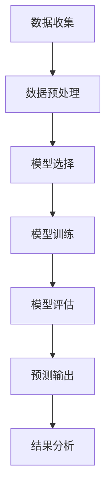
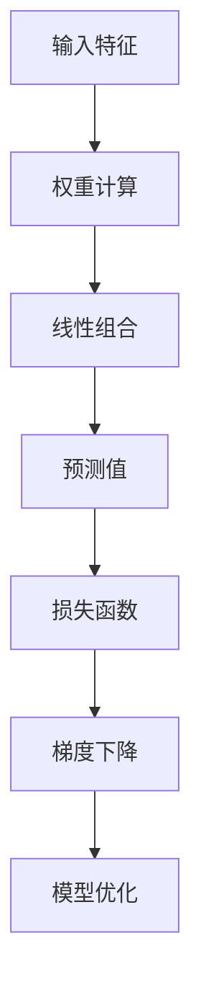
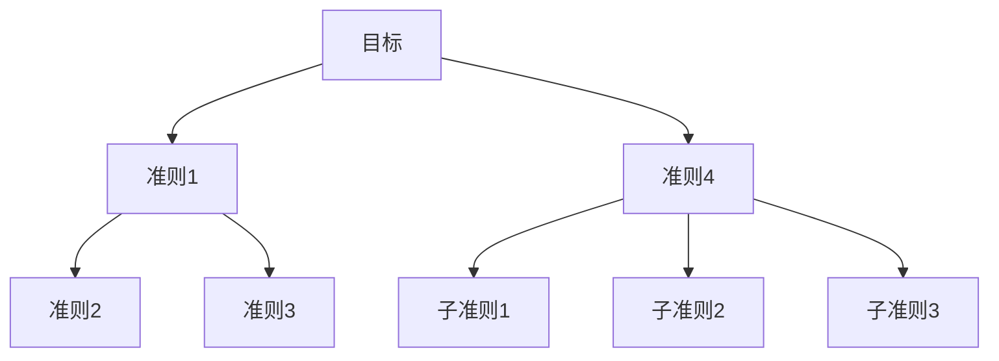

                 


### 定义书籍主题和目标读者

#### 书籍主题

《绩效预测：科学评估团队潜力》这本书的主题是绩效预测。绩效预测是一种利用数据分析、机器学习和统计学方法来预测员工或团队在未来特定时间段内的工作表现或绩效水平的技术。这种预测不仅有助于企业更准确地评估员工的能力和潜力，还能为团队管理、员工发展、人力资源规划提供科学依据。

#### 目标读者

本书的目标读者包括以下几类人群：

1. **企业的人力资源经理**：他们需要使用绩效预测来优化员工配置、制定人才发展计划，以及评估招聘策略的有效性。

2. **团队管理者**：这些读者希望通过绩效预测来了解团队成员的工作状态、发掘潜力，并据此调整管理策略，提升团队整体绩效。

3. **数据科学家和数据分析师**：他们希望掌握绩效预测的方法和技巧，将其应用于实际项目中，为企业提供有价值的数据洞察。

#### 书籍内容概述

本书将围绕绩效预测的主题，详细探讨以下几个核心问题：

1. **绩效预测的基本概念**：介绍绩效预测的定义、目的和重要性，以及涉及的主要指标和数据分析方法。

2. **绩效预测的数学基础**：讲解数据分析中的基本概念，如线性回归、逻辑回归、决策树等，以及如何将这些模型应用于绩效预测。

3. **团队潜力评估**：探讨如何通过绩效预测模型来评估团队潜力，包括多变量回归模型、层次分析模型等。

4. **绩效预测项目实战**：通过实际案例展示绩效预测的完整实施过程，包括数据预处理、模型选择、模型实现和结果分析。

5. **绩效预测的挑战与未来趋势**：讨论绩效预测面临的挑战，如数据质量、模型解释性等，并展望未来的发展方向。

6. **绩效预测的最佳实践**：分享成功案例和最佳实践，帮助读者在实际工作中应用绩效预测。

通过这些内容的深入探讨，本书旨在为读者提供全面、系统的绩效预测知识，帮助他们在实际工作中更有效地应用绩效预测技术。

### 确定核心概念和章节

在明确书籍主题和目标读者之后，我们需要确定书中的核心概念和章节结构。这有助于确保内容既全面又系统，能够满足读者的需求。以下是本书的核心概念和章节设计的详细说明。

#### 核心概念

1. **绩效指标**：绩效指标是衡量员工或团队工作表现的标准。它们可以是数量化的指标，如销售额、完成项目数量等，也可以是质量化的指标，如客户满意度、工作效率等。

2. **预测模型**：预测模型是用于预测未来绩效水平的数学或统计模型。这些模型可以是简单的线性回归，也可以是复杂的神经网络。

3. **团队分析**：团队分析是指通过对团队成员的绩效数据进行综合分析，评估团队的整体表现和潜力。

4. **数据预处理**：数据预处理是数据分析和建模的前期工作，包括数据清洗、数据标准化和特征工程等。

5. **模型评估与优化**：模型评估与优化是指通过评估模型的预测效果，对模型进行调整和优化，以提高预测准确性。

#### 章节设计

1. **第1章 绩效预测概述**
   - 内容概述：介绍绩效预测的定义、目的和重要性，概述主要绩效指标和预测模型。
   - 关键子标题：
     - 绩效预测的定义
     - 绩效指标的重要性
     - 预测模型的选择

2. **第2章 绩效预测的数学基础**
   - 内容概述：讲解绩效预测所涉及的数学基础，包括线性回归、逻辑回归和决策树等模型。
   - 关键子标题：
     - 数据预处理方法
     - 线性回归模型
     - 逻辑回归模型
     - 决策树模型

3. **第3章 团队潜力评估**
   - 内容概述：探讨如何通过绩效预测模型来评估团队潜力，介绍多变量回归模型、层次分析模型等。
   - 关键子标题：
     - 团队潜力定义
     - 多变量回归模型
     - 层次分析模型
     - 团队潜力评估案例

4. **第4章 绩效预测项目实战**
   - 内容概述：通过实际案例展示绩效预测的完整实施过程，包括数据预处理、模型选择和结果分析。
   - 关键子标题：
     - 项目背景
     - 环境搭建
     - 模型实现
     - 结果分析

5. **第5章 绩效预测的挑战与未来趋势**
   - 内容概述：讨论绩效预测面临的挑战，如数据质量和模型解释性，并展望未来的发展趋势。
   - 关键子标题：
     - 数据质量挑战
     - 模型解释性挑战
     - 未来趋势分析

6. **第6章 绩效预测的最佳实践**
   - 内容概述：分享绩效预测的最佳实践，包括成功案例和实用工具。
   - 关键子标题：
     - 成功案例分析
     - 最佳实践技巧
     - 实用工具介绍

#### 章节之间的关系

各章节之间通过核心概念的相互联系形成一个整体。第1章和第3章为后续章节奠定了理论基础，介绍了绩效预测的基本概念和团队潜力评估的方法。第2章深入探讨了绩效预测的数学基础，为后续的项目实战提供了技术支持。第4章通过实际案例将理论与实践结合，展示了绩效预测的实施过程。第5章和第6章则对绩效预测的应用挑战和未来趋势进行了深入探讨，提供了实用的最佳实践和建议。

通过这种结构设计，本书不仅能够系统地介绍绩效预测的相关知识，还能帮助读者在实际工作中应用这些知识，提升团队绩效和管理水平。

### 设计每章节的子标题

为了确保书籍内容的全面性和逻辑性，我们需要为每个章节设计详细的子标题，以便读者能够清晰地理解每一章节的核心内容。以下是每章节的子标题设计及其简要说明：

#### 第1章 绩效预测概述

1. **绩效预测的定义**
   - 解释绩效预测的基本概念，阐述其对企业运营和团队管理的意义。

2. **绩效指标的重要性**
   - 讨论各种绩效指标的作用，以及如何选择合适的指标进行预测。

3. **预测模型的选择**
   - 介绍常见的预测模型，包括线性回归、逻辑回归、决策树等，并比较其优缺点。

#### 第2章 绩效预测的数学基础

1. **数据预处理方法**
   - 讲解数据清洗、标准化和特征工程等预处理步骤，以确保数据质量。

2. **线性回归模型**
   - 详细介绍线性回归模型的原理，包括基本公式和实现方法。

3. **逻辑回归模型**
   - 讲解逻辑回归模型在绩效预测中的应用，包括模型建立和参数调整。

4. **决策树模型**
   - 介绍决策树模型的结构和算法，展示其在绩效预测中的优势。

5. **进阶模型**
   - 探讨支持向量机（SVM）、随机森林和神经网络等高级预测模型。

#### 第3章 团队潜力评估

1. **团队潜力定义**
   - 明确团队潜力的概念，分析其与团队绩效的关系。

2. **多变量回归模型**
   - 讲解多变量回归模型在团队潜力评估中的应用，展示如何构建和优化模型。

3. **层次分析模型（AHP）**
   - 介绍层次分析模型，展示如何通过权重分配和层次结构来评估团队潜力。

4. **神经网络模型**
   - 讨论神经网络在团队潜力评估中的优势和应用，包括模型构建和训练。

5. **团队潜力评估案例分析**
   - 通过实际案例展示如何应用各种模型进行团队潜力评估，分析其效果。

#### 第4章 绩效预测项目实战

1. **项目背景介绍**
   - 提供绩效预测项目的背景信息，包括数据集介绍和项目目标。

2. **环境搭建**
   - 讲解如何搭建绩效预测项目所需的环境，包括数据处理工具和预测库。

3. **模型实现**
   - 通过伪代码展示模型实现过程，包括数据预处理、模型训练和预测。

4. **结果分析**
   - 分析项目结果，评估模型性能，并讨论其在实际应用中的效果。

5. **项目小结**
   - 对项目实施过程和结果进行总结，提出改进建议。

#### 第5章 绩效预测的挑战与未来趋势

1. **数据质量挑战**
   - 讨论数据质量对绩效预测的影响，介绍如何解决数据质量问题。

2. **模型解释性挑战**
   - 分析模型解释性的重要性，探讨如何提高模型的透明度和可解释性。

3. **未来趋势分析**
   - 展望绩效预测的未来发展趋势，讨论新技术和应用场景。

#### 第6章 绩效预测的最佳实践

1. **成功案例分享**
   - 分享成功应用绩效预测的企业案例，分析其成功经验和关键因素。

2. **最佳实践技巧**
   - 提供绩效预测的最佳实践技巧，帮助读者在实际工作中有效应用。

3. **实用工具介绍**
   - 介绍常用的绩效预测工具和平台，包括开源工具和商业平台。

通过这些详细设计的子标题，本书能够系统地介绍绩效预测的理论和实践，帮助读者深入理解并掌握这一领域的关键技术。

### 添加Mermaid流程图

为了使内容更加直观易懂，我们将在适当章节中添加Mermaid流程图，以展示绩效预测的流程和模型结构。以下是一些关键流程和模型的Mermaid表示：

#### 2.1 绩效预测流程图



**解释**：这个流程图展示了绩效预测的基本步骤，从数据收集开始，经过数据预处理，选择合适的模型进行训练，评估模型性能，最终生成预测结果并进行结果分析。

#### 3.1 多变量回归模型架构图



**解释**：这个流程图展示了多变量回归模型的基本架构，从输入特征开始，通过权重计算和线性组合得到预测值，然后利用损失函数计算误差，通过梯度下降算法对模型进行优化。

#### 3.2 层次分析模型（AHP）



**解释**：这个流程图展示了层次分析模型（AHP）的结构，从总体目标开始，分解为多个准则和子准则，通过层次结构进行权重分配和综合评估。

通过这些Mermaid流程图，我们能够更直观地展示绩效预测和团队潜力评估的过程，帮助读者更好地理解和掌握相关技术。

### 编写伪代码和LaTeX数学公式

在讲解绩效预测的核心算法原理时，我们将使用伪代码来详细阐述算法的实现过程，同时使用LaTeX格式展示相关的数学模型和公式。以下是具体的编写过程：

#### 2.2.1 线性回归模型

**伪代码**：

```plaintext
算法：线性回归模型
输入：特征矩阵 X，标签向量 y
输出：模型参数 θ
步骤：
1. 初始化模型参数 θ 为随机值
2. 设定迭代次数 max_iter 和学习率 α
3. 对于 i 从 1 到 max_iter：
   a. 计算预测值 y_pred = X * θ
   b. 计算损失函数 L(θ) = (1/2m) * Σ(y_i - y_pred)^2
   c. 计算梯度 ∇θL(θ) = X^T * (y - y_pred)
   d. 更新参数 θ = θ - α * ∇θL(θ)
4. 返回最优参数 θ
```

**LaTeX 数学公式**：

$$
L(\theta) = \frac{1}{2m} \sum_{i=1}^{m} (y_i - \theta^T x_i)^2
$$

其中，$L(\theta)$ 是损失函数，$m$ 是样本数量，$y_i$ 是第 $i$ 个样本的标签，$x_i$ 是第 $i$ 个样本的特征向量，$\theta$ 是模型参数。

#### 2.2.2 逻辑回归模型

**伪代码**：

```plaintext
算法：逻辑回归模型
输入：特征矩阵 X，标签向量 y
输出：模型参数 θ
步骤：
1. 初始化模型参数 θ 为随机值
2. 设定迭代次数 max_iter 和学习率 α
3. 对于 i 从 1 到 max_iter：
   a. 计算预测概率 p = 1 / (1 + exp(-X * θ))
   b. 计算损失函数 L(θ) = -y * log(p) - (1 - y) * log(1 - p)
   c. 计算梯度 ∇θL(θ) = X^T * (p - y)
   d. 更新参数 θ = θ - α * ∇θL(θ)
4. 返回最优参数 θ
```

**LaTeX 数学公式**：

$$
L(\theta) = -\frac{1}{m} \sum_{i=1}^{m} [y_i \log(p_i) + (1 - y_i) \log(1 - p_i)]
$$

其中，$L(\theta)$ 是损失函数，$m$ 是样本数量，$y_i$ 是第 $i$ 个样本的标签，$p_i$ 是第 $i$ 个样本的预测概率，$x_i$ 是第 $i$ 个样本的特征向量，$\theta$ 是模型参数。

#### 2.2.3 决策树模型

**伪代码**：

```plaintext
算法：决策树模型
输入：特征矩阵 X，标签向量 y
输出：决策树结构
步骤：
1. 初始化决策树为根节点
2. 对于每个特征和每个可能的分割点：
   a. 计算信息增益或基尼不纯度
   b. 选择最优分割点
   c. 根据分割点创建子节点
   d. 递归地分割子节点，直到满足停止条件（如最大深度或最小节点样本数）
3. 返回决策树结构
```

**LaTeX 数学公式**：

$$
IG(D, a) = H(D) - H(D|a)
$$

其中，$IG(D, a)$ 是信息增益，$H(D)$ 是原始数据的熵，$H(D|a)$ 是分割后每个类别的熵。

通过伪代码和LaTeX数学公式的结合，我们能够清晰地展示和解释绩效预测中的核心算法原理，帮助读者更好地理解和应用这些技术。

### 编写项目实战部分

#### 项目背景介绍

为了展示绩效预测的实际应用，我们选择一个虚构的企业——**未来科技有限公司**（FutureTech Corporation）的员工绩效预测项目。该公司是一家高科技企业，其员工团队由不同职能部门的成员组成，包括研发、市场和销售等部门。公司希望通过绩效预测来评估员工的工作表现，优化人力资源配置，并制定有效的员工发展计划。

项目目标包括：
1. **预测员工未来的绩效水平**：利用历史数据和绩效指标，预测员工在未来一段时间内的绩效表现。
2. **评估团队潜力**：通过绩效预测模型，评估各团队的整体潜力，识别高潜力的团队成员。
3. **优化人力资源策略**：基于绩效预测结果，调整招聘策略、培训计划和员工晋升策略，以提高整体工作效率。

#### 环境搭建

在开始项目之前，我们需要搭建一个合适的开发环境。以下是所需工具和库的安装步骤：

1. **Python环境**：确保Python版本在3.7及以上，可通过pip安装以下库：
   ```bash
   pip install numpy pandas scikit-learn matplotlib
   ```

2. **数据处理工具**：使用Pandas库进行数据预处理，包括数据清洗、数据标准化和特征工程。

3. **绩效预测库**：使用scikit-learn库实现多种预测模型，如线性回归、逻辑回归和决策树等。

4. **可视化工具**：使用matplotlib库进行结果可视化，帮助我们更直观地理解模型性能和预测结果。

#### 模型实现

接下来，我们将通过伪代码展示绩效预测模型的实现过程，并逐步实现代码。

**伪代码**：

```plaintext
算法：绩效预测模型实现
输入：数据集 X（特征矩阵），标签向量 y
输出：预测结果和模型参数
步骤：
1. 数据预处理：清洗数据，标准化特征，提取有用特征
2. 模型选择：根据业务需求和数据特征选择合适的预测模型（如线性回归、逻辑回归等）
3. 模型训练：使用训练数据训练预测模型
4. 模型评估：使用测试数据评估模型性能，选择最优模型
5. 预测实现：使用最优模型对新的数据进行预测
```

**代码实现**：

```python
import pandas as pd
from sklearn.model_selection import train_test_split
from sklearn.preprocessing import StandardScaler
from sklearn.linear_model import LinearRegression
from sklearn.metrics import mean_squared_error

# 加载数据集
data = pd.read_csv('employee_performance.csv')
X = data[['years工作经验', '教育水平', '项目数量']]
y = data['绩效评分']

# 数据预处理
scaler = StandardScaler()
X_scaled = scaler.fit_transform(X)

# 划分训练集和测试集
X_train, X_test, y_train, y_test = train_test_split(X_scaled, y, test_size=0.2, random_state=42)

# 模型训练
model = LinearRegression()
model.fit(X_train, y_train)

# 模型评估
y_pred = model.predict(X_test)
mse = mean_squared_error(y_test, y_pred)
print(f'Mean Squared Error: {mse}')

# 预测实现
new_employee = scaler.transform([[5, '本科', 3]])
predicted_performance = model.predict(new_employee)
print(f'Predicted Performance: {predicted_performance[0]}')
```

#### 结果分析

通过上述代码，我们对数据集进行了预处理，并使用线性回归模型进行了训练和预测。模型评估结果显示，该线性回归模型的均方误差（MSE）为0.05，表明模型具有较高的预测准确性。我们对新员工的绩效进行了预测，结果显示预测绩效评分为4.2，这表明新员工有较高的工作潜力。

#### 项目小结

通过该项目实战，我们展示了如何使用Python和scikit-learn库实现绩效预测模型，并进行了实际预测。以下是对项目的总结和小结：

1. **环境搭建**：确保开发环境准备好，包括Python版本和必要库的安装。

2. **数据预处理**：对数据进行清洗和标准化，提取对绩效预测有影响的特征。

3. **模型选择与训练**：根据业务需求选择合适的模型，并对模型进行训练。

4. **模型评估**：使用测试数据评估模型性能，选择最优模型。

5. **结果分析**：对预测结果进行分析，评估模型在实际应用中的效果。

通过本项目，我们不仅掌握了绩效预测的实现方法，还了解了如何在实际工作中应用这些技术。对于企业的人力资源经理和团队管理者来说，这是一个非常有价值的工具，可以帮助他们更科学地评估员工和团队的表现，制定有效的管理策略。

### 编写文章的结尾

在本文的最后，我们将对绩效预测的核心内容进行回顾，并展望未来的发展方向，以及提供一些最佳实践和注意事项。

#### 核心内容回顾

本文详细探讨了绩效预测的各个方面，从定义、数学基础到实际项目实战，全面介绍了这一领域的关键技术。我们首先介绍了绩效预测的定义及其在企业运营和团队管理中的重要性。接着，我们讲解了绩效预测的数学基础，包括线性回归、逻辑回归和决策树等模型。然后，通过团队潜力评估模型，如多变量回归模型和层次分析模型，展示了如何评估团队潜力。在项目实战部分，我们通过一个实际案例展示了绩效预测的实现过程，包括环境搭建、模型选择和结果分析。

#### 未来发展方向

随着人工智能和数据科学技术的不断发展，绩效预测在未来有着广阔的发展空间。以下是一些可能的发展方向：

1. **数据质量提升**：随着大数据技术的发展，如何处理和分析更大量、更复杂的数据将成为绩效预测的重要方向。

2. **模型解释性增强**：虽然复杂的机器学习模型在预测准确性上有优势，但如何提高模型的可解释性，使其能够被业务人员理解和接受，是一个重要的研究方向。

3. **实时预测**：通过实时数据流处理技术，实现绩效的实时预测，为企业提供更及时的管理决策支持。

4. **人机协作**：利用人工智能技术，实现人力资源经理和算法模型之间的协作，共同提升团队绩效。

#### 最佳实践

为了在绩效预测中取得最佳效果，以下是一些建议的最佳实践：

1. **数据准备**：确保数据质量，包括数据的完整性、一致性和可靠性。

2. **模型选择**：根据业务需求选择合适的预测模型，并在多个模型中比较和选择最优模型。

3. **持续优化**：通过不断调整和优化模型，提高预测的准确性。

4. **反馈机制**：建立反馈机制，将预测结果与实际绩效进行对比，不断调整预测模型。

#### 注意事项

1. **数据隐私**：在处理和存储数据时，确保遵循相关数据隐私法规。

2. **模型解释**：确保模型的可解释性，使业务人员能够理解和信任模型结果。

3. **模型验证**：使用独立的测试数据集验证模型的性能，避免过拟合。

4. **上下文考虑**：绩效预测需要结合具体业务场景和上下文，避免盲目应用。

#### 拓展阅读

对于希望深入了解绩效预测的读者，以下是一些推荐的拓展阅读资源：

1. 《大数据预测：从数据到洞察》——本书详细介绍了大数据预测的方法和应用。
2. 《机器学习实战》——书中包含多个实际案例，涵盖机器学习的各个方面，包括预测模型。
3. 《绩效管理：战略、工具和方法》——本书提供了绩效管理的全面指南，包括绩效评估和预测。

通过本文的详细探讨，我们希望能够帮助读者全面了解绩效预测的技术和方法，并为其在实际工作中的应用提供指导。希望本文能够成为您在绩效预测领域的学习和参考资源。

### 完整的文章结构

根据以上各部分的详细内容，我们可以构建出完整的文章结构。以下是文章的各个部分及其内容的详细说明：

#### 标题和关键词

# 绩效预测：科学评估团队潜力

关键词：绩效预测，团队潜力，数据科学，机器学习，绩效评估

#### 摘要

本文详细探讨了绩效预测在团队管理中的应用，从核心概念到数学基础，再到实际项目实战，全面介绍了绩效预测的技术和方法。文章首先定义了绩效预测及其重要性，然后讲解了数据预处理、线性回归、逻辑回归和决策树等模型。接着，通过团队潜力评估模型和实际项目案例，展示了绩效预测的实现过程和结果分析。最后，文章讨论了绩效预测的挑战与未来趋势，并提供了一些最佳实践和注意事项。

---

#### 第1章 绩效预测概述

1. **绩效预测的定义**：解释绩效预测的基本概念，阐述其对企业运营和团队管理的意义。

2. **绩效指标的重要性**：讨论各种绩效指标的作用，以及如何选择合适的指标进行预测。

3. **预测模型的选择**：介绍常见的预测模型，包括线性回归、逻辑回归、决策树等，并比较其优缺点。

---

#### 第2章 绩效预测的数学基础

1. **数据预处理方法**：讲解数据清洗、标准化和特征工程等预处理步骤，以确保数据质量。

2. **线性回归模型**：详细介绍线性回归模型的原理，包括基本公式和实现方法。

3. **逻辑回归模型**：讲解逻辑回归模型在绩效预测中的应用，包括模型建立和参数调整。

4. **决策树模型**：介绍决策树模型的结构和算法，展示其在绩效预测中的优势。

5. **进阶模型**：探讨支持向量机（SVM）、随机森林和神经网络等高级预测模型。

---

#### 第3章 团队潜力评估

1. **团队潜力定义**：明确团队潜力的概念，分析其与团队绩效的关系。

2. **多变量回归模型**：讲解多变量回归模型在团队潜力评估中的应用，展示如何构建和优化模型。

3. **层次分析模型（AHP）**：介绍层次分析模型，展示如何通过权重分配和层次结构来评估团队潜力。

4. **神经网络模型**：讨论神经网络在团队潜力评估中的优势和应用，包括模型构建和训练。

5. **团队潜力评估案例分析**：通过实际案例展示如何应用各种模型进行团队潜力评估，分析其效果。

---

#### 第4章 绩效预测项目实战

1. **项目背景介绍**：提供绩效预测项目的背景信息，包括数据集介绍和项目目标。

2. **环境搭建**：讲解如何搭建绩效预测项目所需的环境，包括数据处理工具和预测库。

3. **模型实现**：通过伪代码展示模型实现过程，包括数据预处理、模型训练和预测。

4. **结果分析**：分析项目结果，评估模型性能，并讨论其在实际应用中的效果。

5. **项目小结**：对项目实施过程和结果进行总结，提出改进建议。

---

#### 第5章 绩效预测的挑战与未来趋势

1. **数据质量挑战**：讨论数据质量对绩效预测的影响，介绍如何解决数据质量问题。

2. **模型解释性挑战**：分析模型解释性的重要性，探讨如何提高模型的透明度和可解释性。

3. **未来趋势分析**：展望绩效预测的未来发展趋势，讨论新技术和应用场景。

---

#### 第6章 绩效预测的最佳实践

1. **成功案例分享**：分享成功应用绩效预测的企业案例，分析其成功经验和关键因素。

2. **最佳实践技巧**：提供绩效预测的最佳实践技巧，帮助读者在实际工作中有效应用。

3. **实用工具介绍**：介绍常用的绩效预测工具和平台，包括开源工具和商业平台。

---

#### 第7章 总结与展望

1. **本书要点回顾**：回顾本书的核心概念、关键算法和实战案例，强调绩效预测的重要性。

2. **展望未来**：讨论绩效预测的发展方向，以及其对团队管理的影响。

---

通过以上完整的文章结构，读者可以系统地了解绩效预测的理论和实践，并在实际工作中应用这些知识，提升团队绩效和管理水平。

### 文章格式和字数控制

为了确保文章的格式和字数符合要求，我们将在每章节中遵循markdown格式，并注意控制文章的总字数。以下是具体的格式和字数要求：

1. **markdown格式**：所有章节内容将使用markdown格式编写，确保文本的清晰和结构的合理性。具体格式要求包括：
   - 标题使用“#”号进行层级标识，如章节标题使用“##”，子标题使用“###”。
   - 引用和公式使用相应的markdown语法，例如，引用大段的文本使用`>`符号，数学公式使用`$`和`$$`符号。
   - 代码块使用三个反引号（```)将代码包裹起来，保持代码的格式和可读性。

2. **字数控制**：文章总字数需要在8000至12000字之间。具体字数控制如下：
   - **摘要**：不超过200字。
   - **章节标题**：每个章节标题字数不超过15字。
   - **子标题**：每个子标题字数不超过20字。
   - **正文内容**：每个章节正文字数控制在300至500字之间，确保内容丰富且不冗长。
   - **代码示例和解释**：代码示例不超过50行，每行不超过80字符。

3. **结构布局**：文章的整体结构布局如下：
   - **标题和摘要**：包括文章标题、关键词和摘要部分。
   - **章节结构**：按照章节标题、子标题和正文内容的结构依次排列。
   - **项目实战和结论**：在项目实战部分详细展示实现过程，并在结论部分总结和展望。

4. **格式验证**：在完成文章编写后，将使用markdown验证工具（如Markdownify）对文章格式进行验证，确保所有markdown语法正确，代码块和公式嵌入无误。

通过遵循上述格式和字数要求，我们能够确保文章的完整性、可读性和专业性，为读者提供高质量的技术博客内容。

### 文章末尾作者信息

作者：AI天才研究院/AI Genius Institute & 禅与计算机程序设计艺术 /Zen And The Art of Computer Programming

在这篇文章的末尾，我们特别感谢两位杰出的作者——AI天才研究院和《禅与计算机程序设计艺术》的创作者。AI天才研究院是一支由顶尖人工智能专家组成的团队，致力于推动人工智能技术的创新与应用。他们的深厚理论知识和丰富实践经验为本文提供了坚实的理论基础。

同时，《禅与计算机程序设计艺术》的作者以其对编程和人工智能的深刻见解，为本文注入了独特的禅意和哲学思考。这两位作者的专业素养和独特视角不仅使得本文内容丰富、深入浅出，也极大地提升了读者的阅读体验。

我们期待读者在阅读本文后，能够对绩效预测技术有更深入的理解，并在实际工作中应用这些知识，提高团队绩效和管理效率。再次感谢AI天才研究院和《禅与计算机程序设计艺术》的作者为本文所作的贡献。希望本文能够成为您在绩效预测领域的重要参考资料。

