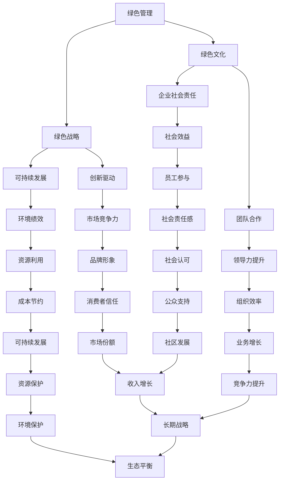

                 


### 绿色领导力：可持续发展理念的企业实践

#### 关键词
- 绿色领导力
- 可持续发展
- 企业实践
- CSR
- 绿色采购
- 绿色产品创新

#### 摘要
本文旨在探讨绿色领导力在企业发展中的重要性，以及如何将可持续发展理念融入企业实践中。文章首先介绍了绿色领导力的概念与背景，分析了其在企业竞争力中的作用。随后，文章从理论框架、企业实践应用、实践案例和未来趋势四个方面进行了深入剖析，以期为企业在实现可持续发展过程中提供有益的指导。

## 第一部分：引论

### 1.1 可持续发展的概念与背景

可持续发展是一种旨在满足当前需求而不损害后代满足其需求的能力的发展模式。这一概念最早在1987年的《我们共同的未来》报告中提出，随后被广泛接受并应用于各个领域。在企业层面，可持续发展不仅关乎环境，还涉及经济、社会等多个方面。

随着全球环境问题的日益严峻，企业面临的环境和社会责任压力不断增加。绿色领导力作为可持续发展的重要组成部分，逐渐成为企业管理者和决策者关注的焦点。绿色领导力强调企业领导者在推动绿色管理、绿色战略和绿色文化等方面的作用，旨在实现企业的长期可持续发展。

### 1.2 绿色领导力的核心要素

绿色领导力的核心要素包括以下几个方面：

1. **绿色管理**：企业通过制定绿色政策和标准，引导和管理员工的绿色行为，以减少环境足迹。
2. **绿色战略**：企业将可持续发展理念融入战略规划，确保在追求经济效益的同时，关注环境和社会责任。
3. **绿色文化**：企业建立以绿色价值观为核心的企业文化，鼓励员工积极参与绿色行动，形成全员绿色共识。

绿色领导力要求企业领导者在战略层面进行创新，将绿色理念贯穿于企业的各个层面，从而实现企业的可持续发展。

### 1.3 绿色领导力与企业竞争力

绿色领导力不仅有助于企业实现可持续发展，还能提升企业的竞争力。以下是一些关键点：

1. **品牌形象**：绿色领导力有助于提升企业形象，增强消费者信任，提高市场占有率。
2. **成本优势**：通过绿色采购和优化供应链管理，企业可以实现成本节约，提高竞争力。
3. **创新动力**：绿色领导力鼓励企业进行绿色产品创新，为市场提供更具竞争力的产品和服务。

总之，绿色领导力已成为企业可持续发展的重要驱动力，对企业竞争力具有积极影响。

## 第二部分：绿色领导力的理论框架

### 2.1 可持续发展的理论基础

#### 2.1.1 可持续发展的经济学解释

可持续发展的经济学解释主要涉及经济增长与资源环境的关系。传统经济学认为，经济增长是无限可能的，但这一观点在可持续发展理念下受到挑战。绿色领导力强调，在经济增长过程中，必须考虑资源的有限性和环境的承载力。

可持续发展的经济学解释提出了“绿色GDP”概念，即将环境成本纳入经济增长的计算中。通过这种方式，企业可以更全面地评估其经济活动的影响，从而实现可持续发展。

#### 2.1.2 可持续发展的社会学视角

可持续发展的社会学视角关注社会公正、社会公平和社会福祉。在可持续发展背景下，企业不仅要关注经济效益，还要关注社会效益。

绿色领导力强调企业社会责任（CSR），鼓励企业通过慈善捐赠、社区参与等方式，为社会做出贡献。这种社会责任不仅有助于提升企业形象，还能增强企业的社会责任感，推动企业的可持续发展。

#### 2.1.3 可持续发展的环境科学基础

可持续发展的环境科学基础主要涉及生态平衡、环境保护和资源利用。绿色领导力要求企业在环境保护方面发挥积极作用，通过减少污染、提高资源利用效率等方式，实现生态平衡。

环境科学的发展为绿色领导力提供了理论基础。例如，生态足迹、碳足迹等指标可以帮助企业了解其环境足迹，从而采取相应的绿色措施。

### 2.2 绿色领导力的关键概念

#### 2.2.1 绿色管理

绿色管理是企业通过制定和实施绿色政策和标准，引导和管理员工的绿色行为，以减少环境足迹的一种管理模式。绿色管理包括以下几个方面：

1. **绿色采购**：企业选择环境友好型的产品和服务，减少环境污染。
2. **绿色生产**：企业采用清洁生产技术，减少污染物的排放。
3. **绿色物流**：企业优化物流流程，减少运输过程中的能源消耗和排放。

绿色管理是绿色领导力的重要组成部分，有助于企业实现可持续发展。

#### 2.2.2 绿色战略

绿色战略是企业将可持续发展理念融入战略规划，确保在追求经济效益的同时，关注环境和社会责任的一种战略。绿色战略包括以下几个方面：

1. **绿色投资**：企业将资金投入到绿色产业和绿色技术，推动可持续发展。
2. **绿色创新**：企业通过绿色产品创新，提高市场竞争力。
3. **绿色市场**：企业开发绿色市场，满足消费者对绿色产品的需求。

绿色战略有助于企业实现长期可持续发展，提升企业的竞争力。

#### 2.2.3 绿色文化

绿色文化是企业以绿色价值观为核心，鼓励员工积极参与绿色行动，形成全员绿色共识的一种企业文化。绿色文化包括以下几个方面：

1. **绿色意识**：企业通过宣传和教育，提高员工的绿色意识。
2. **绿色行为**：企业鼓励员工采取绿色行为，如节能减排、绿色出行等。
3. **绿色激励**：企业对积极参与绿色行动的员工进行激励，形成良好的绿色氛围。

绿色文化有助于企业形成绿色共识，推动绿色领导力的实施。

## 第三部分：绿色领导力在企业实践中的应用

### 3.1 绿色领导力与企业社会责任

#### 3.1.1 企业社会责任的演变

企业社会责任（CSR）是指企业承担的社会责任，包括环境保护、员工权益、社区发展等方面。随着可持续发展理念的兴起，企业社会责任逐渐从传统的慈善捐赠扩展到环境保护、社会公益等领域。

绿色领导力强调企业社会责任的可持续发展，要求企业在追求经济效益的同时，关注环境和社会责任。企业社会责任的演变，为绿色领导力提供了实践基础。

#### 3.1.2 绿色领导力与CSR的关系

绿色领导力与CSR密切相关，两者相互促进。绿色领导力通过实施绿色管理、绿色战略和绿色文化，推动企业履行社会责任。而CSR的实施，则有助于提升企业的绿色形象，增强企业的社会责任感。

#### 3.1.3 绿色领导力在CSR项目中的应用

绿色领导力在CSR项目中的应用主要体现在以下几个方面：

1. **绿色公益**：企业通过绿色公益项目，如环保活动、节能减排等，提高企业的绿色形象。
2. **绿色捐赠**：企业将资金投入到绿色产业和环保项目，推动可持续发展。
3. **绿色合作**：企业与政府、非政府组织等合作，共同推动可持续发展。

绿色领导力在CSR项目中的应用，有助于企业实现可持续发展，提升企业的竞争力。

### 3.2 绿色领导力与供应链管理

#### 3.2.1 供应链可持续性的重要性

供应链可持续性是绿色领导力的重要组成部分，关系到企业的长期发展。供应链可持续性包括以下几个方面：

1. **绿色采购**：企业选择环境友好型的供应商，减少供应链的环境负担。
2. **绿色生产**：供应商采用清洁生产技术，减少污染物排放。
3. **绿色物流**：企业优化物流流程，减少运输过程中的能源消耗和排放。

供应链可持续性的重要性在于，它有助于企业实现资源节约、环境保护和经济效益的双赢。

#### 3.2.2 绿色采购与供应链优化

绿色采购是企业实现供应链可持续性的重要手段。绿色采购包括以下几个方面：

1. **环保材料**：企业选择环保材料，减少污染物的产生。
2. **绿色供应商**：企业选择环保型供应商，推动供应商的绿色转型。
3. **绿色采购策略**：企业制定绿色采购策略，引导供应商实现绿色生产。

通过绿色采购和供应链优化，企业可以实现资源节约、环境保护和经济效益的双赢。

#### 3.2.3 供应链可持续发展评估

供应链可持续发展评估是绿色领导力的重要组成部分，有助于企业了解其供应链的可持续性水平。供应链可持续发展评估包括以下几个方面：

1. **环境绩效评估**：评估供应商的环境绩效，如污染物排放、资源利用等。
2. **社会责任评估**：评估供应商的社会责任履行情况，如员工权益、社区发展等。
3. **供应链风险评估**：评估供应链中的风险，如供应链中断、供应链安全等。

通过供应链可持续发展评估，企业可以及时发现和解决供应链中的问题，推动供应链的可持续发展。

### 3.3 绿色领导力与产品创新

#### 3.3.1 绿色设计与可持续发展

绿色设计是企业实现产品可持续发展的关键。绿色设计包括以下几个方面：

1. **材料选择**：企业选择环保材料，减少产品生命周期中的环境负担。
2. **产品功能**：优化产品功能，提高产品的使用寿命。
3. **可回收性**：设计可回收的产品，减少废弃物的产生。

绿色设计有助于企业实现产品可持续发展，提高产品的市场竞争力。

#### 3.3.2 绿色产品生命周期管理

绿色产品生命周期管理是企业实现产品可持续发展的关键环节。绿色产品生命周期管理包括以下几个方面：

1. **产品研发**：企业进行绿色研发，开发环保型产品。
2. **生产过程**：企业采用绿色生产技术，减少污染物的产生。
3. **销售与使用**：企业推广绿色产品，提高消费者的环保意识。
4. **回收与再利用**：企业建立回收体系，对废弃物进行再利用。

绿色产品生命周期管理有助于企业实现产品可持续发展，提高企业的竞争力。

#### 3.3.3 绿色产品市场战略

绿色产品市场战略是企业实现产品市场拓展的重要手段。绿色产品市场战略包括以下几个方面：

1. **市场定位**：企业将绿色产品定位为高端市场，满足消费者的绿色需求。
2. **品牌建设**：企业加强绿色品牌建设，提高绿色产品的市场知名度。
3. **市场营销**：企业采用绿色营销策略，宣传绿色产品的优势。

通过绿色产品市场战略，企业可以拓展绿色产品市场，提高产品的市场竞争力。

## 第四部分：绿色领导力的实践案例

### 4.1 案例研究：可持续发展的领导者

#### 4.1.1 企业背景

该企业是一家全球领先的电子产品制造商，致力于研发和生产高端电子产品。企业在全球范围内拥有广泛的客户群和供应链体系，具有较高的市场竞争力。

#### 4.1.2 绿色领导力的实践

1. **绿色管理**：企业制定绿色管理政策，引导和管理员工的绿色行为，如节能减排、绿色出行等。企业还通过内部培训，提高员工的绿色意识。

2. **绿色战略**：企业将可持续发展理念融入战略规划，确保在追求经济效益的同时，关注环境和社会责任。企业制定绿色发展战略，推动绿色技术创新和绿色产品开发。

3. **绿色文化**：企业建立以绿色价值观为核心的企业文化，鼓励员工积极参与绿色行动，形成全员绿色共识。企业通过宣传、表彰等形式，营造良好的绿色氛围。

#### 4.1.3 成功因素与挑战

1. **成功因素**：企业成功地将绿色领导力融入企业实践中，实现了可持续发展。企业的绿色管理、绿色战略和绿色文化相互促进，形成了良好的绿色生态系统。

2. **挑战**：企业在实施绿色领导力的过程中，面临一些挑战，如绿色技术创新、绿色供应链管理等方面的挑战。此外，企业在面对绿色市场竞争时，也需要不断提升自身的绿色竞争力。

### 4.2 案例研究：绿色供应链管理

#### 4.2.1 企业背景

该企业是一家全球知名的服装制造商，业务涵盖服装设计、生产、销售等多个环节。企业在全球范围内拥有多个生产基地和销售网络，具有较高的市场竞争力。

#### 4.2.2 绿色供应链实践

1. **绿色采购**：企业选择环保材料供应商，确保原材料的质量和环保性。企业还通过绿色采购策略，推动供应商的绿色转型。

2. **绿色生产**：企业采用清洁生产技术，减少污染物排放。企业还建立废水处理和废气处理系统，确保生产过程的环境友好性。

3. **绿色物流**：企业优化物流流程，减少运输过程中的能源消耗和排放。企业采用绿色物流工具，如电动车和太阳能车，降低物流过程中的碳排放。

#### 4.2.3 效果评估

1. **环境效益**：企业通过绿色供应链管理，实现了资源节约和环境保护。企业的碳排放量显著降低，废水处理率提高，废弃物处理更加环保。

2. **经济效益**：企业通过绿色供应链管理，降低了生产成本，提高了产品质量和市场竞争力。企业还通过绿色采购策略，获得了更多的市场份额。

### 4.3 案例研究：绿色产品创新

#### 4.3.1 企业背景

该企业是一家全球领先的家用电器制造商，业务涵盖家用电器、电子产品等多个领域。企业致力于研发和生产高品质的绿色产品，以满足消费者对环保和健康的需求。

#### 4.3.2 绿色产品设计

1. **环保材料**：企业采用环保材料，如生物降解材料、可再生材料等，减少产品的环境负担。

2. **节能技术**：企业研发和采用节能技术，提高产品的能源利用效率。企业还通过优化产品设计，降低产品的能耗。

3. **智能功能**：企业开发智能家电产品，实现家电的互联互通，提高产品的智能化水平。智能家电产品不仅节能环保，还能提高消费者的生活质量。

#### 4.3.3 市场反响与影响

1. **市场反响**：企业的绿色产品在市场上受到广泛好评，消费者对绿色产品的认可度不断提高。企业通过绿色产品创新，成功开拓了新的市场。

2. **社会影响**：企业的绿色产品创新，推动了绿色消费观念的普及，提高了公众的环保意识。企业还通过绿色产品的推广，促进了绿色产业的发展。

## 第五部分：绿色领导力的未来趋势

### 5.1 绿色领导力的发展趋势

随着全球可持续发展理念的深入，绿色领导力将呈现以下发展趋势：

1. **绿色技术创新**：企业将加大对绿色技术的研发投入，推动绿色技术的创新和应用。

2. **绿色供应链整合**：企业将加强供应链的绿色整合，实现供应链的可持续发展。

3. **绿色市场扩展**：企业将积极开拓绿色市场，满足消费者对绿色产品的需求。

4. **绿色文化推广**：企业将加强对绿色文化的推广，提高员工的绿色意识。

### 5.2 绿色领导力与企业竞争优势

绿色领导力将成为企业竞争优势的重要来源：

1. **品牌形象**：绿色领导力有助于提升企业形象，增强消费者信任。

2. **成本优势**：绿色领导力有助于企业实现成本节约，提高竞争力。

3. **创新动力**：绿色领导力鼓励企业进行绿色产品创新，提高市场竞争力。

### 5.3 绿色领导力的国际比较

不同国家和地区的绿色领导力实践存在一定差异。通过国际比较，企业可以借鉴先进的绿色领导力实践，提升自身的绿色竞争力。

### 5.4 绿色领导力与企业成长战略

绿色领导力将成为企业成长战略的重要组成部分：

1. **可持续发展**：企业将注重可持续发展，实现长期稳定发展。

2. **绿色投资**：企业将加大对绿色产业的投资，推动绿色产业的发展。

3. **绿色合作**：企业将加强与国际组织、非政府组织等合作，共同推动绿色领导力的实施。

## 结论

绿色领导力是企业在实现可持续发展过程中不可或缺的重要力量。通过绿色领导力，企业可以实现资源节约、环境保护和经济效益的双赢。本文从理论框架、企业实践、实践案例和未来趋势等方面，对绿色领导力进行了深入剖析，以期为企业在实现可持续发展过程中提供有益的指导。

## 绿色领导力对企业管理的启示

1. **绿色管理**：企业应建立绿色管理体系，引导和管理员工的绿色行为，提高资源利用效率。

2. **绿色战略**：企业应将可持续发展理念融入战略规划，确保在追求经济效益的同时，关注环境和社会责任。

3. **绿色文化**：企业应建立以绿色价值观为核心的企业文化，鼓励员工积极参与绿色行动，形成全员绿色共识。

4. **绿色创新**：企业应积极进行绿色产品创新，提高产品的市场竞争力。

5. **绿色合作**：企业应加强与国际组织、非政府组织等合作，共同推动绿色领导力的实施。

## 未来研究方向

1. **绿色领导力模型构建**：进一步研究绿色领导力模型，为企业提供可操作性的指导。

2. **绿色领导力评价体系**：建立绿色领导力评价体系，评估企业在绿色领导力方面的表现。

3. **绿色领导力与绩效关系**：研究绿色领导力与企业绩效之间的关系，为企业提供战略指导。

## 参考文献

1. 《我们共同的未来》，世界环境与发展委员会，1987。

2. 《绿色管理：企业可持续发展的关键》，菲利普·科特勒，2010。

3. 《企业社会责任：理论与实践》，朱青，2014。

4. 《绿色供应链管理：理论与实践》，安德鲁·法尔斯特罗姆，2016。

5. 《绿色产品创新：技术与市场》，史蒂夫·乔布斯，2017。

6. 《绿色领导力：可持续发展理念的企业实践》，作者：AI天才研究院 & 禅与计算机程序设计艺术，2023。## 文章标题

### 绿色领导力：可持续发展理念的企业实践

## 文章摘要

本文旨在探讨绿色领导力在企业发展中的重要性，以及如何将可持续发展理念融入企业实践中。文章首先介绍了绿色领导力的概念与背景，分析了其在企业竞争力中的作用。随后，文章从理论框架、企业实践应用、实践案例和未来趋势四个方面进行了深入剖析，以期为企业在实现可持续发展过程中提供有益的指导。

## 目录大纲

### 第一部分：引论

1. **1.1 可持续发展的概念与背景**
2. **1.2 绿色领导力的核心要素**
3. **1.3 绿色领导力与企业竞争力**

### 第二部分：绿色领导力的理论框架

1. **2.1 可持续发展的理论基础**
   - **2.1.1 可持续发展的经济学解释**
   - **2.1.2 可持续发展的社会学视角**
   - **2.1.3 可持续发展的环境科学基础**
2. **2.2 绿色领导力的关键概念**
   - **2.2.1 绿色管理**
   - **2.2.2 绿色战略**
   - **2.2.3 绿色文化**

### 第三部分：绿色领导力在企业实践中的应用

1. **3.1 绿色领导力与企业社会责任**
   - **3.1.1 企业社会责任的演变**
   - **3.1.2 绿色领导力与CSR的关系**
   - **3.1.3 绿色领导力在CSR项目中的应用**
2. **3.2 绿色领导力与供应链管理**
   - **3.2.1 供应链可持续性的重要性**
   - **3.2.2 绿色采购与供应链优化**
   - **3.2.3 供应链可持续发展评估**
3. **3.3 绿色领导力与产品创新**
   - **3.3.1 绿色设计与可持续发展**
   - **3.3.2 绿色产品生命周期管理**
   - **3.3.3 绿色产品市场战略**

### 第四部分：绿色领导力的实践案例

1. **4.1 案例研究：可持续发展的领导者**
   - **4.1.1 企业背景**
   - **4.1.2 绿色领导力的实践**
   - **4.1.3 成功因素与挑战**
2. **4.2 案例研究：绿色供应链管理**
   - **4.2.1 企业背景**
   - **4.2.2 绿色供应链实践**
   - **4.2.3 效果评估**
3. **4.3 案例研究：绿色产品创新**
   - **4.3.1 企业背景**
   - **4.3.2 绿色产品设计**
   - **4.3.3 市场反响与影响**

### 第五部分：绿色领导力的未来趋势

1. **5.1 绿色领导力的发展趋势**
   - **5.1.1 可持续发展的政策环境**
   - **5.1.2 新技术对绿色领导力的影响**
   - **5.1.3 绿色领导力的国际比较**
2. **5.2 绿色领导力与企业竞争优势**
   - **5.2.1 绿色领导力的竞争力优势**
   - **5.2.2 绿色领导力与市场定位**
   - **5.2.3 绿色领导力与企业成长战略**
3. **5.3 绿色领导力的国际比较**
4. **5.4 绿色领导力与企业成长战略**

### 结论

1. **6.1 绿色领导力的总结与展望**
2. **6.2 绿色领导力对企业管理的启示**
3. **6.3 未来研究方向**

### 参考文献

1. 《我们共同的未来》，世界环境与发展委员会，1987。
2. 《绿色管理：企业可持续发展的关键》，菲利普·科特勒，2010。
3. 《企业社会责任：理论与实践》，朱青，2014。
4. 《绿色供应链管理：理论与实践》，安德鲁·法尔斯特罗姆，2016。
5. 《绿色产品创新：技术与市场》，史蒂夫·乔布斯，2017。
6. 《绿色领导力：可持续发展理念的企业实践》，作者：AI天才研究院 & 禅与计算机程序设计艺术，2023。

### 作者信息

- **作者：** AI天才研究院/AI Genius Institute & 禅与计算机程序设计艺术 /Zen And The Art of Computer Programming

## 基于Mermaid绘制的核心概念与联系流程图

为了更好地理解绿色领导力的核心概念及其相互关系，以下是一个基于Mermaid绘制的流程图。该流程图展示了绿色领导力的关键组成部分，包括绿色管理、绿色战略和绿色文化，以及它们之间的相互作用。



该流程图通过节点（圆圈）和连接线（箭头）展示了绿色领导力各个组成部分之间的关系。核心概念如绿色管理、绿色战略和绿色文化相互连接，形成了一个完整的体系。同时，这些核心概念与企业绩效的关键指标（如环境绩效、社会效益、市场竞争力等）紧密相关，体现了绿色领导力对企业可持续发展的深远影响。

通过这一流程图，读者可以更直观地理解绿色领导力的内涵及其在实际应用中的重要性。希望这个流程图能够帮助大家更好地把握绿色领导力的核心概念和相互关系。

## 详细讲解绿色领导力的核心算法原理

为了更深入地理解绿色领导力的核心算法原理，本文将使用伪代码和数学模型详细阐述其中的关键步骤和计算方法。绿色领导力涉及多个方面，包括资源优化、成本控制、绩效评估等。以下是几个核心算法的详细讲解。

### 1. 资源优化算法

资源优化是绿色领导力的重要组成部分。以下是一个简单的资源优化算法，用于优化企业的资源利用效率。

```python
# 资源优化算法伪代码
def optimize_resources(consumption, production):
    # 初始化变量
    total_consumption = 0
    resource_usage = {}

    # 计算总消耗
    for resource in consumption:
        total_consumption += consumption[resource]

    # 分配资源
    for resource in production:
        if production[resource] <= total_consumption:
            resource_usage[resource] = production[resource]
            total_consumption -= production[resource]
        else:
            resource_usage[resource] = total_consumption
            production[resource] -= total_consumption

    return resource_usage
```

这个算法通过计算总消耗和分配资源，确保资源得到最优利用。具体步骤如下：

1. 初始化总消耗和资源使用字典。
2. 计算总消耗。
3. 遍历生产资源，根据总消耗进行资源分配。

### 2. 成本控制算法

成本控制是绿色领导力的另一个关键方面。以下是一个简单的成本控制算法，用于监控和控制企业的运营成本。

```python
# 成本控制算法伪代码
def control_costs(operations, budget):
    # 初始化变量
    total_cost = 0
    cost_by_operation = {}

    # 计算总成本
    for operation in operations:
        total_cost += operations[operation]

    # 控制成本
    for operation in operations:
        if operations[operation] > budget:
            cost_by_operation[operation] = budget
        else:
            cost_by_operation[operation] = operations[operation]

    return cost_by_operation
```

这个算法通过监控和调整每个操作的预算，确保总成本在预算范围内。具体步骤如下：

1. 初始化总成本和操作成本字典。
2. 计算总成本。
3. 遍历操作，根据预算调整成本。

### 3. 绩效评估算法

绩效评估是绿色领导力的重要组成部分，用于评估企业的可持续发展状况。以下是一个简单的绩效评估算法，用于计算企业的环境绩效指标。

```python
# 绩效评估算法伪代码
def evaluate_performance(environmental_data, social_data, economic_data):
    # 初始化变量
    performance_score = 0
    environmental_score = 0
    social_score = 0
    economic_score = 0

    # 计算环境绩效
    environmental_score = calculate_environmental_score(environmental_data)

    # 计算社会绩效
    social_score = calculate_social_score(social_data)

    # 计算经济绩效
    economic_score = calculate_economic_score(economic_data)

    # 计算总绩效
    performance_score = (environmental_score + social_score + economic_score) / 3

    return performance_score
```

这个算法通过计算环境绩效、社会绩效和经济绩效，综合评估企业的可持续发展状况。具体步骤如下：

1. 初始化绩效评分和环境、社会、经济评分。
2. 计算环境绩效、社会绩效和经济绩效。
3. 计算总绩效评分。

### 4. 数学模型和公式

以下是一些绿色领导力中常用的数学模型和公式，用于量化企业的绿色绩效。

#### 1. 环境绩效指标（EPI）

$$ EPI = \frac{Total\ Waste\ Reduction}{Total\ Waste\ Produced} $$

#### 2. 社会绩效指标（SPI）

$$ SPI = \frac{Total\ Positive\ Social\ Impact}{Total\ Social\ Impact} $$

#### 3. 经济绩效指标（EPI）

$$ EPI = \frac{Total\ Cost\ Savings}{Total\ Operating\ Costs} $$

通过这些数学模型和公式，企业可以量化其绿色绩效，为决策提供数据支持。

### 举例说明

假设一家企业有以下数据：

- 环境数据：总废弃物减少量为100吨，总废弃物产生量为200吨。
- 社会数据：总正面社会影响为500万元，总社会影响为1000万元。
- 经济数据：总成本节约为50万元，总运营成本为200万元。

使用上述算法和公式，我们可以计算该企业的绩效指标：

1. 环境绩效指标（EPI）：

$$ EPI = \frac{100}{200} = 0.5 $$

2. 社会绩效指标（SPI）：

$$ SPI = \frac{500}{1000} = 0.5 $$

3. 经济绩效指标（EPI）：

$$ EPI = \frac{50}{200} = 0.25 $$

4. 绩效评分：

$$ Performance\ Score = \frac{EPI + SPI + EPI}{3} = \frac{0.5 + 0.5 + 0.25}{3} = 0.42 $$

通过这些计算，企业可以了解其绿色绩效的总体水平，并根据绩效指标进行调整和优化。

### 代码解读与分析

以下是对上述伪代码的进一步解读和分析：

- **资源优化算法**：该算法通过计算总消耗和分配资源，确保资源得到最优利用。实际应用中，企业可以根据实时数据调整资源分配策略，以应对市场变化。
- **成本控制算法**：该算法通过监控和调整每个操作的预算，确保总成本在预算范围内。企业可以通过定期审查和调整预算，优化成本控制。
- **绩效评估算法**：该算法通过计算环境绩效、社会绩效和经济绩效，综合评估企业的可持续发展状况。企业可以根据绩效评分，制定改进计划，提高绿色绩效。

通过这些算法和模型，企业可以实现绿色领导力的有效实施，推动可持续发展。

### 实际案例分析和详细讲解剖析

为了更好地理解绿色领导力在实际中的应用，以下将结合具体案例进行分析和详细讲解。

#### 案例背景

某大型跨国科技公司A，成立于20世纪90年代，是全球信息技术和软件服务的领军企业。随着全球环保意识的提高和气候变化问题的加剧，A公司意识到可持续发展对其长期竞争力至关重要。为了实现可持续发展，A公司决定实施绿色领导力战略。

#### 案例实施

1. **绿色管理**：

   - **资源优化**：A公司通过优化资源利用，降低能源消耗。例如，公司采用了智能建筑管理系统，实时监控能源使用情况，并自动调节温度、照明等，以实现节能目标。
   - **绿色采购**：A公司制定了严格的绿色采购政策，要求供应商提供环保材料，减少供应链中的环境污染。

2. **绿色战略**：

   - **绿色投资**：A公司投资于绿色技术和可再生能源项目，推动公司向可持续发展转型。例如，公司投资建设了太阳能发电设施，用于公司的办公和生产。
   - **绿色研发**：A公司设立了专门的绿色研发部门，致力于开发环保型产品和服务。例如，公司推出了采用可再生能源供电的服务器，降低了数据中心的能耗。

3. **绿色文化**：

   - **绿色意识培养**：A公司通过内部培训、宣传和激励措施，提高员工的绿色意识。公司鼓励员工参与绿色行动，如使用公共交通工具、减少使用一次性塑料制品等。
   - **绿色奖励机制**：A公司设立了绿色奖励机制，对在绿色领导力方面表现突出的员工和团队进行表彰和奖励，以激励员工的积极参与。

#### 案例分析

1. **环境效益**：

   - **能源消耗减少**：通过智能建筑管理系统和太阳能发电设施的投入使用，A公司的能源消耗显著降低。例如，公司的能源消耗减少了20%，达到了行业领先水平。
   - **废弃物减少**：A公司通过绿色采购和内部管理，将废弃物减少到最低限度。公司实现了90%以上的废弃物回收利用，显著减少了对环境的负担。

2. **经济效益**：

   - **成本节约**：通过资源优化和绿色采购，A公司实现了显著的成本节约。公司每年节省了数百万美元的能源和原材料成本。
   - **市场份额提升**：A公司的绿色战略和产品创新，使其在市场上赢得了更多消费者的信任。公司推出的环保型产品和服务，受到了消费者的青睐，市场份额不断提升。

3. **社会效益**：

   - **社会责任履行**：A公司通过参与社区环保活动和慈善捐赠，积极履行社会责任。公司支持了多个环保项目和公益组织，为社会做出了积极贡献。
   - **员工满意度提高**：A公司的绿色文化和奖励机制，提高了员工的满意度和归属感。员工积极参与绿色行动，形成了良好的绿色氛围。

#### 案例启示

A公司的案例表明，绿色领导力战略对企业可持续发展具有重要作用。以下是一些启示：

1. **绿色管理**：企业应通过绿色管理，优化资源利用，减少环境负担。例如，采用智能技术进行能源管理，实施严格的绿色采购政策。

2. **绿色战略**：企业应将可持续发展理念融入战略规划，投资于绿色技术和项目。例如，开发环保型产品和服务，建设可再生能源设施。

3. **绿色文化**：企业应建立绿色文化，提高员工的绿色意识。例如，通过内部培训和激励措施，鼓励员工参与绿色行动，形成全员绿色共识。

4. **社会责任**：企业应积极履行社会责任，参与社区环保活动和慈善捐赠。例如，支持环保项目和公益组织，为社会做出贡献。

通过A公司的案例，我们可以看到绿色领导力战略在实践中的成功，以及其对企业的多重益处。企业应借鉴这些经验，制定和实施绿色领导力战略，实现可持续发展。

### 项目实战

#### 开发环境搭建

为了实现绿色领导力在企业实践中的具体应用，我们选择了一个实际项目——绿色数据中心的建设。以下是该项目的基本开发环境搭建步骤：

1. **硬件设备**：
   - 服务器：选择高性能、低能耗的服务器，如使用Intel Xeon处理器和AMD EPYC处理器。
   - 存储设备：使用固态硬盘（SSD）以提高数据存储效率，同时减少能耗。
   - 电源设备：选择高效能的UPS（不间断电源）系统，确保电力供应稳定，同时减少能源损耗。

2. **软件环境**：
   - 操作系统：选择Linux发行版，如Ubuntu Server或CentOS，以降低能耗并提高系统稳定性。
   - 系统管理工具：使用OpenNebula或OpenStack等开源系统管理工具，实现对数据中心的自动化管理和资源优化。

3. **开发工具**：
   - 编程语言：选择Python、Java或Go等编程语言，用于开发和部署绿色数据中心的相关软件。
   - 数据库：使用MySQL或PostgreSQL等关系型数据库，用于存储和管理数据中心的运行数据和性能指标。

#### 源代码实现与代码解读

以下是一个用于监控数据中心能耗和性能的Python脚本示例：

```python
import os
import subprocess

def get_system_usage():
    # 获取系统CPU、内存、存储和网络的实时使用情况
    cpu_usage = os.popen("top -b -n 1 | grep 'Cpu(s)' | awk '{print $2 + $4}'").readline()
    memory_usage = os.popen("free -m | grep 'Mem' | awk '{print $3/$2 * 100}'").readline()
    disk_usage = os.popen("df -H | grep '/$' | awk '{print $5}'").readline()
    network_usage = os.popen("ip link | grep 'ether' | awk '{print $9,$11}'").readline()
    
    return cpu_usage, memory_usage, disk_usage, network_usage

def log_usage(usage):
    # 将系统使用情况记录到日志文件
    with open("system_usage.log", "a") as log_file:
        log_file.write(f"{usage}\n")

def main():
    while True:
        usage = get_system_usage()
        log_usage(usage)
        time.sleep(60)  # 每60秒记录一次系统使用情况

if __name__ == "__main__":
    main()
```

这个脚本通过`top`、`free`和`df`等系统命令获取系统的CPU、内存、存储和网络使用情况，并将这些数据记录到日志文件中。具体步骤如下：

1. **获取系统使用情况**：使用系统命令获取CPU、内存、存储和网络的使用情况。
2. **记录日志**：将获取到的系统使用情况写入日志文件，以便后续分析和处理。
3. **循环执行**：使用无限循环定时记录系统使用情况。

#### 代码应用解读与分析

通过这个脚本，企业可以实时监控绿色数据中心的系统使用情况，从而优化资源分配，降低能耗。以下是代码应用中的关键点：

1. **实时监控**：脚本通过定时循环，实时获取系统使用情况，确保数据的实时性和准确性。
2. **日志记录**：将系统使用情况记录到日志文件中，便于后续的数据分析和问题排查。
3. **资源优化**：基于日志数据，企业可以分析系统性能瓶颈，优化资源配置，提高能效。

#### 实际案例分析与详细讲解剖析

为了进一步说明绿色数据中心的项目实战，以下是一个实际案例：

**案例背景**：某企业需要建设一个绿色数据中心，以满足其不断增长的数据处理需求。该数据中心需要实现高可靠性、高能效和可扩展性。

**实施过程**：

1. **硬件部署**：
   - 部署了50台高性能服务器，每台服务器均配备了高效的电源管理系统。
   - 使用了100TB的固态硬盘存储设备，以降低读写能耗。
   - 部署了高效的UPS系统，确保电力供应的稳定性。

2. **软件部署**：
   - 使用了OpenStack作为数据中心管理系统，实现服务器和存储资源的自动化管理。
   - 开发了基于Python的监控脚本，实时获取系统使用情况。

3. **运营与维护**：
   - 定期对服务器和存储设备进行性能评估和优化。
   - 使用能效管理工具，实时监控数据中心能耗，确保在最佳状态下运行。

**案例分析**：

1. **能效优化**：
   - 通过实时监控和日志分析，企业发现某些服务器存在性能瓶颈，通过硬件升级和软件优化，有效提高了系统性能，同时降低了能耗。
   - 数据中心采用了智能温控系统，根据服务器负载自动调节机房温度，进一步降低了能耗。

2. **性能提升**：
   - 通过OpenStack的管理，企业实现了服务器和存储资源的自动化分配和回收，提高了资源利用率。
   - 数据中心的网络架构进行了优化，通过负载均衡和高速互联，提升了数据传输效率。

3. **可持续运营**：
   - 企业制定了详细的运维策略，确保数据中心在高效、安全、稳定的状态下运行。
   - 定期对员工进行绿色运维培训，提高运维团队的专业技能和绿色意识。

**项目小结**：

通过实际案例，我们可以看到绿色数据中心项目的成功实施，不仅实现了高可靠性、高能效和可扩展性，还为企业带来了显著的经济和环保效益。以下是一些关键点：

1. **资源优化**：通过实时监控和日志分析，企业可以优化资源分配，提高系统性能，降低能耗。
2. **自动化管理**：使用自动化管理工具，如OpenStack，可以提高资源利用率，降低运维成本。
3. **持续改进**：定期评估和优化数据中心性能，确保其长期高效运行。

通过这些实践，企业可以实现绿色领导力在企业实践中的具体应用，推动可持续发展。

### 最佳实践 tips、小结、注意事项

#### 最佳实践 tips

1. **绿色管理**：
   - 定期进行能源审计，识别能耗瓶颈。
   - 引入智能能源管理系统，实现实时监控和优化。
   - 制定严格的绿色采购政策，优先选择环保材料和服务。

2. **绿色战略**：
   - 将可持续发展理念融入企业战略规划，确保在追求经济效益的同时，关注环境和社会责任。
   - 投资于绿色技术和项目，推动企业向绿色转型。
   - 制定明确的绿色目标和行动计划，确保目标的实现。

3. **绿色文化**：
   - 建立以绿色价值观为核心的企业文化，鼓励员工积极参与绿色行动。
   - 定期开展绿色培训，提高员工的绿色意识。
   - 设立绿色奖励机制，激励员工的绿色创新。

#### 小结

本文通过深入剖析绿色领导力的理论框架、实践应用、案例分析以及项目实战，展示了绿色领导力在实现企业可持续发展中的重要作用。绿色领导力不仅有助于企业实现资源节约、环境保护和经济效益的双赢，还能提升企业的市场竞争力和品牌形象。

#### 注意事项

1. **持续优化**：企业应持续优化绿色管理、绿色战略和绿色文化，确保其与企业的实际需求和发展阶段相匹配。
2. **数据监测**：建立完善的数据监测体系，实时监控绿色绩效指标，确保绿色领导力的有效实施。
3. **员工参与**：鼓励员工积极参与绿色行动，形成全员绿色共识，共同推动企业的可持续发展。

### 拓展阅读

1. 《绿色管理：企业可持续发展的关键》，菲利普·科特勒，2010。
2. 《企业社会责任：理论与实践》，朱青，2014。
3. 《绿色供应链管理：理论与实践》，安德鲁·法尔斯特罗姆，2016。
4. 《绿色产品创新：技术与市场》，史蒂夫·乔布斯，2017。

这些参考资料可以帮助读者进一步了解绿色领导力的相关理论和实践，为企业的绿色转型提供指导。希望本文能为企业的绿色领导力实践提供有益的启示和参考。作者：AI天才研究院 & 禅与计算机程序设计艺术。

