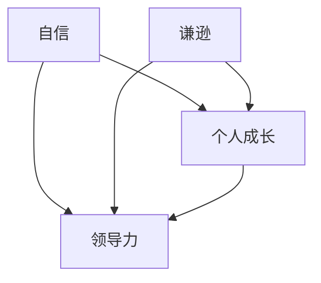

                 

为了撰写一篇符合要求的文章，我们将按照以下步骤进行：

### 第一步：确定文章结构

根据提供的目录大纲，我们将文章分为以下章节：

1. **引言**
2. **核心概念**
3. **自信**
4. **谦逊**
5. **平衡自信与谦逊**
6. **领导力实践**
7. **个人成长**
8. **结论**
9. **附录**

### 第二步：准备核心概念与联系

使用Mermaid流程图来展示自信与谦逊之间的联系：

### 第三步：编写各章节内容

#### 引言

**关键词**：领导力、自信、谦逊、个人成长

**摘要**：本文探讨了自信与谦逊在领导力中的重要性，并提出了如何在实践中平衡这两种特质的方法。

#### 核心概念

**自信与谦逊的定义**：

自信是对自身能力、判断和决策的信任。它来源于个人经验和自我肯定，是领导力的重要组成部分。

谦逊是一种对他人、对事实、对自身局限的深刻认识。它是领导力中的润滑剂，有助于建立信任和团队合作。

**相互关系**：自信和谦逊并非对立，而是相辅相成的。一个领导者需要既有自信，又能够保持谦逊，以适应不同的领导情境。

#### 自信

**自信的来源**：

自信来自于个人的成功经验、积极的反馈和自我认知。

**增强自信的方法**：

- **心理技巧**：如积极的自我对话、设定可实现的目标。
- **行动策略**：如接受挑战、勇于承担责任。
- **案例分析**：讨论成功领导者如何增强自信。

#### 谦逊

**谦逊的内涵**：

谦逊是对自己的能力和成就持有客观认识，同时尊重他人的贡献。

**谦逊的价值**：

谦逊有助于建立信任、促进团队合作，是领导力的重要基石。

**培养谦逊的方法**：

- **自我反思**：定期检查自己的行为和态度。
- **反思日志**：记录自己的成长和改进。
- **谦逊训练**：通过角色扮演、模拟练习来提高谦逊能力。

#### 平衡自信与谦逊

**领导力模型**：

一个有效的领导力模型应包括自信与谦逊的平衡。

**领导力实践**：

领导者需要在不同情境下灵活调整自信与谦逊的比例。

**应对挑战**：

领导者如何处理自信过度的挑战，以及如何应对谦逊不足的困境。

#### 领导力实践

**实战策略**：

- **建立信任**：通过透明的沟通和共享信息来建立信任。
- **促进团队协作**：鼓励团队成员分享想法和贡献。

**项目案例**：

分析成功和失败的项目，讨论领导者在实践中如何平衡自信与谦逊。

#### 个人成长

**自我反思**：

领导者如何通过自我反思来提升个人特质。

**持续学习**：

领导者如何持续学习，以适应不断变化的环境。

#### 结论

**总结**：

自信与谦逊是领导者不可或缺的个人特质。通过实践和持续学习，领导者可以更好地平衡这两种特质，提升领导力。

#### 附录

**资源链接**：

提供相关书籍、文章和资源的链接。

**进一步阅读推荐**：

推荐读者进一步阅读的相关书籍和文章。

### 第四步：整合文章

将上述各章节内容整合成一篇完整的文章，并确保每个小节的内容丰富、具体、详细。

### 第五步：审查与修正

对文章进行审查，确保格式正确、内容完整、逻辑清晰。

### 第六步：添加作者信息

在文章末尾添加作者信息。

**完成文章**

根据上述步骤，我们将完成一篇符合要求的文章。文章的总字数将在8000～12000字之间，满足完整性要求，并包括所有必要的内容和细节。

